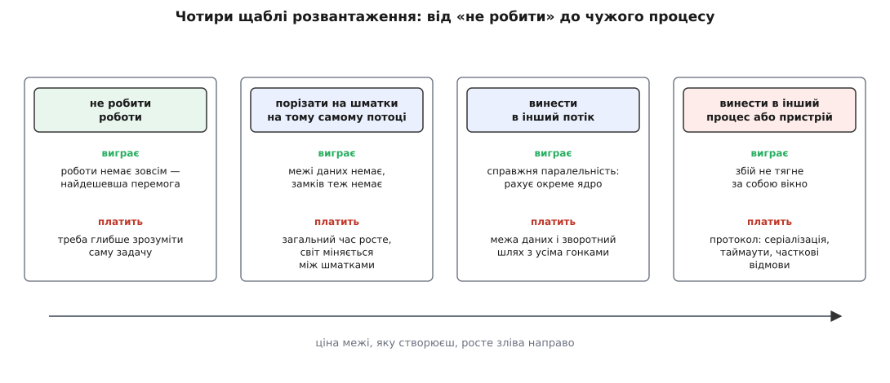

# Розвантаження потоку інтерфейсу

<preknowlist>
- [Цикл подій](topic:programming/event-loop) — одна нитка по колу дістає повідомлення з черги й виконує на кожне свій обробник; поки обробник не повернувся, наступне повідомлення чекає.
- [Процеси й потоки](topic:programming/process-vs-thread) — потік виконується сам по собі, але пам'ять у потоків одного процесу спільна.
- [Перегони даних і замки](topic:programming/data-races-locks) — коли двоє пишуть в одні дані без домовленості, результат непередбачуваний; замок упорядковує доступ ціною очікування.
- [Блокуючий і неблокуючий ввід-вивід](topic:programming/blocking-vs-nonblocking-io) — блокуючий виклик не повертається, доки не буде даних, і весь цей час потік просто стоїть.
</preknowlist>

Користувач натиснув «Відкрити» на файлі в сорок мегабайтів. Вікно посіріло, курсор став дзиґою, у заголовку з'явилося «(не відповідає)». Нічого не впало: програма саме цієї миті старанно розбирає той файл. У цьому й дивина — що ретельніше вона працює, то мертвішою виглядає. Річ не в тому, що розбір повільний. Річ у тому, **де** він виконується.

## Інтерфейсом володіє рівно один потік

У кожній графічній оболонці — від Win32 і Cocoa до Android, GTK і браузера — діє однакове правило: вікна, кнопки й усе дерево елементів чіпає лише один певний потік. Решта не має права навіть прочитати підпис на кнопці.

Правило здається зайвою суворістю, поки не спробуєш зробити навпаки. Дерево елементів — це спільні змінні дані, всередині яких усе пов'язане: розмір дитини порахований від розміру батька, а малювання мусить побачити дерево **цілим**, після всіх змін, а не посеред перебудови. Дозволь міняти вузли будь-кому будь-коли — і кадр намалюється по напівзробленій розкладці.

Очевидна латка — замок на дереві. Саме на ній усе й ламається, бо код інтерфейсу — це код зворотних викликів: оболонка кличе твій обробник, тримаючи свій внутрішній замок, а обробник з-під свого замка кличе оболонку. Виходять два протилежні порядки захоплення тих самих двох замків, і рано чи пізно обидва боки починають чекати один на одного назавжди. Такий збій не ловиться тестами: він трапляється тоді, коли клік випав рівно на ту мікросекунду.

Тому домовленість скрізь однакова: **один потік володіє інтерфейсом**, а всі інші, щоб щось у ньому змінити, кладуть повідомлення в його чергу. Виграш більший, ніж здається: усередині обробників не потрібно жодних замків — у дерева єдиний власник, тож гонок не може бути за побудовою. Плата рівно одна: **все, що виконується на цьому потоці, виконується замість малювання**.

## Кадр — це термін

Потік інтерфейсу крутить коло: вибрати події з черги → віддати їх обробникам → перерахувати розкладку → намалювати → віддати готове композиторові. Твої обробники — не окремий світ, вони виконуються всередині цього кола. Поки обробник не повернув керування, коло стоїть на місці: ввід накопичується в черзі, анімація завмирає, нового кадру не з'являється.

А кадр треба видавати за розкладом. Екран оновлюється з незмінною частотою, і час на один кадр — не побажання, а термін:

```
60 Гц   →  1000 / 60  = 16.67 мс на кадр
120 Гц  →  1000 / 120 =  8.33 мс
```

Причому весь цей час не твій: розкладка, малювання й композиція теж мусять кудись поміститися. Команда Chrome оцінює власні витрати рушія приблизно в 6 мс на кадр і радить лишати коду застосунку **близько 10 мс** при 60 Гц.

**Розбір 40 МБ JSON зі швидкістю ≈200 МБ/с просто в обробнику кнопки.**

```
тривалість = 40 / 200 = 0.2 с = 200 мс
кадрів по 16.67 мс усередині = 200 / 16.67 ≈ 12
```

Дванадцять кадрів поспіль не намальовано, і весь цей час жодна подія вводу не вибрана з черги.


*Довга задача не сповільнює інтерфейс на свою тривалість — вона його вимикає: цикл не доходить ні до вибирання вводу, ні до малювання.*

Звідси головне непорозуміння теми: термін — не про **середню** швидкість. Сто кадрів по 5 мс і один на 200 мс дають чудове середнє й водночас помітний ривок, який людина безпомилково бачить. Якість інтерфейсу міряють найгіршими кадрами, а не типовими.

Термінів насправді три, вкладених один в одного. **Кадровий, ~10 мс** — порушив, і рух став уривчастим; око бачить це на прокрутці, де картинка мусить іти за пальцем. **Реакційний, ~100 мс** — швидша за нього відповідь здається миттєвою; пороги людського сприйняття описав ще 1968 року Роберт Міллер, і модель RAIL команди Chrome досі будує на них свої вимоги: відповісти за 100 мс, а окремий шматок роботи тримати в межах 50 мс. **Терпіння системи, кілька секунд** — далі втручається вже операційна система: Windows підміняє вікно знімком із написом «Not Responding», Android оголошує ANR, якщо подія вводу не оброблена за 5 секунд, macOS показує кольорову дзиґу. *(Статус: усталено — за публікацією Міллера й документацією web.dev, Microsoft та Android.)*

> 🔧 **Навіщо це.** З трьох порогів виходить робочий критерій, що не залежить від смаку: операція на потоці інтерфейсу, довша за ~50 мс, — це дефект, а не «трохи повільно». Таке число можна поставити у вимірювання й у код-рев'ю замість суперечок «а мені здається, воно летить». Воно ж пояснює, чому «зробимо асинхронним, коли почнуть скаржитися» не працює: скаржитися почнуть на п'яти секундах, а зіпсовано все було на п'ятдесяти мілісекундах.

## Що з'їдає потік і чим його розвантажити

Винуватці бувають різні: синхронне читання файлу чи запит у мережу; чисте обчислення на кшталт розбору, декодування або сортування; очікування на замок, який тримає зайнятий фоновий потік; синхронний виклик у чужий процес; паузи середовища на кшталт складання сміття; нарешті — триста дрібних операцій на кадр, кожна по 0.05 мс. Двоє з цього списку особливо підступні: очікування на замок і пауза середовища не видно в профілі процесора взагалі, бо час пішов не на інструкції.

Способи розвантажити вишиковуються в драбину, і порядок на ній — не смак, а зростання ціни межі, яку ти створюєш.



*Кожен наступний щабель дає більше свободи й коштує дорожчої межі: спершу зникають замки, потім з'являються гонки, а наприкінці — цілий протокол між двома боками.*

Найважливіший тут перший щабель, і йому найменше приділяють уваги. Винести в потік алгоритм зі складністю O(n²) — означає зробити не швидко, а **пізно**: відповідь однаково прийде через дві секунди, просто вікно при цьому малюватиметься. Список на десять тисяч рядків не треба будувати цілим, бо на екрані видно тридцять. Такі рішення дають найбільші множники — але тільки після [вимірювання](topic:programming/profiling), бо здогад про те, куди йде час, помиляється систематично.

Другий щабель — нарізка — тримає кадр так само добре, як фоновий потік, і при цьому не створює жодної гонки. [Пул потоків](topic:programming/thread-pool) потрібен тоді, коли роботи стільки, що вона мусить рахуватися **паралельно** з малюванням, а не в проміжках між ним.

## Ціна межі й дорога назад

Щойно робота пішла в інший потік, з'являється питання, якого не було: як віддати їй дані й забрати відповідь. Скопіювати — найбезпечніше, бо спільної пам'яті немає, зате ціна росте з розміром і легко переростає ту роботу, заради якої все затівалося. Передати власність — вартість не залежить від розміру, бо рухається лише покажчик, а відправник свій доступ утрачає. Покласти в спільну пам'ять під замком — найшвидше й найнебезпечніше, бо замок повертає в систему рівно ту властивість, яку ми виганяли: **можливість потоку інтерфейсу чекати**.

Звідси правило, варте того, щоб бути безумовним: потік інтерфейсу не чекає ні на кого. Замок на ньому припустимий лише тоді, коли можна довести, що час утримання короткий. Якщо ж під замком читається файл або крутиться цикл невідомої довжини, там має бути черга повідомлень, з якої беруть без очікування.

Показати результат може тільки власник дерева, тому фоновий потік не міняє підпис на кнопці сам — він кладе завдання в чергу потоку інтерфейсу; це називають маршалінгом (англ. *marshalling*, від *marshal* — «шикувати, впорядковувати»). Це проста частина. Складне в тому, що між початком роботи й відповіддю минув час, і світ устиг змінитися чотирма способами.

**Адресата вже немає** — діалог закрили, а завдання тримає покажчик на знищений об'єкт, і застосунок падає рівно в момент успіху. **Відповідь застаріла** — на запити `a`, `ab`, `abc` фоновий пул відповість у довільному порядку, тож на екрані може лишитися результат запиту, якого вже немає; ліки прості й майже безкоштовні — лічильник поколінь: кожен новий запит збільшує число, відповідь несе своє число із собою, і перед показом вони звіряються. **Робота більше не потрібна** — скасувати її можна тільки добровільно, бо вбитий посеред роботи потік лишить по собі захоплені замки й недобудовані структури, тому [кооперативне скасування](topic:programming/cooperative-cancellation) закладають у цикл із першого дня. **Робота впала** — виняток у фоновому потоці нікуди не спливає, і якщо не передати його назад тим самим маршалінгом, користувач отримає вічне «Завантаження…».

Кожен винесений шматок роботи має рівно три можливі закінчення — результат, помилка, скасування, — і всі три мусять мати дорогу назад.

І сама черга фонової роботи має дно. Якщо завдання надходять швидше, ніж рахуються, черга без стелі — не рішення, а повільніше зависання: вона росте, доки не з'їсть пам'ять, а кожна відповідь приходить дедалі старішою. Там, де потрібен лише останній результат, місткість у одиницю не втрачає нічого. Там, де команди губити не можна, потрібна обмежена черга з чесною відмовою.

Найкорисніше тут — перевернути звичну постановку питання. «Що винести з потоку інтерфейсу» питають уже після того, як усе написано й гальмує, і відповідь щоразу виходить латкою. Точніше питати навпаки: **що взагалі має право виконуватися на цьому потоці**. Білий список короткий — вибрати ввід, змінити дерево, перерахувати розкладку, намалювати. Решта — прибульці, і кожен мусить окремо довести, що вкладеться в десять мілісекунд. Тоді розвантаження стає тим, чим воно є насправді: рішенням про власність — хто володіє даними, хто зобов'язаний видати кадр за розкладом і як відповідь від першого потрапляє до другого. Ці ж питання визначають [загальну будову клієнтського застосунку](topic:programming/desktop-app-architecture).
