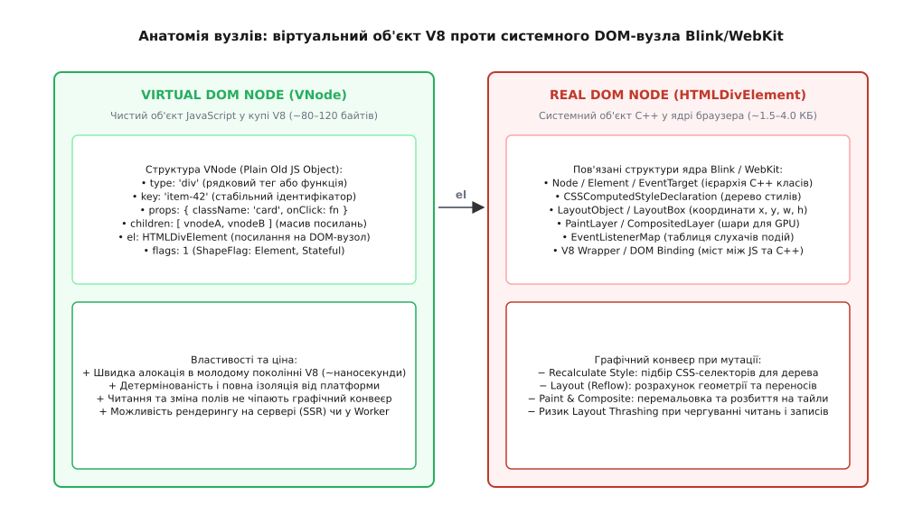
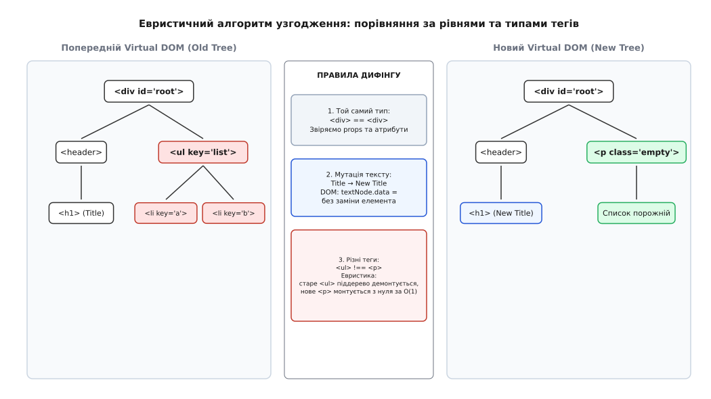
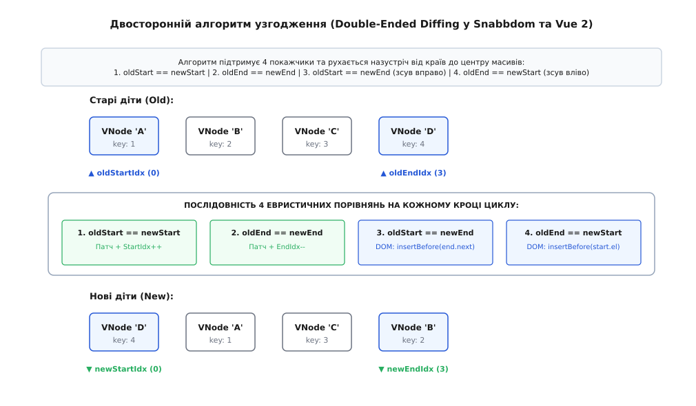
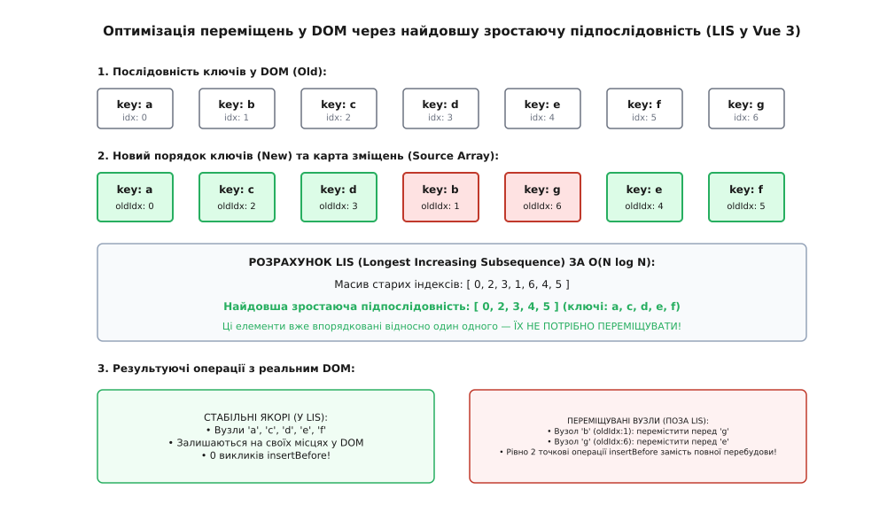
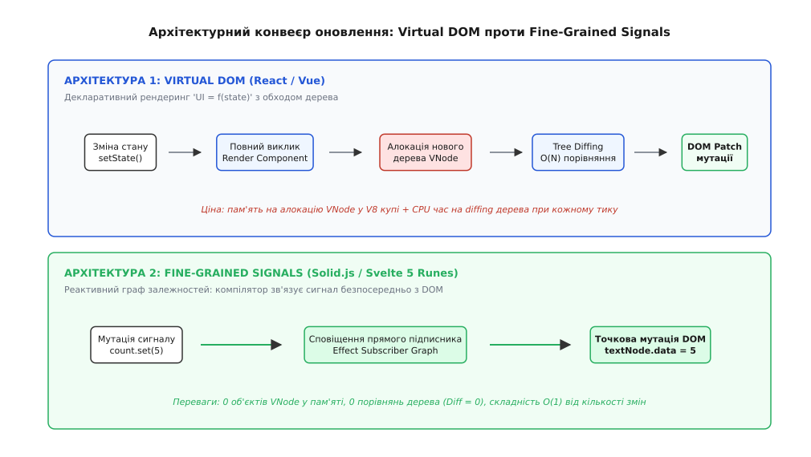

# Віртуальне дерево подання і звіряння (diffing)

<preknowlist>
- [Прив'язка даних](topic:programming/data-binding) — як декларативні шаблони пов'язують модель зі станом інтерфейсу та чому пряме оновлення DOM вимагає пакетування мутацій.
- [Цикл подій](topic:programming/event-loop) — черги мікрозадач, взаємодія подій введення, розрахунку стилів та стадії відмальовки кадру в потоці браузера.
- [Динамічне програмування](topic:algorithms/dynamic-programming) — розбиття складної задачі оптимізації на підзадачі та збереження проміжних результатів для пошуку найдовших спільних послідовностей.
- [Відстань Левенштейна](topic:algorithms/levenshtein-distance) — редакторська відстань між послідовностями та мінімальна кількість операцій вставки, видалення й заміни.
</preknowlist>

Користувач відкрив каталог товарів на 1000 позицій і натиснув сортування за ціною. Наївна реалізація інтерфейсу скинула старий вміст таблиці через присвоєння `container.innerHTML = render(items)` і згенерувала розмітку заново. Через частку секунди екран смикнувся: активне поле фільтрації втратило фокус клавіатури, введений текст зник, смуга прокручування підскочила на початок списку, а графічний потік браузера зафіксував випадання шести кадрів поспіль із затримкою у 110 мілісекунд. Процесор не розв'язував складних аналітичних задач: він витратив увесь цей час на знищення та повторне конструювання тисяч системних графічних об'єктів, які на 99% були ідентичні попереднім.

Цей конфлікт лежить у самій природі веб-інтерфейсів: декларативна модель розробки вимагає описувати інтерфейс як просту функцію від поточного стану `UI = f(state)`, тоді як реальне дерево документа в браузері є надзвичайно дорогим, мутабельним і збереженим у системній пам'яті об'єктом.

## Реальне дерево документа та прихована ціна мутацій

Дерево об'єктної моделі документа (англ. *Document Object Model*, DOM) у браузерних рушіях — таких як Blink у Chromium або WebKit у Safari — це не просто деревоподібна структура даних у пам'яті JavaScript. Це складний багатошаровий комплекс об'єктів, написаний мовою C++, де кожен вузол безпосередньо прив'язаний до підсистем розрахунку стилів, геометрії та растеризації.



*Анатомія вузлів інтерфейсу. Зліва — чистий JavaScript-об'єкт віртуального вузла в купі V8 вагою близько сотні байтів. Справа — системний C++ об'єкт DOM-вузла браузера із прив'язаними шарами стилів, геометрії та малювання.*

Кожен реальний елемент `<div>` або `<span>` у браузері утримує в оперативній пам'яті такі структури:
1. **Об'єкт вузла C++ (`Element` / `Node`):** базова ієрархія класів із таблицями віртуальних методів, лічильниками посилань пам'яті, переліком атрибутів та внутрішньою таблицею слухачів подій (`EventListenerMap`).
2. **Об'єкт розкладки (`LayoutObject` або `RenderObject`):** структура, що зберігає точні геометричні координати `x, y`, ширину, висоту, відступи (*margins, paddings*), правила перенесення слів та контекст блочного або інлайн-форматування (*BFC / IFC*).
3. **Обчислений стиль (`CSSComputedStyleDeclaration`):** повна таблиця всіх фінальних CSS-властивостей елемента з урахуванням каскаду, успадкування та специфічності селекторів.
4. **Шар відмальовки (`PaintLayer` / `CompositedLayer`):** контекст для графічного процесора (GPU), якщо елемент має 3D-трансформації, прозорість, фільтри або власну область прокручування.
5. **V8 Wrapper (C++ Binding):** проміжний об'єкт-міст, який дозволяє коду JavaScript керувати C++ структурами ядра рушія через таблицю експортів.

Сумарний розмір пам'яті для одного реального DOM-вузла становить від 1.5 до 4.0 КБ. Дерево зі стандартної веб-сторінки на 3000 вузлів утримує близько 10–12 МБ системних структур ядра.

Коли JavaScript виконує пряму мутацію реального DOM — наприклад, `node.appendChild()` або `node.className = "active"`, — рушій браузера запускає графічний конвеєр:

```
JavaScript Mutation  →  Recalculate Style  →  Layout (Reflow)  →  Paint  →  Composite
```

- **Перерахунок стилів (Recalculate Style):** механізм `ElementRuleCollector` зіставляє всі активні правила таблиць стилів із модифікованими вузлами та їхніми нащадками. Для прискорення перевірок браузери використовують фільтри Блума (*Bloom filters*), проте на великих піддеревах перерахунок масштабується лінійно від кількості вузлів.
- **Розкладка (Layout / Reflow):** рекурсивний прохід по дереву `LayoutObject` для розрахунку фізичних піксельних меж кожного блоку. Зміна розміру або позиції одного вузла вгорі сторінки інвалідує розкладку всіх наступних сусідів і батьківських контейнерів.
- **Малювання (Paint):** генерація списку команд растеризації (текст, кольори фону, тіні, межі) у системні растрові буфери.
- **Компонування (Composite):** розбиття документа на растрові плитки (*tiles*), завантаження їх у текстурну пам'ять GPU (*VRAM*) та фінальне накладання шарів на екрані.

### Пастка примусового синхронного компонування (Layout Thrashing)

Особливо руйнівним для продуктивності є чергування записів і читань геометричних властивостей у циклі:

```ts
// Антипатерн Layout Thrashing
for (let i = 0; i < items.length; i++) {
  // Запис (інвалідує геометрію дерева)
  elements[i].style.width = newWidths[i] + "px";
  // Читання (змушує браузер негайно виконати синхронний Reflow!)
  const height = elements[i].offsetHeight;
  elements[i].style.height = height * 2 + "px";
}
```

У нормальному режимі браузер накопичує мутації та відкладає розрахунок геометрії до кінця поточного макротаска циклу подій. Проте звернення до `offsetHeight`, `scrollTop` або `getBoundingClientRect()` після зміни стилю змушує рушій зупинити виконання скрипту і миттєво виконати повний синхронний перерахунок геометрії прямо під час ітерації. Десять таких операцій у циклі перетворюють 16-мілісекундний кадр на 200-мілісекундне зависання сторінки.

### Знищення внутрішнього стану елементів

Пряма заміна піддерева через `innerHTML` або повне перестворення вузлів розриває зв'язок із контекстом користувача:
- Втрачається фокус активного елемента (`document.activeElement`);
- Скидається позиція текстового курсора (`selectionStart`, `selectionEnd`);
- Зникають незбережені дані некерованих полів форми (`<input>`, `<textarea>`, вибір файлу в `<input type="file">`);
- Переривається відтворення медіафайлів (`<audio>`, `<video>`) та скидається стан завантаження вкладених `<iframe>`;
- Перериваються плавні апаратні CSS-анімації та переходи (*transitions*).

Щоб зберегти швидкість розробки через концепцію чистого рендерингу `UI = f(state)` і водночас уникнути постійного перестворення важких C++ об'єктів DOM, було розроблено проміжний рівень абстракції — **віртуальне дерево документа**.

## Структура віртуального вузла (VNode)

Віртуальний вузол (англ. *Virtual Node*, VNode) — це легковажний, незмінний об'єкт JavaScript, який описує бажаний стан реального DOM-елемента, але не має жодних прямих прив'язок до графічного ядра браузера.

VNode містить лише мінімально необхідні поля:

```ts
interface VNode {
  type: string | Function;           // Тег ('div', 'p') або компонент
  props: Record<string, any>;        // Атрибути, стилі, класи та слухачі подій
  children: Array<VNode | string>;   // Вкладені віртуальні вузли або текст
  key?: string | number;             // Унікальний ідентифікатор для узгодження
  dom?: Node;                        // Посилання на створений реальний DOM-вузол
  flags?: number;                    // Бітові прапорці оптимізації (ShapeFlags)
}
```

Створення віртуального вузла виконується через фабричну функцію, традиційно названу `h` (від *hyperscript* — вираз для створення гіпертексту):

```ts
const vnode = h("div", { className: "card", id: "user-42" }, [
  h("h2", { className: "title" }, "Олександр"),
  h("p", null, "Статус: активний")
]);
```

У сучасних середовищах цей код частіше записують у синтаксисі JSX (`<div className="card">...</div>`), який компілятор (Babel, SWC або TypeScript) автоматично транслює у виклики `h()` або `jsx()`.

```
Вихідний код JSX  →  Компілятор (Babel/SWC)  →  Виклики h(tag, props, children)  →  Дерево VNode
```

### Чому VNode працює швидко

1. **Мінімальна вартість у пам'яті:** створення VNode — це створення простого словника в купі V8 вагою ~80–120 байтів. Воно виконується за наносекунди в молодому поколінні пам'яті (*Nursery / Young Generation GC*), очищення якого практично безкоштовне.
2. **Ізоляція від графічного конвеєра:** маніпуляції з віртуальним деревом (порівняння полів, пошук дітей, зміна властивостей) відбуваються в ізольованому середовищі JavaScript. Вони не викликають Recalculate Style, Layout чи Paint.
3. **Делегування подій (Event Delegation):** замість навішування індивідуальних слухачів подій на кожен DOM-вузол промислові рушії VDOM реєструють єдиний глобальний слухач на корені документа (`document.addEventListener`), перехоплюючи спливаючі події та зіставляючи їх із віртуальним деревом за час `O(1)`. Це економить мегабайти оперативної пам'яті на реєстрації C++ `EventListenerMap`.
4. **Платформна незалежність:** оскільки VNode — це абстрактні дані, одне й те саме віртуальне дерево можна транслювати в DOM браузера, у рядки HTML на сервері (SSR — Server-Side Rendering), у нативні віджети iOS/Android (як у React Native), або у виклики Canvas/WebGL.

Повну працюючу реалізацію структур даних, фабрики `h` та функцій монтування наведено у практичній вставці [⚙️ Робочий VDOM-рушій: h, diff та patch](topic:programming/virtual-dom/proj-vdom-engine.md).

> 🔧 **Навіщо це.** Віртуальний вузол перетворює роботу з інтерфейсом із непередбачуваної мутації зовнішнього середовища браузера на чисте обчислення різниці двох структур даних у пам'яті процесу.

## Алгоритм узгодження (Reconciliation) та евристика O(N)

Процес порівняння двох послідовних зліпків віртуального дерева та знаходження мінімального набору змін для перенесення в реальний DOM називається **узгодженням** (англ. *Reconciliation*), а сам алгоритм порівняння — **дифінгом** (англ. *diffing*).

### Математичний бар'єр: чому точний алгоритм непридатний

Знаходження мінімальної кількості операцій редагування (вставка, видалення, заміна вузлів) для перетворення одного довільного впорядкованого дерева в інше є класичною задачею комп'ютерних наук — **відстанню редагування дерев** (англ. *Tree Edit Distance*, TED).

Найвідоміший точний алгоритм розв'язання цієї задачі — алгоритм Чжана—Шаші (*Zhang-Shasha Algorithm*) на базі динамічного програмування — має часову складність:

```
O(|T₁| · |T₂| · min(depth₁, leaves₁) · min(depth₂, leaves₂))
```

Для двох довільних дерев із кількістю вузлів `N` це вимагає порядка `O(N³)` операцій.

Якщо сторінка інтерфейсу містить `N = 1000` елементів, точний алгоритм мав би виконати:

```
1000³ = 1 000 000 000  [один мільярд операцій порівняння]
```

Навіть на високопродуктивному процесорі розрахунок такого дифінгу зайняв би кілька секунд, що повністю заблокувало б інтерфейс і порушило ліміт часу на кадр у 16.67 мс (для 60 Гц).

Детальне математичне виведення рівнянь динамічного програмування та доведення кубічної складності наведено у теоретичній вставці [🧮 Чому точне звіряння дерев вимагає O(N³)](topic:programming/virtual-dom/math-tree-diff.md).

### Дві евристики лінійного дифінгу

Щоб зменшити обчислювальну складність від неприйнятного `O(N³)` до лінійного `O(N)`, рушії Virtual DOM спираються на дві практичні евристики, які враховують специфіку веб-інтерфейсів:



*Евристичне узгодження дерев. Звіряння відбувається строго за рівнями. Якщо тип тегу збігається, оновлюються лише змінені атрибути та текст. Якщо теги різні (`<ul>` змінився на `<p>`), старе піддерево повністю демонтується, а нове монтується з нуля за O(1).*

#### 1. Евристика незмінності типів (Different Element Types)

Два віртуальні вузли різних типів (наприклад, `<div>` та `<span>`, або компонент `<UserProfile>` та `<LoginForm>`) гарантовано породжують абсолютно різні дерева елементів.

Коли алгоритм під час покрокового обходу бачить зміну типу вузла на певному рівні, він **не намагається шукати схожість** між їхніми нащадками. Рушій виконує дві дії:
1. Повністю демонтує (*unmount*) старе піддерево разом із відповідними DOM-вузлами, очищаючи слухачі подій та внутрішній стан;
2. Створює та монтує (*mount*) нове піддерево з нуля.

Це відсікає необхідність перехресного порівняння вглиб між несумісними гілками.

#### 2. Евристика ізоляції рівнів та стабільних ключів (Level Isolation & Keys)

Алгоритм узгодження порівнює вузли строго **рівень за рівнем** (англ. *breadth-first / level-by-level*). Вузли на рівні `K` старого дерева звіряються виключно з вузлами на рівні `K` нового дерева.

Для зіставлення колекцій братніх елементів на одному рівні використовується спеціальний атрибут — **ключ** (`key`). Завдяки ключам алгоритм миттєво визначає, які елементи збереглися, які були додані, а які змінили своє положення.

#### Обрізання піддерев на рівні компонентів (Component Subtree Pruning)

Перед тим як спускатися вглиб DOM-вузлів компонента, рушій виконує оптимізацію відсікання гілок (*tree pruning*). Якщо властивості компонента не змінилися (порівняння `shallowEqual(oldProps, newProps)` у `React.memo`, `PureComponent` або бітові маски `PatchFlags` у Vue 3), усе піддерево цього компонента пропускається за `O(1)`. Рушій навіть не генерує нові VNode для цієї гілки, що значно скорочує фактичний час обходу.

Завдяки цим евристикам складність звіряння двох дерев розміром `N` стає строго лінійною — `O(N)`.

## Звіряння списків дочірніх вузлів: еволюція підходів

Найскладнішою частиною узгодження є порівняння двох масивів дітей одного батьківського вузла. Нехай у списку було 5 елементів, і користувач додав новий елемент на самий початок.

### Катастрофа наївного поіндексного порівняння

Якщо порівнювати елементи просто за їхніми порядковими індексами `0, 1, 2...`:

```
Старий список: [ A, B, C, D ]
Новий список:  [ X, A, B, C, D ]
```

1. Індекс 0: було `A`, стало `X` → рушій перемальовує DOM-вузол 0 (замінює текст, атрибути);
2. Індекс 1: було `B`, стало `A` → рушій перемальовує DOM-вузол 1;
3. Індекс 2: було `C`, стало `B` → рушій перемальовує DOM-вузол 2;
4. Індекс 3: було `D`, стало `C` → рушій перемальовує DOM-вузол 3;
5. Індекс 4: створюється новий DOM-вузол для `D`.

Замість **однієї** елементарної операції `insertBefore(X, nodeA)` наївний алгоритм виконав **чотири важкі мутації вмісту** існуючих вузлів та одне додавання в кінець.

Щоб розв'язати цю проблему, було створено три покоління спеціалізованих алгоритмів звіряння списків.

### 1. Двосторонній алгоритм (Double-Ended Diffing) — Snabbdom та Vue 2

Двосторонній алгоритм підтримує 4 покажчики, які рухаються назустріч від країв до центру масивів: `oldStartIdx`, `oldEndIdx`, `newStartIdx`, `newEndIdx`.



*Двосторонній алгоритм узгодження. Чотири покажчики звужують область пошуку, зіставляючи елементи за 4 правилами: початок-початок, кінець-кінець, початок-кінець (перенесення вправо) та кінець-початок (перенесення вліво).*

На кожному кроці циклу виконується 4 швидкі перевірки за ключем:
1. `oldStart.key == newStart.key` — вузол залишився на початку. Патчимо властивості, зміщуємо обидва старти вправо (`oldStart++`, `newStart++`).
2. `oldEnd.key == newEnd.key` — вузол залишився в кінці. Патчимо властивості, зміщуємо обидва кінці вліво (`oldEnd--`, `newEnd--`).
3. `oldStart.key == newEnd.key` — вузол перемістився з початку в кінець. Викликаємо `parent.insertBefore(oldStart.dom, oldEnd.dom.nextSibling)` і оновлюємо покажчики (`oldStart++`, `newEnd--`).
4. `oldEnd.key == newStart.key` — вузол перемістився з кінця на початок. Викликаємо `parent.insertBefore(oldEnd.dom, oldStart.dom)` і оновлюємо покажчики (`oldEnd--`, `newStart++`).

Якщо жодна з 4 перевірок не спрацювала, рушій виконує пошук `newStart`-елемента у заздалегідь збудованій хеш-таблиці ключів старих дітей. Знайдений елемент переноситься на потрібну позицію, а новий — створюється.

Цей алгоритм надзвичайно ефективний для типових користувацьких патернів (додавання в кінець/початок списку, видалення, розворот списку).

### 2. Алгоритм на базі LIS (Longest Increasing Subsequence) — Vue 3 та Inferno

Хоча двосторонній алгоритм працює швидко, при складних випадкових перестановках (*shuffle*) він виконує більше переміщень у DOM, ніж мінімально необхідно.

Vue 3 застосовує оптимізацію на основі **найдовшої зростаючої підпослідовності** (англ. *Longest Increasing Subsequence*, LIS):



*Оптимізація переміщень через LIS. Алгоритм будує масив старих індексів і знаходить у ньому найдовшу зростаючу підпослідовність. Вузли підпослідовності залишаються нерухомими в DOM, а переміщуються лише ті, що опинилися поза нею.*

1. **Фаза вирівнювання:** алгоритм зрізає однакові префікси та суфікси списків.
2. **Побудова карти зміщень:** для залишку формується масив `sources`, де зафіксовано початковий індекс кожного елемента.
3. **Розрахунок LIS:** алгоритм бінарного пошуку знаходить найдовшу монотонно зростаючу послідовність індексів за час `O(K log K)`.
4. **Мінімальні переміщення:** елементи, що увійшли до LIS, вважаються **стабільними якорями** — вони вже правильно впорядковані один відносно одного і взагалі не чіпаються в DOM! Рушій викликає дорогий `insertBefore` виключно для елементів поза LIS.

### 3. Однопрохідне узгодження волокон — React Fiber

React використовує односпрямований алгоритм, адаптований під структуру однозв'язного графа волокон (*Fiber*). Він робить один прохід зліва направо, порівнюючи старі та нові вузли.

Якщо порядок змінився, React формує хеш-таблицю `Map<key, Fiber>` і відстежує змінну `lastPlacedIndex` — максимальний індекс зі старого списку, що зустрівся серед уже розміщених нових елементів. Якщо знайдений старий індекс менший за `lastPlacedIndex`, елемент позначається прапорцем на переміщення в DOM.

Детальний порівняльний аналіз цих підходів із таблицею складності наведено у вставці [🔌 Порівняння алгоритмів узгодження: Double-Ended проти LIS проти Fiber](topic:programming/virtual-dom/comp-reconciliation-strategies.md).

## Механізм ключів (key prop) та типові пастки

Ключ (`key`) — це спеціальний атрибут віртуального вузла, який слугує **унікальним стабільним ідентифікатором** сутності бізнес-логіки в межах поточної колекції братніх елементів.

Ключ створює однозначну бієкцію між даними моделі та конкретним фізичним екземпляром DOM-вузла:

```
Entity ID: "usr-91"  ←── Бієктивний зв'язок key ──→  HTMLDivElement (DOM Node #4)
```

Коли масив даних фільтрується, сортується або доповнюється, рушій узгодження орієнтується не на індекс у масиві, а на значення `key`.

### Пастка 1: Використання індексу масиву як ключа (`key={index}`)

Поширена помилка початківців — використання порядкового індексу ітератора як ключа:

```tsx
// Небезпечний код!
{items.map((item, index) => (
  <TodoItem key={index} text={item.text} />
))}
```

Уявімо, що список містить 3 елементи: `[A, B, C]`. Користувач видаляє перший елемент `A`.

```
Було:  Елемент A (key=0), Елемент B (key=1), Елемент C (key=2)
Стало: Елемент B (key=0), Елемент C (key=1)
```

Що бачить алгоритм узгодження:
1. `key=0`: був `A`, став `B` → оновлюємо властивості існуючого першого DOM-вузла;
2. `key=1`: був `B`, став `C` → оновлюємо властивості існуючого другого DOM-вузла;
3. `key=2`: вузла більше немає в новому списку → видаляємо третій DOM-вузол з документа.

#### Фатальні наслідки:
- **Злам некерованого стану:** якщо `<TodoItem>` містив внутрішній стан (наприклад, локальний прапорець розкриття опису або поле введення `<input>` без `value`), цей стан був прив'язаний до першого DOM-вузла. У результаті прапорець, який належав елементу `A`, візуально залишиться увімкненим на елементі `B`!
- **Збій фокусу та анімацій:** якщо курсор стояв у полі введення першого елемента, після видалення фокус залишиться на першому рядку, але там уже відображатимуться чужі дані.

> 🔧 **Навіщо це.** Індекс масиву допустимий як `key` лише за одночасного виконання трьох умов: список строго статичний (немає сортування, фільтрації та динамічної вставки), елементи не мають власного внутрішнього стану (чисті компоненти), і елементи ніколи не видаляються з середини чи початку. В усіх інших випадках ключ зобов'язаний бути стабільним бізнес-ідентифікатором (`item.id`).

### Пастка 2: Випадкові значення як ключ (`key={Math.random()}`)

Генерація випадкових ключів під час кожного виклику функції рендерингу призводить до катастрофічних наслідків:

```tsx
// Руйнівний код!
<UserProfile key={Math.random()} user={currentUser} />
```

Під час кожного оновлення стану батьківського компонента:
1. Алгоритм узгодження бачить старий ключ (наприклад, `0.4812`) і новий ключ (`0.8931`);
2. Оскільки ключі не збігаються, евристика вважає, що старий компонент видалено, а на його місце прийшов абсолютно новий;
3. Реальний DOM-вузол повністю знищується (*unmount*), викликаючи зняття слухачів і скидання стилів;
4. Створюється абсолютно новий DOM-вузол (*mount*) з виділенням нової пам'яті в C++ ядрі браузера;
5. Користувач втрачає фокус введення на кожному натисканні клавіші, виділений текст зникає, а позиція прокручування піддерева стрибає на нуль.

### Пастка 3: Неунікальні або складені дубльовані ключі

Якщо в колекції зустрічаються два елементи з однаковим `key="item-1"`, внутрішня хеш-таблиця `oldKeyMap` збереже лише один із них, перезаписавши посилання на DOM-вузол другого. Під час наступної фази видалення або переміщення рушій спробує виконати системну операцію над втраченим вузлом, що спричинить викидання браузерного винятку `NotFoundError: Node was not found`. У продуктових застосунках для гарантування унікальності формують складені ключі: `${item.type}_${item.id}`.

## Патчинг (Patching) та пакетування оновлень

Після завершення обходу двох віртуальних дерев алгоритм формує набір мінімальних мутацій — **патч** (англ. *patch*).

Патч транслюється в прямі виклики нативного DOM API браузера:
- `element.setAttribute(name, value)` / `element.removeAttribute(name)` — для зміни HTML-атрибутів;
- `element.className = ...` та `Object.assign(element.style, ...)` — для класів та інлайн-стилів;
- `textNode.nodeValue = newText` — для точкового оновлення текстового вмісту без заміни вузла;
- `element.addEventListener()` / `element.removeEventListener()` — для синхронізації подій;
- `parent.insertBefore(newNode, referenceNode)` / `parent.removeChild(oldNode)` — для зміни структури дітей.

### Пакетування мутацій у черзі мікрозадач

Якщо компонент послідовно змінює три незалежні змінні стану:

```ts
setName("Богдан");
setAge(28);
setStatus("online");
```

Було б неприпустимо запускати повний цикл рендерингу та дифінгу тричі поспіль.

Сучасні рушії використовують **пакетування оновлень** (англ. *batching*). Запити на рендеринг реєструються у внутрішній черзі та відкладаються до завершення поточного синхронного коду за допомогою мікрозадачі:

```ts
let isScheduled = false;
const updateQueue = new Set<Component>();

export function scheduleUpdate(component: Component) {
  updateQueue.add(component);

  if (!isScheduled) {
    isScheduled = true;
    queueMicrotask(flushUpdates);
  }
}

function flushUpdates() {
  for (const component of updateQueue) {
    component.update();
  }
  updateQueue.clear();
  isScheduled = false;
}
```

Завдяки черзі мікрозадач (`queueMicrotask`) усі синхронні мутації стану зливаються в один-єдиний прохід дифінгу, а результуючі зміни потрапляють у реальний DOM за один спільний такт графічного конвеєра браузера.

Історію розвитку цієї архітектури від перших прототипів Facebook у 2011 році до сучасних промислових рушіїв описано у вставці [📜 Як криза двостороннього зв'язування породила Virtual DOM](topic:programming/virtual-dom/hist-vdom-origins.md).

## Межі ефективності та альтернативні архітектури

Попри колосальний вплив Virtual DOM на індустрію, ця концепція не є безкоштовною.

### Накладні витрати Virtual DOM

1. **Тиск на збирач сміття (GC Pressure):** під час кожного виклику `render()` компонент створює десятки нових об'єктів VNode для кожного заголовка, кнопки чи блоку, навіть якщо на екрані змінилася одна цифра. Ці об'єкти існують частку мілісекунди, після чого потрапляють у чергу збирача сміття V8. У високонавантажених застосунках (наприклад, фінансові термінали з потоковими котируваннями) часті паузи GC викликають мікрозатримки інтерфейсу.
2. **Накладні витрати на звіряння (Diffing Overhead):** щоб переконатися, що 999 вузлів із 1000 не змінилися, рушій зобов'язаний рекурсивно обійти всі 1000 пар об'єктів і попарно перевірити їхні поля `props`. Час виконання дифінгу масштабується від розміру всього дерева компонента `O(Tree Size)`, а не від кількості реально змінених даних `O(Dirty State)`.

Це спонукало інженерів до створення альтернативних архітектурних моделей рендерингу:



*Порівняння конвеєрів оновлення. Virtual DOM перерендерить компоненти цілком, генеруючи віртуальні дерева в пам'яті для обчислення diff. Тонка реактивність на сигналах зв'язує зміну даних безпосередньо з цільовим текстовим DOM-вузлом за O(1).*

### 1. Інкрементальний DOM (Incremental DOM — Google Closure, Angular Ivy)

Замість створення дерева об'єктів у купі пам'яті перед кожним звірянням, шаблон компілюється в набір послідовних інструкцій виклику:

```ts
// Скомпільований код Incremental DOM
function render() {
  elementOpen('div', null, ['class', 'card']);
  elementOpen('h1');
  text(state.title);
  elementClose('h1');
  elementClose('div');
}
```

Під час виконання ці інструкції безпосередньо проходять по **реальному існуючому DOM-дереву**, покроково звіряючи атрибути на місці (*in-place diffing*).
- **Перевага:** нульова алокація проміжних об'єктів у пам'яті JavaScript (ідеально для мобільних пристроїв з обмеженим обсягом RAM).
- **Недолік:** нижча швидкість обчислення різниці порівняно з чистими JS-об'єктами через накладні витрати на читання властивостей реального DOM.

### 2. Тонка реактивність без VDOM (Fine-Grained Signals — Solid.js, Svelte 5)

Найрадикальніший крок зробили сучасні компіляторні каркаси з тонкою реактивністю на базі **сигналів** (*Signals / Runes*).

У цій архітектурі віртуального дерева не існує взагалі:
1. Компілятор аналізує шаблон і генерує статичну розмітку через клонування нативних шаблонів `template.cloneNode(true)`.
2. Динамічні вирази компілюються в прямі реактивні підписки:

```ts
// Скомпільований код Solid.js
const div = template.cloneNode(true);
const textNode = div.firstChild;

// Пряма підписка на сигнал count
createEffect(() => {
  textNode.data = count(); // Точкова мутація реального вузла за O(1)!
});
```

Коли стан змінюється, функція компонента **не викликається повторно**, віртуальне дерево не створюється, а алгоритм дифінгу не запускається. Сигнал напряму викликає функцію ефекту, яка точково мутує значення одного текстового вузла за час `O(1)`.

## Критерії вибору архітектури

| Критерій оцінки | Virtual DOM (React, Vue) | Incremental DOM (Angular Ivy) | Fine-Grained Signals (Solid, Svelte) |
| :--- | :--- | :--- | :--- |
| **Парадигма стану** | Незмінний стан (*Immutable State*) | Мутабельний / Потоковий | Реактивні примітиви (*Signals*) |
| **Накладні витрати пам'яті** | Високі (алокація VNode на кожен рендер) | Мінімальні (нульова алокація об'єктів) | Низькі (лише граф підписок ефектів) |
| **Складність оновлення** | `O(Tree Size)` (залежить від розміру дерева) | `O(Tree Size)` | `O(Changed State)` (строго за кількістю змін) |
| **Багатоплатформенність** | Максимальна (Web, Native, SSR, Canvas) | Середня (орієнтація на браузер) | Добра (потребує адаптерів рендерингу) |
| **Гнучкість композиції** | Динамічні компоненти як функції вищого порядку | Шаблонні директиви | Компіляторний аналіз шаблонів |

Virtual DOM залишається надійним і перевіреним фундаментом для великих багатоплатформенних екосистем, де важлива динамічна композиція компонентів та ізоляція від середовища виконання. Водночас у системах із високими вимогами до частоти оновлення кадрів та обмеженими ресурсами пам'яті архітектура зміщується в бік тонкої реактивності та прямих точкових мутацій.
