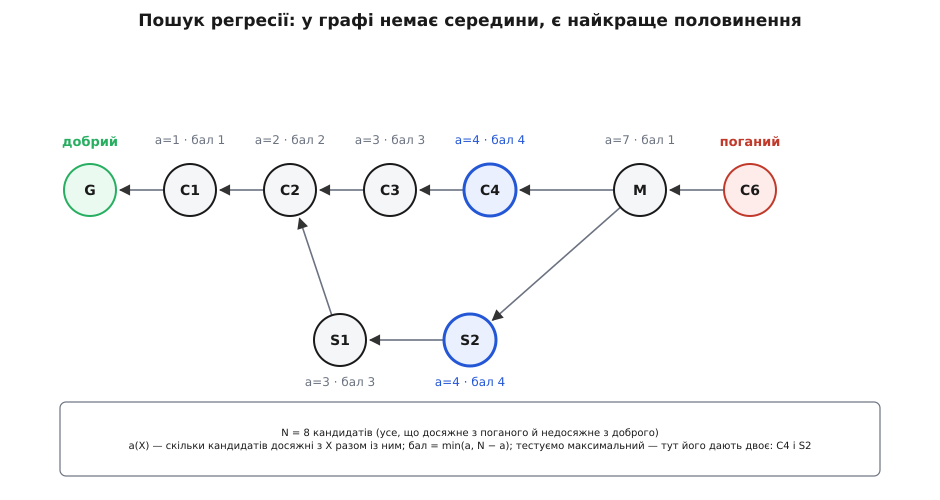

# Гілки, злиття, ребейз і пошук регресії

<preknowlist>
- [Контроль версій і git](book:programming/version-control) — коміт як знімок усього проєкту, ім'я-хеш, гілка як рухома мітка, обмін комітами між копіями репозиторію.
- [Теорія графів](book:math/graph-theory) — вершини й ребра, орієнтований граф, шлях, досяжність однієї вершини з іншої.
- [Двійковий пошук](book:algorithms/binary-search) — половинення простору пошуку й звідки береться log₂ N кроків замість N.
</preknowlist>

Розгалузити роботу коштує секунди, і саме тому легко проґавити, де насправді складність: не в тому, щоб розійтися, а в тому, щоб зійтися назад. На цьому місці git пропонує дві команди з несумісними наслідками — `git merge` і `git rebase` — і супроводжує їх порадою на кшталт «спільне зливай, своє перебазовуй». Порада правильна. Але поки не видно, з чого вона випливає, її або порушують і потім розгрібають дублікати чужих комітів, або з переляку не чіпають ребейз узагалі.

Є й інше питання, яке ставлять історії зазвичай у найгіршу мить: місяць тому працювало, сьогодні ні, між цими точками вісімсот комітів — котрий зламав? На вигляд задача геть іншого роду, ніж вибір між злиттям і ребейзом.

Обидві виростають з одного відношення між комітами. Варто його розгледіти — і поведінка `merge`, небезпека `rebase` та спосіб знайти поламку за десять перевірок замість восьмисот перестають бути окремими правилами й стають наслідками.

## Гілка — це ім'я, а не тека

Найкоротший шлях перестати гадати, що робить гілка, — глянути, з чого вона зроблена. У теці `.git` кожна гілка — окремий файл:

```bash
$ cat .git/refs/heads/main
7e0b94c1f3a2d5e8b6c4a90f1d2e3b4c5a6d7e8f
```

Це весь її вміст: один рядок із сорока шістнадцяткових цифр — хеш **одного** коміта. Не перелік комітів, не тека з файлами, не «набір змін». Ім'я, причеплене до однієї вершини графа. (Щоб не тримати тисячі дрібних файлів, git час від часу пакує їх в один `.git/packed-refs`; суть від цього не міняється.) Такий файл-ім'я звуть **посиланням** (англ. *reference*, у командах скорочено *ref*).

HEAD (англ. *head* — голова, чоло) влаштований так само, тільки на щабель вище:

```bash
$ cat .git/HEAD
ref: refs/heads/main
```

Усередині не хеш, а назва гілки — ім'я імені. Тому фраза «я на гілці `main`» має буквальний зміст: у файлі `HEAD` записано `refs/heads/main`.

Тепер видно, що робить коміт. Git складає зі стану робочої теки об'єкти-знімки, створює об'єкт коміта, у якому батьком стоїть коміт, на який зараз показує HEAD, і **переписує рядок у файлі гілки** новим хешем. Гілка «посунулася» — фізично це заміна сорока символів у текстовому файлі. Нічого не копіюється й нікуди не переміщується.

З цієї механіки одразу випливає те, що інакше довелося б заучувати нарізно:

- **Створити гілку** — записати ще один такий файл із тим самим хешем. Це вся вартість, байдуже, чи в проєкті сто файлів, чи мільйон.
- **Перемкнутися на гілку** — переписати рядок у `.git/HEAD` і привести робочу теку до стану того коміта, на який нова гілка показує. (Для цього з git 2.23, серпень 2019-го, є окрема команда `git switch`; давніше те саме робив перевантажений `git checkout`.)
- **Видалити гілку** — стерти файл із іменем. Жоден коміт при цьому не зникає: він лишається без імені, і в звичайних переглядах його не видно.

Останнє варте окремої уваги, бо саме воно лякає: «я видалив гілку — робота пропала?» Пропало ім'я. Коміти лежать у сховищі об'єктів, доки їх не прибере складання сміття (`git gc`), а дістати їх можна через **reflog** — журнал, куди git пише кожен рух кожного посилання: куди показував HEAD пів години тому, куди показувала гілка до останньої команди. Записи reflog живуть типово 90 днів, а ті, що ведуть на вже нізвідки не досяжні коміти, — 30.

> 🔧 **Навіщо це.** Ціна гілки — сорок один байт, тому «а раптом не вийде» перестає бути аргументом: ризиковану ідею пробують у власній гілці, а не в закоментованому коді чи копії теки. І навпаки: якщо ви щойно зробили `git reset --hard` не туди й здається, що дві години роботи зникли, — вони не зникли, доки в reflog є рядок, який показує на той коміт. `git reflog` покаже його хеш, `git reset --hard <хеш>` поверне гілку на місце.

## Досяжність: єдине відношення, яке тут має значення

Кожен коміт зберігає хеші своїх батьків — тих комітів, від яких він походить (у звичайного коміта батько один, у коміта-злиття — два). Ці посилання утворюють ребра орієнтованого графа, спрямовані назад у минуле, і йти ними можна лише в один бік: коміт знає своїх батьків, але не знає дітей — на момент його створення дітей ще не існувало, а дописати щось у готовий коміт неможливо, бо його ім'я пораховане з власного вмісту.

Пройдімо цими ребрами від будь-якого коміта — отримаємо множину всього, що з нього **досяжне**: він сам, його батьки, батьки батьків і так до першого коміта. Це і є те єдине відношення, у термінах якого висловлюється решта: A є **предком** B, якщо A досяжний з B; тоді B — **нащадок** A.

Для двох комітів можливі рівно три випадки, четвертого немає:

- A — предок B: уся робота A вже входить в історію B;
- B — предок A: дзеркально;
- жоден не предок другого: гілки **розійшлися**, у кожної є коміти, яких немає в другої.

Питання «яка гілка новіша» поза цим відношенням відповіді не має. Дата коміта тут не суддя: час записує машина автора, її годинник може відставати, а перебазування взагалі переносить дату авторства зі старого коміта в новий — тож коміт із учорашньою датою легко виявиться нащадком сьогоднішнього. «Після» в історії означає рівно одне: **досяжний через ребра**.

Git дає це відношення напряму:

```bash
git merge-base --is-ancestor main feature   # код виходу 0 — так, 1 — ні

git rev-list --left-right --count main...feature
# 5   3     ← 5 комітів є лише в main, 3 — лише в feature
```

Друга команда рахує обидві сторони від точки розходження — це рівно те, що інтерфейси показують як «5 позаду, 3 попереду». І звичне «ваша гілка не відстає від origin/main» — теж не про час і не про вміст файлів, а про досяжність: тамтешній коміт є предком вашого.


*Гілка — це файл із одним хешем, а HEAD — файл із назвою гілки; коміт лише переписує в тому файлі хеш. Ліворуч угорі main є предком feature: власної роботи в main немає, тому досить пересунути ім'я. Унизу обидві мітки зрушили зі спільного коміта B, і жодна не досяжна з другої — це розбіжність, якої самим пересуванням імені вже не прибрати.*

## Коли зводити нема чого: перемотування вперед

Візьмімо перший випадок: ви на `main`, і коміт гілки `feature` — нащадок вашого. Що взагалі означало б «злити feature в main»? Уся робота `main` уже входить в історію `feature`, власних комітів у `main` немає. Зводити нема чого: досить пересунути ім'я `main` на коміт `feature` — і воно вбере все.

Ця дія зветься **перемотуванням уперед** (англ. *fast-forward* — перемотати вперед): ані нового коміта, ані порівняння файлів, лише новий хеш у файлі гілки. Її ж робить `git pull`, коли ви нічого свого не комітили: забрані з сервера коміти — нащадки вашого, тож локальна гілка просто наздоганяє. Заборонити все інше можна прапорцем — `git merge --ff-only` відмовиться робити щось, крім перемотування.

Тепер найважливіше про це слово, бо воно повертається пізніше під іншою личиною. Оновлення гілки на сервері приймається за тим самим правилом: `git push` проходить тоді й лише тоді, коли новий коміт гілки — **нащадок** того, що там лежить. Правило захищає один інваріант: ніщо, що вже було досяжне на сервері, не має стати недосяжним. Коли ваш push відкидають зі словом `non-fast-forward`, сервер каже буквально: «те, що ти хочеш записати, не є нащадком того, що тут уже є, — прийнявши це, я загублю коміти».

Зворотний бік перемотування — воно нічого по собі не лишає. Десять комітів гілки просто вливаються в спільний рядок, і за пів року з історії не видно, що це була одна задача, зроблена однією людиною. Тому там, де межа роботи важлива, злиття роблять примусово: `git merge --no-ff` створює коміт-злиття навіть тоді, коли перемотати можна. Ця дрібниця має несподівано високу ціну для автоматичного пошуку поламок.

## Злиття: вершина з двома батьками

Третій випадок — гілки розійшлися. Ім'я пересунути не вийде: куди його не постав, частина роботи лишиться поза досяжністю. Щоб обидві лінії стали досяжні з однієї точки, у графі мусить з'явитися вершина, з якої йдуть ребра в обидва кінці. Коміт із двома батьками й називають **злиттям** (англ. *merge* — злити, поєднати), і це мінімально можлива дія: менше, ніж одна нова вершина, тут не обійтися.

Вміст цієї вершини git рахує трьохстороннім порівнянням: бере спільного предка обох гілок за точку відліку й для кожного шматка файлу дивиться, котра сторона з неї зрушила. Змінив один бік — беруть його версію; змінили обидва по-різному — конфлікт, який розв'язує людина. [Механіка цього порівняння розписана покроково окремо](book:programming/version-control/math-three-way-merge.md): чому версій потрібно саме три, як шукають спільного предка й що робити, коли таких предків кілька. Тут важлива не сама механіка, а її наслідок для графа.

Наслідок такий: **злиття нічого не переписує**. Усі старі коміти лишаються з тими самими хешами, історія лише доростає новою вершиною. Тому злиття безпечне для спільної гілки: жодна копія репозиторію, яка ті коміти вже забрала, не стає хибною, і кожен наступний push лишається перемотуванням.

Платня — форма графа. Кожне злиття вплітає ще одну нитку, і в проєкті, де двадцять людей щодня зливають свої гілки в `main`, лінійне читання «що відбувалося» перетворюється на розплутування. Є й гостріша проблема. Коли конфлікт доводиться розв'язувати руками, ваше рішення записується **тільки в коміт-злиття** — жоден звичайний коміт його не містить. Помилившись у цю мить (узявши не ту версію, загубивши рядок), ви створюєте зміну, якої немає в жодному з батьків; у git такий коміт має власну назву — **лихе злиття** (англ. *evil merge*). Побачити цю зміну можна лише порівнянням злиття з обома батьками одразу (`git show --cc`), тому інструменти, що читають історію покомітно, її легко проминають.

> 🔧 **Навіщо це.** Звичка «конфлікт розв'язав — одразу зібрав і прогнав тести, і лише тоді комітив злиття» — не педантизм. Помилка, зроблена в цю хвилину, не має власного коміта, її не видно у звичайному `git log -p`, і вона не потрапляє в рев'ю, де дивляться на зміни гілки, а не на сам коміт-злиття. Перевірити зараз дешевше, ніж потім шукати те, чого «ніхто не писав».

## Ребейз: перерахувати замість поєднати

Розбіжність часто буває випадковістю. Ви три дні правили драйвер дисплея, колега тим часом додав у `main` роботу з таймером; ваші зміни не перетинаються ані рядком, ані змістом. Коміт-злиття зафіксує факт «ці дві роботи йшли паралельно» — факт, який більше нікому не знадобиться, а форму історії зіпсує назавжди.

Звідси інша ідея: а якби ви почали не три дні тому, а зараз — від нинішнього кінця `main`? Тоді розбіжності не було б зовсім, ваші коміти просто лягли б поверх колегиних. Зробити так заднім числом і означає **перебазувати** (англ. *rebase*, від *base* — основа: змінити основу, на якій стоїть гілка).

Механіка строга. Git бере ваші коміти по черзі, від найстарішого. Для кожного коміта C з батьком P він рахує, що саме C змінив відносно P, і **накладає цю зміну** на нову основу — знову ж трьохстороннім порівнянням, де точкою відліку служить стан P, «нашим» — нова основа, «їхнім» — стан C. Результат стає новим комітом C′: те саме повідомлення, той самий автор і час авторства, той самий (як правило) вміст файлів — але **інший батько**.

І тут ключове. Ім'я коміта пораховане з усього його вмісту, зокрема з імені батька. Інший батько — інший хеш. C′ — не «переміщений C», а **новий коміт**: копія за змістом і чужий за іменем. Старий C нікуди не подівся, він лежить у сховищі об'єктів — просто на нього більше не показує жодна гілка. Ім'я гілки після перебазування вказує на кінець нової ланки; стара ланка досяжна лише через reflog, а за кілька тижнів її прибере складання сміття.


*Злиття додає вершину M з двома батьками: усі попередні хеші лишаються на місці, тому копії репозиторію в інших людей не стають хибними. Ребейз натомість рахує ваші коміти наново на новій основі — F1′ і F2′ мають той самий вміст, але іншого батька, а отже, й інші імена; старі F1 і F2 нікуди не діваються, просто на них більше не показує жодна гілка.*

Конфлікти при перебазуванні мають рису, що збиває з пантелику всіх: `ours` і `theirs` міняються місцями. При злитті `ours` — ваша гілка, `theirs` — та, яку вливаєте; при перебазуванні `ours` — це **нова основа** (чужа робота), а `theirs` — **ваш власний коміт**, який зараз накладають. Це не примха: під час перекладання git стоїть на новій основі й по черзі приймає на неї ваші коміти як зміни ззовні — точнісінько так, як при злитті приймають чужу гілку. Роль того, хто приймає, тимчасово переходить до основи, а ваша робота стає тим, що вливають.

Кожен коміт перекладається окремо, тому один і той самий конфлікт може виринути кілька разів поспіль — по разу на кожен ваш коміт, що чіпав те місце. Розв'язавши, кажете `git rebase --continue`; якщо стало ясно, що затія погана, `git rebase --abort` повертає гілку туди, де вона була (той самий стан лежить у посиланні `ORIG_HEAD`).

> 🔧 **Навіщо це.** Найчастіший щоденний ужиток — `git pull --rebase` замість звичайного `git pull`. Замість того щоб на кожне забирання чужої роботи народжувати коміт «Merge branch main into…», git перекладає ваші ще не опубліковані коміти поверх свіжого кінця гілки. Різниця видно на рев'ю: у вашій гілці лежать рівно ваші зміни, а не ваші зміни впереміш із п'ятьма технічними злиттями, крізь які рецензент мусить продиратися.

## Чому спільне не переписують

Тепер правило про спільні гілки виводиться саме, без заучування.

Перебазування замінило ваші коміти новими. Отже, кінець вашої гілки більше **не нащадок** того коміта, який лежить на сервері: стара ланка з нього досяжна, нова — ні. Push відкидають, бо це не перемотування. Лишається `--force` — наказ серверу забути стару ланку.

Якщо ті коміти мали тільки ви, не сталося нічого. Але якщо гілку вже забрав хтось інший, у його копії стара ланка жива й на неї показує його `origin/…`. Його наступний `git pull` побачить дві розбіжні лінії — стару, свою, і нову, вашу — і чесно їх зіллє. У результаті кожен ваш коміт існує двічі: у старому вигляді й у перебазованому. Ті самі зміни, ті самі повідомлення, різні хеші; конфлікти доводиться розв'язувати вдруге, а історія стає нечитанною саме в тому місці, яке читатимуть найчастіше.

Звідси правило, у якого немає винятків, вартих ризику: **переписувати можна лише те, на чому ще ніхто не будує**. Своя локальна гілка до першого `push` — переписуйте як завгодно. Особиста гілка, яку ви штовхаєте на сервер тільки як резервну копію, — теж. Спільний стовбур — ніколи.

Коли примусовий push таки потрібен, `--force-with-lease` кращий за `--force`: він відмовиться писати, якщо гілка на сервері зрушила відтоді, як ви бачили її востаннє, тобто якщо хтось устиг додати туди коміт, який ви саме збиралися стерти. Голий `--force` пише наосліп.

## Інтерактивний ребейз: історія як документ

Якщо коміт можна перерахувати, його можна й переробити. На цьому стоїть інтерактивне перебазування:

```bash
git rebase -i main
```

Git відкриває редактор зі списком ваших комітів — по рядку на коміт, зверху найстаріший — і чекає, що ви цей список відредагуєте. Кожен рядок починається з дієслова: `pick` — перекласти як є, `reword` — перекласти зі зміненим повідомленням, `squash` — злити з попереднім в один коміт, `fixup` — те саме, але викинути його повідомлення, `drop` — не переносити зовсім, `edit` — зупинитися на ньому, щоб щось доправити. Порядок рядків — це порядок перекладання, тож коміти можна міняти місцями. Механіка та сама: список — план, за яким git наробить нових комітів.

Дрібниця, що економить купу часу: `git commit --fixup <хеш>` створює коміт із повідомленням `fixup! …`, а `git rebase -i --autosquash` сам ставить його в потрібне місце з дієсловом `fixup`. Так виправлення до вчорашнього коміта не тягнеться в історію окремим «правка після рев'ю». А `git rebase --update-refs` (з git 2.38, жовтень 2022-го) при перекладанні заодно посуває всі гілки, що показували на перекладені коміти, — рятунок, коли на одній вашій гілці стоїть друга.

Питання, на яке інтерактивне перебазування відповідає, аж ніяк не косметичне. Історію ведуть не для того, щоб зберегти минуле, а для того, щоб її **питали**. Тому корисний коміт — це не «збережена наприкінці дня робота», а найменша зміна, яка збирається, проходить тести й має повідомлення, що каже **навіщо**. Коміт із чотирьох файлів і одного речення пояснення — це відповідь. Коміт «правки за день» на сорок файлів — не відповідь: він скаже лише, що поломка десь у цих сорока файлах.

Та сама дисципліна працює й на людей. [Рев'ю коду](book:programming/code-review) — це коли зміну перед вливанням читає інша людина; читають її покомітно, і послідовність із п'яти зрозумілих кроків рецензується за півгодини, а один коміт на дві тисячі рядків не рецензується взагалі — його схвалюють.

Чесна ціна такої акуратності: переписана історія вже не є записом того, як усе було насправді. Хибні спроби, відкати, «а тепер навпаки» зникають, лишається вилизана послідовність, у якій ніхто ніколи не помилявся. Для продукту це радше плюс, але це компроміс, а не безумовне добро. Наскільки сильно вирівнювати історію й хто це вирішує, залежить від прийнятої в команді [моделі гілкування](book:programming/branching-models) — домовленості про те, які гілки існують, скільки живуть і як потрапляють у стовбур: при коротких гілках і щоденному вливанні перебазування майже обов'язкове, а при довгих релізних гілках злиття несе потрібну інформацію й прибирати його шкідливо.

## Регресія: питання, на яке відповідає форма історії

Тепер задача, заради якої вся ця акуратність окупається.

**Регресія** (лат. *regressus* — рух назад) — це коли те, що працювало, перестало працювати. У вас є коміт, де тест проходив (реліз місячної давнини), і коміт, де він падає (сьогоднішній `main`). Між ними вісімсот комітів. Читати вісімсот дифів — тижні роботи. Тикати навмання — трохи швидше, але наосліп.

Ключ у тому, щоб перестати дивитися на коміти як на текст і подивитися на них як на **область визначення функції**. Тест — це функція, яка кожному коміту дає одну з двох відповідей: добрий чи поганий. І якщо баг з'явився один раз і його відтоді не лагодили, ця функція має властивість, від якої залежить усе інше: **коміт поганий ⇒ усі його нащадки погані**. Помилку, раз внесену, успадковує все, що з неї виросло.

Це і є та впорядкованість, яка потрібна двійковому пошуку. [Двійковий пошук](book:algorithms/binary-search) знаходить межу між «ще ні» і «вже так», щоразу відкидаючи половину кандидатів, тому кроків йому треба приблизно log₂ N замість N. Тільки замість масиву, впорядкованого за значенням, тут граф, упорядкований досяжністю, а межа, яку шукають, — перший поганий коміт.

Перше, що треба звузити, — множина кандидатів. Це не «всі коміти між двома датами». Кандидати — це те, що досяжне з поганого коміта й **не досяжне** з жодного доброго. Логіка пряма: якщо коміт входить в історію доброго, він уже перевірений — добрий коміт містить його роботу й при цьому тест проходить. Цю множину git обчислює командою `git rev-list ПОГАНИЙ --not ДОБРИЙ`.

Далі впирається наївне «візьмімо середину»: у графі середини немає. Коли є гілки, злиття й паралельні лінії, «серединного» коміта просто не існує. Замість середини беруть **найкраще половинення**. Для кожного кандидата X рахують a(X) — скільки кандидатів досяжні з X разом із ним самим. Якщо X виявиться поганим, відпаде все, що з нього не досяжне: N − a(X) комітів. Якщо добрим — відпаде a(X). Наперед не відомо, який із двох випадків настане, тому оцінюють гірший:

```
бал(X) = min( a(X), N − a(X) )
```

Тестують коміт із найбільшим балом. Бал не може перевищити N/2, і чим він ближчий до цієї межі, тим рівніше ділиться множина; на майже лінійній історії найкращий бал якраз близький до половини, тому кроків і виходить близько log₂ N. Обчислення балів — це обхід графа кандидатів, у якому кожну вершину треба опрацювати після всіх її предків, тобто [топологічним порядком](book:algorithms/topological-sort); [робочий код цього кроку з розбором складності](book:programming/git-branching-and-history/proj-bisect-scoring.md) винесено окремо.


*Кандидати — усе, що досяжне з поганого коміта й недосяжне з доброго; тут їх вісім. Для кожного рахують a — скільки кандидатів він накриває, — і бал min(a, N − a): скільки комітів гарантовано відпаде після перевірки, хай яка буде відповідь. Найбільший бал тут одразу у двох комітів, C4 і S2, — «середина» в графі не одна, і саме тому потрібен бал, а не номер посередині списку.*

Сама операція зветься **bisect** (від латин. *bi-* «двічі» й *secare* «різати» — розсікати навпіл) і виглядає так:

```bash
git bisect start
git bisect bad HEAD          # тут зламано
git bisect good v1.4.0       # тут ще працювало
# Bisecting: 399 revisions left to test after this (roughly 9 steps)
```

Git сам переставляє робочу теку на обраний коміт; ви перевіряєте й кажете `git bisect good` або `git bisect bad`, після чого він рахує наступний. `git bisect reset` повертає вас туди, звідки починали.

**Умова: між робочим релізом і сьогоднішнім HEAD — 800 комітів; збирання проєкту триває 25 с, відтворення бага — 40 с.**

```
кандидатів              N  = 800
кроків ≈ log₂(800)         = ln 800 / ln 2 = 6.685 / 0.693 ≈ 9.6 → 10
один крок                  = 25 с + 40 с = 65 с
разом                      ≈ 10 · 65 с = 650 с ≈ 11 хв
перебір по одному коміту   ≈ 800 · 65 с = 52000 с ≈ 14.4 год
```

Чотирнадцять годин проти одинадцяти хвилин — і це та сама робота, той самий тест, та сама людина. Уся різниця в тому, що перевірки ставлять не підряд, а по межі.

Десять перевірок руками — це десять разів «зібрати, запустити, набрати відповідь». Але «добрий чи поганий» — рівно те, що вміє сказати [автоматичний тест](book:programming/unit-testing) своїм кодом виходу, тож усю послідовність можна віддати git:

```bash
git bisect start HEAD v1.4.0        # спершу поганий, потім добрий
git bisect run ./scripts/check.sh
```

```sh
#!/bin/sh
make -j8 >/dev/null 2>&1 || exit 125     # не збирається — пропустити цей коміт
./build/tests --filter=sleep_wakeup      # 0 — добрий, будь-що інше — поганий
```

Коди виходу тут — контракт: 0 означає «добрий», 125 — «не можу перевірити, пропусти», будь-що інше від 1 до 127 — «поганий», а 128 і більше зупиняє пошук зовсім. Автоматичний режим `git bisect run` додали в git 1.5.4 на початку 2008-го, тимчасом як сама операція є в git майже від народження: перший `git rev-list --bisect` написав Лінус Торвальдс 2005 року, а вибір коміта згодом допрацював супровідник git Джуніо Хамано. *(Задокументовано у власній документації git — це не переказ легенди.)*

Алгоритм безумовно довіряє кожній вашій відповіді, тож ламають його рівно три речі.

**Плаваючий тест.** Якщо тест іноді падає без причини, одна хибна відповідь відкидає половину кандидатів — не ту половину. Пошук усе одно добіжить до кінця й упевнено назве невинний коміт. Тому перед пошуком тест переганяють кілька разів на завідомо доброму й завідомо поганому коміті.

**Коміти, які не збираються.** Там, де проміжні коміти не компілюються, відповіді «добрий/поганий» просто не існує — є «не знаю». Для цього є `git bisect skip` (і код 125 в автоматичному режимі): коміт вилучають із розгляду, git обирає інший. Але якщо не збирається ціла ділянка, пошук може закінчитися чесним «перший поганий — десь серед оцих десяти, точніше не скажу».

**Баг, який полагодили й зламали знову.** Тоді «поганий ⇒ усі нащадки погані» не виконується, і пошук знайде якусь межу, але не обов'язково ту, що вас цікавить. Це не поломка інструмента, а порушення умови, на якій він стоїть.

Найчастіша з трьох — друга, і в неї є акуратний обхід. Коли в стовбур вливають гілки, проміжні коміти цих гілок часто напівробочі: людина комітила «щоб не загубити», а працює лише результат злиття. Прапорець `git bisect --first-parent` (з git 2.29, жовтень 2020-го) велить іти лише першими батьками, тобто по стовбуру, де кожна вершина — це злиття цілої задачі. Пошук назве не коміт, а **задачу**, після якої зламалося; далі, якщо треба, всередині неї можна пошукати ще раз. Саме тут окупаються злиття, зроблені з `--no-ff`: коли кожна задача входить у стовбур одним вузлом, стовбур і стає тим рівнем, на якому шукати найзручніше.

> 🔧 **Навіщо це.** Найкращий `check.sh` — той самий скрипт, який ганяє [неперервна інтеграція](book:programming/ci-cd): автоматичне збирання й прогін тестів на кожен коміт, а не раз на реліз. Тоді той самий набір перевірок працює двічі — CI ловить регресію в день появи, а `git bisect run` бере той самий скрипт, коли щось усе-таки прослизнуло повз. Що менша різниця між тим, що перевіряє CI, і тим, що перевіряєте ви, то менший шанс зупинитися на коміті, який «у нас же зелений».

Точні підкоманди, прапорці, коди виходу й процедури відкату [зібрані окремим контрактом](book:programming/git-branching-and-history/api-history-commands.md): що саме гарантує кожна команда, чим `--force-with-lease` відрізняється від `--force`, як перервати перебазування й повернути гілку на місце, які налаштування вмикають запам'ятовування вже розв'язаних конфліктів.

## Що з цього випливає для щоденної роботи

Історію ведуть не заради минулого. Її ведуть заради двох питань, які поставлять у майбутньому: «коли це зламалося» і «чому цей рядок такий». На перше відповідає bisect, на друге — [читання історії конкретного рядка](book:programming/git-blame-and-archaeology), і обидва відповідають тим точніше, чим дрібніші й чистіші коміти, на які вони натрапляють.

Тому вибір між злиттям і перебазуванням — не питання смаку, а питання, чим ви платите за майбутню відповідь. Злиття платить формою: граф заплітається, стовбур обростає вузлами — зате жоден чужий коміт не зникає й нікому не доводиться нічого переробляти. Перебазування платить ризиком: історія стає лінійною й чудово шукається, але рівно доти, доки ви переписуєте своє. Одне не краще за друге; погано лише переплутати, у якій ви ситуації. А щоб не переплутати, досить щоразу питати про досяжність: чи є ваш новий коміт нащадком того, що вже мають інші. Поки відповідь «так» — ви не зруйнуєте нічого.
