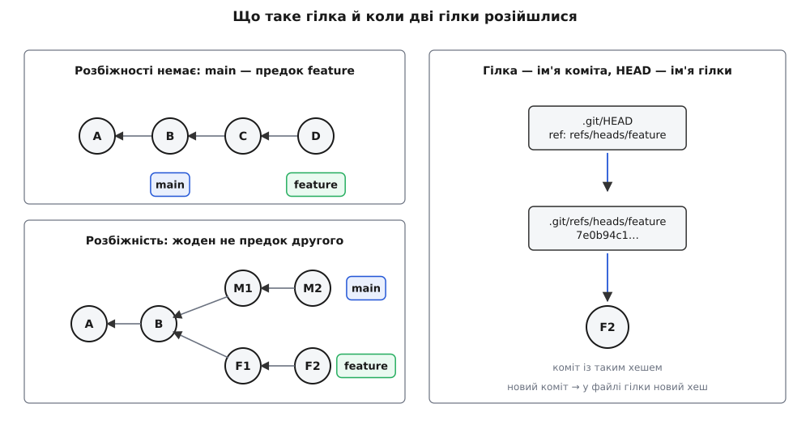
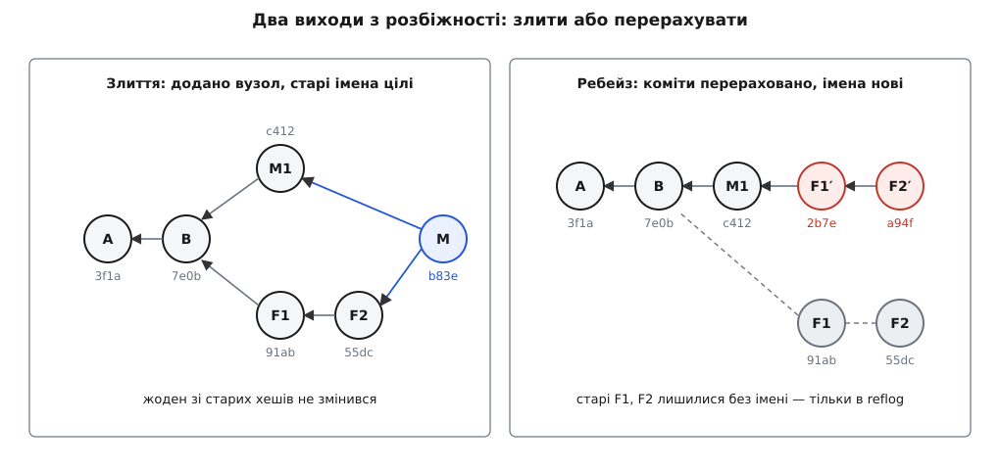

# Гілки, злиття, ребейз і пошук регресії

<preknowlist>
- [Контроль версій і git](book:programming/version-control) — коміт як знімок усього проєкту, ім'я-хеш, гілка як рухома мітка, обмін комітами між копіями репозиторію.
- [Двійковий пошук](book:algorithms/binary-search) — половинення простору пошуку й звідки береться log₂ N кроків замість N.
</preknowlist>

Завести гілку коштує секунди. Складне починається тоді, коли треба зійтися назад: git пропонує для цього дві команди з різними наслідками — `git merge` і `git rebase`.

Поруч стоїть друге питання, на вигляд геть іншого роду. Місяць тому працювало, сьогодні ні, між цими точками вісімсот комітів — котрий зламав?

Обидва питання спираються на одне відношення між комітами. Розгледіти його — і поведінка злиття, небезпека ребейзу та спосіб знайти поламку за десять перевірок замість восьмисот перестають бути окремими правилами.

## Гілка — це ім'я

У теці `.git` гілка — це файл з одного рядка:

```bash
$ cat .git/refs/heads/main
7e0b94c1f3a2d5e8b6c4a90f1d2e3b4c5a6d7e8f
```

Сорок шістнадцяткових цифр — хеш **одного** коміта. Не список комітів, не тека з файлами, не «набір змін». Такий файл-ім'я звуть **посиланням** (англ. *reference*, у командах скорочено *ref*).

Файл `HEAD` влаштований так само, тільки всередині не хеш, а назва гілки — ім'я імені. Тому «я на гілці `main`» — це буквальний опис того, що в ньому записано.

Тепер видно, що робить коміт. Git створює новий об'єкт-коміт, батьком ставить у ньому той коміт, на який зараз показує HEAD, і **переписує рядок у файлі гілки**. Гілка «посунулася» — фізично це заміна сорока символів у текстовому файлі.

Звідси й решта. Створити гілку — записати ще один такий файл із тим самим хешем, байдуже, сто файлів у проєкті чи мільйон. Перемкнутися — переписати `HEAD` і привести робочу теку до стану потрібного коміта. Видалити гілку — стерти файл з іменем; жоден коміт при цьому не зникає, зникає лише ім'я.

> 🔧 **Навіщо це.** Гілка коштує сорок один байт, тому «а раптом не вийде» перестає бути аргументом: ризиковану ідею пробують в окремій гілці, а не в закоментованому коді чи копії теки. І навпаки: якщо здається, що `git reset --hard` не туди стер дві години роботи, — вони на місці. Git пише кожен рух кожного посилання в журнал `git reflog`; знайдіть там потрібний хеш і поверніть гілку на нього.

## Що означає «після»

Кожен коміт зберігає хеші своїх батьків — тих комітів, від яких він походить. Стрілки ведуть лише назад у минуле: коміт знає батьків, але не знає дітей. Дітей на момент його створення ще не існувало, а дописати щось у готовий коміт неможливо — його ім'я пораховане з власного вмісту.

Пройдімо цими стрілками від будь-якого коміта — отримаємо все, що з нього **досяжне**. Оце і є те відношення, у якому висловлюється решта. Для двох комітів можливі рівно три випадки:

- A досяжний з B — уся робота A вже входить в історію B;
- B досяжний з A — дзеркально;
- жоден не досяжний з другого — гілки **розійшлися**.

Дата тут не суддя: час коміта записує машина автора, і її годинник може відставати. «Після» в історії означає рівно одне: **досяжний по стрілках**. Звичне «ваша гілка не відстає від origin/main» — теж не про час, а про досяжність.


*Угорі ліворуч власної роботи в main немає — усе, що там є, досяжне з feature. Унизу обидві мітки зрушили зі спільного коміта, і жодна не досяжна з другої.*

## Коли зводити нема чого

Візьмімо перший випадок: ви на `main`, а коміт гілки `feature` досяжний до вашого і містить його. Зводити нема чого — досить пересунути ім'я `main` на коміт `feature`, і воно вбере всю роботу. Ані нового коміта, ані порівняння файлів: новий хеш у файлі гілки. Це **перемотування вперед** (англ. *fast-forward*).

Те саме правило працює на сервері. `git push` проходить тоді й лише тоді, коли ваш новий коміт **досяжний до** того, що вже лежить у гілці на сервері. Так тримається один інваріант: ніщо, що там уже було, не має стати недосяжним. Відмова зі словом `non-fast-forward` каже буквально: «прийнявши це, я загублю коміти».

## Дві дороги з розбіжності

Коли гілки розійшлися, ім'я пересунути не вийде: куди його не постав, частина роботи лишиться поза досяжністю. Дороги дві.

**Злиття** (англ. *merge*) додає в історію нову вершину з **двома** батьками — з неї досяжні обидві лінії. Її вміст git рахує порівнянням трьох станів: спільного предка обох гілок і двох кінців; де змінив лише один бік, беруть його версію, де обидва по-різному — конфлікт розв'язує людина. Головне тут — наслідок: злиття **нічого не переписує**. Старі коміти лишаються з тими самими хешами, тому жодна копія репозиторію не стає хибною. Платня — форма історії: кожне злиття вплітає ще одну нитку, і в проєкті на двадцятеро людей стовбур перестає читатися підряд.

**Ребейз** (англ. *rebase*, від *base* — основа) заходить з іншого боку: а якби ви почали не три дні тому, а від нинішнього кінця `main`? Git бере ваші коміти по черзі, рахує, що саме кожен змінив, і накладає цю зміну на нову основу. Виходить коміт із тим самим повідомленням, тим самим автором і тим самим умістом файлів — але **іншим батьком**. Ім'я коміта пораховане з усього вмісту, зокрема з імені батька. Інший батько — інший хеш, а отже, це **новий коміт**, копія за змістом і чужий за іменем. Старий лишається у сховищі об'єктів без жодного імені.


*Ліворуч усі попередні хеші лишилися на місці. Праворуч ті самі зміни пораховані наново на новій основі: вміст той самий, батько інший, тому й імена інші.*

## Чому спільне не переписують

Правило про спільні гілки тепер виводиться саме.

Ребейз замінив ваші коміти новими. Отже, кінець вашої гілки більше не досяжний до того коміта, що лежить на сервері: стара ланка з нього досяжна, нова — ні. Push відкидають, лишається `--force` — наказ забути стару ланку.

Якщо ті коміти мали тільки ви, не сталося нічого. Але якщо гілку вже забрав хтось інший, у його копії стара ланка жива. Його наступний `git pull` побачить дві розбіжні лінії — стару й нову — і чесно їх зіллє. У результаті кожен ваш коміт існує двічі: ті самі зміни, ті самі повідомлення, різні хеші.

Звідси правило без винятків, вартих ризику: **переписувати можна лише те, на чому ще ніхто не будує**. Своя гілка до першого `push` — переписуйте як завгодно, спільний стовбур — ніколи. А коли примусовий push таки потрібен, `--force-with-lease` кращий за `--force`: він відмовиться писати, якщо гілка на сервері зрушила відтоді, як ви бачили її востаннє.

## Знайти коміт, який зламав

Тепер задача, заради якої вся ця акуратність окупається. **Регресія** (лат. *regressus* — рух назад) — це коли те, що працювало, перестало працювати.

Перестаньмо дивитися на коміти як на текст. Тест — це функція, яка кожному коміту дає одну з двох відповідей: добрий чи поганий. І якщо баг з'явився один раз і його відтоді не лагодили, ця функція має властивість, від якої залежить усе: **коміт поганий ⇒ усі його нащадки погані**. Помилку успадковує все, що з неї виросло.

Це і є та впорядкованість, якої потребує [двійковий пошук](book:algorithms/binary-search): щоразу відкидати половину кандидатів і за приблизно log₂ N кроків знайти межу між «ще ні» і «вже так». Кандидати тут — не «всі коміти між двома датами», а те, що досяжне з поганого коміта й **не досяжне** з доброго: усе, що входить в історію доброго, уже перевірене.

**Умова: між робочим релізом і сьогоднішнім HEAD — 800 комітів; збирання проєкту триває 25 с, відтворення бага — 40 с.**

```
кандидатів              N  = 800
кроків ≈ log₂(800)         = ln 800 / ln 2 = 6.685 / 0.693 ≈ 9.6 → 10
один крок                  = 25 с + 40 с = 65 с
разом                      ≈ 10 · 65 с = 650 с ≈ 11 хв
перебір по одному коміту   ≈ 800 · 65 с = 52000 с ≈ 14.4 год
```

Той самий тест, та сама людина — і чотирнадцять годин проти одинадцяти хвилин. Уся різниця в тому, що перевірки ставлять не підряд, а по межі. Git робить це сам:

```bash
git bisect start HEAD v1.4.0        # спершу поганий коміт, потім добрий
git bisect run ./scripts/check.sh   # 0 — добрий, 125 — пропустити, інше — поганий
```

Алгоритм беззастережно вірить кожній відповіді, тож ламають його три речі: тест, який іноді падає без причини (одна хибна відповідь відкидає не ту половину); коміти, які не збираються (для них є `git bisect skip`); і баг, який уже лагодили й зламали знову — тоді умова «поганий ⇒ нащадки погані» просто не виконується.

Вибір між злиттям і перебазуванням — не питання смаку, а питання, чим ви платите за цю майбутню відповідь. Злиття платить формою: граф заплітається, зате жоден чужий коміт не зникає. Ребейз платить ризиком: історія стає лінійною й чудово шукається, але рівно доти, доки ви переписуєте своє. Щоб не переплутати, досить щоразу питати про досяжність: чи містить ваш новий коміт те, що вже мають інші.
