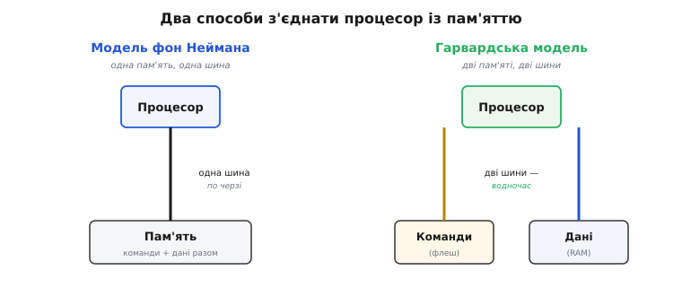
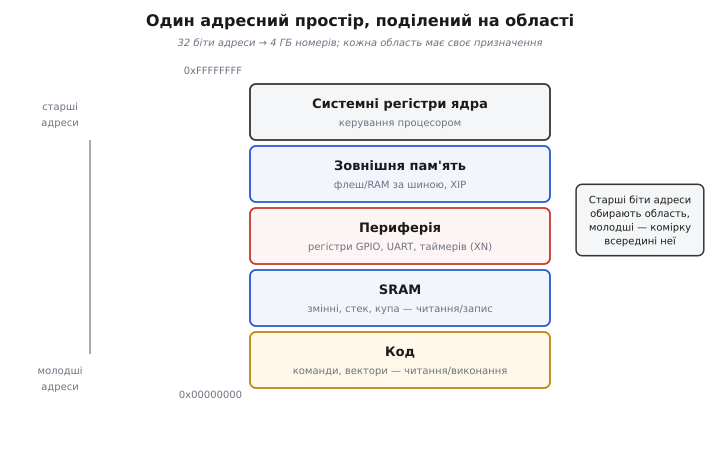
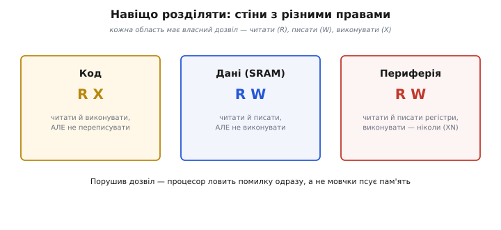

# Розділення адресних просторів

Уявіть велике місто, де кожен будинок має свій номер, і всі номери йдуть одним нескінченним рядом: 1, 2, 3, … Зручно — будь-яку адресу можна назвати одним числом. Саме так процесор бачить пам'ять: [кожна комірка має номер-адресу](topic:programming/addresses-pointers), і команда «прочитай за адресою 0x20000004» однозначно вказує на одну комірку. Але тут виникає питання, від якого залежить і швидкість машини, і її надійність: чи всі речі — програмний код, змінні, регістри пристроїв — живуть у **одному** такому ряду адрес, чи в **кількох окремих**? Це і є розділення адресних просторів. Вибір неочевидний, і різні машини роблять його по-різному — а наслідки видно в кожному рядку прошивки.

Почнімо з того, **чому** взагалі постає вибір. Процесор постійно робить дві різні речі з пам'яттю. По-перше, він **дістає наступну команду** — [читає з пам'яті число, яке декодує як наказ](topic:programming/isa). По-друге, виконуючи цю команду, він часто **читає або пише дані** — значення змінної, елемент масиву. Дві операції, обидві — звертання до пам'яті. І ось головне запитання: команди й дані лежать в одному сховищі чи в різних?

### Одна пам'ять на все: модель фон Неймана

Найпростіша відповідь — **усе в одній пам'яті**. І код, і дані — це числа; складімо їх в один довгий ряд комірок з наскрізними адресами, і хай процесор бере звідти і команди, і дані. Ця ідея називається **моделлю фон Неймана** (за іменем математика Джона фон Неймана, чий звіт 1945 року її розповсюдив, — хоча ідея була колективна).

Краса тут у простоті. Одна пам'ять — один набір адрес, одна шина (англ. *bus* — «спільний провід») між процесором і пам'яттю. Програму можна покласти в пам'ять як звичайні дані (саме так [завантажувач кладе вашу прошивку](topic:programming/what-is-processor)), а потім наказати процесору її виконувати. Код і дані — рівноправні мешканці одного простору, і кордону між ними немає: та сама адреса 0x1000 може бути й командою, і числом — усе залежить від того, як процесор до неї звернеться.

Але за простоту доводиться платити, і плата має конкретне ім'я — **вузьке горло** (англ. *von Neumann bottleneck*). Якщо пам'ять одна й шина одна, то процесор не може **водночас** діставати команду й читати дані: провід зайнятий чимось одним. Спершу по шині їде команда, потім — дані, по черзі. Шина стає тіснею, крізь яку мусить протиснутися весь потік між процесором і пам'яттю, і хоч би який швидкий був сам процесор, він чекає на цю чергу.


*Зліва — модель фон Неймана: команди й дані лежать в одній пам'яті, і між нею та процесором є лише одна шина, тож звертання йдуть по черзі. Справа — Гарвардська модель: команди (у флеші) і дані (в RAM) мають окремі сховища й окремі шини, тож процесор може діставати наступну команду й водночас читати дані. Розділення просторів прибирає чергу на спільному проводі.*

### Дві пам'яті, дві дороги: Гарвардська модель

Тепер очевидний хід думки: якщо черга виникає тому, що дорога одна, — **збудуймо дві дороги**. Хай команди живуть в одній пам'яті зі своєю шиною, а дані — в іншій зі своєю. Тоді процесор дістає команду однією дорогою і **тієї самої миті** читає дані іншою — черги нема. Це **Гарвардська модель**, названа за [релейним комп'ютером Harvard Mark I](topic:programming/address-space-separation/hist-harvard-mark.md), у якому програма фізично зберігалася окремо від даних.

> 🔧 **Навіщо це.** Різниця не абстрактна — вона проступає в тому, які числа ви бачите на своєму мікроконтролері. Візьміть будь-який Cortex-M чи AVR: код лежить у **флеші** (адреси починаються з нуля), а змінні — в **RAM** (адреси з іншого діапазону, як-от 0x20000000). Це і є два простори Гарвардської ідеї. Ось чому константу, яку ви позначили щоб вона лягла у флеш, не можна змінити під час роботи, а звичайну змінну — можна: вони живуть у фізично різних пам'ятях з різними правилами. Плутанина між цими двома світами — джерело цілого класу помилок прошивок.

Мікроконтролери майже всі так чи так спираються на цю ідею — і не лише заради швидкості. Флеш (де код) і RAM (де дані) — це **фізично різні** типи пам'яті: флеш зберігає вміст без живлення, але пишеться повільно й зношується; RAM швидка й перезаписувана, але забуває все при вимкненні. Розумно тримати код у флеші (він не міняється), а мінливі дані — в RAM. Розділення просторів тут не примха, а прямий наслідок того, що самі пам'яті різні.

Чиста Гарвардська модель має свою незручність: якщо команди й дані — у геть окремих просторах, то як програмі прочитати **сталу таблицю**, вкладену в код? Вона ж лежить у пам'яті команд, а команди читання даних ходять в іншу пам'ять. Тому реальні мікроконтролери майже завжди — **модифікований Гарвард**: пам'яті окремі й мають окремі шини (звідси швидкість), але процесор уміє за потреби прочитати з пам'яті команд як дані. Найкраще з обох світів: паралельні дороги для звичайного плину — і місток між ними, коли треба дістати константу з коду. (Глибше про компроміси й межі обох моделей — у темі [Гарвардська і фон Нейманнівська архітектури](topic:programming/harvard-vs-vonneumann).)

### Головна ідея: адреса складається з двох частин

Тепер — ключове прозріння, яке робить усю тему простою. Навіть коли простір **один** (як у фон Неймана чи в адресному вигляді Cortex-M), його все одно **ділять на області**. І механізм поділу разюче простий: **старші біти адреси кажуть, у якій ти області, молодші — яка комірка всередині неї**.

Це та сама логіка, що й у телефонному номері: перші цифри — код країни й міста, останні — номер конкретного абонента. Або поштова адреса: спершу область і місто, тоді вулиця й будинок. Число одне, але воно **ієрархічне** — старша частина звужує до району, молодша вказує точку в ньому.


*Один адресний простір на 4 ГБ (32 біти дають стільки номерів) поділено на області за призначенням: код унизу (з нуля), над ним SRAM для змінних, вище — регістри периферії, ще вище — зовнішня пам'ять, аж до системних регістрів ядра вгорі. Старші біти адреси обирають область, молодші — комірку в ній. Це стандартна розкладка, спільна для всіх процесорів ARM Cortex-M.*

Розгляньмо це на живій адресі. У ARM Cortex-M (ядро тисяч мікроконтролерів) простір поділений так: область коду починається з 0x00000000, область SRAM — з 0x20000000, область периферії — з 0x40000000. Погляньте на старший знак кожної адреси: `0`, `2`, `4`. Саме він і вирішує, куди веде звертання. Перевірити область — це буквально подивитися на старші біти:

**Приклад: з адреси зрозуміти, куди веде звертання.** Процесор і сам робить це кількома логічними вентилями; у C та сама перевірка — один зсув.

```c
#include <stdint.h>

// У Cortex-M верхній ніббл (4 старші біти) 32-бітної адреси
// грубо визначає, до якої області вона належить.
const char *region_of(uint32_t addr) {
    switch (addr >> 28) {          // лишаємо самі 4 старші біти
        case 0x0: return "Код (флеш) — читати й виконувати";
        case 0x2: return "SRAM — читати й писати";
        case 0x4: return "Периферія — регістри пристроїв";
        case 0x6: case 0x7: return "Зовнішня пам'ять";
        default:  return "Інша системна область";
    }
}

// region_of(0x08000000) → "Код (флеш) ..."   (верхній ніббл 0x0)
// region_of(0x20000004) → "SRAM ..."          (верхній ніббл 0x2)
// region_of(0x40020000) → "Периферія ..."     (верхній ніббл 0x4)
```

`addr >> 28` відкидає 28 молодших бітів і лишає 4 старші — той самий ніббл, який відрізняє область коду (0) від SRAM (2) від периферії (4). Це і є вся «магія» розділення: не окремі фізичні дроти на кожну річ, а **домовленість про те, що означають старші біти адреси**. Процесор дивиться на старші біти й спрямовує звертання туди, куди треба, — до флеші, до RAM чи до регістра пристрою.

### Периферія теж живе за адресами

Одне з найкорисніших застосувань цієї ідеї — **периферія**. Регістр, що керує ніжкою GPIO чи налаштовує UART, теж має **адресу** в тому самому просторі. Записати число за адресою 0x40020014 — це не покласти щось у пам'ять, а **наказати пристрою** щось зробити (наприклад, підняти напругу на ніжці). Такий підхід називають [відображенням пристроїв у пам'ять](topic:programming/memory-mapped-io) (англ. *memory-mapped I/O*): пристрої «прикидаються» комірками пам'яті, і працювати з ними можна тими самими командами читання/запису, що й зі змінними.

Ось чому область периферії — окремий кусень адресного простору (у Cortex-M — від 0x40000000). Записуєш у неї — керуєш залізом; читаєш — питаєш у пристрою його стан. Конкретне розташування всіх областей на реальному чипі описує його [карта пам'яті](topic:programming/memory-map) — таблиця з даташита, що каже, з якої адреси починається флеш, з якої RAM, де сидить кожен блок периферії.

**Приклад: увімкнути світлодіод записом за адресою.** Ніякого «виклику функції пристрою» — просто запис числа в комірку, що насправді є регістром GPIO.

```c
#include <stdint.h>

// Регістр даних порту — це адреса в області периферії.
// volatile каже компілятору: значення може мінятися ззовні,
// не оптимізуй звертання, читай/пиши рівно як написано.
#define GPIO_OUT (*(volatile uint32_t *)0x40020014u)

void led_on(void)  { GPIO_OUT |=  (1u << 5); }  // підняти біт 5 → ніжка вгору
void led_off(void) { GPIO_OUT &= ~(1u << 5); }  // скинути біт 5 → ніжка вниз
```

Запис у `GPIO_OUT` не кладе число в RAM — він фізично міняє напругу на ніжці, бо ця адреса веде не в пам'ять, а в регістр пристрою. Саме розділення простору на області й робить такий фокус можливим: старші біти адреси спрямовують запис не до RAM, а до блоку GPIO.

### Найглибша причина: розділення дає стіни

Швидкість — не єдина, і навіть не головна вигода від розділення. Найцінніше — що **кожна область може мати свої правила доступу**. Раз простір поділено на кусні за призначенням, то до кожного кусня можна приставити свого «сторожа»: сюди — тільки читати, туди — читати й писати, а виконувати команди дозволити лише з області коду.

Подумаймо, чому це рятує. Код лежить у своїй області — і йому природно дати право «читати й **виконувати**», але заборонити запис: працююча програма не повинна переписувати сама себе (а якщо намагається — це майже напевно помилка чи атака). Дані лежать у SRAM — їм треба «читати й **писати**», але **не** виконувати: якщо процесор раптом спробує виконати те, що лежить у стеку як дані, це знак, що щось пішло страшенно не так. Периферія — «читати й писати регістри», виконувати — ніколи.


*Розділення простору дозволяє поставити різні дозволи на різні області. Код можна читати й виконувати, але не переписувати. Дані (SRAM) — читати й писати, але не виконувати. Периферію — читати й писати регістри, а виконувати заборонено назавжди. Спроба порушити дозвіл (виконати дані, переписати код) миттю ловиться процесором як помилка, замість тихо зіпсувати пам'ять.*

Ось де розділення показує справжню силу. Якби все жило в одному нероздільному просторі без кордонів, помилковий [покажчик](topic:programming/addresses-pointers), що заліз не туди, тихо зіпсував би код чи регістр — і машина повелася б незбагненно через тисячі тактів. А з розділеними областями й дозволами процесор ловить порушення **в мить самого звертання**: спроба записати в область коду чи виконати дані відразу спричиняє апаратну помилку, і ви бачите збій там, де він стався, а не за кілометр далі. Стежить за цими межами на мікроконтролерах спеціальний блок — [пристрій захисту пам'яті (MPU)](topic:programming/stack-overflow/comp-mpu.md); саме він перетворює межі областей на справжні стіни.

> 🔧 **Навіщо це.** Це та властивість, що відрізняє іграшкову прошивку від надійної. Коли ваша програма падає з апаратною помилкою на кшталт «спроба виконати з області даних» — це не прикрість, а подарунок: розділення просторів упіймало зіпсований покажчик чи переповнення стека **рано**, доки воно не встигло розповзтися. Без стін між областями та сама помилка проявилася б як загадковий збій десь зовсім в іншому місці, і полювання на неї з'їло б дні. Тому, налаштовуючи MPU так, щоб стек не був виконуваним, а код — не перезаписуваним, ви не додаєте зайвих перепон, а ставите пастки, що спіймають найпідступніші помилки в момент їх скоєння.

### Як усе змикається

Отже, розділення адресних просторів — це відповідь на просте запитання: у скількох окремих рядах адрес живуть речі, з якими працює процесор. Крайні варіанти — **фон Нейман** (усе в одному просторі з однією шиною: просто, але з чергою на спільному проводі) і **Гарвард** (окремі простори для команд і даних з окремими шинами: швидше й природно лягає на різні фізичні пам'яті — флеш для коду, RAM для даних). Реальні мікроконтролери беруть модифікований Гарвард: окремі пам'яті заради паралельних доріг, плюс місток, щоб дістати сталу таблицю з коду.

Та навіть у межах **одного** простору його завжди ділять на **області** — і механізм поділу зводиться до простого правила: старші біти адреси обирають область, молодші — комірку в ній. Ця сама ідея дає й [відображення периферії в пам'ять](topic:programming/memory-mapped-io) (пристрої як адреси), і карту пам'яті чипа, і — найважливіше — **різні права на різні області**: код читати-й-виконувати, дані читати-й-писати, і жодних порушень без миттєвої апаратної помилки. Саме ці стіни, поставлені на межах розділених просторів, і роблять прошивку такою, що падає чесно й рано, а не бреше й псує пам'ять тихцем.
