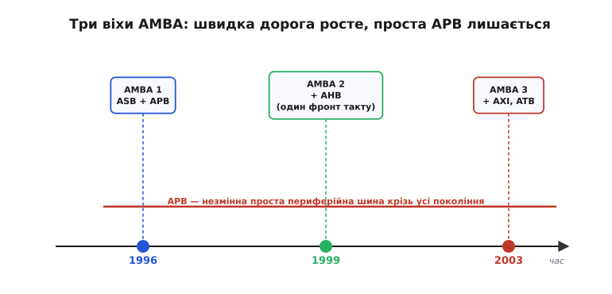

# 📜 Як народилася AMBA: спільна мова кремнієвих кварталів

Наприкінці 1980-х ARM (тоді ще Acorn RISC Machine, за назвою британської фірми Acorn Computers) опинилася перед задачею, якої не мала більшість тодішніх процесорних компаній. Ядро ARM продавалося не як мікросхема, а як **опис**: замовник брав ліцензію й вставляв ядро у свій власний кристал, поряд зі своєю пам'яттю та своєю периферією. І тут виникало прикре питання, на яке ні в кого не було спільної відповіді: **як ядро має спілкуватися з рештою кристала?** Кожен ліцензіат вигадував власний спосіб причепити ядро до пам'яті й пристроїв. Скільки ліцензіатів — стільки й способів. А блок, написаний для одного кристала, годі було перенести в інший: він говорив «мовою» шини, якої більше ніхто не розумів.

Ось той конфлікт, з якого виросла вся ця історія. Не «як зробити шину швидшою» — це друге питання. Перше й головне: **як зробити так, щоб різні блоки від різних людей могли говорити між собою, не домовляючись щоразу заново.** Відповіддю стала AMBA (англ. *Advanced Microcontroller Bus Architecture* — вдосконалена архітектура шини мікроконтролера) — стандарт, що описує не самі блоки, а **правила розмови** між ними на кристалі.

## Кремній як місто, де всі говорять різними мовами

Щоб відчути проблему, уявімо системи-на-кристалі (англ. *system-on-chip*, SoC) як місто. У ньому є райони: обчислювальний центр (ядро), склади (пам'ять), пошта й телеграф (периферія на кшталт UART), водопровід (контролери живлення). Кожен район хтось збудував — інколи різні фірми, інколи різні відділи однієї фірми. Місто працює лише тоді, коли райони з'єднані дорогами і всі водії розуміють одні й ті самі знаки.

До AMBA кожне місто-кристал креслило власні дороги й власні знаки. Побудувати новий район було півбіди; біда починалася, коли той самий склад хотіли поставити в **інше** місто — доводилося перекладати всі його під'їзди під чужі знаки. У масштабі індустрії це означало, що ринок готових блоків (англ. *IP cores* — блоки інтелектуальної власності, ліцензовані шматки логіки) майже не міг існувати: блок, куплений в однієї фірми, не стикувався з блоком іншої, бо шини були несумісні.

> 🔧 **Навіщо це.** Коли сьогодні ви берете з даташита готовий контролер SPI від однієї фірми й контролер Ethernet від іншої, а вони обидва просто «сідають» на ту саму шину вашого мікроконтролера без бубна — це прямий спадок AMBA. Стандартна мова шини перетворила окремі блоки на **деталі конструктора**: беруться від різних постачальників і стикуються, бо кожен зроблено під один і той самий інтерфейс. Без цього кожен новий чип збирали б від нуля.

Саме тому в 1996 році ARM зробила річ, на перший погляд дивну для комерційної компанії: **опублікувала специфікацію відкрито й без роялті**. Не «продавала мову» — роздала її. Логіка тут глибша, ніж альтруїзм. ARM продає ядра; ядро тим цінніше, чим більше готової периферії довкола нього можна легко поставити. Якщо мова шини безкоштовна й спільна, уся екосистема — виробники периферії, EDA-інструменти, замовники — починає говорити нею, і кожен новий блок автоматично сумісний з ARM-ядром. Відкрита специфікація стала магнітом: вона зробила ARM центром цілого світу сумісних блоків. Так AMBA й перетворилася на *de facto* стандарт шин для вбудованих процесорів — не наказом, а тим, що всім було вигідно нею користуватися.

## AMBA 1, 1996: дві дороги замість однієї

Найцікавіше в самій першій версії те, що поділ на **швидку** й **повільну** шину заклали від початку — це не пізніший винахід. AMBA 1 описала одразу дві дороги:

- **ASB** (англ. *Advanced System Bus* — вдосконалена системна шина) — магістраль для «центру міста»: ядро, пам'ять, усе, що потребує смуги.
- **APB** (англ. *Advanced Peripheral Bus* — вдосконалена периферійна шина) — тиха вуличка для пошти й телеграфу: проста дешева шина для повільної периферії.

Питання, чому їх одразу дві, — не технічна забаганка, а пряма відповідь на фізичний конфлікт. Ядро хоче даних щотакту; UART чи таймер відповідають у десятки разів повільніше. Якщо посадити всіх на одну дорогу, її темп задаватиме найповільніший — і дороге швидке ядро тупцюватиме в ритмі найтупішої периферії. Розв'язок очевидний, щойно його побачиш: **дати швидким свою дорогу, повільним — свою**, а на межі поставити перекладача. Цей перекладач — міст (англ. *bridge*): раб на системній шині згори, майстер на периферійній знизу, він переносить звертання з однієї дороги на іншу. Отже, ієрархія «швидка системна + повільна периферійна + міст між ними» — це не випадковість, що склалася історично, а **свідоме архітектурне рішення першого ж дня AMBA**.

APB зробили гранично простою навмисно. Її протокол — це маленький автомат: одне звертання розкладається на два такти (виставити адресу — тоді прочитати чи записати), жодних пакетів, жодного накладання фаз, один-єдиний майстер (сам міст). Ця простота — і є вся суть: периферії не потрібна складна швидка машинерія, тож її й не навантажують нею. APB виявилася настільки вдалою, що пережила всі наступні перевороти й дожила незмінною по духу до сьогодні — коли ви пишете в регістр UART на сучасному Cortex-M, ви говорите мовою, вигаданою 1996 року.

## AMBA 2, 1999: народження AHB і чому важив «один фронт такту»

Перша системна шина, ASB, працювала, але мала родову ваду, що виросла з технологій свого часу. Це важливо зрозуміти, бо саме вона й спричинила наступний крок. ASB була **двонапрямною шиною на трьох станах** (англ. *tri-state* — третій, «відключений» стан виходу): багато пристроїв висіли на одних і тих самих дротах, і кожен, коли надходила його черга говорити, «відпускав» лінію в третій стан, а інший її «підхоплював». Крім того, ASB тактувалася **обома фронтами** такту — і наростанням, і спадом.

Обидві ці риси на кремнієвій фабриці кінця 1990-х стали каменем на шиї. Двонапрямні tri-state-лінії погано **синтезуються** (англ. *synthesis* — автоматичне перетворення опису логіки на розкладку вентилів): інструмент, що складає кристал із опису, важко впорається з дротом, який то один пристрій жене, то інший, та ще й треба гарантувати, що двоє не заговорять водночас і не спалять лінію боротьбою за неї. А протокол на двох фронтах такту ускладнював і синтез, і тестування, і розгін частоти.

AMBA 2 у 1999 році розв'язала це, додавши третю дорогу — **AHB** (англ. *Advanced High-performance Bus* — вдосконалена високопродуктивна шина). Ключем була начебто дрібна, а насправді визначальна зміна: AHB стала **протоколом на одному фронті такту** (англ. *single clock-edge protocol*). Усі учасники дивляться на шину лише в один момент — на наростанні такту, — і все.

Чому один фронт замість двох — це такий стрибок? Тому що з нього випливає ланцюжок вигод:

```
Один фронт такту (замість двох)
    ↓
можна викинути tri-state: замість спільного дроту, що його
хапають по черзі, — набір однонапрямних ліній, зведених
докупи мультиплексором (одним «перемикачем» вибору джерела)
    ↓
однонапрямні лінії + один фронт легко СИНТЕЗУЮТЬСЯ
й легко ТЕСТУЮТЬСЯ (DFT-friendly, англ. design-for-test)
    ↓
логіка простіша й передбачуваніша → вища тактова частота,
а заразом уперше в ARM — шини завширшки 64 і 128 біт
```

Тобто AHB — це не просто «швидша ASB». Це шина, спеціально перекроєна під те, **як насправді роблять кристали**: щоб її можна було згенерувати автоматично, надійно протестувати й розігнати. Плюс сама швидкість: AHB навчилася розбивати звертання на дві фази — адресну й даних — і **накладати** їх у часі (поки йдуть дані одного звертання, уже виставляється адреса наступного, як конвеєр), а також ганяти **пакети** — багато слів за одне рукостискання. Усе те, чого повільній APB і не треба, а швидкому ядру з пам'яттю — конче.

Із цього моменту канонічна пара для мікроконтролерів набула звичного вигляду: **AHB для швидких** (ядро, пам'ять, DMA), **APB для повільних** (периферія), **міст** між ними. ASB тихо відійшла в минуле, поступившись синтезовній AHB, а APB лишилася поряд незмінною — бо на своїй тихій вуличці вона й так була ідеальна.


*Три віхи AMBA. **1996** — перша версія одразу з двома дорогами: системною ASB і периферійною APB (поділ на швидке й повільне закладено від початку). **1999** — AMBA 2 додає AHB: протокол на одному фронті такту, без tri-state, синтезовний і швидкий; ASB відходить. **2003** — AMBA 3 приносить AXI для найвищої продуктивності. Крізь усі перевороти проходить незмінна **APB** — настільки проста, що переживає всіх.*

## AMBA 3, 2003: AXI і межа, де конвеєр уже не встигає

До 2003 року ядра ARM розігналися ще дужче, а SoC розрослися до десятків блоків. І тут навіть AHB почала впиратися в стелю — з причини, закладеної в самій її будові. AHB накладала фази, але лишалася **прив'язаною до порядку**: звертання йшли колоною, і відповідь на друге не могла обігнати відповідь на перше. Якщо перший раб думав довго, уся колона за ним стояла. Для однієї швидкої пам'яті це не біда; для системи з багатьма контролерами, кожен зі своєю затримкою, — вузьке горло.

AMBA 3 у 2003 році відповіла новою, ще потужнішою дорогою — **AXI** (англ. *Advanced eXtensible Interface* — вдосконалений розширюваний інтерфейс). Її ідея — зняти саме те обмеження порядку. AXI розділила звертання на **незалежні канали** (окремо адреса читання, окремо дані читання, окремо адреса запису, дані запису й відповідь) і дозволила:

- **багато «висячих» звертань водночас** (англ. *multiple outstanding addresses*) — можна вистрелити купу запитів, не чекаючи відповіді на попередній;
- **відповіді поза чергою** (англ. *out-of-order responses*) — швидкий раб віддає своє, не чекаючи на повільного попередника;
- **невирівняні передачі** через побайтові стробі (англ. *byte strobes* — маска, які саме байти слова справді записати).

Аналогія проста. AHB — це один касовий прохід: хто перший став, того першим і обслужать, а як він довго порпається в гаманці, черга стоїть. AXI — це зала з багатьма касами й номерками: подав запит, отримав номерок і відійшов; готові замовлення видають у міру готовності, у будь-якому порядку. Пропускна здатність злітає, бо ніхто нікого не тримає.

Разом з AXI у тій самій AMBA 3 з'явилася й **ATB** (англ. *Advanced Trace Bus* — вдосконалена шина трасування) — окрема дорога вже не для роботи, а для **спостереження**: частина набору CoreSight для налагодження, що дозволяє «підглядати», що діється в кристалі, не заважаючи самій роботі. Дрібна на позір деталь, а показова: AMBA переросла з «як з'єднати блоки» у ширше «як цілим кристалом жити, налагоджуватися й рости».

## Чому поділ виявився не помилкою, а законом

Історія AMBA — це історія одного повторюваного вибору. Щоразу, коли ядра ставали швидшими, а систем на кристалі — складнішими, ARM не намагалася зробити **одну шину на все**. Навпаки: додавала **нову швидку дорогу** для тих, кому смуга життєво потрібна, і **лишала стару просту** там, де швидкість зайва.

- 1996: системна ASB + периферійна APB — поділ від першого дня.
- 1999: AHB для швидких, APB незмінна для повільних.
- 2003: AXI для найшвидших, APB усе ще на місці.

І далі того самого ряду: у 2010-х прийшли AMBA 4 (з AXI4) та розширення когерентності ACE (англ. *AXI Coherency Extensions*), а в 2013-му — AMBA 5 з інтерфейсом CHI (англ. *Coherent Hub Interface*) для великих багатоядерних систем. Верхній поверх ставав дедалі потужнішим — а нижній, периферійний, лишався тим самим простим APB, бо кращого для його задачі так і не знадобилося.

У цьому й головний урок цієї історії, вартий того, щоб винести його з-під усіх дат і абревіатур. Поділ на швидку системну й повільну периферійну шину — **не історична випадковість і не тимчасовий компроміс**, який колись «виправлять» єдиною універсальною шиною. Це стійка відповідь на фізичний факт: **швидке ядро й повільна периферія не можуть жити на одній дорозі, не заважаючи одне одному.** ARM наштовхнулася на цей факт 1996 року, побачила його ще ясніше 1999-го, і відтоді щоразу лише підтверджувала. Тому коли на сучасному Cortex-M ви бачите швидку системну шину, повільну периферійну й міст між ними — ви дивитеся не на пережиток, а на рішення, яке тридцять років проходило перевірку кремнієм і щоразу її витримувало.

**Статус доказовості: усталено.** Роки й версії (AMBA 1 — 1996, ASB+APB; AMBA 2 — 1999, AHB як протокол на одному фронті такту; AMBA 3 — 2003, AXI+ATB; далі AMBA 4 у 2010-х, AMBA 5 у 2013) підтверджені документацією ARM та зведеними джерелами. Технічні мотиви переходу від ASB до AHB — відхід від tri-state-двонапрямних ліній до однонапрямних із мультиплексором заради синтезовності й тестопридатності, підтримка ширини 64/128 біт — також задокументовані.
