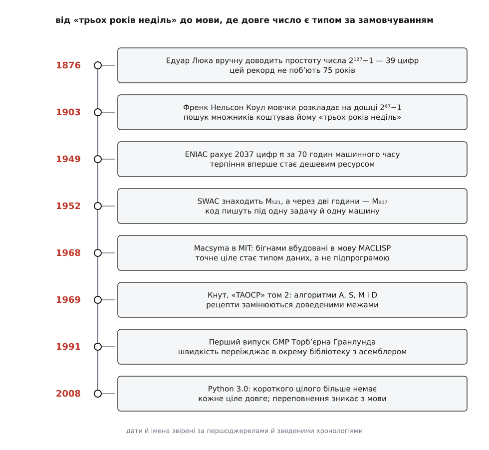

# 📜 Як довга арифметика стала окремим ремеслом

Спосіб рахувати числа, довші за розрядну сітку, ніхто не винаходив: стовпчиком множили за тисячі років до першого транзистора. Винайшли інше — **ремесло**: доведені межі замість рецептів, назву для типу даних, окрему бібліотеку, яку пишуть асемблером під конкретне ядро. Ця історія варта переказу тому, що показує рідкісну річ — як задача, яку «всі й так уміють», півтора століття перетворювалася на дисципліну з власними теоремами, власними суперечками про швидкість і власним відкритим питанням, на яке досі немає відповіді.

*Кожна віха змінює не алгоритм, а те, **чим** довга арифметика є: спершу особистою витривалістю, тоді програмою під одну машину, тоді розділом книжки з доведеннями, тоді продуктом — і врешті мовчазною властивістю мови.*

## Числа, більші за терпіння людини

До машин довга арифметика була не інженерією, а характером. 1876 року Едуар Люка (Édouard Lucas) довів, що число 2¹²⁷−1 — просте. У ньому 39 цифр, і жодного помічника, крім олівця: перевірка спиралася на послідовність, кожен член якої треба піднести до квадрата й узяти остачу — над числом у 39 цифр, десятки разів поспіль. Рекорд найбільшого відомого простого протримався **сімдесят п’ять років** — не тому, що ніхто не хотів більшого, а тому, що більшого не витримувала людина.

Друга сцена — 31 жовтня 1903 року, засідання Американського математичного товариства. Френк Нельсон Коул (Frank Nelson Cole) виходить до дошки й **мовчки** обчислює 2⁶⁷−1, дістає 147 573 952 589 676 412 927, а тоді на другій половині дошки перемножує 193 707 721 на 761 838 257 287 — і числа збігаються. Люка ще 1876 року довів, що це число складене, але множників не знайшов; Коул їх знайшов. На питання, скільки це забрало часу, він відповів: «три роки недільних днів». Дата, множники й сама фраза задокументовані; барвисті деталі переказу — година тиші, овація залу — кочують від переказу до переказу, і сприймати їх варто як усну традицію, а не як протокол.

> 🔧 **Навіщо це.** Обидві сцени про одне: алгоритм уже був. Ділення стовпчиком, піднесення до квадрата з остачею — усе це знав кожен школяр. Бракувало не методу, а **невтомного виконавця**, і саме брак виконавця, а не брак знання, тримав межу на кількох десятках цифр.

Третя сцена показує, чого ще бракувало. 1873 року Вільям Шенкс (William Shanks) опублікував 707 десяткових знаків π. Помилку він припустився ще в обчисленні 1853 року — на 530-й позиції; через будову формули Мечина хиба поповзла назад і зіпсувала все, починаючи з 528-го знака. Неправильними виявилися сто вісімдесят цифр, і **сімдесят три роки цього ніхто не помічав**: у 1946-му хибу знайшов Д. Ф. Фергюсон, перерахувавши все наново (за поширеною версією — на настільному механічному калькуляторі). Ручна довга арифметика не мала не лише виконавця, а й **детектора помилок**: єдиний спосіб перевірити відповідь — повторити всю працю.

## Коли терпіння подешевшало

Машина зняла обидві нестачі одразу. У вересні 1949 року на ENIAC порахували 2037 десяткових знаків π; прогін зайняв **70 годин** машинного часу, а результат опублікував Джордж Райтвізнер зі співавторами. Серед учасників зазвичай називають ще Джона фон Неймана й Ніколаса Метрополіса — це переказ, поширений і правдоподібний, але у зведених хронологіях стоїть обережне «Reitwiesner et al.». Важливе тут не авторство: сімдесят годин заліза замінили роки неділь, і відповідь можна було перевірити, просто запустивши іншу програму.

Далі — 30 січня 1952 року, десята вечора, машина SWAC у Каліфорнійському університеті в Лос-Анджелесі. Програму написав Рафаель Робінсон (Raphael M. Robinson), керував роботою Деррік Генрі Лемер (D. H. Lehmer). Машина знайшла, що 2⁵²¹−1 — просте: 157 цифр, більше за все, що люди здолали руками. Менш ніж за дві години вона видала наступне, 2⁶⁰⁷−1, а протягом кількох місяців — ще три. Рекорд Люка, що стояв сімдесят п’ять років, упав п’ять разів за один сезон. Числа Мерсенна — це числа вигляду 2ᵖ−1; вони й досі тримають більшість рекордів простоти, бо для них є надзвичайно дешевий тест ([числа Мерсенна](book:math/mersenne-primes)).

Але ремесла ще не було. Ані ENIAC, ані SWAC не мали довгих чисел — програміст щоразу власноруч розкладав число на слова машини, вручну вів ланцюг переносів і вручну ж вигадував, як зберігати проміжні добутки в тій пам’яті, що є. Код був **під одну задачу й одну машину**: перенести його на сусідню було не легше, ніж написати заново. Кожен, кому треба було велике число, писав свою довгу арифметику з нуля — і робив ті самі помилки, що й попередник, бо порівнювати не було з чим.

## 1969: коли рецепт став теоремою

Це змінив другий том «The Art of Computer Programming» Дональда Кнута (Donald Knuth) — «Seminumerical Algorithms», що вийшов 1969 року, наступного після першого тому. Розділ 4 присвячено арифметиці, підрозділ 4.3 — арифметиці багаторазової точності, а параграф 4.3.1 має назву «The Classical Algorithms» і містить чотири процедури під літерами: **A** — додавання, **S** — віднімання, **M** — множення, **D** — ділення.

Зібрати відомі рецепти під одну обкладинку — не найбільша заслуга. Головне, що Кнут перевів їх із мови «працює на моїх прикладах» на мову доведених тверджень, і найкраще це видно на алгоритмі D. Ділення довгих чисел — єдина з чотирьох дій, де немає прямої формули: цифру частки доводиться **вгадувати** за старшими розрядами й виправляти. Питання, від якого залежить усе, звучить так: наскільки далеко може промахнутися здогад? Кнут показав, що коли обидва числа перед початком зсунути ліворуч так, щоб старший біт дільника став одиницею (**нормалізація**), пробна цифра ніколи не буває заниженою й перевищує правильну щонайбільше на два. Без нормалізації похибка не обмежена нічим.

Різниця між цими двома реченнями — це різниця між ремеслом і дисципліною. «Виправляй, доки не збіжиться» — рецепт із невідомою ціною. «Не більш ніж дві поправки» — це вже інженерна гарантія, за якою можна планувати час виконання. Відтоді реалізації довгого ділення в бібліотеках світу — це варіації алгоритму D, і назва «алгоритм D» уживається як власне ім’я, без посилання на джерело.

Той самий том поставив і питання, яке лишається відкритим досі. Параграф 4.3.3 називається «How Fast Can We Multiply?» — і причина, чому питання взагалі має сенс, з’явилася за сім років до книжки: [множення Карацуби](book:algorithms/karatsuba-multiplication) 1960–1962 років розбило переконання, що квадратична вартість множення непереборна. Далі це стало дослідницькою програмою: узагальнення Тоома й Кука, метод Шьонгаге й Штрассена 1971 року з вартістю O(n·log n·log log n), збудований на [швидкому перетворенні Фур’є](book:algorithms/fft) — тому самому інструменті, яким згортають сигнали, бо множення чисел і є згортка їхніх цифр. Крапку начебто поставили 2019 року: Девід Гарві й Йоріс ван дер Говен оголосили алгоритм із вартістю O(n·log n), опублікований 2021-го в «Annals of Mathematics». Начебто — бо він **галактичний**: переганяє Шьонгаге й Штрассена лише на числах, довжина яких перевищує 10^(2.15·10³⁸) цифр, тобто ніколи. Теоретична межа знайдена, практичне питання лишилося тим самим.

## Бігнам як тип даних, а не як підпрограма

Паралельно ремесло тягнула вгору геть інша потреба — символьні обчислення. Система, яка працює не з числами, а з формулами (розкладає многочлени, шукає найбільший спільний дільник, обчислює визначники), не має права округляти: одна відкинута цифра — і тотожність перестає бути тотожністю. При цьому коефіцієнти в таких обчисленнях **самі собою розбухають**: проміжні вирази при точному діленні многочленів дають числа на сотні цифр там, де і в умові, і у відповіді стоять одноцифрові. Тобто довга арифметика тут не окрема задача, а фон, на якому працює все.

Перші такі системи з’явилися майже одночасно. REDUCE Ентоні Герна (Anthony C. Hearn) розробляли з 1963 року, перший випуск — 1968-й; писали його для фізиків, які тонули в алгебрі фейнманівських діаграм. Того ж 1968 року, у липні, в MIT Project MAC почали Macsyma — Карл Енґельман, Вільям Мартін і Джоел Мозес; вона стала однією з найбільших програм на MACLISP свого часу. Обидві написані на діалектах [Ліспа](book:programming/lisp) — і саме звідти пішло слово: жаргонне **bignum** (від *big number*) походить, за словником комп’ютерного жаргону, саме з MIT MACLISP.

Тут і сталася зміна, важливіша за всі рекорди. Довге число перестало бути підпрограмою, яку викликають, і стало **типом даних мови**: обчисливши факторіал тисячі, ти просто отримував відповідь на 2568 цифр, не знаючи, що десь усередині мова мовчки перевела коротке ціле в довге. Програміст більше не писав ланцюг переносів — він писав множення.

## 1991: коли лишилася сама швидкість

Коли алгоритми кодифіковано, а тип даних вигадано, невирішеним лишається те, чого не видно в асимптотиці: **сталий множник**. Він живе в асемблерних вставках під конкретне ядро, у порогах перемикання між шкільним множенням, Карацубою й перетворенням Фур’є, у розкладці пам’яті під кеш. Це вже не математика, а окремий інженерний продукт, і його треба писати один раз для всіх.

Саме ним стала GMP — GNU Multiple Precision Arithmetic Library. Перший випуск вийшов 1991 року; бібліотеку написав і досі веде Торб’єрн Ґранлунд (Torbjörn Granlund). У переліку авторів прямо сказано, що все, не приписане іншим, написав він; математичні поради на ранніх версіях давали Ґуннар Шьодін і Ганс Рісель (Hans Riesel — шведський фахівець із теорії чисел), Річард Столмен долучився до вигляду інтерфейсу й до правки підручника, а порівняння різних бігнам-пакетів, зроблені Полем Ціммерманом, штовхнули до появи GMP 2. Бібліотека входить у проєкт GNU й поширюється під LGPL, а її оголошені цілі — криптографія й дослідження в ній, безпека в мережі та системи комп’ютерної алгебри. Криптографія тут не випадкова: [RSA](book:algorithms/rsa) — це піднесення до степеня за модулем над числами в сотні й тисячі бітів, тобто довга арифметика в найчистішому вигляді.

Наслідок видно за списком тих, хто нею користується: цілу арифметику на GMP тримають Maple й Mathematica, її вимагає CGAL — і, що найкраще замикає коло, **без GMP не збереться GCC**. Компілятор, який перетворює вихідний код на машинні команди, сам мусить рахувати довгими числами: щоб згорнути константний вираз точно так, як велить стандарт мови, йому не досить арифметики тієї машини, на якій він працює.

## Коли ремесло стало невидимим

Останній крок зробили мови високого рівня, і Python довів його до кінця. Довге ціле там існувало здавна як **окремий** тип `long` із суфіксом `L` у записі, поруч зі звичайним машинним `int`. PEP 237, поданий 11 березня 2001 року, запропонував їх злити, і зробив це обережно, у кілька випусків: у 2.2 операції, що доти кидали `OverflowError`, почали віддавати довге число; у 2.3 з’явилися попередження про зміну поведінки; у 2.4 нову семантику ввімкнули остаточно; у 3.0 з `repr()` зник хвостовий `L`, а в коді він став забороненим. Відтоді короткого цілого в мові просто немає.

Ціна відома й свідома: кожне `a + b` — це виклик над масивом слів із можливим виділенням пам’яті, і додавання за один такт програмі недоступне назавжди. Куплено натомість те, що добре видно на контрасті з Java, де досі співіснують `int` і `BigInteger`: у Python **переповнення зникло з мови як поняття**. Новачок, що пише факторіал, не знає слова «бігнам» — не тому, що йому не сказали, а тому, що він жодного разу не наштовхнувся на межу, об яку Люка розбивав олівці, а Коул витрачав неділі.

І це найдивніша нагорода, яку може отримати інженерна дисципліна: вона вважається доведеною до кінця тоді, коли той, хто нею користується, перестає підозрювати про її існування.
