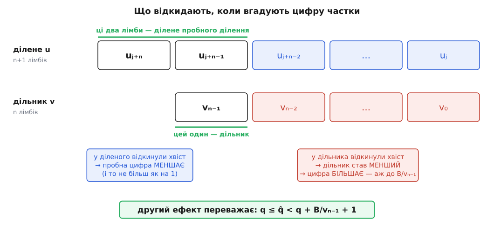
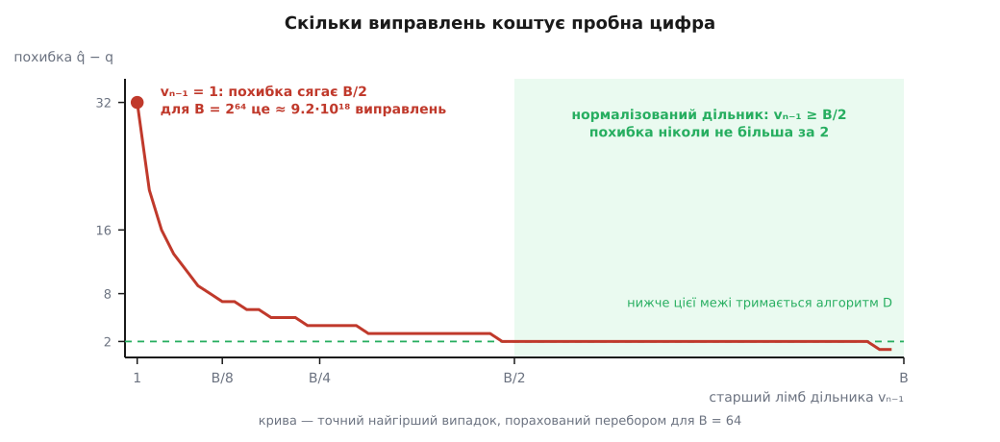
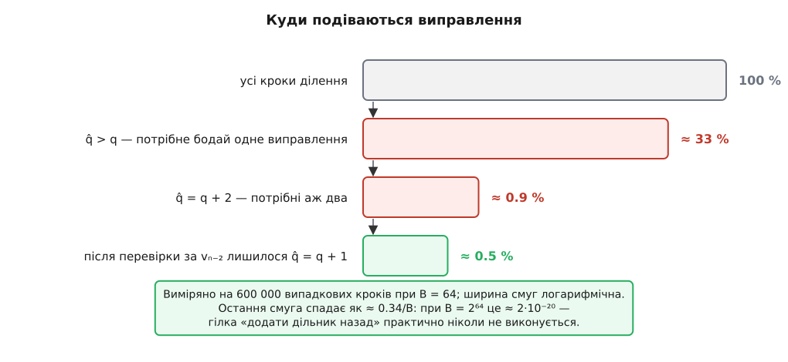

# 🧮 Чому пробна цифра частки завелика щонайбільше на два

Крок довгого ділення не обчислює цифру частки, а вгадує її одним машинним діленням і потім виправляє — тож уся вартість кроку впирається в те, скільки виправлень узагалі може знадобитися. Нижче доведено, що після нормалізації дільника їх не більше двох, показано, звідки береться саме двійка, і показано, що без нормалізації жодної сталої межі немає: похибка росте разом з основою.

## Постановка

Числа записані за основою B = 2ᵂ, де W — розрядність машинного слова; лімб — це одна «цифра» такого запису, і про сам спосіб запису йдеться в темі [позиційні системи](book:math/positional-systems) — значення числа є сумою цифр, помножених на степені основи, а вибір основи не змінює числа, лише спосіб на нього дивитися.

Дільник v має n лімбів, старший із них ненульовий:

```
v = vₙ₋₁·Bⁿ⁻¹ + vₙ₋₂·Bⁿ⁻² + … + v₀,     vₙ₋₁ ≠ 0,   n ≥ 2
```

На кроці j алгоритм тримає **поточний залишок з дописаним лімбом** — n+1 лімбів:

```
u = uⱼ₊ₙ·Bⁿ + uⱼ₊ₙ₋₁·Bⁿ⁻¹ + … + uⱼ
```

Одна властивість цього u знадобиться постійно, тож виведімо її одразу. На попередньому кроці залишок був менший за v — така природа залишку. Новий u утворюється з нього множенням на B і дописуванням одного лімба, меншого за B:

```
попередній залишок  r < v
u = r·B + (лімб < B) ≤ (v−1)·B + B − 1 = v·B − 1 < v·B
```

Отже **u < v·B**, а звідси q = ⌊u/v⌋ ≤ B−1: шукана цифра частки справді вміщується в один лімб. Символ ⌊x⌋ означає цілу частину — найбільше ціле, що не перевищує x; про це та про пов'язану остачу йдеться в темі [цілочислове ділення й підлога](book:math/floor-division), і єдине, що знадобиться, — це два прості факти: ⌊x⌋ > x−1, а остача при діленні на d лежить у межах від 0 до d−1.

Точної формули для q немає — цифра залежить не від сусідніх лімбів, а від усього залишку згори. Зате машина вміє одну корисну річ: поділити подвійне слово на слово. Беремо два старші лімби діленого й один старший лімб дільника:

```
q̂ = min( ⌊(uⱼ₊ₙ·B + uⱼ₊ₙ₋₁) / vₙ₋₁⌋ , B−1 )
```

Обмежувач B−1 не косметичний. Коли uⱼ₊ₙ = vₙ₋₁, частка від пробного ділення досягає B і в лімб уже не влазить (апаратна команда ділення в такому разі просто зривається). У цьому випадку беруть B−1 — найбільше, що взагалі може вийти.

Далі два питання, і саме від відповідей залежить, який цикл виправлення писати: чи буває q̂ **меншою** за q (тоді виправляти довелося б у два боки) і наскільки вона може бути **більшою**.

## Перша нерівність: замалою пробна цифра не буває

```
Випадок 1. Спрацював обмежувач, q̂ = B−1.
   З інваріанта u < v·B випливає q = ⌊u/v⌋ ≤ B−1 = q̂.

Випадок 2. q̂ = ⌊(uⱼ₊ₙ·B + uⱼ₊ₙ₋₁) / vₙ₋₁⌋.
   Остача пробного ділення менша за його дільник:
      uⱼ₊ₙ·B + uⱼ₊ₙ₋₁ − q̂·vₙ₋₁ ≤ vₙ₋₁ − 1                     (1)

   Оцінюємо u − q̂·v зверху. Дільник не менший за свій старший доданок,
   тож відкидання решти лише збільшує різницю:
      v ≥ vₙ₋₁·Bⁿ⁻¹   ⇒   u − q̂·v ≤ u − q̂·vₙ₋₁·Bⁿ⁻¹

   Тепер розкладаємо саме u за двома старшими лімбами; хвіст менший за Bⁿ⁻¹:
      u ≤ (uⱼ₊ₙ·B + uⱼ₊ₙ₋₁)·Bⁿ⁻¹ + Bⁿ⁻¹ − 1

   Разом, із застосуванням (1):
      u − q̂·v ≤ (uⱼ₊ₙ·B + uⱼ₊ₙ₋₁ − q̂·vₙ₋₁)·Bⁿ⁻¹ + Bⁿ⁻¹ − 1
              ≤ (vₙ₋₁ − 1)·Bⁿ⁻¹ + Bⁿ⁻¹ − 1
              = vₙ₋₁·Bⁿ⁻¹ − 1 < v

   Отже u − q̂·v < v, тобто u/v < q̂ + 1, тобто q = ⌊u/v⌋ ≤ q̂.
```

У цьому доведенні ніде не використано, що дільник нормалізований, — нерівність q ≤ q̂ виконується завжди. Наслідок практичний: цикл виправлення **односторонній**. Пробну цифру доводиться лише зменшувати, ніколи не збільшувати, бо з q̂ ≥ q одразу випливає u − q̂·v ≤ u − q·v < v: різниця або від'ємна, або вже є законним залишком, і третього не дано. Скільки разів доведеться зменшувати — питання окреме, і на нього першої нерівності не досить.

## Звідки береться похибка

Пробна цифра відрізняється від справжньої тому, що замість u ділять його два старші лімби, а замість v — його один старший лімб. Обидва відкидання зміщують результат, і в **різні** боки.


*Два старші лімби діленого й один старший лімб дільника — усе, що бачить пробне ділення. Відкинутий хвіст діленого тягне цифру вниз, відкинутий хвіст дільника — вгору, і другий ефект значно сильніший.*

Відкинутий хвіст діленого важить менше за Bⁿ⁻¹, а ділять на v ≥ vₙ₋₁·Bⁿ⁻¹, тож частку він занижує менш ніж на Bⁿ⁻¹/v ≤ 1/vₙ₋₁ — при великому vₙ₋₁ це набагато менше за одиницю, тобто на цілу цифру не тягне.

Відкинутий хвіст дільника працює інакше. Замість v ділять на vₙ₋₁·Bⁿ⁻¹, а це може бути аж на Bⁿ⁻¹ менше — тобто дільник у найгіршому разі **полегшав** у (1 + 1/vₙ₋₁) разів. Частка від цього росте в стільки ж разів, а сама вона сягає B−1. Абсолютний приріст, отже, доходить до (B−1)/vₙ₋₁ — і ця величина **обернено пропорційна старшому лімбу дільника**. У ній і криється весь сенс нормалізації: іншого важеля, крім vₙ₋₁, тут немає.

## Друга нерівність: наскільки завелика

```
За означенням цілої частки (обмежувач може лише зменшити q̂):
   q̂·vₙ₋₁ ≤ uⱼ₊ₙ·B + uⱼ₊ₙ₋₁
⇒ q̂·vₙ₋₁·Bⁿ⁻¹ ≤ uⱼ₊ₙ·Bⁿ + uⱼ₊ₙ₋₁·Bⁿ⁻¹ ≤ u                    (2)

Хвіст дільника менший за Bⁿ⁻¹, тому
   vₙ₋₁·Bⁿ⁻¹ > v − Bⁿ⁻¹
і разом із (2), множачи на q̂ ≥ 0:
   u ≥ q̂·(v − Bⁿ⁻¹)

Ділимо на v:
   u/v ≥ q̂ − q̂·Bⁿ⁻¹/v

Оцінюємо доданок, що псує оцінку:
   Bⁿ⁻¹/v ≤ Bⁿ⁻¹/(vₙ₋₁·Bⁿ⁻¹) = 1/vₙ₋₁,     q̂ ≤ B−1
⇒ u/v ≥ q̂ − (B−1)/vₙ₋₁

Нарешті q = ⌊u/v⌋ > u/v − 1, тож
   q > q̂ − (B−1)/vₙ₋₁ − 1
```

Загальний результат, іще без жодного слова про нормалізацію:

```
q̂ − q < (B−1)/vₙ₋₁ + 1
```

Це та сама обернена пропорційність, яку видно було з відкидання хвоста, — тільки вже доведена. Підставмо тепер нормалізований дільник, тобто такий, у якого старший біт старшого лімба дорівнює одиниці, — а це рівносильно vₙ₋₁ ≥ B/2:

```
(B−1)/(B/2) = 2 − 2/B
q̂ − q < 3 − 2/B < 3
```

Обидві величини цілі, тому «менше за три» означає «щонайбільше два»:

```
q ≤ q̂ ≤ q + 2
```


*Крива спадає як B/vₙ₋₁: чим важчий старший лімб дільника, тим точніша оцінка за ним. Нормалізація не змінює жодного правила алгоритму — вона просто заганяє vₙ₋₁ у праву половину осі, де межа вже дорівнює двом.*

## Чому нормалізація — це зсув і чому двійку не поліпшити

Нормалізують зсувом обох чисел ліворуч на k бітів, тобто множенням на 2ᵏ. Частка від цього не змінюється зовсім: якщо u = q·v + r із 0 ≤ r < v, то 2ᵏu = q·(2ᵏv) + 2ᵏr, і 0 ≤ 2ᵏr < 2ᵏv — та сама частка, залишок теж лише масштабований, тож наприкінці його зсувають назад. Спільний множник — не наближення, а тотожність.

Зсув доводить старший біт vₙ₋₁ до одиниці, тобто ставить vₙ₋₁ кудись у проміжок від B/2 до B−1. Куди саме — не в нашій владі: це залежить від дільника. Тому доводиться готуватися до найгіршого дозволеного випадку vₙ₋₁ = B/2, і саме він дає двійку. Це не слабкість доведення: нижче наведено конкретні числа, де за vₙ₋₁ = B/2 похибка справді дорівнює двом.

Чи не можна нормалізувати сильніше — домножити на щось таке, щоб vₙ₋₁ підійшов до B−1? Ні, і межу видно з тієї самої нерівності. Щоб гарантувати q̂ ≤ q+1, потрібно (B−1)/vₙ₋₁ + 1 < 2, тобто vₙ₋₁ > B−1, а такого лімба не буває. Одного лімба дільника **принципово** не досить, щоб утримати похибку в межах одиниці, хоч як його масштабуй. Точніша оцінка мусить дивитися на другий лімб — і саме на цьому побудований фільтр, розібраний далі.

## Без нормалізації межі немає

Підставмо у ту саму загальну нерівність найгірший можливий старший лімб, vₙ₋₁ = 1: вона дає лише q̂ − q < B. Це не недогляд оцінки — межа справді майже досягається. Ось сімейство прикладів для будь-якої парної основи:

```
v = 1·B + (B−1) = 2B−1          (два лімби, старший дорівнює 1)
u = 0·B² + (B−1)·B + 0          (три лімби)

q̂ = min( ⌊(0·B + (B−1)) / 1⌋ , B−1 ) = B−1

Справжня цифра:
   (2B−1)·(B/2 − 1) = B² − 2.5·B + 1 ≤ B² − B = u        ✓ вміщується
   (2B−1)·(B/2)     = B² − 0.5·B     >  B² − B = u        ✗ уже завелика
⇒ q = B/2 − 1

Похибка: q̂ − q = B/2
```

У десятковому вигляді це видно з першого погляду: ділимо 90 на 19, дивимося на старшу цифру дільника (одиницю), пробуємо ⌊9/1⌋ = 9 — а правильна відповідь 4. Помилка на п'ять, тобто на пів основи, і взялася вона з того, що замість дільника 19 оцінка фактично поділила на 10.

Для B = 2⁶⁴ ця сама конструкція дає похибку 2⁶³ = 9 223 372 036 854 775 808. Кожне виправлення — це прохід по всіх лімбах, тож вартість одного кроку ділення перестала б бути O(n) і стала б O(n·B). Ось у якому сенсі «без нормалізації похибка нічим не обмежена»: сталої межі немає, є межа, що росте лінійно з основою.

Нормалізуймо ті самі числа. Старший лімб дільника — 1, до п'ятірки (тобто до ⌊B/2⌋ при B = 10) його доводить множення на 5: 19·5 = 95, 90·5 = 450. Тепер пробне ділення бачить ⌊45/9⌋ = 5, а правильна цифра — 4. Одне виправлення замість п'яти.

## Приклад, де двійка справді набігає

Візьмімо основу 10 і дільник із найгіршим дозволеним старшим лімбом, vₙ₋₁ = 5 = ⌊B/2⌋:

```
v = 58        (v₁ = 5, v₀ = 8)
u = 400       (u₂ = 4, u₁ = 0, u₀ = 0)
інваріант: 400 < 58·10 = 580     ✓

q̂ = ⌊40/5⌋ = 8

58·6 = 348 ≤ 400
58·7 = 406 >  400        ⇒ q = 6

q̂ − q = 2
```

Механіка похибки тут як на долоні: відкинувши v₀ = 8, оцінка поділила на 50 замість 58 — а це дає на 16 % більшу частку, і 16 % від восьми вже переважують одиницю.

Те саме з реальними 64-бітними лімбами, B = 2⁶⁴:

```
v₁ = 0x8000000000000000 = 2⁶³        (рівно B/2 — найгірший дозволений)
v₀ = 0xFFFFFFFFFFFFFFFF = 2⁶⁴ − 1
v  = 2¹²⁷ + 2⁶⁴ − 1

u₂ = 0x7FFFFFFFFFFFFFFF = 2⁶³ − 1
u₁ = 0,  u₀ = 0
u  = (2⁶³ − 1)·2¹²⁸ = 2¹⁹¹ − 2¹²⁸

інваріант: v·B = 2¹⁹¹ + 2¹²⁸ − 2⁶⁴ > u        ✓

q̂ = ⌊(2⁶³ − 1)·2⁶⁴ / 2⁶³⌋ = 2·(2⁶³ − 1) = 2⁶⁴ − 2

Перевірка справжньої цифри двома добутками:
   v·(2⁶⁴ − 4) = 2¹⁹¹ − 2¹²⁸ − 2⁶⁶ − 2⁶⁴ + 4     ≤ u   ✓
   v·(2⁶⁴ − 3) = 2¹⁹¹ − 2¹²⁷ − 2⁶⁶ + 3           >  u   ✗
⇒ q = 2⁶⁴ − 4

q̂ − q = 2
```

Обидва приклади мають ту саму будову: старший лімб дільника мінімально допустимий, молодші лімби дільника максимально важкі, а ділене підібране так, щоб пробна частка сягала стелі. Випадково такі входи не трапляються — їх треба будувати навмисне, і саме тому вони цінні як тестові вектори.

## Уточнення за другим лімбом дільника

Двійка — межа для оцінки, що дивиться на **один** лімб дільника. Другий лімб дає ще один майже безплатний фільтр, бо все потрібне для нього вже лежить у регістрах після пробного ділення. Позначмо остачу пробного ділення:

```
r̂ = uⱼ₊ₙ·B + uⱼ₊ₙ₋₁ − q̂·vₙ₋₁
```

і перевіряймо умову

```
q̂·vₙ₋₂ > r̂·B + uⱼ₊ₙ₋₂
```

Якщо вона справджується — цифра точно завелика: зменшуємо q̂ на одиницю, додаємо vₙ₋₁ до r̂ і повторюємо, доки r̂ < B. Ліва частина — добуток двох лімбів, права — два лімби поряд; жодного нового ділення.

Перевірка **надійна** в один бік: коли вона спрацьовує, помилка є напевно.

```
Нехай q̂·vₙ₋₂ > r̂·B + uⱼ₊ₙ₋₂. Величини цілі, тож
   q̂·vₙ₋₂ ≥ r̂·B + uⱼ₊ₙ₋₂ + 1

Тоді
   q̂·v ≥ q̂·(vₙ₋₁·Bⁿ⁻¹ + vₙ₋₂·Bⁿ⁻²)
       ≥ q̂·vₙ₋₁·Bⁿ⁻¹ + (r̂·B + uⱼ₊ₙ₋₂ + 1)·Bⁿ⁻²
       = (q̂·vₙ₋₁ + r̂)·Bⁿ⁻¹ + uⱼ₊ₙ₋₂·Bⁿ⁻² + Bⁿ⁻²
       = (uⱼ₊ₙ·B + uⱼ₊ₙ₋₁)·Bⁿ⁻¹ + uⱼ₊ₙ₋₂·Bⁿ⁻² + Bⁿ⁻²
       = uⱼ₊ₙ·Bⁿ + uⱼ₊ₙ₋₁·Bⁿ⁻¹ + uⱼ₊ₙ₋₂·Bⁿ⁻² + Bⁿ⁻²
       > u,
бо u перевищує суму своїх трьох старших доданків менш ніж на Bⁿ⁻².

Отже q̂·v > u, тобто q̂ > u/v ≥ q — цифра справді завелика.
```

Уся суть — у третьому переході: підстановка означення r̂ згортає суму q̂·vₙ₋₁ + r̂ назад у два старші лімби діленого. Після цього нерівність виявляється звичайним порівнянням трьох старших лімбів u з двома старшими лімбами v — саме тим, що можна зробити на цілих числах, не виходячи за подвійне слово.

Умова r̂ < B у циклі — не додаткове правило, а лише ранній вихід. Щойно r̂ ≥ B, права частина не менша за B², тоді як ліва не перевищує (B−1)² < B²; спрацювати перевірка вже не може ніколи, тож продовжувати немає сенсу.

Але **повною** ця перевірка не є. Вона порівнює три старші лімби діленого з двома старшими лімбами дільника, а відкинуті хвости важать до Bⁿ⁻², і в цю щілину подеколи прослизає цифра, завелика рівно на одиницю. Тоді помилка виявляється аж на відніманні q̂·v з u, коли результат виходить від'ємним, і її виправляють поверненням дільника назад — тією самою гілкою «додати v і зменшити цифру».

## Скільки лишається на найдовшу гілку

Скільки саме кроків доходить до кожної стадії, найпростіше не оцінювати, а порахувати. Дільник беремо рівномірно серед нормалізованих, ділене — рівномірно серед тих, що задовольняють інваріант u < v·B, і рахуємо 600 000 кроків:


*Числа не залежать від довжини дільника — при n = 3, 4 і 8 вони збігаються в межах похибки вимірювання; залежать лише від основи.*

Приблизно третина кроків має q̂ > q, тобто потребує бодай одного виправлення; десь один крок зі ста має q̂ = q+2. Перевірка за vₙ₋₂ прибирає майже все це, і після неї частка кроків, де цифра все ще завелика, спадає як ≈ 0.34/B: при B = 64 це піввідсотка, при B = 2⁶⁴ — близько 2·10⁻²⁰.

Звідси випливає незручний практичний висновок. Гілка «додати дільник назад» у 64-бітній бібліотеці виконується з імовірністю близько 2·10⁻²⁰ на крок: мільярд випадкових кроків зачепить її з шансом приблизно два на сто мільярдів, а щоб натрапити на неї бодай раз, довелося б безперервно ділити мільярд разів на секунду років сімнадцять сотень. Спостереженням таку гілку не налагодиш — її або пишуть за доведенням, або вона роками лежить у коді зламаною. Перевіряти її треба навмисно збудованими входами, і найменший такий вхід тримається в чотирьох десяткових цифрах:

```
v = 501        (v₂ = 5 — нормалізовано, v₁ = 0, v₀ = 1)
u = 0500       (u₃ = 0, u₂ = 5, u₁ = 0, u₀ = 0)
інваріант: 500 < 501·10        ✓

q̂ = ⌊05/5⌋ = 1,   r̂ = 5 − 1·5 = 0
перевірка: q̂·v₁ = 1·0 = 0 > r̂·10 + u₁ = 0 ?  ні — мовчить

а насправді 501·1 = 501 > 500  ⇒  q = 0
```

Нульовий другий лімб дільника робить перевірку сліпою, а одиниця в наймолодшому лімбі перетягує терези — цього досить, щоб віднімання пішло в мінус. Те саме сімейство переноситься в будь-яку основу без змін: v = (B/2)·B² + 1 і u = (B/2)·B² дають q = 0 при q̂ = 1, зокрема й при B = 2⁶⁴.

Ця ж мізерна ймовірність робить гілку невидимою і з іншого боку. [Передбачувач переходів](book:programming/branch-prediction) — блок процесора, який заздалегідь угадує, куди піде розгалуження, щоб не спорожняти конвеєр, — на розгалуженні, що ніколи не спрацьовує, помиляється нуль разів. Отже додаткова гілка нічого не коштує в часі, і в профілі її теж не видно. Код, який ніколи не виконується й нічого не сповільнює, тримається в програмі рівно на силі доведеної нерівності — більше його там тримати нічому.
