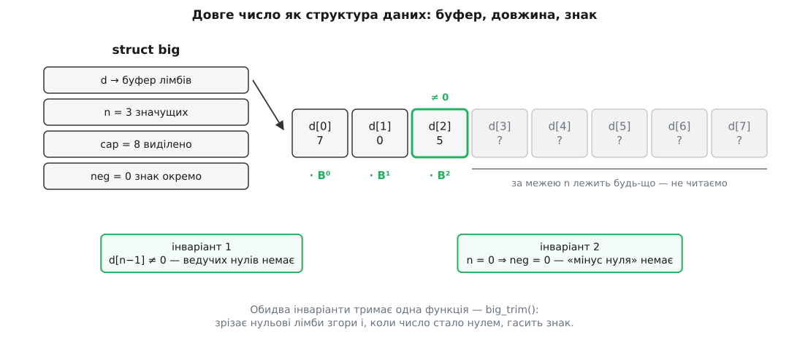
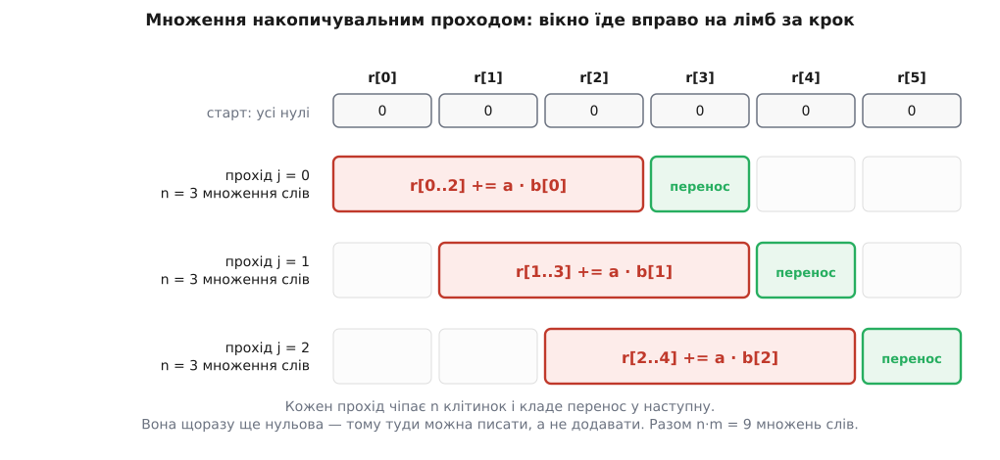

# ⚙️ Довгі цілі на C: ядро, яке справді працює

Ось повний модуль довгих цілих: структура даних, порівняння, додавання, віднімання, множення, зсуви й десятковий друк — трохи більше за двісті рядків C, розібраних по одній функції, з ціною кожної в машинних операціях. Це не начерк і не псевдокод: код компілюється як є й рахує числа, обмежені лише пам'яттю. Читати його варто тому, що бібліотека ховає рівно ті місця, де ламаються самописні реалізації, — а тут вони на видноті.

## Контракт: чим є число

Домовитися треба спершу про структуру, бо від неї залежить кожна наступна функція.

```c
#include <stdint.h>
#include <stdlib.h>
#include <string.h>

#if defined(__SIZEOF_INT128__)
typedef uint64_t          limb;    // «цифра» за основою B = 2⁶⁴
typedef unsigned __int128 dlimb;   // подвійне слово: сюди влазить добуток
  #define LIMB_BITS 64
#else
typedef uint32_t limb;
typedef uint64_t dlimb;
  #define LIMB_BITS 32
#endif

typedef struct {
    limb  *d;    // лімби, молодший — d[0]
    size_t n;    // скільки значущих: d[n−1] ≠ 0, або n = 0
    size_t cap;  // скільки лімбів виділено
    int    neg;  // 1 — від'ємне; для нуля завжди 0
} big;
```

`big x = {0};` — це готовий нуль, і жодного виклику до купи він не коштує. Далі буфер росте сам.

Два коментарі в оголошенні `n` і `neg` — насправді **інваріанти**, тобто твердження, які мусять бути істинними на вході й на виході кожної функції модуля. Перший: старший лімб не нульовий. Другий: у нуля знак додатний. Обидва здаються косметикою, і саме тому їх найчастіше порушують — а наслідки видно не одразу.


*Значущі лімби — це `d[0..n−1]`; далі до `cap` лежить сміття, яке ніхто не читає. Обидва інваріанти тримає одна маленька функція, і тому всі решта можуть на них покладатися.*

```c
static void big_trim(big *x) {
    while (x->n > 0 && x->d[x->n - 1] == 0) x->n--;
    if (x->n == 0) x->neg = 0;
}

static void big_reserve(big *x, size_t need) {
    if (x->cap >= need) return;
    size_t cap = x->cap ? x->cap : 4;
    while (cap < need) cap *= 2;
    limb *p = realloc(x->d, cap * sizeof *p);
    if (!p) abort();                 // у справжній бібліотеці — код помилки
    x->d = p;
    x->cap = cap;
}
```

Подвоєння ємності замість «додати рівно скільки треба» — не забаганка: воно робить сумарну вартість n додавань лінійною замість квадратичної, бо кожен лімб переїжджає в середньому один раз ([купа](topic:programming/heap-dynamic-memory) — область, з якої `realloc` бере пам'ять, і кожне звертання туди коштує на порядки більше за додавання двох слів). `abort()` при браку пам'яті — свідоме спрощення: у бібліотеці тут був би повернений код помилки, і кожен виклик довелося б перевіряти.

Порівняння модулів окупає перший інваріант негайно:

```c
static int cmp_abs(const big *a, const big *b) {
    if (a->n != b->n) return a->n < b->n ? -1 : 1;
    for (size_t i = a->n; i-- > 0; )
        if (a->d[i] != b->d[i]) return a->d[i] < b->d[i] ? -1 : 1;
    return 0;
}
```

Довше число більше — але **тільки** якщо ведучих нулів немає. Інакше `0x0000000000000001` із двох лімбів виявиться «більшим» за `0xFFFFFFFFFFFFFFFF` з одного, і помилка проросте всюди, де є віднімання. Цикл `for (size_t i = n; i-- > 0; )` — звичний спосіб пройти масив згори вниз беззнаковим індексом: перевірка `i-- > 0` порівнює старе значення й одразу зменшує, тож тіло бачить `i` від `n−1` до 0 і не загортається нижче нуля.

## Додавання й віднімання модулів

Два чесні ядра працюють із самими лімбами й нічого не знають про знак.

```c
// r[0..na] := a[0..na−1] + b[0..nb−1],  вимога na ≥ nb
// у r має бути місце на na+1 лімб; повертає довжину результату
static size_t add_abs(limb *r, const limb *a, size_t na,
                               const limb *b, size_t nb) {
    limb carry = 0;
    for (size_t i = 0; i < nb; i++) {
        limb ai = a[i], bi = b[i];
        limb s  = ai + bi;
        limb c  = (s < ai);        // загорнулося на a+b
        s += carry;
        c |= (s < carry);          // або вже на додаванні переносу
        r[i]  = s;
        carry = c;
    }
    for (size_t i = nb; i < na; i++) {   // хвіст довшого числа
        limb s = a[i] + carry;
        carry  = (s < carry);
        r[i]   = s;
    }
    r[na] = carry;
    return carry ? na + 1 : na;
}
```

Перенос тут дістають порівнянням, бо беззнакова сума загортається за модулем 2ᵂ і меншою за доданок може стати лише через це. Одночасно обидві перевірки не спрацьовують ніколи — після першого загортання залишок не більший за B−2, тож додавання одиниці вже не вилізе за межу, — і тому `|` є точним виразом переносу, а не наближенням.

Ще одна дрібниця в цьому циклі важить більше, ніж здається: `a[i]` і `b[i]` спершу лягають у локальні змінні, і лише потім пишеться `r[i]`. Завдяки цьому виклик `add_abs(x, x, n, y, m)` — коли результат є одним із доданків — працює правильно: прохід іде вперед, кожна ітерація чіпає рівно одну позицію, а прочитати її встигли до запису.

Віднімання дзеркальне, з позикою замість переносу:

```c
// r[0..na−1] := a − b, вимога |a| ≥ |b|; повертає довжину після зрізання
static size_t sub_abs(limb *r, const limb *a, size_t na,
                               const limb *b, size_t nb) {
    limb borrow = 0;
    for (size_t i = 0; i < nb; i++) {
        limb ai = a[i], bi = b[i];
        limb t  = ai - bi;
        limb br = (ai < bi);
        limb u  = t - borrow;
        br |= (t < borrow);
        r[i]   = u;
        borrow = br;
    }
    for (size_t i = nb; i < na; i++) {
        limb ai = a[i];
        r[i]   = ai - borrow;
        borrow = (ai < borrow);
    }
    size_t n = na;              // позики назовні бути не може: |a| ≥ |b|
    while (n > 0 && r[n - 1] == 0) n--;
    return n;
}
```

Різниця з додаванням лише в одному: довжина може **впасти** відразу на багато лімбів. `2¹²⁸ − (2¹²⁸ − 1)` — це два лімби мінус два лімби, а результат один-єдиний біт. Тому `sub_abs` зрізає ведучі нулі сам, не покладаючись на того, хто викликає.

Ціна обох — один прохід по n лімбах, O(n). Прохід послідовний: лімб i не порахувати, не знаючи переносу від i−1, тож розділити цю роботу між ядрами не вийде.

## Знак: один диспетчер на дві операції

У записі «знак і модуль» додавання й віднімання — це та сама дія з різним трактуванням знака другого доданка. Отже, писати два майже однакові диспетчери не треба:

```c
static void add_signed(big *r, const big *a, const big *b, int bneg) {
    if (a->neg == bneg) {                    // однакові знаки — модулі складаємо
        const big *x = a, *y = b;
        if (x->n < y->n) { const big *t = x; x = y; y = t; }
        big_reserve(r, x->n + 1);
        r->n   = add_abs(r->d, x->d, x->n, y->d, y->n);
        r->neg = a->neg;
    } else {                                 // різні — менший модуль віднімаємо
        int c = cmp_abs(a, b);
        if (c == 0) { r->n = 0; r->neg = 0; return; }
        const big *x = (c > 0) ? a : b;      // більший модуль
        const big *y = (c > 0) ? b : a;
        int sign = (c > 0) ? a->neg : bneg;  // знак більшого модуля
        big_reserve(r, x->n);
        r->n   = sub_abs(r->d, x->d, x->n, y->d, y->n);
        r->neg = sign;
    }
    if (r->n == 0) r->neg = 0;               // єдиний нуль, без «мінус нуля»
}

void big_add(big *r, const big *a, const big *b) { add_signed(r, a, b,  b->neg); }
void big_sub(big *r, const big *a, const big *b) { add_signed(r, a, b, !b->neg); }
```

Порядок рядків усередині гілки з відніманням не випадковий. `big_reserve` може викликати `realloc` і перенести буфер, тому `x->d` читають **після** резервування — з поля структури, а не з копії, узятої раніше. І з тієї самої причини знак спершу лягає в локальну `sign`: якщо `r` і `a` — той самий об'єкт, запис у `r->neg` затер би `a->neg` ще до того, як його прочитали б.

Порівняння перед відніманням — це третій прохід по лімбах на додачу до самого віднімання. Уникнути його не можна: не знаючи, який модуль більший, не знаєш, кого від кого віднімати, а позика за найстаршим лімбом не має куди подітися.

## Множення накопичувальним проходом

На папері множать так: усі часткові добутки окремо, потім сума. У пам'яті так робити марно — простіше одразу додавати кожен частковий добуток у результат.

```c
// r[0..na+nb−1] := a·b;  r НЕ може збігатися з a чи b
static void mul_basecase(limb *r, const limb *a, size_t na,
                                  const limb *b, size_t nb) {
    memset(r, 0, (na + nb) * sizeof *r);
    for (size_t j = 0; j < nb; j++) {
        limb bj = b[j], carry = 0;
        for (size_t i = 0; i < na; i++) {
            dlimb t  = (dlimb)a[i] * bj + r[i + j] + carry;
            r[i + j] = (limb)t;
            carry    = (limb)(t >> LIMB_BITS);
        }
        r[j + na] = carry;
    }
}
```

Внутрішній цикл — це весь модуль у мініатюрі: подвійне слово вміщує добуток двох лімбів **разом** зі старим значенням клітинки й переносом (найгірший випадок дає рівно B²−1, на одиницю менше за межу), молодша половина лишається на місці, старша йде далі.


*Прохід j чіпає клітинки з `r[j]` до `r[j+na−1]` і кладе перенос у `r[j+na]`. Попередні проходи туди ще не діставали, тож там гарантований нуль — і саме тому в останньому рядку присвоєння, а не додавання.*

Обґрунтуємо це, бо на такому місці помилка коштує дорого. Прохід j′ пише щонайдалі в позицію j′+na. Для всіх попередніх проходів j′ ≤ j−1, тобто j′+na ≤ j+na−1 — на одну позицію лівіше за ту, куди зараз лягає перенос. Клітинка `r[j+na]` ще нульова з `memset`, тому `=` тут не втрачає нічого.

Публічна обгортка мусить дати окремий буфер:

```c
void big_mul(big *r, const big *a, const big *b) {
    if (a->n == 0 || b->n == 0) { r->n = 0; r->neg = 0; return; }
    size_t n = a->n + b->n;
    limb *t = malloc(n * sizeof *t);
    if (!t) abort();
    mul_basecase(t, a->d, a->n, b->d, b->n);
    free(r->d);                    // r міг бути тим самим об'єктом, що a чи b:
    r->d   = t;                    // до цього рядка ми дочитали все потрібне
    r->cap = n;
    r->neg = (a->neg != b->neg);
    r->n   = n - (t[n - 1] == 0);  // лімбів або n, або n−1 — третього не буває
}
```

Множити «на місці» неможливо в принципі, і причина не в акуратності коду: позицію i+j читають знову на наступних проходах, тож затерти в ній аргумент означає зіпсувати ще не використані дані. Окремий буфер тут не оптимізаційний вибір, а вимога алгоритму.

Довжина добутку відома наперед із точністю до одного лімба. Обидва співмножники обрізані, тому |a| ≥ B^(na−1) і |b| ≥ B^(nb−1), звідки добуток не менший за B^(na+nb−2) — це щонайменше na+nb−1 лімбів; а зверху він менший за B^(na+nb). Отже, перевірити треба рівно один старший лімб.

Ціна — na·nb множень слів і стільки ж додавань подвійних слів, тобто O(n·m). Для двох чисел по 32 лімби це 1024 множення; для двох по 3200 лімбів — уже десять мільйонів, і саме тут бібліотеки перемикаються на рекурсивні схеми.

## Зсуви

Зсув потрібен не лише як «помножити на 2ᵏ»: на ньому тримається нормалізація перед повним діленням, і він же найдешевший спосіб узяти половину.

```c
void big_shl(big *x, size_t k) {
    if (x->n == 0 || k == 0) return;
    size_t words = k / LIMB_BITS, bits = k % LIMB_BITS;
    size_t n = x->n + words + (bits != 0);
    big_reserve(x, n);
    limb *d = x->d;                       // тільки ПІСЛЯ можливого realloc
    if (bits) {
        d[x->n + words] = d[x->n - 1] >> (LIMB_BITS - bits);
        for (size_t i = x->n - 1; i > 0; i--)
            d[i + words] = (d[i] << bits) | (d[i - 1] >> (LIMB_BITS - bits));
        d[words] = d[0] << bits;
    } else {
        for (size_t i = x->n; i-- > 0; ) d[i + words] = d[i];
    }
    memset(d, 0, words * sizeof *d);
    x->n = n;
    big_trim(x);
}

void big_shr(big *x, size_t k) {
    size_t words = k / LIMB_BITS, bits = k % LIMB_BITS;
    if (words >= x->n) { x->n = 0; x->neg = 0; return; }
    limb  *d = x->d;
    size_t n = x->n - words;
    if (bits) {
        for (size_t i = 0; i + 1 < n; i++)
            d[i] = (d[i + words] >> bits) | (d[i + words + 1] << (LIMB_BITS - bits));
        d[n - 1] = d[x->n - 1] >> bits;
    } else {
        memmove(d, d + words, n * sizeof *d);
    }
    x->n = n;
    big_trim(x);
}
```

Напрямок циклів тут не стиль, а коректність. Ліворуч кожен лімб їде на **більшу** позицію, тому йти треба згори вниз: інакше запис затре сусіда, який ще потрібен. Праворуч — навпаки, знизу вгору. Перевірка проста: якщо джерело й ціль в одному масиві, рухайся від того кінця, куди дані переїжджають.

Гілка `if (bits)` існує заради єдиного випадку: коли `bits` дорівнює нулю, вираз `>> (LIMB_BITS - bits)` перетворюється на зсув слова на всю його ширину, а це [невизначена поведінка](topic:programming/undefined-behavior) — стандарт мови не описує, що станеться, і компілятор має право припускати, що такого не буває. На x86 процесор бере кількість зсуву за модулем 64, тобто мовчки виконує зсув на нуль і повертає той самий лімб замість нуля; на іншій цілі результат буде інший. Помилка не падає й не попереджає — вона просто дає інше число.

Одна семантична деталь: обидві функції зсувають **модуль**. Для від'ємного числа `big_shr(x, 1)` дає округлення до нуля, а не до −∞, тобто −7 >> 1 стає −3, а не −4. Машинний арифметичний зсув поводиться інакше, і якщо код очікує від зсуву [ділення з підлогою](topic:math/floor-division), різниця в одиницю рано чи пізно вилізе.

## Ділення на одне слово й десятковий друк

Повне ділення числа на число — окрема історія з угадуванням цифри й виправленнями. Але для друку його не треба: досить ділити на **одне слово**, і тут формула точна.

```c
// x := x / v; повертає залишок. Вимога: v ≠ 0
static limb div_limb(big *x, limb v) {
    dlimb rem = 0;
    for (size_t i = x->n; i-- > 0; ) {
        dlimb cur = (rem << LIMB_BITS) | x->d[i];
        x->d[i]   = (limb)(cur / v);
        rem       = cur % v;
    }
    big_trim(x);
    return (limb)rem;
}
```

Звуження `(limb)(cur / v)` безпечне, і це варто побачити на числах: залишок завжди менший за дільник, тобто rem ≤ v−1, а тоді

```
cur = rem·B + цифра ≤ (v−1)·B + (B−1) = v·B − 1 < v·B
⇒ cur / v < B  — частка гарантовано вміщується в один лімб
```

Тепер друк. У 64-бітне слово найбільший степінь десятки вміщується як 10¹⁹, тож кожне ділення на цю сталу видає одразу дев'ятнадцять десяткових цифр.

```c
#if LIMB_BITS == 64
  #define DEC_CHUNK    UINT64_C(10000000000000000000)  // 10¹⁹ < 2⁶⁴
  #define DEC_DIGITS   19
  #define DEC_PER_LIMB 20        // 2⁶⁴−1 має рівно 20 цифр
#else
  #define DEC_CHUNK    UINT32_C(1000000000)            // 10⁹ < 2³²
  #define DEC_DIGITS   9
  #define DEC_PER_LIMB 10
#endif

// десятковий запис; звільняє буфер той, хто викликав
char *big_to_dec(const big *x) {
    size_t cap = x->n * DEC_PER_LIMB + 2;     // цифри + знак + '\0'
    if (cap < 3) cap = 3;
    char *s = malloc(cap);
    if (!s) abort();
    size_t pos = cap;
    s[--pos] = '\0';
    if (x->n == 0) { s[--pos] = '0'; memmove(s, s + pos, cap - pos); return s; }

    big t = {0};                              // ділення руйнівне — працюємо з копією
    big_reserve(&t, x->n);
    memcpy(t.d, x->d, x->n * sizeof *t.d);
    t.n = x->n;

    while (t.n > 0) {                         // пишемо з кінця буфера
        limb rem = div_limb(&t, DEC_CHUNK);
        for (int k = 0; k < DEC_DIGITS; k++) {
            s[--pos] = (char)('0' + rem % 10);
            rem /= 10;
            if (t.n == 0 && rem == 0) break;  // старша група — без ведучих нулів
        }
    }
    if (x->neg) s[--pos] = '-';
    free(t.d);
    memmove(s, s + pos, cap - pos);
    return s;
}
```

Умова виходу з внутрішнього циклу тонша, ніж виглядає. Ведучі нулі можна відкидати **лише** в найстаршій групі, тобто коли частка вже вичерпалася (`t.n == 0`). У всіх інших групах нулі значущі: число 10¹⁹ дає першу групу з дев'ятнадцяти нулів і другу з одиниці, і якщо ті нулі не написати, вийде «1» замість «10000000000000000000».

Ємність буфера рахуємо не «з запасом на око», а з логарифма:

```
цифр(n) ≤ ⌈n·W·log₁₀2⌉ = ⌈n·64·0.30103⌉ = ⌈19.266·n⌉
n = 1 → 20 цифр  (2⁶⁴−1 = 18446744073709551615)
n = 2 → 39 цифр
20·n завжди досить; + 1 на знак + 1 на '\0'
```

> 🔧 **Навіщо це.** Друк — єдина операція модуля, яка коштує O(n²): груп приблизно стільки ж, скільки лімбів (19.27 цифри на лімб проти 19 цифр у групі), і кожна група — прохід по всьому числу командою ділення, найповільнішою з цілочисельних. На ключі це непомітно, на мільйоні цифр — секунди. Практичний висновок простий: не кладіть `big_to_dec` у цикл і не логуйте великі числа десятковими. Шістнадцятковий вивід тим самим не є — там основа є степенем двійки, цифри нарізаються прямо з бітів, і вартість лінійна.

І окреме попередження про `dlimb`. Множення `(dlimb)a[i] * bj` компілятор перетворює на апаратне множення з подвійним результатом — одну команду на x86-64, дві на AArch64 (молодша й старша половини окремо). А от `cur / v` такої долі не має: поділити подвійне слово на слово компілятор не наважиться однією командою, бо в загальному випадку частка в слово не вміщується, — і для `unsigned __int128` GCC та Clang кличуть бібліотечну підпрограму `__udivti3` (залишок — `__umodti3`), тобто десятки команд замість однієї. Хто хоче апаратне ділення, бере його явно: у MSVC для x64 це `_udiv128` із `<immintrin.h>` (доступна з Visual Studio 2019), у GCC — вбудований асемблер із `divq`. Для друку різниця у швидкості разова, для повного ділення — вирішальна.

## Без `__int128`

Портативність тут коштує рівно одного `#if` на початку файлу, і це не випадковість, а наслідок того, що жодна функція не згадує число 64 прямо: скрізь стоять `limb`, `dlimb`, `LIMB_BITS` і десяткова стала. На 32-бітній цілі лімб стає `uint32_t`, накопичувачем — `uint64_t`, і код лишається байт у байт тим самим. Множення 32×32→64 більшість 32-бітних ядер уміє однією командою, тож внутрішній цикл так само щільний. Платня — вдвічі більше лімбів на те саме число, тобто **вчетверо** більше роботи в множенні.

Той самий `#if` спрацьовує на MSVC, бо він не визначає `__SIZEOF_INT128__` і 128-бітного типу не має. На x64 це надто дорога поступка, і правильна відповідь не «взяти 32-бітні лімби», а взяти вбудовані функції: `_umul128` дає обидві половини добутку, `_addcarry_u64` — додавання з переносом.

Найгірший випадок — ціль, де немає навіть множення 32×32→64 і компілятор підставляє бібліотечну підпрограму (в ARM EABI це `__aeabi_lmul`). Тоді кожне множення лімбів коштує виклику, і вигідніше взяти лімби по 16 бітів із накопичувачем `uint32_t`, а добуток збирати шкільним розкладом:

```
a·b = a₁b₁·2³² + (a₁b₀ + a₀b₁)·2¹⁶ + a₀b₀,   де a = a₁·2¹⁶ + a₀
```

Тут же й пастка цього розкладу: середня сума `a₁b₀ + a₀b₁` не вміщується в 32 біти — кожен доданок сягає (2¹⁶−1)², а разом вони переливаються через межу. Перенос із неї треба явно додати до старшої половини, і саме його забувають найчастіше.

## Ціна кожної операції

```
cmp_abs               O(n)      зазвичай виходить на першому ж лімбі
big_add / big_sub     O(n)      n = max(na, nb); прохід послідовний
big_mul (шкільне)     O(na·nb)  na·nb множень слів
big_shl / big_shr     O(n)      плюс можливий realloc у зсуві ліворуч
div_limb              O(n)      але кожен крок — команда ділення
big_to_dec            O(n²)     ≈ n викликів div_limb
```

## Пастки, на яких ловляться всі

**Аліасинг результату з аргументом.** Виклик `big_add(&x, &x, &y)` природний, і ядра модуля його витримують, бо читають обидва операнди в локальні змінні до запису. Але варто написати в сигнатурі `limb *restrict r` — і ви пообіцяли компіляторові, що `r` не перетинається з `a` та `b`; він має право розкласти цикл інакше, і той самий виклик перетвориться на [невизначену поведінку](topic:programming/pointer-aliasing) — код мовчки зламається на `-O2`, лишившись правильним на `-O0`. Множення ж не витримує аліасингу в жодному разі: `r` там читають повторно.

Підступніший різновид — не однаковий об'єкт, а два різні з одним буфером. `big c = a;` копіює структуру, тобто `c.d` і `a.d` вказують на ту саму пам'ять; перше ж `big_reserve(&c, …)` викличе `realloc`, і `a.d` стане висячим покажчиком. Або копіюйте глибоко, або запроваджуйте лічильник посилань — середини немає.

**Ведучі нулі й «мінус нуль».** Порушений перший інваріант ламає `cmp_abs` уже на порівнянні довжин. Порушений другий дає число, яке дорівнює нулю за модулем, але має знак: воно друкується як `-0`, порівняння «дорівнює» дає хибу, а перевірка «чи нуль» починає залежати від того, як її написали — через `n == 0` чи через значення. Обидва інваріанти має тримати одна функція, і кожен вихід із модуля мусить через неї пройти.

**Недооцінена довжина вихідного буфера.** Найдорожча помилка, бо вона мовчазна:

```
r = a ± b        →  max(na, nb) + 1 лімб
r = a · b        →  na + nb
r = a << k       →  n + k/W + 1
десятковий рядок →  20·n + 2 байти (для 64-бітних лімбів)
```

Спокуса написати `max(na, nb)` у першому рядку велика: сума двох n-лімбових чисел майже завжди має n лімбів. Майже — доки не трапиться `0xFFFF…F + 1`, і тоді зайвий лімб ляже за межу буфера, у сусідні дані. Випадкові тести цього не знайдуть: ймовірність натрапити на переповнення старшого лімба випадковими числами дорівнює 2⁻⁶⁴. Знаходить його [тестування властивостями](topic:programming/property-based-testing) — підхід, де замість готових пар чисел описують правило («для будь-яких a, b: (a+b)−b = a») і дають генераторові тягнути значення до країв: 0, 1, B−1, суцільні одиниці, числа на межі довжини.

**Утрачена старша половина добутку.** Класика, яку компілятор не позначає жодним попередженням:

```c
dlimb t = (dlimb)(a[i] * bj);   // ✗ множення вже сталося в 64 бітах
dlimb t = (dlimb)a[i] * bj;     // ✓ операнд розширено ДО множення
```

У першому рядку дужки ставлять розширення після множення, тобто розширювати вже нічого — старшої половини не існує. Те саме в 32-бітному варіанті: `uint64_t t = a32 * b32;` множить у 32 бітах, бо [просування типів](topic:programming/integer-promotion) розширює `uint32_t` щонайбільше до `unsigned int` тієї самої ширини, а не до типу лівої частини присвоєння. Симптом однаковий і особливо неприємний: доки числа малі, старша половина нульова й усе сходиться, а ламається код на великих — тобто рівно там, заради чого модуль і писали.

**Час, що залежить від даних.** Три місця тут «розумні»: `cmp_abs` виходить на першій різниці, `big_trim` зрізає нулі, а в `mul_basecase` спокусливо додати `if (bj == 0) continue;`. Для звичайних обчислень це чиста вигода. Для криптографії кожне таке місце — щілина, бо тривалість операції починає залежати від таємного числа, і [атака за часом](topic:programming/timing-attack) відновлює ключ із багатьох вимірювань. Криптографічний код працює з фіксованою довжиною й без залежних від даних розгалужень, свідомо витрачаючи зайві такти.

## Як переконатися, що воно правильне

Найдешевша перевірка — порівняння з чужою реалізацією: генеруєте випадкові пари, рахуєте `a+b`, `a−b`, `a·b`, друкуєте результат рядком і звіряєте з тим, що дає Python, де всі цілі й так довгі. У генератор обов'язково додайте нуль, одиницю, `B−1`, число з самих одиниць, різні довжини операндів і обидва знаки — саме на цих значеннях спрацьовують усі описані вище пастки, і жодна з них не спрацює на випадкових числах середнього розміру.
