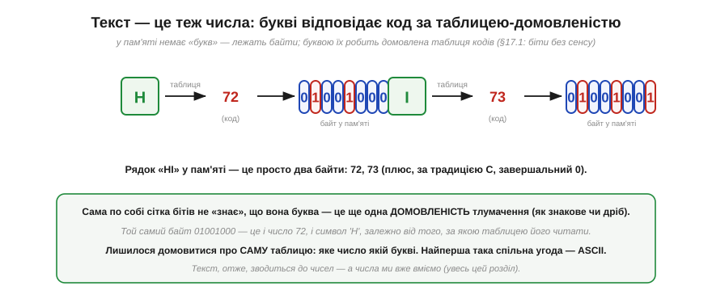
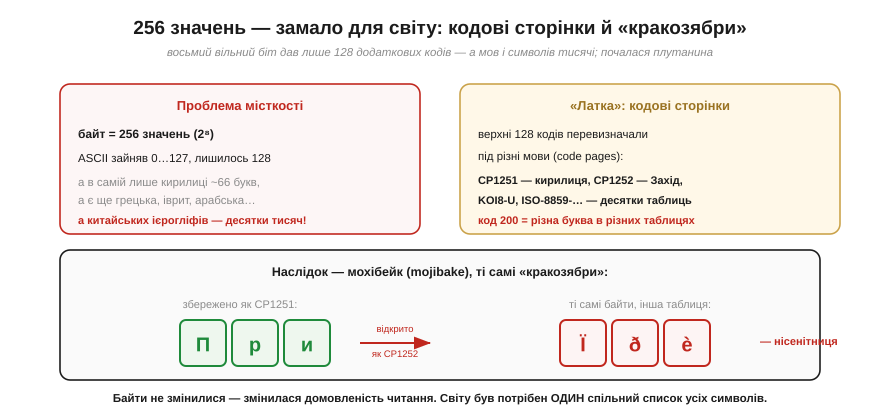

# Текст як числа: ASCII і UTF-8

Біти перетворюють на **числа** — додатні й від'ємні, дробові, величезні, — і весь час над цим стоїть одна наскрізна думка: біти не мають вродженого сенсу, сенс їм надає **домовленість**. Цю саму думку можна застосувати до того, що на перший погляд узагалі не схоже на числа, — до **тексту**. Адже коли ви набираєте «Привіт», у пам'яті немає жодних «букв»: там лежать ті самі [байти](book:programming/bits-bytes-endianness). Питання лише одне — за якою домовленістю їх читати, щоб байт став літерою. Ця тема — про дві такі домовленості: стару й просту **ASCII**, що лягла в основу всього, і сучасну **UTF-8**, якою сьогодні написаний майже весь текст у світі, зокрема й цей.

### Літера — це число за таблицею

Почнімо з найпростішого: як узагалі перетворити букву на число. Відповідь — через **домовлену таблицю**. Ми просто заздалегідь вирішуємо, яке число відповідає якій букві: 'H' нехай буде 72, 'I' — 73, і так для кожного символу. Тоді рядок тексту стає послідовністю чисел, а число ми вже вміємо покласти в байти.


*Рис. Рядок «HI» у пам'яті — це просто два байти: 72 і 73 (а за традицією мови C — ще й завершальний нуль, що позначає кінець рядка). Сама сітка бітів 01001000 не «знає», що вона літера: той самий байт — це і число 72, і символ 'H', залежно від того, за якою **таблицею** його читати. Це той самий принцип: біти без вродженого сенсу, сенс — у домовленості.*

Отже, текст зводиться до чисел — а з числами ми вже на «ти». Лишилося домовитися про **саму таблицю**: яке число якій букві. Тут і криється весь сюжет, бо таблиць було багато, і шлях від першої спільної угоди до сьогоднішнього стандарту виявився довгим. Найперша така загальноприйнята таблиця — **ASCII** — і досі лежить у фундаменті всього, тож із неї й почнімо.

### ASCII: 128 кодів у семи бітах

**ASCII** (*American Standard Code for Information Interchange*, «американський стандартний код для обміну інформацією», 1963) призначив числа 0…127 базовому набору символів: латинським буквам, цифрам, розділовим знакам і кільком службовим командам. Цих кодів **128**, тобто рівно **2⁷**, — тому ASCII-символ уміщається в **сім** бітів, із запасом влізаючи в байт (восьмий біт лишається вільним — і це стане важливим далі).

Та найцінніше в ASCII — не самі числа, а те, що їх розставили **не абияк**, а продумано впорядкували. Саме цей порядок робить ASCII не просто таблицею, а зручним інструментом.


*Рис. Коди ASCII лягають смугами. **0…31** — керівні (*control*) символи, що не друкуються, а керують: перенос рядка (LF=10), повернення каретки (CR=13), табуляція (9), нуль-кінець (0). **48…57** — десять цифр '0'…'9' поспіль. **65…90** — великі літери 'A'…'Z' за абеткою. **97…122** — малі 'a'…'z', рівно на 32 більші за відповідні великі. Цей лад — ключ до простих трюків нижче.*

Зверніть увагу на дві деталі, з яких усе випливає. По-перше, цифри й букви йдуть **суцільними блоками** за порядком: '0', '1', …, '9' — це підряд 48…57, а не врозкид. По-друге, велика й мала версії однієї літери різняться **рівно на 32**: 'A'=65, а 'a'=97. Ці дві властивості — не випадковість, а свідомий інженерний вибір, і саме завдяки їм робота з текстом часто зводиться до простої арифметики над кодами.

### Чому цей порядок зручний: три трюки

Покажімо на ділі, що дає продуманий порядок ASCII. Три прийоми, які з нього випливають, програміст застосовує буквально щодня.


*Рис. **Трюк 1 — цифра в число:** оскільки '0'…'9' ідуть поспіль, числове значення цифри-символу — це просто `символ − '0'` (для '7': 55 − 48 = 7). Так із текстового рядка цифр складають число. **Трюк 2 — регістр одним бітом:** велика й мала літери різняться лише бітом 5 (вага 32), тож `код | 32` робить літеру малою, `код & ~32` — великою, `код ^ 32` — перемикає. **Трюк 3 — i-та літера абетки:** `'A' + i` дає послідовні літери ('A'+0='A', 'A'+25='Z'), тож абетку перебирають циклом без жодної таблиці.*

**Приклад (рядок цифр у число).** Перетворимо текст «255» (три символи-цифри) на число 255, користуючись лише трюком 1.

```
символи:  '2'   '5'   '5'
коди:      50    53    53
−'0'(48):   2     5     5      ← кожна цифра стала своїм значенням
збираємо:  2·10 + 5 = 25,  далі 25·10 + 5 = 255   ✓
```

Саме так, цифра за цифрою, працює перетворення тексту на число «під капотом» функцій на кшталт `atoi`. Жодної магії — лише порядок ASCII і шкільне «помножити на 10 й додати». Цей приклад добре показує, **навіщо** взагалі впорядковували коди: правильно обраний лад перетворює роботу з текстом на звичайну арифметику, яку ми вже опанували.

> 🔧 **Навіщо це.** ASCII — це абетка, якою спілкуються майже всі давачі, модулі й протоколи: команди GPS, відповіді Wi-Fi-модулів, лог у термінал — усе це найчастіше **ASCII-текст**. Винесіть головне. Перше: **символ — це число** (буква 'A' — це байт 65), тож порівнювати, сортувати чи перебирати літери можна звичайними числовими операціями. Друге: **цифра-символ ≠ її значення** — '7' це 55, а не 7; щоб дістати число з тексту, віднімайте '0' (а щоб навпаки показати число — додавайте). Третє: знаючи, що великі й малі різняться бітом 32, ви легко робите порівняння без урахування регістру. Ці прийоми ви застосуєте, щойно почнете розбирати текстові відповіді пристроїв.

> ⚙️ **Поряд — алгоритм:** *UTF-8 декодер вручну* — як по бітах-префіксах першого байта впізнати довжину символу й зібрати його код-поінт, і чому завдяки цьому ASCII лишився підмножиною UTF-8.

### 256 значень — замало для світу

ASCII чудово служив, поки текст був англійський. Та щойно знадобилися інші мови — українська, грецька, китайська, — постала стіна: **кодів забракло**. Місткість байта жорстко обмежена: байт тримає лише 2⁸ = 256 значень. ASCII зайняв половину (0…127), лишивши вільними **128** кодів — а в самій лише кирилиці десятки букв, не кажучи вже про тисячі китайських ієрогліфів.


*Рис. Вільних кодів (128) вистачало хіба що на одну-дві додаткові мови, тож верхню половину байта почали **перевизначати** під різні мови — постали десятки **кодових сторінок** (*code pages*): CP1251 для кирилиці, CP1252 для Заходу, KOI8-U, ISO-8859-… В одній код 200 — одна буква, в іншій — зовсім інша. Наслідок — **мохібейк** (*mojibake*), ті самі «кракозябри»: текст, збережений в одній таблиці, а прочитаний в іншій, перетворюється на нісенітницю. Байти ті самі — змінилася лише домовленість читання.*

Цей «зоопарк» кодувань був постійним джерелом болю, і біль цей мав цілком буденний вигляд: той самий файл на іншому комп'ютері розсипався на безглузді символи лише тому, що сторони мовчки прийняли **різні** таблиці. Гірше того — навіть для **однієї** мови таблиць було по кілька й вони сперечалися між собою: українську й російську кирилицю писали і в CP1251 (від Windows), і в KOI8-U, і в кількох інших, геть несумісних розкладках, тож текст із одного середовища регулярно «ламався» в іншому. А головне — кодова сторінка тримала лише **свою** жменю мов: змішати в одному файлі, скажімо, українську, грецьку й арабську було просто нікуди — байт фізично один, а наборів символів три. Усе та сама пастка — біти прочитали не за тією домовленістю, — тут вона проявляється на тексті особливо боляче й щодня. Світу був потрібен **один** спільний список **усіх** символів **усіх** мов одразу, щоб раз і назавжди покінчити з плутаниною. Цим списком став **Unicode**.

### Unicode: один номер на кожен символ

**Unicode** розв'язує проблему в корені: він заводить **єдиний** велетенський каталог, де **кожному** символу будь-якої мови (і навіть емодзі) призначено власний унікальний номер — **код-поінт** (*code point*). Записують його як `U+` і [шістнадцяткове число](book:math/positional-systems): 'A' — це U+0041, 'Я' — U+042F, знак євро '€' — U+20AC.


*Рис. Unicode призначає номери всьому: латинська 'A' = U+0041 (= 65), кирилична 'Я' = U+042F, '€' = U+20AC, ієрогліф '中' = U+4E2D, емодзі '😀' = U+1F600 (= 128512). Критично важлива деталь: перші 128 код-поінтів Unicode — це **рівно ASCII** (U+0041 — це та сама 'A' = 65). Тобто ASCII цілком **уклали всередину** Unicode, не змінивши жодного коду.*

Простір цих номерів величезний: Unicode відводить під код-поінти діапазон від U+0000 аж до U+10FFFF — це понад мільйон можливих позицій, із яких заповнено вже близько 150 тисяч (усі писемності світу — живі й мертві, математичні знаки, технічні символи, емодзі), а решта чекає на майбутні доповнення. Запасу вистачить надовго. І зверніть увагу: Unicode свідомо **не прив'язаний** до жодного розміру байта чи слова — це просто **каталог номерів**, абстрактний список «символ → число», а не спосіб зберігання. Саме тому він і зміг охопити геть усе: його не обмежують ні 8, ні 16 бітів.

Та з цієї ж абстрактності випливає тонкість, яка визначить усе подальше: Unicode каже лише, **яке число** відповідає символу, — але **не каже**, як це число записати в байти. А це окреме й зовсім не тривіальне питання. Код-поінти ж бувають і малі (U+0041 = 65 влізе в один байт), і чималі (U+1F600 = 128512 — тут і двох байтів замало). Найпростіше, здавалося б, відвести під кожен символ однаково **чотири** байти — тоді влізе будь-який код-поінт (так і робить кодування UTF-32). Та це марнотратно: звичайний англійський текст роздувся б **учетверо**, бо кожна латинська буква, якій вистачило б одного байта, тягла б за собою три порожні. Як же укласти ці різнокаліберні номери в байти **ощадливо** — щоб дрібні коди займали мало, а великі вміщалися повністю? Відповідей вигадали кілька, та переможцем став напрочуд елегантний спосіб — **UTF-8**.

### UTF-8: від одного до чотирьох байтів

**UTF-8** (*Unicode Transformation Format, 8-bit*) — це конкретний спосіб **закодувати** код-поінт байтами. Його головна ідея — **змінна довжина**: малі коди займають один байт, більші — два, три або чотири. А щоб приймач завжди знав, скільки байтів читати, старші біти кожного байта несуть **префікс-мітку** його ролі.


*Рис. Схема UTF-8. Код-поінти **0…127** кодуються **одним** байтом `0xxxxxxx` — і це **точно той самий байт, що в ASCII**. Більші коди розкладають на 2–4 байти: початковий байт починається з `110…`, `1110…` чи `11110…` (стільки одиниць, скільки всього байтів у символі), а кожен наступний — із `10…` (мітка «я продовження»). Решта бітів (`x`) збирають у код-поінт. Так 'Я' → D0 AF (2 байти), '€' → E2 82 AC (3 байти), '😀' → F0 9F 98 80 (4 байти).*

Вдумаймося в красу цієї схеми. Перший байт сам каже, **скільки** байтів у символі: рахуй провідні одиниці. А кожен «продовжувальний» байт упізнаваний за початком `10`, тож його **неможливо сплутати** з початком символу. І найголовніше для нас — нижній рядок таблиці: оскільки коди 0…127 кодуються одним байтом `0xxxxxxx`, **усякий ASCII-текст уже є коректним UTF-8**, байт-у-байт. UTF-8 — це **надмножина** (*superset*) ASCII.

**Приклад (скільки байтів займе символ).** Прикиньмо, як закодується слово «Ti中» (латинські 'T', 'i' та ієрогліф).

```
'T' = U+0054 = 84      → 0…127  → 1 байт   (як ASCII: 0x54)
'i' = U+0069 = 105     → 0…127  → 1 байт   (як ASCII: 0x69)
'中' = U+4E2D = 20013  → 0x800…0xFFFF → 3 байти (E4 B8 AD)
разом: 1 + 1 + 3 = 5 байтів на 3 символи
```

Звідси видно важливий практичний висновок: у UTF-8 **кількість байтів не дорівнює кількості символів**. Латинська буква — це 1 байт, кирилична — 2, ієрогліф — 3, емодзі — 4. Тому довжину рядка в символах не можна визначити, просто полічивши байти, — про це варто пам'ятати, обробляючи текст.

### Чому переміг саме UTF-8

UTF-8 — не єдиний спосіб укласти Unicode в байти (є ще UTF-16 і UTF-32, що беруть по 2 чи 4 байти на символ). Та саме UTF-8 став стандартом вебу, файлів і систем. Чому? Через чотири дуже практичні чесноти.


*Рис. Чотири переваги UTF-8. **Сумісність з ASCII:** старі ASCII-тексти й код працюють без переробки. **Економність:** латинський текст і розмітка лишаються 1 байт/символ (а не роздуваються вдвічі-вчетверо, як у UTF-16/32). **Без порядку байтів:** UTF-8 — це потік **окремих байтів**, а не дво- чи чотирибайтових слів, тож проблеми endianness тут **просто немає**. **Самосинхронізація:** за будь-яким байтом видно його роль (`10…` — це середина символу), тож завжди можна знайти межу символу й відновитися після збою.*

Дві з цих чеснот варто розкрити докладніше. Сумісність з ASCII означає, що та сама буква 'A' = 65 = байт `01000001` залишається собою скрізь: і в найдавнішому ASCII-файлі, і в сучасному UTF-8; усі гори вже написаного коду й файлів стали валідним UTF-8 самі собою, без жодної переробки. А відсутність проблеми [порядку байтів](book:programming/bits-bytes-endianness) випливає з самої будови: оскільки UTF-8 оперує **окремими** байтами, а не багатобайтовими словами, переставляти нічого, і жоден `htons` тут не потрібен.

Щоб відчути цю перевагу гостріше, варто глянути на головного суперника — **UTF-16**, який кодує символи дво- чи чотирибайтовими одиницями. По-перше, він **не сумісний** з ASCII: навіть проста латинська 'A' займає там два байти (`00 41`), тож жоден старий ASCII-текст не є валідним UTF-16. По-друге, він одразу впирається в пастку [порядку байтів](book:programming/bits-bytes-endianness): двобайтову одиницю можна покласти big- або little-endian, тож файли UTF-16 змушені носити на початку спеціальну **мітку порядку байтів** (*byte order mark*, BOM), аби читач знав, з якого кінця їх розбирати. По-третє, найбільші код-поінти (емодзі, рідкісні ієрогліфи) UTF-16 теж кодує **двома** двобайтовими одиницями — так званими сурогатними парами, — тож «два байти на символ» там насправді не завжди два. UTF-8 усіх цих ускладнень позбавлений за самою будовою: потік байтів, ASCII всередині, жодного BOM.

Лишилася четверта чеснота — **самосинхронізація**, і вона теж дорогого варта. Загубивши чи спотворивши один байт у потоці, декодер UTF-8 просто шукає наступний байт, що **не** починається з `10`, — і там знаходить початок цілого символу, відновлюючись далі. У кодуванні фіксованої довжини один зайвий чи загублений байт зсунув би **весь** подальший текст, перетворивши його на суцільну нісенітницю; UTF-8 же «гоїться» сам уже на наступному символі.

> 🔧 **Навіщо це.** Сьогодні UTF-8 — типове кодування тексту всюди: у вихідному коді, файлах, вебі, обміні даними. Винесіть головне. Перше: **Unicode** дає кожному символу номер (код-поінт U+…), а **UTF-8** кодує цей номер байтами змінної довжини (1–4). Друге, найпрактичніше: **байтів ≠ символів** — латинська буква це 1 байт, кирилична 2, емодзі 4; не рахуйте довжину тексту байтами й не «ріжте» рядок посеред багатобайтового символу (вийде зіпсутий символ). Третє: **ASCII — це вже UTF-8**, тож англійський текст і старі файли сумісні самі собою. Четверте: на відміну від UTF-16, UTF-8 **не має проблеми [порядку байтів](book:programming/bits-bytes-endianness)** — ще одна причина брати саме його за замовчуванням. І класична порада: якщо текст показується «кракозябрами», майже завжди річ у тім, що його **читають не тим кодуванням**, яким записали.

> 📜 **Поряд — історія:** *UTF-8 на паперовій підкладці в дайнері* — як Кен Томпсон і Роб Пайк за вечерею 1992 року накидали схему, що поєднала сумісність зі старим ASCII й охоплення всіх мов світу, і чому вона виявилася такою живучою.

---

Отож **текст — це теж числа**, прочитані за домовленою **таблицею кодів**: байт 72 за нею стає літерою 'H'. Найперша спільна таблиця — **ASCII** (0…127, сім бітів): її коди впорядковані продумано — цифри й букви йдуть **поспіль**, а регістр різниться **бітом 32**, звідки прості трюки (`символ − '0'`, `код ^ 32`, `'A' + i`). Та 256 значень байта **замало** для всіх мов, тож постали несумісні **кодові сторінки** й **мохібейк**. Розв'язок — **Unicode**: єдиний каталог, де кожному символу дано номер — **код-поінт** (U+…), причому перші 128 збігаються з ASCII. Сам номер кодують у байти, і переможним способом став **UTF-8**: **змінна довжина** 1–4 байти з префікс-мітками (`0…`, `110…`, `10…`). Він **сумісний з ASCII** (ASCII-текст — уже валідний UTF-8), економний, **самосинхронний** і **не має проблеми порядку байтів** — тому й переміг. А головне практичне правило варто закарбувати: у UTF-8 **байтів ≠ символів**.
