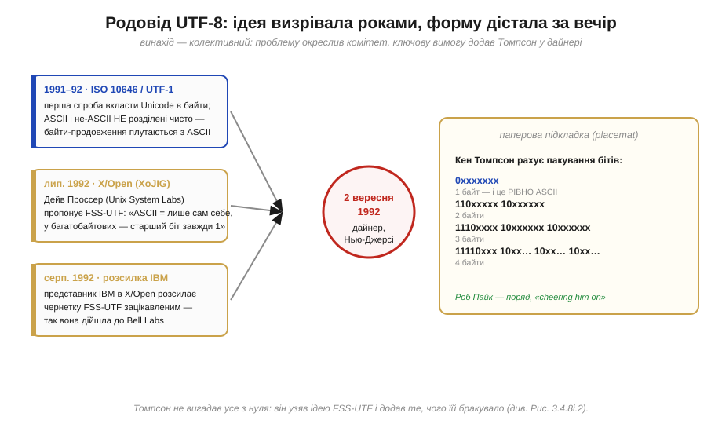
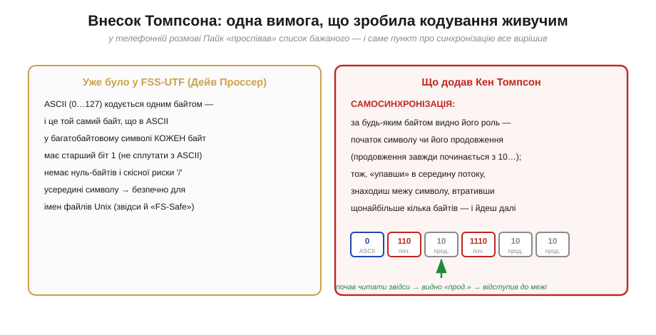
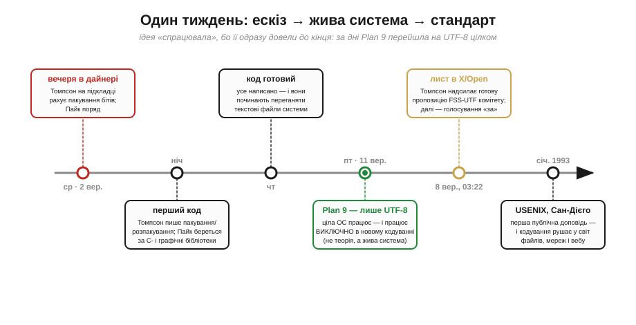

# 📜 Історія UTF-8 на паперовій підкладці в дайнері: Кен Томпсон і Роб Пайк, 1992

Схема [кодування UTF-8](book:programming/ascii-utf8) — змінна довжина, префікс-мітки, сумісність з ASCII, самосинхронізація — напрочуд елегантна. Тепер варто знати, **звідки** ця елегантність узялася, бо історія тут несподівана навіть для тих, хто знає кодування напам'ять. Кодування, яким сьогодні записано майже весь текст у світі, **накидали за один вечір на паперовій підкладці в придорожньому дайнері** двоє інженерів Bell Labs — **Кен Томпсон** (*Ken Thompson*) і **Роб Пайк** (*Rob Pike*), — а вся робота від ескізу до живої операційної системи зайняла **тиждень**. Це рідкісний випадок, коли можна майже похвилинно простежити, як народжується стандарт, що переживе всіх своїх сучасників.

Почнімо з очевидного запитання, яке ця історія ставить руба. Готова, доведена до блиску схема легко наводить на думку, що такі речі визрівають роками в комітетах. Здебільшого так і є. Та UTF-8 — виняток, який лише підтверджує правило: **роками визрівала проблема й більшість ідей, а останній, вирішальний штрих ліг за вечерю**. Щоб зрозуміти, що саме зробили Томпсон і Пайк, спершу треба побачити, **на що** вони спиралися — бо винаходи такого штибу майже ніколи не належать одній людині.

Та спершу — кілька слів про самих героїв вечері, бо без цього історія про серветку звучала б як байка. **Кен Томпсон** — не випадковий інженер: це творець операційної системи **Unix** (разом із Деннісом Рітчі) і мови програмування **B**, попередниці легендарної **C**; згодом за Unix він дістане **премію Тюрінга** — найвищу нагороду в інформатиці. **Роб Пайк** — його давній колега по Bell Labs, співавтор операційної системи **Plan 9** і пізніше один зі співтворців мови **Go**. Тобто на той паперовий клаптик схему накидали двоє людей, які **все життя** будували системи від найнижчого рівня — від байтів і файлів до цілих ОС. Саме тому те, що збоку скидається на застільний експромт, насправді спиралося на десятиліття досвіду: вони **миттєво** бачили, яким має бути добре кодування, бо все життя мучилися з кепськими.

## Чому ASCII перестало вистачати — і перші невдалі спроби

Корінь усієї історії простий: **ASCII** тримав лише 128 символів, і світові, що заговорив усіма мовами, цього стало катастрофічно мало. На початку 1990-х уже існував **Unicode** — велетенський каталог, де кожному символу дано номер (код-поінт, *code point*), — але лишалося відкритим болюче технічне питання: **як саме записати ці номери в байти?** Каталог каже, що 'Я' має номер U+042F, а ось у який ланцюжок байтів його перетворити — Unicode не приписував.

Перші відповіді виявилися кепські. Чернетка міжнародного стандарту **ISO 10646** несла кодування під назвою **UTF-1**, і воно мало ваду, від якої сьогодні здригнувся б кожен системний програміст: у ньому **не було чистого розділення між ASCII і не-ASCII**. Байти-продовження багатобайтових символів могли набувати тих самих значень, що й звичайні ASCII-символи, — тож стара програма, яка шукала в тексті, скажімо, скісну риску '/' чи нуль-байт, могла наткнутися на них **усередині** іншого символу й геть заплутатися. Для світу Unix, де ім'я файлу — це ланцюжок байтів, а '/' святий роздільник шляху, така властивість була отрутою.

Саме незадоволення UTF-1 і запустило ланцюг, що приведе нас до дайнера. Та перш ніж за стіл сядуть двоє з Bell Labs, важливий внесок зробили зовсім інші люди — і чесна історія мусить почати з них.

*Винахід UTF-8 — колективний. Проблему окреслив комітет **X/Open** (робоча група **XoJIG**), а більшість потрібних ідей зібрав у пропозиції **FSS-UTF** Дейв Проссер: саме там народилося золоте правило «ASCII кодується лише сам собою, а в багатобайтових символах кожен байт має старший біт 1». Цю чернетку розіслав представник IBM — так вона дійшла до Bell Labs. І вже **вечір 2 вересня 1992-го** (за спогадами Пайка — «у вересні чи десь так») додав останній штрих: Кен Томпсон на паперовій підкладці дайнера в Нью-Джерсі дорахував пакування бітів, а Роб Пайк, за його ж словами, «cheering him on» — підбадьорював поряд.*

## Комітет, Проссер і пропозиція FSS-UTF

Тут історія робить крок, який часто опускають у переказах «двоє геніїв на серветці», — а він принциповий для чесної атрибуції. Влітку 1992 року поліпшеним кодуванням заклопотався комітет **X/Open** (консорціум, що стандартизував Unix), а точніше його спільна з ISO робоча група **XoJIG**. І саме там, а не в дайнері, народилася **ключова ідея** майбутнього UTF-8.

Її автор — **Дейв Проссер** (*Dave Prosser*) з компанії **Unix System Laboratories**. У липні 1992-го він подав пропозицію кодування, яке назвали **FSS-UTF** — *File System Safe UCS Transformation Format*, «файлово-безпечний формат перетворення універсального набору символів». Назва незграбна, але вона прямо називає мету: зробити кодування **безпечним для файлової системи** Unix. Проссер запровадив рятівне правило, що згодом стане головною чеснотою UTF-8: **7-бітні символи ASCII кодуються самі собою, а будь-який багатобайтовий символ складається лише з байтів, у яких старший біт дорівнює 1**. Завдяки цьому всередині складеного символу **ніколи** не трапиться ані нуль-байта, ані коду '/', ані іншого ASCII-символу — стара програма не сплутає їх із роздільниками. Це й була та сама «надмножина ASCII», на якій тримається вся практичність кодування.

У серпні 1992-го цю чернетку **розіслав зацікавленим сторонам представник IBM** у X/Open — і так вона потрапила, серед інших, до групи **Plan 9** у Bell Labs. Отже, на стіл придорожнього дайнера лягла **не порожня серветка**: туди лягла вже добряче продумана ідея Проссера, якій бракувало рівно одного — і це «одне» виявилося вирішальним.

> 🔧 **Навіщо це.** Звідси — практичний урок про самі стандарти, не лише про текст. Те, чим ви користуєтеся щодня як «однією технологією», майже завжди **зшите з внесків кількох людей**: хтось окреслив проблему, хтось знайшов головну ідею, хтось додав вирішальний штрих, хтось довів до робочого коду. UTF-8 — підручниковий приклад: правило «ASCII = сам себе» належить Проссеру й комітету XoJIG, а не дайнеру. Коли наступного разу читатимете «X винайшов Y», згадуйте цей ланцюг — і шукайте повний список авторів. Це не педантизм: розуміючи, **хто яку частину** вирішив, ви точніше бачите, **яку саме** проблему кожна частина розв'язує.

## Телефонний дзвінок і список бажаного

Тепер сходяться дві лінії — пропозиція Проссера й люди, які доведуть її до досконалості. Поштовхом став **телефонний дзвінок**. Десь у серпні-вересні 1992-го Пайкові зателефонували учасники засідання комітету X/Open (Пайк згадує, що дзвонили, здається, з IBM, з Остіна) — і попросили **оцінити** ту саму чернетку FSS-UTF: мовляв, гляньте, чи годиться.

Реакція Пайка й Томпсона визначила все подальше. Замість того щоб просто відрецензувати чужу чернетку, Пайк, за власним спогадом, **«проспівав» співрозмовникам список бажаного** (*a list of desiderata*) — вимог, яким мало б відповідати будь-яке добре кодування. І виявилося, що FSS-UTF задовольняє майже всі, окрім **однієї**. Цієї прогалини вистачило, щоб Пайк і Томпсон відчули право — і дістали дозвіл — «зробити власне» (*roll our own*). Домовленість була проста й цілком у дусі Bell Labs: **якщо зможемо зробити швидко — гаразд**.

Що ж то за єдина вимога, якої бракувало? **Самосинхронізація** — здатність, підхопивши потік байтів **посеред** тексту, швидко знайти межу символу, втративши при цьому менш як один символ. Це і є та сама стійкість до збоїв: загубивши байт, декодер знаходить наступну межу за міткою `10…` і йде далі. У FSS-UTF Проссера цього не було — і саме це Томпсон збирався виправити.

*Внесок Томпсона точковий, але вирішальний. **Ліворуч** — те, що вже несла пропозиція Проссера: ASCII кодується одним байтом, кожен байт багатобайтового символу має старший біт 1, усередині символу немає ані нуля, ані '/'. **Праворуч** — те, що додав Кен Томпсон: **самосинхронізацію**. Тепер за будь-яким байтом видно його роль — початок символу чи продовження (продовження завжди починається з `10…`). Тож, «упавши» в середину потоку, декодер знаходить межу, відступивши щонайбільше на кілька байтів. Унизу — та сама ідея в дії: почавши читати з байта-продовження, декодер бачить мітку «прод.» і відступає до справжнього початку символу.*

Варто на мить спинитися на тому, **навіщо** ця властивість така цінна, — бо саме розуміння її ваги відрізняло Томпсона й Пайка від комітету. У кодуванні **фіксованої** довжини один загублений чи спотворений байт зсуває **весь** подальший текст: усе, що йде після збою, перетворюється на сміття, бо межі символів «поїхали». Самосинхронізація це лікує в корені: хоч би де стався збій, наступний символ декодер впізнає за міткою — і відновиться. Для надійних систем, мереж і файлів це не оздоба, а різниця між «текст трохи постраждав» і «текст знищено».

## Вечеря, на якій усе склалося

І ось ми нарешті в дайнері. Стояв вересень 1992-го (Пайк датує це «вереснем чи десь так»; з листів видно, що ескіз ліг приблизно **2 вересня**). За вечерею **Кен Томпсон дорахував пакування бітів** — ту саму схему, що лежить в основі UTF-8: скільки провідних одиниць у першому байті, стільки всього байтів у символі, а кожен наступний починається з `10`. Записував він це, за спогадом Пайка, **на паперовій підкладці** (*placemat*) — тих самих застільних серветках-підкладках, що лежать у придорожніх дайнерах. Роб Пайк був поруч і, за власними словами, «**cheering him on**» — підбадьорював і допомагав відточувати; авторство самої бітової упаковки він прямо віддає Томпсонові («Ken designed it with me cheering him on»).

Краса розв'язку, який ліг на ту підкладку, — у тому, **як** Томпсон забезпечив самосинхронізацію. Замість того щоб тулити окремий «маркер межі», він зробив так, що **сама форма байтів** її несе: байти-продовження мають жорсткий префікс `10`, якого не може мати ані початковий байт (той починається з `0`, `110`, `1110` чи `11110`), ані ASCII-символ. Тож роль кожного байта читається **локально**, без огляду на сусідів. Цю систему префіксів Томпсон вивів саме тут — щоб задовольнити останню, найкаверзнішу вимогу зі списку Пайка.

Підкреслимо ще раз чесний поділ заслуг, бо легенда любить його стирати. Томпсон **не вигадав усе з нуля** того вечора: золоте правило «ASCII = сам себе» він узяв у Проссера й комітету. Його власний внесок — **доточити** цю ідею так, щоб вона стала ще й самосинхронною, і знайти конкретну схему префіксів, що це забезпечує. Невелика на вигляд правка — а саме вона зробила кодування по-справжньому живучим.

## Тиждень, за який ідея стала живою системою

Те, що сталося далі, вражає не менше за вечерю, і саме воно перетворило вдалий ескіз на **стандарт**. Бо ідея на серветці — ще не технологія; технологією її робить робочий код. І ось тут Bell Labs показала свій фірмовий темп.

*Хроніка тижня. **Середа, ~2 вересня**: вечеря в дайнері, ескіз на підкладці. **Тієї ж ночі**: Томпсон пише код пакування й розпакування, Пайк береться переробляти C- і графічні бібліотеки. **Четвер**: код готовий — і вони починають переганяти текстові файли системи в нове кодування. **П'ятниця (~11 вересня)**: операційна система **Plan 9** працює — і працює **виключно** в новому кодуванні; це вже не теорія, а жива система. **8 вересня о 03:22** Томпсон надсилає готову пропозицію FSS-UTF до X/Open; комітет згодом голосує «за». **Січень 1993**: перша публічна доповідь на конференції USENIX у Сан-Дієго — і кодування рушає у світ.*

Розгорнімо цю хроніку, бо кожен крок повчальний. **Тієї ж ночі** після вечері Томпсон написав код, що пакує код-поінти в байти й розпаковує назад, а Пайк заходився переробляти під нове кодування системні бібліотеки Plan 9 — зокрема роботу з рядками й графікою. **Наступного дня** код був готовий, і вони почали **переганяти** весь текст системи в UTF-8. А вже **в п'ятницю** сталося головне: уся операційна система **Plan 9** (*Plan 9 from Bell Labs* — дослідницька ОС, спадкоємиця Unix) працювала — і працювала **лише** в новому кодуванні. Не «підтримувала поряд зі старим», а перейшла **цілком**. Десь усередині тижня, **8 вересня о 03:22 за нью-йоркським часом**, Томпсон надіслав остаточну пропозицію FSS-UTF комітетові X/Open.

Ось що відрізняє цю історію від тисяч ідей, які так і лишилися ідеями: Томпсон і Пайк не «запропонували концепцію» — вони за **кілька днів** довели її до того, що **ціла операційна система на ній жила**. Коли вони повідомили X/Open, що мають готове, перевірене на справжній системі кодування, яке вдовольняє всі вимоги, комітетові лишалося хіба погодитися — за переказом, відповідь була, що це **краще** за наявну чернетку. Жива система — найпереконливіший з усіх аргументів.

> 🔧 **Навіщо це.** Тут — урок про інженерію взагалі, не лише про текст: **різниця між ідеєю і технологією — це доведення до робочого коду**. Самосинхронну схему можна було б роками шліфувати в комітеті на папері; натомість її за тиждень утілили в живій ОС — і саме це зробило її стандартом, а не приміткою. Пишучи власні системи, тримайте це в голові: ескіз, який **працює** на справжніх даних, переважує десяток «концепцій». UTF-8 переміг суперників (UTF-16, UTF-32) не лише технічно, а й тому, що з першого тижня **існував у роботі**, а не на слайдах.

## Чому ця схема пережила всіх суперників

Лишається питання, яке природно завершує історію: **чому** саме цей вечірній ескіз, а не якесь із пізніших, ретельніше вилизаних кодувань, став універсальним стандартом тексту? Відповідь зводить докупи все сказане: ті самі чесноти UTF-8 — тільки тепер видно їхнє **походження**.

Сумісність з ASCII прийшла від **правила Проссера**: старий англомовний текст і код, що його обробляє, працюють без жодної переробки, бо ASCII-байт лишився собою. Самосинхронність — від **правки Томпсона**: потік стійкий до збоїв, межу символу видно локально. Економність і відсутність [проблеми порядку байтів](book:programming/bits-bytes-endianness) (endianness) випливають із самої будови — потоку **окремих байтів** змінної довжини, а не дво- чи чотирибайтових слів. А **довіру** галузі це кодування здобуло тим, що від першого тижня жило в реальній системі. Кожна з цих чеснот має свого автора або своє джерело — і разом вони пояснюють, чому світ зрештою зійшовся саме на UTF-8.

Контраст із головним суперником тут особливо повчальний. **UTF-16** бере на кожен символ дво- (а часом чотири-) байтові одиниці — а отже, негайно успадковує [**проблему порядку байтів**](book:programming/bits-bytes-endianness): один комп'ютер запише ці двобайтові одиниці big-endian, інший little-endian, і файл, перенесений між ними, прочитається задом наперед. Щоб це лагодити, UTF-16 змушений ставити на початку тексту спеціальну **мітку порядку байтів** (*Byte Order Mark*, BOM) — невидимий «маркер», що каже, з якого кінця читати; та сама морока з ендіанністю, що отруює числа, повертається до тексту. UTF-8 цієї недуги **позбавлений у корені**: потік окремих байтів читається однаково скрізь, ніякого BOM не треба. Те, що Томпсон і Пайк обрали байт за неподільну одиницю, — не випадковість і не лише смак: це свідома втеча від рівно тієї пастки, що отруює багатобайтові формати. Так розв'язок, накиданий за вечерю, обходить проблему, з якою UTF-16 воюватиме все життя.

Перша публічна доповідь відбулася на конференції **USENIX** у Сан-Дієго в **січні 1993-го**, і відтоді кодування поволі, а потім стрімко завоювало файли, мережі й веб; сьогодні переважна частина тексту в інтернеті — це UTF-8. Що ж винести з цієї історії, окрім чудового анекдоту про серветку? Передусім — **тверезе розуміння, як народжуються стандарти**. Не з осяяння однієї людини й не лише з багаторічної праці комітету, а з **поєднання**: комітет (XoJIG) і Проссер дали ідею та правило, телефонний дзвінок і список Пайка виявили прогалину, Томпсон за вечерю її закрив, а спільна тижнева гонитва за кодом зробила результат **незаперечним**. Приберіть будь-яку ланку — і UTF-8, можливо, не було б.

І ще одне, найприземленіше. Наступного разу, набираючи будь-якою мовою світу — українською, китайською, емодзі — і знаючи, що під сподом лягають байти UTF-8, згадайте: цю схему накидали **за вечір на застільній підкладці** в придорожньому дайнері двоє інженерів, які мали добрий смак, чітке відчуття потрібного й звичку доводити справу до робочого коду за тиждень. Великі речі не завжди народжуються у великих залах — інколи їх рятує одна точна вимога, проспівана в телефон, і одна підкладка під рукою.
