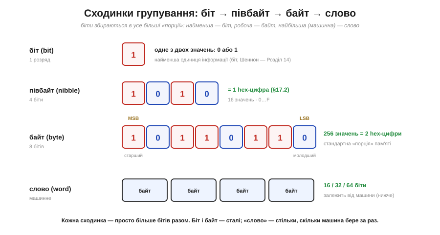
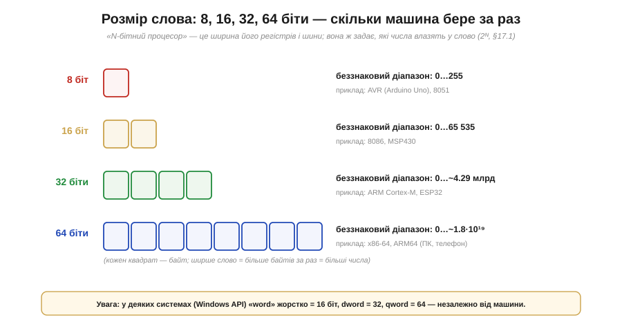
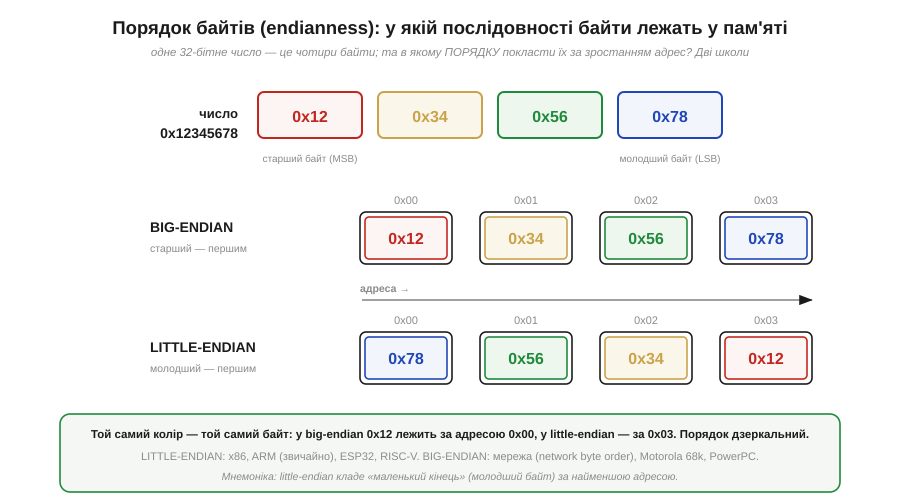
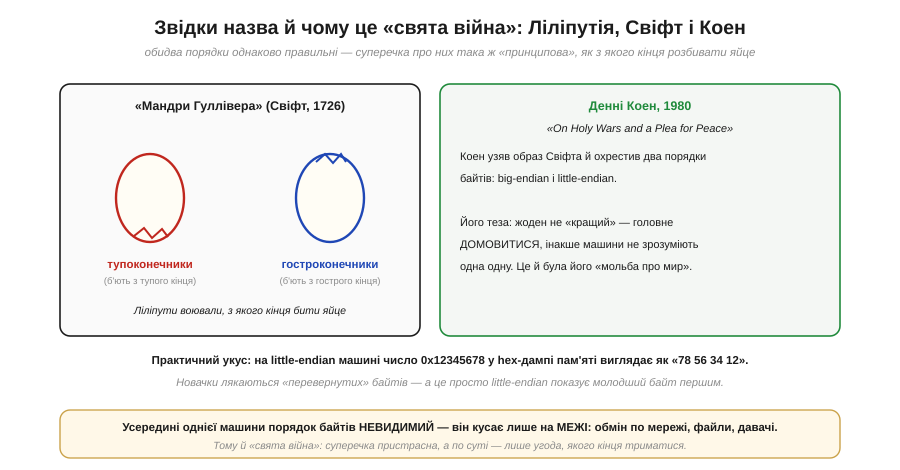
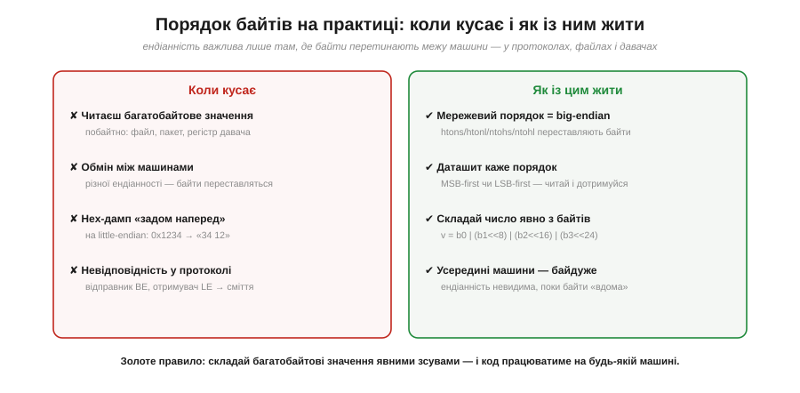

# Біти, байти, слова й порядок байтів (endianness)

Біти самі по собі — лише нулі й одиниці; працюємо ж ми з **числами** — додатними, від'ємними, дробовими, величезними. Між одним і другим стоїть найприземленіше, але напрочуд практичне питання: як саме біти **групуються** в ті одиниці, якими ми оперуємо щодня (байт, слово), і — найпідступніше — у якому **порядку** окремі байти багатобайтового числа лежать у пам'яті. Останнє зветься **порядком байтів**, або **endianness**, і саме воно стоїть за цілим класом багів «байти прийшли задом наперед», коли дані переходять з машини на машину, з файлу в програму, з давача в мікроконтролер. Питання це нерозривне з тим, як байти живуть за **адресами** в [пам'яті](book:programming/memory-as-array), до якої їх адресує [процесор](book:programming/what-is-processor).

### Сходинки групування: біт, півбайт, байт, слово

Почнімо з ієрархії одиниць. Біти не плавають поодинці — вони збираються в усе більші «порції», у кожної з яких є власна назва й роль.


*Рис. Сходинки групування бітів. **Біт** (*bit*) — один двійковий розряд, одне з двох значень (0/1), найменша одиниця інформації (слово запропонував Дж. Тьюкі, у науку ввів Шеннон). **Півбайт** (*nibble*) — 4 біти; оскільки 16 = 2⁴, він точно відповідає **одній hex-цифрі** [шістнадцяткового запису](book:math/positional-systems). **Байт** (*byte*) — 8 бітів, 256 значень, дві hex-цифри; це **стандартна порція**, якою міряють пам'ять. **Слово** (*word*) — найбільша, **машинно-залежна** одиниця: стільки бітів, скільки процесор обробляє за один раз (16, 32 чи 64).*

Зверніть увагу на дві позначки над байтом: **MSB** і **LSB**. Це **старший** (*most significant bit*) і **молодший** (*least significant bit*) біти. Старший — той, що має найбільшу вагу (ліворуч, вага 128 у байті); молодший — з вагою 1 (праворуч). Це та сама [позиційність](book:math/positional-systems), лише названа: «старший» розряд найдужче впливає на значення, «молодший» — найслабше, як у десятковому 235 цифра 2 (сотні) старша за 5 (одиниці). Біти зазвичай нумерують від нуля з **молодшого** кінця: біт 0 — це LSB (вага 1), біт 7 — MSB байта (вага 128). Цю термінологію — старший/молодший, MSB/LSB — ви зустрічатимете в кожному даташиті, тож варто засвоїти її твердо: вона ключова і для розміру слова, і для порядку байтів.

### Розмір слова: ширина машини

Біт і байт — сталі величини (біт завжди 1 розряд, байт завжди 8). А от **слово** — гнучке: це стільки бітів, скільки конкретна машина бере «за один присід». Саме ця ширина й ховається за словами «8-бітний», «32-бітний процесор».


*Рис. Розмір слова — ширина машини. «N-бітний процесор» означає, що його **[регістри](book:electronics/register)** і **шина** даних завширшки N бітів — тобто він тримає й переганяє N бітів за раз. 8 біт = 1 байт (діапазон 0…255; AVR в Arduino Uno); 16 біт = 2 байти (0…65 535); 32 біти = 4 байти (0…~4.29 млрд; ESP32, ARM Cortex-M); 64 біти = 8 байтів (0…~1.8·10¹⁹; ПК і телефони). Ширше слово — більше байтів за раз і більші числа в одному регістрі.*

Тут прямо змикаються кілька ідей. Місткість слова — це формула **2ᴺ**: N бітів [дають саме 2ᴺ різних комбінацій](book:math/why-binary), тож 8-бітне слово тримає 2⁸ = 256 значень, 32-бітне — 2³² ≈ 4.3 мільярда. А межі цих діапазонів — це рівно ті межі, за якими чигає [**переповнення**](book:programming/overflow-wraparound): саме тому 8-бітний лічильник «обнуляється» на 256, а 32-бітний — аж на ~4.3 мільярда. Коли ви оголошуєте змінну `uint8_t`, `uint16_t` чи `uint32_t`, ви буквально обираєте, скільки байтів слова під неї віддати — і тим самим, які числа в неї влізуть.

Одне застереження про саме слово «слово». У теорії воно дорівнює природній ширині машини, але на практиці термін **неоднозначний**: у деяких системах (зокрема в Windows API) «word» історично закріпили за **16 бітами** назавжди, незалежно від машини, а ширші одиниці назвали **dword** (32 біти) і **qword** (64 біти). Тож, читаючи документацію, завжди уточнюйте, що там розуміють під «словом», — машинну ширину чи фіксовані 16 бітів.

### Порядок байтів: дві школи укладання

А тепер — серце цього підрозділу й найпідступніша його частина. [Пам'ять — це **масив байтів**](book:programming/memory-as-array), де кожен байт має свою **адресу**: 0, 1, 2, 3… Кожна комірка тримає рівно **один** байт. І ось питання: якщо в нас є 32-бітне число — а це **чотири** байти, — і ми хочемо покласти його в пам'ять, у якому **порядку** розставити ці чотири байти по чотирьох послідовних адресах?

Виявляється, тут є **дві** рівноправні домовленості, і світ так і не дійшов згоди, обравши одну.


*Рис. Big-endian проти little-endian. Число 0x12345678 складається з чотирьох байтів: старший 0x12 (MSB) … молодший 0x78 (LSB). **Big-endian** («великий кінець першим») кладе **старший** байт за **найменшою** адресою: 0x00→12, 0x01→34, 0x02→56, 0x03→78 — як ми пишемо числа зліва направо. **Little-endian** («малий кінець першим») кладе **молодший** байт за найменшою адресою: 0x00→78, 0x01→56, 0x02→34, 0x03→12 — дзеркально. Той самий колір — той самий байт: простежте, як 0x12 (червоний) переїжджає з адреси 0x00 у big-endian на 0x03 у little-endian.*

Вдумаймося, що відбувається. **Big-endian** інтуїтивно ближчий людині: байти лежать у тому ж порядку, як ми звикли читати число — найвагоміший спочатку. Саме його обрали як **мережевий порядок** (*network byte order*) у протоколах інтернету, а також процесори Motorola 68000, PowerPC, SPARC. **Little-endian** виглядає «перевернутим» — молодший байт першим, — та в нього є своя інженерна логіка (молодший байт завжди за тією самою, найменшою адресою, незалежно від того, 1-, 2- чи 4-байтове число ви читаєте). Його обрала переважна більшість сучасних масових процесорів: уся родина **x86/x86-64** (ПК), **ARM** у звичайному режимі (телефони), **RISC-V** і — важливо для нашого курсу — **ESP32** (ядро Xtensa). Тобто ваш мікроконтролер — little-endian.

Підкреслю ще раз ключове: **жоден порядок не «правильніший»**. Це чиста домовленість, як вибір боку дороги для руху. Біда лише тоді, коли дві сторони домовилися **по-різному**, а байти треба передати між ними.

### Велике й мале: звідки кумедна назва

Назви «big-endian» і «little-endian» звучать химерно — і недарма: вони з **сатири**.


*Рис. «Свята війна» порядків байтів. У «Мандрах Гуллівера» (Джонатан Свіфт, 1726) ліліпути ведуть запеклу війну за те, **з якого кінця** правильно розбивати варене яйце — з тупого («тупоконечники») чи з гострого («гостроконечники»). 1980 року інженер **Денні Коен** у статті «On Holy Wars and a Plea for Peace» («Про священні війни й заклик до миру») запозичив цей образ і назвав два порядки байтів **big-endian** і **little-endian**. Його теза: жоден не кращий — головне **домовитися**, інакше машини не зрозуміють одна одну.*

Іронія Свіфта була влучна: суперечка про порядок байтів і справді безглузда по суті (обидва способи однаково робочі), а проте здатна породити нескінченні «принципові» баталії — точнісінько як ліліпутська війна за яйце. Коен своєю статтею не лише дав двом таборам назви, а й мудро закликав не воювати, а просто узгоджувати.

І ось де ця історія перестає бути кумедною й починає кусати на практиці. На **little-endian** машині (тобто на вашому ПК чи ESP32) число 0x12345678 у **hex-дампі** пам'яті виглядає як «**78 56 34 12**» — задом наперед щодо того, як ви його написали. Новачок, уперше побачивши таке в налагоджувачі, певен, що сталася помилка, — а насправді це просто little-endian чесно показує молодший байт першим. Тому варто закарбувати: **усередині однієї машини** порядок байтів цілком **невидимий** — процесор послідовно і пише, і читає в тому самому порядку, тож числа працюють правильно й ви про endianness навіть не згадуєте. Він **кусає лише на межі**: коли байти «виходять» із машини в зовнішній світ — у мережу, у файл, на іншу машину, у давач.

### На практиці: коли кусає й як із цим жити

Зберімо докупи, де саме порядок байтів стає проблемою — і як її щоразу знешкодити.


*Рис. Endianness на практиці. **Коли кусає** (ліворуч): коли ви читаєте багатобайтове значення **побайтно** (з файлу, мережевого пакета, регістра давача); коли обмінюєтеся даними між машинами **різної** ендіанності; коли hex-дамп виглядає «перевернутим»; коли відправник і отримувач у протоколі розійшлися в порядку — і виходить сміття. **Як жити** (праворуч): пам'ятати, що **мережевий порядок — big-endian**, і користуватися перетворювачами `htons/htonl/ntohs/ntohl`; **читати даташит** давача, де порядок (MSB-first чи LSB-first) завжди вказано; **складати** багатобайтове число явними зсувами; і пам'ятати, що **вдома, в межах машини, ендіанність невидима**.*

Найважливіша порада — остання в правій колонці, тож винесімо її окремо як **золоте правило**. Коли вам треба зібрати багатобайтове число з окремих байтів (типова ситуація: давач по I²C чи SPI віддає 16-бітну величину двома байтами), **не покладайтеся** на те, як байти лежать у пам'яті, — **складайте число явно зсувами**:

```c
// давач віддав старший байт hi й молодший байт lo
uint16_t value = ((uint16_t)hi << 8) | lo;   // працює на БУДЬ-ЯКІЙ машині
```

Такий код **самодостатній**: він каже точно, який байт старший, а який молодший, і дає той самий результат і на little-, і на big-endian машині. Натомість «хитрі» трюки на кшталт приведення вказівника на байтовий буфер до `uint16_t*` працюватимуть лише на машині «правильної» ендіанності — і це ще не вся біда: таке приведення наражає на дві інші пастки C, **незалежні** від порядку байтів. Перша — **вирівнювання** (*alignment*): на багатьох архітектурах читати 16-/32-бітне значення з невирівняної адреси не можна (апаратний виняток або тихо повільне читання). Друга — **суворе аліасування** (*strict aliasing*): стандарт C забороняє читати ті самі байти крізь вказівники несумісних типів, і компілятор має право «оптимізувати» такий код у несподіваний спосіб. Тому надійний шлях — **явне складання зсувами** (або `memcpy`), а не приведення вказівника: саме воно й породжує найневловиміші переносні баги. Те саме стосується мережі: дані в протоколах TCP/IP передають у big-endian, тож перед відправкою 16- чи 32-бітних чисел їх проганяють через `htons`/`htonl` (*host to network*), а після отримання — через `ntohs`/`ntohl` (*network to host*); на big-endian машині це нічого не робить, на little-endian — переставляє байти. Ви не зобов'язані пам'ятати, **яка** у вас машина, — ці функції роблять правильно скрізь.

> 🔧 **Навіщо це.** Порядок байтів — це те, об що спотикається кожен, хто вперше переганяє дані між пристроями. Винесіть головне. Перше, термінологія на все життя: **MSB — старший біт/байт, LSB — молодший**; «байт» — 8 бітів (256 значень), «слово» — машинна ширина (8/16/32/64 біти), і вона ж визначає межі ваших змінних (звідси [2ᴺ значень](book:math/why-binary) і поріг [переповнення](book:programming/overflow-wraparound)). Друге, суть endianness: багатобайтове число можна покласти в пам'ять **двома** способами — **big-endian** (старший байт за меншою адресою, «як пишемо»; це мережевий порядок) або **little-endian** (молодший першим; так роблять x86, ARM, **ESP32**). Третє, найпрактичніше: **усередині машини це невидимо**, кусає лише на **межі** — мережа, файли, давачі; на little-endian машині 0x12345678 у пам'яті виглядає «78 56 34 12», і це нормально. Четверте, **золоте правило**: збирайте багатобайтові значення **явними зсувами** (`hi<<8 | lo`), а в мережі — через `htons/htonl` — і ваш код працюватиме скрізь, не залежно від ендіанності заліза. Більшість «байти переплутались» багів — це або неузгоджений порядок, або надія на розкладку пам'яті замість явного складання.

---

Підсумуймо. Біти групуються в усе більші одиниці — **біт** (1 розряд), **півбайт** (4 біти = 1 hex-цифра), **байт** (8 бітів = 256 значень), **слово** (машинна ширина: 16/32/64 біти). Старший біт/байт — **MSB** (найбільша вага), молодший — **LSB**. Розмір слова — це ширина регістрів і шини («32-бітний процесор»), і він задає межі чисел ([2ᴺ значень](book:math/why-binary); поріг [переповнення](book:programming/overflow-wraparound)). Головне ж — **порядок байтів** (endianness): багатобайтове число лягає в пам'ять або **big-endian** (старший байт за найменшою адресою; мережевий порядок, Motorola/PowerPC), або **little-endian** (молодший першим; x86, ARM, **ESP32**, RISC-V). Назви — із сатири Свіфта, узаконені Коеном 1980-го; жоден порядок не «кращий», важливо **узгодити**. Усередині машини endianness невидима, кусає лише на **межі** (мережа, файли, давачі), де little-endian показує число «задом наперед». **Золоте правило**: складайте багатобайтові значення **явними зсувами**, а в мережі — через `htons/htonl`, — і код буде переносним.

---
