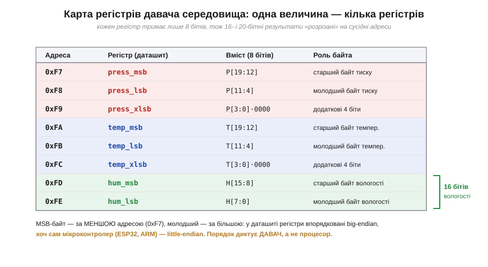
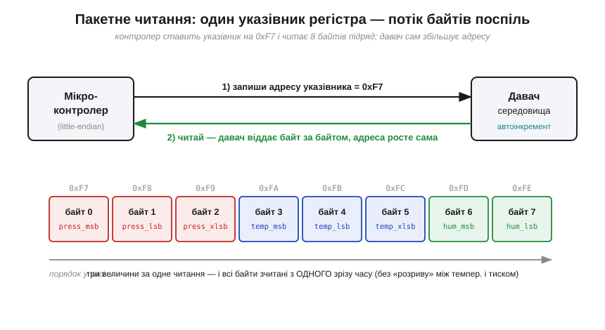
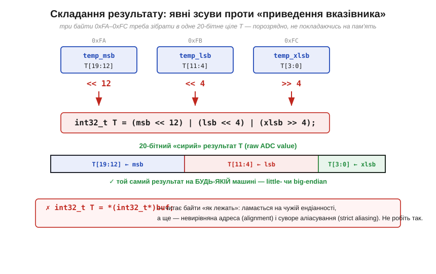

# 🔌 Endianness у даташитах давачів: 16-бітне значення двома регістрами

> Багатобайтове число можна покласти в пам'ять двома способами, тож [порядок байтів](book:programming/bits-bytes-endianness) щоразу треба знати, а збирати число варто **явними зсувами** (`hi << 8 | lo`). Тут це правило зустрічається з залізом упритул — на прикладі **давача середовища** (BME-клас: температура, тиск, вологість), який віддає кожну величину **не одним числом, а кількома 8-бітними регістрами**. Саме на цьому стику новачок уперше бачить «перевернуті» байти живцем — і саме тут знання про порядок байтів рятує від цілого класу багів.

### Що це за клас пристроїв

Давач середовища — крихітний чип у корпусі завбільшки з рисове зерня, що міряє одразу кілька фізичних величин і віддає їх уже в цифрі. Усередині — три аналогові перетворювачі (тиск, температура, вологість), цифровий блок керування й банк **регістрів**: маленьких комірок по 8 бітів, кожна зі своєю адресою, з яких контролер і вичитує результат. Чому 8 бітів? Бо шина, якою чип говорить ([I²C](book:communications/i2c-bus) або [SPI](book:communications/spi-bus) — тут досить знати, що дані ходять **байтами**), оперує саме байтами. А виміряне значення в нього **ширше** за байт: температуру й тиск такі давачі видають із роздільністю 20 бітів, вологість — 16. Звідси й уся складність: 20-бітне число фізично не вміщається в один 8-бітний регістр, тож його **ріжуть** на сусідні адреси.

### Блок-схема й розпіновка


*Рис. Виміряну величину розкладено на сусідні регістри. Тиск і температура займають по **три** регістри (msb/lsb/xlsb — старший, молодший і «екстра-молодший» з додатковими 4 бітами), вологість — **два** (msb/lsb). Ключове спостереження: **старший байт лежить за МЕНШОЮ адресою** (0xF7), молодший — за більшою. У просторі регістрів давач упорядкований **big-endian** — хоч мікроконтролер під ним (ESP32, ARM) усередині little-endian. Порядок тут диктує не процесор, а **давач**, і дізнаються його з даташита.*

Звідси — і розпіновка. Крім самих ліній шини (дві в I²C, чотири в SPI) у чипа є живлення **VDD** (типово 1.8–3.3 В, рівні узгоджуються з [логікою](book:electronics/logic-families) 3.3-вольтового МК), спільна земля **GND** і кілька службових виводів вибору адреси чи режиму шини. Жодних аналогових проводів від чипа вже не йде: уся «аналогова» частина схована всередині, а назовні виходить лише цифра. Для нас важлива не стільки фізична цоколівка, скільки **карта регістрів** із рисунка вище — саме вона каже, за якою адресою лежить який байт.

### Перший байт: як заговорити й що прийде у відповідь

Найдешевший і найнадійніший спосіб забрати показники — **пакетне читання** (*burst read*): поставити «указівник» на перший потрібний регістр і вичитати кілька байтів поспіль, бо адреса всередині давача збільшується сама.


*Рис. Контролер один раз пише адресу указівника (0xF7) — і читає 8 байтів підряд; давач після кожного байта сам переходить на наступну адресу. Так усі три величини знімаються **за один зріз часу**, без «розриву» між тиском і температурою. Байти приходять у порядку зростання адрес: старший — першим (бо він за меншою адресою).*

І ось тут [порядок байтів](book:programming/bits-bytes-endianness) кусає: перший байт у відповіді — **старший** (`temp_msb`), а ваш мікроконтролер чекав би молодший першим. Якби ви наївно скопіювали два прийняті байти в `uint16_t` через пам'ять, на little-endian ESP32 вони стали б **навпаки** — і термометр показав би безглуздя. Рятунок — золоте правило: складати число **явними зсувами**, а не покладатися на розкладку пам'яті.


*Рис. Три байти 0xFA–0xFC збираються в одне 20-бітне «сире» ціле порозрядно: `T = (msb << 12) | (lsb << 4) | (xlsb >> 4)`. Такий код дає однаковий результат на будь-якій машині. Натомість «хитре» приведення `*(int32_t*)buf` читає байти «як лежать» — і ламається і на чужій ендіанності, і на невирівняній адресі (alignment), і на суворому аліасуванні (strict aliasing).*

```c
// прийняли 8 байтів у buf[0..7]; старший — першим (big-endian давача)
int32_t t_raw = ((int32_t)buf[3] << 12) | ((int32_t)buf[4] << 4) | (buf[5] >> 4);  // 20 біт темпер.
uint16_t h_raw = ((uint16_t)buf[6] << 8) |  buf[7];                                 // 16 біт вологості
```

### Типові граблі

Перші, найчастіші, — **переплутаний порядок**: зібрати число «молодший<<8 | старший», бо так звик. Симптом упізнаваний: показник скаче безглуздими стрибками, а замість плавної температури — «шум» у тисячі одиниць. Другі — забути про **xlsb**: відкинути третій регістр і зібрати лише 16 бітів із 20, втративши роздільність (значення квантується грубіше, ніж міг би давач). Треті — переплутати [**знаковість**](book:math/twos-complement): сирий код температури в таких давачах **знаковий**, тож складати його треба в `int32_t`, а не `uint32_t`, інакше від'ємні температури стануть величезними додатними. І четверті, найпідступніші, — узяти **сире** 20-бітне число за готову температуру в градусах. Це ще **не** градуси: давач віддає лише сирий відлік АЦП, який треба прогнати через **компенсаційну формулу** з калібрувальними коефіцієнтами (їх теж читають з окремих регістрів чипа). Та формула — окрема історія; нам тут важливо, що **до** неї число має бути зібране **правильно**, інакше компенсація лише поглибить помилку.

### Варіації класу

Описана розкладка типова, але не універсальна. У межах самого BME-класу регістри тиску й температури йдуть **MSB-first** (старший за меншою адресою), а от вологість буває й так само, і навпаки — це завжди звіряють із таблицею регістрів конкретного чипа. Інші родини давачів живуть за своїми домовленостями: акселерометри й гіроскопи часто віддають осі **LSB-first** (молодший байт за меншою адресою), а в деяких чипів узагалі є біт-перемикач порядку байтів у регістрі налаштувань. Висновок незмінний: **порядок не вгадують — його читають у даташиті** (рядок на кшталт «MSB first» чи «little endian» там завжди є), а число збирають явними зсувами. Тоді той самий код працюватиме з будь-яким давачем, хоч би яку ендіанність він сповідував.
