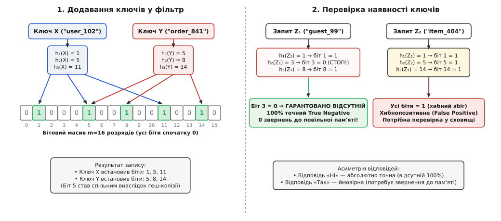
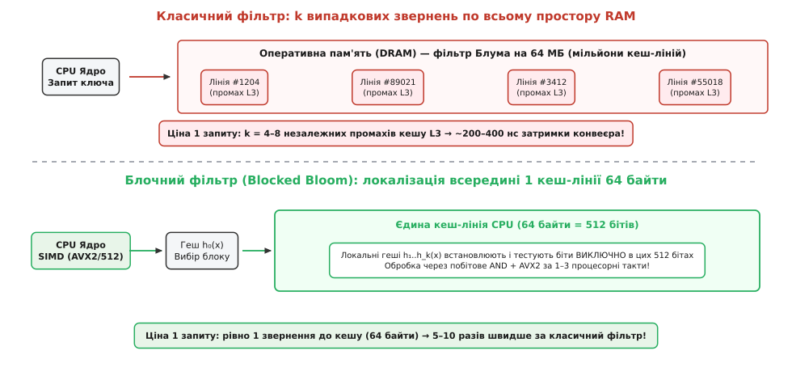

# Фільтр Блума

<preknowlist>
- [Побітові операції](book:programming/bitwise-operations) — логічні маски `AND`, `OR`, бітові зсуви та бітові масиви.
- [Кеш](book:programming/cache) — ієрархія пам'яті, кеш-лінії по 64 байти, влучання та промахи.
- [Когерентність кешу](book:programming/cache-coherence) — узгодження пам'яті в багатоядерних системах та snoop-запити.
- [Швидкодія та латентність пам'яті](book:programming/clock-frequency) — затримки звернення до регістрів, кешів L1/L2/L3 та DRAM.
</preknowlist>

У сучасній архітектурі обчислювальних систем найдорожчою операцією є звернення до повільних рівнів ієрархії пам'яті. Коли процесорне ядро виконує команду за один такт (близько 0.3 наносекунди), промах повз локальні кеші L1 та L2 змушує його звертатися до оперативної пам'яті DRAM, що забирає від 60 до 100 наносекунд — еквівалент простою конвеєра впродовж 200–300 тактів. Якщо ж потрібні дані розташовані на твердотільному накопичувачі NVMe SSD або на віддаленому сервері через мережу, затримка зростає до десятків мікросекунд чи мілісекунд, що означає мільйони втрачених тактів процесора.

Найприкріша ситуація виникає під час так званого «порожнього пошуку» (*negative lookup*): програма перевіряє, чи присутній ключ у великому масиві даних (наприклад, чи заблоковано IP-адресу в таблиці міжмережевого екрана, чи зберігається рядок у гігабайтному файлі бази даних, або чи кешована лінія пам'яті в сусідньому процесорному сокеті), витрачає сотні наносекунд або мілісекунд на пошук — і з'ясовує, що елемента там взагалі немає. У багатьох реальних сценаріях такі негативні запити становлять від 90% до 99% усього вхідного навантаження.

Збереження всіх ключів у швидкій пам'яті за допомогою традиційних геш-таблиць чи B-дерев вимагає колосальних витрат: окрім самих ключів, необхідно зберігати покажчики вузлів, геш-коди та метадані колізій, що виливається у 30–64 байти на кожен елемент. Для бази на 100 мільйонів записів це означає від 3 до 6 гігабайтів оперативної пам'яті.

**Фільтр Блума** (*Bloom filter*, від англ. *filter* — сито, фільтр) кардинально змінює цей баланс. Він повністю відкидає збереження самих ключів і кодує інформацію про множину в компактному бітовому векторі, зменшуючи витрату пам'яті до всього 10 бітів на елемент (економія у 25–50 разів) та забезпечуючи миттєву ймовірнісну відповідь за фіксований час `O(k)`.

> 🔧 **Навіщо це.** Фільтр Блума встановлюють перед повільним сховищем як швидкодіючий «сторожовий бар'єр». Якщо фільтр каже «ключа немає», програма миттєво відхиляє запит без жодного звернення до SSD, мережі чи оперативної пам'яті. Дорогого читання зазнають лише ті рідкісні запити, які отримали відповідь «ключ імовірно є».

---

### Походження ідеї: компроміс простору й часу

1970 року американський дослідник Бертон Говард Блум запропонував математичну конструкцію, яка дозволила досягти керованого компромісу між точністю та обсягом пам'яті. Детальніше про контекст появи цієї структури розповідає [історія винайдення фільтра Блума](book:programming/computer-architecture/bloom-filter/hist-bloom-filter.md).

Фундаментальна суть ідеї Блума полягає в **суворій асиметрії помилок**:
1. **Гарантована відсутність (True Negative):** якщо фільтр відповів «ні», елемент **гарантовано відсутній** у множині. Імовірність помилки тут дорівнює абсолютному нулю (0% хибнонегативних відповідей, *zero false negatives*).
2. **Ймовірна присутність (Possible Positive):** якщо фільтр відповів «так», елемент **найімовірніше присутній**, проте існує невелика контрольована ймовірність `p` хибнопозитивного спрацьовування (*False Positive*), коли біти масиву випадково виявилися активованими іншими раніше доданими ключами.

Ця асиметрія є ідеальною для комп'ютерних систем: хибне «так» коштує системі лише однієї перевірки у справжньому сховищі, тоді як хибне «ні» призвело б до катастрофічної втрати даних або порушення коректності програми.

---

### Анатомія структури: бітовий вектор та k геш-функцій

Фільтр Блума складається з двох компонентів:
- **Бітовий масив** довжиною `m` розрядів, де кожен розряд ініціалізований нулем.
- Набір із `k` незалежних, рівномірно розподілених геш-функцій `h₁(x), h₂(x), ..., h_k(x)`, кожна з яких відображає довільний вхідний ключ у ціле число в діапазоні від `0` до `m - 1`.


*Принцип роботи фільтра Блума. Ліворуч: ключі X та Y додаються до фільтра; їхні геш-функції встановлюють відповідні розряди бітового масиву в 1. Праворуч: перевірка запиту Z₁ знаходить біт 3 у стані 0, що дає 100% гарантію відсутності ключа (True Negative). Перевірка запиту Z₂ знаходить усі біти в стані 1 через випадковий збіг відбитків інших ключів, що породжує хибнопозитивне спрацьовування (False Positive).*

#### Операція додавання елемента (Insert)
Щоб додати ключ `x` до фільтра:
1. Обчислюються значення всіх `k` геш-функцій: `idx₁ = h₁(x), idx₂ = h₂(x), ..., idx_k = h_k(x)`.
2. Кожен відповідний розряд бітового масиву встановлюється в 1:
   `array[idx_i] = 1` для всіх `i ∈ [1, k]`.

Якщо певний біт уже містив 1 (встановлений попереднім ключем), він просто залишається одиницею. Повторне додавання однакових ключів є ідемпотентним.

#### Операція перевірки належності (Lookup / Query)
Щоб перевірити, чи міститься ключ `y` у множині:
1. Обчислюються ті самі `k` індексів: `idx₁ = h₁(y), ..., idx_k = h_k(y)`.
2. Перевіряється стан кожного розряду:
   - Якщо **хоча б один** із розрядів `array[idx_i] == 0`, пошук **негайно зупиняється**: ключ `y` гарантовано ніколи не додавався до фільтра (якби його додавали, цей біт обов'язково був би одиницею). Результат: `false`.
   - Якщо **всі без винятку** `k` розрядів містять 1, фільтр повертає `true`: ключ або справді додано до множини, або сталася колізія гешів.

---

### Математична фізика помилки та розрахунок параметрів

Чому виникає хибнопозитивне спрацьовування? З кожним доданим елементом дедалі більше нульових бітів масиву перетворюються на одиниці. Коли сторонній ключ обчислює свої `k` геш-індексів, існує ймовірність, що всі вони потраплять на біти, які випадково були активовані комбінацією інших ключів.

Ймовірність хибного спрацьовування `p` пов'язана з розміром масиву `m`, кількістю доданих елементів `n` та числом геш-функцій `k` класичним співвідношенням:

```
p ≈ (1 - e^(-k · n / m))ᵏ
```

Повне аналітичне виведення цієї залежності та доказ екстремуму наведено в окремій вставці про [математичне виведення ймовірності та оцінки ентропії](book:programming/computer-architecture/bloom-filter/math-false-positive.md).

З математичного аналізу випливають два фундаментальні інженерні правила:

#### 1. Оптимальна кількість геш-функцій k
Мінімум імовірності помилки досягається тоді, коли рівно половина бітів масиву заповнена одиницями:

```
k_opt = (m / n) · ln(2) ≈ 0.69315 · (m / n)
```

#### 2. Питомі витрати пам'яті на один елемент
Для досягнення цільової ймовірності помилки `p` необхідний розмір бітового масиву розраховується як:

```
m / n ≈ -1.4427 · log₂(p)
```

Для типового інженерного порогу помилки в 1% (`p = 0.01`):
- `m / n = -1.4427 · log₂(0.01) ≈ 9.58` бітів на елемент (на практиці беруть **10 бітів на ключ**).
- Оптимальне число геш-функцій: `k = 10 · 0.693 ≈ 7` геш-функцій.

Витрачаючи лише 1.2 байта на ключ, система відсікає 99% усіх порожніх запитів.

---

### Архітектурна пастка класичного фільтра: руйнування кеш-локальності

Попри теоретичну швидкість `O(k)`, класичний фільтр Блума на сучасних багатоядерних процесорах стикається з критичною проблемою: **катастрофічним руйнуванням просторової та часової локальності кешу**.

Розглянемо систему, де фільтр Блума обслуговує 100 мільйонів ключів. За норми 10 бітів на ключ бітовий масив займає:

```
m = 100 000 000 · 10 бітів = 1 000 000 000 бітів ≈ 119.2 МБ
```

Цей масив не вміщається в кеш L1 (32–48 КБ), L2 (1–2 МБ) і навіть L3 (16–64 МБ). Масив живе у повільній оперативній пам'яті DRAM.


*Порівняння поведінки пам'яті. Угорі: класичний фільтр виконує k=4..8 випадкових звернень по всьому 120-мегабайтному простору RAM, генеруючи серію промахів кешу L3 і затримуючи виконання на сотні наносекунд. Унизу: блочний фільтр Блума локалізує всі k перевірок усередині однієї 64-байтової кеш-лінії, зводячи затримку до єдиного звернення.*

Коли надходить запит на перевірку ключа, класичний алгоритм обчислює `k = 7` гешів. Оскільки якісні геш-функції рівномірно розсіюють значення, ці 7 індексів вказують у сім абсолютно випадкових адрес у межах 120 МБ.
- Кожне з 7 звернень потрапляє в окрему кеш-лінію.
- Процесор отримує до **7 послідовних промахів кешу L3**.
- Час виконання одного запиту становить `7 · 50 нс ≈ 350 наносекунд`.

Процесор витрачає 99% часу не на обчислення гешів, а на очікування шини пам'яті.

---

### Блочний фільтр Блума (Blocked Bloom Filter)

Щоб узгодити фільтр Блума з апаратною архітектурою CPU, застосовують **блочний кеш-орієнтований фільтр** (*Blocked Bloom Filter* або *Sector Bloom Filter*).

#### Принцип локалізації в межах 64 байтів
Замість одного великого бітового масиву пам'ять розбивається на масив незалежних мікрофільтрів, розмір кожного з яких дорівнює рівно **64 байтам** (512 бітів) — фізичному розміру кеш-лінії процесора:

1. Перший геш `h₀(key)` вибирає номер 64-байтового блоку в пам'яті:
   `block_id = h₀(key) % total_blocks`.
2. Процесор зчитує цей єдиний блок. Якщо сталася відсутність у кеші, з DRAM підтягується рівно одна кеш-лінія (64 байти).
3. Усі наступні `k` геш-індексів `h₁(key), ..., h_k(key)` відображаються **виключно в межах цих 512 бітів**.

Оскільки всі 512 бітів уже завантажені в надшвидкісний кеш L1, перевірка `k` бітів виконується за 1–3 процесорні такти за допомогою побітових інструкцій або векторних розширень SIMD (AVX2 / AVX-512 / ARM Neon).

Повна практична реалізація та виміри швидкодії наведені в інженерному проєкті про [кеш-блочний фільтр Блума](book:programming/computer-architecture/bloom-filter/proj-cache-blocked.md).

---

### Апаратні фільтри Блума: когерентність кешу та черги процесора

У комп'ютерній архітектурі фільтри Блума використовуються не лише в програмному забезпеченні, а й безпосередньо викарбовуються в кремнії процесорів.

#### 1. Апаратні Snoop Filters у багатопроцесорних системах
У серверах з кількома процесорними сокетами (наприклад, двопроцесорні Intel Xeon або AMD EPYC) ядра постійно обмінюються даними через швидкісні міжсокетні шини (Intel UPI, AMD Infinity Fabric).

Коли ядро на сокеті 0 хоче модифікувати лінію пам'яті, протокол когерентності MESI/MOESI вимагає надіслати запит перевірки (*snoop query*) на сокет 1, щоб перевірити, чи немає там застарілої копії цієї лінії. Якщо кожна операція запису генеруватиме міжсокетний запит, міжпроцесорна шина миттєво захлинеться від широкомовного шторму (*snoop storm*), а кеш L3 сусіднього сокета постійно відволікатиметься на марні перевірки тегів.


*Апаратний Snoop Filter у системному агенті процесора. Бітовий масив відстежує адреси ліній, кешованих у віддаленому сокеті. Якщо фільтр повертає 0, міжсокетна транзакція відхиляється на рівні локального контролера, зберігаючи 85–95% пропускної здатності шини.*

Для вирішення цієї проблеми контролери когерентності мають апаратний **Snoop Filter** на основі фільтра Блума. Апаратний бітовий масив відстежує, які блоки пам'яті зараз завантажені в кеші віддаленого сокета. Коли сокет 0 ініціює запис, Snoop Filter миттєво перевіряє адресу:
- Якщо фільтр дає `0`, лінія **гарантовано відсутня** в сокеті 1: запит через міжсокетну шину взагалі не відправляється.
- Якщо фільтр дає `1`, надсилається точковий snoop-запит.

Апаратний фільтр Блума знімає до 90% паразитного трафіку з міжпроцесорних шин.

#### 2. Черги завантаження та збереження (Load-Store Queues, LSQ)
У сучасних суперскалярних процесорах з позачерговим виконанням (*Out-of-Order Execution*) команди читання `LOAD` можуть виконуватися раніше, ніж завершаться попередні команди запису `STORE`. Щоб запобігти зчитуванню застарілих даних за тією самою адресою (*memory aliasing hazard*), апаратний блок перевірки конфліктів адрес використовує невеликі асоціативні фільтри Блума для миттєвого порівняння молодших бітів адрес у черзі LSQ.

---

### Оптимізація обчислення гешів: техніка Кірша-Мітценмахера

Обчислення 7 чи 10 криптографічних геш-функцій (наприклад, SHA-256 чи MD5) створило б неприпустиме навантаження на конвеєр. Навіть швидкі некриптографічні алгоритми (xxHash, MurmurHash3, CityHash) коштують 10–20 тактів на кожен виклик.

2006 року математики Адам Кірш та Майкл Мітценмахер довели, що для фільтра Блума **не потрібно обчислювати k окремих гешів**. Достатньо обчислити всього **два** 64-розрядних геші `h₁(x)` та `h₂(x)`, після чого всі наступні індекси генеруються простою формулою:

```
g_i(x) = (h₁(x) + i · h₂(x)) mod m,    де i = 0, 1, ..., k - 1
```

Один виклик швидкого 128-бітного гешу (що повертає пару 64-бітних чисел `h₁` та `h₂`) забезпечує генерацію довільної кількості бітових позицій за допомогою єдиної інструкції множення з додаванням (FMA) за 1 такт CPU.

Повна специфікація системних структур та правила розрахунку пам'яті зібрані в розділі про [специфікацію системного інтерфейсу фільтра Блума](book:programming/computer-architecture/bloom-filter/api-bloom-filter.md).

---

### Межі застосування, мутації та альтернативи

Класичний фільтр Блума має одне принципове обмеження: **з нього неможливо видалити елемент**. Якщо скинути в 0 біти, які відповідали видаленому ключу, можна випадково скинути біти, що належать іншим збереженим ключам, порушивши головний інваріант структури (з'являться хибнонегативні помилки, False Negatives).

Для подолання цього обмеження створено низку спеціалізованих структур-нащадків:

| Структура даних                | Видалення | Пам'ять (біт/елемент) | Кеш-локальність | Особливості застосування                                   |
|:-------------------------------|:----------|:----------------------|:----------------|:-----------------------------------------------------------|
| **Класичний фільтр Блума**     | Ні        | 10 бітів (1% FP)      | Низька (L3 miss)| Найпростіша реалізація, мінімальна пам'ять                 |
| **Блочний фільтр Блума**       | Ні        | 11–12 бітів (1% FP)   | Ідеальна (1 CL) | Максимальна швидкість на сучасних CPU, SIMD-векторизація   |
| **Лічильний фільтр Блума**     | Так       | 30–40 бітів           | Низька          | Замість 1 біта використовує 4-бітний лічильник (Counting)  |
| **Фільтр Зозулі (Cuckoo)**     | Так       | 12–14 бітів           | Висока (2 лінії)| Підтримує видалення та динамічне переміщення відбитків     |
| **Частковий фільтр (Quotient)**| Так       | 11–13 бітів           | Дуже висока     | Компактне збереження залишків ділення в єдиному масиві     |

#### Лічильний фільтр Блума (Counting Bloom Filter)
Замість бітового масиву використовується масив 4-розрядних лічильників. При додаванні лічильники інкрементуються `count++`, а при видаленні — декрементуються `count--`. Ціною є збільшення витрати пам'яті в 4 рази (до 40 бітів на ключ).

#### Фільтр Зозулі (Cuckoo Filter)
Зберігає короткі геш-відбитки (*fingerprints*) елементів у компактній геш-таблиці з витісненням за принципом зозулі (*cuckoo hashing*). Дозволяє видаляти елементи без збільшення пам'яті та має кращу локальність читання (перевіряє щонайбільше два сусідні слоти).

---

### Підсумок

Фільтр Блума демонструє фундаментальний системний принцип: **цілеспрямована згода на контрольовану неточність дозволяє обійти апаратні обмеження пам'яті та швидкодії**.

Відкидаючи самі ключі та кодуючи лише їхні бітові відбитки, фільтр захищає повільні накопичувачі, мережеві інтерфейси та міжпроцесорні шини від мільйонів зайвих запитів, формуючи перший і найшвидший ешелон оборони в архітектурі сучасних обчислювальних систем.
