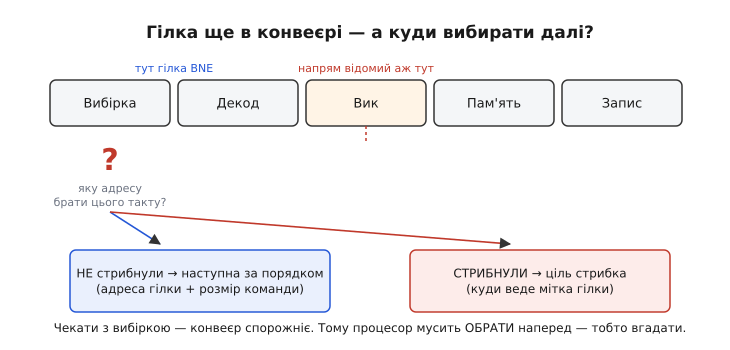
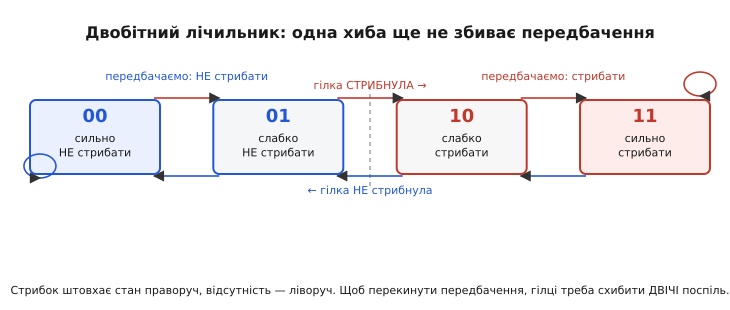
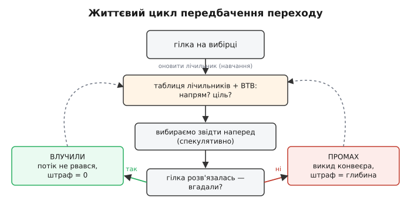

# Передбачення переходів: як процесор угадує майбутнє

Процесор [конвеєрний](topic:programming/pipeline): щоб не простоювати, він щотакту витягує з пам'яті наступну команду, ще не докінчивши попередні. Схема струнка, поки код тече прямо — команда за командою, адреса за адресою. Та реальний код увесь у розгалуженнях: кожен `if`, кожен цикл, кожен виклик функції — це **гілка** (англ. *branch*, «відгалуження»), команда, що може повести виконання одним із двох шляхів. І ось де крихка краса конвеєра дає тріщину: щоб витягти наступну команду **зараз**, процесор мусить назвати її адресу — а куди вести гілку, з'ясується лише за кілька тактів. Він не може чекати. Тож він **угадує**. Ця стаття — про те, чому вибору немає, як влаштоване саме вгадування і чому воно виявилося настільки вдалим, що на ньому тримається вся швидкодія сучасних процесорів (а заразом і одна з найгучніших дір у їхній безпеці).

### Чому доводиться вгадувати

Погляньмо на просту гілку в конвеєрі. Команда переходу — скажімо, `BNE` (branch if not equal, «стрибнути, якщо не рівне») — заходить у конвеєр і починає повзти крізь стадії. Але щоб довідатися, стрибати чи ні, треба спершу **обчислити умову**: порівняти регістри, глянути на прапорці. Це стається аж на стадії виконання — на кілька тактів пізніше за вибірку. А блок вибірки не має права простоювати ці такти: якщо він не витягне нічого, за гілкою в конвеєрі зʼявиться порожнеча — **бульбашка** (англ. *bubble*), змарновані такти.


*Гілка `BNE` заходить у конвеєр, але свій напрям розкриває аж на стадії виконання — за два такти. А блок вибірки мусить назвати адресу наступної команди вже цього такту, інакше конвеєр спорожніє. Є лише дві можливі адреси: наступна за порядком (гілка не спрацювала) або ціль стрибка (спрацювала) — і треба обрати одну, не знаючи, яка правильна. Чекати не можна, тож єдиний вихід — обрати наперед, тобто вгадати.*

Отже, дилема гола: адресу треба назвати цього ж такту, а правильної відповіді ще немає. Наївний вихід — щоразу зупиняти конвеєр на гілці, доки напрям не проясниться. Але гілок у коді приблизно **кожна п'ята команда**, а глибокий конвеєр втрачає на кожній зупинці по десятку тактів — так уся перевага конвеєра випарувалася б. Значить, зупинятися не можна. Лишається інше: **зробити ставку**. Процесор обирає один із двох шляхів, вибирає команди звідти й летить далі, ніби вгадав напевно. Це називають **спекулятивним виконанням** (англ. *speculative*, від лат. *speculari* — «наглядати, розвідувати»): робота наперед, на здогад, з готовністю викинути її, якщо здогад хибний.

Ставка або грає, або ні. **Влучив** — потік не рвався, гілка коштувала нуль тактів, ніби її й не було. **Схибив** — усі команди, вибрані «по інерції» не тим шляхом, виявляються сміттям, і їх доводиться **викинути** (англ. *flush*, «промивання»), а конвеєр — наповнити заново з правильної адреси. Ціна промаху — скільки тактів устигло набитися хибних команд, тобто фактично глибина конвеєра до місця, де гілка розв'язується. Точні числа — скільки коштує промах і як із частки влучань виводиться ефективний CPI — розписані окремо, у [числовій моделі штрафу розгалуження](topic:programming/pipeline/math-pipeline-hazards.md). Нам тут важлива суть: **чим краще ми вгадуємо, тим менше платимо**. Уся справа звужується до одного питання — як угадувати влучно.

### Найдешевший здогад: угадувати без пам'яті

Найпростіше передбачення взагалі нічого не памʼятає й нічого не рахує — воно **статичне** (англ. *static*, «нерухоме»): рішення закладене наперед, однакове для всіх гілок і незмінне під час роботи. Найтупіший його варіант — «гілка ніколи не стрибає»: завжди вибирай наступну команду за порядком. Це вгадує приблизно навмання, бо гілки в реальному коді стрибають десь у половині випадків.

Та в статиці ховається одне напрочуд гарне спостереження. Погляньте, як виглядає цикл на рівні машинних команд:

```c
for (int i = 0; i < n; i++) {
    // тіло циклу
}
```

Наприкінці кожної ітерації стоїть гілка «якщо `i < n`, стрибни назад на початок тіла». Якщо цикл крутиться тисячу разів, ця гілка **999 разів стрибає** назад і лише **раз** — ні (на виході). Тобто гілки, що стрибають **назад**, майже завжди спрацьовують. Звідси проста й дивовижно влучна евристика (англ. *heuristic*, від гр. *heuriskō* — «знаходжу»): **стрибок назад — передбачай «так», стрибок уперед — «ні»**. Назад — це майже завжди цикл; уперед — це часто `if`, що обходить рідкісну гілку помилки. Одне правило, нуль пам'яті — а вгадує вже помітно краще за монетку. Багато простих процесорів на цьому й спиняються.

Але статика має стелю: вона не бачить **конкретної** гілки. Той `if`, що в цій програмі спрацьовує майже завжди, вона трактує так само, як той, що майже ніколи. Щоб пробити цю стелю, передбаченню треба **вчитися** на поведінці кожної гілки окремо.

### Здогад із пам'яттю: одного біта мало

Ідея динамічного (англ. *dynamic*, «рухливе») передбачення проста: **дивися, що ця гілка робила минулого разу, і став на те саме**. Гілка стрибнула — наступного разу передбачай стрибок; не стрибнула — передбачай ні. Процесор тримає невеличку таблицю, де для кожної гілки лежить один біт «останній результат», а знаходить потрібний рядок за адресою самої команди-гілки.

Здавалося б, годиться. Але один біт спотикається саме там, де найважливіше, — на циклах. Уявімо той самий цикл на тисячу ітерацій, викликаний **двічі**. Вихідна ітерація щоразу «псує» біт: гілка на виході не стрибнула, біт став на «ні». Заходимо в цикл удруге — а передбачення каже «ні», хоча гілка одразу ж стрибає. Промах на самому вході. І так **щоразу**, коли цикл заходить після виходу. Одна аномальна ітерація отруює передбачення для наступного разу. Проблема глибша за конкретний приклад: одна-єдина хиба **миттєво перекидає** здогад, і гілка, що стрибає в 99 випадках зі 100, ловить **два** промахи на кожен «не туди» — сам виняток і повернення після нього.

Ліки виявилися майже кумедно простими: дати передбаченню трохи **інерції**, щоб одна хиба його не збивала.

### Двобітний лічильник: інерція проти випадковості

Замість одного біта на гілку тримаємо **два** — маленький лічильник із чотирма станами. Це **насичувальний лічильник** (англ. *saturating counter*: додає й віднімає, але не «перекручується» через край — на межах залипає). Стрибнула гілка — лічильник підповзає в бік «стрибати»; не стрибнула — в бік «не стрибати». А передбачаємо ми за **старшим бітом**: верхня половина станів означає «стрибати», нижня — «ні».


*Чотири стани лічильника: 00 і 01 передбачають «не стрибати», 10 і 11 — «стрибати». Кожен фактичний стрибок штовхає стан праворуч (до «сильно стрибати»), кожна відсутність стрибка — ліворуч; на краях лічильник насичується й далі не йде. Ключ у крайніх станах: із «сильно стрибати» (11) одна невдача лише послаблює впевненість до 10, а передбачення лишається «стрибати». Щоб перекинути його на «ні», гілці треба схибити **двічі поспіль**. Саме ця інерція гасить поодинокі аномалії.*

Ось у чому фокус. Гілка циклу сидить у стані «сильно стрибати» (11). Настає вихідна ітерація — вона не стрибнула, стан сповзає до «слабко стрибати» (10), але передбачення **все ще** «стрибати». Заходимо в цикл удруге — гілка одразу стрибає, і ми вгадали, стан вертається в 11. Та сама одна аномалія, що отруювала однобітну схему, тепер коштує **нуль** промахів на вході. Два біти дають рівно ту інерцію, якої бракувало: передбачення тримається за свою думку, поки поодинокі винятки, і поступається лише сталій зміні поведінки.

Чому саме два біти? Це не випадковість. Джеймс Сміт (James E. Smith), інженер, що 1981 року докладно дослідив ці схеми, помітив просту річ: **два біти дають майже весь виграш, а третій і четвертий уже майже нічого не додають**. Одного біта замало — немає інерції; трьох забагато — зайва впертість тільки шкодить, гілка надто довго не помічає, що поведінка змінилася. Двобітний лічильник влучає в солодку точку й досі живе в кожному процесорі як базова цеглинка. Історію цього відкриття й дальшу еволюцію передбачувачів — двоrівневі схеми, кореляцію між гілками, сучасні алгоритми — розказано в [окремій хронології передбачення переходів](topic:programming/branch-prediction/hist-branch-prediction.md).

### Другий бік: не лише «чи», а й «куди»

Досі ми питали одне: **стрибати чи ні**. Але для звичайного `if` цього досить (адреси обох шляхів відомі одразу), а от для стрибка існує ще й друге питання — **куди саме**. Для більшості гілок ціль зашита в команді, тож її видно одразу. А є гілки, де ціль обчислюється на льоту: виклик через покажчик на функцію, віртуальний метод у C++, повернення з функції, `switch` через таблицю переходів. Такий стрибок називають **непрямим** (англ. *indirect*), бо його ціль лежить не в команді, а в регістрі чи пам'яті — і на момент вибірки ще невідома.

Щоб не чекати й на неї, процесор тримає другий кеш — **буфер цілей переходів**, BTB (англ. *branch target buffer*). Це маленька таблиця «адреса гілки → куди вона стрибала минулого разу». Дійшли до гілки — зазирнули в BTB, дістали ймовірну ціль і вибираємо звідти. Разом виходить повний здогад: **лічильник каже, чи стрибати, а BTB — куди**. Обидва вгадали — конвеєр не спіткнувся; будь-хто схибив — викид і навчання обох таблиць.


*Повний цикл. Гілка на вибірці — процесор питає лічильник (напрям) і BTB (ціль) і вибирає команди звідти спекулятивно, наче вгадав напевно. Коли гілка розв'язується, порівнюємо: влучили — потік не рвався, штраф нуль; промах — увесь спекулятивний хвіст викидаємо, конвеєр наповнюємо заново, штраф дорівнює глибині. У будь-якому разі фактичний результат **оновлює таблицю** (пунктир) — так передбачувач учиться на кожній гілці.*

Сучасні передбачувачі напряму досягають **понад 95%, а на типовому коді й 98–99%** влучань — і саме тому конвеєр із десятків стадій узагалі має сенс. Приберіть передбачення — і кожна п'ята команда коштувала б повний штраф; глибокий конвеєр без нього був би повільніший за простий. Передбачення переходів — не оздоба, а те, що робить агресивний конвеєр можливим.

> 🔧 **Навіщо це.** У прошивці це знання переходить у дуже конкретні рішення. По-перше, **гарячі цикли для давачів і керування люблять передбачуваний потік**: рівний, монотонний `if` передбачувач вивчає до 99% і штрафу майже нема, а от `if` на **випадкових** даних (умова стрибає туди-сюди без ладу) передбачити не можна в принципі — і кожна ітерація ризикує промахом. По-друге, знаючи це, гарячу гілку іноді варто **прибрати зовсім** — порахувати обидві вітки й вибрати результат маскою, без стрибка (це вигідно саме тоді, коли гілка непередбачувана; передбачувану чіпати не треба). По-третє, підказки на кшталт `__builtin_expect` (`likely`/`unlikely` у ядрі) кажуть компіляторові розкласти код так, щоб частий шлях ішов прямо, — це допомагає й статиці, і розкладці коду в пам'яті. Практичні прийоми — маска замість гілки, таблиця замість `switch`, підказки компілятору — зібрані в [окремому розборі безгілкового коду](topic:programming/branch-prediction/proj-branchless.md).

### Коли вгадування коштувало надто дорого

Спекуляція здавалася безкоштовним обідом: угадав — виграв, схибив — просто відкотив хибну роботу, ніби її й не було. На цьому «ніби» тримався весь спокій — і 2018 року він тріснув. Дослідники показали атаку **Spectre**: хибно вгадана гілка все ж встигає **лишити слід**. Так, процесор відкочує самі команди — регістри, видимий стан він відновлює бездоганно. Але спекулятивне читання встигає **підтягнути дані в [кеш](topic:programming/cache)**, а кеш після відкату **не чиститься**. І хоча прочитане «офіційно не сталося», по тому, які адреси тепер лежать у кеші (а отже, читаються швидше), можна **виміряти** заборонений байт.

Механізм підступний саме тому, що зловживає нормальною роботою. Зловмисник багато разів «навчає» передбачувач на гілці-перевірці меж масиву, щоб той звик передбачати «в межах, читай». Тоді підсовує **завідомо завеликий** індекс: перевірка ще не обчислилась, а передбачувач за звичкою вже пустив спекулятивне читання **за межі** масиву — туди, куди код нізащо не дійшов би насправді. Перевірка згодом скасує читання, та байт уже осів у кеші й видає себе часом доступу. Так вгадування переходів — двигун швидкодії — обернулося каналом витоку. Як саме це працює й чому такі діри так важко закрити, розібрано в [історії Spectre та спекулятивних атак](topic:programming/branch-prediction/hist-spectre.md).

Так замикається дуга цієї теми. Гілка ставить процесор перед вибором, на який ще немає відповіді, — і той не завмирає, а вгадує: спершу тупою статикою, тоді памʼяттю про кожну гілку, тоді інерцією двобітного лічильника, що не дає поодинокій хибі збити думку, і окремим буфером на непрямі цілі. Разом ці здогади влучають так надійно (за 95%), що конвеєр із десятків стадій летить майже без спотикань — і саме на цій крихкій, але навдивовижу точній ставці про майбутнє й тримається швидкодія, до якої ми звикли.
