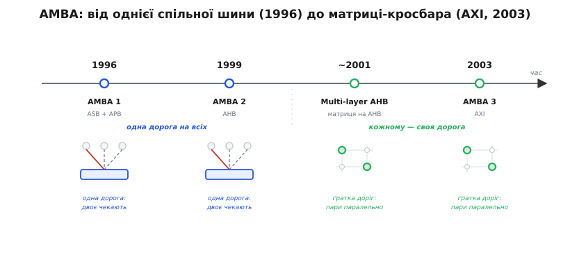

# 📜 AMBA: як одна шина доросла до матриці

Матриця шин не з'явилася одного дня як осяяння інженера. Вона виросла — крок за кроком, версія за версією — з дуже простої й дуже старої конструкції: **однієї спільної шини**, до якої причеплено все на кристалі. Історія стандарту ARM **AMBA** (англ. *Advanced Microcontroller Bus Architecture* — «розвинена архітектура шин мікроконтролера») — це, по суті, історія того, як розробники двадцять років поспіль натикалися на ту саму стіну: одна дорога на всіх серіалізує всіх, — і як вони цю стіну штовхали, доки замість дороги не постала ґратка. Варто пройти цей шлях від початку, бо тоді матриця перестає бути абстрактною схемою з даташита й стає **відповіддю на конкретний біль**, що накопичувався роками.

## Навіщо взагалі знадобився стандарт шини

Спершу треба зрозуміти, чому наприкінці 1980-х — на початку 1990-х узагалі виникла потреба в *стандарті* внутрішнього зв'язку. Доти кожен виробник кристала розводив свою власну шину як умів: ядро, пам'ять і периферію з'єднували проводами, придуманими на цей конкретний чип. Поки система з двох-трьох блоків уміщалася в голові одного інженера, це працювало. Але кристали росли, а разом із ними росла й ARM — компанія, чия бізнес-модель від початку була незвична: вона не продавала чипи, вона продавала **ліцензії на ядро**. Клієнт брав ядро ARM і обліплював його своєю периферією, пам'яттю, контролерами — і будував власний кристал.

Ось тут і вилазить проблема, якої не було б у виробника монолітних чипів. Якщо кожен клієнт по-своєму чіпляє периферію до ядра, то **жоден блок не можна перевикористати**: контролер пам'яті, написаний під один кристал, не встромиш в інший, бо там інші проводи. ARM продавала атом — ядро, — але навколо цього атома щоразу з нуля городили унікальний зв'язок. Щоб екосистема ліцензіатів запрацювала по-справжньому, потрібен був **спільний контракт**: як саме блоки розмовляють між собою, щоб контролер від однієї команди сходився з ядром від ARM і пам'яттю від третьої сторони без переробки проводів.

> 🔧 **Навіщо це.** Стандарт шини — це не бюрократія, а те, що робить блок *переносним*. Коли в даташиті сучасного мікроконтролера пишуть «периферія на шині APB, пам'ять і DMA на AXI», за цим стоїть саме той давній контракт: будь-який AXI-майстер знає, як звернутися до будь-якого AXI-раба, бо форму розмови задано стандартом, а не конкретним кристалом. Тому, читаючи, до якої шини причеплено вузол, ви одразу знаєте його «мову» — а отже, і чого від нього чекати за швидкістю й паралелізмом.

## AMBA 1 (1996): дві шини, обидві спільні

Перша редакція AMBA вийшла **1996 року**. Це усталений факт: ARM опублікувала специфікацію, у якій було дві шини — **ASB** (англ. *Advanced System Bus* — «розвинена системна шина») для швидких вузлів і **APB** (англ. *Advanced Peripheral Bus* — «розвинена периферійна шина») для повільної периферії. Уже тут закладено ідею, що дожила до сьогодні: **розділити світ на дві швидкості**. Ядро й пам'ять — на швидкій ASB; UART, таймери, порти вводу-виводу — на повільній APB, за мостом. Дрібноті не треба гнатися за ядром, тож її винесли на дешевшу, простішу дорогу, щоб не обтяжувати швидку.

Але — і це головне для нашої історії — **обидві ці шини були спільними**. ASB, попри назву «системна» й претензію на швидкість, лишалася одним набором проводів, до якого причеплено всіх майстрів. Хай на ній висить одне ядро й один DMA — у кожну мить транзакцію веде рівно один із них, а другий чекає, поки [арбітр](topic:programming/bus-arbitration) дасть йому хід. Поки майстер на кристалі був фактично один (ядро), а DMA — рідкістю, ця серіалізація нікого не мучила: черги майже не було, бо й черзі не було з кого складатися.

Тобто в самому фундаменті AMBA закладено топологію, яка згодом і стане вузьким горлом: **одна дорога на всіх швидких**. У 1996-му це було цілком розумно — кристали були простіші, майстрів мало. Стіну ще ніхто не бачив, бо до неї ніхто не дійшов. Але напрямок руху вже було задано: що більше майстрів причеплять до цієї спільної ASB, то частіше вони битимуться за неї.

## AMBA 2 (1999): AHB — швидша, та досі одна

Через три роки, **1999-го**, вийшла AMBA 2. Її головним внеском стала нова високопродуктивна шина — **AHB** (англ. *Advanced High-performance Bus* — «розвинена високопродуктивна шина»). Це теж усталений, веб-звірений факт: AHB з'явилася саме в AMBA 2 у 1999 році й прийшла на зміну старій ASB як швидка магістраль системи.

Що AHB зробила краще? Вона перейшла на **єдиний фронт тактового сигналу** (англ. *single clock-edge protocol*) — усі сигнали защіпаються по одному краю такту, що спрощує синтез і розгін частоти. Вона додала конвеєр: поки один майстер отримує дані попередньої транзакції, на шину вже виставляється адреса наступної — фаза адреси й фаза даних ідуть внапустку, а не строго по черзі. Вона підтримала пакетні пересилання (англ. *burst*), ширші дані, розщеплені транзакції (англ. *split*), коли повільний раб уміє «відпустити» шину й повідомити пізніше, що готовий. Одним словом — AHB витиснула зі спільної шини все, що зі спільної шини можна витиснути.

Але зверніть увагу на слова «зі спільної шини». **AHB усе ще була однією шиною з одним арбітром.** Хоч який швидкий став протокол, топологія лишилася тією самою, що в ASB, що в найпершій AMBA: усі майстри зведені в одну точку, і в кожну мить активна рівно одна пара «майстер → раб». Конвеєр і пакети підняли *пропускну здатність однієї дороги* — але не дали **другої дороги**. Двоє майстрів, що звертаються до різних банків пам'яті, на класичній AHB однаково стають у чергу, бо дорога між ними одна.

І ось саме тут, наприкінці 1990-х, стіна нарешті проступила. Кристали дозріли до того, що майстрів стало більше одного насправді, а не в теорії: до ядра додався DMA, потім другий DMA, потім співпроцесори. Кожен новий майстер не додавав пропускної здатності — він **ділив** наявну. Інженери опинилися в абсурдній ситуації, яку добре видно й досі: кристал напханий кількома швидкими незалежними банками SRAM, а користуватися ними паралельно не виходить, бо між усіма стоїть одна AHB. Смуга простоює не від нестачі — від топології.

## Multi-layer AHB: перший кросбар, ще без нової шини

Розв'язок напросився раніше, ніж наступна велика редакція стандарту. ARM випустила доповнення до AHB під назвою **Multi-layer AHB** («багатошарова AHB») — за датуванням документів це початок 2000-х (технічний опис ARM позначено копірайтом 2001 і 2004 років). І це — **історично перша поява матриці шин у світі AMBA**, ще на старому протоколі AHB, ще без жодної нової шини.

Ідея Multi-layer AHB проста й радикальна водночас. Замість того щоб винаходити швидший протокол, беруть **той самий AHB** — і дають кожному майстрові власний, окремий шар шини (звідси й «багатошарова»). А між усіма цими шарами майстрів і всіма рабами ставлять **матричний перемикач** (англ. *interconnect matrix*, він же кросбар). Тепер майстер `A`, що звертається до банку `X`, і майстер `B`, що звертається до банку `Y`, ідуть **одночасно** — кожен своїм шаром, крізь свій перетин матриці. Черга виникає лише там, де двоє націлилися в один банк: на вході цього конкретного раба сидить арбітр, який їх розводить у часі. Це вже точно та конструкція, що описана в темі-власнику: рядки-майстри, стовпці-раби, комутатори на перетинах, арбітраж локалізовано до точки суперництва.

Що тут історично важливе, варто закарбувати окремо. **Матриця народилася не як новий протокол, а як нова топологія поверх старого.** Протокол однієї транзакції — AHB — лишився незмінним; змінилося те, **скільки таких транзакцій іде водночас**. Це чиста ілюстрація думки, що вузьке горло спільної шини — не в швидкості проводів і не в правилах протоколу, а саме в топології «одна дорога на всіх». Щойно дороги розмножили, серіалізація зникла там, де вона була зайва, — і лишилася тільки там, де її диктує фізика (двоє в один банк).

> 🔧 **Навіщо це.** Multi-layer AHB — причина, чому на багатьох мікроконтролерах середнього класу ви зустрічаєте матрицю, хоч шина на них зветься саме «AHB», а не «AXI». Не варто плутати назву протоколу з топологією: «AHB» на даташиті може означати як стару єдину шину, так і багатошарову матрицю на тому ж протоколі. Дивитися треба на схему зв'язку — чи намальовано ґратку «майстри × раби», — а не тільки на три літери назви шини.

## AMBA 3 (2003): AXI робить матрицю штатною

Наступний великий крок — **AMBA 3, 2003 рік**, і в ній нова шина **AXI** (англ. *Advanced eXtensible Interface* — «розвинений розширюваний інтерфейс»). Дата веб-звірена й усталена: специфікації AXI ARM датовано копірайтом починаючи з 2003 року, і AXI — це саме третє покоління інтерфейсу AMBA. Якщо Multi-layer AHB був матрицею, надбудованою над старим протоколом, то AXI — це протокол, **із самого початку задуманий під матрицю**.

У чому різниця задуму? Стара AHB мислила транзакцію як цілісний акт: майстер зайняв шину, виставив адресу, дочекався даних, звільнив. Такий протокол природно живе на одній дорозі. AXI ж **розрізав транзакцію на незалежні канали**: окремий канал адреси читання, окремий канал даних читання, окремий канал адреси запису, окремий канал даних запису й окремий канал відповіді. Читання й запис ідуть **фізично різними дорогами** й не заважають одне одному. Ба більше, AXI дозволив **кілька незавершених звертань** (англ. *multiple outstanding transactions*): майстер може вистрілити адресу за адресою, не чекаючи, поки повернуться дані першої, а раби вільні відповідати навіть **не в тому порядку** (англ. *out-of-order*), у якому їх спитали, — кожну відповідь мітять ідентифікатором, щоб майстер упізнав, чия вона.

Кожна з цих рис — це відмова від припущення «одна транзакція, одна дорога, по черзі», на якому трималася спільна шина. А коли транзакція розпадається на незалежні потоки, що не чекають одне одного, — **кросбар перестає бути надбудовою й стає природним домом протоколу**. AXI-інтерконект — це вже штатно матриця: майстри й раби з'єднані ґраткою, дані від різних майстрів до різних рабів течуть паралельними каналами, а поширений прийом — спільна вужча шина адрес поверх кількох ширших шин даних, бо адрес завжди менше, ніж самих даних, і саме дані потребують паралельних доріг найбільше.

Тобто те, що в Multi-layer AHB було *опцією-надбудовою* над протоколом транзакцій, в AXI стало **нормою самого протоколу**. Матриця з винаходу-латки перетворилася на стандартний спосіб з'єднувати важкі вузли системи. Саме тому в описі сучасного кристала на AXI ви бачите матрицю не як екзотику, а як щось само собою зрозуміле: це просто те, як AXI влаштований.


*Шлях від дороги до ґратки. Ліворуч — AMBA 1: дві шини, обидві спільні, майстер фактично один. AMBA 2 розганяє швидку шину до AHB, та топологія «одна на всіх» лишається. Multi-layer AHB уперше ставить матрицю — але поверх старого протоколу AHB. AMBA 3 приносить AXI, де транзакція розрізана на незалежні канали, і кросбар стає штатним інтерконектом, а не надбудовою.*

## Що саме змусило додати матрицю

Тепер, пройшовши хронологію, можна назвати причину прямо, бо вона проступає крізь усі чотири кроки як одна наскрізна лінія. **Матрицю додали не заради швидкості одного пересилання, а заради паралелізму багатьох майстрів.** Кожен крок AMBA до AXI справно підвищував пропускну здатність *однієї* дороги — швидший такт, конвеєр, пакети, ширші дані. Але жоден із цих трюків не давав **другої дороги**. А кристалам потрібна була саме друга (і третя, і десята) дорога, бо на них з'явилося кілька майстрів нараз: не одне ядро, а кілька; не жоден DMA, а кілька DMA — на дисплей, на мережу, на пам'ять.

Механіка стіни завжди та сама. Одна шина з арбітром фізично веде одну транзакцію за раз, тож будь-які двоє майстрів стають у чергу — **навіть коли їхні цілі різні**. Полагодити це кращим арбітром не можна в принципі: хоч який розумний суддя, він розподіляє **один** ресурс і лише вирішує, чий зараз хід, — пустити двох одночасно він не здатен, бо дорога одна. Єдиний вихід — перестати ділити один провід і **розмножити дороги**, щоб непересічні пари «майстер → раб» ішли водночас. Це й є матриця.

Приблизну арифметику болю легко відчути на пальцях:

```
Одна спільна шина, N майстрів, усі активні:
  корисна смуга кожного ≈ (смуга шини) / N
  → 4 майстри на одній шині: кожному дістається ≈ 25 %

Матриця, N майстрів у N РІЗНИХ рабів:
  кожен веде транзакцію своїм шляхом одночасно
  → 4 майстри в 4 банки: кожному ≈ 100 %, черги немає взагалі
```

Ось чому рух до матриці був неминучий, а не модою. Щойно на кристал сідає більше одного справді активного майстра — а до цього дійшли всі скільки-небудь складні системи, — спільна шина починає ділити смугу між тими, хто одне одному не заважає. AMBA просто проходила цей шлях на очах усієї індустрії: від «одного майстра вистачить» (1996) через «розженемо єдину дорогу» (1999) до «дамо кожному свою дорогу» (Multi-layer AHB) і, нарешті, «зробимо паралельні дороги нормою протоколу» (AXI, 2003).

## Що з цієї історії тримати в голові

Стандарт AMBA почався 1996 року з двох спільних шин — швидкої ASB й повільної APB, — і вже в цьому фундаменті сиділа топологія, яка згодом стане вузьким горлом: **одна дорога на всіх швидких вузлів**. AMBA 2 (1999) замінила ASB на швидшу AHB, витиснувши зі спільної шини все можливе — єдиний фронт такту, конвеєр, пакети, — але **другої дороги так і не дала**: топологія лишилася тією самою. Коли на кристалах з'явилося кілька справжніх майстрів (ядра, кілька DMA), стіна проступила: одна шина серіалізує всіх навіть до різних цілей. Відповіддю стала **матриця** — і з'явилася вона спершу як **Multi-layer AHB** на початку 2000-х, тобто як нова *топологія* поверх старого протоколу AHB, а не як нова шина. А **AMBA 3 з AXI (2003)** зробила крок глибший: розрізала транзакцію на незалежні канали (окремо читання й запис, кілька незавершених звертань, відповіді не по порядку) — і кросбар із надбудови-латки перетворився на **штатний спосіб** з'єднувати важкі вузли. Наскрізна причина всього руху одна: підвищення швидкості *однієї* дороги не рятує, коли майстрів багато, — рятує лише **розмноження доріг**, щоб непересічні пари йшли паралельно. Матриця шин — це не осяяння, а логічний фінал двадцятирічного впирання в ту саму стіну спільної шини.
