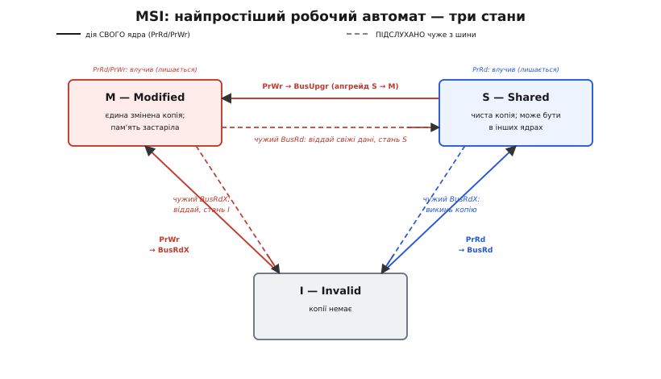

# Протокол когерентності кешу

Коли в машині кілька ядер і в кожного свій приватний [кеш](topic:programming/cache), одна й та сама комірка живе водночас у кількох копіях — і хтось мусить не дати цим копіям розійтися. Це задача [когерентності кешів](topic:programming/cache-coherence): у кожну мить на будь-яку адресу є **одне** правдиве значення, а читання завжди повертає останній запис. Але «не дати розійтися» — це намір. Питання цієї статті інше й конкретніше: **яка саме машинерія** щомиті ухвалює рішення «цю копію лишити, а ту викинути», «писати тихо чи спершу оголосити в шину», «віддати дані сусіду з кеша чи через пам'ять»? Ця машинерія і є **протокол когерентності** (від грец. *prōtókollon* — «перший аркуш, звід правил»): точний набір станів кожної копії й переходів між ними, за яким контролер кешу діє автоматично, без жодної участі програми.

Варто одразу відокремити дві речі, які легко сплутати. Когерентність — це **мета** (усі копії однієї адреси узгоджені). Протокол — це **механізм**, конкретний спосіб цю мету тримати, і механізмів цих є ціла родина: MSI, MESI, MOESI, MESIF та інші. Вони розв'язують ту саму задачу, але різняться тим, скільки зайвої роботи на шині створюють у типових сценаріях. Розібратися в них варто саме як у механізмі: побачити, з яких деталей він складається, чому найпростіший з них уже працює, і що́ саме кожен наступний додає, аби прибрати конкретний різновид марних тактів.

## Протокол — це скінченний автомат на кожну лінію

Найточніша модель протоколу — **скінченний автомат** (*finite-state machine*): пристрій, який тримає невеликий стан і за кожним вхідним сигналом переходить у новий стан, видаючи якусь дію. Кожна [кеш-лінія](topic:programming/cache) (блок зазвичай по 64 байти) несе кілька біт стану поряд зі своїм тегом, і саме над цими бітами автомат і працює. Розкладімо його на три частини, бо в цьому розкладі — уся суть.


*Автомат на кожну лінію. Вхід — або дія власного ядра (читаю `PrRd` / пишу `PrWr`), або **підслуханий** у спільній шині чужий запит (`BusRd`/`BusRdX`). Пам'ять автомата — кілька біт стану лінії. Вихід — які транзакції кинути в шину й у який стан перейти, іноді ще й віддати дані. Ключове: однаковий вхід у різних станах дає різний вихід — запис у стані Exclusive тихий, а той самий запис у Shared мусить оголосити invalidate.*

**Вхід** — те, що спонукає автомат діяти, — буває двох ґатунків, і плутати їх не можна. Перший: **дія власного ядра**. Ядро хоче прочитати комірку (позначають `PrRd`, від *processor read*) або записати в неї (`PrWr`, *processor write*). Другий, і саме він робить когерентність можливою: **підслуханий чужий запит**. Кожен контролер кешу стежить не лише за своїм ядром, а й за спільною шиною, і ловить те, що роблять інші, — цей прийом звуть [підслуховуванням](topic:programming/cache-coherence). Отже, лінію можуть смикнути «зсередини» (моє ядро) і «ззовні» (чуже ядро крізь шину), і автомат реагує на обидва.

**Пам'ять** автомата — це власне стан лінії, ті кілька біт. Саме він розрізняє, наприклад, «моя копія єдина» від «копій кілька», а від цього залежить, чи можна писати тихо. Стан — уся «розумність» протоколу, стиснута в дрібку біт на кожні 64 байти.

**Вихід** — що автомат робить при переході. Він може кинути в шину **транзакцію** (наприклад, оголосити «я змінюю цю лінію, викиньте свої копії»), може перейти в інший стан, а може ще й **віддати дані** — свіжу копію лінії тому ядру, що її просить. Найважливіше тут те, що вже прозвучало: **вихід залежить не лише від входу, а й від поточного стану**. Одна й та сама дія `PrWr` у стані «я єдиний власник» проходить безшумно, а в стані «нас кілька» змушує спершу оголосити в шину. Без цієї залежності від стану не було б і сенсу в різних протоколах — уся їхня різниця саме в тому, які стани вони розрізняють і як через це економлять шину.

> 🔧 **Навіщо це.** Побачити протокол як автомат — не академічна забаганка, а спосіб перестати боятися когерентності. Коли ви знаєте, що кожна лінія має стан і що чужий запис у шині може цей стан збити, вам стає зрозуміло, **чому** спільні між ядрами дані поводяться так, як поводяться: чому запис одного ядра може «коштувати» промаху іншому, чому лінія, яку смикають два ядра, раптом гальмує весь код. Ви не програмуєте цей автомат напряму — але те, як ви розкладаєте дані по лініях, вирішує, у які переходи ви його заганяєте, а отже, скільки тактів він з'їсть.

## Словник переходів: дії ядра і транзакції шини

Перш ніж дивитися на конкретний протокол, треба знати кілька назв — це той словник, яким описують геть усі протоколи цієї родини. З боку ядра дій дві, ми їх уже назвали: `PrRd` (ядро читає) і `PrWr` (ядро пише). З боку шини транзакцій трохи більше, і кожна має точний зміст:

```
BusRd    — «дайте мені копію лінії, я збираюся ЧИТАТИ»
           (інші можуть лишити свої копії — читання нікому не шкодить)
BusRdX   — «дайте копію, я збираюся ПИСАТИ» (Read-eXclusive)
           (усі інші МУСЯТЬ викинути свої копії — я стану єдиним власником)
BusUpgr  — «копія в мене вже Є, лише дозвольте писати» (Upgrade)
           (даних не прошу, лише оголошую invalidate решті — вони викидають копії)
```

Різниця між `BusRdX` і `BusUpgr` тонка, але це якраз те, на чому протоколи заощаджують. `BusRdX` потрібен, коли ядро хоче писати, а копії в нього ще **немає** — тож воно одночасно й тягне дані, і виганяє чужі копії. `BusUpgr` — коли копія вже є (чиста, у стані Shared), і тягти дані не треба: досить оголосити «підвищую свої права до запису», щоб решта викинули свої копії. Один похід по шину замість зайвого перенесення 64 байтів. Ще одна дія, що спливе згодом, — **write-back**: коли ядро тримає єдину змінену копію, а мусить її комусь віддати чи звільнити місце, воно записує лінію назад у [повільну RAM](topic:programming/cache). Це недешево — десятки тактів, — і половина хитрощів «просунутих» протоколів саме про те, як цього write-back **уникнути**.

## MSI: найпростіший протокол, що вже працює

Почнімо з мінімуму, який уже коректний, — з трьох станів. Їх якраз стільки, щоб реалізувати правило когерентності «**один письменник або багато читачів**»: писати можна, лише спершу знищивши чужі копії; доки ніхто не пише, читати можуть усі. Три стани звуть за їхніми літерами — **MSI**:

- **Modified (M)** — «я тримаю **єдину змінену** копію; у пам'яті лежить старе значення». Раз копія єдина й свіжа, я можу читати й писати в неї скільки завгодно — тихо, нікого не питаючи.
- **Shared (S)** — «я тримаю **чисту** копію, що збігається з пам'яттю; така сама може бути ще в когось». Читати можу вільно; а от щоб писати — мушу спершу вигнати чужі копії.
- **Invalid (I)** — «копії в мене фактично **немає**» (не було або її щойно знеправили). Будь-яке звернення — це промах, лінію доведеться тягти.


*Повний автомат MSI. **Суцільні** стрілки — переходи від дій **свого** ядра: читання порожньої лінії (`PrRd`) тягне її з шини (`BusRd`) і дає стан S; запис у порожню (`PrWr`) тягне з правом на запис (`BusRdX`) і дає M; запис у наявну чисту копію (`PrWr` у S) лише оголошує `BusUpgr` і піднімає S до M. **Пунктирні** стрілки — реакція на **підслухані** чужі запити: чуже читання (`BusRd`), поки я в M, змушує мене віддати свіжі дані й опуститися в S; чуже `BusRdX` вибиває мене в I з будь-якого стану.*

Пройдімо життя лінії за цим автоматом, бо саме в переходах, а не в переліку станів, живе протокол. Ядро вперше торкається комірки, якої в кеші немає (стан I). Якщо це **читання**, воно кидає в шину `BusRd`, отримує копію і сідає в **S** — чисту, можливо-спільну. Якщо це **запис**, воно кидає `BusRdX` (тягну й одразу виганяю чужих), отримує копію і сідає в **M** — єдиний власник, може писати. Тепер найцікавіший перехід: ядро сидить у **S** (чиста копія є) і хоче **писати**. Тягти дані не треба — вони вже є; треба лише прибрати чужі копії. Тож воно кидає `BusUpgr`, і, коли решта викинули свої копії, піднімається **S → M**. Ось навіщо потрібен окремий `BusUpgr`: без нього довелося б слати `BusRdX` і марно перетягувати лінію, яка й так на місці.

А тепер — те, заради чого взагалі є пункт «підслуховування»: **асиметрія стану M**. Уявіть, я сиджу в M (єдина брудна копія), і тут інше ядро кидає в шину `BusRd` — хоче цю лінію почитати. Я не можу просто дозволити: у пам'яті ж старе значення, і якщо сусід прочитає його з RAM, він дістане брехню. Тому я, підслухавши його `BusRd`, **сам віддаю йому свіжу копію** (а заразом і оновлюю пам'ять) і опускаюся **M → S**: тепер копій дві, обидві чисті. Якщо ж сусід кинув `BusRdX` (хоче писати), я віддаю дані й падаю аж у **I** — бо після його запису моя копія однаково застаріла б. Ця здатність стану M «втрутитися» в чуже звернення й підмінити пам'ять власною свіжою копією — і є те, що робить кеші когерентними попри те, що свіже значення часто лежить не в RAM, а в чиємусь кеші.

**Умова.** Два ядра. Ядро 0 записує в лінію `X`, потім ядро 1 хоче ту саму `X` прочитати. Простежмо стани обох копій по кроках.

```c
// Ядро 0 і ядро 1 працюють над спільною X. Стани — у коментарях [ядро0 | ядро1].
volatile int X;

// старт:                              // [ I | I ]  копій нема ні в кого
void core0(void){ X = 42; }            // PrWr: ядро0 кидає BusRdX, тягне лінію,
                                       //   виганяє чужих (їх нема) → [ M | I ]
                                       //   і пише 42 у СВОЮ копію; у RAM досі старе

void core1(void){ int r = X; }         // PrRd: ядро1 кидає BusRd. Ядро0 підслухало,
                                       //   віддало свіжу копію (42) й оновило RAM,
                                       //   опустилось у S → [ S | S ], r == 42
```

Жодного рядка про когерентність програміст не написав — а протокол сам провів лінію крізь `I → M → S`, перехопив читання ядра 1 у ядра 0 і не дав тому прочитати застаріле з пам'яті. Це і є вся робота MSI: три стани й переходи між ними тримають ілюзію єдиної комірки над фізично розкиданими копіями. Історію того, звідки взялися перші такі протоколи й чому саме стани стали основою, розказано у вставці [про народження MESI](topic:programming/cache-coherence/hist-illinois-mesi.md).

## Розвилка: write-back проти write-through

Чому в M «пам'ять застаріла», а в S «збігається з пам'яттю»? Бо всі ці протоколи припускають **політику зворотного запису** (*write-back*): коли ядро пише в лінію, зміна лишається **в кеші**, а в RAM просочується згодом — при витісненні лінії або на вимогу сусіда. Це і дає стан M — «свіже тут, у пам'яті старе». Альтернатива, **наскрізний запис** (*write-through*), відправляла б кожен запис одразу і в кеш, і в RAM; тоді кеш ніколи не буває «брудним» окремо від пам'яті, і стан M просто не потрібен. Чому ж панує write-back, дарма що він складніший і саме через нього доводиться морочитися зі станом M? Бо write-through означає похід у повільну пам'ять на **кожен** запис, а це вбиває сенс кешу так само, як його вбило б читання без кешу взагалі. Write-back платить за пам'ять зрідка — і саме тому всі серйозні протоколи когерентності будовані навколо нього, а їхні стани по суті лише відповідають на два питання: «моя копія свіжіша за пам'ять?» і «я тут сам чи нас кілька?».

Тримаючи ці два питання в голові, легко зрозуміти всю подальшу родину: кожен новий стан — це просто точніша відповідь на них, яка дає змогу в якомусь частому випадку **не робити** зайвого походу по шину чи в пам'ять.

## MESI: стан Exclusive проти зайвого оголошення

Перше слабке місце MSI видно на найзвичайнішому коді: ядро читає комірку, якої більше ні в кого немає, попрацювало — і **пише** в неї. У MSI читання дало стан S (бо S означає «чиста копія, **можливо**, не сама»), тож наступний запис мусить кинути в шину `BusUpgr` — про всяк випадок вигнати чужі копії, **навіть якщо їх насправді немає**. Ядро було єдиним власником, а протокол цього не знав і змусив його зайвий раз сходити по шину.

Лік — додати четвертий стан, який розрізняє два «чистих» випадки: **Exclusive (E)** — «чиста копія, і я **єдиний** власник» — проти Shared — «чиста копія, але нас **може бути кілька**». Тепер, коли ядро читає лінію й шина каже, що більше її ніхто не має, воно сідає не в S, а в **E**. А запис у стані E проходить **тихо**, переходом E → M без жодної транзакції: єдиному власнику нема кого виганяти. Так найчастіший шаблон «прочитав своє, тоді записав» перестає коштувати оголошення в шину. За чотирма станами — **Modified, Exclusive, Shared, Invalid** — цей протокол і звуть [MESI](topic:programming/cache-coherence); саме він і досі найпоширеніший у малих багатоядерних чипах. Позаяк роль Exclusive і повний розбір MESI викладені в статті про [когерентність кешів](topic:programming/cache-coherence), тут спинімося лише на висновку, який веде далі: MESI прибрав зайве **оголошення** при записі, але лишив зайвий **write-back** при спільному читанні брудної лінії. Саме за це береться наступний стан.

## MOESI: стан Owned проти зайвого write-back

Ось де другий шар стає по-справжньому цікавим. У MESI (і в MSI) є неприємне місце: коли ядро тримає лінію в **Modified** (брудну), а інше ядро хоче її **прочитати**, власник мусить не лише віддати дані сусіду, а й **записати лінію назад у RAM** — щоб обидві копії, які тепер стануть Shared, збігалися з пам'яттю. Тобто кожне спільне читання щойно зміненої лінії тягне за собою похід у повільну пам'ять. Якщо два ядра часто діляться даними, які одне з них раз по раз оновлює (класика — черга «виробник → споживач», лічильники, що їх пишуть і читають різні ядра), цих write-back набігає багато, і всі вони — марні: значення однаково зараз-таки знову змінять.


*Той самий сценарій у двох протоколах. **Ліворуч (MESI):** ядро A тримає `X` брудною (Modified); коли B просить `X`, A **спершу записує її в RAM**, і лише потім обидва сідають у Shared — зайвий похід у повільну пам'ять на кожне таке спільне читання. **Праворуч (MOESI):** A віддає свіжі дані **прямо в кеш** B і лишається в новому стані **Owned** — копія брудна, але тепер спільна; RAM не чіпали. A стає «відповідальним» записати `X` колись згодом, коли лінію справді витіснятимуть.*

П'ятий стан, що це лагодить, — **Owned (O)**: «я тримаю **брудну** копію (свіжішу за пам'ять), але вона тепер **спільна** — є ще в інших». MESI такого поєднання не має: у ньому «брудна» завжди означає «єдина» (Modified), тож щоб поділитися, доводиться спершу почиститися write-back'ом. MOESI розриває цей зв'язок. Коли власник у стані **Modified** підслуховує чуже `BusRd`, він віддає дані сусіду **прямо з кеша** і переходить не в Shared (як довелося б у MESI, з write-back'ом), а в **Owned** — лишаючи копію брудною. Пам'ять при цьому **не чіпають зовсім**. Сусід отримує копію в Shared, а власник-Owned бере на себе обов'язок: якщо хтось попросить цю лінію ще — віддавати саме він (у нього ж єдина свіжа копія), а коли лінію нарешті витіснятимуть — саме він зробить той єдиний, відкладений якомога далі write-back. За п'ятьма станами — **Modified, Owned, Exclusive, Shared, Invalid** — протокол звуть [MOESI](topic:programming/cache-coherence-protocol/hist-moesi-mesif.md); його вивела на масовий ринок AMD у процесорах Opteron 2003 року, і він досі живе в архітектурі AMD64. Виграш прямий: дані, якими ядра активно діляться й які часто змінюються, більше не ганяють у пам'ять і назад на кожне читання — свіже значення кочує з кеша в кеш, а RAM оновлюють один раз наприкінці.

## MESIF: стан Forward проти зайвих відповідачів

Останнє слабке місце вилазить не на двох ядрах, а коли копію лінії тримають **кілька** ядер (усі в Shared) і з'являється ще одне, що хоче цю лінію прочитати. Питання: **хто** з тих кількох віддасть йому копію? У простому підслуховуванні відповісти можуть **усі**, хто має лінію, — і тоді або в шину летить кілька однакових відповідей (марнування смуги), або доводиться йти по дані в повільну пам'ять, дарма що свіжа копія є в сусідніх кешах поруч. На великих системах, з'єднаних не спільною шиною, а мережею двоточкових ліній, ця плутанина коштує дорого.

Лік — призначити **єдиного відповідача**. Це і робить стан **Forward (F)**: «я тримаю чисту спільну копію, і саме я — **призначений** віддавати цю лінію тим, хто попросить». Решта власників сидять у звичайному Shared і мовчать; відповідає лише той один, що у F. Протокол гарантує: якщо лінію взагалі хтось кешує спільно, рівно **одна** копія перебуває у стані F. Так запит задовольняють швидкою передачею кеш-у-кеш (без походу в пам'ять) і **однією** відповіддю замість хору. За п'ятьма станами — **Modified, Exclusive, Shared, Invalid, Forward** — це [MESIF](topic:programming/cache-coherence-protocol/hist-moesi-mesif.md); його запропонували 2001 року Герберт Гам і Джеймс Ґудман, і саме з нього виріс протокол міжз'єднання QuickPath (QPI) у процесорах Intel. Коротку історію обох п'ятистанових протоколів — MOESI від AMD і MESIF від Intel, звідки вони взялися й чим відрізняються їхні п'яті стани, — зібрано у [вставці про п'ятий стан](topic:programming/cache-coherence-protocol/hist-moesi-mesif.md).

Зверніть увагу на симетрію задуму. Обидва п'ятистанові протоколи додають рівно один стан, щоб прибрати рівно один різновид марної роботи: **Owned** — зайвий write-back, коли ділишся **брудним**; **Forward** — зайву відповідь, коли **чистим** володіють кілька. Спільна логіка когерентності в них та сама, що й у MSI; різниться лише те, який частий випадок кожен уміє провести без зайвих тактів.


*Родовід родини. Від бази **MSI** (три стани) кожен крок додає один стан, щоб прибрати один різновид зайвої роботи: **MESI** додає Exclusive — тихий перший запис замість зайвого `invalidate`; **MOESI** додає Owned — пряма віддача брудної лінії замість write-back у RAM; окрема гілка **MESIF** додає Forward — один призначений відповідач замість хору однакових відповідей. Логіка когерентності скрізь одна; різниця — які часті випадки протокол уміє проходити без марних тактів.*

## Інша філософія: розсилати замість викидати

Усі протоколи вище — **на знеправлення** (*write-invalidate*): перед записом ядро **вбиває** чужі копії, а ті, кому лінія знову знадобиться, витягнуть свіжу згодом. Є й протилежний рід — **на оновлення** (*write-update*): замість викидати чужі копії, ядро **розсилає** їм нове значення відразу, щоб усі оновилися на місці. Історично такими були протоколи **Dragon** (робоча станція Dragon від Xerox PARC) і **Firefly** (багатопроцесорна станція Firefly від DEC). Їхній сенс — у випадку, коли після запису йде багато читань з інших ядер: усі копії вже оновлені, тож жодне читання не дає промаху. Але на практиці цей рід майже витіснили, і причина проста: розсилати **кожен** запис усім, хто має копію, — дорожче, ніж один раз їх знеправити й далі писати собі тихо, надто коли ядро робить у лінію серію записів поспіль (тоді write-update шле пачку оновлень, з яких корисне лише останнє). Тому в реальних процесорах панує знеправлення, а вся описана родина MSI→MESI→MOESI→MESIF — це його гілки.

## Що з цього забрати програмісту

Ви не пишете код протоколу — його зашито в кремній. Але знання того, як цей автомат влаштований, прямо міняє спосіб писати багатопотоковий код, і зводиться до кількох причинно-наслідкових зв'язків.

По-перше, **кожен запис у спільну лінію — це подія на шині**: у стані Shared він оголошує invalidate, у Modified в іншого ядра — тягне за собою передачу даних. Тому дані, які **різні ядра часто пишуть**, треба розводити по різних кеш-лініях (вирівнюванням, `_Alignas(64)` у C11), інакше ви натрапите на [хибне спільне](topic:programming/cache-coherence) — незалежні змінні в одній лінії заганяють автомат у нескінченний пінг-понг `M → I → M → I`, і код гальмує, дарма що логічно нічого не ділить.

По-друге, розуміння станів пояснює, **чому одні шаблони доступу дешеві, а інші — ні**. Дані, які одне ядро лише читає, а інші не чіпають, живуть у E/S майже задарма. Дані, які активно ділять і часто змінюють, на MESI платять write-back'ом за кожне спільне читання (на MOESI — ні, бо є Owned); тож на різному залізі той самий код може масштабуватися по-різному. І взагалі: пам'ять їздить **лініями**, а стан лінії вирішує ціну кожного доступу — хто з ким ділить лінію й хто в неї пише, те й визначає швидкодію.

По-третє, когерентність відповідає лише за **одну** адресу — щоб усі бачили її однаково. Вона **не** гарантує порядок між записами в **різні** адреси; це вже окреме питання [упорядкування пам'яті та бар'єрів](topic:programming/memory-ordering-barriers), і плутати автомат когерентності з моделлю пам'яті не варто. Протокол тримає копії кожної комірки узгодженими; побачити чужі записи в потрібному **порядку** — це вже про бар'єри, і робити це доводиться в коді самому.

---

**Коротко.** Когерентність — це мета (одне правдиве значення на адресу), а **протокол когерентності** — механізм, що її тримає: **скінченний автомат** на кожну кеш-лінію. Його вхід — дії свого ядра (`PrRd`/`PrWr`) і **підслухані** з шини чужі запити (`BusRd`/`BusRdX`/`BusUpgr`); пам'ять — кілька біт стану лінії; вихід — які транзакції кинути в шину й у який стан перейти. Та сама дія в різних станах дає різний вихід — у цьому вся суть. Мінімальний робочий протокол — **MSI** (Modified · Shared · Invalid): він реалізує «один письменник або багато читачів», і ключова його риса — асиметрія стану M, який перехоплює чуже читання й віддає свіжу копію замість застарілої з RAM. Усі ці протоколи будовані навколо **зворотного запису** (write-back), тож їхні стани відповідають на два питання: «моя копія свіжіша за пам'ять?» і «я тут сам чи нас кілька?». Кожен наступний стан точніше відповідає на них, щоб прибрати конкретний марний такт: **MESI** додає **Exclusive** (тихий перший запис замість зайвого invalidate), **MOESI** — **Owned** (пряма віддача брудної лінії кеш-у-кеш замість write-back у RAM; AMD Opteron), **MESIF** — **Forward** (один призначений відповідач замість хору; основа Intel QPI). Протилежна філософія — **на оновлення** (Dragon, Firefly) — розсилає нове значення замість викидати копії, але програла знеправленню на практиці. Для програміста висновок один: пам'ять їздить лініями, стан лінії — ціна доступу, тож дані, які різні ядра часто пишуть, розводьте по різних лініях, а когерентність не плутайте з упорядкуванням пам'яті.
