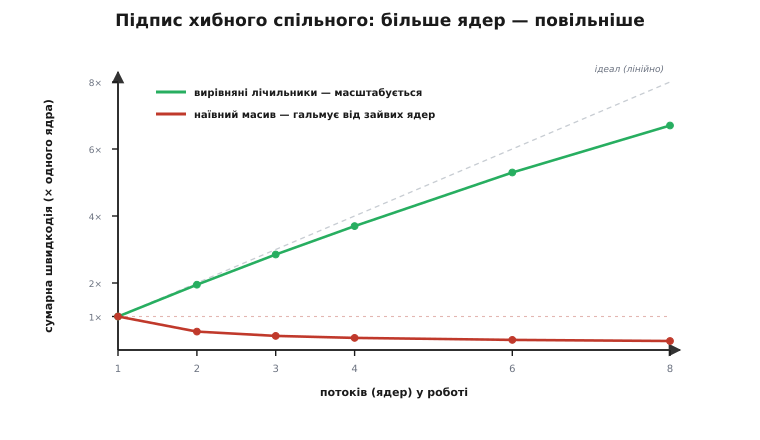

# ⚙️ Полювання на хибне спільне: як його виявити й полагодити в C/C++

Хибне спільне (*false sharing*) підступне саме тим, що воно **невидиме в коді**. Ви завели окрему змінну на кожен потік — зробили рівно те, що радять для швидкого паралельного коду, — а програма замість прискорення від зайвих ядер раптом **сповільнюється**. Компілятор мовчить, санітайзери мовчать, `helgrind` мовчить: жодної гонки даних тут немає, кожен потік чесно пише лише у свою комірку. Гальмує не логіка, а **геометрія пам'яті** — те, які незалежні дані випадково лягли в одну кеш-лінію. Ця вставка — про ремесло: як таке **запідозрити** за поведінкою, як **виміряти** число замість здогадів, як **підтвердити** інструментами й де ховаються **граблі**, через які «полагоджений» код лишається хворим.

## Задача

Уявімо найбуденнішу річ у паралельній програмі: **лічильники на потік**. Кожен потік щось рахує — оброблені пакети, влучання в кеш, кроки симуляції — і, щоб не битися за один спільний лічильник під замком, ми даємо кожному **свій**. Класичний, правильний, підручниковий хід: розвели дані по потоках, замків нема, масштабування має бути ідеальним.

Найпростіше скласти ці лічильники в масив, індексований номером потоку:

```c
static long counters[NUM_THREADS];   // по лічильнику на потік

// потік t:  counters[t]++  у тісному циклі
```

Логічно потоки **не ділять нічого**: потік 0 чіпає лише `counters[0]`, потік 3 — лише `counters[3]`. Здавалося б, чотири потоки на чотирьох ядрах мають дати вчетверо більший сумарний темп, ніж один потік. А на ділі ви отримуєте темп **нижчий**, ніж в одного потоку — і що більше ядер додаєте, то **гірше**. Задача цієї вставки подвійна. По-перше, зрозуміти, **звідки** ця протиприродна поведінка (короткий корінь — нижче), і навчитися **впізнавати її з першого погляду**. По-друге — виміряти виграш від ліку так, щоб це було **число**, а не «здається, швидше», і не наступити на пастки, через які захист від хибного спільного тихо не спрацьовує.

Ось короткий корінь, якого досить, щоб читати далі. Кеш працює не окремими байтами, а **лініями** — блоками зазвичай по 64 байти; для протоколу когерентності лінія неподільна, «зайнято/змінено» стосується всієї лінії разом. `long` — 8 байтів, тож `counters[0..7]` (64 байти) вміщаються **в одну лінію**. Щойно один потік пише у свій елемент, апаратура **знеправлює всю лінію** в кешах решти потоків — разом із їхніми, ніби-то незалежними, лічильниками. Лінія починає «літати» від ядра до ядра, кожен переїзд коштує десятки тактів, і потоки більшість часу стоять, чекаючи на неї. Дані незалежні — а гальмують, ніби спільні.

> 🔧 **Навіщо це.** Це не рідкісний куточок, а **найчастіша причина**, чому «ідеально розпаралелений» код не прискорюється від додавання ядер. Лічильники статистики на потік, голови й хвости черг «один пише — один читає», прапорці стану воркерів, акумулятори в паралельній редукції — усе це щодня потрапляє в одну лінію випадково. Різниця між хворою й здоровою версією — не відсотки, а **рази**, і вона з'являється рівно тоді, коли ви додаєте ядра, щоб стало швидше. Уміти виявити хибне спільне за пів години замість тижня здогадів — цілком практична навичка.

## Ідея: зробити невидиме видимим — і виміряти

Проти невидимого ворога є три послідовні кроки, і робити їх треба саме в цьому порядку, бо кожен наступний дорожчий.

Крок перший — **запідозрити за формою кривої масштабування**. Хибне спільне має характерний, майже впізнаваний почерк: додаєте потоки, а сумарна швидкодія **не росте** — стоїть на місці або навіть **падає нижче** одного потоку. Це різко відрізняє його від чесних причин, чому паралельний код не масштабується (замки, нестача пам'яті, послідовна частина за законом Амдала): там швидкодія хоча б **не гіршає** від зайвих ядер, вона просто виходить на полицю. А от коли чотири ядра працюють **повільніше** за одне — це майже певний підпис або хибного спільного, або гарячого спільного рядка (справжня контенція за одну лінію). Побачили таку криву — далі не гадайте, а міряйте.


*Головний діагностичний слід. Здорова (вирівняна) версія росте майже лінійно — кожне ядро додає свою частку. Хвора (наївний масив) від другого потоку **провалюється нижче** швидкодії одного ядра й далі лежить: додаєш ядра — стає гірше. Саме цей «спад від зайвих ядер», а не просто вихід на полицю, і кричить «хибне спільне».*

Крок другий — **виміряти різницю прямо**, зробивши **дві** версії одного коду: наївну (лічильники впритул) і вирівняну (кожен у своїй лінії), і прогнати обидві тим самим бенчмарком. Це найнадійніший доказ: якщо вирівнювання дає прискорення в рази, а логіка не змінилась ні на рядок, — винне було хибне спільне, крапка. Цей крок не потребує жодних особливих інструментів, лише таймера, — тому з нього й починають.

Крок третій, коли треба **знайти винну лінію** у великій програмі, де очевидного масиву лічильників не видно, — **інструменти лічильників подій кешу**: на Linux це `perf c2c`, що прямо показує рядки з найбільшою «міжкешевою» контенцією. Але спершу вичавимо все з перших двох кроків — вони покривають більшість випадків.

## Робочий код: бенчмарк, що показує різницю

Зробимо самодостатній бенчмарк, який можна зібрати й прогнати на будь-якій багатоядерній машині (ноутбук, ПК — саме там хибне спільне видно найяскравіше). Він запускає `N` потоків, кожен нарощує свій лічильник у тісному циклі, і **міряє час** обох розкладок — наївної й вирівняної — тим самим кодом циклу.

Спершу — дві розкладки даних. Наївна кладе лічильники впритул; вирівняна змушує кожен початися **на межі кеш-лінії**, тож у лінію більше нічий лічильник не потрапляє.

```cpp
#include <cstdint>
#include <cstddef>
#include <thread>
#include <vector>
#include <chrono>
#include <cstdio>

constexpr int      N     = 4;            // потоків = ядер, під якими міряємо
constexpr int64_t  ITERS = 200'000'000;  // ітерацій на потік (щоб час був відчутний)
constexpr size_t   LINE  = 64;           // припущення про розмір лінії (див. пастки!)

// ── НАЇВНО: лічильники впритул → усі в одній-двох лініях ──
struct NaiveCounters {
    int64_t v[N];                        // 4×8 = 32 байти → одна 64-байтова лінія
};

// ── ЛІК: кожен лічильник вирівняний на межу лінії → своя лінія ──
struct alignas(LINE) PaddedCounter {     // C++11: вся структура вирівняна на 64
    int64_t value;
    // компілятор сам добиває структуру до 64 байтів (sizeof == 64),
    // бо масив таких структур має тримати вирівнювання кожного елемента
};
```

Тут працює одна тонка, але вирішальна річ, яку легко проґавити. `alignas(64)` на **типі** означає не лише «перший об'єкт ляже на межу 64» — він робить **вирівнювання самого типу** рівним 64, а мова вимагає, щоб `sizeof` був кратний `alignof`. Тому компілятор **сам** роздуває `PaddedCounter` з 8 до 64 байтів (додає 56 байтів невидимої набивки в кінець), і в масиві `PaddedCounter[N]` **кожен** елемент осідає на своїй межі лінії. Одне слово `alignas` замінює ручне «додай масив-набивку» — але важливо розуміти, що набивка нікуди не поділась, вона просто стала неявною.


*Що насправді змінює `alignas(64)`. Угорі — `counters[4]`: чотири лічильники по 8 байтів лягли впритул і повністю заповнили одну лінію; кожен запис знеправлює її в решти. Унизу — `PaddedCounter[4]`: кожен лічильник сидить на початку **своєї** лінії, а 56 байтів набивки лишаються нічиїми — саме щоб сусід не заліз у цю лінію. Ціна ліку — витрачена пам'ять; виграш — зникнення пінг-понгу.*

Тепер спільний код циклу й вимірювання. Щоб порівняння було чесним, обидві версії ганяє **та сама** функція — різниться лише те, куди показує вказівник на лічильник:

```cpp
// Один потік: ITERS разів нарощує лічильник за адресою p.
// volatile — щоб компілятор не «згорнув» цикл у одне додавання й не викинув його.
static void hammer(volatile int64_t* p) {
    for (int64_t i = 0; i < ITERS; ++i)
        (*p)++;
}

// Прогнати N потоків, кожному дати адресу його лічильника (крок stride байтів
// між сусідніми лічильниками), і повернути час стінного годинника.
template <typename GetPtr>
static double run(GetPtr get_ptr) {
    std::vector<std::thread> pool;
    pool.reserve(N);

    auto t0 = std::chrono::steady_clock::now();
    for (int t = 0; t < N; ++t)
        pool.emplace_back(hammer, get_ptr(t));     // потік t б'є свій лічильник
    for (auto& th : pool)
        th.join();
    auto t1 = std::chrono::steady_clock::now();

    return std::chrono::duration<double>(t1 - t0).count();   // секунди
}

int main() {
    NaiveCounters  naive{};
    std::vector<PaddedCounter> padded(N);          // на купі, вирівнювання типу збережено

    double t_naive  = run([&](int t){ return &naive.v[t];       });
    double t_padded = run([&](int t){ return &padded[t].value;  });

    printf("наївно (в одній лінії):   %.3f c\n", t_naive);
    printf("вирівняно (своя лінія):   %.3f c\n", t_padded);
    printf("прискорення від ліку:     %.2f×\n",  t_naive / t_padded);

    // Довідка: реальний розмір структур — видно, що набивка спрацювала
    printf("sizeof(NaiveCounters)=%zu  sizeof(PaddedCounter)=%zu\n",
           sizeof(NaiveCounters), sizeof(PaddedCounter));
    return 0;
}
```

Що ви побачите, прогнавши це на типовому багатоядерному ноутбуці або ПК: наївна версія повзе, вирівняна летить, а відношення в останньому рядку — **не 1.1 і не 1.5, а щось на кшталт 3–8×** (точне число залежить від машини й числа ядер). `sizeof(PaddedCounter)` покаже `64` — прямий доказ, що набивка на місці. Це і є ваш **вимір**: одна й та сама арифметика, той самий цикл `hammer`, різниця лише в тому, скільки байтів між сусідніми лічильниками, — а час різниться в рази. Кращого доказу хибного спільного не буває.

Кілька слів, чому бенчмарк саме такий. `volatile` на вказівнику **обов'язковий**: без нього оптимізатор має повне право помітити, що результат циклу нікому не потрібен, і викинути весь цикл (або згорнути `ITERS` інкрементів в одне додавання `*p += ITERS`) — і ви поміряєте порожнечу. Число `ITERS` велике навмисно: короткий цикл потоне в накладних витратах на створення потоків, а нам треба, щоб домінував **сам доступ** до лічильника. І міряємо ми **час стінного годинника** (*wall-clock*) через `steady_clock`, а не процесорний час: за хибного спільного ядра проводять час у **очікуванні** лінії, а не в обчисленні, тож сумарний CPU-час може навіть зрости, тоді як стінний час — це те, що відчуває користувач.

### Альтернативи запису вирівнювання

`alignas(64)` — не єдиний спосіб; корисно знати всі три, бо вони трапляються в чужому коді.

**Чистий C (C11).** Той самий ефект дає ключове слово `_Alignas` (макрос `alignas` з `<stdalign.h>` — те саме):

```c
#include <stdalign.h>
#include <stdint.h>

typedef struct {
    alignas(64) int64_t value;   // C11: вирівняти поле (і тип) на 64 байти
} padded_counter_t;

static padded_counter_t counters[4];   // кожен елемент — у своїй лінії
```

**Ручна набивка** — коли вирівнювання типу небажане (наприклад, поле всередині більшої структури), а треба лише **розсунути** сусідів. Тут ви явно доповнюєте структуру байтами до розміру лінії:

```c
#include <stdint.h>

typedef struct {
    int64_t value;
    char    pad[64 - sizeof(int64_t)];   // добити до 64 байтів вручну
} padded_counter_t;
```

Різниця тонка, але важлива. `alignas` гарантує, що об'єкт **починається** на межі лінії — це найнадійніше, бо ловить і випадок, коли масив таких структур міг би зсунутися. Ручний `pad[]` лише **розсуває** сусідів на потрібну відстань, але не гарантує, що перший елемент вирівняний по лінії; якщо сам масив ліг з нульового зсуву лінії — усе добре, а якщо ні — сусідні структури можуть частково ділити лінію на стиках. На практиці для масиву глобальних/статичних структур обидва підходи дають однаковий результат (компонувальник вирівнює масив щедро), але `alignas` — той, на який можна покластися завжди.

**C++17: `std::hardware_destructive_interference_size`.** Стандарт додав константу саме для цього — «мінімальний рекомендований відступ між двома незалежними об'єктами, щоб уникнути хибного спільного», зазвичай рівну розміру L1-лінії цілі:

```cpp
#include <new>          // std::hardware_destructive_interference_size

struct alignas(std::hardware_destructive_interference_size) PaddedCounter {
    int64_t value;
};
```

Виглядає як ідеальний, портативний спосіб — але тут захована пастка, про яку нижче: ця константа фіксується **під час компіляції** й не бачить, на якому саме процесорі код зрештою побіжить.

## Складність і пастки

Ось де «полагоджено» найчастіше виявляється неправдою, а «виявлено» — хибною тривогою.

**Пастка перша, найголовніша: розмір лінії різний на різних платформах.** Усі приклади вище припускають лінію в **64 байти** — і це справді типово для x86 (Intel, AMD). Але це **не всесвітня стала**. На процесорах Apple серії M кеш-лінія на рівні системи — **128 байтів**; вирівнювання на 64 там **не рознесе** два сусідні об'єкти надійно — вони можуть лишитися в одній 128-байтовій лінії, і хибне спільне переживе ваш «лік». У зворотний бік: на ESP32 (ядра Xtensa) лінія кеша — лише **32 байти**; там вирівнювання на 64 працює (з запасом), але марнує вдвічі більше пам'яті, ніж треба, а на мікроконтролері кожен байт на рахунку. Мораль: **вирівнюйте на реальний розмір лінії цільової платформи**, а не на завчене «64». Якщо код збирається під різні цілі — беріть максимальний очікуваний розмір лінії (обережний варіант — 128 під Apple), або визначайте його по платформі. І перевіряйте `sizeof` вирівняної структури: якщо він менший за розмір лінії цілі, ваш захист діряв. Розмір лінії — це властивість заліза, як і сам [кеш](topic:programming/cache); не приймайте його на віру.

**Пастка друга: `hardware_destructive_interference_size` бреше про ABI.** Спокуса взяти цю C++17-константу велика, але вона фіксується **на етапі компіляції** й вбудовується в **ABI** (розкладку структур). GCC навіть видає попередження при її використанні, бо якщо ви скомпілюєте під одну лінію, а бінарник поїде на машину з іншою — вирівнювання буде неправильним, а гірше того — дві частини програми, зібрані з різними значеннями, побачать структуру **по-різному** й зіпсують дані. Стандарт прямо радить обмежувати її вжиток кодом, де ABI не перетинає межі одночасно зібраних одиниць трансляції. Для мікроконтролера, де ви точно знаєте залізо, безпечніше **захардкодити** відомий розмір лінії константою й задокументувати її, ніж покладатися на цю «портативну» абстракцію, що насправді портативна лише в теорії.

**Пастка третя: хибне спільне ховається не лише в масивах.** Масив лічильників — навчальний випадок, бо очевидний. У житті винними частіше бувають **сусідні глобальні змінні** й **сусідні поля структури**. Компонувальник кладе глобали поруч у тому порядку, як їх оголошено (чи майже так), тож два «гарячих» глобали, які пишуть різні потоки, легко опиняються в одній лінії:

```c
// ПАСТКА: два лічильники, які смикають різні потоки, стоять поруч у пам'яті
static volatile int64_t rx_packets;   // пише потік прийому
static volatile int64_t tx_packets;   // пише потік передачі
// компонувальник, найпевніше, покладе їх в одну лінію → хибне спільне
```

Те саме всередині структури: поле `head` (пише виробник) і поле `tail` (пише споживач) кільцевого буфера, що лежать поряд, — класичне хибне спільне в черзі «один пише — один читає». Лік той самий — рознести їх вирівнюванням чи набивкою між полями:

```c
typedef struct {
    alignas(64) volatile int64_t head;   // виробник — своя лінія
    alignas(64) volatile int64_t tail;   // споживач — своя лінія
} spsc_queue_t;
```

Отже, підозрюючи хибне спільне, дивіться не лише на масиви, а на **будь-які** дані, які **різні потоки часто пишуть** і які могли лягти поруч у пам'яті.

**Пастка четверта, зворотна: не вирівнюйте все підряд.** Набивка до розміру лінії — це **витрата пам'яті**: масив із чотирьох `int64` займав 32 байти, а з `alignas(64)` — уже 256. На великому масиві структур це роздуття може саме зіпсувати швидкодію: даних стає більше, вони гірше влазять у кеш, більше промахів. Правило точкове: вирівнюйте **лише те, що справді стає ареною хибного спільного** — дані, які **різні ядра часто пишуть незалежно**. І пам'ятайте про зворотний бік тієї самої монети: дані, які одне ядро читає-пише **разом**, навпаки корисно тримати **в одній** лінії (це називають *true sharing* — справжнім спільним), щоб їх приносив один промах, а не кілька. Вирівнювання наосліп ламає це.

**Пастка п'ята: інструменти й те, як не обдурити себе вимірюванням.** Коли двох версій-близнюків замало (велика програма, винної лінії не видно), беруть **лічильники подій кешу**. На Linux головний інструмент — `perf c2c` (*cache-to-cache*): він семплить доступи до пам'яті й показує кеш-лінії з найбільшою **міжкешевою контенцією** — скільки разів завантаження влучало в **змінену** лінію чужого ядра (подія HITM, *hit-in-modified*). Висока частка «LLC-промахів у віддалений кеш (HITM)» — це прямий підпис хибного (або справжнього) спільного, а звіт указує навіть зсув байта в лінії, тобто які саме поля б'ються. Робочий цикл простий: `perf c2c record ./ваша_програма`, потім `perf c2c report`. Працює це не всюди однаково: на Intel — через події затримки завантаження, на Arm64 — через SPE (потрібна апаратна й ядерна підтримка), а на деяких процесорах (наприклад, AMD Zen 3) `perf c2c` не підтримується взагалі — це варто знати, перш ніж покладатися на нього. Загальніший підхід, що працює будь-де, — стежити за **інтенсивністю знеправлень і промахів когерентності** через `perf stat` на відповідних подіях і дивитися, чи вони підскакують саме тоді, коли ви додаєте потоки.

І дві засади, щоб вимірювання не збрехало. Перша: **закріплюйте потоки за ядрами** (*CPU affinity*). Якщо планувальник вільно ганяє потоки між ядрами, лінія й так «переїжджає» разом із потоком, і картина змащується — то видно хибне спільне, то ні, від запуску до запуску. Прикріпивши кожен потік до свого ядра, ви робите ефект стабільним і відтворним. Друга: **міряйте на «холодну», кілька разів і медіану**. Перший прогін часто оманливий (кеші порожні, частота процесора ще не піднялася турбо-режимом); проженіть бенчмарк кілька разів і візьміть медіану, інакше турбо-розгін чи фонове навантаження припишуть різницю не туди. Хибне спільне — ефект, що **посилюється з числом ядер**, тож найпереконливіше міряти його на 2, 4, 8 потоках і будувати ту саму криву масштабування: здорова версія росте, хвора — падає.

**Пастка шоста, тонка: `volatile` — для бенчмарка, не для правильності.** У бенчмарку вище `volatile` стоїть, щоб оптимізатор не викинув цикл, — і лише для цього. Не переносьте цей `volatile` у реальний багатопотоковий код як засіб синхронізації: він **не дає ні атомарності, ні бар'єра пам'яті** між ядрами. Для справжніх лічильників, які пишуть кілька потоків в **одну** комірку, потрібен атомарний тип. Тут корисно розрізняти два різні болі: коли кілька потоків пишуть **одну** змінну — це справжня контенція, лік — [`std::atomic` й правильний порядок пам'яті](topic:programming/atomicity-races); коли ж кожен пише **свою**, а гальмує через сусідство в лінії — це хибне спільне, і лік — **рознести** їх вирівнюванням. Плутати ці два не можна: атомік не прибере хибного спільного (атомарні лічильники в одній лінії битимуться так само), а вирівнювання не замінить атоміка там, де дані справді спільні.

## Підсумок

Хибне спільне виявляють і лікують так. **Підозра** — за формою кривої масштабування: якщо швидкодія **падає** від додавання ядер (а не просто виходить на полицю), винне майже напевно воно. **Доказ** — зробити двох близнюків (лічильники впритул проти вирівняних на межу лінії) і поміряти той самий цикл: різниця в рази при незмінній логіці підтверджує діагноз. **Пошук у великій програмі** — `perf c2c` та лічильники подій кешу, що вказують гарячу лінію й навіть байт у ній. **Лік** — рознести дані, які різні ядра часто пишуть, по різних лініях: `alignas`/`_Alignas` на розмір **реальної** лінії цілі (64 на x86, 128 на Apple M, 32 на ESP32), або ручна набивка. І головні граблі: розмір лінії не універсальний, `hardware_destructive_interference_size` небезпечна через ABI, хибне спільне ховається і в сусідніх глобалах та полях структур, а вирівнювати наосліп — марнувати пам'ять і ламати справжнє спільне. Один рядок вирівнювання перетворює код, що гальмує від ядер, на код, що від них летить, — але лише коли він націлений на справжню лінію справжньої платформи.
