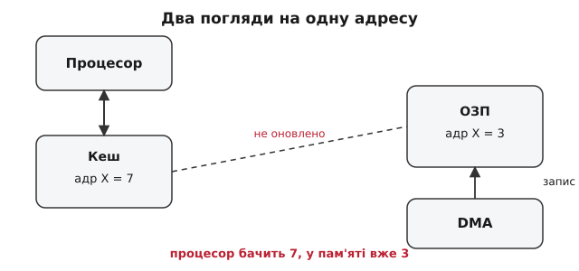
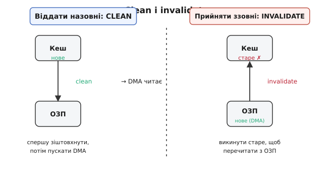
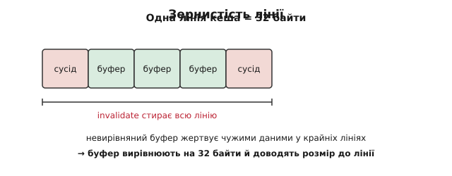

# Когерентність кеша і DMA

Уявіть, що ви ведете бухгалтерію на чернетці під рукою, а справжня книга обліку лежить у сейфі в іншій кімнаті. Поки ви рахуєте, ви правите тільки чернетку — так швидше. Час від часу переписуєте підсумок у книгу. Усе гаразд, поки ви єдиний, хто торкається книги. Але одного дня, поки ви пораєтесь із чернеткою, до сейфа заходить кур'єр і **вписує у книгу нову цифру** — не спитавши вас. Тепер у вас дві правди: у чернетці одне, у книзі інше. І ви навіть не знаєте, що книга змінилася.

Саме це відбувається між процесором і DMA. Чернетка — це [кеш](book:programming/cache) процесора: маленька швидка пам'ять біля ядра, куди складають копії часто вживаних клітинок [ОЗП](book:programming/memory-map), щоб не бігати щоразу до повільної основної пам'яті. Кур'єр — це [контролер DMA](book:programming/dma-controller) (англ. *direct memory access* — прямий доступ до пам'яті), окремий блок, який перекидає дані між периферією (мережева карта, аудіокодек, АЦП) і ОЗП **без участі процесора**. Кожен окремо — благо. Разом, якщо не домовитися, — джерело найпідступніших багів у прошивці.

> 🔧 **Навіщо це.** На дрібному контролері без кеша (Cortex-M0, AVR) цієї проблеми немає — там процесор і DMA бачать той самий ОЗП. Але щойно ви берете потужніший чип із кешем даних (Cortex-M7 у STM32H7, i.MX RT) і вмикаєте DMA для швидкого приймання пакетів чи звуку — усе «майже працює». Іноді дані правильні, іноді сміття, залежно від того, що процесор щойно чіпав. Хто не знає про когерентність, тижнями шукає «плаваючий» баг, якого нема в коді.

## Звідки взагалі дві копії

Кеш існує з однієї причини: **розрив швидкостей**. Ядро виконує інструкцію за частки наносекунди, а звернення до зовнішнього ОЗП коштує десятки-сотні тактів очікування. Якби процесор чекав пам'ять на кожній інструкції, уся його швидкодія пропала б. Тому між ядром і ОЗП ставлять кеш — і працюють переважно з ним.

Читання просте: перший доступ до адреси тягне дані з ОЗП у кеш (заповнюється ціла **лінія кеша**, англ. *cache line* — суцільний шматок, зазвичай 32 байти, а не один байт), далі процесор бере їх звідти миттєво. Запис хитріший, і саме тут корінь біди. Є дві стратегії. За **наскрізного запису** (*write-through*) кожен запис іде і в кеш, і одразу в ОЗП — просто, але повільно. За **зворотного запису** (*write-back*) запис лягає **тільки в кеш**, а лінія позначається «брудною» (*dirty*); в ОЗП вона потрапить пізніше — коли лінію витиснить інша або коли її свідомо зіштовхнуть. Write-back швидший і панує в реальних чипах. Ціна — те, що **свіже значення живе в кеші, а в ОЗП лежить старе**, поки лінію не скинули.

Тепер додаємо DMA. Контролер DMA підключений до пам'яті через [шинну матрицю](book:programming/bus-matrix) — паралельно до процесора, повз його кеш. Він фізично не бачить чернетку; для нього єдина реальність — вміст ОЗП. І виходить дві сцени неузгодженості.

**Сцена перша — процесор віддає дані назовні.** Ви наповнили буфер у пам'яті (скажімо, кадр для відправки в мережу) і кажете DMA: «бери звідси й відправляй». Але ви писали в буфер через кеш — свіжі байти ще в брудних лініях, а в ОЗП там старе сміття. DMA чесно читає ОЗП і відправляє **старе сміття**.

**Сцена друга — периферія приносить дані процесору.** DMA прийняв пакет і поклав його в ОЗП. Ви читаєте буфер — але процесор пам'ятає, що ця адреса вже в кеші (він її колись читав), і бере **стару копію з кеша**, навіть не глянувши в ОЗП. Новий пакет проігноровано.


*Ядро працює з копією в кеші, DMA — напряму з ОЗП. Поки їх не узгодити, кожен певен своєї правди.*

**Когерентність** (лат. *cohaerentia* — зчепленість, зв'язність) — це і є властивість, якої тут бракує: гарантія, що всі, хто бачить певну адресу, бачать **одне й те саме значення**. Між ядрами одного процесора когерентність зазвичай підтримує залізо саме — див. [протокол когерентності кешів](book:programming/cache-coherence). А от між процесором і DMA на багатьох контролерах її **немає** — і полагодити мусить програміст.

## Два лікування: зіштовхнути й викинути

У кеша є рівно дві операції обслуговування (*cache maintenance*), і вся боротьба зводиться до того, щоб застосувати **правильну в правильний момент**.

**Clean (зіштовхнути, інколи кажуть «flush»)** — записати брудні лінії з кеша в ОЗП. Після clean ОЗП містить те саме, що кеш; копія в кеші лишається. Це ліки для **сцени першої**: перед тим як пускати DMA читати буфер, робимо clean — і DMA побачить свіже.

**Invalidate (зневажнити, викинути)** — позначити лінії кеша недійсними, не переписуючи їх у ОЗП. Після invalidate наступне читання цих адрес **змусить процесор піти в ОЗП** і перечитати заново. Це ліки для **сцени другої**: після того як DMA заповнив буфер, робимо invalidate — і читання підтягне нові байти з ОЗП замість старих із кеша.

Звідси проста, але критична мнемоніка напрямку:

```
Процесор → DMA (віддаємо назовні):  CLEAN  перед стартом DMA
DMA → процесор (приймаємо ззовні):  INVALIDATE  після завершення DMA
```


*Віддаєш дані — спершу clean, потім пускай DMA. Прийняв дані — invalidate, потім читай.*

Плутати їх не можна, і помилка тут особливо зла. Якщо на прийомі замість invalidate зробити clean, брудні лінії кеша **затруть свіжі дані DMA в ОЗП** — ви власноруч знищите прийнятий пакет. Тому напрямок треба тримати в голові чітко.

> 🔧 **Навіщо це.** Ці дві операції — весь інструмент. Драйвери мережі, аудіо, SD-карти на Cortex-M7 обгортають кожну DMA-передачу саме в цю пару. Плутанина clean/invalidate — класична причина, коли «раз на тисячу пакетів приходить сміття»: більшість часу лінія й так вже була скинута або витиснута, і тільки в рідкісному збігу станів баг стріляє.

## Залізо може й саме: снупінг

Не всюди це кладуть на програміста. Великі системи (настільні процесори, серверні SoC) вміють **снупінг шини** (англ. *bus snooping* — «підслуховування» шини): контролер кеша стежить за транзакціями на шині й, побачивши, що DMA пише в адресу, яку він кешує, **сам робить invalidate**; а перед тим як DMA читає — сам робить clean. Програміст просто працює з буфером, а залізо непомітно тримає когерентність.

Чому ж тоді не роблять так завжди? Бо снупінг коштує **транзисторів і енергії**: кеш має постійно порівнювати кожну зовнішню адресу зі своїм умістом. На дрібному контролері, де кожен міліампер і кожна копійка на рахунку, це розкіш. Тому в світі вбудованих систем поширений компроміс: **зовнішній L2-кеш** тримають когерентним снупінгом, а **внутрішній L1** лишають на совісті програми. Cortex-M7 із його L1 data-кешем — саме такий випадок: ніякого снупінгу для DMA, усе вручну.

Це важлива розвилка, і статус її треба знати чесно: **більшість мікроконтролерів із кешем DMA-когерентності не мають** — читайте довідник (*reference manual*) свого чипа й розділ про кеш. Ніколи не припускайте, що «залізо якось само»: припущення тут коштує втрачених вихідних.

## Як це виглядає в коді

Візьмемо Cortex-M7 і стандартну прошивкову бібліотеку [CMSIS](book:programming/cmsis) — там уже є готові функції обслуговування кеша. Приймаємо пакет по DMA і хочемо його прочитати:

**Приймання: DMA пише в буфер, ми читаємо після invalidate**

```c
// 32 — розмір лінії кеша Cortex-M7; буфер вирівняно на межу лінії
static uint8_t rx_buf[256] __attribute__((aligned(32)));

void receive_frame(void) {
    start_dma_receive(rx_buf, sizeof(rx_buf));   // DMA пише в ОЗП
    while (!dma_done()) { /* чекаємо або спимо */ }

    // DMA поклав свіже в ОЗП; кеш може тримати старе — викидаємо його
    SCB_InvalidateDCache_by_Addr((uint32_t *)rx_buf, sizeof(rx_buf));

    process(rx_buf);   // тепер читання піде в ОЗП і візьме нові байти
}
```

**Відправлення: наповнюємо буфер, робимо clean, тоді пускаємо DMA**

```c
static uint8_t tx_buf[256] __attribute__((aligned(32)));

void send_frame(const uint8_t *data, size_t n) {
    memcpy(tx_buf, data, n);   // пишемо через кеш — свіже поки в кеші

    // зіштовхуємо кеш у ОЗП, щоб DMA прочитав саме нове
    SCB_CleanDCache_by_Addr((uint32_t *)tx_buf, sizeof(tx_buf));

    start_dma_transmit(tx_buf, n);   // DMA читає з ОЗП — і бачить свіже
}
```

Три деталі тут не косметичні, а частина коректності.

**Вирівнювання й розмір — на межу лінії.** Кеш обслуговує дані **цілими лініями**, не байтами: не можна зневажнити «оті 10 байтів усередині лінії», викидається вся лінія 32 байти. Якщо буфер не вирівняний на 32 і не кратний 32, у його крайні лінії потрапляють **чужі змінні**. Тоді `invalidate` викине разом із буфером і чужі свіжі дані (втратимо їх), а `clean` навпаки — чужими брудними лініями затре межу буфера. Тому DMA-буфери [вирівнюють](book:programming/memory-alignment) на розмір лінії й доводять розмір до кратного лінії. Атрибут `aligned(32)` у прикладах — саме про це.


*Операції кеша працюють лініями. Невирівняний буфер ділить крайні лінії з чужими даними — і жертвує ними.*

**Порядок операцій має справді відбутися.** Компілятор і процесор можуть переставляти доступи до пам'яті задля швидкодії. Треба, щоб `clean` реально завершився **до** старту DMA, а `invalidate` — **до** читання. Функції CMSIS усередині ставлять бар'єр пам'яті (інструкцію `DSB`), тож переставити доступи через них не вийде; коли робите щось вручну — про [бар'єр пам'яті](book:programming/memory-barrier-instructions) доводиться дбати самому. І сам покажчик на буфер, який DMA міг змінити, розумно тримати [`volatile`](book:programming/volatile-qualifier), щоб компілятор не кешував старе значення в регістрі.

**Момент invalidate — після DMA, не до.** Зневажнювати треба, коли DMA **вже дописав** ОЗП. Зробите invalidate до завершення передачі — і між ним та кінцем DMA процесор може знову затягти в кеш недописані дані; тоді читання візьме напівпорожню лінію. Тому invalidate — строго по прапорцю завершення DMA.

## Простіший шлях: не кешувати буфер

Уся ця гімнастика зникає, якщо оголосити ділянку пам'яті під DMA-буфери **некешованою**. Тоді процесор для цих адрес ходить прямо в ОЗП, повз кеш, — і бачить рівно те саме, що DMA. Це роблять через [блок захисту пам'яті](book:programming/mmu-address-window) (MPU на Cortex-M): виділяють невелику область, ставлять їй атрибут *non-cacheable*, і кладуть туди DMA-буфери. Драйвери мережі та звуку часто саме так і роблять.

Плата за спокій — **швидкість**: доступ процесора до некешованої пам'яті повільний, бо кеш більше не рятує. Тому вибір простий за принципом. Буфер, який процесор інтенсивно перемелює (наприклад, розбирає кожен байт пакета), краще лишити кешованим і платити clean/invalidate на межах передачі — рахунок один на цілий буфер. А буфер, який процесор майже не чіпає (кільцевий буфер аудіо, що тече наскрізь), дешевше зробити некешованим і забути про обслуговування зовсім. Здоровий інженерний компроміс, а не «правильний спосіб» на всі випадки.

> 🔧 **Навіщо це.** Некешований буфер — найнадійніший захист від «плаваючих» багів когерентності: раз налаштував MPU — і жоден забутий clean не вистрелить. Ціна помітна лише там, де процесор гризе буфер у гарячому циклі. Для більшості DMA-потоків (лог у флеш, телеметрія, повільний АЦП) вона неістотна, і некешована ділянка — найспокійніше рішення.

## Звідки взялася сама проблема

DMA старіший, ніж кеші даних, — і спершу проблеми когерентності не існувало взагалі. Ідея «хай пристрій сам пише в пам'ять, не смикаючи процесор» з'явилася ще на лампових машинах 1950-х: комп'ютер **DYSEAC** (Національне бюро стандартів США, у роботі з 1954 року) вважають однією з перших машин із прямим доступом пристроїв до пам'яті — і водночас із апаратними [перериваннями](book:programming/interrupt-vector) вводу-виводу. Трохи згодом IBM у своїх мейнфреймах (IBM 709, 1958) вивела ту саму ідею в окремі «канали» — співпроцесори вводу-виводу. У світ мікрокомп'ютерів DMA прийшов з мікросхемою-контролером Intel 8237 (1979), яка стала частиною першого IBM PC (1981). *(Статус: «перший» тут спірний — DYSEAC, система SAGE та IBM 709 сперечаються за першість залежно від того, що саме рахувати й коли який блок запрацював; сам факт ранньої появи DMA в 1950-х усталений.)* Докладніше народження ідеї — в [історичній довідці про DMA](book:programming/cache-coherency-dma/hist-dma-origins.md).

Тодішні машини кешів даних не мали, тож DMA й пам'ять завжди бачили одне й те саме. Проблема когерентності народилася **пізніше**, коли задля швидкості між процесором і пам'яттю вклинили кеш зі зворотним записом. Два незалежно корисні винаходи — кеш і DMA — зіштовхнулися, і на стику виявилася діра, яку відтоді або затикає залізо снупінгом, або затикає програміст парою clean/invalidate. Класичний приклад того, як складність системи ховається не в деталях, а **на межах** між добре зрозумілими частинами.
