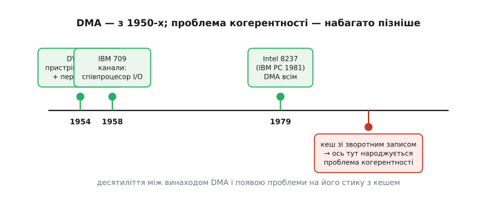

# 📜 DMA: як пристроям дозволили писати в пам'ять самим

> Прямий доступ до пам'яті сьогодні звучить як службова дрібниця в даташиті: ось контролер, ось канали, ось прапорець «передачу завершено». Та коли ця ідея народжувалася — на лампових машинах середини 1950-х, — вона була справжнім переворотом у тому, як узагалі влаштувати комп'ютер. Бо доти діяло мовчазне правило: **процесор — єдиний господар пам'яті**, і жоден пристрій не сміє її торкнутися сам. Історія DMA — це історія про те, як це правило зламали; про те, як «хто перший» тут чесно спірне; і про тонку іронію наостанок — проблеми когерентності, заради якої ви це читаєте, тоді ще **не існувало**, і народилася вона багато пізніше, зовсім з іншого винаходу.

Уявіть машину початку 1950-х. Процесор рахує — і водночас мусить власноруч, слово за словом, годувати повільний пристрій: прочитав слово з пам'яті, виставив на шину, дочекався, поки стрічка чи перфокарта його проковтне, узяв наступне. Поки йде цей ручний перекид, **обчислення стоять**. Уся дорога швидкодія лампового монстра простоює в очікуванні механіки, що повзе в тисячі разів повільніше. Це очевидне марнотратство і штовхало інженерів до однієї й тієї самої думки: а що, як **звільнити процесор** від ролі вантажника — хай пристрій сам домовляється з пам'яттю, а ядро тим часом рахує?

Ця думка й стала зерном DMA. Але, як майже завжди в історії техніки, вона визріла не в одній голові й не в один день — і саме тому питання «хто перший» тут не має простої відповіді. Розгляньмо трьох головних дійових осіб по черзі: машину, що першою пустила пристрої прямо в пам'ять; фірму, що перетворила цю ідею на окремий співпроцесор вводу-виводу; і мікросхему, що донесла її до кожного персонального комп'ютера.

---

## DYSEAC (1954): пристрій сам іде в пам'ять, а тоді перебиває програму

Почнімо з машини, чия назва сьогодні майже забута, — **DYSEAC**. Її збудувало **Національне бюро стандартів США** (*National Bureau of Standards*, NBS) на замовлення **Корпусу зв'язку армії США** (*U.S. Army Signal Corps*), і в роботу вона стала у **квітні 1954 року**. Уже сам вигляд машини був новацією: її змонтували в кузовах кількох причепів — це був один із перших **пересувних** комп'ютерів в історії, ймовірно, взагалі перший. Усередині — близько 900 ламп і 24 500 кристалічних діодів, пам'ять на ртутних лініях затримки на 512 слів. Для нашої розповіді важлива не механіка, а **ідея архітектури**, яку в ній втілили.

DYSEAC зробив дві речі, що доти разом не траплялися, і саме їхнє поєднання робить його ключовою постаттю. По-перше, він дозволив **пристроям вводу-виводу обмінюватися з пам'яттю напряму, поки програма виконується**. По-друге, коли обмін завершувався, пристрій **перебивав** програму сигналом «готово» — тобто застосував апаратне [переривання](book:programming/interrupt-vector) вводу-виводу. Це і є два стовпи всього сучасного асинхронного вводу-виводу — і DYSEAC поставив обидва одразу.

Найточніше суть уловив **Дональд Кнут** (*Donald Knuth*), і його формулювання варто навести дослівно, бо воно вичерпує тему:

> DYSEAC «запровадив ідею пристроїв вводу-виводу, що спілкуються з пам'яттю **напряму**, поки програма виконується, а тоді **перебивають** програму по завершенні».

Ось у цих двох дієсловах — «напряму» й «перебивають» — і схований весь DMA разом із перериванням. Один із головних проєктувальників DYSEAC, інженер NBS **Ейб Лайнер** (*Abraham L. Leiner*), описував це так: будь-які послідовні ділянки пам'яті «можна завантажувати чи виводити навіть тоді, коли триває програма обчислень», і машина сама «стежить, яка адреса у швидкій пам'яті містить слово, що його зараз треба передати». Прочитайте цю фразу ще раз очима інженера-вбудовника: **автоматичний лічильник адреси, що йде в пам'ять паралельно з роботою ядра**, — це буквально опис регістра адреси в будь-якому сучасному контролері DMA. Лайнер описав вашу периферію 1954 року.

> 🔧 **Навіщо це.** Коли ви налаштовуєте канал DMA — задаєте початкову адресу буфера, лічильник слів і кажете «поїхали, а мене смикни по завершенні перериванням», — ви відтворюєте рівно ту схему, яку Лайнер зі спільниками зібрали на лампах і ртутних лініях сімдесят років тому. Пара «автономна передача + переривання на кінці» не змінилася в суті ні на йоту; змінилися лише лампи на транзистори. Тому історія тут не прикраса: вона показує, що DMA й переривання — **близнюки від народження**, і в кожному драйвері ви користуєтеся ними в парі саме тому, що такими вони й прийшли на світ.

*(Статус доказовості. Те, що DYSEAC став у роботу 1954 року й що NBS будував його для Корпусу зв'язку, — усталений факт. Первинність саме **перериванням вводу-виводу** добре обґрунтована: історик обчислювальної техніки **Марк Смотерман** (*Mark Smotherman*), звівши свідчення, віддає цю пальму DYSEAC, бо конкурентну систему переривань на UNIVAC 1103A довели до діла аж у лютому 1956-го — на два роки пізніше. Слово «DMA» тоді ще не вживали; його прикладають до DYSEAC заднім числом за суттю — «пристрій пише в пам'ять сам».)*

---

## IBM 709 (1957–58): ввід-вивід стає окремим співпроцесором

Наступний крок зробила IBM — і зробила його інакше за духом. Якщо DYSEAC просто **пустив** пристрої в пам'ять, то IBM винесла весь ввід-вивід в **окремий обчислювальний блок**, що працює сам собою поряд із головним процесором. Це принципово багатша ідея, ніж «тупий» перекид байтів, і саме вона проросла в цілу гілку архітектури мейнфреймів.

Машину **IBM 709** оголосили в січні 1957 року, а перший екземпляр установили у серпні 1958-го. Її попередник, IBM 704, робив ввід-вивід «руками» процесора: щоб прочитати стрічку, ядро мусило особисто ганяти слова одне за одним — рівно те марнотратство, з якого ми почали. У 709-му цю роботу забрав пристрій із назвою, що видає епоху, — **синхронізатор даних** (*Data Synchronizer*), модель IBM 766. Він давав машині **канали** (*channels*) — по суті, невеличкі спеціалізовані процесори вводу-виводу, кожен зі своєю програмою.

Різниця тонка, але глибока, і її варто відчути. Простий DMA виконує одну команду: «перекинь стільки-то слів звідси туди». **Канал** же виконує цілу власну **програму каналу**: сам іде за ланцюжком команд, сам розгалужується, сам обслуговує кілька пристроїв за чергою — і лише в кінці смикає головний процесор. Тому канал коректніше називати не «контролером DMA», а **співпроцесором** вводу-виводу: він не просто має прямий доступ до пам'яті (це в нього теж є — тому його часто й звуть DMA-контролером), а ще й **думає** за власним алгоритмом. IBM 709 міг нести до трьох синхронізаторів, кожен — свій оберемок стрічок, друкарок і пристроїв для перфокарт, і все це молотило ввід-вивід, поки центральний процесор рахував не відриваючись.

> 🔧 **Навіщо це.** Ця розвилка 1958 року жива й донині — і ви щодня обираєте між її гілками. «Простий» DMA — це периферія Cortex-M: задав адресу й лічильник, він перекинув блок, крапка. А «канальна» ідея повернулася під новими іменами: дескрипторні DMA, де контролер сам іде по **зв'язному списку** дескрипторів («перекинь оцей блок, тоді той, тоді розгалузся»), — це прямий нащадок програми каналу IBM 709. Коли ви на сучасному чипі складаєте ланцюжок DMA-дескрипторів для безперервного приймання пакетів, ви програмуєте канал у дусі 766-го синхронізатора — тільки на кремнії завбільшки з ніготь.

*(Статус доказовості. Дати 709-го усталені: оголошення — січень 1957, перше встановлення — серпень 1958; тому «канали» датують то 1957-м, то 1958-м залежно від того, що рахувати — анонс чи робочу машину. Формулювання «IBM 709 — перше застосування DMA» трапляється в літературі, але воно **завузьке**: DYSEAC пустив пристрої в пам'ять раніше. Чесніше казати, що 709 першим зробив ввід-вивід **програмованим співпроцесором**, а не що він «винайшов DMA».)*

---

## Intel 8237 (1979): DMA в кожному персональному комп'ютері

Третій герой — не машина, а **одна мікросхема**, і саме вона перетворила DMA з рідкісної розкоші великих систем на буденну деталь, що є практично в кожного. Це **Intel 8237** — програмований контролер DMA, випущений **1979 року**: чотири незалежні канали, тактова частота 3 МГц, і вся логіка прямого доступу в одному корпусі.

Слава прийшла до 8237 через два роки: коли 1981-го вийшов **перший IBM PC**, один такий контролер стояв у ньому й обслуговував ввід-вивід — насамперед перекид даних із дискети, для чого процесор 8088 сам був заповільний. Пізніший IBM PC AT додав другий 8237 у зв'язці «господар-підлеглий», розширивши число каналів із чотирьох до семи. Так DMA увійшов у ДНК платформи PC — і лишався там десятиліттями, аж поки дискретний контролер не розчинився в мікросхемах чипсета.

Тут ховається дрібна історична гостринка, яку варто розкрити чесно, бо вона добре ілюструє, як насправді робиться техніка. Хоч мікросхема зветься «Intel 8237», **спроєктувала її не Intel, а AMD** — під власною назвою **Am9517**. За угодою про перехресне ліцензування (тією самою, що дозволяла AMD виробляти процесори Intel) конструкція стала доступна й Intel. Тому на корпусах «інтелівського» чипа можна побачити напис «© AMD». Класичний винахід — це рідко клеймо однієї фірми на корпусі; за ним зазвичай стоїть сплетіння ліцензій, угод і чужих рук.

> 🔧 **Навіщо це.** Архітектура «окремий програмований контролер DMA з кількома каналами, який ти налаштовуєш регістрами», що її ви бачите на будь-якому сучасному мікроконтролері, — це прямий спадок 8237. Сама модель роботи — «завантаж у канал адресу й лічильник, вибери напрям і режим, запусти» — стала галузевим шаблоном саме через усюдисущість IBM PC. Коли ви вперше читаєте розділ «DMA controller» у даташиті незнайомого чипа й одразу впізнаєте знайомі поля, дякуйте за це не в останню чергу мікросхемі 1979 року, що задала цей словник для мільйонів інженерів.

---

## Хто ж перший: чому відповідь залежить від запитання

Тепер — найделікатніше. У популярних джерелах «першим DMA» називають то DYSEAC, то IBM 709, а часом і систему **SAGE** (велетенський комп'ютер протиповітряної оборони **AN/FSQ-7** від IBM, теж кінець 1950-х). Хто ж правий? Правильна відповідь інженерна: **залежить від того, що саме ви рахуєте** — і щойно ви розкладете питання на частини, суперечка розсипається.

Розділімо, як завжди варто в історії винаходів, кілька різних речей, які недбало звалюють в одне слово «перший»:

- **Ідея** — «хай пристрій пише в пам'ять сам, а процесор тим часом рахує». Вона носилася в повітрі на зламі 1940–50-х; приписати її одній людині чесно не вийде.
- **Перша робоча реалізація** прямого доступу пристроїв до пам'яті з перериванням по завершенні. Тут найсильніший претендент — **DYSEAC (1954)**, і саме за це його цінують історики.
- **Ввід-вивід як окремий програмований співпроцесор** (канал зі своєю програмою). Це заслуга **IBM 709 (1957–58)** — інша, багатша ідея, ніж простий перекид.
- **Масовий продукт**, що зробив DMA доступним усім, — мікросхема **Intel 8237 (1979)** в **IBM PC (1981)**.

Бачите, як питання «хто перший» розпадається на чотири різні питання з чотирма різними відповідями? DYSEAC перший **пустив пристрій у пам'ять**; IBM 709 перший зробив ввід-вивід **розумним співпроцесором**; 8237 перший приніс усе це **в кожен дім**. Сперечатися, «хто винайшов DMA», без уточнення, **що** саме мати за DMA, — те саме, що сперечатися, хто «винайшов автомобіль», не домовившись, чи рахуємо парову карету, чи перший бензиновий екіпаж, чи конвеєр Форда.

> 🔧 **Навіщо це.** Ця звичка — розкладати «хто перший» на ідею / першу реалізацію / систему / масовий продукт — рятує не лише в історії. Читаючи чиюсь заяву «ми перші зробили X» у галузі, спитайте те саме: перші **придумали**, перші **зібрали робочий зразок**, перші **довели до серії**? Це майже завжди різні команди в різний час — і плутати їх означає вірити в міфи про самотніх геніїв там, де насправді працювала естафета.

*(Статус доказовості. «Перший DMA» — **свідомо спірне** твердження, і будь-яке однозначне «X винайшов DMA» варто читати з осторогою: воно майже завжди тихцем підміняє означення DMA зручним для свого героя. Усталене й безсуперечне лише те, що **прямий доступ пристроїв до пам'яті з'явився на лампових машинах середини 1950-х** — а конкретна пальма залежить від означення. SAGE згадують у цьому ряду теж, але це радше велика реальночасова система, ніж «винахідник DMA» у вузькому сенсі.)*

---

## А де ж когерентність? Її ще не було

І ось найтонший поворот усієї цієї історії — той, заради якого варто було її розказати інженерові, що воює з кешем. **Проблеми когерентності, задля якої існує ця тема, на світанку DMA не існувало взагалі.** Ані DYSEAC, ані IBM 709, ані навіть перший IBM PC із мікросхемою 8237 її не знали. І причина проста до краси.

*Три віхи DMA тісно збиті в 1950–70-х: DYSEAC пускає пристрій у пам'ять, IBM 709 робить ввід-вивід співпроцесором, Intel 8237 несе DMA в кожен PC. А проблема когерентності зʼявляється значно правіше — тільки коли між ядром і пам'яттю вклинюють кеш зі зворотним записом. Між винаходом DMA й народженням проблеми — десятиліття.*

Річ у тім, що **DMA набагато старший за [кеш даних](book:programming/cache)**. У 1950-х процесор ходив просто в основну пам'ять — повільну, але **єдину**. Не було ніякої «чернетки біля ядра», ніякої проміжної швидкої копії. Отже, коли пристрій через DMA писав слово в пам'ять, це слово ставало видимим геть усім, бо іншого місця, де могло б жити значення, **просто не було**. Одна пам'ять — одна правда. Питання «а раптом у процесора своя, свіжіша копія цієї адреси?» не могло навіть постати: у процесора не було де ту копію тримати.

Простежмо ланцюжок причин, бо в ньому вся суть. Проблема когерентності потребує **двох** передумов одночасно: (1) щоб існувала окрема швидка копія даних біля ядра — тобто кеш; і (2) щоб ця копія могла розійтися з пам'яттю — тобто щоб кеш працював у режимі [зворотного запису](book:programming/cache) (*write-back*), коли свіже значення осідає в кеші, а в пам'ять потрапляє з запізненням. На машинах 1950-х не було **жодної** з двох передумов: кеша не було зовсім, а отже, й розходитися не було чому. DMA чесно писав у єдину пам'ять, процесор чесно з тієї ж пам'яті читав — і вони не могли не бачити одне одного.

Проблема народилася **пізніше** — і не з DMA, а з зовсім іншого, теж корисного винаходу. Коли розрив між швидкістю ядра й швидкістю пам'яті став нестерпним, між ними вклинили кеш; а щоб кеш давав виграш і на записі, його навчили зворотного запису. І аж тоді, коли ці **два незалежно корисні винаходи — DMA й кеш зі зворотним записом — опинилися в одній системі**, на їхньому стику раптом відкрилася діра: пристрій пише в пам'ять, а процесор дивиться у свою кешовану копію — і вони бачать різне. Ніхто не «зробив помилку»; просто дві правильні речі, склеєні докупи, породили третю проблему, якої не було в жодній поокремо.

> 🔧 **Навіщо це.** Ось чому на дрібному контролері без кеша даних (Cortex-M0, AVR) когерентності DMA **не існує** як проблеми — ви живете в світі 1950-х, де пам'ять одна на всіх. І ось чому вона зненацька зʼявляється, щойно ви берете чип із кешем даних (Cortex-M7) і вмикаєте DMA: ви власноруч звели разом ті самі два винаходи, що безпечні поокремо. Знаючи цей родовід, ви не дивуєтеся, що «те саме залізо то працює, то ні»: воно не зламане — воно просто відтворює на вашому столі зіткнення двох ідей, кожній з яких понад пів століття.

Це, зрештою, і є головний урок цієї історії — ширший за самий DMA. Найпідступніша складність у техніці ховається не всередині добре зрозумілих частин, а **на межах** між ними. І кеш, і DMA — речі відомі, вивчені, надійні кожна сама по собі. А проблема — рівно на шві, де вони стикаються, — та, якої не бачив ніхто з тих, хто будував ці частини нарізно, бо в їхню епоху шва ще не існувало. Народження DMA й народження проблеми когерентності розділяють десятиліття саме тому, що спершу мав дозріти другий винахідник цієї пари — кеш зі зворотним записом.
