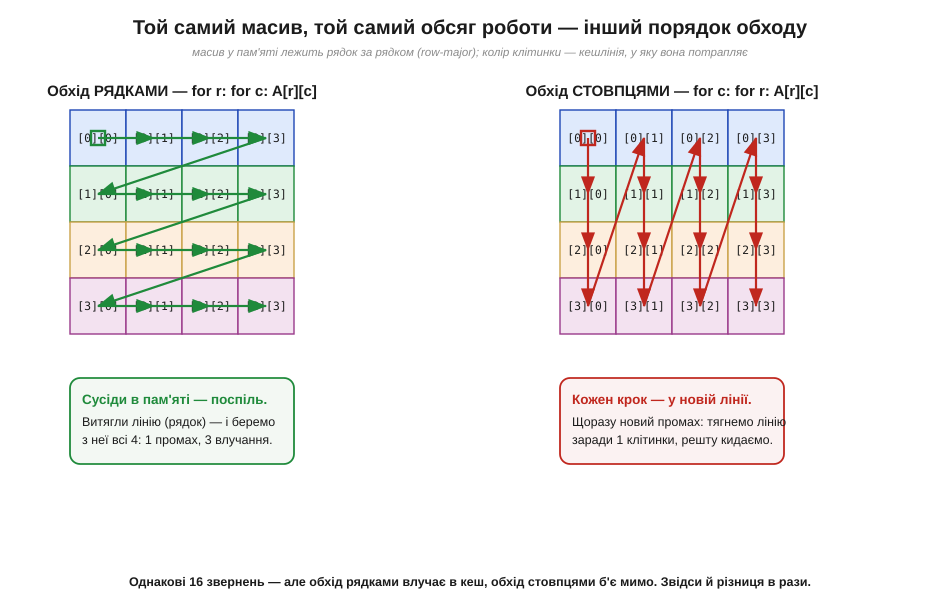
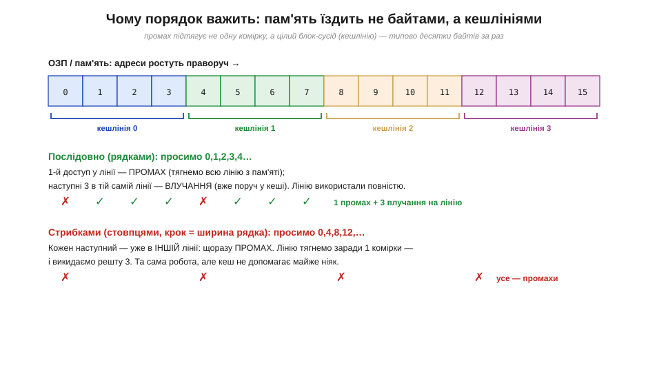
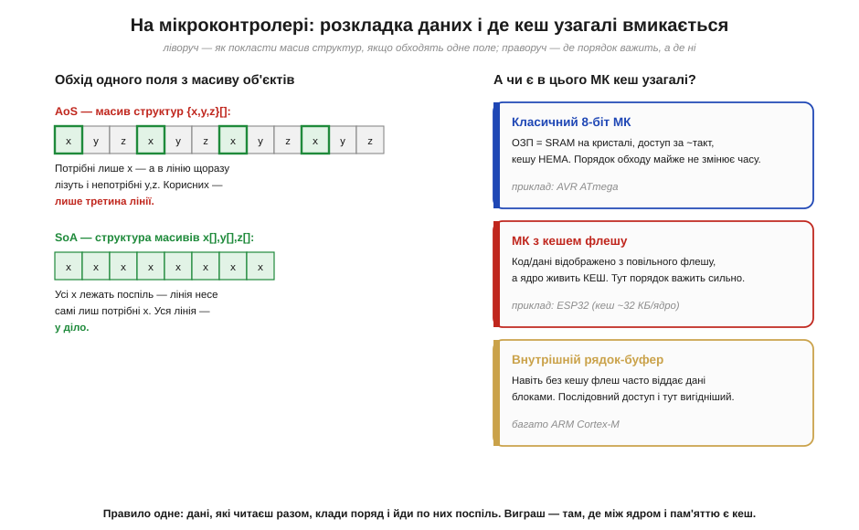

# 📜 Звідки взялася ідея кешу: «рабська пам'ять», локальність і стіна пам'яті

> Кеш — це маленька швидка схованка між ядром і повільною пам'яттю: вона тримає копії свіжовживаних слів, влучає, поки доступ передбачуваний, і так ховає від ядра повільність великої пам'яті. Тут — звідки взявся сам **прийом** покласти таку схованку між ядром і пам'яттю, і чому вона взагалі працює. Виявляється, і назву, і саму конструкцію придумали ще до того, як з'явився перший комерційний процесор із кешем, а пояснення, **чому** кеш не марнота, дав окремий, дуже несподіваний відкривач — і теж не наодинці. Корінням усе це впирається в той самий розрив швидкостей між ядром і пам'яттю, що його загострюють висока [тактова частота](book:programming/clock-frequency) й [конвеєр](book:programming/pipeline).

## Проблема, з якої все почалося: ядро мчить, пам'ять пасе задніх

Перш ніж шукати винахідника кешу, варто згадати, **яку** саме біду він лікує, бо без цього історія розсиплеться на дати. Корінь біди — у розриві швидкостей, який росте з [тактовою частотою](book:programming/clock-frequency): процесор із кожним роком прискорювався стрімкіше, ніж пам'ять, з якої він бере команди й дані. Логіка на кристалі дешевшала й коротшала, а от велика пам'ять лишалася і повільною, і далекою — сигналу треба збігати до неї й назад. Виходила прикра картина: швидке ядро здебільшого **простоює**, чекаючи на чергове слово з пам'яті, як гоночна машина, що застрягла в заторі. [Конвеєр](book:programming/pipeline) цю біду лише загострив: що швидше ядро ладне ковтати команди, то болючіше кожне очікування пам'яті.

Напрошувалося рішення, старе як світ: якщо по щось ходити далеко й часто, тримай **копію того, що береш найчастіше**, під рукою. Маленька пам'ять може бути дуже швидкою (її легко поставити поруч із логікою), а велика — мусить бути повільною; то чому б не покласти між ними **маленьку швидку** й не зберігати в ній свіжовживане? Думка проста на словах, та щоб вона запрацювала, бракувало двох речей: хтось мав **сконструювати** таку схованку, і хтось мав **довести**, що вона не порожня витівка, а справді влучає. Цими двома кроками й займалися різні люди в різні роки — почнімо з конструкції.

## Моріс Вілкс (1965): «рабська пам'ять» дістає ім'я

Перший чіткий опис кеша як **конструкції** дав британець **Моріс Вілкс** (*Maurice Wilkes*) — той самий, що збудував один із перших справжніх комп'ютерів EDSAC. У короткій, на дві сторінки, замітці «Slave Memories and Dynamic Storage Allocation» (*IEEE Transactions on Electronic Computers*, квітень 1965) він запропонував поставити між процесором і головною пам'яттю невелику швидку пам'ять, яка автоматично тримає копії слів, що ними процесор користувався **щойно**. Назвав він її «рабською пам'яттю» (*slave memory*) — термін, який сьогодні з очевидних причин не вживають; прижилося пізніше інше слово, **cache** (від французького «схованка»), яке закріпили вже інженери IBM.

Найважливіше у Вілксовій замітці — не назва, а **принцип автоматизму**, на якому кеш тримається й досі. Програмісту не треба нічого робити: схованка сама помічає, що слово взяли, сама кладе його копію, сама віддає її, якщо слово попросять знову. Видима [мова машини (ISA)](book:programming/isa) від цього не міняється ні на йоту — кеш живе **під** нею, як невидимий прискорювач. Це той самий улюблений хід усього розділу: зовнішній контракт лишається сталим, а **реалізацію** під ним інженер вільний робити швидшою. Вілкс лише чесно зауважив, що сам не перевіряв ідею на практиці, — це зробили інші.

І тут важлива чесна засторога проти міфу «один геній — один винахід». Вілкс у тій-таки замітці прямо **посилається на попередників**: ідею швидкої пам'яті-супутника він приписує **Дж. Скарроту** (*G. Scarrott*), а як приклад уже наявної конструкції називає машину **Atlas 2 (Titan)** з Кембриджа, де подібну пам'ять проєктували **Девід Вілер** (*David Wheeler*) і **Ніл Вайзмен** (*Neil Wiseman*). Тобто навіть «перша стаття про кеш» — це радше акуратне формулювання того, що вже носилося в повітрі британських лабораторій початку 1960-х. Вілкс дав думці ім'я та ясну форму; самá ж вона визрівала колективно.

## IBM System/360 Model 85 (1968): кеш виходить у серію

Від замітки до заліза, яке можна купити, минуло лише кілька років — і тут головну роль зіграла вже не одна людина, а інженерна команда **IBM**. Машина **System/360 Model 85**, оголошена 1968 року, стала **першим комерційним** комп'ютером зі справжнім кешем між процесором і пам'яттю; саме навколо неї IBM і ввела в широкий ужиток слово *cache* замість Вілксової «рабської пам'яті». Інженери (їхню роботу зазвичай згадують за прізвищем **Джона Ліптея**, *J. S. Liptay*, що описав кеш Model 85 у журналі IBM) показали річ, яка для нас тепер очевидна, а тоді була відкриттям: невеликий кеш на кілька десятків кілобайтів дає машині майже таку швидкодію, **наче** вся її пам'ять — швидка, хоча насправді швидка лише дрібка. Це й є практичне підтвердження Вілксової ідеї та пряма ілюстрація **влучання** — коли потрібне слово вже лежить у схованці й брати його з повільної пам'яті не доводиться.

Але чому маленька схованка раптом «вгадує» більшість звернень? Тут історія робить найцікавіший поворот: відповідь на це питання дав не той, хто будував кеш, а людина, що поралася зовсім з іншою задачею.

## Пітер Деннінг і Ласло Беладі (1966–1968): чому схованка взагалі влучає

Поки одні інженери ставили кеш у залізо, інші ламали голову над спорідненою загадкою у **великих машинах із віртуальною пам'яттю**: чому програма, якій начебто потрібна вся її пам'ять, насправді більшість часу тупцює в **малому** її клаптику? Систематично це сформулював молодий дослідник **Пітер Деннінг** (*Peter J. Denning*) у праці 1968 року, де він увів поняття **робочого набору** (*working set*) і чітко назвав явище, яке за ним стоїть, — **локальність звертань** (*locality of reference*). Це те саме, на чому тримається весь кеш: програма звертається не куди завгодно, а **купчиться** — і в часі (нещодавнє слово скоро знадобиться знову, *temporal locality*), і в просторі (сусіди свіжовзятого слова теж от-от знадобляться, *spatial locality*).

Деннінг сам наголошував, що не вигадав локальність на порожньому місці: поняття він **виводив, спираючись** на спостереження **Ласло Беладі** (*László Bélády*) з IBM, який ще 1966 року, вивчаючи, яку сторінку вигідно витісняти з пам'яті, виявив у реальних програмах ту саму схильність топтатися в малій ділянці. Знову, як і з Вілксом, маємо не самотнього генія, а **естафету**: Беладі помітив явище в експерименті з витісненням сторінок, Деннінг дав йому ім'я, міру (робочий набір) і пояснив, **чому** на ньому тримається вся ідея швидкої схованки. Без локальності кеш був би лотереєю; завдяки їй він майже завжди влучає — і саме тому Model 85 спрацював.

> 🔧 **Навіщо це.** Локальність — не абстракція з підручника, а важіль, яким ви щодня крутите швидкість свого коду. Кожна порада з ⚙️-частини нижче («іди по масиву поспіль», «клади поруч те, що читаєш разом») — це буквально **підіграш локальності**, відкритій Беладі і названій Деннінгом. За правилом «кеш любить передбачуваний доступ» стоїть саме їхнє відкриття: машина ставить на те, що ви триматиметеся купи, — то не обманюйте її ставку.

## «Стіна пам'яті» (1995): розрив, що дав кешу друге дихання

Минали десятиліття, кеш із дивовижі перетворився на буденну деталь будь-якого процесора — а проблема, заради якої його придумали, не зникла, а **загострилася**. У 1995 році **Вільям Вулф** (*Wm. A. Wulf*) і **Саллі Маккі** (*Sally A. McKee*) у короткій статті з промовистою назвою «Hitting the Memory Wall: Implications of the Obvious» дали цьому розриву ім'я, що прижилося, — **стіна пам'яті** (*memory wall*). Думка їхня була тверезо-неприємна: швидкість ядра й швидкість пам'яті ростуть **по-різному** (ядро — по крутішій експоненті), тож відрив між ними не просто є, а **зростає рік у рік**; і скільки кеша не став, частка часу, що ядро марнує на чекання пам'яті, рано чи пізно почне переважати.

Для нас із цієї історії — прямий практичний висновок, що веде просто в код. Якщо розрив швидкостей лише росте, то ціна **кожного промаху** кеша з роками не меншає, а більшає; отже, вартість недбалого, «стрибучого» доступу до пам'яті — тим відчутніша, чим сучасніше залізо. Кеш не скасовує стіну пам'яті — він лише ховає її, **поки ви тримаєтеся локальності**. Щойно код починає блукати пам'яттю абияк, стіна проступає крізь кеш у всю свою висоту, і та сама програма раптом повзе в рази повільніше. Як це виглядає на звичайнісінькому обході масиву — і як цьому зарадити кількома рядками — показує ⚙️-вставка далі.

Підсумок історії: кеш — не осяяння одинака, а спільна праця кількох ліній думки. Вілкс (спираючись на Скаррота, Вілера й Вайзмена) дав конструкцію й ім'я; команда IBM на Model 85 винесла її в серію й закріпила слово *cache*; Беладі і Деннінг пояснили **локальністю**, чому маленька схованка влучає; а Вулф і Маккі назвали **стіну пам'яті** — розрив, через який усе це лишається животрепетним і досі. Усе це за нас уже «знає» сам кеш — лишилося навчитися писати код, який із ним дружить.

---

# ⚙️ Код, дружній до кешу: чому порядок обходу масиву міняє швидкість у рази

> Кеш — це **властивість заліза**: маленька швидка схованка, що влучає, поки доступ передбачуваний. Тут — зворотний бік тієї самої медалі: як **ваш код** або підіграє кешу, або б'є мимо нього, навіть не міняючи жодної формули. Найяскравіше це видно на найбуденнішій операції — обході масиву: переставите два цикли місцями, обсяг обчислень той самий до байта, а програма стає в рази швидшою чи повільнішою. Розберімо, чому, і виведемо кілька простих правил для мікроконтролера.

## Задача

Маємо звичайний двовимірний масив (матрицю) `A` розміром `N × N` — скажімо, кадр із давача чи таблицю чисел — і простий намір: пройти **всі** його клітинки й щось із кожною зробити (додати, відфільтрувати, скласти суму). Обсяг роботи тут жорстко заданий: рівно `N²` звернень, по одному на клітинку, хоч як їх упорядкуй. Питання вставки вузьке й практичне: чи правда, що **порядок**, у якому ми обходимо клітинки, впливає на час, — і якщо так, то на скільки й чому. Відповідь, яка спершу дивує: на однаковій кількості звернень різниця в часі сягає **кількох разів** — і вся вона захована не в обчисленнях, а в тому, як доступ лягає на [кеш](book:programming/cache).

## Ідея

Щоб побачити корінь різниці, треба скласти докупи **дві** речі. Перша: двовимірний масив насправді лежить у пам'яті **плоско**, одним рядком за одним (так звана *row-major* розкладка, як у C). Тобто `A[0][0], A[0][1], …` — сусіди в пам'яті, а `A[0][0]` і `A[1][0]` — далеко одне від одного, через цілий рядок. Друга: кеш підтягує дані не по одному байту, а **цілими блоками-сусідами** — кешлініями (*cache line*). Один промах тягне з пам'яті відразу всю лінію — десятки сусідніх байтів.


*Масив лежить у пам'яті рядок за рядком; колір клітинки — кешлінія, у яку вона потрапляє. Ліворуч обхід **рядками** (`for r: for c`) іде вздовж того, як дані лежать у пам'яті: витягли лінію — і одразу беремо з неї всі клітинки (1 промах, далі влучання). Праворуч обхід **стовпцями** (`for c: for r`) на кожному кроці стрибає в нову лінію: щоразу промах, лінію тягнемо заради однієї клітинки й кидаємо. Звернень порівну — 16, а робота кеша протилежна.*

Складемо це разом — і все стає ясно. Якщо обходити масив **рядками**, у тому самому порядку, як він лежить, то перший доступ у рядку дає промах і тягне цілу лінію, а наступні кілька клітинок беруться вже **з кеша**, бо вони — сусіди в тій самій лінії. Якщо ж обходити **стовпцями**, кожен наступний доступ стрибає на цілий рядок далі, тобто майже завжди — у **нову** лінію: суцільні промахи, і кожну витягнуту лінію ми використовуємо лише на одну клітинку, а решту викидаємо, не торкнувшись. Тут і працює **просторова локальність**: рядковий обхід її береже, стовпцевий — топче.


*Пам'ять їздить блоками. Послідовний доступ (0,1,2,3,…): перший у лінії — промах, наступні три — влучання, лінію використано **повністю**. Стрибковий доступ із кроком у ширину рядка (0,4,8,…): кожен — у новій лінії, суцільні промахи, з кожної лінії в діло йде лише одна комірка. Звідси й береться різниця в рази на однаковій кількості звернень.*

Цей самий механізм лежить в основі поняття **кроку доступу** (*stride*) — відстані в пам'яті між двома послідовними зверненнями. Крок 1 (сусідні комірки) — найкращий випадок: дані течуть лінія за лінією, кеш встигає, ще й апаратний випереджальний читач (*prefetch*) часто підтягує наступну лінію наперед. Великий крок (стрибок через рядок, через структуру) — найгірший: кожне звернення в нову лінію, кеш не встигає нічим зарадити. Правило, отже, формулюється одним рядком: **іди по пам'яті поспіль, з найменшим кроком, яким дозволяє задача.**

## Псевдокод

Уся «оптимізація» тут зводиться до того, щоб **внутрішній** цикл біг уздовж того виміру, що лежить у пам'яті суцільно. Для row-major масиву це означає: зовнішній цикл — по рядках, внутрішній — по стовпцях.

```
# Кеш-дружній обхід: внутрішній цикл — уздовж рядка (так, як масив лежить)
for r in 0 .. N-1:          # зовнішній: рядок за рядком
    for c in 0 .. N-1:      # внутрішній: уздовж рядка — крок 1, сусідні комірки
        work(A[r][c])       # доступ поспіль → промах лише на межі лінії

# Кеш-ВОРОЖИЙ обхід: та сама робота, цикли переставлено
for c in 0 .. N-1:          # зовнішній: стовпець
    for r in 0 .. N-1:      # внутрішній: стрибаємо рядками — крок = N
        work(A[r][c])       # майже кожен доступ — новий промах
```

Різниця між двома фрагментами — порядок двох рядків `for`, і більше нічого: ті самі `N²` викликів `work`, ті самі індекси, той самий результат. Уся ціна — в тому, **яким кроком** внутрішній цикл біжить пам'яттю.

## Складність і пастки на МК

За класичною міркою алгоритмів **обидва** обходи однакові — O(N²) операцій, бо вона рахує **кількість** звернень і не бачить, що одне звернення в кеш і одне звернення в пам'ять коштують геть по-різному. Саме тут ця міра й оманлива: реальний час визначає не лише число звернень, а й **частка промахів**, а її задає порядок обходу. Тому два O(N²)-цикли на практиці різняться в рази — і ось на що зважати на мікроконтролері.


*Ліворуч: якщо обходять **одне** поле з масиву об'єктів, масив структур (AoS) тягне в лінію й непотрібні поля — корисна лише частка лінії; структура масивів (SoA) кладе однакові поля поспіль, і вся лінія йде в діло. Праворуч: чи є з цього зиск, залежить від заліза — на 8-бітному МК без кеша (доступ до SRAM ~такт) порядок майже не важить, а на МК із кешем флешу (як ESP32) важить сильно, як на ПК.*

- **Спершу спитай, чи є тут кеш узагалі.** Це найважливіша засторога, і вона рятує від хибних висновків. На класичному 8-бітному МК (AVR-клас) пам'ять даних — це SRAM на кристалі з доступом за ~такт, **кеша немає** взагалі: будь-яка комірка однаково близька, і порядок обходу майже не міняє часу. А от на потужнішому МК, де код і дані відображено з повільного зовнішнього флешу через **кеш** (ESP32-клас, кеш ~32 КБ на ядро), порядок важить так само сильно, як на великому процесорі. Тож «кеш-оптимізація» дає зиск там, де між ядром і пам'яттю **є** кеш; на найдрібніших МК її ефект близький до нуля — і це нормально.
- **Розкладка даних б'є порядок обходу.** Часто виграш не в тому, **як** обходити, а в тому, **як покласти** дані. Якщо ви регулярно проходите масив об'єктів і чіпаєте лише **одне** поле кожного (скажімо, лише `x` зі структур `{x, y, z}`), то «масив структур» (*array of structs*, AoS) щоразу тягне в лінію й непотрібні `y, z` — корисна лише третина лінії. Перекладіть у «структуру масивів» (*struct of arrays*, SoA) — окремий масив на кожне поле, — і всі потрібні `x` ляжуть поспіль, лінія йтиме повністю в діло. Це той самий принцип локальності, лише прикладений до **форми** даних.
- **Послідовний доступ — подарунок для prefetch.** Навіть там, де «справжнього» кеша немає, флеш-пам'ять часто віддає дані блоками (рядок-буфер, випереджальне читання), тож суцільний доступ виграє й тут. Висновок універсальний: лінійний прохід масиву — майже завжди найшвидший спосіб його обійти, і це ще один доказ зробити внутрішній цикл найдовшим і найпослідовнішим.
- **Не плутай це з «передчасною оптимізацією».** Переставити два цикли чи покласти дані суцільно — **безкоштовно**: ні рядком довше, ні на йоту складніше для читання. Це не хитра оптимізація, яку варто відкладати, а просто **гігієна** роботи з пам'яттю: за тих самих зусиль код або дружить із кешем, або ні. Складні трюки (ручне «нарізання» масиву на кеш-блоки, *blocking*) лишіть на потім і лише там, де профіль доведе потребу; а от обхід пам'яті поспіль варто робити **одразу** й завжди.

Висновок: [кеш](book:programming/cache) — це залізна **ставка на локальність**, відкриту ще Беладі і Деннінгом; ваш код цю ставку або підтримує, або руйнує, навіть не міняючи жодного обчислення. Іти по масиву **поспіль**, з найменшим кроком, і класти **поряд** те, що читаєте разом, — два правила, що нічого не коштують, а на залізі з кешем дають швидкість у рази. І урок тут той самий, лише з боку пам'яті: машина винагороджує **передбачуване, упорядковане** — і карає хаотичне.
