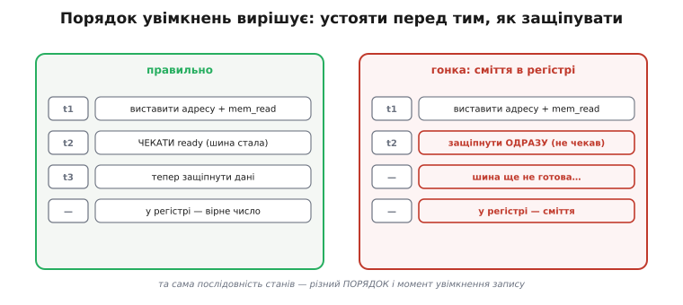

# ⚙️ Пристрій керування як автомат: розгортаємо один опкод у сигнали на кожен такт

> Один `switch` за опкодом видає **всі** сигнали разом — гарна модель декодера, але брехлива для реальної команди, що триває кілька тактів. Тут доводимо модель до чесного вигляду: пристрій керування як **послідовний автомат** (*finite-state machine*), який на кожному такті багатоциклової команди піднімає **свою** порцію керувальних ліній. Пройдемо `load` з пам'яті рядок за рядком: виставити адресу → **чекати** повільну пам'ять → порахувати → записати. Заразом побачимо дві пастки, на яких гине саме такий код: гонку з неготовою шиною та хибний порядок увімкнень.

## Задача

Комбінаційний декодер — той, що з опкоду миттєво дістає набір сигналів, — розв'язує лише половину задачі. Він відповідає на питання **«що це за команда»**. Але щойно команда торкається пам'яті, спливає друге пит, на яке `switch` не відповідає: **«у якому порядку і за скільки тактів це зробити»**.

Візьмімо найпростішу команду з доступом до пам'яті — `load`: «привези число за адресою й поклади в регістр». Її фізично **неможливо** виконати за один такт. Спершу процесор мусить виставити адресу на шину й підняти лінію «читаю» — і на цьому такт закінчується, бо пам'ять повільна: вона не віддасть число тієї ж миті. Наступний такт (а може, кілька) процесор просто **чекає**, поки пам'ять покаже «дані готові». Аж тоді, третім чи п'ятим тактом, число можна защіпнути в регістр. Три-чотири різні моменти, у кожного — своя комбінація ліній, і жоден не можна переставити.

Отже, реальна задача пристрою керування ширша за декодування. Треба модель, яка з **одного** опкоду `load` розгортає **послідовність** порцій сигналів — по одній на такт — і сама вирішує, коли команда завершена, а коли треба ще почекати пам'ять. Це вже не таблиця «біти → сигнали», а **автомат**: у нього є пам'ять поточної стадії, і на кожному такті він робить крок уперед, дивлячись і на опкод, і на стан пам'яті.

> 🔧 **Навіщо це.** Ти зустрічаєш цю саму логіку щоразу, коли мікроконтролер звертається до повільної зовнішньої пам'яті чи периферії. Регістр `WAIT_STATES` у контролері флешу, поле `latency` у налаштуванні SDRAM, «такти очікування» в даташиті — це все та сама петля чекання з нашого автомата, тільки винесена в апаратуру. Зрозумівши модель у коді, ти читатимеш ці налаштування не як магію, а як прямий вибір «скільки тактів автомат мусить крутитися, поки пам'ять не встигне».

## Ідея

Ключ — **розділити дві ролі, які плутає наївний `switch`**. Перша роль: за опкодом визначити **план** команди — які взагалі стадії їй потрібні. У `load` план такий: {виставити-адресу, читати, записати}. У простого регістрового `add` план коротший: {порахувати, записати} — пам'ять не чіпаємо взагалі. Друга роль: **проживати** цей план по одній стадії за такт, і на кожній стадії піднімати рівно ті лінії, що потрібні саме їй.

Тобто автомат має **явний стан** — номер поточної стадії. На кожен імпульс [такту](book:electronics/clock-signal) він робить одну крок-функцію: «дивлюся, у якій я стадії й що за опкод → виставляю сигнали цієї стадії → вирішую, яка стадія наступна». Наступна стадія — не завжди «просто +1»: на стадії читання, якщо пам'ять ще не готова, наступна стадія — **та сама** (лишаємося чекати). Ось звідки береться змінна тривалість команди: автомат крутиться в стадії READ рівно стільки тактів, скільки пам'ять змушує його чекати.


*`load` як [автомат станів](book:electronics/finite-state-machines). Опкод заводить автомат у стан **ADDR** (виставити адресу, підняти mem_read). Далі **READ** — і тут ключове: доки лінія `ready` від пам'яті дорівнює 0, автомат переходить сам у себе, з'їдаючи по такту чекання; щойно `ready=1`, іде в **CALC**, тоді в **WRITE** (защіпнути), а звідти — по нову команду. Число тактів `load` не фіксоване: воно дорівнює довжині плану плюс скільки автомат прокрутився в READ. Регістровий `add` цих станів пам'яті не має взагалі — його план коротший.*

Це і є місток від комбінаційного декодера до секвенсера. Декодер (той самий `switch`) нікуди не зникає — він тепер відповідає лише на «що за команда» й задає **план**. А зверху над ним сидить крихітний [лічильник стадій](book:electronics/counters), який жене команду планом такт за тактом. Разом вони й утворюють повний пристрій керування: перше — комбінаційне, друге — послідовне.

## Робочий C: автомат пристрою керування

Зберемо модель, яку можна скомпілювати й покроково прогнати. Це реальний C у стилі прошивки: жодних `class`, жодних алокацій, усе — прості типи й статичні таблиці, як воно й буває на мікроконтролері. Модель діє над невеликим «датапатом» (регістри, АЛП, шина до пам'яті), а сам пристрій керування — це структура стану плюс одна крок-функція, яку ми звемо на кожен такт.

### Крок 1. Керувальні сигнали й датапат

Спершу — **що саме** автомат вмикає. Це структура `Control`: по одному полю на керувальну лінію. Різниця з наївною моделлю власника в тому, що тепер ця структура — **сигнали одного такту**, а не всієї команди. Наступного такту вона буде іншою.

```c
#include <stdint.h>
#include <stdbool.h>
#include <stdio.h>

// Сигнали керування — набір ліній НА ОДИН ТАКТ.
// Кожне поле — окремий "дріт": що вмикаємо саме цього такту.
typedef struct {
    bool     addr_out;   // виставити адресу на шину
    bool     mem_read;   // лінія шини "читаю"
    bool     mem_write;  // лінія шини "пишу"
    bool     alu_enable; // подати операнди на АЛП і взяти результат
    uint8_t  alu_op;     // яку операцію ввімкнути в АЛП
    bool     reg_write;  // защіпнути результат/дані у регістр призначення
    uint8_t  reg_dst;    // куди защіпувати
    uint8_t  reg_a;      // операнди для АЛП / регістр-джерело адреси
} Control;

enum { ALU_ADD, ALU_SUB, ALU_PASS };   // операції АЛП
```

Тепер — «залізо», яким автомат диригує. Датапат тримає регістри, шину адреси/даних і, головне, **лінію `ready` від пам'яті** — той сигнал, задля якого автомат узагалі мусить уміти чекати. Пам'ять тут — навмисно повільна модель: вона віддає число не одразу, а лише через кілька тактів після запиту.

```c
#define NREG 16
#define MEMSZ 256

typedef struct {
    uint16_t reg[NREG];      // регістри загального призначення
    uint8_t  mem[MEMSZ];     // "повільна" пам'ять

    uint16_t addr_bus;       // що зараз на шині адреси
    uint16_t data_bus;       // що зараз на шині даних
    bool     mem_ready;      // пам'ять підняла "дані готові"

    // модель повільної пам'яті: скільки тактів ще "їхати" до відповіді
    int      mem_countdown;
} Datapath;
```

> 🔧 **Навіщо це.** Лінія `mem_ready` — не вигадка моделі. У реальному процесорі це фізичний вхід (у 6502 його звали `RDY`, у багатьох MCU-шинах — `WAIT`/`READY`): повільний пристрій утримує його низьким, і процесор **завмирає** зайвий такт, доки той не відпустить. Це апаратне джерело «wait state», який ти потім бачиш у налаштуваннях флешу чи зовнішньої шини. Наш автомат моделює саме цей рукостиск.

### Крок 2. Стадії й декодер плану

Стадії — це `enum`. Їх небагато, і вони — не самі команди, а **фази виконання будь-якої команди**. `S_FETCH` спільна для всіх (привезти команду в IR); далі шляхи розходяться залежно від опкоду.

```c
// Стадії автомата — фази виконання, спільний "кістяк" для всіх команд.
typedef enum {
    S_FETCH,       // привезти команду в IR, підготувати декод
    S_DECODE,      // розкласти опкод, обрати гілку
    S_ADDR,        // (load/store) виставити адресу на шину
    S_READ,        // (load) чекати й прийняти дані з пам'яті
    S_CALC,        // (add/sub) порахувати в АЛП
    S_WRITE_REG,   // защіпнути результат/дані у регістр
    S_WRITE_MEM,   // (store) віддати дані в пам'ять
    S_DONE         // команда завершена → назад у FETCH
} Stage;
```

Стан самого пристрою керування — компактний: поточна стадія, регістр команд `IR` і розкладені поля операндів (щоб не декодувати їх щоразу).

```c
typedef struct {
    Stage    stage;    // де ми в житті поточної команди
    uint16_t ir;       // регістр команд
    uint16_t pc;       // лічильник команд
    uint8_t  op, dst, a, b;   // розкладені поля команди
} ControlUnit;

enum { OP_ADD = 0x1, OP_SUB = 0x2, OP_LOAD = 0x3, OP_STORE = 0x4 };
```

Ось той самий комбінаційний декодер, що й у наївній моделі, — але тепер його робота вужча й чесніша: він лише **розкладає біти на поля**. Він більше не бреше, ніби видає всі сигнали команди відразу; він готує ґрунт, а порядок і такти візьме на себе автомат.

```c
// Комбінаційна частина: з числа-команди дістаємо поля. Нічого більше.
static void decode_fields(ControlUnit *cu) {
    cu->op  = (cu->ir >> 12) & 0xF;   // опкод — старші 4 біти
    cu->dst = (cu->ir >>  8) & 0xF;   // регістр призначення
    cu->a   = (cu->ir >>  4) & 0xF;   // операнд A / регістр-адреса
    cu->b   =  cu->ir        & 0xF;   // операнд B
}
```

### Крок 3. Крок-функція автомата — серце моделі

Тепер головне. `cu_step()` — це **один такт**. Її звуть з циклу тактів; вона дивиться на поточну стадію, виставляє сигнали цієї стадії, штовхає датапат і **обирає наступну стадію**. Уся послідовність «адреса → чекати → рахувати → писати» живе саме тут, у переходах між `case`.

Зверни увагу на дві речі, заради яких усе й затівалося. По-перше, стадія `S_READ` **не завжди** переходить далі: якщо `mem_ready` ще 0, вона лишає стадію тією самою — це вставлений такт чекання. По-друге, кожен `case` піднімає **лише свої** лінії: жодна стадія не вмикає нічого зайвого, і саме тому порядок увімкнень строгий.

```c
// Один такт роботи пристрою керування.
// Повертає сигнали, ВИСТАВЛЕНІ цього такту (зручно для трасування/тестів).
Control cu_step(ControlUnit *cu, Datapath *dp) {
    Control c = {0};   // усі лінії спершу опущені — це важливо (див. пастки)

    switch (cu->stage) {

    case S_FETCH:
        // Привезти команду за PC у IR. (Модель: пам'ять команд миттєва.)
        cu->ir = ((uint16_t)dp->mem[cu->pc] << 8) | dp->mem[cu->pc + 1];
        cu->pc += 2;
        cu->stage = S_DECODE;
        break;

    case S_DECODE:
        decode_fields(cu);                 // розкласти опкод і поля
        switch (cu->op) {                  // обрати ПЛАН за опкодом
        case OP_ADD:
        case OP_SUB:   cu->stage = S_CALC;       break;  // регістрова: одразу рахуємо
        case OP_LOAD:  cu->stage = S_ADDR;       break;  // з пам'яті: спершу адреса
        case OP_STORE: cu->stage = S_ADDR;       break;
        default:       cu->stage = S_DONE;       break;  // невідома → нічого не робимо
        }
        break;

    case S_ADDR:
        // Виставити адресу з регістра a на шину й підняти потрібну лінію шини.
        c.addr_out = true;
        c.reg_a    = cu->a;
        dp->addr_bus = dp->reg[cu->a];
        if (cu->op == OP_LOAD)  c.mem_read  = true;
        else                    c.mem_write = true;
        mem_start(dp);                     // "завести" повільну пам'ять
        cu->stage = (cu->op == OP_LOAD) ? S_READ : S_WRITE_MEM;
        break;

    case S_READ:
        // Тримаємо read і ЧЕКАЄМО. Поки пам'ять не готова — лишаємось тут.
        c.mem_read = true;                 // лінію треба ТРИМАТИ весь час чекання
        if (!dp->mem_ready) {
            // пам'ять ще їде: цей такт — такт чекання, стадію НЕ міняємо
            break;
        }
        // ready=1: дані вже на шині — приймаємо їх
        c.reg_write = true;
        c.reg_dst   = cu->dst;
        dp->reg[cu->dst] = dp->data_bus;
        cu->stage = S_DONE;
        break;

    case S_CALC:
        // Порахувати в АЛП; результат защіпнемо НАСТУПНИМ тактом.
        c.alu_enable = true;
        c.reg_a = cu->a; c.reg_b = cu->b;
        c.alu_op = (cu->op == OP_ADD) ? ALU_ADD : ALU_SUB;
        dp->data_bus = (cu->op == OP_ADD)
                     ? (uint16_t)(dp->reg[cu->a] + dp->reg[cu->b])
                     : (uint16_t)(dp->reg[cu->a] - dp->reg[cu->b]);
        cu->stage = S_WRITE_REG;
        break;

    case S_WRITE_REG:
        c.reg_write = true;
        c.reg_dst   = cu->dst;
        dp->reg[cu->dst] = dp->data_bus;
        cu->stage = S_DONE;
        break;

    case S_WRITE_MEM:
        c.mem_write = true;                // тримаємо write під час чекання
        if (!dp->mem_ready) break;         // так само чекаємо готовності
        dp->mem[dp->addr_bus] = (uint8_t)dp->reg[cu->dst];
        cu->stage = S_DONE;
        break;

    case S_DONE:
        cu->stage = S_FETCH;               // команда завершена → нова
        break;
    }

    return c;
}
```

Модель повільної пам'яті — окремо, щоб автомат був чистий. `mem_start()` заводить зворотний відлік; кожен такт `mem_tick()` наближає готовність, і коли відлік добіг нуля — виставляє дані на шину й піднімає `mem_ready`.

```c
#define MEM_LATENCY 3     // пам'ять "їде" 3 такти після запиту

static void mem_start(Datapath *dp) {
    dp->mem_ready    = false;
    dp->mem_countdown = MEM_LATENCY;
}

// Викликається РАЗ на такт, синхронно з cu_step (модель тактованої шини).
static void mem_tick(Datapath *dp) {
    if (dp->mem_countdown > 0) {
        dp->mem_countdown--;
        if (dp->mem_countdown == 0) {
            // дані "доїхали": кладемо на шину й піднімаємо ready
            dp->data_bus  = dp->mem[dp->addr_bus];
            dp->mem_ready = true;
        }
    }
}
```

### Крок 4. Цикл тактів — зшиваємо все докупи

Автомат сам по собі мертвий; його оживляє [такт](book:electronics/clock-signal). Ось цикл, що б'є тактами: кожен такт спершу просуває пам'ять (`mem_tick`), потім робить крок керування (`cu_step`), і трасує, які лінії піднялися. Порядок «спершу пам'ять, потім керування» відповідає тому, як у залізі сигнали, виставлені минулого такту, встигають устоятися до фронту нового.

```c
static const char *stage_name(Stage s) {
    static const char *n[] = {"FETCH","DECODE","ADDR","READ",
                              "CALC","WRITE_REG","WRITE_MEM","DONE"};
    return n[s];
}

// Прогнати одну команду до кінця, друкуючи, що робиться кожного такту.
void run_one_instruction(ControlUnit *cu, Datapath *dp) {
    int tick = 0;
    do {
        mem_tick(dp);                   // пам'ять просувається
        Stage before = cu->stage;
        Control c = cu_step(cu, dp);    // крок автомата
        printf("такт %2d | стадія %-9s | rd=%d wr=%d alu=%d regW=%d ready=%d\n",
               tick++, stage_name(before),
               c.mem_read, c.mem_write, c.alu_enable, c.reg_write, dp->mem_ready);
    } while (cu->stage != S_FETCH);     // поки команда не завершилась
}
```

### Крок 5. Прогін: як `load` розгортається в такти

Заповнимо пам'ять однією командою `load R5, [R2]` (опкод `0x3`, dst=5, адреса-регістр=2) і покладемо в комірку за адресою R2 число 42. Тоді запустимо.

**Умова.** `IR = 0x3520` (op=3 LOAD, dst=5, a=2). У `R2` лежить адреса 100; у `mem[100]` — число 42. Пам'ять їде `MEM_LATENCY = 3` такти. Що надрукує трасування:

```
такт  0 | стадія FETCH     | rd=0 wr=0 alu=0 regW=0 ready=0
такт  1 | стадія DECODE    | rd=0 wr=0 alu=0 regW=0 ready=0
такт  2 | стадія ADDR      | rd=1 wr=0 alu=0 regW=0 ready=0   ← адреса на шину, read=1, пам'ять заведена
такт  3 | стадія READ      | rd=1 wr=0 alu=0 regW=0 ready=0   ← чекаємо (countdown 3→2)
такт  4 | стадія READ      | rd=1 wr=0 alu=0 regW=0 ready=0   ← чекаємо (countdown 2→1)
такт  5 | стадія READ      | rd=1 wr=0 alu=0 regW=1 ready=1   ← ready! дані на шині, защіпуємо R5=42
такт  6 | стадія DONE      | rd=0 wr=0 alu=0 regW=0 ready=1
```

Прочитаймо цю таблицю як розповідь. Перші два такти — спільний кістяк: привезли команду, розклали опкод. Такт 2 — автомат зайшов у гілку `load`: виставив адресу, підняв `read`, завів пам'ять. Такти 3 і 4 — **чиста плата за повільність пам'яті**: стадія READ повторюється, `read` тримається піднятим, але записувати нема чого — `ready` ще 0. Такт 5 — пам'ять доїхала, `ready` спалахнув, і **того ж такту** автомат защіпнув 42 в R5. Такт 6 — прибирання.

Головний висновок видно очима: **одна команда — сім тактів, і три з них автомат просто чекав**. Заміни повільну пам'ять на швидшу (`MEM_LATENCY = 1`) — і тих порожніх READ-тактів поменшає; це буквально те, що робить регістр «wait states» у реальному контролері. А регістровий `add`, що пам'яті не торкається, пройшов би FETCH → DECODE → CALC → WRITE_REG → DONE без жодного чекання. Різна довжина команд — не випадковість, а прямий наслідок того, скільки стадій має план і скільки тактів автомат прокрутився в чеканні.

## Складність і пастки

Наївний `switch` — це кілька рядків, які «просто працюють». Автомат складніший рівно настільки, наскільки складніша сама реальність: у нього є **стан між тактами**, а стан — це завжди нове джерело помилок. Три пастки тут не абстрактні: на них справді спотикаються, пишучи секвенсери й драйвери зовнішньої шини.

### Пастка 1. Гонка з повільною пам'яттю: защіпнути раніше за `ready`

Найпідступніша помилка — прийняти дані з шини, **не дочекавшись** `ready`. Спокуса є: якщо в наївній моделі `load` защіпував регістр «одразу», рука сама пише те саме тут. Але шина ще порожня — пам'ять не доїхала, — і в регістр падає **сміття**: старе значення шини, половина попередньої транзакції, шум. Гірше за явну поломку те, що на **швидкій** пам'яті (латентність 0–1) така помилка може випадково спрацьовувати правильно, а на повільній — плавати. Це класичний недетермінований баг, що «то є, то нема».

Ось як виглядає зламана стадія READ поряд із правильною:

```c
// ХИБНО: защіпуємо, не глянувши на ready — ловимо сміття з неготової шини.
case S_READ:
    c.reg_write = true;                 // ← увімкнули запис БЕЗУМОВНО
    c.reg_dst   = cu->dst;
    dp->reg[cu->dst] = dp->data_bus;    // data_bus ще не оновлена!
    cu->stage = S_DONE;
    break;

// ПРАВИЛЬНО: тримаємо read і чекаємо; защіпуємо ЛИШЕ коли ready=1.
case S_READ:
    c.mem_read = true;
    if (!dp->mem_ready) break;          // ← петля чекання: ще не готово — стоїмо
    c.reg_write = true;
    c.reg_dst   = cu->dst;
    dp->reg[cu->dst] = dp->data_bus;
    cu->stage = S_DONE;
    break;
```

Різниця — один рядок `if (!dp->mem_ready) break;`, і саме він перетворює жорсткий «встиг-не-встиг» на надійний рукостиск. Правило універсальне: **на будь-яку транзакцію з асинхронним пристроєм автомат мусить мати стадію чекання його готовності**, а не покладатися на те, що «зазвичай встигає».


*Та сама стадія READ — два результати. Ліворуч: t1 виставив адресу й read, t2 **чекає** `ready` (шина стала), t3 защіпує — у регістрі вірне 42. Праворуч: t2 защіпує **одразу**, не чекавши, — шина ще не готова, і в регістр падає сміття. Код відрізняється однією умовою `if (!ready) break;`. На швидкій пам'яті хибна доріжка може випадково «працювати», на повільній — плаває; тому баг такий підступний.*

### Пастка 2. Забути тримати лінію під час чекання

Другий бік тієї ж медалі. Лінію `mem_read` (чи `mem_write`) треба **тримати піднятою весь час, поки автомат чекає** — на кожному такті стадії READ, а не лише коли її вперше виставили. Пам'ять читає стан ліній щотакту; варто відпустити `read` посеред чекання — і транзакція обірветься, `ready` не прийде ніколи, автомат зависне в READ назавжди.

У нашому коді це забезпечено тим, що `c = {0}` на початку кожного такту **скидає** всі лінії, а стадія READ **щоразу заново** ставить `c.mem_read = true`. Якби ми виставили `read` лише в стадії ADDR і покладалися, що воно «саме тримається», — на першому ж такті READ воно б обнулилося. Звідси загальне правило моделі: **сигнали живуть один такт**; усе, що має триматися довше, стадія мусить піднімати наново щотакту.

```c
// Небезпечний антипатерн: виставили read лише раз, у ADDR,
// а в READ покладаємось, що воно "саме тримається". НЕ тримається:
// наступний cu_step почне з c = {0}, і read впаде до появи ready.
//   → пам'ять бачить read=0, транзакцію скасовано, ready ніколи не прийде,
//     автомат вічно крутиться в S_READ. Класичний "завис на доступі".
```

### Пастка 3. Хибний порядок увімкнень усередині такту

Навіть коли стадії правильні, лишається питання **порядку** увімкнень і того, **на якому такті** защіпувати. Правило заліза: сигнал-джерело (адреса, дані на шині, вибір операції в АЛП) має **устоятися раніше**, ніж спрацює защіпка, що його ловить. У межах одного такту це означає: не можна одночасно «порахувати в АЛП» і «защіпнути результат» — защіпка вхопить ще не усталений вихід. Тому в моделі `add` рахує в стадії `S_CALC`, а защіпує **наступним** тактом у `S_WRITE_REG`: між ними проходить фронт такту, за який результат АЛП устигає стати на шину.

Це не педантизм. Якби ми злили CALC і WRITE_REG в один `case` («порахував і тут же поклав»), у моделі-на-C воно б спрацювало (бо C рахує рядки послідовно), але **збрехало б про залізо**: у справжньому процесорі так з'явився б *setup/hold*-збій — защіпка хапає значення до того, як воно усталилось. Модель має відбивати такти чесно, інакше з неї не можна оцінити ні швидкодію, ні коректність.

Той самий принцип диктує порядок і в `store`: спершу виставити адресу **й** дані на шину, дати їм устоятися, і лише тоді підняти `mem_write`. Піднімеш `write` раніше, ніж дані стали на шину, — запишеш у пам'ять недопечене значення. Загальне правило: **спершу джерела, потім защіпка/строб; між виставленням і фіксацією — фронт такту**.

> 🔧 **Навіщо це.** Рівно ці граблі виповзають, коли власноруч ганяєш зовнішню шину — паралельний дисплей, статичну RAM, регістр-засувку на GPIO. Порядок «виставив адресу/дані → витримав → стробнув» і «тримай сигнал весь час доступу» — це не теорія, а те, що доводиться писати руками, коли периферія висить на ніжках без апаратного контролера шини. Автомат із цієї статті — точний скелет такого драйвера.

### Чому автомат, а не просто довший `switch`

Можна спитати: навіщо явний `enum` стадій — чому б не розкрутити `load` у чотири виклики поспіль усередині одного `case`? Тому що тоді **зникає стан між тактами**, а він тут суть справи. Автомат потрібен саме там, де тривалість кроку **невідома наперед**: скільки тактів чекати `ready` — вирішує пам'ять, не код. Явна стадія з петлею «лишитися, поки не готово» — єдиний чесний спосіб це виразити. Довгий лінійний `switch` описав би лише випадок, коли пам'ять завжди встигає за фіксоване число тактів, — а це та сама пастка 1, тільки замаскована.

Крім того, стадії роблять автомат **розширюваним нічого не ламаючи**: нову команду додаєш, дописавши гілку в `S_DECODE` (який план) і, за потреби, одну-дві стадії; наявні команди не чіпаються. Це і є та гнучкість, за яку в складних процесорах платять [мікропрограмою](book:programming/microcode) — вона доводить ту саму ідею до краю, зберігаючи «план кожної команди» не в `switch`, а у вигляді таблиці рядків у пам'яті. Наш `enum`-автомат — її зашитий [«вручну спаяний»](book:programming/control-unit-design) родич: та сама послідовність стадій, тільки виражена гілками коду, а не вмістом [control store](book:programming/control-unit-design).

Підсумок простий. Комбінаційний декодер відповідає «що за команда» — це `switch` за опкодом, який задає **план**. Автомат стадій відповідає «в якому порядку й за скільки тактів» — це `enum` поточної фази плюс крок-функція, яку жене такт. Разом вони розгортають один опкод `load` у чесну послідовність порцій сигналів: адреса → **чекати рівно стільки, скільки треба пам'яті** → защіпнути. А три пастки — гонка з неготовою шиною, відпущена посеред чекання лінія, злиті в один такт «порахувати й защіпнути» — це не окремі казуси, а три грані одного правила: **у послідовному автоматі сигнали живуть тактами, і порядок тактів священний**.
