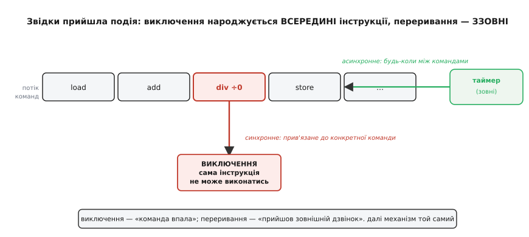
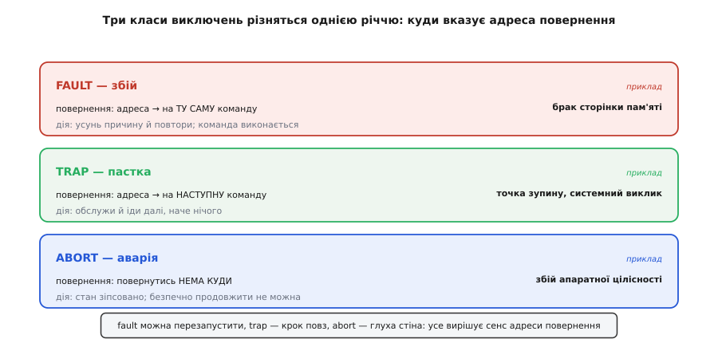
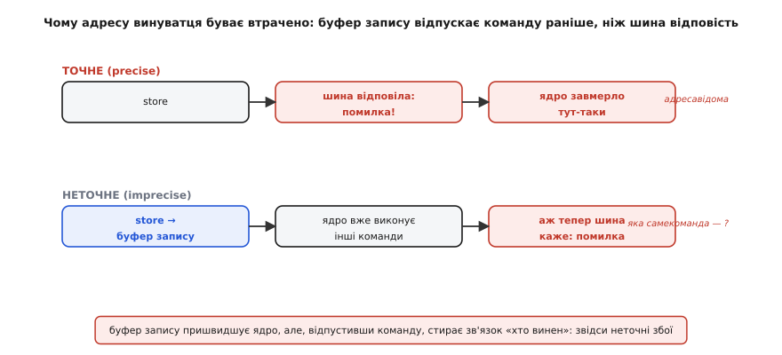

# Обробка виключень у процесорі

Процесор виконує команди наосліп: узяв інструкцію, зробив, узяв наступну. Він не «розуміє» програму — просто крутить один і той самий цикл на шаленій швидкості. І ось посеред цього безжального конвеєра трапляється те, чого зробити **неможливо**: команда ділить на нуль, звертається за адресою, якої немає, намагається виконати байти, що не є жодним кодом операції. Що робити ядру? Виконати команду воно не може — правила арифметики й адресації цього не дозволяють. Мовчки збрехати результатом — небезпечно: далі порахується казна-що. Спинитися назавжди — теж погано, бо тоді один зіпсований байт даних вішає всю машину.

Потрібен третій шлях: спосіб **посеред виконання зупинитись, покликати спеціальний код по допомогу й, можливо, повернутися далі**. Саме це і є **виключення** (англ. *exception* — «виняток», те, що випадає з нормального ходу). Процесор сам ловить неможливу ситуацію, відкладає поточну роботу й передає керування наперед призначеному обробникові. Це вбудований у залізо механізм «стоп, тут щось не так — розберися».

> 🔧 **Навіщо це.** Без виключень будь-яка помилка в даних була б фатальною для всієї машини: одне ділення на нуль — і або зависання, або тихо зіпсований результат, що поповзе далі. Виключення перетворюють «неможливе» на **подію, яку можна обробити**: записати діагноз, перезапустити модуль, перейти в безпечний стан. Уся дисципліна надійного коду — від операційних систем до прошивки дрона — стоїть на тому, що процесор не мовчить, коли натрапляє на стіну, а голосно про це сигналить.

### Синхронне проти асинхронного: звідки прийшла подія

Виключення легко сплутати з [перериванням](topic:programming/interrupts): і те, й те раптово зупиняє основний код і кличе обробник. Механіка справді майже однакова. Але причина — протилежна, і ця різниця визначає геть усе.

> 🔧 **Навіщо це.** Переривання (англ. *interrupt* — «переривати») — це коли зовнішня подія миттєво кличе процесор, той виконує короткий обробник і вертається до перерваної роботи. Тут досить пам'ятати одне: переривання приходить **ззовні** ядра (від таймера, ніжки, порту) й **не пов'язане** з тим, яку саме команду процесор виконував тієї миті.

Переривання **асинхронне** (гр. *a-* — «не», *syn-chronos* — «одночасний»): воно приходить ззовні, і йому байдуже, що ядро робило цієї секунди. Таймер добіг до нуля, натиснули кнопку, надійшов байт по радіо — подія прилетіла з зовнішнього світу й може влучити в проміжок між **будь-якими** двома командами.

Виключення ж **синхронне**: воно народжується **всередині самого потоку команд**, як прямий наслідок конкретної інструкції. Не «десь трапилось» — а «**оця** команда не може виконатись». Ділення на нуль спричиняє саме та команда ділення; заборонений доступ до пам'яті — саме та команда читання. Прибери цю команду — не буде й виключення. Через це виключення завжди можна прив'язати до точного місця в програмі, а переривання — ні.


*Виключення прив'язане до конкретної команди (тут — ділення на нуль): прибери її — зникне й воно. Переривання прилітає збоку, від таймера, і може влучити між будь-якими командами. Причина різна, а далі механізм той самий: зберегти стан, стрибнути в обробник, повернутися.*

Ця пара «синхронне / асинхронне» — головна вісь усієї теми. Далі ми говоримо саме про синхронну половину: події, які ядро **само породжує**, виявивши, що виконати команду не виходить.

### Три класи: усе вирішує адреса повернення

Не всі виключення однакові. Одні означають «спробуй ще раз», інші — «іди далі», треті — «далі йти нема куди». Зручно розкласти їх на три класи, і межа між ними напрочуд конкретна: **куди після обробника вказує адреса повернення**. Ця класифікація йде від класичних архітектур (її фіксують і посібники Intel, і підручники з систем) і лишається універсальною.


*Fault вертає на ту саму команду (усунь причину — і вона виконається), trap вертає на наступну (обслужив — іди далі), abort не вертає нікуди (стан зіпсовано). Одна деталь — сенс адреси повернення — задає всю поведінку класу.*

**Збій** (англ. *fault*) — це виключення, після якого команду можна **повторити**. Адреса повернення вказує назад **на ту саму** інструкцію, що спричинила збій. Логіка проста: обробник усуває перешкоду, керування вертається на винну команду — і тепер вона виконується успішно, наче нічого й не було. Канонічний приклад — брак сторінки пам'яті (англ. *page fault*): програма звернулась до сторінки, якої немає у фізичній пам'яті; обробник підвантажує її з диска, вертає керування на ту саму команду доступу — і цього разу сторінка на місці. Саме тому збій називають **відновлюваним**: причина усувна, команда повторна.

**Пастка** (англ. *trap* — «пастка, капкан») — виключення, після якого йдуть **далі**. Адреса повернення вказує на **наступну** команду. Пастка — це не аварія, а **навмисно** влаштована зупинка. Найважливіші приклади — системний виклик (програма свідомо «спотикається», щоб покликати операційну систему) і точка зупину відлагоджувача (спеціальна команда, що передає керування дебагеру). Тут повторювати нічого: команда зробила своє (перемкнула нас у ядро чи в дебагер), обробник відпрацював — і виконання спокійно триває з наступної команди.

**Аварія** (англ. *abort* — «переривати, скасовувати») — найважчий клас: повернутися **нема куди**. Це наслідок серйозної поломки, коли ядро вже не може вірогідно сказати, на якій команді все сталося й чи не зіпсовано стан. Продовжувати небезпечно — обробник аварії зазвичай лише фіксує, що зміг, і веде систему до перезапуску чи безпечного стану. Аварія — це глуха стіна, а не «спробуй ще».

Тобто весь поділ тримається на одній тонкій різниці: **чи має сенс повертатися, і якщо так — куди**. Fault каже «поверни на місце й повтори», trap — «крок повз», abort — «повертатись нікуди». Тримаючи в голові цю вісь, будь-яке конкретне виключення легко покласти на потрібну полицю.

### Механізм: те саме залізо, інший спусковий гачок

А як усе це відбувається технічно? Тут гарна новина: процесор **не заводить окрему машинерію** для виключень. Він користається рівно тим самим апаратом, що й для переривань, — [вектором і збереженням контексту](topic:programming/interrupt-vector). Різниця лише в тому, **хто натиснув на гачок**: для переривання — зовнішній сигнал, для виключення — сам процесор, який щойно виявив неможливу дію.

> 🔧 **Навіщо це.** Вектор — це таблиця «номер події → адреса її обробника», а збереження контексту — знімок регістрів на стек перед обробником, щоб потім бездоганно повернутися. Досить пам'ятати: процесор не перебирає обробники наосліп, а стрибає за адресою з таблиці; і перед стрибком ховає свій стан, щоб було куди вертатися.

Коли ядро ловить виключення, кроки такі самі, як при перериванні. Воно **зупиняє** потік команд, **зберігає контекст** (лічильник команд, регістр стану й потрібні робочі регістри — на стек), знаходить у **векторі** адресу відповідного обробника й **стрибає** туди. Кожному класу виключень відведено свій запис у тому ж векторі, поряд із записами переривань: брак пам'яті — один рядок, недозволена інструкція — інший, аварія шини — третій. Обробник виконується, а тоді ядро **відновлює контекст** — і повертається туди, куди велить клас виключення (на ту саму команду для збою, на наступну для пастки).

Але є друга новина, і вона — суть обробки виключень. Обробникові замало знати, що «щось зламалось». Щоб зробити бодай щось розумне — усунути причину й повторити, чи хоча б записати діагноз, — йому потрібні дві відповіді: **де** зламалось і **чому**. Тому, входячи у виключення, процесор лишає по собі **синдром** (гр. *syndromē* — «збіг ознак»): у наперед відомих регістрах-«комірках» він записує закодовану причину й, коли може, адресу винного звернення.

Склад цих комірок залежить від архітектури, та ідея скрізь одна. Є регістр **причини**, де кожен біт (чи код) означає конкретну біду: недозволена інструкція, ділення на нуль, невирівняний доступ, порушення прав пам'яті. І є регістр **адреси** — де саме в пам'яті сталося звернення, що впало. У ARM Cortex-M, приміром, причину тримає регістр `CFSR`, а адресу помилкового доступу — `BFAR` чи `MMFAR`. Читаючи ці комірки, обробник дізнається все, що ядро змогло зберегти про катастрофу, — і вже на цій підставі вирішує, як діяти. Як саме прочитати такий синдром на живому чипі — це окрема практична робота, [розбір збою по слідах](topic:programming/hardfault).

### Точне проти неточного: коли адресу винуватця втрачено

Здавалося б, «де зламалось» ядро знає завжди — адже виключення синхронне, воно прив'язане до команди. На повільному процесорі так і є. Але сучасне ядро заради швидкості **не чекає**, поки кожен запис у пам'ять дійде до місця. Воно кидає дані в **буфер запису** (англ. *write buffer*) й одразу біжить виконувати наступні команди, а буфер тим часом сам протискає запис у пам'ять чи периферію. І ось коли шина нарешті відповідає «за цією адресою писати не можна», ядро вже **встигло піти вперед** — виконати кілька інших команд. Момент збою настав, а команда-винуватець давно позаду.


*Точний збій: команда чекає відповіді шини, ядро завмирає тут-таки — адреса винуватця відома. Неточний: буфер запису відпускає команду, ядро вже виконує наступні, і коли шина повідомляє про помилку, «хто винен» уже стерто. Буфер купує швидкість ціною втраченого зв'язку «команда → збій».*

Так виникає поділ на **точні** й **неточні** виключення. **Точне** (англ. *precise*) виключення ядро подає **рівно на тій команді**, що його спричинила: стан машини такий, ніби всі попередні команди завершились, а винна — ще ні. З точним виключенням обробник знає адресу винуватця напевно. **Неточне** (англ. *imprecise*) виключення спливає **із запізненням**, коли справжню команду вже не відновити, — і адреса в синдромі або відсутня, або позначена як недостовірна.

Через це неточні збої — найгидкіші для пошуку: слід уже прохолов. У Cortex-M саме через буфер запису помилка шини часто буває неточною — про це прямо сигналить окремий біт `IMPRECISERR` у регістрі причини. Практичний висновок такий: якщо ядро каже «неточно», не варто сліпо вірити збереженій адресі — треба дивитися ширше, на кілька команд навколо. А в тонких місцях, де важливо спіймати збій **точно** (наприклад, одразу після запису в чутливу периферію), інженери ставлять **бар'єр** — спеціальну команду, що змушує ядро дочекатися, доки буфер спорожніє, перш ніж бігти далі.

### Ділення на нуль: виключення як вибір, а не закон природи

Найкраще суть виключень видно там, де різні процесори чинять **по-різному** з тією самою бідою. Візьмімо ділення цілих на нуль. Здається, це очевидна помилка, на яку будь-яке залізо мусить сваритися. А насправді — ні: чи буде тут виключення взагалі, вирішує **архітектура**, і рішення бувають протилежні.

На x86 (процесори настільних ПК) ділення на нуль **завжди** породжує виключення `#DE` (англ. *divide error*); операційна система ловить його й шле програмі сигнал `SIGFPE`, а та зазвичай падає. На ARMv7-A (класі, що в смартфонах) те саме ділення **мовчки повертає нуль** — жодного виключення. А на ARMv7-M (ядра Cortex-M у мікроконтролерах) поведінку **вмикають перемикачем**: біт `DIV_0_TRP` у керуючому регістрі `CCR`. За замовчуванням він **вимкнений** — ділення на нуль тихо дає нуль; увімкнеш — те саме ділення підніме `UsageFault`, а в синдромі спалахне біт `DIVBYZERO`.

Тобто виключення — це **інженерний вибір, вкладений у залізо**, а не незламний закон. Одна школа вважає: краще голосно впасти, ніж тихо порахувати дурницю. Інша: краще не платити за перевірку на кожне ділення, а результат хай стереже програміст. Для прошивки це має прямий наслідок — той самий код поведеться інакше на різних чипах, і покластися на «воно точно впаде» не можна. Тому на Cortex-M пастку варто ввімкнути свідомо — щоб ділення на нуль ставало гучним `UsageFault`, а не тихою нулем-міною.

**Увімкнути пастку на ділення нуль у Cortex-M (біт DIV_0_TRP регістра CCR).**

```c
#include <stdint.h>

#define SCB_CCR (*(volatile uint32_t *)0xE000ED14)  // Configuration and Control
#define CCR_DIV_0_TRP (1u << 4)                      // біт 4: пастка на ділення на 0

void enable_div0_trap(void) {
    SCB_CCR |= CCR_DIV_0_TRP;   // тепер a / 0 підніме UsageFault, а не поверне 0
}

int safe_divide(int a, int b) {
    if (b == 0) {               // головний захист — у коді, не сподіваймось на залізо
        return 0;               // або: сигналізувати про помилку вище за викликом
    }
    return a / b;               // сюди дійдемо, лише коли ділення справді законне
}
```

Тут дві лінії оборони, і обидві потрібні. Перевірка `if (b == 0)` — головна: вона працює на **будь-якому** чипі й дає нам осмислену реакцію замість падіння. А ввімкнена пастка `DIV_0_TRP` — це страхувальна сітка на випадок, коли перевірку десь **забули**: замість того щоб тихо порахувати нуль і повзти далі зіпсованими даними, ділення підніме `UsageFault`, і збій випливе одразу, поряд із причиною, а не за кілометр звідти дивним симптомом.

> 🔧 **Навіщо це.** Ділення на нуль ідеально показує, чому не можна писати прошивку «взагалі», не знаючи чипа: на одному ядрі воно валить програму, на іншому — тихо дає нуль. Явно ввімкнувши пастку `DIV_0_TRP` на Cortex-M, ви обираєте гучну відмову замість тихої — і тим перетворюєте невидиму ваду на видиму подію, яку ловить [обробник помилок](topic:programming/error-handling). Це та сама філософія, що й скрізь у надійних системах: краще впасти голосно й поряд із причиною, ніж повзти далі зіпсованим.

### Коли падає сам обробник: ескалація до крайнього рубежу

Лишається питання: а що, коли виключення станеться **всередині обробника іншого виключення**? Обробник — теж код; він теж може звернутися за поганою адресою чи натрапити на помилку шини. Ситуація небезпечна: якщо ловити її звичайним шляхом, можна впасти в нескінченну вкладеність — виключення в обробнику виключення в обробнику…

Тому в архітектурі є **крайній рубіж** — один обробник, який ловить те, чого не спіймали (або не змогли спіймати) інші. У Cortex-M його звуть **HardFault** (англ. *hard* — твердий, безумовний). Якщо спеціалізований обробник (браку пам'яті, шини, недозволеної інструкції) вимкнений або сам упав під час входу, його виключення **ескалює** (від латин. *scala* — драбина: піднімається на сходинку вище) до HardFault. Через це на практиці мікроконтролер найчастіше падає саме в HardFault — навіть коли первинна причина проста, як ділення на нуль: спеціалізовану пастку не ввімкнули, збій піднявся на крайній рівень.

Крайній рубіж — це запобіжник від нескінченного провалля: замість того щоб плодити вкладені виключення без кінця, ядро одним стрибком опиняється в єдиному надійному обробнику. Далі — уже питання не архітектури, а стратегії: що робити з упійманою катастрофою. Записати синдром у незалежну пам'ять, блимнути світлодіодом коду помилки, полічити перезапуски, звести систему в безпечний стан — усе це належить [обробці помилок](topic:programming/error-handling), окремій великій розмові. Тут важливо саме те, що процесор **гарантовано має куди впасти**: жодне виключення, навіть в обробнику виключення, не лишиться без ловця.

Отже, обробка виключень стоїть на кількох простих опорах. Виключення **синхронне** — народжене конкретною командою, на відміну від зовнішнього переривання. Клас виключення — **збій**, **пастка** чи **аварія** — задає одна річ: куди вказує адреса повернення (на ту саму команду, на наступну, нікуди). Механізм спирається на той самий вектор і збереження контексту, що й переривання, додаючи **синдром** — де і чому зламалось; а **буфер запису** іноді робить збій неточним, стираючи адресу винуватця. Чи виникне виключення взагалі — часто **вибір архітектури**, як із діленням на нуль. А коли падає сам обробник, ядро ескалює на **крайній рубіж**, щоб катастрофа не провалилась у нескінченну вкладеність. За всім цим стоїть одна ідея: процесор ніколи не мовчить, натрапивши на неможливе, — він зупиняється й кличе по допомогу, лишаючи достатньо слідів, щоб хтось розумний міг розібратися.
