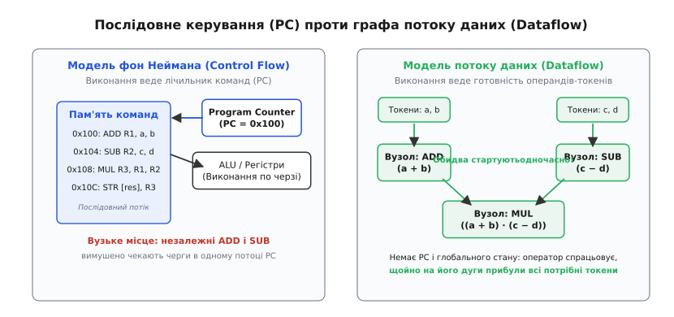
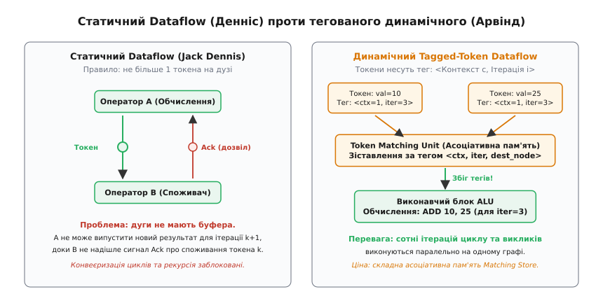
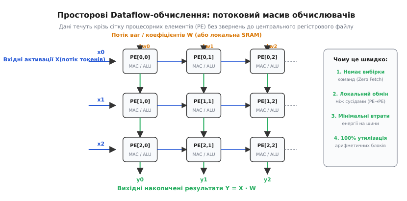

# Dataflow-архітектури: обчислення за готовністю даних

<preknowlist>
- [Цикл виконання інструкції](book:programming/instruction-cycle-detail) — класична модель послідовної вибірки та декодування інструкцій за лічильником команд (PC).
- [Позачергове виконання](book:programming/out-of-order-execution) — динамічне планування інструкцій, станції очікування та перейменування регістрів.
- [Конвеєр](book:programming/pipeline) — розбиття виконання на стадії та структурні/інформаційні конфлікти.
- [SIMD і векторизація](book:programming/simd-vectorization) — паралельна обробка масивів однакових даних однією інструкцією.
</preknowlist>

Коли процесору потрібно обчислити вираз `(a + b) · (c − d)`, математична логіка дозволяє виконати додавання `a + b` та віднімання `c − d` абсолютно незалежно й одночасно. Проте класичний процесор архітектури фон Неймана змушений вишикувати ці дії в штучну лінійну чергу: записати першу команду за адресою `0x100`, другу — за адресою `0x104`, вибрати їх по черзі з пам'яті через єдиний лічильник команд (*program counter*, PC), зберегти проміжні результати в іменовані регістри й лише потім перейти до множення. Навіть якщо програма містить мільйони незалежних математичних операцій, архітектура з централізованим керуванням протискує їх крізь одне вузьке горлечко — послідовний потік інструкцій.

**Потокова архітектура обчислень** (англ. *dataflow architecture*, парадигма потоку даних) повністю скасовує лічильник команд і концепцію послідовного кроку. У ній немає централізованого пристрою керування, немає глобального стану пам'яті та немає поняття «поточної адреси виконання». Програма представляється безпосередньо у вигляді орієнтованого графа обчислювальних операторів, а виконання кожної інструкції ініціюється виключно **готовністю її вхідних даних**. Щойно на вхідні дуги вузла прибули всі необхідні операнди, він спрацьовує автоматично й паралельно з будь-якою кількістю інших готових вузлів.

> 🔧 **Навіщо це.** У сучасних задачах обробки сигналів, комп'ютерного зору, фізичного моделювання та глибоких нейромереж обчислювальний процес складається з мільярдів однотипних операцій із заздалегідь відомими залежностями. Парадигма потоку даних дозволяє усунути до 70–80% нецільових витрат енергії на вибірку, декодування та динамічне перевпорядкування команд у традиційних CPU, спрямовуючи кремній безпосередньо на паралельну арифметику.

## Парадигми обчислень: Control Flow проти Data Flow

Щоб оцінити глибину розриву між двома підходами, зіставимо їхні фундаментальні аксіоми:

В архітектурі, керованій потоком керування (англ. *control-driven* або *Control Flow*, модель фон Неймана):
1. **Модель пам'яті**: пам'ять є пасивним сховищем мутабельних комірок, кожна з яких має унікальну числову адресу.
2. **Сутність обчислення**: обчислення полягає у деструктивному оновленні стану комірок пам'яті та регістрів (запис нового значення затирає старе).
3. **Порядок дій**: послідовність кроків жорстко диктується лічильником команд PC, який інкрементується або змінюється інструкціями умовних і безумовних переходів (*branches* / *jumps*).
4. **Стан даних**: дані пасивно лежать у регістрах чи оперативній пам'яті в очікуванні, поки команда явно звернеться до них за адресою.

В архітектурі, керованій потоком даних (англ. *data-driven* або *Data Flow*):
1. **Модель пам'яті**: пам'яті у вигляді глобальних адресних комірок не існує. Дані існують виключно як рухомі кванти інформації — **токени** (англ. *tokens*), що переміщуються між обчислювальними вузлами.
2. **Сутність обчислення**: обчислення є чистими функціями без побічних ефектів (*side-effect free*). Оператор споживає вхідні токени, знищує їх і породжує новий вихідний токен результату.
3. **Порядок дій**: немає лічильника команд і немає поняття централізованого потоку керування. Порядок виконання визначається виключно топологією графа залежностей даних.
4. **Стан даних**: дані активні. Саме поява повного набору вхідних токенів активує (*triggers / fires*) відповідний обчислювальний блок.


*Ліворуч — послідовне виконання у моделі фон Неймана: незалежні операції ADD та SUB вимушено чекають черги в одному потоці лічильника команд. Праворуч — модель потоку даних: оператори спрацьовують одночасно й незалежно, щойно на їхні входи надійшли вхідні токени даних.*

## Графи потоку даних (Dataflow Graphs, DFG)

Базовою одиницею представлення програми у потоковій системі є **орієнтований граф потоку даних** (англ. *Dataflow Graph*, DFG). Формально такий граф описується парою `G = (V, E)`:

* `V` — множина вершин (вузлів, або **акторів**, англ. *actors*), що представляють операції: арифметичні дії (`+`, `−`, `·`, `/`), логічні перевірки, оператори копіювання значень чи розгалуження потоків.
* `E` — множина орієнтованих дуг (*directed arcs*), які задають канали передачі даних від виходу одного вузла до входу іншого.

Дугами графа переміщуються дискретні пакети — **токени** (*tokens*). Кожен токен несе корисне значення даних (наприклад, 64-бітне число з рухомою комою) та адресну інформацію про те, до якого порту якого цільового вузла він прямує.

### Правило спрацьовування актора (Firing Rule)

Кожен вузол графа функціонує за строгою подієвою логікою:
1. **Умова готовності**: актор переходить у стан готовності тоді й тільки тоді, коли на **кожному** з його вхідних портів присутній дійсний токен даних.
2. **Акт спрацьовування (*Firing*)**: вільний обчислювальний блок (ALU) забирає вхідні токени з портів, виконує закладену в операторі дію над їхніми значеннями і миттєво звільняє вхідні слоти.
3. **Емісія результату**: обчислене значення пакується в новий токен (або кілька токенів, якщо вихід дублюється) і випускається у вихідні дуги до вузлів-наступників.

Оскільки вузли не мають спільного мутабельного стану й взаємодіють виключно через передачу токенів, будь-які вузли графа, чиї вхідні умови виконані одночасно, можуть виконуватися абсолютно паралельно без використання замків (*locks*), м'ютексів чи бар'єрів синхронізації.

### Оператори керування потоком у графі

Для побудови повноцінних програм (з розгалуженнями та циклами) набір вузлів dataflow-графа доповнюється спеціальними акторами керування:

1. **Вузол дублювання (`DUP`)**: приймає один вхідний токен і створює `N` ідентичних копій для різних вузлів-споживачів.
2. **Вузол перемикання (`SWITCH` або `T/F-Gate`)**: має два входи — порт даних і порт логічного предикату (*boolean condition*). Якщо на порт предикату надходить токен `True`, токен даних випускається у вихідний канал `True`; якщо `False` — у канал `False`.
3. **Вузол злиття (`MERGE`)**: має два альтернативні входи даних і порт вибору. Залежно від сигналу селектора, вузол пропускає на єдиний вихід токен з лівого або правого вхідного каналу, дозволяючи зводити результати умовних гілок `if-else` в єдиний потік.

## Статичний Dataflow: модель Джека Денніса

Першу практичну реалізацію цієї концепції запропонував у 1974 році Джек Денніс (*Jack B. Dennis*) у Массачусетському технологічному інституті (MIT). Його підхід отримав назву **статичної архітектури потоку даних** (англ. *Static Dataflow Architecture*).

У статичній моделі програма завантажується в спеціальну пам'ять у вигляді фіксованої таблиці шаблонів інструкцій (*instruction templates*). Кожен шаблон містить:
* Код операції (*opcode*);
* Два слоти операндів із прапорцями присутності (*presence bits*);
* Список адрес наступних інструкцій, куди слід надіслати результат.

Коли токен прибуває за адресою інструкції, він записується у відповідний операндний слот, і його біт присутності виставляється в `1`. Щойно обидва біти стають одиницями, інструкція позначається готовою і передається на виконання вільному арифметичному блоку.

### Інваріант одного токена та дуги підтвердження

Головне фундаментальне правило статичної архітектури Денніса: **на кожній дузі графа в будь-який момент часу дозволено перебувати не більше ніж одному токену**.

Якщо вузол-виробник випустить другий результат раніше, ніж вузол-споживач встигне прочитати й обробити перший, новий токен запишеться в той самий слот і безповоротно затре попередній результат. Це призведе до спотворення обчислень.

Щоб запобігти переповненню, Денніс ввів **дуги підтвердження** (англ. *acknowledgment arcs*):
* Між кожною парою зв'язаних вузлів прокладається не одна, а дві дуги: пряма дуга для передачі даних і зворотна дуга для сигналу підтвердження.
* Вузол `A` має право виконатися й надіслати токен вузлу `B` лише тоді, коли вихідна дуга порожня.
* Після того як вузол `B` виконується й споживає токен, він надсилає вузлу `A` короткий службовий сигнал *Ack*, який дозволяє `A` генерувати наступний результат.

### Обмеження статичного dataflow

Правило одного токена й дуги підтвердження породили важкі архітектурні наслідки:

1. **Подвоєння комутаційного трафіку**: для кожного переданого числа мережа мусила передати зворотний сигнал підтвердження, завантажуючи маршрутизатори паразитною роботою.
2. **Блокування конвеєризації циклів**: якщо у програмі є цикл з 1000 ітерацій, ітерація `k + 1` не може початися, доки ітерація `k` повністю не пройде всі ланки тіла циклу й не надішле сигнали підтвердження назад на початок. Конвеєризація стає неможливою, і цикл вимушено виконується послідовно.
3. **Неможливість рекурсії**: один і той самий статичний граф не може підтримувати одночасне виконання кількох екземплярів однієї функції. Для кожного рекурсивного виклику довелося б створювати фізичну копію всього підграфа в апаратній пам'яті.

## Динамічний Tagged-Token Dataflow: Арвінд і Манчестерська машина

Щоб дозволити одночасне паралельне виконання багатьох ітерацій циклу та вкладених викликів функцій на одному й тому самому графі, на початку 1980-х років професор Арвінд (*Arvind*) в MIT та група Джона Герда (*John Gurd*) у Манчестерському університеті розробили **динамічну архітектуру з тегованими токенами** (англ. *Dynamic / Tagged-Token Dataflow Architecture*).

Головна ідея: дозволити довільній кількості токенів одночасно співіснувати на одній і тій самій дузі, прикріпивши до кожного токена апаратний ідентифікатор — **тег** (*tag*).

```
Token = <Tag, Destination, Value>
Tag   = <Context_ID, Iteration_ID>
Destination = <Node_ID, Port_ID>
```

* `Context_ID`: унікальний номер контексту (ідентифікатор екземпляра функції або окремої нитки обчислень);
* `Iteration_ID`: лічильник поточної ітерації циклу;
* `Node_ID` та `Port_ID`: адреса цільового оператора та номер порту (лівий чи правий операнд).

Завдяки тегам токени різних ітерацій (наприклад, `Iteration 1` та `Iteration 50`) можуть вільно циркулювати в спільній комутаційній мережі. Дві ітерації використовують один і той самий статичний шаблон оператора `ADD`, але оперують виключно своїми операндами.


*Ліворуч — статичний Dataflow: дуга тримає не більше одного токена, вимагаючи зворотних сигналів підтвердження Ack і блокуючи паралелізм циклів. Праворуч — динамічний Tagged-Token Dataflow: токени несуть мітки контексту та ітерацій, а блок Matching Store зіставляє пари операндів, дозволяючи десяткам ітерацій виконуватися паралельно на єдиному графі.*

### Блок зіставлення токенів (Matching Store)

Ключовим апаратним вузлом динамічної машини став **блок зіставлення операндів** (англ. *Matching Store* / *Token Matching Unit*). 

Оскільки вхідні токени для бінарної операції можуть надходити з різними затримками (лівий операнд обчислився на такті 10, а правий — на такті 45), машина повинна десь зберігати перший токен і чекати на прибуття другого.

Механізм роботи `Matching Store`:
1. Прибуває токен із тегом `<ctx, iter>` для вузла `N`, порт `0`.
2. Блок звертається до асоціативної пам'яті або апаратної хеш-таблиці з пошуковим ключем `Key = <N, ctx, iter>`.
3. **Промах (пари немає)**: токен записується у вільну комірку сховища й залишається очікувати.
4. **Збіг (пара знайдена)**: зі сховища зчитується раніше збережений правий операнд для порту `1`. Обидва операнди вилучаються зі сховища, пакуються в єдиний виконуваний пакет `<Opcode, LeftVal, RightVal, Tag>` і передаються в чергу на виконання в ALU.

Детальний покроковий аналіз роботи цього механізму, архітектуру Matching Store (ETS), I-структури та працюючий код емулятора динамічного рушія на мовах C і C++ розібрано в окремій статті [Потокові динамічні обчислення (Dataflow Engine)](book:programming/dynamic-dataflow-engine).

### Проблема структур даних: I-Structures та M-Structures

У чистій функціональній моделі всі змінні є незмінними значеннями. Але як обробляти великі масиви даних (наприклад, матрицю розміром 1000 × 1000)? Якщо копіювати весь масив при зміні одного числа або розбивати його на мільйон окремих скалярних токенів, накладні витрати на передачу пакетів знищать будь-яку продуктивність.

Для розв'язання цієї проблеми в архітектурах потоку даних було винайдено концепцію **I-Structures** (англ. *Irvine Structures*):
* Пам'ять I-Structure складається з комірок, кожна з яких має три стани: `Empty` (порожня), `Full` (заповнена) та `Deferred-Read` (відкладене читання).
* Запис у комірку дозволено виконати лише **один раз** (*write-once / single-assignment*). Коли значення записано, стан переходить у `Full`.
* Якщо споживач намагається прочитати комірку в стані `Full`, він миттєво отримує значення.
* Якщо споживач звертається до комірки в стані `Empty`, його запит не викликає помилки: він додається в чергу відкладеного читання `Deferred-Read`. Щойно виробник записує значення, апаратура пам'яті автоматично розсилає токени всім заблокованим читачам.

Ця концепція апаратного відкладеного читання стала прямим пращуром сучасних механізмів асинхронного програмування (*Futures / Promises / async-await*) у сучасних мовах програмування.

### Чому чистий універсальний Dataflow зупинився у 1990-х

До початку 1990-х років проекти чистих dataflow-комп'ютерів (MIT Monsoon, Manchester Machine, ETL Sigma-1 в Японії) продемонстрували феноменальний паралелізм, проте виявилися комерційно неконкурентоспроможними порівняно з мікропроцесорами фон Неймана.

Причини невдачі чистих dataflow-машин першої хвилі:

1. **Апаратна складність і затримка Matching Store**: асоціативна пам'ять CAM вимагала величезної площі кремнію та споживала значну кількість енергії. Пошук парного операнда додавав кілька тактів затримки на кожну базову арифметичну операцію.
2. **Втрата локальності кеш-пам'яті**: класичний фоннейманівський код чудово експлуатує просторову та часову локальність (*cache locality*): сусідні команди читають сусідні байти масиву, які вже лежать у швидкому кеші L1. У dataflow-машині тисячі дрібних токенів конкурують за комутаційну мережу, створюючи хаотичний трафік звернень і нівелюючи переваги кешування.
3. **Неконтрольований вибух кількості токенів**: паралельні цикли розгорталися настільки агресивно, що черги токенів переповнювали всю доступну пам'ять машини раніше, ніж ALU встигали їх обробити.

Докладний розбір історичного протистояння між MIT, Манчестером та індустрією класичних RISC-процесорів викладено в [історичному нарисі про піонерів dataflow](book:programming/dataflow-architecture/hist-dataflow-pioneers.md).

## Мікроархітектурний Dataflow усередині сучасних CPU

Незважаючи на згортання проектів окремих dataflow-комп'ютерів, фундаментальні ідеї потоку даних не зникли. Вони були тріумфально інтегровані **всередину звичайних процесорів фон Неймана** як мікроархітектурний рушій позачергового виконання (*Out-of-Order Execution*).

Починаючи з архітектури Intel Pentium Pro (1995) та IBM PowerPC 604, процесори розділили свою внутрішню будову на дві частини:

```
[Послідовний Frontend] ──► [Перейменування (RAT)] ──► [Dataflow-ядро (RS/ROB)] ──► [Послідовний Commit]
 (Вибірка за PC)           (Перетворення на токени)   (Виконання за готовністю)     (Точні винятки)
```

1. **Зовнішній інтерфейс (Frontend)**: залишається строго послідовним. Процесор вибирає команди x86 чи ARM за лічильником команд PC, декодує їх і розбиває складні інструкції на прості внутрішні мікрооперації (uops / μops).
2. **Перейменування регістрів (RAT — Register Alias Table)**: апаратура замінює імена архітектурних регістрів на теги фізичних комірок. Це миттєво усуває несправжні залежності за іменами (WAW і WAR) і перетворює лінійний код на тимчасовий граф потоку даних.
3. **Станції очікування (Reservation Stations, алгоритм Томасуло)**: виконують роль локального, апаратно оптимізованого `Matching Store`. Мікрооперація потрапляє в комірку станції очікування й чекає на свої операнди.
4. **Спільна шина даних (Common Data Bus, CDB) та мережа байпасу**: коли будь-яке ALU завершує обчислення, воно транслює результат разом із тегом фізичного регістра на всі станції очікування. Станції порівнюють тег результату з тегами очікуваних операндів. У разі збігу операнд захоплюється, і мікрооперація негайно відправляється на виконання в ALU — **строго за готовністю даних, без жодної участі лічильника команд**.
5. **Буфер упорядкування (Reorder Buffer, ROB)**: тримає результати виконаних мікрооперацій і оприлюднює їх у пам'ять і регістри архітектурного стану строго в порядку оригінальної програми.

Таким чином, сучасний універсальний процесор (Intel Core, AMD Zen, Apple Silicon M-серії) — це **dataflow-комп'ютер, загорнутий у захисну оболонку фон Неймана**. Зовні програміст бачить звичний лінійний код, а всередині кремній будує тимчасовий динамічний граф потоку даних на 128–512 мікрооперацій і виконує його на максимальній швидкості.

> 🔧 **Навіщо це.** Ціна цієї гібридної компромісної моделі — величезне енергоспоживання. Процесор витрачає колосальну кількість транзисторів і енергії не на самі математичні дії, а на підтримку ілюзії лінійного порядку: декодування змінної довжини команд, таблиці перейменування регістрів (RAT), асоціативні черги станцій очікування та масивні буфери ROB.

## Відродження: просторові обчислення та AI-акселератори

У 2010-х роках індустрія натрапила на фізичні межі кремнію: тактові частоти вперлися в «стіну потужності» (*Power Wall*), а закон масштабування Деннарда остаточно припинив діяти. Створювати ще ширші позачергові ядра фон Неймана стало енергетично безглуздо.

Водночас відбулася революція глибокого навчання (*Deep Learning*). Обчислення в нейромережах мають унікальні властивості:
* Вони складаються з детермінованих операцій над тензорами (множення матриць, згортки, механізми уваги);
* Потік даних повністю відомий заздалегідь під час компіляції моделі;
* Практично відсутні непередбачувані умовні переходи й розгалуження.

Це призвело до ренесансу ідей dataflow у формі **просторових обчислювачів** (англ. *Spatial Computing*) та грубозернистих реконфігуровних архітектур (*Coarse-Grained Reconfigurable Architectures*, CGRA).


*Просторовий Dataflow в AI-акселераторах: дані течуть безпосередньо крізь двовимірну сітку процесорних елементів від сусіда до сусіда, накопичуючи результати множення матриць без постійних звернень до центрального регістрового файлу чи ієрархії кеш-пам'яті.*

Розглянемо провідні архітектурні втілення просторового dataflow:

### 1. Систолічні масиви (Systolic Arrays, Google TPU)

Систолічний масив — це синхронна просторова dataflow-сітка процесорних елементів (англ. *Processing Elements*, PE), де дані прокачуються крізь кремній ритмічно, як кров крізь судини:
* **Матриця множення (Matrix Multiply Unit, MXU)** у Google TPU містить масив 256 × 256 обчислювальних елементів MAC (*Multiply-Accumulate*).
* Ваги моделі завантажуються й залишаються нерухомими всередині комірок PE за схемою *Weight-Stationary*.
* Вхідні активації подаються з лівого краю сітки й щотакту зсуваються вправо від одного PE до іншого.
* Часткові суми просуваються зверху вниз, накопичуючи результат множення матриць.

Перевага: проміжні результати ніколи не записуються в регістровий файл чи зовнішню пам'ять. Одне й те саме зчитане число багаторазово використовується сотнями сусідніх процесорних елементів, що скорочує витрати енергії на комунікацію в десятки разів.

### 2. Тайлові масиви з моделлю BSP (Graphcore IPU)

Процесор *Colossus* компанії Graphcore складається з понад 1400 незалежних обчислювальних ядер (тайлів, англ. *tiles*), кожен з яких має власну надшвидку пам'ять SRAM без глобального когерентного кешу:
* Обчислення відбуваються за моделлю масового синхронного паралелізму (*Bulk Synchronous Parallel*, BSP).
* Фаза 1: кожен тайл локально виконує обчислення над своїми даними у чистому dataflow-стилі.
* Фаза 2: усі ядра одночасно обмінюються пакетами-токенами через високоефективну мережу з повною відсутністю колізій (*all-to-all deterministic exchange*).
* Фаза 3: глобальна бар'єрна синхронізація та перехід до наступного ярусу графа.

### 3. Асинхронні NoC-сітки та Dataflow Fabric (Tenstorrent, Cerebras, SambaNova)

Сучасні системи просторового потоку даних реалізують ідеї Арвінда на рівні кремнієвих кристалів:
* **Tenstorrent (процесори Wormhole / Blackhole)**: кристал розбито на сітку ядер *Tensix*, з'єднаних 2D-мережею на кристалі (*Network-on-Chip, NoC*). Ядра не вибирають команди послідовно: вони містять апаратні маршрутизатори пакетів і виконують матричні та векторні операції безпосередньо під час проходження потоків тензорних токенів через локальні SRAM-буфери.
* **Cerebras Wafer-Scale Engine (WSE)**: гігантський чіп розміром з усю кремнієву пластину (понад 850 000 ядер). Ядра спілкуються через апаратну мережу *Dataflow Fabric*, де кожне 32-бітне слово передається із прапорцем керування single-cycle без посередництва пам'яті. Коли операнд прибуває на вхідний порт ядра, він апаратно ініціює виконання відповідної інструкції за 1 такт.
* **SambaNova Systems (Reconfigurable Dataflow Unit, RDU)**: використовує просторову реконфігуровну структуру з масивів обчислювальних модулів (PCU) та комутаторів пам'яті (PMU). Компілятор проектує повний граф нейромережі на фізичну поверхню чіпа, створюючи апаратний трубопровід, крізь який дані течуть безперервним конвеєром.

## Порівняння архітектурних парадигм

Зіставимо ключові характеристики класичних та потокових підходів:

| Характеристика | Послідовний CPU (Control Flow) | Позачерговий CPU (OoO Hybrid) | Класичний Dataflow (MIT Monsoon) | Просторовий AI Dataflow (TPU/CGRA) |
| :--- | :--- | :--- | :--- | :--- |
| **Керування виконанням** | Лічильник команд PC | Локальний dataflow у вікні RS | Готовність операндів за тегами | Потоковий розклад даних у NoC/сітці |
| **Подання програми** | Послідовний машинний код | Послідовний код → динамічний μop-граф | Статичний граф із шаблонами | Скомпільований просторовий граф (IR) |
| **Синхронізація** | М'ютекси, атоміки, бар'єри | Апаратний ROB, когерентність кешів | Токени, Matching Store | Локальні FIFO, систолічні зсуви |
| **Енерговитрати на вибірку команд** | 30–50% енергії | 60–80% енергії | 10–20% (накладні витрати тегів) | Менше 5% (Zero instruction fetch) |
| **Чутливість до затримок пам'яті** | Висока (блокування конвеєра) | Середня (приховування затримки у вікні) | Низька (миттєве перемикання на інші токени) | Низька (масивний потоковий конвеєр) |
| **Цільовий клас задач** | Системне ПЗ, ОС, умовна логіка | Універсальні однопотокові задачі | Загальний паралелізм (функціональні мови) | Нейромережі, лінійна алгебра, DSP |

## Енергетична ціна обчислень: чому Dataflow перемагає в AI

У сучасних мікросхемах головним лімітуючим фактором є не кількість транзисторів, а розсіювання тепла (енергія, витрачена на одну корисну операцію). Порівняємо орієнтовні енергетичні витрати для технологічного процесу 7 нм:

* **32-бітна операція множення з накопиченням (MAC)** в арифметичному блоці ALU споживає близько `0.5–1.0 пДж` (пікоджоулів).
* **Читання операнда з локального регістрового файлу SRAM** поруч з ALU коштує близько `1–2 пДж`.
* **Передача операнда через шину даних та станцію очікування (RS/CDB)** у великому позачерговому ядрі коштує близько `10–20 пДж`.
* **Вибірка, декодування інструкції та перейменування регістрів** у ядрі x86/ARM додає ще `50–100 пДж` на кожну команду.
* **Читання даних із зовнішньої оперативної пам'яті DRAM** коштує колосальні `1000–2000 пДж`.

У класичному CPU понад 90% енергії витрачається на логістику команд і перейменування регістрів, і лише кілька відсотків — на саме множення чисел.

Просторові Dataflow-архітектури (як-от систолічні масиви та CGRA) перевертають це співвідношення:
1. Інструкція завантажується в обчислювальний елемент один раз під час конфігурації графа, що зводить витрати на вибірку команд практично до нуля (*Zero Instruction Fetch Overhead*).
2. Дані передаються напряму від одного обчислювального елемента до сусіднього через короткі кремнієві зв'язки завдовжки менше кількох мікрометрів, що мінімізує ємнісні втрати енергії на довгих шинах.
3. Багаторазове локальне використання даних (*data reuse*) усередині систолічної сітки скорочує звернення до зовнішньої DRAM на два порядки.

## Програмний стек: як писати під Dataflow

Головна історична трагедія чистого dataflow полягала в тому, що традиційні імперативні мови програмування (C, C++, Fortran) фундаментально зав'язані на концепцію послідовного часу та спільних покажчиків на змінні в пам'яті. Змусити C-код ефективно виконуватися на машині Денніса чи Арвінда виявилося практично неможливо без повного переписування компіляторів.

Сучасний ренесанс dataflow став можливим завдяки зміні парадигми на рівні компіляторів та мов високого рівня:

1. **Графові проміжні представлення (Intermediate Representations, IR)**: сучасні компілятори машинного навчання (MLIR, XLA, TVM, ONNX) ніколи не транслюють модель у лінійний асемблер. Вони зберігають граф потоку даних як первинний об'єкт.
2. **Операції над тензорами замість скалярів**: токенами в сучасних системах виступають не поодинокі числа, а цілі блоки даних або тензорні фрагменти (*tile-based macro-dataflow*). Це усуває накладні витрати на рівні індивідуальних чисел і повністю завантажує матричні обчислювачі.
3. **Статичне планування пам'яті**: просторові компілятори знають розміри тензорів і тривалість виконання кожного оператора заздалегідь. Вони розраховують точний розклад руху даних на кремнії під час компіляції, позбавляючи апаратуру необхідності тримати дорогі динамічні хеш-таблиці Matching Store.

Dataflow пройшов шлях від сміливої академічної теорії 1970-х років через інженерні компроміси позачергових мікропроцесорів до домінуючої архітектурної основи сучасних суперкомп'ютерів та штучного інтелекту.
