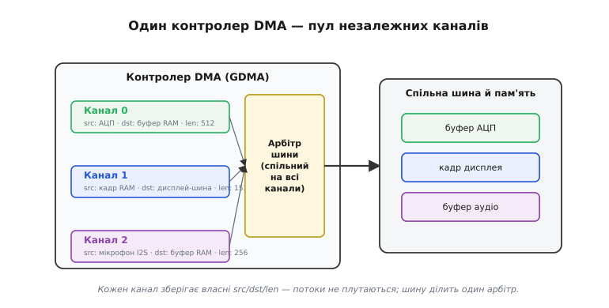
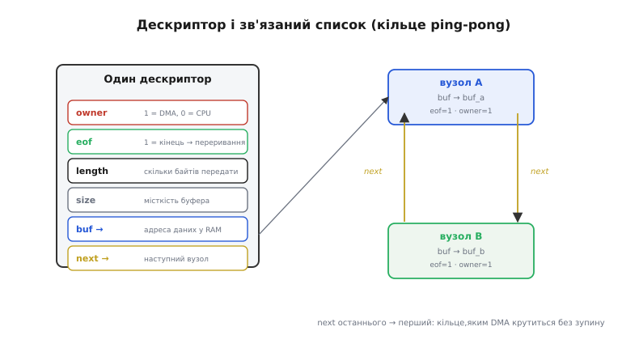
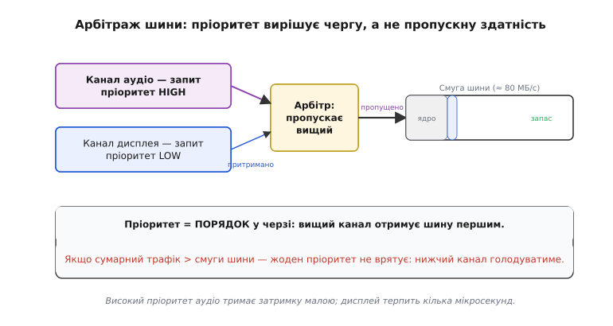

# Канали й дескриптори DMA

Реальний пристрій рідко тягне один потік даних. Тієї самої миті може йти безперервне оцифровування мікрофона, виливатися кадр на дисплей і наповнюватися буфер із зовнішньої шини. Кожен потік — це окрема пара «звідки → куди» з власним лічильником довжини. [Контролер DMA](topic:programming/dma-controller) уміє ганяти байти повз ядро, але сам по собі він — один виконавець на одній шині. Щоб один виконавець вів три потоки нараз і не плутав їх, його стан треба розмножити. Саме це й роблять **канали**, а форму кожному потоку задають **дескриптори**.

## Канали: розмножений стан одного контролера

**Канал** (*channel* — від лат. *canalis*, «русло, жолоб») — це незалежний набір регістрів усередині контролера: своє джерело, своє призначення, свій лічильник байтів, свій статус. Кілька каналів ділять одну фізичну шину й один арбітр, але кожен веде власне русло — потоки не зливаються, бо стан кожного зберігається окремо. Канал не дублює апаратуру перенесення; він дублює лише *пам'ять про те, що зараз переноситься*. Один рушій, кілька наборів вказівників — і кожен набір тягне свій блок так, ніби він на шині сам.

Звідси проста, але важлива межа: канал відповідає за **налаштування потоку**, а не за його швидкість. Завести більше каналів — означає мати більше одночасних русел, а не ширшу шину. Швидкість лишається спільним ресурсом, і ділить її арбітр.

На ESP32 канали пройшли два покоління, і різниця між ними повчальна. У ранніх чіпах DMA був «припаяний» до периферії: кожен блок (SPI, I2S, АЦП) мав власний маленький DMA всередині себе, і користуватися ним міг лише він. Якщо одній периферії каналів бракувало, а інша простоювала — переставити їх було неможливо. Новіші серії (ESP32-S3, C-серія) отримали загальний **GDMA** (*General DMA*, «універсальний DMA») — спільний пул незалежних каналів, кожен з яких програмно прив'язується до будь-якої периферії. Це і є сенс слова «загальний»: довільне відображення «канал ↔ периферія» замість жорсткої прив'язки. Звільнився дисплей — його канал можна віддати під АЦП; знадобилося два русла на звук — прив'язати два.

> 🔧 **Навіщо це.** Кількість каналів — обмежений ресурс плати: на GDMA їх одиниці, не десятки. Коли ви проєктуєте прошивку з кількома потоковими периферіями (мікрофон + дисплей + АЦП), порахувати потрібні канали треба **наперед**, ще на етапі вибору режимів. Інакше на інтеграції виявиться, що четвертому потоку русла вже немає, і доведеться зводити периферії на один канал по черзі — а це повертає ту саму чергу, від якої DMA рятував.

Окремий, неочевидний випадок — перенесення **пам'ять → пам'ять** (фоновий аналог `memcpy`). Тут немає периферії, лише два кінці в RAM, тож GDMA займає одразу **два канали**: один «вхідний» читає джерело, другий «вихідний» пише призначення, а контролер працює посередником між ними. Тобто навіть найпростіша копія без участі ядра коштує пари русел — це варто тримати в голові, рахуючи бюджет каналів.



*Пул каналів усередині одного контролера: стан кожного потоку (джерело, призначення, довжина) живе окремо, тому три русла не плутаються — спільні в них лише шина й арбітр.*

## Дескриптори: форма одного потоку

Канал із простим налаштуванням «src, dst, len» переносить **один** суцільний блок і зупиняється. Цього досить для разової копії, але два бажання він не задовольняє: дані бувають **розкидані** по пам'яті (заголовок в одному буфері, тіло в іншому), а потік буває **нескінченний** (звук, що йде роками). Обидва бажання закриває та сама конструкція — **дескриптор** (*descriptor* — від лат. *describere*, «описувати»): маленька структура в RAM, що описує один шматок передачі, плюс поле-вказівник на наступний такий опис. Дескриптори зчеплюються в список, і канал замість жорсткого «src, dst, len» дістає лише адресу першого вузла.

Типова форма дескриптора GDMA (спрощений `lldesc_t` з ESP-IDF) — це одне 32-бітне слово прапорців і лічильників плюс два машинні вказівники:

```c
typedef struct dma_desc_s {
    uint32_t  size   : 12;  /* місткість буфера, байтів (з вирівнюванням) */
    uint32_t  length : 12;  /* скільки байтів реально передати з buf */
    uint32_t  rsv    : 6;   /* зарезервовано */
    uint32_t  eof    : 1;   /* 1 = останній шматок: підняти переривання */
    uint32_t  owner  : 1;   /* 1 = власник DMA, 0 = власник CPU */
    uint8_t  *buf;          /* вказівник на буфер даних */
    struct dma_desc_s *next; /* наступний дескриптор; NULL = кінець */
} dma_desc_t;
```

Поле `owner` — серце цієї структури. Воно виражає **рукостискання** між ядром і апаратурою: `owner = 1` означає «буфер належить DMA, ядро не сміє його чіпати»; `owner = 0` — «DMA завершив, буфер повернуто ядру». Це апаратний замок без жодного `mutex` чи критичної секції: дисципліна власності тримається на одному біті, який обидві сторони чесно перемикають. Та сама логіка «один господар у момент часу», що й у програмних [гонках за спільні дані](topic:programming/atomicity-races), — лише замок тут зашитий у залізо.

Поле `eof` (*end of frame*, «кінець кадру») на останньому вузлі каже апаратурі: «дійшовши сюди, підніми переривання». Завдяки йому ядро отримує **один** сигнал про завершення цілого кадру, а не дрібний переривальний дощ після кожного шматка.

З цих полів виростають дві ключові схеми.

**Scatter-gather** (англ. «розкидати-зібрати»): вказівники `buf` різних вузлів дивляться на розкидані ділянки RAM, а контролер обходить список і виливає їх у шину суцільним потоком — одержувач не бачить жодних «зшивок». Зручно для протоколів, де заголовок, тіло й контрольна сума зберігаються окремо. Цю схему — як один старт каналу збирає кадр із розкиданих частин — детально, з робочим кодом, розбирає ⚙️ [Дескриптори зв'язаним списком](topic:programming/dma-channels/proj-descriptors.md).

**Кільце**: якщо поле `next` останнього вузла вказує не на `NULL`, а назад на перший, список замикається в кільце, і DMA крутиться по ньому без зупину, доки ядро не накаже спинитись. Так будується безперервний потік. Найважливіший його окремий випадок — кільце рівно з **двох** вузлів: поки DMA наповнює перший буфер, ядро обробляє другий, а на `eof` вони міняються ролями. Це класична [подвійна буферизація](topic:programming/double-buffering) (ping-pong): мікрофон чи АЦП ллють дані вічно, ядро встигає за ними половинами, і жодного байта не губиться. У промислових драйверах кільце нерідко роблять із більшого числа вузлів (скажімо, п'яти) — тоді один буфер завжди під записом DMA, а решта спокійно чекають обробки.

```c
/* Кільце з двох дескрипторів — основа ping-pong потоку */
static dma_desc_t descs[2];
static uint8_t buf_a[BUF_SIZE] __attribute__((aligned(32)));
static uint8_t buf_b[BUF_SIZE] __attribute__((aligned(32)));

void dma_ring_init(void) {
    descs[0].owner  = 1;          /* віддаємо буфер DMA */
    descs[0].eof    = 1;          /* переривання після цього буфера */
    descs[0].length = 0;          /* приймання заповнить саме */
    descs[0].size   = BUF_SIZE;
    descs[0].buf    = buf_a;
    descs[0].next   = &descs[1];  /* → другий вузол */

    descs[1].owner  = 1;
    descs[1].eof    = 1;
    descs[1].length = 0;
    descs[1].size   = BUF_SIZE;
    descs[1].buf    = buf_b;
    descs[1].next   = &descs[0];  /* → назад у перший: кільце замкнулось */
}
```

> 🔧 **Навіщо це.** `owner`-біт виглядає формальністю, аж поки на нього не наступиш. Прочитали буфер «бо ISR прийшов», а DMA ще дописував у нього (бо ви не перевірили `owner`) — і в даних з'являються биті напівсвіжі байти, які потім годинами шукають як «плаваючий шум». Правило просте: ядро торкається буфера лише коли `owner = 0`; перш ніж віддати буфер назад DMA — заповнюєш усе, і **останнім** виставляєш `owner = 1`. Це той самий принцип «публікуй останнім», що рятує від [гонок за спільні дані](topic:programming/atomicity-races).



*Дескриптор і зв'язаний список: один вузол описує один шматок (куди дивиться buf, скільки байтів, чий зараз буфер за owner), а замкнуте кільце з двох вузлів дає безперервний потік без участі ядра між половинами.*

## Пріоритети й арбітраж шини

Поки канал один, питань немає. Щойно два канали хочуть шину тієї самої миті — потрібен суддя. Ним і є **арбітр** (*arbiter* — від лат. *arbiter*, «третейський суддя»): він дивиться на пріоритети запитів і пропускає вищий. GDMA поєднує дві стратегії — **фіксований пріоритет** (канал із більшим числом завжди важливіший) і **круговий обхід** (*round-robin*) між каналами однакової ваги, щоб рівні не затирали один одного. Аудіо зазвичай отримує високий пріоритет: будь-яка затримка чутна як клацання. Дисплей може почекати кілька мікросекунд — людське око не помітить запізнення одного пікселя.

Але — і це головна пастка теми — пріоритет вирішує лише **порядок у черзі**, а не **пропускну здатність**. Пріоритет каже «хто перший підійде до шини», а не «скільки шина здатна перенести». Якщо сумарний трафік усіх каналів перевищує те, що фізична шина тягне, жоден пріоритет не врятує: вищий канал отримає свою повну квоту, а нижчий просто голодуватиме — його байти не запізняться, їх не буде взагалі. Тому до пріоритетів завжди йде окреме питання: **чи вистачить смуги?**

**Чи вистачить шини**

```
Дано:
  Смуга AHB (≈80 МГц)   ≈ 80 МБ/с   (практичний максимум)
  Ядро (код + стек)     ≈ 20 МБ/с   (орієнтовно під навантаженням)

Навантаження каналів:
  Дисплей 320×240, RGB565, 30 кадрів/с:
    = 320 × 240 × 2 × 30 ≈ 4.6 МБ/с   → округлимо до 5 МБ/с
  Аудіо 48 кГц, стерео, 16 біт:
    = 48000 × 2 × 2 = 192 кБ/с ≈ 0.2 МБ/с

Разом:
  20 + 5 + 0.2 = 25.2 МБ/с  <  80 МБ/с   → запас ≈ 55 МБ/с, ОК.

А якби дисплей 60 кадрів/с + важкі текстури (гіпотетично, 50 МБ/с):
  20 + 50 + 0.2 = 70.2 МБ/с  →  залишок ≈ 10 МБ/с: пріоритет уже важить,
  межа близько — нижчий канал ризикує голодувати.
```

Поки сума навантажень лежить із запасом під смугою, пріоритети — це тонке підлаштування затримки, і система працює для всіх каналів. Щойно сума підповзає до стелі, пріоритет перетворюється з «налаштування» на «вибір, кому жити»: вищий бере своє, нижчий гасне. Тому правильний порядок думки — спершу скласти бюджет смуги, і лише потім розставляти пріоритети всередині того, що шина точно тягне.

> 🔧 **Навіщо це.** Три поняття цієї статті закривають близько дев'яти з десяти типових збоїв DMA. Немає окремих каналів — і потоки плутають стан один одного. Немає кільця дескрипторів — і потік мовчки спиняється на межі першого блоку. Хибний пріоритет при насиченій шині — і аудіо клацає, хоч «усе налаштовано правильно». Перевіряти ці три речі варто **в такому ж порядку**: спершу що в кожного потоку свій канал, потім що ланцюг замкнено як треба, і лише наприкінці — пріоритети та бюджет смуги.



*Арбітраж за пріоритетом вирішує лише чергу: аудіо проходить першим, дисплей чекає. Але якщо сумарний трафік перевищить смугу шини, нижчий канал голодуватиме — пріоритет цього не лікує.*

Канал, дескриптор і пріоритет складаються в одну картину: канал зберігає, *що* за потік і куди він тече; дескриптор задає, *якої форми* цей потік — один блок, розкидані шматки чи нескінченне кільце; пріоритет із арбітром вирішують, *хто перший* на спільній і скінченній шині. Розклавши потоки по каналах, давши кожному правильний ланцюг дескрипторів і звіривши суму навантажень зі смугою, отримуєш кілька паралельних русел даних, що йдуть повз ядро й не заважають одне одному.
