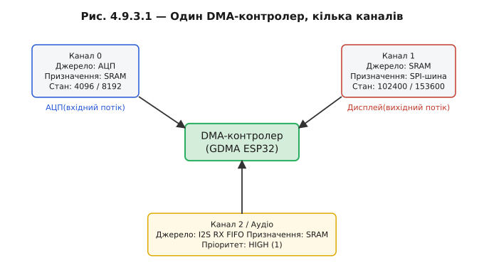

# Канали, дескриптори, пріоритети

Реальний пристрій рідко має один потік даних. Одночасно може йти безперервне оцифровування мікрофона, виливатися кадр на дисплей і наповнюватися буфер із шини. Якщо один DMA-контролер — один конвеєр, їх треба якось чергувати. Саме для цього служать **канали**.

### Канали

**Канал** (*DMA channel*) — це незалежний набір регістрів усередині одного контролера: своє джерело, своє призначення, свій лічильник, свій статус. Кілька каналів розділяють одну шину і один арбітр, але кожен веде власний потік — вони не плутають один одного, бо стан зберігається окремо.

На ESP32 DMA пройшов два покоління. У ранніх чіпах кожна периферія мала власний невеликий DMA-блок, вбудований у неї саму. Новіші серії отримали загальний **GDMA** (*General DMA*) — пул незалежних каналів, кожен з яких можна програмно прив'язати до будь-якої периферії. Це дає гнучкість: хочете більше каналів на АЦП — прив'яжіть кілька; звільнили дисплей — канал доступний для іншого.



*Рис. Один DMA-контролер з пулом каналів: канал 0 — АЦП, канал 1 — дисплей-шина, канал 2 — аудіо. Кожен зі своїм джерелом, призначенням і лічильником довжини.*

### Дескриптори

Один канал із простим налаштуванням (src, dst, len) переносить **один** безперервний блок і зупиняється. Але що, якщо дані розкидані по пам'яті або потрібен нескінченний потік? Відповідь — **дескриптори** (*DMA descriptors*): невеликі структури, що описують окремі шматки передачі й пов'язані в список.

Типова структура дескриптора (спрощена версія `lldesc_t` із ESP-IDF):

```c
typedef struct dma_desc_s {
    uint32_t  owner     : 1;   /* 1 = DMA, 0 = CPU */
    uint32_t  eof       : 1;   /* кінець ланцюга (transfer-complete IRQ) */
    uint32_t  sosf      : 1;   /* start-of-sub-frame (аудіо) */
    uint32_t  length    : 12;  /* реальна кількість байтів у buf */
    uint32_t  size      : 12;  /* розмір buf (максимум) */
    uint8_t  *buf;             /* вказівник на буфер даних */
    struct dma_desc_s *next;   /* наступний дескриптор (NULL = кінець) */
} dma_desc_t;
```

Поле `owner` — ключове: якщо `1`, буфер «належить» DMA і CPU не сміє його чіпати; якщо `0` — DMA завершив і буфер повернутий CPU. Це апаратний замок без жодного mutex.

**Scatter-gather**: вказівники `buf` різних дескрипторів можуть показувати на розкидані ділянки пам'яті. DMA переносить їх поспіль у шину як суцільний потік — одержувач не бачить «зшивок». Це зручно для протоколів, де заголовок і дані зберігаються окремо.

**Кільцевий список**: якщо поле `next` останнього дескриптора вказує на перший, утворюється кільце. DMA безкінечно крутиться по ньому, доки ядро не скаже зупинитись. Саме так будується безперервний потік із [подвійним буфером](book:programming/double-buffering): поки DMA наповнює один буфер кільця, ядро обробляє інший.

```c
/* Два дескриптори для ping-pong (заготовка) */
static dma_desc_t descs[2];
static uint8_t buf_a[BUF_SIZE] __attribute__((aligned(32)));
static uint8_t buf_b[BUF_SIZE] __attribute__((aligned(32)));

void dma_descs_init(void) {
    descs[0].owner  = 1;          /* належить DMA */
    descs[0].eof    = 1;          /* переривання після цього буфера */
    descs[0].length = 0;          /* поки 0, DMA заповнить */
    descs[0].size   = BUF_SIZE;
    descs[0].buf    = buf_a;
    descs[0].next   = &descs[1];  /* → другий */

    descs[1].owner  = 1;
    descs[1].eof    = 1;
    descs[1].length = 0;
    descs[1].size   = BUF_SIZE;
    descs[1].buf    = buf_b;
    descs[1].next   = &descs[0];  /* → назад у перший (кільце) */
}
```


*Рис. Анатомія дескриптора й зв'язаний список: поля buf-ptr, length, owner/eof, next-ptr. Стрілки next замикаються в кільце; buf-вказівники показують на розкидані буфери (scatter-gather).*

### Пріоритети й арбітраж шини

Два канали хочуть шину одночасно. Арбітр дивиться на пріоритет і пропускає вищий. Аудіо зазвичай отримує HIGH — будь-яка затримка чутна як клацання. Дисплей може почекати кілька мікросекунд — людське око не помітить затримки одного пікселя.

Але пріоритет вирішує тільки **порядок у черзі**, а не пропускну здатність. Якщо сумарний трафік перевищує те, що фізична шина здатна перенести, жоден пріоритет не врятує — вищий канал просто отримає свою квоту, а нижчий голодуватиме.

**Чи вистачить шини**

```
ESP32 AHB шина:  ≈ 80 МБ/с (практичний максимум при 80 МГц)
Ядро (код+стек): ≈ 20 МБ/с  (орієнтовно при активній роботі)

Навантаження каналів:
  Дисплей 320×240, RGB565, 30 FPS:
    = 320 × 240 × 2 × 30 ≈ 4.6 МБ/с  → назвемо 5 МБ/с

  Аудіо 48 кГц стерео 16 біт:
    = 48 000 × 2 × 2 = 192 кБ/с ≈ 0.2 МБ/с

Разом: 20 + 5 + 0.2 = 25.2 МБ/с < 80 МБ/с → запас ≈ 55 МБ/с, ОК.

Якби дисплей 60 FPS + 4K-текстури (гіпотетично, 50 МБ/с):
  20 + 50 + 0.2 = 70.2 МБ/с → залишок 10 МБ/с, пріоритет важить, але граничне.
```

> 🔧 **Навіщо це:** канал — «налаштування один раз», дескриптор — «маршрут», пріоритет — «хто перший на вузькій шині». Нерозуміння саме цих трьох речей дає 90% помилок DMA: або потоки плутають один одного (немає каналів), або DMA зупиняється на межі блоку (немає кільця дескрипторів), або аудіо клацає (хибний пріоритет при насиченій шині).


*Рис. Арбітраж: два канали підняли запит, арбітр пропускає високопріоритетний (аудіо), притримує нижчий (дисплей). Смужка пропускної здатності шини ділиться між ядром і каналами.*

Детальніше про scatter-gather своїми словами — ⚙️ r09-s3-a-descriptors.

---
