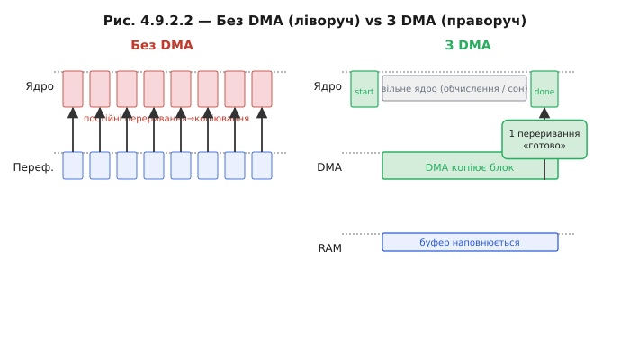

# DMA-контролер: окремий «копіювальник» на шині

Коли периферія генерує дані потоком, [гнати кожен байт через ядро марнотратно](book:programming/dma-problem) — але хто тоді їх возить? Відповідь: окремий апаратний блок на тій самій шині, що й ядро. Подумайте про фізичну схему системи на кристалі: ядро Xtensa LX7, блок SRAM, блок периферії — і між ними системна шина AHB/AXI. Тепер уявіть, що до тієї самої шини підключений ще один невеликий автомат — **DMA-контролер** (*Direct Memory Access controller*). Він уміє рівно одне: отримати команду «перенеси N байтів з адреси src на адресу dst» і виконати її, посилаючи транзакції на шині так само, як це робило б ядро.

Різниця в тому, що ядро в цей час може займатися чим завгодно.


*Рис. Ядро, DMA-контролер, RAM і периферія на спільній шині. Стрілка даних іде периферія → DMA → RAM, обходячи ядро. Ядро лише налаштовує маршрут і отримує одне переривання наприкінці.*

**Як ядро запускає DMA.** Контролер DMA — теж периферія [з відображенням у пам'ять](book:programming/memory-mapped-io). Ядро пише в кілька регістрів: адресу джерела, адресу призначення, кількість байтів, напрям і параметри (ширина слова, режим кільця тощо). Потім записує біт «старт» у регістр керування. Все — ядро більше не потрібне для цієї операції.

**Майстер шини.** Будь-хто, хто може починати транзакції на шині самостійно (без запиту до іншого пристрою), називається **майстром шини** (*bus master*). Ядро — майстер. DMA — теж майстер. Але шина одна, і два майстри не можуть говорити одночасно. Арбітр вирішує, чия черга. Якщо ядро не займає шину (наприклад, виконує код із кешу), DMA «краде» цикл шини й переносить черговий блок даних. Це явище називають **крадіжкою циклів** (*cycle stealing*): ядро навіть не помічає, що шина на мить перейшла до іншого майстра.

**Звідки сигнал.** Периферія не чекає, поки DMA сам здогадається прийти. Коли АЦП зробив вимір і регістр даних готовий, він піднімає лінію **DMA-запиту** (*DMA request*, DREQ). DMA-контролер реагує апаратно — без жодної участі ядра — і переносить слово даних у буфер. Так синхронізація потоку лягає цілком на залізо: ядро не бере участі ні в опитуванні, ні в копіюванні.

**Одне переривання на блок.** Коли DMA переніс весь замовлений блок, він піднімає переривання «готово» (transfer complete). Ядро прокидається, забирає готовий буфер і, можливо, ставить наступний. Це рідкісна і корисна подія, не щоразова. У [виборі між поллінгом і перериваннями](book:programming/polling-vs-interrupts) DMA зсуває баланс різко на користь переривань: тепер переривання відбувається не на кожен байт, а на кожен буфер.

**Скільки переривань заощадив DMA**

```
Без DMA (переривання-на-байт):
  f_data   = 500 000 байт/с
  ISR/с    = 500 000

З DMA (буфер 1024 байти):
  ISR/с    = 500 000 / 1024 ≈ 488

Зменшення: 500 000 / 488 ≈ 1024 рази

Частка CPU при 120 тактів/ISR, 240 МГц:
  Без DMA: 60 000 000 / 240 000 000 = 25%
  З DMA:   488 × 120 / 240 000 000 ≈ 0.024%
```

Різниця в тисячу разів — не тому, що DMA «швидша» апаратура; байт транслюється через шину однаково довго. Різниця в тому, що **ядро звільнене**: воно не стоїть між кожним байтом і пам'яттю.

> 🔧 **Навіщо це:** DMA не прискорює шину — він прибирає ядро з циклу копіювання. Виграш вимірюється не тактами на байт, а звільненим часом ядра і різким скороченням кількості переривань.



*Рис. Ліворуч (без DMA): ядро в постійному циклі copy-copy-copy. Праворуч (з DMA): ядро дало «старт», велика вільна зона, DMA веде копіювання, наприкінці — одна стрілка «done» назад у ядро.*

Варто зазначити й зворотний бік: для дуже коротких блоків (десятки байтів) DMA має **фіксований стартовий overhead** — записати регістри, налаштувати канал. Звичайний `memcpy` у цьому діапазоні виграє. Де саме проходить межа — залежить від конкретної периферії й шини, але зазвичай це 64–256 байтів (⚙️ r09-s2-a-memcpy-vs-dma).

---
