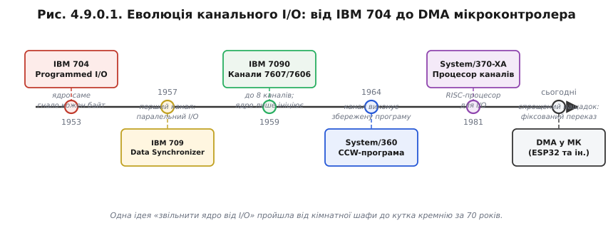
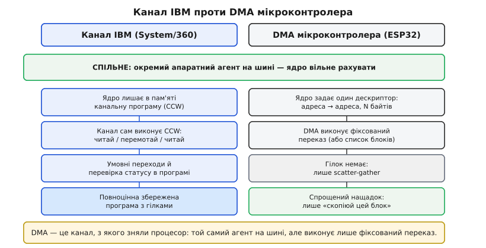

# 📜 Канальні процесори IBM: як мейнфрейми навчилися копіювати дані без участі ядра

Ще у 1950-х, задовго до того як хтось вимовив слово «DMA», інженери IBM зіткнулися з тією самою бідою, яку розв'язує [прямий доступ до пам'яті](book:programming/dma-problem): центральний процесор надто дорогий, щоб витрачати його на перекладання байтів. Наскрізна ідея цієї історії проста й потужна — **звільнити ядро від чорнової роботи вводу-виводу, доручивши її окремому апаратному виконавцю**: спершу «синхронізатору», потім «каналу», зрештою — повноцінному процесору каналів. Сучасний DMA-контролер у ESP32 — прямий, але спрощений нащадок цієї лінії; саме тому розуміти її коріння означає розуміти логіку будь-якого даташита, де зустрічаються слова «channel», «descriptor», «bus arbitration».

Питання, на яке відповідає вся ця історія, звучить так: що робити, коли потік даних виявляється швидшим за цикл «прочитав регістр → записав у пам'ять → повторив»? Простим [опитуванням](book:programming/polling-vs-interrupts) тут не обійтись — ядро просто не встигає. Відповідь виявляється **старшою за мікроконтролери на шістдесят з гаком років**: мейнфрейми дали її першими, і вона вийшла настільки правильною, що її, лише спростивши й здешевивши, перенесли в кожен сучасний МК. Те, що в копійчаному чипі здається сучасним блоком, насправді втілили ще 1957 року в залізі за мільйони доларів.

*Понад 60 років однієї ідеї: від ядра, що саме гнало кожен байт (704), через перший «синхронізатор даних» (709, 1957) і канальну мову CCW (System/360, 1964) до окремих процесорів каналів — і до спрощеного DMA в кожному мікроконтролері. Висновок: DMA ESP32 — прямий нащадок мейнфрейм-каналу.*

## Дороге ядро й повільна периферія: спільна біда мейнфрейма і мікроконтролера

Щоб відчути масштаб проблеми, варто на мить опинитися в середині 1950-х. Лампові й ранньотранзисторні ядра тих машин коштували казкових грошей: установка IBM коштувала мільйони доларів на рік оренди, і кожна мілісекунда простою ядра була буквально дорогою. Водночас периферійне обладнання — магнітні стрічки, перфокарткові зчитувачі, рядкові принтери — працювало на порядки повільніше за електронні схеми. Доки стрічка механічно перемотувалась і видавала черговий запис, ядро могло б виконати тисячі арифметичних операцій; але замість цього воно стояло й чекало.

Те, як працював **IBM 704** (1953–1960), добре задокументовано: ввід-вивід там був «програмною функцією центрального процесора» (*programmed function of the central processor*). Ядро видавало команду, само гнало кожне слово на стрічку, само перевіряло готовність пристрою, само переходило до наступного слова. Назва цьому підходу — **programmed I/O** (програмний ввід-вивід), і це той самий цикл [опитування](book:programming/polling-vs-interrupts), де ядро в петлі перевіряє стан регістра. На мікроконтролері такий цикл із АЦП виглядає звично: `while (!(ADC->STATUS & DONE)) {}`. Сотні тисяч доларів на місяць — і все це заради `while`-петлі, яку написали б і на мікроконтролері за три долари.

Кількісна оцінка не потребує вигаданих цифр — лише порядку величин. Тактова частота IBM 704 — близько 40 кілогерців, типова пропускна здатність магнітної стрічки тієї епохи — кілька тисяч символів на секунду. Тобто на кожен переданий байт ядро витрачало десятки тактів очікування; поки стрічка механічно переповзала між записами, ядро простоювало мілісекундами — це мільйони марних тактів. З погляду економіки машинного часу це катастрофа, бо клієнт платив саме за такти ядра, а не за такти очікування стрічки.

Інженерна ціль сформулювалася з цього тиску чітко: **зробити так, щоб ядро ініціювало ввід-вивід і негайно поверталося до корисної роботи, а перекладанням байтів займався хтось інший**. Цей «хтось інший» мав бути апаратним — достатньо дешевим, щоб не перевищити бюджет; достатньо автономним, щоб не тривожити ядро на кожному байті; й достатньо розумним, щоб знати, коли він закінчив і час сповістити ядро. Саме такого «когось іншого» вперше збудували для машини IBM 709 — і назвали його синхронізатором даних.

## 1957, IBM 709: перший канал на ім'я «синхронізатор даних»

IBM 709 вийшла в 1957 році й увійшла в технічну літературу з однозначним титулом — перша машина з канальним вводом-виводом (*channel I/O*). Її апаратний новий блок, **Model 766 Data Synchronizer**, описаний в архівній документації IBM як «the first channel controller» — перший контролер каналу. Дамо двомовне ім'я одразу: **синхронізатор даних** (*data synchronizer*), **канал** (*channel*).

Якісно підхід суттєво відрізнявся від моделі 704. На 709 з'явилося два незалежно «програмованих» (у широкому розумінні — конфігурованих) канали вводу-виводу. Вони буферували обмін між периферією та пам'яттю так, що «арифметично-логічний вузол міг бути зайнятий корисною роботою, поки ввід-вивід ішов паралельно» — це перефраз технічної документації тієї епохи, і ключове слово тут **паралельно**. Ядро більше не чекало: воно доручало каналу «перекинь цей блок» і поверталося рахувати матрицю або виконувати бізнес-логіку, доки синхронізатор без жодної участі ядра тягнув байти зі стрічки в оперативну пам'ять.

Контраст із 704 принциповий. На 704 ядро — єдиний актор на шині, і ввід-вивід поглинає весь його час; на 709 з'явився окремий апаратний агент, який отримує від ядра «замовлення» на блок даних і виконує його самостійно. Це й є зародок того, що ми звемо DMA (*direct memory access* — прямий доступ до пам'яті): дані ідуть прямо між периферією і пам'яттю, оминаючи регістри й виконавчий конвеєр ядра.

Важливо сказати чесно: канал на IBM 709 — не раптовий геніальний винахід однієї людини; це **колективна інженерна відповідь** на добре усвідомлений економічний тиск. Команди IBM бачили, що дорогий ЦП марнується на побайтовий ввід-вивід, і дали ринку машину, де апаратний агент звільняв ядро від цієї роботи. Схема виявилася настільки правильною, що транзисторний наступник не змінив її принципово — він лише масштабував і впорядкував.

Ламповий 709 довів ідею в залізі; транзисторний наступник зробив її системою — і дав словникове ім'я, яке закріпилося: **data channel**.

## 1959–60, IBM 7090: канали стають окремою підсистемою

IBM 7090 (1959) — транзисторна переробка архітектури 709, яка стала символом другого покоління мейнфреймів. Один із найважливіших її аспектів для нашої теми — масштабований канальний ввід-вивід: машина підтримувала **від двох до восьми** 6-бітних каналів даних (модель **7607**) і окремий **канальний мультиплексор** (модель **7606**), що координував до восьми каналів одночасно. Пізніше з'явилися 8-бітні канали 7909 — для ширшої смуги. Двомовно: **канал даних** (*data channel*), **канальний мультиплексор** (*channel multiplexer*).

Але важливіший за кількість — якісний зсув у ролі ядра. Технічна документація IBM 7090 описує це влучно: роль центрального процесора в операціях вводу-виводу стала «ще більш відстороненою» (*even more remote*). На 7090 ядро вже не маршрутизувало окремі слова і не розпізнавало межі записів чи блоків — це тепер робив канал самостійно. Ядро лише **ініціювало й наглядало**: запустити, перевірити завершення, обробити помилку. Усе між цими точками — апаратний канал без участі ядра.

Те, що канал «сам відстежує межі даних», — зерно ідеї [дескрипторів](book:programming/dma-channels) і scatter-gather: агент пересилання знає не просто «копіюй N байтів», а структуру передачі — де починаються й закінчуються логічні фрагменти. На 7090 ця структурна свідомість ще примітивна, але напрям думки той самий: **винести «програму переказу» з ядра в периферійний агент**.

Доти кожна модель IBM мала канали «по-своєму» — різна ширина, різна кількість, різна поведінка. Навести лад і перетворити канал на архітектурний стандарт судилося System/360.

## 1964, System/360: канал отримує власну мову — channel command words

System/360, оголошена IBM у квітні 1964 року, — родина сумісних між собою машин різної потужності та ціни; одним із наріжних каменів цієї сумісності став **стандартизований канальний ввід-вивід**. Дамо двомовні терміни одразу: **канальна програма** (*channel program*), **канальне командне слово** (*channel command word, CCW*), **підканал** (*subchannel*), **канальна підсистема** (*channel subsystem*).

Головна ідея System/360 у частині вводу-виводу — та, яку варто зрозуміти глибоко, бо вона докорінно змінила архітектуру: ядро більше не описує операцію командою за командою в режимі реального часу. Натомість програміст (або операційна система) складає в пам'яті **канальну програму** — послідовність CCW, кожне з яких описує одну атомарну дію: читай стільки-то байтів звідси, запиши туди, перемотай стрічку, перейди до наступного CCW за умови успіху. Після цього ядро дає каналу **одну** команду: «виконай цю програму» — і повертається до власної роботи. Канальна підсистема зчитує CCW зі звичайної оперативної пам'яті й виконує їх одне за одним, не тривожачи ядро. Коли програму завершено (або виникла помилка), канал генерує переривання.

Це рішення принципово якісне: замість «DMA, який копіює один фіксований блок», з'явився **DMA, що виконує збережену програму**. Канал — це малий процесор з власним «кодом» (CCW-ланцюгом) у пам'яті. Ядро передає йому «завдання», а не «мікрокоманди».

Архітектори System/360 запровадили три типи каналів — і це не примха класифікації, а **інженерний компроміс між швидкістю і кількістю пристроїв**:

**Селекторний канал** (*selector channel*) — один підканал, одна операція за раз. Він повністю віддає свою смугу одному пристрою — наприклад, магнітній стрічці або диску — на весь час переказу. Логіка проста: швидкий пристрій потребує широкої смуги без перебоїв, і ділити її з іншими не має сенсу.

**Байт-мультиплексорний канал** (*byte-multiplexer channel*) — одночасно обслуговує багато повільних пристроїв (перфокарткові зчитувачі, принтери, телекомунікаційні лінії), чергуючи їх по одному байту на власній швидкості кожного. Звідси й назва: канал буквально «мультиплексує» одну фізичну лінію між десятками повільних абонентів. Це прямий предок ідеї **поділу одного ресурсу між кількома потоками** — того самого принципу, що лежить в основі [арбітражу DMA-шини](book:programming/dma-channels).

**Блок-мультиплексорний канал** (*block-multiplexer channel*) — пізніше доповнення (моделі 85 і 195): кілька канальних програм «в повітрі» одночасно, але активна тільки одна. Ключова властивість: пристрій може **призупинити** з'єднання на час механічної затримки — наприклад, поки диск шукає доріжку (seek) — і звільнити канал для іншого пристрою, а потім відновити своє з'єднання. Це аналог [пріоритетів шини](book:programming/dma-channels) і того, чому DMA-контролер не тримає шину марно під час паузи.

> 🔧 **Навіщо це розробнику МК.** Слова «канал», «дескриптор», «пріоритет шини» у контексті ESP32 — це не вигадка конкретного вендора. Це усталений за шістдесят років словник, який ввела System/360 у 1964-му. Розуміти коріння означає читати будь-який даташит — STM32 «DMA streams», ESP32 «DMA channels/descriptors», NXP «eDMA» — як діалекти однієї мови, а не як щоразу нову термінологічну головоломку. Практичний ключ: **канал = DMA, що виконує список операцій**, а не одну — саме тому в DMA з'являються [зв'язані списки дескрипторів](book:programming/dma-channels), які є прямим спадкоємцем CCW-ланцюга.

## Від каналу до DMA: те саме, тільки простіше

Поставимо питання прямо, бо воно природно виникає: чим канал System/360 відрізняється від DMA мікроконтролера? Технічна відповідь добре задокументована: канал — «not unlike DMA, only more complex and advanced» (*не на відміну від DMA, лише складніший і досконаліший*). DMA виконує **фіксований переказ** — взяти N байтів з адреси A і покласти на адресу B, а потім видати переривання. Канал виконує **збережену програму**: CCW-ланцюг зі справжніми умовними переходами, перевіркою статусних кодів пристрою, командами для механічних операцій (перемотати стрічку, перемістити головку), циклічними повторами.

Точна аналогія звучить так: **DMA — це канал, з якого прибрали процесор і залишили один-єдиний жорстко зашитий наказ «скопіюй цей блок»**. Мікроконтролеру не потрібна вся міць мейнфрейм-каналу: у нього немає магнітних стрічок із механічними затримками й складними протоколами пристроїв; йому достатньо дешевого «копіювальника», що гонить байти між периферійним регістром і ОЗП без участі ядра.

Де аналогія ламається — теж важливо. У каналі IBM «програма» повноцінна: є розгалуження (*branch if not end of chain* — перейти, якщо не кінець ланцюга), є перевірки (*test for device end* — відреагувати на завершення пристрою), є команди для механічних операцій зі стрічкою. CCW-ланцюг може розгалужуватися залежно від результату попередньої операції, може повторювати блоки — це справжній малий процесор із власним форматом інструкцій. У DMA мікроконтролера «дескриптор» — щонайбільше [зв'язаний список блоків](book:programming/dma-channels) (scatter-gather), без умовних переходів. Тобто DMA запозичив від каналу **ідею окремого агента на шині**, але повну програмованість залишив мейнфреймам — там вона й живе досі. Для вбудованих систем така програмованість була б надмірною витратою кремнію: якщо завдання — гнати вибірки АЦП у кільцевий буфер або пересилати SPI-пакети, фіксованого переказу цілком вистачає.

Термінологічна спадкоємність — пряма: «канал» (*channel*) у DMA ESP32 є нащадком Channel I/O; «дескриптор» (*descriptor*) — спрощений CCW; «пріоритет шини» — спадкоємець арбітражу між мультиплексорними каналами. Майже кожен термін сучасного DMA має своє ім'я вже з 1964 року.

*Канал проти DMA. Канал IBM виконує збережену програму (послідовність CCW) з гілками й перевірками; DMA мікроконтролера — спрощений нащадок: той самий окремий агент на шині, але виконує лише фіксований переказ чи список блоків. Спільне — ядро звільнене; різне — програмованість. Саме тому дескриптори DMA простіші за CCW.*

Ця ідея виявилася настільки потужною, що канали почали жити власним життям — буквально окремими процесорами в шафі.

## Канал виростає в окремий процесор (і паралель у суперкомп'ютерах)

Дугу подальшої еволюції варто показати чесно — вона розходиться в обидва боки водночас: **вгору** до повноцінних окремих процесорів і **вниз** до мікрокодних блоків усередині ЦП.

На молодших і дешевших моделях System/360 і 370 канал реалізовувався як **мікрокод на тому самому кристалі ЦП** (режим CPU/Channel Mode) — здешевлення архітектури для малих машин. Це прямий аналог того, як сьогодні DMA-контролер живе поруч із ядром ESP32 як периферійний блок на тому самому кристалі. На старших моделях — навпаки: **окремі громіздкі блоки** (2860 — селекторний канал, 2870 — байт-мультиплексор, 2880 — блок-мультиплексор), кожен із власним шасі й блоком живлення.

З приходом серії **303x** наприкінці 1970-х канали еволюціонували в незалежні **«директори каналів»** (*channel directors*) у тій самій шафі, що й основний процесор. А в архітектурі **System/370-XA** (розширена архітектура, 1981) з'явилася виділена **канальна підсистема** (*channel subsystem*) — окремий RISC-процесор або мікрокодований двигун, що самостійно управляє чергою I/O-запитів, виконує CCW-програми і сигналізує ядру лише по завершенні. Канал пройшов повне коло: ідея → стандарт → власний процесор.

Але паралельна лінія розвитку йшла не лише в IBM. **UNIVAC 490**, **CDC 1604**, **Burroughs B5000**, **GE 635** — всі вони мали варіанти канальних або периферійних процесорів, розроблені незалежно, щоб розв'язати ту саму задачу. Найяскравіший приклад — **CDC 6600** (1965), спроектована Сеймуром Креєм (*Seymour Cray*). У ній **десять периферійних процесорів** (*peripheral processors, PP*) брали на себе весь ввід-вивід і системні операції, поки центральне ядро (Central Processor) рахувало на повній швидкості без жодних переривань. PP — це не контролер у розумінні «підпорядкована мікросхема»: кожен із них мав власний набір команд, власний лічильник програми й окрему пам'ять для системних завдань. Вони по черзі отримували квант часу на спільній шині і виконували операції вводу-виводу, завантаження задач, планування. CDC 6600 стала найшвидшим суперкомп'ютером свого часу саме завдяки цьому розподілу праці — окремі PP звільняли CP від будь-якої сторонньої роботи, і CP міг жодного разу не перерватися протягом усієї числової задачі. Тобто те саме рішення — «хай I/O виконує окремий процесор, а ядро рахує» — народилося незалежно в кількох командах по обидва боки від IBM. Це не одна інженерна лінія, а **загальна відповідь галузі** на одну й ту саму проблему.

Від шафи завбільшки з кімнату ця ідея зрештою стислася до кутка кремнію в копійчаному чипі — у DMA-контролер ESP32.

## Що з цього бере розробник ESP32: канал, що помістився в кутку чипа

Нитка цієї історії — одна. **Окремий агент перекладає дані, поки ядро рахує** — цей принцип пройшов шлях: синхронізатор IBM 709 (1957) → канали IBM 7090 (1959) → CCW і три типи каналів System/360 (1964) → директори каналів 303x → процесори каналів System/370-XA (1981). І в спрощеному, здешевленому вигляді він сидить тепер у кожному мікроконтролері як DMA. Те, що колись займало окрему шафу й коштувало місячної зарплати цілого заводу, тепер — безкоштовний блок периферії поряч із двома ядрами ESP32.

DMA повторює це коріння в кожному терміні: **[контролер-«копіювальник» на шині](book:programming/dma-controller)** — нащадок синхронізатора 709, який уперше відрізав ядро від потоку байтів; **[канали й дескриптори](book:programming/dma-channels)** — спрощені CCW, ті самі «малі програми переказу», лише без розгалужень і умов; **пріоритети шини й арбітраж** — спадкоємець логіки мультиплексорних каналів, де селектор «віддає» всю смугу одному пристрою, а мультиплексор ділить між кількома; **ping-pong і потокове читання [АЦП](book:programming/dma-adc) чи [SPI/I2S](book:programming/dma-spi-i2s)** — втілення тієї самої ідеї «ввід-вивід паралельно з обчисленням», заради якої все й починалося 1957 року.

Чесне розрізнення тут обов'язкове, щоб не переоцінити DMA. Мейнфрейм-канал умів виконувати **програму** зі справжніми розгалуженнями й перевірками; DMA мікроконтролера — лише фіксований переказ або список блоків без умовних переходів. Тому й пастки в нього **інші** і «дрібніші» — не складність повноцінного процесора каналів, а [гонки з кешем](book:programming/dma-cache-races), порушення цілісності буфера, вирівнювання. Ця різниця — не слабкість DMA, а свідомий компроміс: простота й дешевина в обмін на функціональність, яка в МК просто не потрібна.

Ось і вся архітектурна спадщина — передана з мейнфреймів до вбудованих систем через сімдесят років і кілька поколінь інженерів.
