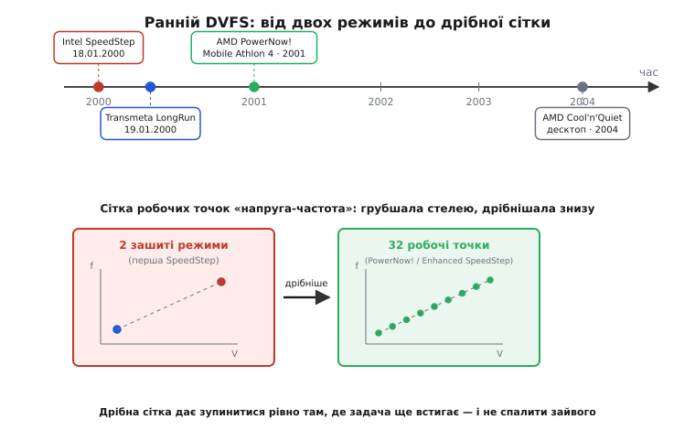

# 📜 Як ноутбук навчив процесор збавляти оберти

Наприкінці 1990-х настільний комп'ютер жив у світі без обмежень. Він стояв у розетці, мав великий кулер, і єдина мета інженера була одна: більше мегагерців, більше продуктивності, будь-якою ціною. Потужність нікого особливо не турбувала — стіна, у яку індустрія вперлася пізніше (коли [зростання частоти вбило теплопакет](book:programming/power-wall)), тоді ще була попереду. А процесор, який завжди працює на повній швидкості й повній напрузі, — це найпростіша річ на світі: подав живлення, задав такт, і хай молотить.

Але паралельно ріс інший ринок, і в ньому були зовсім інші правила. Ноутбук не в розетці. Ноутбук живе від батареї, а батарея скінченна. І тут виявилося, що той самий процесор, який на столі був героєм, у сумці був катастрофою: він однаково жер повну потужність і тоді, коли ти компілював код, і тоді, коли ти просто читав текст, де за секунду відбувається одне натискання клавіші. Дев'яносто дев'ять відсотків часу могутнє ядро палило ват на те, щоб чекати на людину. Батарея сідала за годину-півтори, і з цим треба було щось робити.

Ця вставка — про те, як за якихось кілька років, на межі тисячоліть, троє гравців майже одночасно навчили кремній робити те, що доти здавалося зайвим і навіть небезпечним: **на льоту збавляти собі і такт, і напругу**, коли роботи мало. І про те, як ця техніка пройшла шлях від грубого перемикача на два положення до плавного регулятора з десятками робочих точок.

## Чому це не робили раніше

Спокуса запитати: а що заважало? Ідея ж очевидна — мало роботи, збав швидкість. Насправді заважало кілька цілком реальних речей, і саме їх довелося долати.

Перша — інерція мислення. Процесор проєктували як синхронну схему з **однією** цільовою частотою й **однією** напругою живлення. Уся часова інженерія — довжини критичних шляхів, запаси на затримки, перевірка на найгіршому куті технології — усе рахувалося під цю одну точку. Дозволити чипу працювати на кількох напругах означало верифікувати його **на кожній** з них: на нижчій напрузі транзистори мляві, критичний шлях довшає, і треба довести, що на зниженій парі «напруга-частота» він усе одно не помиляється. Це подвійна (чи потрійна) робота там, де раніше була одна.

Друга — залізо навколо. Знизити частоту нескладно: досить переналаштувати дільник такту. А от знизити **напругу** ядра — це вже не справа процесора, це справа регулятора живлення на материнській платі. Регулятор мусив уміти видати не одну фіксовану напругу, а кілька, та ще й перемикатися між ними за командою. Таких регуляторів у масовому ноутбуку просто не було — їх довелося вводити разом із самою технологією.

Третя, найтонша, — **порядок і безпека переходу**. Якщо просто взяти й опустити напругу, лишивши високу частоту, чип на мить опиниться в стані, де вентилі вже кволі, а такт ще швидкий, — і засіче на тригерах сміття. Тобто мало було вміти міняти дві величини; треба було міняти їх у правильній послідовності й вичікувати, поки повільний регулятор напруги встановиться. Ця дисципліна переходу — окрема інженерна культура, якої теж не існувало.

Тож питання було не «чому не додумалися», а «чому досі не мусили». Настільний ринок не тиснув — там була розетка. Тиск прийшов від батареї, і саме мобільний ринок став полем, де все це вперше зробили по-справжньому.

## Intel SpeedStep: грубий, але перший масовий

18 січня 2000 року Intel оголосила технологію, яку назвала **SpeedStep**, разом із новими мобільними процесорами Pentium III. Прапороносцем став **Mobile Pentium III 600 МГц**. Це дата, з якої динамічне масштабування у ноутбуках перестало бути дослідницькою ідеєю й стало продуктом, який можна купити.

За сьогоднішніми мірками перша SpeedStep була навдивовижу грубою. Вона мала рівно **два** стани, і обидва були намертво зашиті на заводі — програма не могла ні задати свою напругу, ні свою частоту, лише перемкнути один режим на інший:

- **Maximum Performance Mode** — повна частота (600 МГц на первістку) і повна напруга. Так процесор працював, коли ноутбук стояв у розетці.
- **Battery Optimized Mode** — знижена частота (у первістка — 500 МГц) і знижена напруга, режим для життя від батареї.

І — найпоказовіше — **чим саме перемикати режим, вирішувало не завантаження процесора, а джерело живлення**. Увімкнув ноутбук у мережу — SpeedStep стрибав у Maximum Performance. Висмикнув шнур — падав у Battery Optimized. Логіка була буквально «є розетка / нема розетки», а не «є робота / нема роботи». Користувач міг перекрити це вручну через утиліту, але сама автоматика дивилася на адаптер, не на навантаження.

Порівняймо це з фізикою, заради якої все затівалося. Уся економія DVFS живе у формулі динамічної потужності [КМОН-логіки](book:electronics/cmos):

```
P_дин = α · C · V² · f
```

Напруга входить у **квадраті**, тож найбільший приз — саме в її зниженні. Перша SpeedStep цей приз брала — знижений режим опускав і `f`, і `V` разом, — але брала його на дуже грубій сітці: одна сходинка вниз, і все. Між «повністю ввімкнено» й «повністю заощаджено» не було нічого. Це як коробка передач лише з першою й п'ятою, без проміжних. Працює, економить, але тонко підлаштуватися під поточну потребу не дає.

> 🔧 **Навіщо це.** Ця історія — гарний урок про те, що перший робочий продукт майже ніколи не буває витонченим. Intel не чекала на ідеальну систему з плавним регулюванням — вона випустила два зашитих режими, бо це вже давало відчутний виграш батареї й це можна було зробити швидко й надійно верифікувати. Тонкість прийшла наступними ітераціями. Інженерне рішення «зроби грубо, але вчасно й правильно» тут перемогло «зроби ідеально, але потім».

Варто розрізняти виміри того, що сталося. **Ідея** масштабувати напругу й частоту під навантаження була відома в академічних колах і раніше — про це писали, це моделювали. Але **робоча масова система в кремнії, яку купує пересічний покупець ноутбука**, — це вже інше досягнення, і саме його Intel зробила першою серед великих на настільно-мобільному ринку x86. Комерціалізація — окремий крок після ідеї й після лабораторного прототипу, і плутати їх не варто.

## Transmeta LongRun: плавно з першого дня — але з іншого боку

Буквально наступного дня, **19 січня 2000 року**, на події у Villa Montalvo (Саратога, Каліфорнія) крихітна й доти потайна компанія **Transmeta** зняла завісу зі свого процесора **Crusoe** — і разом із ним показала техніку керування живленням під назвою **LongRun**.

І ось тут контраст із SpeedStep разючий. Там, де в Intel було два зашитих режими за наявністю розетки, LongRun від першого дня масштабував напругу й частоту **плавно й за реальним навантаженням**: частоту — кроками по 33 МГц, напругу — кроками по 25 мВ у діапазоні приблизно від 1.2 до 1.6 В, і робив це до **двохсот разів на секунду**. Не «розетка / батарея», а безперервне стеження за тим, скільки роботи насправді є, з підстроюванням багато разів на секунду.

Звідки така фора? Крізь незвичну архітектуру. Crusoe всередині був не класичним x86-процесором, а простим **VLIW**-ядром (*very long instruction word* — дуже довге командне слово), а сумісність із x86 давав шар програми — **Code Morphing Software**, що на льоту перекладав x86-команди у власні команди ядра. Транслятор і без того постійно стежив за тим, які команди виконуються й наскільки завантажене ядро, — тож підключити до цього стеження ще й керування напругою-частотою було природно. Керування живленням у Crusoe значною мірою жило в **програмі**, а не в жорсткій апаратній автоматиці, і саме тому виходило таким гнучким.

Наслідок був відчутний. У типових режимах система на Crusoe споживала близько 6.5 Вт проти приблизно 16 Вт у зіставної збірки на Pentium III — приблизно втричі менше в активній роботі. Для ноутбука 2000 року це була вражаюча цифра.

Чому ж тоді ми всі не ходимо з нащадками Crusoe в кишені? Бо низьке споживання Transmeta купувала ціною продуктивності: трансляція x86 через програму коштувала тактів, і на важких задачах Crusoe помітно програвав «справжнім» x86-ядрам за швидкістю. Ринок зрештою обрав швидкість, і Transmeta не втрималася. Але для нашої історії важливо інше: **LongRun показав, що плавне, кероване навантаженням масштабування — не фантастика, а робочий продукт уже в січні 2000-го.** Просто діставався він не через грубу апаратну автоматику, а через розумну програму-транслятор.

## AMD PowerNow!: плавність приходить у класичний x86

Тим часом свою відповідь готувала **AMD**, і назвала її **PowerNow!**. Технологія дебютувала 2000 року в мобільних процесорах — на **Mobile K6-2+**, який AMD випустила **18 квітня 2000 року** на техпроцесі 0.18 мкм.

PowerNow! ідейно ближча до того, чим DVFS став пізніше, ніж перша SpeedStep. Замість «розетка / батарея» вона орієнтувалася на реальну потребу програми й дозволяла процесору динамічно міняти пару «частота-напруга» під поточну задачу. Це вже був крок від двопозиційного перемикача до регулятора.

По-справжньому різниця вилізла наступного року. У травні 2001-го AMD випустила **Mobile Athlon 4** на ядрі **Palomino** — і тут PowerNow! розгорнулася на повну: процесор умів перемикатися між **32 комбінаціями напруги й тактової частоти**, від найвищої (повна швидкість, повна напруга) до найнижчої економної. Тридцять дві сходинки замість двох — це вже не коробка з першою й п'ятою, а майже безступінчаста передача. Керування могло тонко шукати найдешевшу пару, на якій задача ще встигає, замість грубо кидати чип між двома крайнощами.

Порахуймо, наскільки це важить, тією самою кубічною логікою DVFS. Коли ми опускаємо напругу, ми **мусимо** слідом опустити й частоту (мляві вентилі — довший критичний шлях — нижча стеля такту). А оскільки і `V`, і `f` сидять у формулі потужності, зниження обох дає ефект, близький до **куба** напруги:

```
V → 0.75·V,  f → 0.75·f
P → (0.75)² · (0.75) · P₀ = 0.75³ · P₀ ≈ 0.42 · P₀
```

Скромні −25% по кожній ручці дають −58% потужності. Але щоб узяти цю економію **точно під поточну потребу**, а не грубими стрибками, потрібна саме дрібна сітка робочих точок. Ось чому перехід від 2 сходинок до 32 — не косметика: він дає системі змогу зупинитися рівно на тій парі, де задача ще встигає, і не платити ні ватом більше. Дві сходинки такої точності дати не можуть за визначенням.

> 🔧 **Навіщо це.** Слово «32 робочі точки» — це, по суті, попередник того, що в сучасних процесорах звуть **operating performance points** (робочі точки, OPP): наперед вивірена таблиця дозволених пар «напруга-частота», між якими система вільно ходить. Ідея таблиці готових, заводом перевірених точок, з якої керувальник вибирає найдешевшу придатну, народилася саме тут, у цих ранніх мобільних чипах. Сьогодні ви бачите її в даташиті будь-якого серйозного мікроконтролера.

## Розгін догори по сходах: Enhanced SpeedStep

Intel грубий старт довго не тримала. Наступні покоління SpeedStep (їх усередині компанії звали кодовим ім'ям Geyserville, а на ринку — **Enhanced Intel SpeedStep**) прибрали головне обмеження первістка: замість двох зашитих режимів процесор дістав змогу міняти **множник такту кроками по 1×** і підправляти напругу ядра дрібними кроками (порядку 16 мВ). Це вже була багатоточкова сітка, як у конкурентів, а не двопозиційний тумблер.

Так за якихось рік-два всі три підходи зійшлися в одну спільну картину: **набір багатьох робочих пар «напруга-частота», між якими система рухається за навантаженням**. Розійшлися вони лише **шляхами**, якими до цього дійшли:

- Intel — від грубої апаратної двопозиційної автоматики поступово до дрібної багатоточкової;
- AMD — одразу до багатоточкового керування навантаженням, що швидко доросло до 32 сходинок;
- Transmeta — до плавного масштабування через розумну програму-транслятор, а не через апаратну автоматику.

Три різні дороги, одна вершина. Це типова картина в історії техніки: коли дозріває **потреба** (тут — батарея, що сідає), рішення народжується не в одному місці, а в кількох одразу, і кожен винахідник приходить своїм маршрутом.


*Три майже одночасні кроки на межі 2000-го й еволюція вниз по сітці: Intel SpeedStep (2 зашиті режими за наявністю розетки), Transmeta LongRun (плавно через програму-транслятор, ~200 разів на секунду) та AMD PowerNow! (навантаженнєве керування, що доросло до 32 сходинок у Mobile Athlon 4). Ліворуч — груба сітка з двох положень, праворуч — майже безступінчаста; стрілка часу показує, як усі троє сходяться до багатоточкового масштабування.*

## Із сумки — на стіл: AMD Cool'n'Quiet

Уся ця історія почалася від батареї, тож і жила вона в ноутбуках. Але фізика `P = α·C·V²·f` не питає, у розетці пристрій чи ні: збавити напругу й частоту, коли роботи мало, вигідно **скрізь**. Настільний комп'ютер від цього виграє не годинами автономності, а меншим нагрівом і — як наслідок — **тихшим вентилятором**: холодніший процесор не змушує кулер вити на повних обертах.

Саме цю думку AMD винесла на десктоп 2004 року технологією **Cool'n'Quiet**, що дебютувала на процесорах **Athlon 64**. По суті це та сама PowerNow!, лише перелаштована під настільні звички роботи: процесор скидає такт і напругу, коли простоює, і піднімає, коли з'являється навантаження. Назви розвели за призначенням — **PowerNow!** лишилася маркою для мобільних чипів, **Cool'n'Quiet** стала маркою для настільних (а згодом і серверних), — але механізм під ними спільний: та сама пара «напруга-частота», що ходить за потребою.

Показово, як змістився сам **мотив**. У ноутбуці 2000-го DVFS рятував батарею. На десктопі 2004-го та сама техніка продавалася вже під гаслом тиші й прохолоди. А ще за кілька років, коли індустрія вперлася в [стіну потужності](book:programming/power-wall) й тепловий пакет став головним обмеженням продуктивності навіть для настільних і серверних чипів, ця сама здатність збавляти напругу-частоту перетворилася з приємного бонуса на **обов'язковий** інструмент. Народжене нуждою батареї, воно стало універсальним важелем енергоефективності.

## Що з цього лишилося

Оглянемося на короткий, але щільний відрізок — приблизно 2000–2004 роки:

- **18 січня 2000** — Intel SpeedStep, Mobile Pentium III 600 МГц: два зашиті режими за наявністю розетки. Грубо, але перший масовий продукт на x86-ринку.
- **19 січня 2000** — Transmeta LongRun у Crusoe: плавне масштабування навантаженням через програму-транслятор, ~200 разів на секунду.
- **18 квітня 2000** — AMD PowerNow! на Mobile K6-2+: навантаженнєве керування в класичному x86.
- **травень 2001** — Mobile Athlon 4 (Palomino): PowerNow! розгортається до 32 робочих пар — предок сучасних таблиць робочих точок.
- **далі** — Enhanced SpeedStep додає Intel дрібну сітку (кроки множника 1×, напруга кроками ~16 мВ).
- **2004** — AMD Cool'n'Quiet виносить ту саму техніку на десктоп (Athlon 64) — уже заради тиші й прохолоди, не батареї.

Статус доказовості всього переліку — **усталено**: дати й прапороносці підтверджені прес-релізами й документацією самих Intel, AMD і Transmeta, а не переказами.

Головний висновок цієї історії — не в датах, а в тому, **як зростала точність керування**. Шлях ішов від двопозиційного тумблера «повна швидкість / економія» до дрібної сітки з десятків заводом-вивірених пар «напруга-частота», між якими система вільно вибирає найдешевшу придатну. Груба сітка бере лиш крихти квадратичного виграшу напруги; дрібна дозволяє зупинитися рівно там, де задача ще встигає, і не спалити ні джоуля зайвого. Саме ця дрібна сітка готових робочих точок — а не сам факт «уміємо збавляти» — і є справжнім спадком тих кількох років на межі тисячоліть. Усе, що робить процесор у вашій кишені, коли то мчить, то повзе, виросло звідти.
