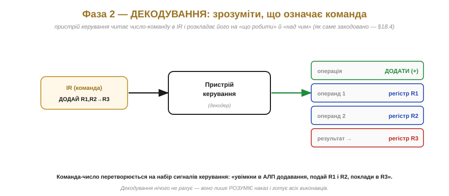
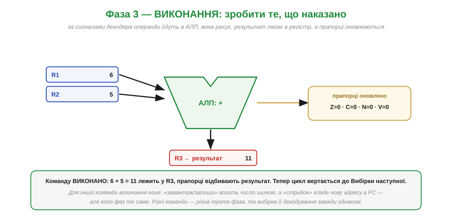
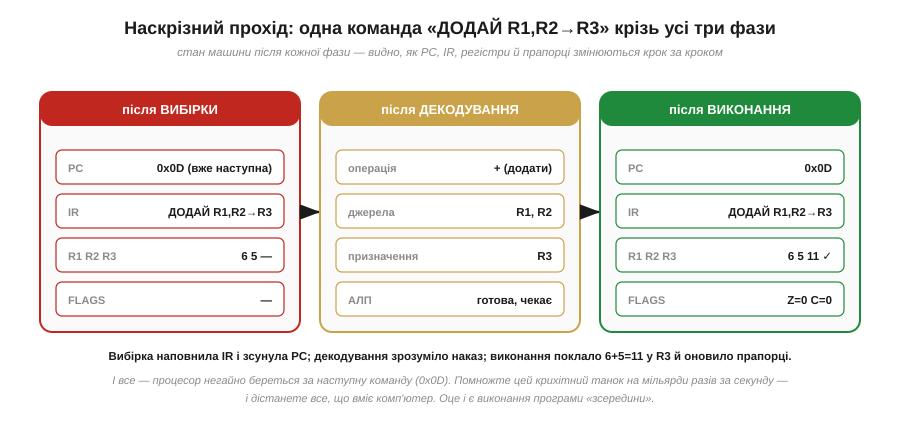
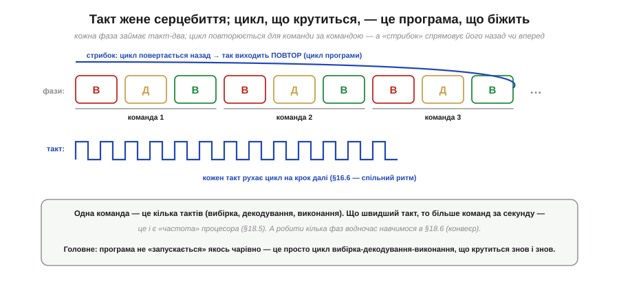

# Цикл «вибірка → декодування → виконання»

Маючи [процесор, розкладений на органи](book:programming/processor-parts), запустімо їх **у рух**. Бо процесор робить, по суті, одне-єдине — невпинно повторює коротке коло з трьох кроків, і кожен його оберт виконує рівно **одну** інструкцію. Це коло — **цикл «вибірка → декодування → виконання»** (*fetch–decode–execute cycle*), і його недарма звуть **серцебиттям** процесора: воно б'ється рівномірно, такт за тактом, від увімкнення живлення до вимкнення, мільярди разів на секунду. Зрозумівши цей цикл, ви зрозумієте найголовніше — **як насправді виконується програма**: не якимось чаклунством, а простим колом, що крутиться знов і знов. Розберімо кожну фазу окремо, потім проженемо крізь них одну команду, а тоді побачимо, як такт жене це серце.

### Серцебиття: три фази по колу

Спершу — погляд згори. Процесор безкінечно ходить тим самим колом із трьох фаз.


*Рис. Серцебиття процесора. **Вибірка** (fetch): узяти з пам'яті наступну команду — ту, на яку вказує PC, — у регістр команд IR, і пересунути PC на наступну. **Декодування** (decode): пристрій керування розбирає, що ця команда означає (яка операція, які операнди). **Виконання** (execute): власне зробити — АЛП порахувати, або завантажити/зберегти число, або змінити PC (стрибок). А тоді коло замикається й починається знову. Один оберт = одна виконана інструкція.*

Зверніть увагу на красу цієї простоти. Хоч би що робив комп'ютер — рахував зарплату, малював гру, керував дроном — усередині процесор робить **тільки це**: вибрав, зрозумів, виконав, вибрав, зрозумів, виконав… Уся незліченна різноманітність програм зводиться до того, що в цьому колі щоразу трапляється **інша** команда. Коло те саме; команди різні. Це і є та глибока думка про сам [процесор](book:programming/what-is-processor) — складність із простоти й швидкості — тепер у конкретному, механічному вигляді.

### Фаза 1 — вибірка: узяти команду

Перша фаза відповідає на питання «**котру** команду виконувати?». Відповідь дає **PC** — у ньому лежить адреса наступної команди.


*Рис. Фаза вибірки. Процесор бере адресу з PC (тут 0x0C), виставляє її на адресну шину, і пам'ять повертає по шині даних команду, що там лежить, — у регістр команд **IR**. Одразу ж **PC += 1** (стає 0x0D), готуючись до наступної. Результат фази: у IR — чергова команда, PC уже вказує на наступну. Зауважте: по команду довелося сходити в **повільну** пам'ять через шину — це той самий обмін, що впирається у «вузьке місце».*

Це найпрямолінійніша фаза, та й найважливіша для розуміння **порядку**. Саме тут PC робить своє `+1`, і саме звідси береться те, що програма виконується «згори вниз» сама собою: вибрали команду за адресою N — PC став N+1 — наступного оберту виберемо команду N+1. Лічильник просто рахує далі, і код тече по порядку без жодних зусиль. (А якщо виконана команда виявиться «стрибком», вона в третій фазі **перепише** PC — і наступна вибірка прийде вже з іншого місця. Так природний порядок порушується лише там, де ми того схотіли.)

### Фаза 2 — декодування: зрозуміти команду

Команда вже в IR — але це лише **число**. Що воно означає? З'ясувати це — робота другої фази, яку виконує **пристрій керування**.


*Рис. Фаза декодування. Пристрій керування читає число-команду в IR і **розкладає** його на складники: яка це **операція** (додати), які **операнди** (регістри R1 і R2), куди йде **результат** (R3). Тобто перетворює команду на набір **сигналів керування** — «увімкни в АЛП додавання, подай їй R1 і R2, наготуй R3 для результату». Як саме операція й операнди закодовані в числі — питання [набору інструкцій](book:programming/isa); тут важливо, що декодер **нічого не рахує**, лише розуміє наказ.*

Тут варто зупинитися на одній думці. Команда в IR — це **число**, [записане в двійковому коді](book:math/why-binary), але пристрій керування читає його за певною **домовленістю** (це і є [набір інструкцій](book:programming/isa)): такі-то біти кажуть «яка операція», такі-то — «який регістр». Декодування — це і є застосування цієї домовленості: перетворення байтів-команди на конкретні дії органів. Жодного розуміння «сенсу» — [процесор дурний](book:programming/what-is-processor) — лише механічне зіставлення бітів команди з тим, які дроти ввімкнути. Декодер — це, по суті, велика [комбінаційна схема](book:electronics/combinational-circuits), що з коду команди робить сигнали керування.

### Фаза 3 — виконання: зробити

Декодер усе наготував — лишилося **зробити**. Третя фаза власне виконує команду.


*Рис. Фаза виконання. За сигналами декодера операнди з регістрів (R1=6, R2=5) подаються в **АЛП**, та виконує задану операцію (+), і результат (11) лягає в регістр R3; заразом **оновлюються прапорці** (Z=0, C=0…). Команду виконано — і цикл вертається до вибірки наступної. Для іншої команди третя фаза інша: «завантаж/запиши» возить число шиною між регістром і пам'яттю, а «стрибок» кладе нову адресу в PC. Та перші дві фази (вибірка й декодування) **завжди однакові**.*

Ось чому виконання — найрізноманітніша фаза. Вибірка завжди та сама (взяти команду за PC), декодування теж однотипне (розібрати команду), а от **що саме** робиться у виконанні, залежить від команди: арифметика йде в АЛП, доступ до пам'яті — по шині, стрибок міняє PC. Можна сказати, що перші дві фази **готують**, а третя **діє**. І хоч дій багато, усі вони — з того невеликого набору примітивів, який лише й [уміє процесор](book:programming/what-is-processor).

### Наскрізний прохід: одна команда від початку до кінця

Тепер найкорисніше — простежмо **одну** команду крізь усі три фази й подивімося, як міняється стан машини на кожному кроці.


*Рис. Наскрізний прохід однієї команди. Команда «ДОДАЙ R1,R2→R3» крізь цикл. **Після вибірки**: команда в IR, PC уже зсунутий на 0x0D, R3 ще порожній. **Після декодування**: відомо, що це додавання R1+R2 у R3, АЛП наготовлена. **Після виконання**: R3=11, прапорці оновлено (Z=0, C=0), і процесор негайно береться за наступну команду. Помножте цей крихітний танок на мільярди разів за секунду — і дістанете все, на що здатен комп'ютер.*

**Приклад (один оберт циклу).** Простежмо команду додавання покроково.

```
старт:    PC = 0x0C,  IR = ?,        R1=6, R2=5, R3=?
вибірка:  читаємо [0x0C] → IR = "ДОДАЙ R1,R2→R3";  PC стає 0x0D
декодув.: операція=+, джерела=R1,R2, призначення=R3
виконан.: АЛП: 6 + 5 = 11 → R3;  прапорці: Z=0, C=0, N=0, V=0
кінець:   PC = 0x0D,  R3 = 11   → і одразу вибірка команди [0x0D]
```

Ось вона, вся механіка «виконання програми» в одному прикладі. Зверніть увагу, що нічого таємничого не сталося — кожен крок робив рівно те, на що й розраховані [органи процесора](book:programming/processor-parts): PC дав адресу, шина принесла команду, декодер її розібрав, АЛП порахувала, регістр прийняв результат, прапорці відбили стан. Програма «біжить» — це просто це коло, що крутиться.

> ⚙️ **Алгоритм поряд:** [Іграшковий процесор-емулятор](proj-toy-cpu-emulator.md). Найпереконливіший спосіб остаточно прогнати серпанок магії — написати цей самий цикл **у коді**: пам'ять стає масивом, лічильник команд — індексом, а декодер — одним `switch`. Вісім інструкцій і `while`-петля приблизно у 100 рядків C виконують справжні програми (навіть множення через додавання в циклі) — і роблять це у вас на очах, крок за кроком.

### Такт жене серце; програма біжить

Що ж **рухає** цей цикл крок за кроком? **Такт** — той самий [тактовий сигнал](book:electronics/clock-signal), що задає спільний ритм для всіх тригерів.


*Рис. Такт жене цикл. Кожна фаза займає один-два **такти**, тож одна команда — це кілька тактів (вибірка, декодування, виконання). Цикл повторюється для команди за командою — і це **і є** програма, що біжить. «Стрибок» спрямовує цикл назад (виходить **повтор** — цикл програми) або вперед (розгалуження). Що швидший такт, то більше обертів за секунду — це і є [«**частота**» процесора](book:programming/clock-frequency). А кілька фаз можна робити й водночас: поки одна команда виконується, наступну вже вибирати — це [конвеєр](book:programming/pipeline).*

Тут сходяться дві великі нитки. [Такт](book:electronics/clock-signal) — це **метроном**, що відбиває ритм, під який цокає серцебиття процесора: кожен удар такту просуває цикл на крок. А [«**збережена програма**»](book:programming/von-neumann-harvard) тепер постає в дії: процесор буквально **читає числа з пам'яті й тлумачить їх як накази собі** — оберт за обертом, за вказівкою PC. Програма не «запускається» якимось особливим чином; вона просто **лежить у пам'яті**, а цикл вибірка-декодування-виконання невпинно її **протягує** крізь процесор. Оце і є відповідь на питання, як купа вентилів і регістрів оживає програмою: вона не оживає — вона просто **дуже швидко крутить це коло**.

> 🔧 **Навіщо це.** Цикл вибірка-декодування-виконання — це ментальна модель, що пояснює дуже багато з того, з чим ви зіткнетеся. Перше: коли треба оцінити, скільки часу займе шматок коду, рахують **такти** — скільки команд × скільки тактів на команду; ця модель дає основу таких оцінок. Друге: розуміння, що **кожна** команда йде через вибірку з пам'яті, пояснює, чому доступ до пам'яті дорогий і чому [регістри](book:programming/processor-parts) такі цінні — вони пропускають похід по шині. Третє: коли програма «зависає» чи «вилітає», корисно думати в термінах циклу — найчастіше це PC потрапив не туди (виконав сміття замість команди) або цикл зациклився не на тому стрибку. Четверте: ця сама модель — фундамент розуміння [**частоти**](book:programming/clock-frequency) (скільки циклів за секунду) і [**конвеєра**](book:programming/pipeline) (як ці цикли перекривати). Тримайте картину серцебиття в голові — і робота процесора стане прозорою, а не магічною.

---

Підсумок: процесор невпинно повторює **цикл із трьох фаз** — серцебиття машини. **Вибірка**: узяти команду з пам'яті за адресою PC у регістр IR, PC += 1 (звідси порядок виконання). **Декодування**: пристрій керування розбирає число-команду в IR на операцію й операнди, перетворюючи її на сигнали керування (за домовленістю — [набором інструкцій](book:programming/isa)). **Виконання**: власне зробити — АЛП рахує (результат у регістр, прапорці оновлюються), або доступ до пам'яті по шині, або зміна PC (стрибок); перші дві фази завжди однакові, третя залежить від команди. Рухає цикл [**такт**](book:electronics/clock-signal): кожна фаза — такт-два, тож команда триває кілька тактів. Цей цикл, що крутиться, **і є** програма в дії: процесор читає числа з пам'яті й тлумачить їх як накази ([збережена програма фон Неймана](book:programming/von-neumann-harvard) наживо). А те, за якою саме домовленістю декодер читає команду — який набір команд узагалі знає процесор і як вони закодовані числами, — задає [**набір інструкцій (ISA)**](book:programming/isa), мова процесора.

---
