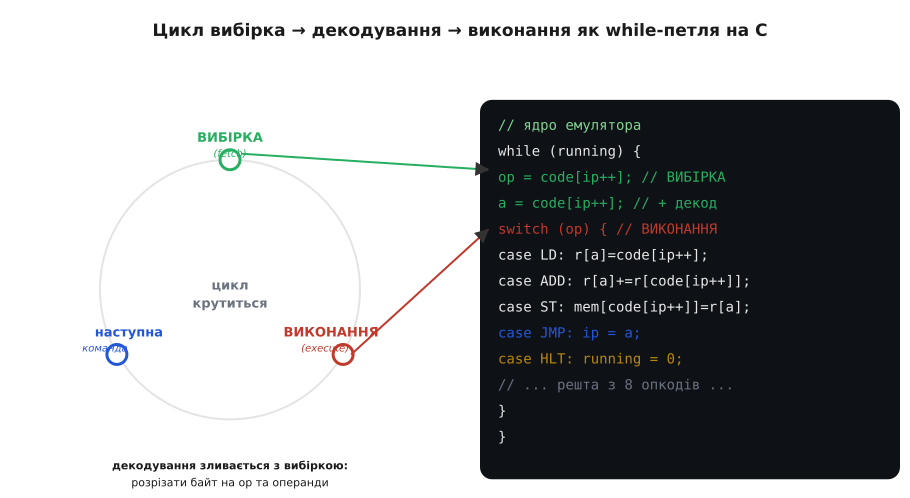
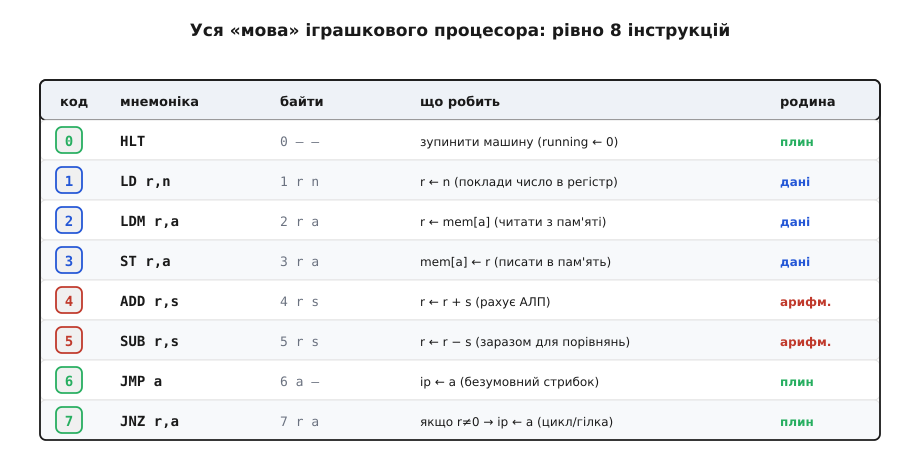

# ⚙️ Іграшковий процесор-емулятор: 8 інструкцій і цикл у 100 рядках C

Серцебиття процесора **зсередини заліза** виглядає так: PC дає адресу, шина несе команду, декодер її розбирає, АЛП рахує. Тут зробимо те саме **в коді**: напишемо крихітну програму, яка сама грає роль процесора — читає байти-команди з масиву й виконує їх. Коли той самий цикл зі схем проступить як звичайна `while`-петля на C, остання таємниця «як програма біжить» зникне остаточно.

### Задача: процесор, якого можна потримати в руках

Схема серцебиття переконлива, та вона лишається **картинкою**. Легко кивати головою, дивлячись на стрілки «вибірка → декодування → виконання», і все одно мати в голові тонкий серпанок магії: ну добре, дроти, такти — а **де саме** число-команда перетворюється на дію? Найнадійніший спосіб розвіяти цей серпанок — побудувати процесор, який **виконується на іншому процесорі**: емулятор. Це програма, що тримає в собі модель машини (її регістри, пам'ять, лічильник команд) і чесно крутить той самий цикл, тільки кожен його крок — рядок коду, який можна прочитати, поставити на паузу й роздрукувати. Мета скромна й тому досяжна: **8 команд і повний цикл вибірки-декодування-виконання приблизно в 100 рядках C** — щоб уся «магія» вмістилася на одному екрані.

### Ідея: пам'ять — масив, цикл — while, декодер — switch

Уся хитрість у тому, щоб помітити, як прямо [органи процесора](topic:programming/processor-parts) — регістри, АЛП, лічильник команд — лягають на звичайні конструкції мови. Пам'ять — це просто **масив байтів** `code[]`: адреса комірки є індексом у масиві. Регістри — маленький масив `r[]` на кілька чисел. Лічильник команд PC — звичайна змінна-індекс `ip` (англ. *instruction pointer* «вказівник команди»), що каже, який байт читати наступним. А серцебиття — це **`while`-петля**, що крутиться, доки машина «жива».


*Ліворуч — три фази циклу вибірка → декодування → виконання; праворуч — той самий цикл як `while`-петля. **Вибірка** — це `code[ip++]`: узяти байт за лічильником і одразу зсунути лічильник (те саме «PC += 1»). **Декодування** зливається з вибіркою: прочитаний байт — це opcode, наступні — операнди. **Виконання** — це `switch(op)`: кожна гілка `case` робить дію однієї команди. Коло замикається само, бо `ip` уже вказує на наступну команду.*

Декодування варте окремого слова, бо саме воно здавалося найзагадковішим. У залізі декодер — велика комбінаційна схема, що зіставляє біти opcode з дротами, які треба ввімкнути. У коді ця сама ідея стискається до одного **`switch`**: число-команда обирає, яка гілка `case` виконається. «Зіставити команду з дією» і «обрати гілку switch за числом» — буквально одне й те саме, лише раз у кремнії, а раз у C. Ось де серпанок розвіюється: ніякої магії в декодуванні немає — є таблиця відповідностей «число → що робити».

Тепер словник нашої машини — її [набір інструкцій](topic:programming/isa). Він **навмисне крихітний**: рівно вісім команд (процесор узагалі знає мало примітивів), і цього досить на справжні програми.


*Уся ISA іграшки: вісім опкодів 0–7, чотирма родинами. **Дані**: LD (поклади число), LDM/ST (читай/пиши пам'ять). **Арифметика**: ADD, SUB (рахує АЛП). **Керування плином**: JMP, JNZ (стрибки — запис у `ip`), HLT (стоп). Кожна команда — 1–3 байти: opcode плюс до двох операндів, рівно як «число з полів».*

### Ядро емулятора

Серце всього — десяток рядків. Решта зі «100» — оголошення масивів, завантаження програми та друк стану; справжній **двигун** ось:

:::tabs
```c
uint8_t r[4]    = {0};   // регістри загального призначення
uint8_t mem[256] = {0};  // пам'ять для даних
uint8_t code[]  = { … };  // програма: потік байтів-команд
int ip = 0;              // лічильник команд PC
int running = 1;

while (running) {                          // ── серцебиття ──
    uint8_t op = code[ip++];               // ВИБІРКА: байт за PC, PC += 1
    int d, s, a, n;                        // ДЕКОДУВАННЯ + ВИКОНАННЯ:
    switch (op) {
        case LD:  d=code[ip++]; n=code[ip++];  r[d] = n;          break;
        case LDM: d=code[ip++]; a=code[ip++];  r[d] = mem[a];     break;
        case ST:  s=code[ip++]; a=code[ip++];  mem[a] = r[s];     break;
        case ADD: d=code[ip++]; s=code[ip++];  r[d] = r[d]+r[s];  break;
        case SUB: d=code[ip++]; s=code[ip++];  r[d] = r[d]-r[s];  break;
        case JMP: a=code[ip++];                ip = a;            break;
        case JNZ: s=code[ip++]; a=code[ip++];  if (r[s]) ip = a;  break;
        case HLT:                              running = 0;       break;
    }
}
```
```py
r    = [0] * 4          # регістри загального призначення
mem  = [0] * 256        # пам'ять для даних
code = [ ... ]          # програма: потік байтів-команд
ip = 0                  # лічильник команд PC
running = True

while running:                             # ── серцебиття ──
    op = code[ip]; ip += 1                 # ВИБІРКА: байт за PC, PC += 1
                                           # ДЕКОДУВАННЯ + ВИКОНАННЯ:
    if op == LD:
        d = code[ip]; ip += 1; n = code[ip]; ip += 1; r[d] = n
    elif op == LDM:
        d = code[ip]; ip += 1; a = code[ip]; ip += 1; r[d] = mem[a]
    elif op == ST:
        s = code[ip]; ip += 1; a = code[ip]; ip += 1; mem[a] = r[s]
    elif op == ADD:
        d = code[ip]; ip += 1; s = code[ip]; ip += 1; r[d] = r[d] + r[s]
    elif op == SUB:
        d = code[ip]; ip += 1; s = code[ip]; ip += 1; r[d] = r[d] - r[s]
    elif op == JMP:
        a = code[ip]; ip += 1; ip = a
    elif op == JNZ:
        s = code[ip]; ip += 1; a = code[ip]; ip += 1
        if r[s] != 0: ip = a
    elif op == HLT:
        running = False
```
:::

Придивися, як кожна гілка — дослівний переклад фази «виконання». ADD бере два регістри й кладе суму назад — це наша АЛП. JMP пише нову адресу в `ip` — це той самий «стрибок є запис у PC». JNZ робить це **за умовою** (`r[s] != 0`) — і ось вам розгалуження й цикли, на яких тримається будь-який алгоритм. Усе, що було стрілками на схемі, тепер виконується присвоєннями.

Зверни увагу й на те, чого тут **немає**: окремого кроку «декодування». Він не зник — він **розчинився** у двох рядках читання байтів (`code[ip++]`) і в самому `switch`. У великій машині декодер — окремий складний вузол, бо команда там туго запакована в біти одного-двох слів і поля доводиться витягати масками та зсувами; у нашій іграшці кожне поле — окремий байт, тож «розпакування» зводиться до читання наступного байта. Це не спрощення заради зручності, а та сама фаза, лише в найдешевшому її вигляді: декодування рівно настільки складне, наскільки хитро закодована команда.

Лишилось побачити двигун **у русі** — бо саме рух і переконує. Проженемо програму, яка множить 6 на 3, хоч команди «помножити» в наборі **немає**: множення тут — додавання в циклі, рівно як на ранніх машинах.

![Програма множення в code[] і таблиця стану машини після кожного оберту циклу: сума росте, лічильник спадає до нуля](/book/programming/computer-architecture/fetch-decode-execute/img/multiply-trace.svg)
*Ліворуч — програма в `code[]` за адресами; жовтим — тіло циклу (ADD, SUB, JNZ). Праворуч — стан машини після кожного оберту: r0 (сума) і r1 (лічильник) крок за кроком. JNZ повертає `ip` на адресу 6, поки r1 не дійде нуля; тоді стрибок не спрацьовує, машина доходить до HLT — і в r0 лежить 18 = 6×3. Ту саму трасу, що малюють стрілками на схемі, тут крутить наш `while`.*

### Складність і пастки на МК

Час роботи такого емулятора лінійний — **O(виконаних команд)**: одна ітерація `while` на кожну команду, кожна гілка `switch` — кілька дій сталого часу. Це робить його ідеальним навчальним інструментом, та варто чесно знати **ціну** й **межі** підходу, особливо коли йдеться про мікроконтролер.

- **Емуляція дорога: десятки реальних команд на одну змодельовану.** Кожна команда іграшки — це вибірка, `switch`, кілька присвоєнь, тобто **багато** машинних команд реального процесора. Тому емулятор повільніший за «голе» залізо в десятки разів. На ПК це непомітно, а от на МК — пряма межа: інтерпретувати чужий код у циклі коштує тактів, і для чогось швидкого вже потрібні хитрощі (таблиця переходів замість довгого `switch`, компіляція в рідний код). Для навчання й нечастих сценаріїв простий цикл ідеальний; для гарячого шляху — ні.
- **`switch` — це і є декодер; його повнота критична.** Якщо в потік потрапить байт, для якого немає гілки `case`, машина не знатиме, що робити. На ПК рятує `default`, що чесно повідомить про збій. На МК такий «невідомий opcode» — модель реальної біди: коли PC потрапляє на сміття замість команди, процесор виконує казна-що. Завжди майте гілку `default`, що зупиняє машину з помилкою, а не «проковтує» невідоме мовчки.
- **`ip` нічим не обмежений — стережіться виходу за межі.** У моделі `ip` — простий індекс, і ніщо не заважає йому переповзти за кінець `code[]` чи стрибнути на безглузду адресу (хибний операнд JMP). На ПК це впіймає перевірка меж; на МК **вихід за межі масиву — мовчазне псування пам'яті**, найгидкіший клас багів. Тримайте `ip` і всі адреси в межах розміру масивів явною перевіркою — модель тут вчить тієї самої обережності, що знадобиться з реальними вказівниками.
- **Розрядність і ширина типів.** Іграшка лічить у простих цілих, та на реальному 8-бітному наборі регістр — це один байт, і `r[d] + r[s]` мусить [переповнюватися](topic:programming/overflow-wraparound) за модулем 256. Якщо моделюєте конкретну машину, беріть для регістрів тип потрібної ширини (`uint8_t`), інакше ваш емулятор «рахуватиме» точніше за оригінал — і розійдеться з ним саме там, де справжнє залізо переповнюється.

Отже, іграшковий емулятор — це місток від схеми до коду: пам'ять стає масивом, лічильник команд — індексом `ip`, серцебиття вибірки-декодування-виконання — петлею `while`, а декодер — одним `switch`. Вісім команд і десяток рядків двигуна виконують справжні програми з лічбою, циклами й гілками — і роблять це у вас на очах, крок за кроком. Магії в «оживленні програми» немає: є масив байтів, індекс, що ним повзе, і таблиця «число → дія», що крутиться, поки не трапиться HLT. Саме це й робить кремній, лише в мільярди разів швидше.
