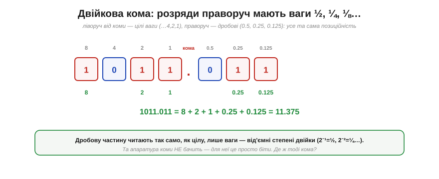

# Дробові числа: фіксована кома

Цілі числа — це чудово, та світ повний **дробів**: температура 23.5°, напруга 3.3 В, гучність 0.7. Як уписати кому між нулями й одиницями, якщо в бітах немає ні коми, ні десяткової крапки? Найпростіша й найшвидша відповідь — **фіксована кома** (*fixed-point*): домовитися, що кома стоїть у певному **нерухомому** місці розрядної сітки, а далі працювати зі звичайними цілими числами. Це робочий кінь дробової арифметики на мікроконтролерах, і працює він напрочуд просто — через **масштабування**.

### Двійкова кома: дробові розряди

Почнімо з того, як узагалі виглядає дріб у двійковій. [Позиційність запису](book:math/positional-systems) працює й праворуч від коми — лише ваги стають **від'ємними** степенями двійки: 2⁻¹ = ½ = 0.5, 2⁻² = ¼ = 0.25, 2⁻³ = ⅛ = 0.125…


*Рис. Ліворуч від коми — звичні цілі ваги (8, 4, 2, 1), праворуч — дробові (0.5, 0.25, 0.125). Читають так само: беруть розряди з одиницею й додають їхні ваги. 1011.011 = 8 + 2 + 1 + 0.25 + 0.125 = 11.375. Жодної нової математики — та сама позиційність, лише з від'ємними степенями.*

Усе б добре, та є заковика: **апаратура коми не бачить**. У регістрі лежать просто біти, без жодної позначки, де там кома. Де ж вона тоді живе?

### Хитрість — масштабування

Відповідь елегантна: кома живе **у вашій голові** (точніше, у домовленості), а в залізі лежить **ціле число**. Фокус зветься **масштабування**: щоб зберегти дробове значення, його **множать** на масштаб (степінь двійки) і зберігають результат як звичайне ціле; а читаючи — ділять назад.


*Рис. Хочемо зберегти 23.5 з чотирма дробовими бітами. Множимо на 16 (=2⁴) → 376, і саме це **ціле** число лежить у залізі. Читаючи назад, ділимо на 16 → знову 23.5. Залізо тримає 376 і нічого не знає про кому — вона існує лише в нашій **домовленості**: самі по собі біти не мають вродженого сенсу. «×16» — це просто зсув уявної коми на 4 розряди.*

**Приклад (прочитати фіксовану кому).** Маємо ціле 376, домовлено про масштаб 16 (4 дробові біти). Яке це дробове число?

```
376 ÷ 16 = 23.5
перевірка через біти:  376 = 101111000,  кома після 4-го біта справа:
   10111.1000 = (16+4+2+1) + 0.5 = 23.5  ✓
```

Уся принада в тому, що **жодного спеціального заліза для дробів не треба** — лише звичайні цілі числа й звичка пам'ятати масштаб. Точнісінько так роблять із **грошима**: зберігають суму в **копійках** (тобто ×100) цілим числом, щоб уникнути похибок дробових обчислень. Копійки — це фіксована кома з масштабом 100.

### Запис Qm.n

Щоб не плутатися, де стоїть кома, домовленість записують форматом **Qm.n**: **m** бітів на цілу частину, **n** бітів на дробову. Одне застереження, через яке часто плутаються: існують **дві конвенції** щодо знакового біта — він або **входить** у m, або рахується окремо понад нього. У наших прикладах (як Q8.8 нижче) знак **включено** в m, тож Q8.8 — це знакове 16-бітне ціле з діапазоном −128…+127.99; та читаючи чужий код, завжди уточнюйте, яку конвенцію там мали на увазі.


*Рис. Формат Q8.8 у 16-бітному слові: 8 бітів ліворуч від (уявної) коми — ціла частина, 8 праворуч — дробова. Масштаб = 2ⁿ = 2⁸ = 256, тож найменший крок (роздільність) = 1/256 ≈ 0.0039, а діапазон ≈ −128…+127.99. Хочеш точніший дріб — віддай більше бітів праворуч (Q4.12); хочеш більший діапазон — ліворуч (Q12.4).*

Назва «**фіксована** кома» тепер очевидна: кома стоїть **нерухомо**, у наперед обраному місці. І саме звідси випливає головний компроміс: ділячи фіксовану кількість бітів між цілою й дробовою частинами, ви **вимінюєте діапазон на точність**. Більше дробових бітів — точніший дріб, але менший діапазон; більше цілих — навпаки. Вибрати треба **заздалегідь**, під свою задачу (типові формати — Q16.16, Q8.8, Q4.4).

### Арифметика: додавання просто, множення зі зсувом

А тепер найприємніше — як рахувати з фіксованою комою. Здебільшого це **звичайна ціла** арифметика, бо ж у залізі лежать цілі.


*Рис. **Додавання** (і віднімання) за однакового масштабу — задарма: коми «вирівняні», тож просто додаємо цілі (2.5+1.25 → 40+20=60 → ÷16 = 3.75). **Множення** хитріше: добуток двох масштабованих чисел має масштаб **удвічі** більший (16×16=256), тож після множення треба **зсунути назад** на n бітів (2.5×1.5 → 40×24=960 → ÷16 = 60 → ÷16 = 3.75).*

**Приклад (множення з фіксованою комою).** Помножимо 2.5 на 1.5 у форматі Q4.4 (масштаб 16).

```
2.5 → 40,   1.5 → 24
40 × 24 = 960          ← але це вже масштаб 16·16 = 256!
960 ÷ 16 = 60          ← зсунули назад на 4 біти → знову масштаб 16
60 ÷ 16 = 3.75         ← читаємо результат   (а 2.5 × 1.5 = 3.75 ✓)
```

Ось чому фіксована кома така приваблива для слабкого заліза: додавання й віднімання — це просто цілі операції, а множення — звичайне ціле множення **плюс зсув** назад на n бітів. Тут варто пам'ятати про три дрібниці, щоб не нарватися на баг: проміжний добуток має **подвоєну** розрядність (Q4.4 × Q4.4 дає масштаб 256), тож беруть **ширший** тип, аби той добуток не переповнився; зсув назад **відкидає** молодші біти — це усічення, тож для точності інколи додають округлення; а в знаковому випадку — арифметичний зсув. Та головне лишається: жодних дорогих апаратних блоків дробів, усе на звичайних суматорах і зсувачах.

### Плюси, мінуси й де вживають

Зведімо баланс.


*Рис. **Плюси**: швидко (звичайна ціла арифметика, не треба апаратних дробів), точно й детерміновано для свого кроку, мало пам'яті — ідеально для **цифрової обробки сигналів**, звуку, [керування](book:math/proportional-control) і грошей. **Мінуси**: кома **нерухома**, тож діапазон і точність обирають наперед, міняючи одне на одне; малий «динамічний діапазон» — важко одночасно тримати й величезні, й крихітні числа.*

Саме цей останній мінус — **малий динамічний діапазон** — і є межа фіксованої коми. Якщо у вашій задачі трапляються і мільйони, і тисячні частки одночасно, жодне фіксоване місце коми не догодить обом. Як же тримати і дуже великі, і дуже малі числа з пристойною точністю? Відповідь — дати комі **плавати**: цей складніший і підступніший спосіб зветься [плаваюча кома](book:programming/floating-point).

> 🔧 **Навіщо це.** Фіксована кома — ваш перший вибір для дробів на мікроконтролері, особливо без апаратного блоку дробових чисел (FPU). Винесіть головне. Перше: дріб зберігають як **ціле × масштаб** (наприклад, температуру в сотих градуса — ×100, як ціле); кома живе в **домовленості**, не в залізі. Друге: **додавання й віднімання — звичайні цілі** (швидко!), а після **множення** треба **зсунути** результат назад на n бітів — не забути цей зсув, бо інакше число «розпухне» в масштабі. Третє: ви **наперед** вимінюєте діапазон на точність (Q8.8, Q4.12…), тож прикиньте, які числа очікуєте, перш ніж обрати формат. Четверте, дуже практичне: для **грошей** і будь-де, де важлива точність дробів, фіксована кома (цілі копійки/міліметри/міліградуси) надійніша за плаваючу — без хитрих похибок округлення. У [цифрових фільтрах](book:algorithms/fir-filter) і [керуванні](book:math/proportional-control) на ESP32 фіксована кома часто буде швидшим і точнішим вибором, ніж float.

---

Підсумок: **фіксована кома** дає дробові числа найпростішим способом — через **масштабування**: значення множать на масштаб (степінь двійки) і зберігають як **ціле**, а кому тримають у **домовленості** (формат **Qm.n**: m цілих бітів, n дробових; масштаб 2ⁿ). Дробові розряди мають ваги ½, ¼, ⅛… Арифметика майже задарма: **додавання й віднімання** — звичайні цілі, **множення** — плюс один **зсув** назад на n бітів. Плюси — швидкість, точність, малі ресурси (ідеально для МК без FPU, для DSP, керування, грошей); мінус — кома **нерухома**, тож діапазон і точність обирають наперед, і динамічний діапазон малий. Коли треба тримати водночас і величезні, і крихітні числа з гарною точністю, фіксованої коми не вистачає — тоді комі дають **плавати**, як у [плаваючій комі](book:programming/floating-point), наймогутнішому, та й найпідступнішому способі з власними пастками точності.

---
