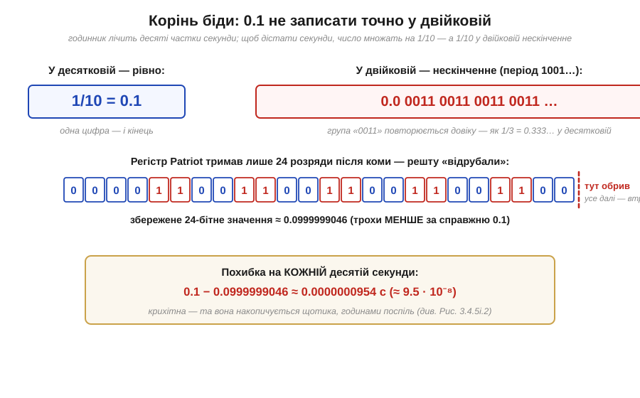
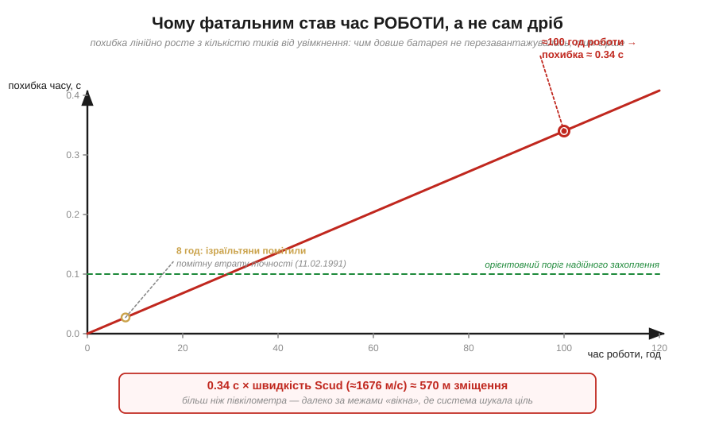
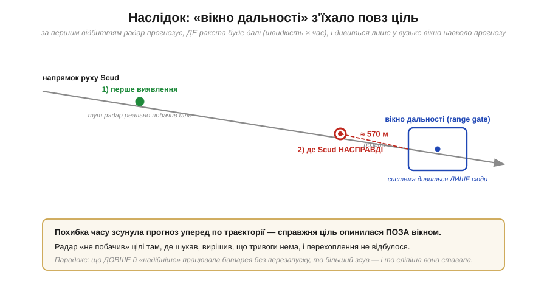
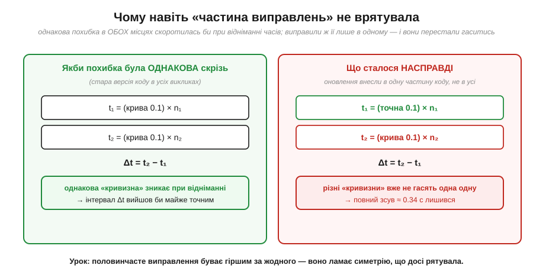

# 📜 Patriot у Дахрані (1991): 0.1 секунди, якої немає у двійковій системі

> Найпростіший спосіб зберігати дроби — [фіксована кома](topic:programming/fixed-point): множимо значення на степінь двійки й тримаємо як ціле, а кому пам'ятаємо в домовленості. Виглядає невинно. Та в такому записі ховається одна тривожна деталь: дробові розряди мають ваги **½, ¼, ⅛, …** — самі від'ємні степені двійки. А це означає, що деякі найзвичайніші для людини дроби в таку сітку **точно не лягають**. Найвідоміший з них — **0.1**. У десятковій це одна цифра після крапки; у двійковій — нескінченний періодичний дріб, який доводиться **обрубати**. Зазвичай та похибка мікроскопічна й нікого не турбує. Але 25 лютого 1991 року вона коштувала життя **28 людям**. Ось як крихітний обрубаний дріб обернувся однією з найвідоміших катастроф в історії програмування.

Тримаймо в голові головну думку фіксованої коми: за кому відповідає **домовленість**, а в залізі лежить звичайне ціле, помножене на масштаб. Усе тримається на тому, що масштаб обрано **точно**. А що, як саме масштаб — наприклад, множник 1/10 — у двійковій неможливо записати без похибки? Тоді кожне число, переведене через нього, виходить ледь-ледь кривим. По одному це непомітно. Зібране мільйонами повторень — катастрофічно. Саме це й сталося з комплексом ППО **Patriot**.

---

### Пустеля, барак і ракета, якої не помітили

Ішла війна в Перській затоці. У ніч на 25 лютого 1991 року іракська балістична ракета **Scud** (іракська модифікація радянської ракети, яку самі іракці звали «Аль-Хусейн») летіла на місто **Дахран** (*Dhahran*) у Саудівській Аравії — на велику тилову базу, де стояли американські війська. Там її мала перехопити батарея зенітно-ракетного комплексу **Patriot** (*MIM-104 Patriot*) виробництва компанії **Raytheon**. Patriot уже мав репутацію рятівника: телебачення тих тижнів повнилося кадрами, де його ракети нібито збивають Scud один за одним у нічному небі.

Цього разу він навіть не вистрелив. Радар комплексу **виявив** Scud на підльоті — а тоді вирішив, що ніякої цілі там немає, і не дав команди на пуск. Ракета безперешкодно впала на пристосований під казарму склад, де спали американські військовики. Загинуло **28 людей**, ще близько **сотні дістали поранення** — найбільші одномоментні втрати американців за всю ту війну. Більшість загиблих належала до **14-го квартирмейстерського загону** Резерву армії США — підрозділу водоочищення з міста Ґрінсбург, штат Пенсільванія, що прибув до Дахрана лише за шість днів до удару.

Найгірше у цій історії — те, що ракету не зупинив не зламаний радар, не вдалі завади супротивника й не складна тактика. Її пропустила **арифметична похибка** в програмі. Та сама похибка обрубаного дробу, з якої ми почали. Щоб зрозуміти, як рядок коду вбиває людей, треба спуститися рівно туди, де машина зберігає дробове число.

---

### Годинник, що рахував десятими, і фатальний множник 1/10

Усередині комплексу Patriot працював годинник, який лічив час від останнього ввімкнення системи — у **десятих частках секунди**. Тобто внутрішній лічильник зберігав не «секунди», а ціле число **десятих**: 1 секунда — це 10, хвилина — 600, година — 36 000. Поки що жодних дробів — просто ціле, що цокає десять разів на секунду.

Та для розрахунку траєкторії програмі потрібен був час у **секундах** — звичайне дробове число. Перетворення очевидне: помножити кількість десятих на **1/10**. І саме тут ховалася пастка. Множник 1/10 програма тримала у **24-бітному регістрі з [фіксованою комою](topic:programming/fixed-point)** — ціле, що зображує дріб у наперед обраному масштабі. Проблема в тому, що **0.1 у двійковій системі точно не записати жодною скінченною кількістю бітів**.

*У десятковій 1/10 = 0.1 — одна цифра, і кінець. У двійковій це нескінченний періодичний дріб 0.0001100110011001100…, де група «0011» повторюється довіку (як 1/3 = 0.333… у десятковій). 24-бітний регістр Patriot тримав лише перші 24 розряди після коми, а решту обрубав — і зберіг не 0.1, а ≈ 0.0999999046, тобто значення, **трохи менше** за справжнє. Похибка на кожній десятій секунди — близько 9.5·10⁻⁸ с. Мікроскопічна — поки не помножити на мільйони тиків.*

Це той самий механізм, що й трюк із «копійками», тільки навпаки. Тим трюком фіксована кома нас **рятує**: зберігаємо гроші в цілих копійках, бо так точно. Тут програмісти зберігали час у цілих десятих — і це теж було точно! Біда почалася не від лічильника, а від **множення на 1/10**: щойно ціле число десятих переводили в секунди через двійковий дріб 0.0999999046 замість 0.1, кожне таке перетворення виходило ледь заниженим. Машина чесно рахувала з тим числом, яке мала, — а мала вона не зовсім 0.1.

> 🔧 **Навіщо це.** Ось головне правило фіксованої коми: для дробів, де важлива точність, тримайте **ціле × масштаб** і якнайдовше лишайтеся в цілих. Лічильник десятих був правильним рішенням. Фатальним став момент, коли з нього вийшли в дріб через множник, якого двійкова система точно не вміє. Запам'ятайте симптом: **константа-дріб, яку не записати скінченно у двійковій** (0.1, 0.2, 0.3 — будь-який дріб, чий знаменник не є степенем двійки), — це джерело прихованої похибки. Якщо така константа множиться на велике число або накопичується в циклі — чекайте дрейфу.

---

### Чому фатальним став час роботи, а не сам дріб

Сама собою похибка 9.5·10⁻⁸ секунди не страшна нікому: це менше десятимільйонної частки секунди. Якби батарея пропрацювала хвилину й перезавантажилась, ніхто б нічого не помітив. Уся трагедія — в одному слові: **накопичення**.

Похибка з'являється на **кожній** десятій секунди. А лічильник від останнього ввімкнення тільки росте. Отже, повна похибка часу — це крихітна похибка одного тика, помножена на **кількість тиків від старту**. Що довше система працює без перезавантаження, то більший розрив між тим, котра година «насправді», і тим, що думає машина. Похибка росте **лінійно** з часом роботи — невпинно, секунда за секундою.

*Похибка часу росте прямою лінією з тривалістю безперервної роботи. Через 8 годин ізраїльські військові вже зафіксували помітну втрату точності (11 лютого 1991). Батарея в Дахрані на момент удару пропрацювала **близько 100 годин** поспіль — і накопичена похибка сягнула **≈ 0.34 секунди**. Помножена на швидкість Scud (≈ 1676 м/с), ця третина секунди перетворюється на зміщення **понад півкілометра** — більш ніж достатньо, щоб ціль випала з вузького «вікна», де радар її шукав.*

Батарея в Дахрані працювала безперервно **близько 100 годин** — кілька діб поспіль, бо в умовах постійної загрози ракетних ударів її не вимикали й не перезавантажували. За цей час накопичена похибка дрейфу часу сягнула приблизно **0.34 секунди**. Здавалося б, дрібниця — третина секунди. Та для перехоплення балістичної ракети це ціла вічність.

---

### «Вікно дальності», що з'їхало повз ціль

Щоб зрозуміти, чому третина секунди — це смертельно багато, треба знати, як Patriot **шукає** ціль. Радар не сканує все небо поспіль — це надто повільно. Виявивши ціль уперше, система робить розумніше: знаючи **швидкість** ракети й **час** від першого виявлення, вона **прогнозує**, де ціль має опинитися наступної миті, і дивиться лише у вузьке **«вікно дальності»** (*range gate*) навколо цього прогнозу. Якщо в очікуваному місці ціль є — захоплення підтверджено, можна стріляти. Якщо у вікні порожньо — система вирішує, що то було хибне відбиття, і скидає тривогу.

А тепер з'єднаймо це з похибкою часу. Прогноз положення — це по суті «швидкість × час». Якщо час у формулі занижений на 0.34 секунди, то й **прогнозоване місце** з'їжджає вздовж траєкторії. Радар спрямовує своє вікно туди, де ракета була б за хибним часом, — а справжня ракета, що летить зі швидкістю 1676 метрів за секунду, за ці 0.34 секунди вже пролетіла понад **півкілометра** далі. Вона опиняється **поза** вікном.

*Радар виявляє Scud (зелена точка), а тоді прогнозує його наступне положення за формулою «швидкість × час». Через занижений на 0.34 с час прогноз (синє вікно) з'їжджає вздовж траєкторії приблизно на 570 м відносно того місця, де ракета перебуває **насправді** (червона точка). Справжня ціль випадає з вузького вікна — радар «не бачить» її там, де шукає, вирішує, що тривоги немає, і перехоплення не відбувається. Гіркий парадокс: що довше й «надійніше» батарея працювала без перезапуску, то більший зсув — і то сліпішою вона ставала.*

Ось і повна причинна ланка: обрубаний у двійковій дріб 1/10 → крихітна похибка на кожному тику → лінійне накопичення за ~100 годин → зсув часу 0.34 с → зсув прогнозованого положення на ~570 м → справжня ціль поза вікном дальності → пуску немає → ракета влучає в казарму. Кожна ланка окремо здається невинною. Уся ланка разом — 28 загиблих.

---

### Попередження, яке спізнилося на один день

Найболючіше в цій історії те, що про ваду **знали наперед**. Приблизно за два тижні до трагедії, **11 лютого 1991 року**, ізраїльські військові, які теж використовували Patriot, помітили дивне: після кількох годин безперервної роботи точність наведення помітно падає. Вони виміряли дрейф уже після **8 годин** роботи й застерегли: за такого темпу годин через двадцять система взагалі перестане надійно перехоплювати цілі. Цю інформацію передали виробникові й армійському офісу проєкту Patriot.

Інженери справді взялися за виправлення й випустили оновлене програмне забезпечення. Але **логістика виявилася повільнішою за ракету**: виправлена версія дісталася батареї в Дахрані аж **26 лютого 1991 року — наступного дня після удару**. Доки виправлення везли, інструкція для військ була проста й по-своєму абсурдна: **частіше перезавантажуйте систему**. Перезавантаження обнуляло лічильник, а отже й накопичену похибку, — груба, але дієва латка. Проте чіткого правила, **наскільки часто** треба перезавантажуватись, щоб устигнути до небезпечного дрейфу, ніхто не дав. Розрахунок «100 годин → 0.34 секунди» з'явився вже як посмертний висновок розслідування.

> 🔧 **Навіщо це.** Тут — окремий, нечисловий, але важливий урок для розробника вбудованих систем: **системи, що працюють тижнями без перезавантаження, мають інші режими відмов, ніж ті, що рестартуються щодня**. Похибка, безпечна за хвилину роботи, стає смертельною за тиждень безперервної роботи. Коли ваш контролер має крутитися місяцями поспіль (а політний контролер, промисловий регулятор чи давач саме такі), питайте себе: що в моєму коді **накопичується** з часом — лічильники, суми, дрейф годинника? Чи не [переповниться](topic:programming/overflow-wraparound) воно? Чи не назбирає похибки? «У мене ж усе працювало на стенді» — небезпечна ілюзія, якщо на стенді ви ганяли його годину, а в полі він житиме рік.

---

### Пастка часткового виправлення: чому похибки перестали гаситись

Є в цій історії ще одна підступна деталь, яку варто розібрати окремо, бо вона напрочуд повчальна для програміста. На перший погляд незрозуміло: якщо програма скрізь рахує час із тим самим **заниженим** 1/10, то всі моменти часу занижені **однаково** — то чому б похибкам не **скоротитися**? Адже система працює з **різницями** часів («скільки минуло від першого виявлення»), а в різниці однакова крива має зникнути.

І це чиста правда — якби крива була справді **однаковою скрізь**. Тоді з різниці двох однаково занижених часів похибка випала б майже повністю, і дрейф не накопичувався б. Проблема в тому, що під час спроби виправлення множник 1/10 поліпшили **в одних частинах коду, але не в усіх**. Унаслідок цього один момент часу обчислювався вже точніше, а інший — за старою кривою формулою. Різні «кривизни» **перестали гасити одна одну** — і саме їхня **неузгодженість** і дала повний накопичений зсув.

*Ліворуч: якби 1/10 була однаково «кривою» в усіх викликах, то при відніманні часів (Δt = t₂ − t₁) однакова похибка скоротилася б — і інтервал вийшов би майже точним. Праворуч: насправді виправлення внесли лише в одну частину коду, тож один час рахувався з точнішим 1/10, а другий — зі старим. Різні похибки вже не гасять одна одну, і повний зсув ≈ 0.34 с лишається. Урок: половинчасте виправлення буває гіршим за жодне — воно ламає **симетрію**, що доти непомітно рятувала.*

Це один із найтонших уроків усієї історії, і він виходить далеко за межі Patriot: **узгодженість похибки часто важливіша за її абсолютний розмір**. Система може справно жити з помітною, але **однаковою скрізь** похибкою, бо та скорочується там, де треба. А от **мішанка** з «точного тут і кривого там» — навіть якщо середня похибка ніби й менша — ламає ту рятівну симетрію й випускає ваду назовні. Коли наступного разу ви виправлятимете обчислення з фіксованою комою, виправляйте його **в усіх місцях одразу** — або свідомо лишайте однаково «кривим» усюди, але не зупиняйтеся на півдорозі: саме половинчасте виправлення чинить найбільше шкоди.

---

### Чий це недогляд: не «поганий програміст», а ціла система рішень

Спокусливо звести все до «хтось написав погану формулу». Чесніша картина — **колективна** й системна, і саме так її описало офіційне розслідування. Жоден окремий «винуватець» тут не пояснює катастрофи.

По-перше, сам комплекс Patriot **не проєктувався** під балістичні ракети на кшталт Scud і під багатодобову безперервну роботу. Його робили в 1970-х проти повільніших аеродинамічних цілей — літаків, — за коротких сеансів роботи, коли накопичена похибка просто не встигала вирости до небезпечної. Scud летів **набагато швидше**, а батареї в Затоці тримали ввімкненими **добами**. Систему застосували поза межами, на які її розраховували, — і прихована вада, нешкідлива в початковому задумі, ожила.

По-друге, з самого формату з [фіксованою комою](topic:programming/fixed-point) випливало обмеження точності, яке за коротких сеансів ніхто не помічав. Це не «дурна помилка одного кодера», а наслідок інженерного компромісу, зробленого роками раніше за зовсім інших припущень про застосування.

По-третє, коли проблему **виявили** (дякувати ізраїльським військовим), її виправлення й розповсюдження виявилися надто повільними проти темпу війни — і виправлення наклалося невдало (та сама пастка половинчастого виправлення). Це вже про **процеси**: тестування на реалістичну тривалість роботи, швидкість викочування критичних оновлень, чіткість тимчасових інструкцій військам.

Тож по-справжньому винна **ланка рішень**: початкові припущення проєкту, обмеження формату, темп оновлень, людська логістика. У цьому й цінність історії як інженерного уроку: катастрофи рідко мають одну причину — їх зазвичай складає **ланцюжок** дрібних, поодинці пробачних рішень, що збіглися в один фатальний момент. (Розслідування провів **GAO** — Головне контрольно-ревізійне управління США; його звіт *GAO/IMTEC-92-26* від лютого 1992 року й донині лишається першоджерелом, з якого переказують цю історію в кожному курсі чисельних методів.)

---

### Що з усього цього винести просто зараз

Озирнімося на весь причинний ланцюг разом. Дахранська трагедія — це [фіксована кома](topic:programming/fixed-point), доведена до межі: вона зберігає дроби через ціле × масштаб, і все тримається на тому, що масштаб **точний**. Множник 1/10 точним у двійковій бути **не може** — і кожне перетворення «десяті → секунди» виходило ледь заниженим. Поодинці непомітно; помножене на мільйони тиків за ~100 годин — зсув 0.34 с; через формулу «швидкість × час» — промах на ~570 м; через вузьке вікно дальності — пропущена ціль.

Три речі варто забрати з собою в кожен наступний проєкт:

Перше — **дроби, чий знаменник не степінь двійки, у двійковій точними не бувають**. 0.1, 0.2, 0.3 — усі ці буденні числа машина зберігає лише наближено (саме тому гроші варто тримати в цілих копійках, а не в дробах). Коли така константа множиться на велике число або накопичується в циклі — у вас тихий дрейф, і його треба бачити заздалегідь.

Друге — **довгий безперервний аптайм оголює похибки, невидимі за короткої роботи**. Усе, що накопичується з часом — лічильники, інтегратори, дрейф годинника, — перевіряйте на реалістичну тривалість, а не на хвилину за столом. Якщо щось має крутитися тижнями, спитайте, що в ньому росте, і чи не переросте воно межу (звідси й перегук із [переповненням](topic:programming/overflow-wraparound): дрейф і переповнення — дві сестри «часу, що накопичується»).

Третє — **узгодженість похибки часто важливіша за її розмір**, а половинчасте виправлення буває гіршим за відсутність виправлення: воно ламає симетрію, що доти непомітно гасила похибку. Виправляйте обчислення з фіксованою комою в усіх місцях одразу.

І останнє, найважче. Двійкова арифметика — не суха абстракція з підручника. Те, як машина зберігає число, — рішення з наслідками, інколи смертельними. 0.1, якої немає у двійковій системі, — це не курйоз на полях теми про фіксовану кому. Це причина, чому 28 людей не повернулися додому. Тримаймо це в пам'яті, коли наступного разу здаватиметься, ніби «та похибка надто мала, щоб про неї думати».

І ще одне наостанок: 0.1 лишається так само підступною й тоді, коли комі дозволяють **плавати**. У [плаваючій комі](topic:programming/floating-point) той самий нескінченний двійковий дріб обрубається — просто в іншому місці. Фіксована кома лише показала цей край найгостріше: за кому в ній відповідає домовленість програміста, і саме людина мусить знати, що 0.1 туди точно не лягає.
