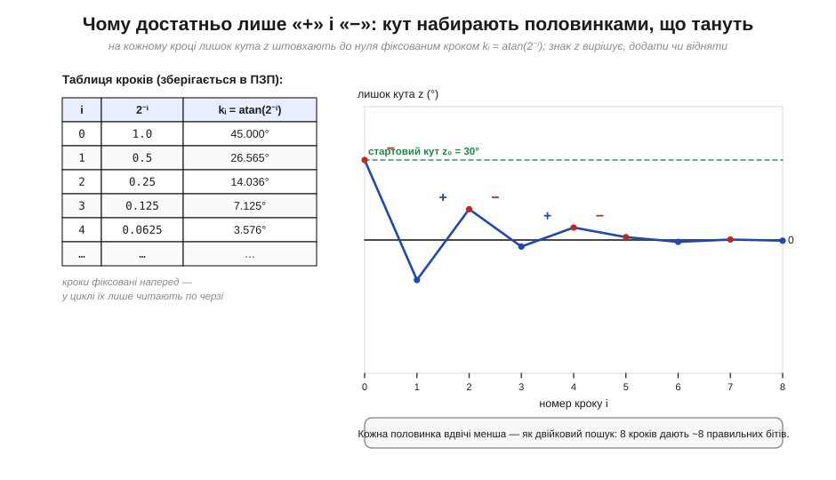
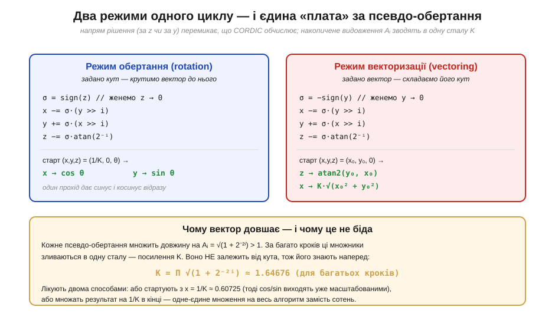

# CORDIC: синус, косинус і atan2 без FPU — самі зсуви й додавання

> ⚙️ Тригонометрія на залізі без FPU. Дроби тут тримають цілими числами у [фіксованій комі](book:programming/fixed-point), а в [сусідній ⚙️-вставці](book:programming/fixed-point/proj-fixed-point.md) показано, як множити їх зсувом і насичувати результат. Лишається питання, що неминуче спливає в керуванні двигунами, графіці й навігації: а як на тому самому залізі без FPU порахувати **синус, косинус чи кут вектора (atan2)**? Таблиця на кожен можливий кут — задорого по пам'яті, ряд Тейлора — це купа множень. CORDIC (історію якого розказано в [окремій 📜-вставці](book:programming/fixed-point/hist-cordic.md)) дає третій шлях: тригонометрію **самими зсувами й додаваннями** над фіксованою комою. Розберімо його як алгоритм — від ідеї до пастки на МК.

## Задача

Уявімо контролер безколекторного двигуна без FPU. Щоб задати струми обмоток, йому десятки тисяч разів на секунду потрібні `sin θ` і `cos θ`; щоб оцінити кут ротора з двох давачів — `atan2(y, x)`. Прямі шляхи погані обидва. **Велика таблиця** значень з'їдає дефіцитну флеш-пам'ять і все одно дає лише дискретні кути. **Ряд Тейлора** (`sin θ ≈ θ − θ³/6 + …`) вимагає кількох множень на кожен член, а множення без апаратного множника — дороге. Потрібен метод, що дає тригонометрію за ціну того, що навіть найскромніше ядро робить швидко: **цілий зсув і ціле додавання**.

## Ідея

Уся хитрість CORDIC — у погляді на синус і косинус як на **обертання вектора**. Якщо взяти вектор (1, 0) і повернути його на кут θ, то його нові координати — це рівно (cos θ, sin θ). Тобто порахувати синус-косинус = вміти [обертати вектор](book:math/rotation-matrices) на заданий кут. А обертання, своєю чергою, можна не робити одним стрибком, а **набрати** з багатьох дрібних поворотів — і ось тут ховається трюк.


*Зліва — чесне обертання на кут φ: чотири множення на cos/sin, задорого без FPU. Справа — крок CORDIC. Замість довільного кута беруть **спеціальні** кути kᵢ = atan(2⁻ⁱ), для яких формула обертання містить множники рівно 2⁻ⁱ — а множення на 2⁻ⁱ це просто **зсув праворуч на i бітів**. Ціна за хитрість одна: псевдо-обертання не лише крутить вектор, а й трохи **видовжує** його (×Aᵢ) — цей «борг» зберемо й погасимо однією сталою наприкінці.*

Чому саме кути atan(2⁻ⁱ)? Бо в формулі обертання `x′ = x − y·tan φ`, `y′ = y + x·tan φ` множником стоїть **тангенс** кута. Якщо обрати φ так, що tan φ = 2⁻ⁱ (тобто φ = atan(2⁻ⁱ)), то `y·tan φ` перетворюється на `y >> i`, а `x·tan φ` — на `x >> i`. Множення зникло, лишилися зсув і додавання:

:::tabs
```c
int x_new = x - (y >> i);   // знак −/+ задає напрям повороту
int y_new = y + (x >> i);   //   (для повороту «назад» знаки міняють місцями)
```
```py
x_new = x - (y >> i)        # знак −/+ задає напрям повороту
y_new = y + (x >> i)        #   (для повороту «назад» знаки міняють місцями)
```
:::

Лишається питання: як із цих фіксованих кроків (45°, 26.565°, 14.036°, 7.125°…) набрати **довільний** кут θ? Відповідь — як у двійковому пошуку. Веземо з собою «лишок кута» z, спершу рівний θ. На кожному кроці дивимося на знак z: якщо z ще додатний — повертаємо **вперед** (віднімаємо kᵢ від z), якщо вже від'ємний — повертаємо **назад** (додаємо kᵢ). Кроки вдвічі менші щоразу, тож z неминуче стискається до нуля — а вектор тим часом доходить до потрібного кута.


*Ліворуч — таблиця кроків kᵢ = atan(2⁻ⁱ) (єдине, що CORDIC тримає в ПЗП). Праворуч — як лишок кута z біжить до нуля для θ = 30°: знак z вирішує «+» чи «−», і кожна поправка вдвічі менша за попередню. Це буквально двійковий пошук по куту: n кроків дають ≈ n правильних бітів результату. Жодних множень — лише читання таблиці, зсув і додавання.*

Один і той самий цикл дає **два різні корисні результати** залежно від того, що женемо до нуля. Жени до нуля **кут** z — і вектор повернеться на θ, а його координати стануть (cos θ, sin θ): це **режим обертання**. Жени до нуля **y** вектора — і вектор ляже на вісь x, а весь кут, який довелося «відмотати», накопичиться в z: це **режим векторизації**, і він повертає `atan2(y, x)` та заразом довжину вектора. Одна петля — три функції.


*__Режим обертання__ (женемо z→0): старт (1/K, 0, θ) → дістаємо cos θ і sin θ за один прохід. **Режим векторизації** (женемо y→0): старт (x₀, y₀, 0) → дістаємо atan2(y₀, x₀) і довжину. Спільна «плата» — посилення K = Π√(1+2⁻²ⁱ) ≈ 1.64676: кожне псевдо-обертання трохи довшає вектор. K **не залежить від кута**, тож його гасять наперед — стартують із x = 1/K ≈ 0.60725 (тоді результат уже масштабований) або множать на 1/K один раз у кінці.*

## Псевдокод

Гаряча петля — режим обертання, що повертає sin і cos кута. Усе ціле, у фіксованій комі: кут і координати — Q-числа, `ATAN[i]` — таблиця atan(2⁻ⁱ) у тому самому масштабі, `N` — число ітерацій (= бажана точність у бітах):

:::tabs
```c
// theta у Q-форматі, |theta| ≤ ~99°;  повертає sin/cos через вказівники
void cordic_sincos(int32_t theta, int32_t *sin_out, int32_t *cos_out) {
    int32_t x = ONE_OVER_K;              // = 1/K у Q-форматі (гасить посилення наперед)
    int32_t y = 0;
    int32_t z = theta;                   // лишок кута, женемо до нуля
    for (int i = 0; i < N; i++) {
        int32_t x_new, y_new;
        if (z >= 0) {                    // знак z = напрям повороту
            x_new = x - (y >> i);        // псевдо-обертання вперед
            y_new = y + (x >> i);        //   (зсуви замість множень!)
            z     = z - ATAN[i];         // списали kᵢ з лишку
        } else {
            x_new = x + (y >> i);        // псевдо-обертання назад
            y_new = y - (x >> i);
            z     = z + ATAN[i];
        }
        x = x_new;                       // ОНОВЛЮВАТИ РАЗОМ: y залежить від старого x
        y = y_new;
    }
    *sin_out = y;                        // y ≈ sin theta
    *cos_out = x;                        // x ≈ cos theta
}
```
```py
def cordic_sincos(theta):               # theta у Q-форматі, |theta| ≤ ~99°
    x = ONE_OVER_K                       # = 1/K у Q-форматі (гасить посилення наперед)
    y = 0
    z = theta                            # лишок кута, женемо до нуля
    for i in range(N):
        if z >= 0:                       # знак z = напрям повороту
            x_new = x - (y >> i)         # псевдо-обертання вперед
            y_new = y + (x >> i)         #   (зсуви замість множень!)
            z     = z - ATAN[i]          # списали kᵢ з лишку
        else:
            x_new = x + (y >> i)         # псевдо-обертання назад
            y_new = y - (x >> i)
            z     = z + ATAN[i]
        x = x_new                        # ОНОВЛЮВАТИ РАЗОМ: y залежить від старого x
        y = y_new
    return (y, x)                        # y ≈ sin theta,  x ≈ cos theta
```
:::

Дві деталі варто підкреслити. По-перше, `x` і `y` оновлюють **одночасно** зі старих значень: новий `y` рахується через **старий** `x`, тож не можна затерти `x` раніше, ніж порахуєш `y`. По-друге, зсуви `>>` тут — **арифметичні** над знаковими Q-числами: для від'ємних координат вони мусять тягнути знаковий біт, інакше поворот «назад» зіпсується. Режим векторизації (atan2) — той самий каркас, лише умова гілки міняється з `z >= 0` на `y < 0`, а накопичується відповідь у `z`.

## Складність і пастки на МК

**Вартість — O(N) на виклик:** один прохід циклу на кожен біт точності. Для 16-бітного результату це ≈ 16 ітерацій, у кожній — два зсуви, три додавання й перевірка знака; разом кілька десятків цілих інструкцій на повний синус-косинус, без жодного множення. На ядрі без множника це часто **швидше** за ряд Тейлора й ощадніше по пам'яті за велику таблицю — звідси й популярність CORDIC у FPGA та дрібних МК. Та перш ніж вставляти його в код, варто знати характерні граблі:

- **Обмежений діапазон збіжності.** Сума всіх кроків atan(2⁻ⁱ) дорівнює лише ≈ 99.7°, тож «у лоб» CORDIC бере кути приблизно **−99°…+99°**, не більше. Для решти кола роблять **попередній поворот на чверть**: зводять кут у цей діапазон через ±90° чи 180° (звичайна перестановка й зміна знаків координат), і лише потім запускають цикл. Забути про це — отримати сміття за межами перших квадрантів.
- **Не загубити посилення K.** Якщо не стартувати з 1/K і не помножити на 1/K у кінці, результат вийде роздутим у ≈ 1.647 раза — класична «тиха» помилка: форма синусоїди правильна, амплітуда — ні. Стала 1/K ≈ 0.60725 фіксована (для багатьох ітерацій), її просто кладуть константою у Q-форматі.
- **Таблиця ATAN у правильному масштабі.** `ATAN[i]` мусять бути у **тому самому** Q-форматі, що й z; популярний варіант — масштабувати весь кут так, щоб ціле коло вкладалося у розрядну сітку (тоді [переповнення](book:programming/overflow-wraparound) кута саме «обертається» по колу — і це тут на користь). Невідповідність масштабу таблиці й z — найчастіша причина, чому «майже працює, але кут пливе».
- **Скільки ітерацій — стільки й бітів, не більше.** Точність росте приблизно на біт за ітерацію й упирається в **розрядність** ваших Q-чисел: робити 30 ітерацій у 16-бітному форматі марно — молодші зсуви `y >> i` просто занулюються, щойно i перевищить число дробових бітів. Узгоджуйте N із шириною слова.
- **Постійний час виконання — і плюс, і мінус.** CORDIC завжди робить рівно N кроків незалежно від аргументу: зручно для жорсткого реального часу, та якщо десь потрібен лише грубий синус, повний цикл — надлишок, і там інколи дешевша коротка таблиця з інтерполяцією.

Підсумок: CORDIC перетворює тригонометрію на те, що вміє найскромніше ціле залізо, — **зсув і додавання над фіксованою комою**. Вектор повертають низкою псевдо-обертань на кути atan(2⁻ⁱ), де множник завжди є степенем двійки; знак лишку кута на кожному кроці грає роль двійкового пошуку, тож N ітерацій дають ≈ N бітів. Один режим віддає sin і cos, інший — atan2 і довжину; єдина плата, стала K ≈ 1.647, гаситься наперед. Саме тому, що CORDIC спирається лише на суматори й зсувачі і ні разу не кличе множник, він і досі править там, де FPU немає, — у контролерах двигунів, обробці сигналів і кожному другому FPGA-проєкті.
