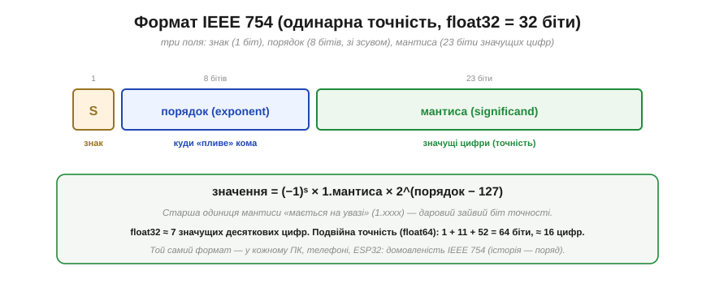
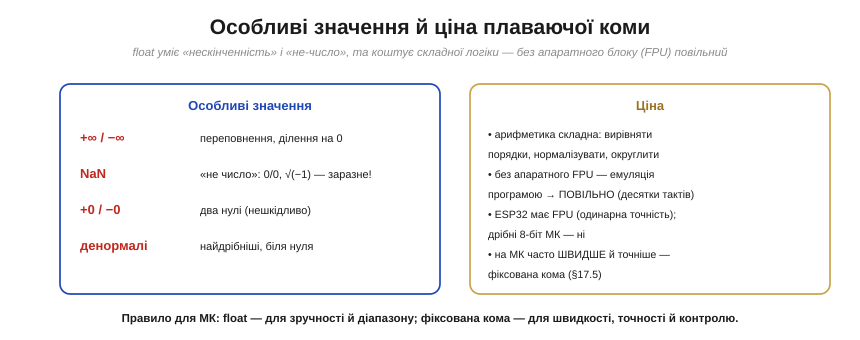

# Плаваюча кома (точність/діапазон; чому float підступний)

[Фіксована кома](book:programming/fixed-point) має ваду: кома стоїть нерухомо, тож одночасно тримати й величезні, й крихітні числа неможливо. Розв'язок — дати комі **плавати**, як у науковій нотації: записувати число як «значущі цифри × степінь». Це **плаваюча кома** (*floating-point*, у народі **float**) — формат, на якому стоїть уся наукова й інженерна арифметика комп'ютерів. Він дає неймовірний **діапазон**, та за це бере дорогу плату: float **підступний**, повний неочевидних пасток точності, об які спіткнувся кожен програміст. Розберімо і його силу, і його підводні камені.

> 📜 **Дотична історія:** [Вільям Кехен і стандарт IEEE 754](hist-ieee754.md). До 1985 року кожен виробник робив плаваючу кому по-своєму, і та сама програма на різних машинах давала різні відповіді — хаос. Як один упертий математик навів лад і за що отримав премію Тюрінга — окремо. А тут — про сам формат.

### Як наукова нотація: кома пливе

Дуже великі чи малі числа в науці записують особливим чином: 6.022 × 10²³ (число Авогадро) або 1.6 × 10⁻¹⁹ (заряд електрона). Тут два шматки: **мантиса** (значущі цифри, 6.022) і **порядок** (степінь, 23). Порядок каже, **куди** посунути кому, тож вона «пливе» куди завгодно.

*Рис. Та сама ідея у двійковій: число = **мантиса × 2^порядок**. Наприклад, 1.101 × 2³ = 1.625 × 8 = 13. **Порядок** рухає кому (велике число — великий порядок, крихітне — від'ємний), а **мантиса** несе значущі цифри. Розділивши «масштаб» (порядок) і «точність» (мантиса), float виграє обидва: одним форматом тримає і мільярди, і мільйонні частки.*

Це ключова ідея: замість фіксувати кому, ми **окремо** зберігаємо, де вона, — у порядку. Тому й «плаваюча»: кома пливе туди, куди вкаже порядок.

### Формат IEEE 754: знак, порядок, мантиса

Як саме розкласти ці шматки по бітах, домовляється всесвітній стандарт [**IEEE 754**](book:math/ieee754) — він до біта розписує поля знаку, експоненти й мантиси, а також subnormal-числа, NaN та Inf. Найпоширеніший формат — **одинарна точність** (*single*, **float32**), 32 біти, поділені на три поля.

*Рис. **Знак** (1 біт): + чи −. **Порядок** (8 бітів): куди пливе кома (зберігається зі зсувом 127). **Мантиса** (23 біти): значущі цифри. Значення = (−1)ˢ × 1.мантиса × 2^(порядок−127) — для **нормальних** (звичайних скінченних) чисел. Хитрість: старша одиниця мантиси «мається на увазі» (число завжди 1.xxxx), тож дістаємо даровий зайвий біт точності. (Правило діє не завжди: для нуля, дуже малих **денормалей**, ±∞ і NaN поле порядку має крайні значення й тлумачиться окремо.) Підсумок: float32 дає ≈ 7 значущих десяткових цифр; **подвійна точність** (float64, 1+11+52 = 64 біти) — ≈ 16 цифр.*

Той самий формат IEEE 754 живе в кожному ПК, телефоні й у вашому ESP32 — тому той самий набір бітів означає **те саме число** скрізь (на відміну від хаосу до 1985-го, коли кожен виробник рахував по-своєму). Застережімо лише: однаковий **формат** ще не гарантує, що складний вираз дасть **біт-у-біт** однаковий результат на різних машинах, — на це впливають FMA (злите множення-додавання), ширша проміжна точність, режим округлення чи «швидка математика» компілятора; залізно тотожні тільки сам формат і коректно округлені базові операції. 23 біти мантиси й 8 порядку — це і є той компроміс, що дає float його силу й слабкість водночас.

### Виграш: величезний динамічний діапазон

Сила float — у **діапазоні**. Завдяки тому, що порядок рухає кому на десятки розрядів, float32 покриває приголомшливий розмах величин.

*Рис. float32 тримає числа від ~10⁻³⁸ до ~10³⁸ — і масу електрона, і відстань до зір, одним типом. [Фіксована кома](book:programming/fixed-point) на тлі цього — лише вузеньке віконце посередині. Оце «і крихітне, і астрономічне в одному форматі» — головна перевага плаваючої коми, заради якої її й терплять попри всі підступи.*

Якщо ваша задача має непередбачуваний або широкий розмах величин (наукові обчислення, фізика, графіка), float — природний вибір: не треба заздалегідь гадати про масштаб, як у фіксованій комі. Та щойно ви покладетеся на його **точність**, починаються сюрпризи.

### Чому float підступний

А тепер — найважливіше про float. Він **оманливий**: виглядає як «справжні» дробові числа, але поводиться інакше, і це джерело найкласичніших, найважче вловних багів.

*Рис. **Пастка 1 — неточність**: 0.1 + 0.2 у float дає не 0.3, а 0.30000000000000004, бо 0.1 у двійковій — **нескінченний** дріб (як 1/3 у десятковій), що зберігається з крихітною похибкою. **Пастка 2 — відносна точність**: «крок» між сусідніми float-числами **росте** з величиною (біля 1 ≈ 0.0000001, біля мільйона ≈ 0.06, біля мільярда вже > 1!). Наслідок: 1 000 000 000 + 1 = 1 000 000 000 (float32) — додавання просто «зникає». І звідси правило: **не порівнюй результати обчислень через ==**; перевіряй |x − 0.3| < ε (малий допуск). (== лишається доречним для точних значень — 0.0, цілих у межах точності, спеціальних sentinel-констант.)*

Осягніть ці пастки, бо вони ловлять усіх. **Не всі числа точні**: навіть «кругле» 0.1 не вписується точно у двійковий float, тож сума 0.1+0.2 трохи «промахується». **Точність відносна**: float гарантує не фіксований крок, а ~7 значущих цифр — тож що більше число, то грубіший крок, і маленький доданок до великого числа може просто **зникнути**. **Рівність зрадлива**: через ці похибки `if (x == 0.3)` для **обчисленого** x майже завжди хибне — результати обчислень порівнюють із допуском. (Натомість для **точних** значень — 0.0, цілих у безпечному діапазоні, спеціальних «сигнальних» констант — `==` цілком доречне.) А ще похибки **накопичуються**: підсумовуючи мільйон float-чисел, можна назбирати помітну помилку. Саме тому для **грошей** float — погана ідея: краще [цілі копійки](book:programming/fixed-point).

### Особливі значення й ціна

Наостанок — дві практичні речі. По-перше, float уміє те, чого не вміють цілі: **особливі значення**. По-друге, він недешевий.

*Рис. **Особливі значення**: **±∞** (переповнення чи ділення на 0), **NaN** («не число»: 0/0, корінь з від'ємного — і воно «заразне», бо будь-яка операція з NaN дає NaN), ±0, денормалі. **Ціна**: арифметика float складна (вирівняти порядки, нормалізувати, округлити), тож без апаратного **блоку дробових чисел** (*FPU*) її **емулюють програмою** — десятки тактів на операцію. ESP32 має FPU (одинарної точності), а дрібні 8-бітні МК — ні, тому на них float буває в рази повільніший за фіксовану кому.*

NaN вартий окремої уваги: він **заразний**, бо будь-яка арифметика з NaN дає знову NaN, тож одна помилкова операція може «отруїти» весь подальший розрахунок, поширившись по програмі. А ціна обчислень — причина, чому на мікроконтролерах float не завжди найкращий вибір: де треба швидко й точно (фільтри, керування), фіксована кома часто виграє.

> 🔧 **Навіщо це.** Float — зручний, та з ним треба бути насторожі, особливо на мікроконтролері. Винесіть головне. Перше: float дає **гігантський діапазон** (і крихітне, і величезне), але **відносну** точність (~7 цифр для float32), а не фіксований крок — тому великі й малі числа разом рахуються погано. Друге, найважливіше: **не порівнюйте результати обчислень через `==`** — використовуйте допуск `|a−b| < ε`; і не сподівайтеся, що 0.1+0.2 дасть рівно 0.3 (а от для точних значень — 0.0, цілих у межах точності, sentinel-ів — `==` доречне). Третє: для **грошей** і точних дробів беріть [цілі копійки](book:programming/fixed-point), а не float. Четверте: на МК float **дорогий** — ESP32 має FPU (тож одинарна точність швидка), а дрібні чипи без FPU емулюють його повільно, і там фіксована кома часто краща. Правило просте: **float — для зручності й діапазону, фіксована кома — для швидкості, точності й контролю**.

---

Підсумок: **плаваюча кома** — це наукова нотація у двійковій: число = мантиса × 2^порядок, де **порядок** рухає кому (звідси «плаваюча»). Формат **IEEE 754** (float32: 1 знак + 8 порядок + 23 мантиса; float64: 1+11+52) дає **величезний динамічний діапазон** (~10⁻³⁸…10³⁸) — головну перевагу над фіксованою комою. Платою є **підступність**: не всі числа точні (0.1+0.2 ≠ 0.3), точність **відносна** (крок росте з величиною, малий доданок до великого зникає), тож **результати** float-обчислень порівнюють не через `==`, а з допуском (хоча для точних значень — 0.0, цілих — `==` доречне), а похибки накопичуються. float має й особливі значення (±∞, заразний NaN), а арифметика його **дорога** — без FPU повільна. На МК: float для діапазону й зручності, фіксована кома — для швидкості й точності.

---
