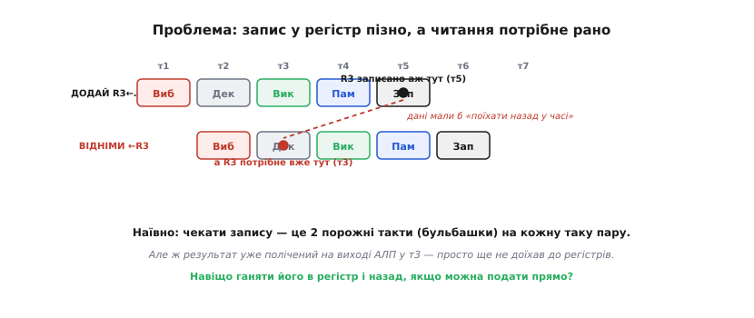
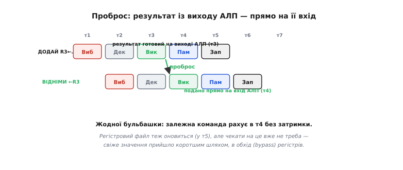
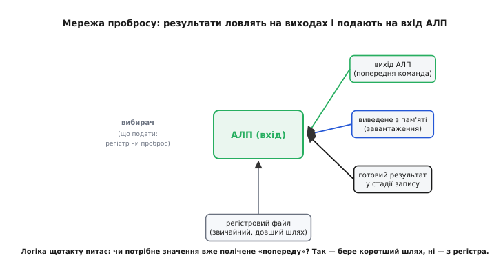
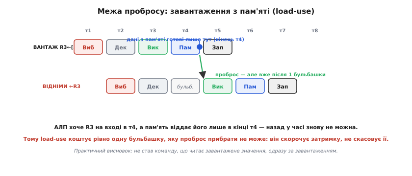

# Forwarding і bypassing: віддати результат, не чекаючи запису

Коли [конвеєр](topic:programming/pipeline) перекриває фази команд, він упирається в неприємну дрібницю: команда, що обчислила якесь число, кладе його в регістр не одразу, а лише за кілька тактів — а наступна команда, якій це число потрібне, доходить до потреби в ньому раніше, ніж воно туди потрапило. Наївний вихід — почекати. Але чекати означає спорожнити конвеєр на кілька тактів, і весь виграш перекриття тане. Forwarding (англ. *forward* — «уперед, наперед»; українською кажуть **проброс**, бо результат ніби перекидають наперед) — це трюк, що прибирає це чекання майже задарма, помітивши очевидне: потрібне число вже полічене й лежить на виході блока — просто ще не доїхало туди, куди його звикли брати. То візьмімо його коротшим шляхом.

### Проблема: результат готовий, а взяти його ще не звідки

Щоб побачити біду точно, візьмемо звичну п'ятистадійну модель конвеєра: **вибірка → декодування → виконання → пам'ять → запис** (це класична навчальна схема, за якою влаштовано й реальні прості ядра). Команда читає свої вхідні значення з [регістрів](topic:programming/processor-parts) на стадії декодування, рахує на стадії виконання (в АЛП — арифметично-логічному пристрої), а свій результат записує назад у регістр аж на останній стадії — «запис».

Тепер поставмо поруч дві залежні команди — типова пара, яку компілятор породжує щокроку:

```
ДОДАЙ   R3 ← R1 + R2      // рахує нове R3
ВІДНІМИ R4 ← R3 − 1       // одразу читає R3
```

Друга команда потребує `R3` — результату першої. Але подивімося на такти. Перша команда запише `R3` у регістр лише на своїй п'ятій стадії. А друга, ідучи конвеєром на такт позаду, дійде до читання регістрів (стадія декодування) набагато раніше — коли `R3` там ще старе. Виходить, значення, яке їй потрібне, з'явиться в регістрі **пізніше**, ніж вона його читає. Щоб узяти його «правильним» шляхом, дані мусили б поїхати назад у часі.


*Перша команда кладе `R3` у регістр лише в т5 (стадія «Зап»), а друга хоче `R3` уже в т3 (стадія «Дек»). Узяти значення з регістра неможливо — його там ще немає. Наївне рішення — змусити другу команду почекати два такти, аж поки перша долічить до запису; це два порожні такти (бульбашки) на кожну таку пару. Але число вже полічене на виході АЛП у т3 — воно існує, просто «застрягло» дорогою до регістрів.*

Це і є **залежність за даними** (той самий *data hazard*, «затор за даними», що псує [конвеєр](topic:programming/pipeline)). Наївна відповідь — вставити **бульбашки** (порожні такти), поки результат не запишеться. Але це дорого: у гарячому коді залежні пари трапляються постійно, і якщо кожна коштує один-два порожні такти, конвеєр половину часу стоятиме. Мала б бути хитріша відповідь — і вона є, варто лиш придивитися, де саме число вже існує.

### Ключове спостереження: воно вже полічене

Ось поворотна думка. АЛП завершує додавання `R1 + R2` наприкінці стадії виконання першої команди. З цієї миті результат **фізично існує** — він на виході АЛП, як напруги на дротах. Усе, що робить решта конвеєра, — це церемонія доставки: пронести значення крізь стадію «пам'ять», тоді записати його в комірку регістрового файлу, щоб пізніші команди могли його **звідти прочитати**.

Але навіщо змушувати наступну команду чекати кінця цієї церемонії, якщо вона сидить у сусідній стадії й потребує рівно того числа, що вже висить на виході АЛП? Регістровий файл тут — просто гак, звичне місце зустрічі: одна команда лишає значення, інша забирає. А коли обидві команди в конвеєрі поруч, значення можна передати **з рук у руки**, не кладучи його на цей гак і не знімаючи звідти.

> 🔧 **Навіщо це.** Саме через цей трюк ви на практиці майже ніколи не бачите штрафу за прості залежності. Напишіть `int c = a + b; int d = c * 2;` — здавалося б, друга дія мусить чекати першу, і на «чесному» конвеєрі коштувала б простою. Насправді компілятор і залізо розраховують на проброс: результат `a + b` іде прямо в множення, без затримки. Тому в гарячому циклі можна вільно писати ланцюжки залежних дій — процесор їх «зшиває» пробросом, і ви не платите за це тактами. Знати, що це працює саме так, важливо, щоб не «оптимізувати» код розриванням залежностей там, де залізо й так усе покриває.

### Розв'язок: проброс — коротший шлях в обхід регістрів

Механізм прямо випливає зі спостереження. Додаймо в залізо дротову перемичку: вихід АЛП заводимо **назад на її ж вхід**. Тепер, коли наступна команда заходить у стадію виконання, її вхід беруть не з регістра (де ще старе значення), а прямо з виходу АЛП, де щойно з'явилося свіже. Значення обходить регістровий файл коротшою дорогою — звідси друга назва прийому: **bypassing** (англ. *bypass* — «обхід, об'їзд»; результат обходить звичну зупинку в регістрі). Forwarding і bypassing — це одне й те саме, з двох боків: «проброс наперед» дивиться, куди значення йде, «обхід» — повз що воно йде.


*Той самий випадок, але з дротом пробросу. Результат `R1 + R2` готовий на виході АЛП у т3; його ведуть прямо на вхід АЛП другої команди в т4, і та рахує без жодної затримки. Регістровий файл теж оновиться (у т5) — звідти читатимуть ще пізніші команди, — але сусідній команді чекати на це вже не треба: свіже значення прийшло в обхід, коротшим шляхом.*

Результат разючий: пара залежних команд, що наївно коштувала б два порожні такти, тепер іде **без жодного** — конвеєр не гальмує. І це не програмна хитрість, а кілька дротів та маленький вибирач (мультиплексор) на вході АЛП: логіка щотакту вирішує, звідки брати кожен вхід — зі звичного регістра чи з дроту пробросу. Ніяких команд для цього не існує, програміст цього не бачить і не вмикає; це вбудований у конвеєр механізм, що працює сам.

### Звідки ще беруть значення: мережа пробросу

Вихід АЛП — не єдине джерело свіжих значень. Результат може «висіти готовим» і на інших стадіях: команда, що вже пройшла виконання й чекає в стадії пам'яті чи запису, теж має напоготові число, якого потребує молодша команда. Тому в реальному конвеєрі проброс — не один дріт, а **мережа**: результати ловлять на виходах кількох стадій і подають на вхід АЛП через той самий вибирач. Логіка порівнює, який регістр читає поточна команда, з тим, який регістр записують команди, що йдуть попереду, — і якщо збіг є, бере значення коротшим шляхом замість регістра.


*Джерел свіжого значення кілька: вихід АЛП (щойно полічений результат попередньої команди), дані, виведені з пам'яті (завантаження), і готовий результат у стадії запису. Усі вони сходяться до вибирача на вході АЛП. Звичайний шлях — читання з регістрового файлу — довший; вибирач щотакту вирішує, чи є потрібне значення вже «попереду», і якщо є, бере його коротшим шляхом. Ця логіка й зшиває залежні команди без простоїв.*

Ось чому проброс покриває майже всі залежності за даними: хоч би де в конвеєрі вже з'явився потрібний результат, його підхоплять і подадуть, куди треба. «Майже» тут — не випадкове слово; є один випадок, де навіть проброс безсилий, і саме він визначає межу прийому.

### Межа: завантаження з пам'яті (load-use)

Проброс переміщує значення в **просторі** — з виходу одного блока на вхід іншого. Але він не вміє переміщувати його в **часі**: якщо число ще не полічене, подавати нема чого. І є команда, для якої результат об'єктивно не встигає, — **завантаження** (читання з пам'яті).

Причина в тому, коли з'являється результат. У АЛП-команди він готовий наприкінці стадії виконання. А в завантаження значення приходить із пам'яті лише наприкінці стадії пам'яті — на цілий такт пізніше. Якщо одразу за завантаженням іде команда, що читає завантажене, ця друга команда хоче вхід на початку своєї стадії виконання — а пам'ять віддасть значення лише наприкінці цього ж такту. Знову «назад у часі», знову неможливо.

```
ВАНТАЖ  R3 ← [R1]        // читає R3 з пам'яті
ВІДНІМИ R4 ← R3 − 1      // одразу хоче R3 — а він ще не виведений
```


*Завантаження отримує дані з пам'яті лише наприкінці т4. Залежна команда хоче їх на вході свого «Вик» — і якби йшла впритул, це знову означало б «назад у часі». Тому конвеєр вставляє рівно одну бульбашку: залежна команда чекає такт, після чого проброс уже встигає подати виведене значення на її вхід. Одна затримка тут неминуча — проброс скорочує втрату (замість кількох тактів чекання — один), але скасувати її не може.*

Це називають **load-use hazard** («затор „завантаження — використання“»): пара, де команда читає значення, щойно завантажене з пам'яті. Він коштує рівно одну бульбашку, і жоден проброс її не прибере — вона з фізики часу, а не з невдалого залізного рішення. Що тут важливо зрозуміти: проброс **зменшує** штраф (без нього чекання тривало б, поки значення дійде до регістра, — кілька тактів; з ним — лише один), але там, де результату ще нема, зменшувати нема від чого до нуля.

І ось звідси випливає єдина практична порада цієї теми — уже для того, хто пише код.

### Що це означає для коду

Проброс — залізний і невидимий, керувати ним не можна. Але load-use — той стик, де порядок команд усе-таки впливає на швидкість, і компілятор про це знає. Розгляньмо копіювання зі збільшенням, типове в обробці даних давача:

```c
// A) читаємо і одразу використовуємо — load-use майже впритул
for (int i = 0; i < n; i++)
    out[i] = in[i] + 1;      // in[i] щойно завантажено, і одразу йде в додавання
```

Тут кожна ітерація має пару «завантажити `in[i]` → додати». Наївно це бульбашка на ітерацію. Але компілятор, знаючи про load-use, зазвичай **переставляє** команди: поки чекається завантажене значення поточного елемента, він встигає почати завантаження наступного або порахувати адресу — заповнює той такт корисною роботою, щоб бульбашки не було. Це називають плануванням команд, і робить його компілятор автоматично при ввімкненій оптимізації. Тому наведений простий цикл на практиці зазвичай іде без штрафу — не тому, що load-use зник, а тому, що дірку в конвеєрі заповнено сусідньою роботою.

Практичний висновок звідси стриманий і чесний: у переважній більшості випадків **нічого спеціального робити не треба** — проброс покриває залежності, а компілятор ховає load-use. Знати про них варто радше для розуміння, чому іноді короткий ланцюжок «завантаж — одразу порахуй — знову завантаж те саме» на щільному коді працює трохи повільніше за очікуване, і чому компілятор із оптимізацією так любить перемішувати ваші рядки місцями. Це не хаос — це він розкладає команди так, щоб проброс і бульбашки лягли якнайкраще.

### Чому це важлива ідея, а не дрібний трюк

Проброс легко списати на дрібну оптимізацію залізняка, але без нього конвеєр був би майже безглуздий. Порахуймо на пальцях: якщо в типовому коді залежні пари — це чи не половина команд, і кожна без пробросу коштує один-два порожні такти, то конвеєр, що обіцяв [CPI](topic:programming/pipeline) близько одиниці, насправді видав би півтора-два. Уся елегантна перемога перекриття фаз з'їдалася б чеканням на власні ж результати. Проброс повертає цю перемогу: він робить так, що звичайний ланцюжок залежних обчислень тече крізь конвеєр рівно, майже без затримок, — і саме тому сучасні процесори справді досягають своєї обіцяної пропускної здатності, а не лишень на папері.

Ідея тримається на одному точному спостереженні — **потрібне значення часто вже існує раніше, ніж настає звичний момент його взяти**, — і на дешевому залізі, що це спостереження втілює: кілька дротів і вибирач. Це не про пам'ять і не про порядок команд у програмі; це про те, щоб не ганяти щойно полічене число довгим офіційним маршрутом, коли є коротка стежка з рук у руки. Прийом народився ще на ранніх конвеєрних машинах і відтоді є в кожному конвеєрному процесорі — від крихітних ядер мікроконтролерів до настільних; [коротка історія того, де проброс зʼявився вперше й чому його вважають межею того, що конвеєр може зробити сам](topic:programming/forwarding-bypassing/hist-forwarding.md), показує, наскільки рано інженери це помітили. А та сама логіка «звідки взяти найсвіжіше значення» стає ще розлогішою й хитрішою в процесорах, що виконують команди [не строго по черзі](topic:programming/superscalar), — але кістяк ідеї там той самий: результат готовий — віддай його, не чекаючи запису.
