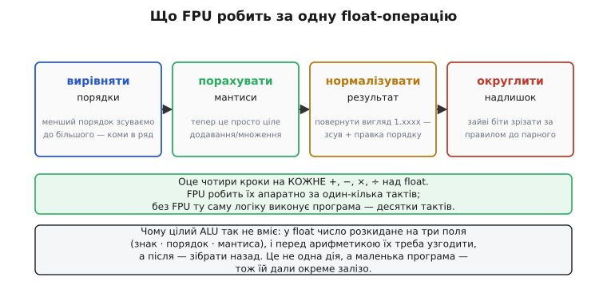
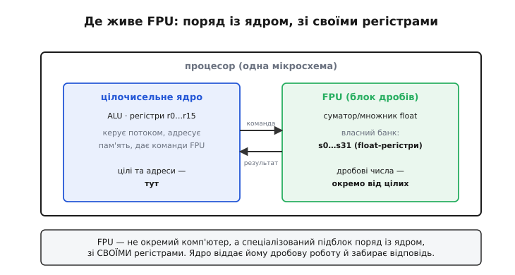
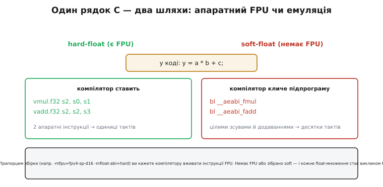
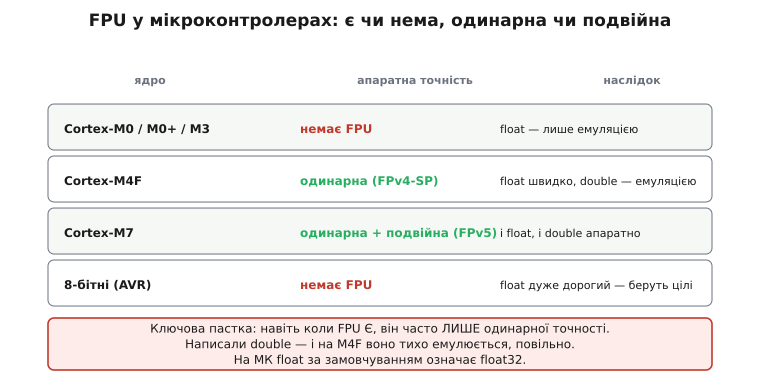

# Блок дробових чисел (FPU)

Помножити два цілих числа процесор уміє однією командою — суматор і трохи логіки, і за такт готово. А от помножити два [числа з плаваючою комою](topic:programming/floating-point) — 3.14 на 2.5 — виявляється несподівано важкою справою. Не тому, що множення саме по собі складне, а тому, що float-число розкидане по бітах на три окремі поля, і перш ніж хоч щось порахувати, ці поля треба узгодити. Ціле арифметичне ядро (*ALU*, arithmetic logic unit) так не вміє — для нього це не одна дія, а маленька програма. Саме щоб ту програму не гнати повільним кодом, а виконувати залізом за кілька тактів, у процесор вбудовують окремий підблок — **блок дробових чисел** (*FPU*, floating-point unit; від *floating point* — «плаваюча кома»).

Розберімо спершу, звідки береться ця трудність, — бо саме вона пояснює, навіщо FPU взагалі існує і чому без нього float такий дорогий.

### Чому дробова арифметика — це маленька програма

Ціле число лежить у регістрі суцільним шматком: усі біти означають одне — величину. Додати два таких — вирівнювати нічого не треба, суматор просто складає розряд за розрядом. З float усе інакше. Формат [IEEE 754](topic:programming/floating-point) ділить 32 біти на **три поля**: знак, порядок (куди зсунута кома) і мантису (значущі цифри). Число — це `мантиса × 2^порядок`, і ось тут криється заковика: щоб додати два таких числа, їхні коми мусять стояти в одному місці, а вони майже ніколи не стоять.

Уявімо `100.0 + 0.5` у двійковій науковій нотації: перше — це приблизно `1.5625 × 2⁶`, друге — `1.0 × 2⁻¹`. Порядки різні (6 і −1), тож мантиси «зсунуті» одна відносно одної на сім розрядів. Просто скласти цифри мантис не можна — вийде нісенітниця. Спершу менше число треба **підтягнути** до більшого порядку, зсунувши його мантису праворуч на сім бітів, і аж тоді додавати. А після додавання результат може вилізти за межі вигляду `1.xxxx` (мантиса завжди має бути в діапазоні [1, 2) для нормальних чисел), тож його доводиться **нормалізувати** назад — знову зсув і правка порядку. А зсуви відкидають молодші біти, тож наприкінці ще й **округлити** за правилом стандарту.


*Кожне +, −, ×, ÷ над float — це не одна дія, а чотири. Вирівняти порядки (зсунути менше число), порахувати мантиси (тепер це просте ціле додавання чи множення), нормалізувати результат назад у вигляд 1.xxxx і округлити зайві біти до парного. FPU виконує весь ланцюжок апаратно за один-кілька тактів; без нього ту саму логіку крок за кроком робить програма — десятки тактів на одну операцію.*

Ось у чому суть: те, що для цілих — одна команда, для float розпадається на цілу процедуру з умовами, зсувами й округленням. Виконувати її **звичайними** цілими інструкціями можна (і саме так роблять там, де FPU немає), але кожна дрібна `a * b` перетворюється на десятки тактів. Для формул, де таких множень мільйони на секунду — фізика, графіка, цифрові фільтри, керування двигуном, — це неприйнятно повільно. Отут і з'являється рішення: винести всю цю логіку в **окреме залізо**, спроєктоване робити саме її й нічого більше.

### Що таке FPU: спеціалізоване залізо для дробів

FPU — це апаратний блок усередині процесора, у якому кроки вирівнювання, обчислення, нормалізації й округлення виконуються **паралельними схемами** за такт-два, а не низкою команд. Замість того щоб цілий ALU натужно емулював float через зсуви, FPU має власні спеціалізовані суматор і множник, що працюють прямо з полями формату IEEE 754.

Ключова деталь, яку легко проґавити: FPU має **власний набір регістрів**, окремий від цілих. У цілочисельного ядра свої регістри (у ARM це `r0…r15`), у FPU — свої, під float-значення (в ARM це `s0…s31` для одинарної точності). Дробові числа живуть окремо від цілих і адрес, і між двома «світами» дані ганяють спеціальними командами пересилання.


*FPU — не окремий комп'ютер, а спеціалізований підблок на тій самій мікросхемі поряд із цілочисельним ядром. Ядро керує потоком програми, адресує пам'ять і тримає цілі та адреси у своїх регістрах (r0…r15). FPU тримає дробові числа у власному банку (s0…s31) і рахує над ними. Ядро віддає FPU дробову роботу командою й забирає результат — два блоки, дві ролі, спільний кремній.*

Через це відокремлення FPU інколи називають **співпроцесором** (*coprocessor* — «спів-» + «процесор», той, що працює *поряд* із головним). Назва історична, і вона напряму пов'язана з тим, як цей блок з'явився.

> 🔧 **Навіщо це.** Окремий банк float-регістрів — це не абстракція, а причина цілком практичної пастки. Коли ядро перемикається між задачами чи заходить у [перерву](topic:programming/interrupt-vector) (*interrupt*), воно зберігає й відновлює свої регістри. Але регістри FPU — це **додатковий** стан, і якщо у функції-обробнику раптом трапиться float-операція, а систему не налаштували зберігати FPU-контекст, значення в `s0…s31` затруться посеред чужого обчислення — і виникне рідкісний, майже невідтворний баг. Тому на мікроконтролерах із FPU питання «хто і коли зберігає float-регістри» — не дрібниця, а частина базового налаштування прошивки. Докладно цей механізм — у темі [FPU-стан у ISR](topic:programming/fpu-context-isr).

### Від співпроцесора до одного кристала

Спершу FPU фізично був **окремою мікросхемою**, яку ставили поряд із головним процесором. Класичний приклад — [Intel 8087](topic:programming/fpu/hist-fpu.md), випущений 1980 року: перший математичний співпроцесор, що працював у парі з процесором 8086/8088. Хочеш швидку дробову арифметику — докуповуй і встромляй у сокет окремий чип; немає його — процесор рахує float повільно, програмою. Саме робота над 8087 підштовхнула появу стандарту IEEE 754, який зробив float однаковим на всіх машинах — це задокументований, усталений факт.

З часом транзистори здешевшали настільки, що тримати FPU окремо стало недоцільно. 1989 року Intel випустила процесор 80486DX, у якому FPU вже вбудований у **той самий кристал**, що й ядро. Слово «співпроцесор» лишилося як данина минулому, хоча блок тепер не «поряд», а всередині. Цікавий слід тієї епохи — дешевша модель 486SX, де фізичний FPU просто **вимкнули** (у ранніх версіях), щоб продавати чип без дробового прискорення дешевше. Це нагадує головне: FPU — не обов'язкова частина процесора, а **опція**, і чи вона є, залежить від конкретної моделі.

Сьогодні у настільних і серверних процесорах FPU є завжди — там дробова арифметика норма. А от у світі мікроконтролерів усе інакше, і саме там знання про FPU стає щоденно важливим.

### Як увімкнути FPU: hard-float і soft-float

Написати `float y = a * b + c;` можна на будь-якому процесорі. Питання в тому, **у що** компілятор це перетворить, і відповідей рівно дві.

Якщо збірку налаштовано під наявний FPU (це зветься **hard-float** — «апаратна дробова»), компілятор ставить прямі інструкції FPU: одну на множення, одну на додавання. Це кілька тактів, дуже швидко. Якщо ж FPU немає або збірку зроблено в режимі **soft-float** («програмна дробова»), той самий рядок C компілятор перетворює на **виклики бібліотечних підпрограм** — функцій, що емулюють float цілими зсувами й додаваннями. Кожне множення стає викликом на кшталт `__aeabi_fmul`, кожне додавання — `__aeabi_fadd`, і це вже десятки тактів на операцію.


*Той самий y = a * b + c. Ліворуч, з FPU (hard-float): компілятор ставить дві апаратні інструкції vmul.f32 і vadd.f32 — одиниці тактів. Праворуч, без FPU (soft-float): компілятор кличе бібліотечні функції __aeabi_fmul і __aeabi_fadd, що рахують float цілими операціями — десятки тактів. Вибір робить прапорець збірки (напр., -mfpu=fpv4-sp-d16 -mfloat-abi=hard), а не сам код.*

Практичний висновок звідси один: наявність FPU у залізі ще не означає, що ваш код ним користується — це вмикають **прапорцем компілятора**. Зібрали прошивку soft-float на чипі з FPU — і весь дробовий розрахунок марно повзе через емуляцію, хоча залізо простоює. Тому в проєктах під мікроконтролер із FPU перевірка правильних прапорців тулчейну — одна з перших речей, які варто зробити.

**Приклад (та сама формула, різна ціна).** Проста дробова обробка в прошивці — типовий випадок, де вибір між hard- і soft-float видно на очах.

```c
// Перерахунок сирого відліку АЦП у напругу (Вольти):
float adc_to_volts(uint16_t raw) {
    return (float)raw * (3.3f / 4095.0f);   // одне ділення (стале, згорне компілятор)
                                             // + одне множення на float
}
```

На Cortex-M4F із hard-float це множення — одна інструкція FPU, кілька тактів. На Cortex-M0 без FPU той самий рядок обернеться викликом емулюючої функції множення float — десятки тактів. Якщо `adc_to_volts` кличуть тисячі разів на секунду в циклі опитування давача, різниця між «одиниці тактів» і «десятки» стає різницею між «встигаємо» і «ні». Там, де FPU немає, а швидкість критична, дробові розрахунки часто переписують на [фіксовану кому](topic:programming/fixed-point) — цілу арифметику з уявним масштабом, яка не потребує ні FPU, ні повільної емуляції.

### Пастка мікроконтролерів: є FPU чи нема, і якої точності

На настільному процесорі про FPU можна не думати — він там завжди й повний. На мікроконтролері це щоразу відкрите питання, і відповідь визначає, писати float вільно чи обходити його.


*Дрібні ядра (Cortex-M0/M0+/M3, 8-бітні AVR) FPU не мають зовсім — float на них лише емулюється, повільно. Cortex-M4F має FPU одинарної точності (розширення FPv4-SP): float32 швидкий, а от double доводиться емулювати. Cortex-M7 має і одинарну, і подвійну (FPv5) — обидва апаратно. Пастка: навіть коли FPU є, він часто лише одинарної точності, тож необережний double тихо повзе через емуляцію.*

Ці факти про ядра ARM — усталені, з офіційної класифікації: Cortex-M0, M0+ і M3 не мають FPU; Cortex-M4 має **опційний** FPU одинарної точності (позначення FPv4-SP); Cortex-M7 додає опційну подвійну точність (FPv5). Слово «опційний» тут важливе — навіть у межах одного ядра виробник чипа міг FPU не поставити.

Звідси випливає підступна, дуже поширена пастка. Припустімо, у вас Cortex-M4F — FPU є, ви радієте й пишете:

```c
double x = sin(angle);   // double, а не float!
double y = x * scale + offset;
```

FPU у M4F — **лише одинарної точності** (float32). Тип `double` — це float64, подвійна точність, якої це залізо апаратно не вміє. Тож, попри наявний FPU, кожна з цих операцій тихо піде через **програмну емуляцію** double — повільно, ніби FPU й немає. Виправлення просте, але його треба знати: на такому чипі беруть `float`, а не `double`, і функції з суфіксом `f`:

```c
float x = sinf(angle);   // sinf, не sin — одинарна точність
float y = x * scale + offset;   // тепер усе через апаратний FPU
```

Один пропущений суфікс `f` — і замість швидкого апаратного шляху програма непомітно з'їжджає на повільну емуляцію. Компілятор попередження не дасть: код формально правильний, просто в рази повільніший. Тому на мікроконтролері правило таке: спершу дізнайся, чи є FPU і якої він точності, і лише тоді вирішуй, чи можна взагалі вживати `double`, чи все тримати на `float`, а де швидкість критична — на [фіксованій комі](topic:programming/fixed-point).

> 🔧 **Навіщо це.** Три речі варто винести про FPU в реальній розробці. Перше: FPU — це апаратне прискорення дробів, і на мікроконтролері воно **не завжди є** — на дрібних ядрах (Cortex-M0/M3, 8-бітні чипи) float лише емулюється, десятки тактів на операцію, тож там float уникають на користь [фіксованої коми](topic:programming/fixed-point). Друге: навіть коли FPU є, він часто **лише одинарної точності** — пишіть `float` і функції з суфіксом `f` (`sinf`, `sqrtf`), бо необережний `double` тихо з'їде на повільну емуляцію без жодного попередження. Третє: наявність FPU у залізі ще не вмикає його — це роблять **прапорці компілятора** (hard-float проти soft-float), тож у новому проєкті перевірте, що тулчейн справді ставить інструкції FPU. І завжди пам'ятайте про [FPU-стан у обробниках перерв](topic:programming/fpu-context-isr): окремий банк float-регістрів треба зберігати при перемиканні контексту, інакше — рідкісний і злий баг.

---

**Блок дробових чисел (FPU)** — це спеціалізоване залізо всередині процесора, що виконує арифметику [плаваючої коми](topic:programming/floating-point) апаратно. Потрібен він тому, що одна float-операція — це насправді чотири кроки (вирівняти порядки, порахувати мантиси, нормалізувати, округлити); без FPU їх повільно емулює програма (десятки тактів), з FPU вони йдуть за один-кілька тактів. FPU має **власний банк регістрів** (в ARM — `s0…s31`), окремий від цілих, — звідси стара назва «співпроцесор» і практичне питання збереження FPU-контексту в перервах. Історично FPU був окремою мікросхемою ([Intel 8087](topic:programming/fpu/hist-fpu.md), 1980), а з 1989 року (80486DX) переїхав на один кристал із ядром; він і досі **опція**, а не обов'язок. Користування ним вмикають **прапорцями компілятора** (hard-float проти soft-float). На мікроконтролерах головні пастки: FPU може взагалі не бути (Cortex-M0/M3, AVR) і він часто **лише одинарної точності** (Cortex-M4F), тож необережний `double` тихо повзе через емуляцію — на МК беруть `float` і функції з суфіксом `f`, а де швидкість критична — [фіксовану кому](topic:programming/fixed-point).
