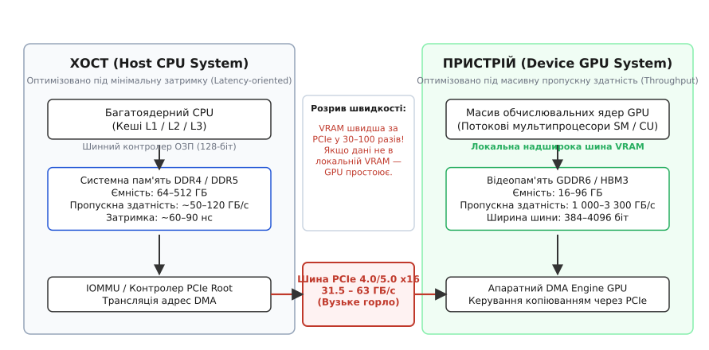
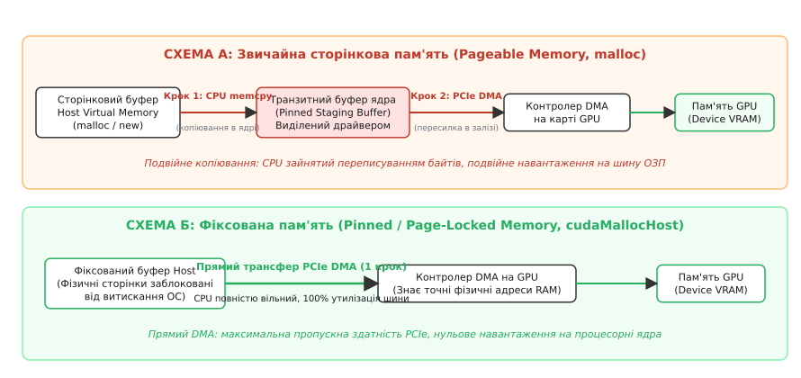
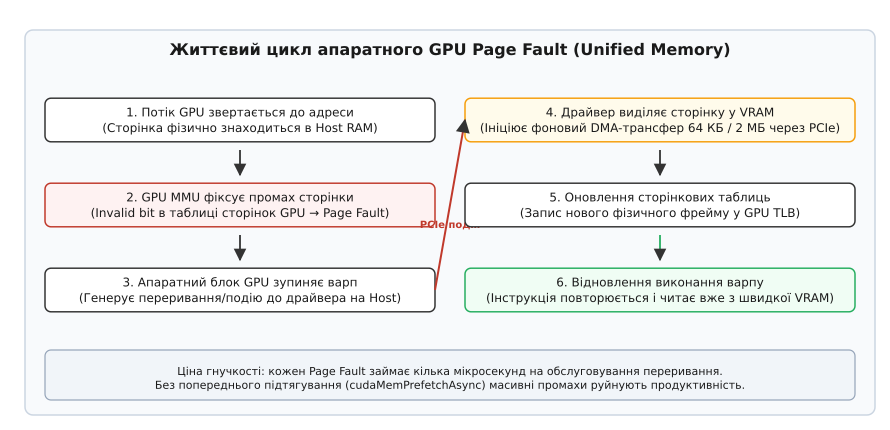
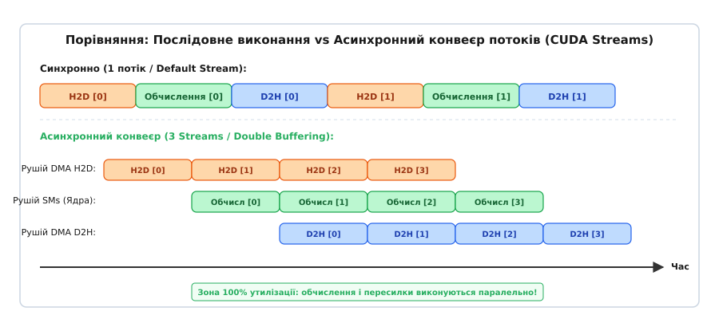

# Моделі пам'яті Host і Device

<preknowlist>
- [Віртуальна пам'ять](topic:programming/virtual-memory) — сторінкова організація пам'яті, таблиці сторінок та трансляція адрес.
- [Контролер DMA](topic:programming/dma-controller) — прямий доступ до пам'яті периферійними пристроями без участі процесора.
- [IOMMU: трансляція адрес для пристроїв](topic:programming/iommu) — апаратний захист та відображення фізичних сторінок для шини PCIe.
- [Кеш-пам'ять](topic:programming/cache) — ієрархія пам'яті, локальність даних і затримки звернення.
- [Когерентність кешів](topic:programming/cache-coherence) — протоколи узгодження даних між незалежними обчислювальними вузлами.
- [Проблема потоку даних і пропускна здатність](topic:programming/dma-problem) — вузькі місця шинних інтерфейсів при передачі масивів.
</preknowlist>

Сучасний графічний процесор рівня NVIDIA H100 або AMD Instinct MI300 містить понад 16 000 обчислювальних ядер і здатний виконувати понад 60 трильйонів операцій над числами з плаваючою комою за одну секунду (60 TFLOPS для FP64). Проте будь-яка арифметика миттєво зупиняється, якщо обчислювальні ядра вичерпують вхідні дані. Коли масив чисел лежить у системній оперативній пам'яті процесора ([Host RAM](topic:programming/virtual-memory)), передача даних до графічного прискорювача відбувається через системну шину PCIe 5.0 x16 із теоретичною межею швидкості близько 63 ГБ/с. Водночас власна локальна пам'ять прискорювача ([Device VRAM](topic:programming/dma-problem)) стандарту HBM3 здатна живити ядра зі швидкістю понад 3 300 ГБ/с. Ця прірва у понад 50 разів перетворює шину передачі даних на головне вузьке місце гетерогенних обчислень: невдало організоване пересилання змушує кремній за десятки тисяч доларів простоювати 98% часу в очікуванні надходження чергового байта.

> 🔧 **Навіщо це.** Розробники нейромереж, фізичних симуляторів і систем комп'ютерного зору регулярно спостерігають ситуацію, коли перенесення коду на GPU замість очікуваного прискорення призводить до уповільнення у 2–5 разів. Причина майже завжди криється не в алгоритмі обчислювального ядра, а в наївному копіюванні пам'яті: передача масиву на 500 МБ туди й назад через повільний сторінковий буфер займає 40 мілісекунд, тоді як саме обчислення триває менше 1 мілісекунди. Розуміння фізичної будови пам'яті Host і Device та коректне використання моделей виділення дозволяє повністю усунути ці простої за рахунок прямого DMA, апаратної сторінкової міграції та перекриття передач з обчисленнями.

## Два світи та прірва між ними: фізична архітектура гетерогенної пам'яті

Гетерогенна система складається з двох кардинально відмінних обчислювальних комплексів, кожен із яких спроєктований під власну філософію продуктивності:

```
+-------------------------------------------------------------------------+
|                              ХОСТ (Host CPU)                            |
|  Багатоядерний CPU  <--->  L1/L2/L3 Кеші  <--->  DDR4/DDR5 RAM (64–512GB)|
|  Затримка: ~60–90 нс                           Пропускна здатність: ~60–120 ГБ/с |
+-------------------------------------------------------------------------+
                                    |
                    Шина PCIe 4.0/5.0 x16 (31.5–63 ГБ/с)
                    Затримка транзакції: ~500–1000 нс
                                    |
+-------------------------------------------------------------------------+
|                           ПРИСТРІЙ (Device GPU)                         |
|  Тисячі ядер (SM/CU) <---> L1/L2 Кеші <---> GDDR6/HBM3 VRAM (16–96GB)   |
|  Затримка: ~300–600 тактів                    Пропускна здатність: 1000–3300 ГБ/с|
+-------------------------------------------------------------------------+
```

Центральний процесор (Host) орієнтований на **мінімізацію затримки** (англ. *latency-oriented*). Його завдання — якнайшвидше виконати послідовний ланцюжок складних інструкцій із непередбачуваними розгалуженнями. Для цього процесор оснащують гігантськими багаторівневими кешами (L1, L2, L3 обсягом до сотень мегабайтів) та підключають до системної пам'яті DDR4 або DDR5 через відносно вузьку 128-бітну шину (два 64-бітних канали). Затримка звернення до оперативної пам'яті процесора становить усього 60–90 наносекунд, але пропускна здатність обмежена скромними 50–120 ГБ/с.

Графічний прискорювач (Device), навпаки, спроєктований під **максимізацію пропускної здатності** (англ. *throughput-oriented*). Його архітектура розрахована на масивно-паралельну обробку однотипних даних десятками тисяч легковагових потоків. Графічний чип не намагається зменшити затримку окремого читання — він її **ховає**: доки одна група потоків (варп, англ. *warp*, або фронт хвиль, англ. *wavefront*) очікує прибуття даних із пам'яті сотні тактів, апаратний планувальник миттєво перемикає виконання на інший готовий варп без жодних накладних витрат.


*Архітектурна топологія гетерогенної системи: широка внутрішня шина VRAM забезпечує терабайтну швидкість, тоді як міжсистемна шина PCIe лишається вузьким горлом.*

Щоб прогодувати тисячі арифметичних блоків, графічні прискорювачі використовують принципово інші типи локальної пам'яті:
1. **GDDR6 / GDDR6X**: графічна пам'ять із широкою шиною (зазвичай 256 або 384 біти) та екстремально високими тактовими частотами сигнальних ліній, що забезпечує швидкість від 500 до 1 000 ГБ/с на споживчих відеокартах. Пам'ять GDDR використовує подвоєння кількості псевдоканалів (два 16-бітних субканали на один 32-бітний чип), що дозволяє зменшити конфлікти банків при незалежних доступах сусідніх варпів.
2. **HBM2e / HBM3 / HBM3e (High Bandwidth Memory)**: багатошарові стеки кремнієвих кристалів динамічної пам'яті (DRAM), змонтовані безпосередньо поруч із обчислювальним кристалом GPU на спільній кремнієвій підкладці (*silicon interposer*) за допомогою наскрізних кремнієвих з'єднань (*Through-Silicon Vias*, TSV). Ширина шини такого з'єднання сягає 1024–4096 бітів, що дає колосальну пропускну здатність від 1 500 до понад 3 300 ГБ/с за значно нижчого енергоспоживання на переданий біт (близько 3–4 пікоджоулів на біт проти 7–10 пДж/біт у GDDR6).

Містком між цими двома світами слугує шина **PCIe (Peripheral Component Interconnect Express)**. Кожне покоління PCIe подвоює пропускну здатність сигнальної лінії, однак фізичний ліміт 16 ліній (x16) обмежує сумарний потік:
- PCIe Gen 4 x16: теоретична швидкість 31.5 ГБ/с (корисне навантаження близько 25–27 ГБ/с після відрахування службових заголовків);
- PCIe Gen 5 x16: теоретична швидкість 63.0 ГБ/с (корисне навантаження близько 50–55 ГБ/с);
- Інтерконект NVIDIA NVLink (на спеціалізованих серверах): до 900 ГБ/с двоспрямованого трафіку між обчислювальними вузлами.

На шині PCIe дані передаються у вигляді пакетів транспортного рівня (**TLP — Transaction Layer Packets**). Кожен пакет несе службовий заголовок (12–16 байтів) та корисне навантаження (*Payload*), розмір якого обмежений параметром Maximum Payload Size (MPS, зазвичай 128, 256 або 512 байтів). Якщо програма пересилає дані дрібними порціями по кілька байтів, службові заголовки пакетів з'їдають до 80% пропускної здатності шини.

Це породжує поняття **арифметичної інтенсивності** (англ. *arithmetic intensity*) — кількості математичних операцій (FLOP), що припадають на один переданий байт даних:

```
I = Число операцій (FLOP) ÷ Обсяг передачі (Байт)
```

Якщо арифметична інтенсивність алгоритму низька (наприклад, звичайне поелементне додавання двох векторів `C[i] = A[i] + B[i]`, де на 8 байтів читання та 4 байти запису припадає лише 1 операція додавання: `1 / 12 ≈ 0.08` FLOP/байт), алгоритм завжди впиратиметься виключно в пропускну здатність інтерфейсу передачі даних. Якщо дані передаються через PCIe під час кожного обчислення, продуктивність системи визначатиметься швидкістю шини PCIe, а не потужністю відеокарти. Про те, як у комп'ютерній індустрії формувалися підходи до подолання цієї прірви, можна дізнатися в [історії розвитку гетерогенної пам'яті](topic:programming/gpu-host-device-memory/hist-heterogeneous-memory.md).

## Сторінкова пам'ять ОС (Pageable Memory) і пастка подвійного копіювання

Коли програма на C або C++ виділяє блок динамічної пам'яті за допомогою стандартних викликів `malloc()`, `calloc()` або оператора `new`, операційна система виділяє так звану **сторінкову пам'ять** (англ. *pageable memory*).

Механізм [віртуальної пам'яті](topic:programming/virtual-memory) сучасної ОС організований на основі сторінок фіксованого розміру (зазвичай 4 КБ на архітектурах x86-64 та ARM64). Операційна система володіє повною свободою маніпулювання цими сторінками:
- віртуальна сторінка, що здається програмі неперервною, насправді може бути розкидана по випадкових несуміжних фізичних блоках ([фізичних фреймах](topic:programming/virtual-memory)) в оперативній пам'яті;
- якщо системної пам'яті бракує, диспетчер віртуальної пам'яті ОС може в будь-який момент вивантажити фізичну сторінку на диск у файл підкачки (*swap*);
- під час дефрагментації пам'яті або роботи механізмів об'єднання однакових сторінок операційна система може прозоро для процесу змінити фізичну адресу сторінки, оновивши запис у [таблиці сторінок](topic:programming/virtual-memory).

У цій гнучкості ховається головна перешкода для гетерогенного прискорювача. На платі відеокарти встановлено власний апаратний [контролер DMA](topic:programming/dma-controller) (Direct Memory Access). Коли програма викликає функцію передачі даних `cudaMemcpy(..., cudaMemcpyHostToDevice)`, цей DMA-контролер мусить зчитувати байти безпосередньо з фізичних ліній системної шини. 

Контролер DMA працює з **фізичними адресами** оперативної пам'яті. Він не є процесором загального призначення: він не вміє обробляти сторінкові переривання операційної системи (*Page Faults*), не вміє чекати, доки ядро Linux чи Windows підвантажить сторінку з SSD-накопичувача, і не отримує сповіщень, якщо операційна система посеред передачі перемістить фізичну сторінку на іншу адресу. Якби DMA-контролер спробував читати зі звичайної сторінкової пам'яті напряму, виник би фатальний стан перегонів: операційна система могла б підмінити сторінку, і прискорювач або прочитав би чужі конфіденційні дані іншого процесу, або скопіював би у відеопам'ять пошкоджене сміття.


*Два шляхи пересилки даних через PCIe: зверху — прихований транзитний буфер і подвійне копіювання; знизу — прямий одностадійний DMA-трансфер.*

Щоб гарантувати безпеку даних, драйвер прискорювача реалізує двоетапний обхідний шлях через **транзитний буфер** (*staging buffer*):

1. Драйвер GPU завчасно утримує в пам'яті ядра невеликий пул заблокованої незмінної пам'яті (*pinned buffer*).
2. Під час виклику `cudaMemcpy()` для сторінкової пам'яті центральний процесор (Host CPU) примусово зупиняє виконання поточної нитки й починає побайтово копіювати дані з користувацького буфера `malloc` у транзитний буфер ядра за допомогою звичайних інструкцій процесора `memcpy`.
3. Щойно порція даних опиняється у транзитному буфері, драйвер повідомляє апаратний DMA-контролер відеокарти, передаючи йому гарантовано стабільні фізичні адреси.
4. Контролер DMA прискорювача перекачує байти по шині PCIe у локальну відеопам'ять VRAM.

Ця схема називається **подвійним копіюванням** (*double buffering overhead*). Вона породжує два важких негативних наслідки:
- **Марнування ресурсів CPU**: центральний процесор замість корисної роботи завантажений тупим перекладанням мегабайтів і гігабайтів пам'яті з одного буфера в інший, що повністю забиває кеші L1–L3 та пропускну здатність оперативної пам'яті.
- **Втрата асинхронності**: виклик `cudaMemcpyAsync()` зі сторінковою пам'яттю насправді поводиться як синхронний. Процесор не може повернути керування у вашу програму, доки не закінчить першу стадію копіювання в транзитний буфер, оскільки програма могла б одразу після виклику змінити вміст масиву `malloc`.

## Фіксована пам'ять (Pinned / Page-Locked Memory): прямий коридор для DMA

Щоб позбутися проміжного копіювання й дати апаратному контролеру DMA доступ до системної пам'яті на повній швидкості шини PCIe, застосовують **фіксовану пам'ять** (англ. *pinned memory*, або *page-locked memory*).

Фіксована пам'ять виділяється спеціальними викликами середовища виконання (`cudaHostAlloc()`, `cudaMallocHost()` або `hipHostMalloc()`). Коли програма запитує таку пам'ять, драйвер через системний виклик ядра ОС (наприклад, аналог `mlock()` у POSIX або `VirtualLock()` у Windows) виконує дві фундаментальні дії:
1. Виділяє фізичні сторінки пам'яті й жорстко прив'язує їх до віртуальних адрес процесу.
2. Встановлює в ядрі операційної системи прапорець **блокування сторінок**: операційній системі суворо забороняється вивантажувати ці сторінки у swap, змінювати їхнє фізичне розташування або перевиділяти їх іншим процесам до моменту явного вивільнення пам'яті функцією `cudaFreeHost()`.

Оскільки фізичні адреси сторінок стають незмінними на весь час життя буфера, драйвер може одразу побудувати для DMA-контролера відеокарти точну таблицю фізичних адрес (через механізм [IOMMU](topic:programming/iommu) або списки розсіювання-збирання *Scatter-Gather List*).

Передача даних із фіксованої пам'яті стає **одностадійним прямим трансфером**:
- Центральний процесор узагалі не бере участі в пересиланні байтів: він лише записує команду в командний регістр DMA-контролера прискорювача (затрачаючи частки мікросекунди) і миттєво повертається до виконання власного коду.
- Контролер DMA самостійно зчитує дані з Host RAM та записує їх у Device VRAM по шині PCIe на граничній фізичній швидкості інтерфейсу (досягаючи 95–98% теоретичної пропускної здатності шини).
- Асинхронний виклик `cudaMemcpyAsync()` стає по-справжньому неблокуючим.

Погляньмо, як відрізняється робота з фіксованою та звичайною пам'яттю в коді:

:::tabs
```c
#include <stdio.h>
#include <stdlib.h>
#include <cuda_runtime.h>

#define N (16 * 1024 * 1024) /* 16M елементів = 64 МБ */

int main(void) {
    size_t bytes = N * sizeof(float);

    /* 1. Звичайна сторінкова пам'ять (повільно, подвійне копіювання) */
    float *h_pageable = (float *)malloc(bytes);

    /* 2. Фіксована пам'ять (швидко, прямий DMA-коридор) */
    float *h_pinned = NULL;
    cudaError_t err = cudaHostAlloc((void **)&h_pinned, bytes, cudaHostAllocDefault);
    if (err != cudaSuccess) {
        fprintf(stderr, "Помилка cudaHostAlloc: %s\n", cudaGetErrorString(err));
        free(h_pageable);
        return 1;
    }

    /* 3. Пам'ять пристрою у VRAM */
    float *d_data = NULL;
    cudaMalloc((void **)&d_data, bytes);

    /* Копіювання з Pinned пам'яті відбувається в 2-3 рази швидше */
    cudaMemcpy(d_data, h_pinned, bytes, cudaMemcpyHostToDevice);

    /* Звільнення ресурсів */
    cudaFree(d_data);
    cudaFreeHost(h_pinned);
    free(h_pageable);
    return 0;
}
```
```cpp
#include <iostream>
#include <vector>
#include <memory>
#include <stdexcept>
#include <cuda_runtime.h>

constexpr size_t N = 16 * 1024 * 1024; // 16M елементів = 64 МБ

// Користувацький видаляч для керування фіксованою пам'яттю через RAII
template <typename T>
struct CudaHostDeleter {
    void operator()(T* ptr) const noexcept {
        if (ptr) {
            cudaFreeHost(ptr);
        }
    }
};

template <typename T>
using UniquePinnedHost = std::unique_ptr<T[], CudaHostDeleter<T>>;

template <typename T>
UniquePinnedHost<T> make_pinned_buffer(size_t count) {
    void* raw_ptr = nullptr;
    cudaError_t err = cudaHostAlloc(&raw_ptr, count * sizeof(T), cudaHostAllocDefault);
    if (err != cudaSuccess) {
        throw std::runtime_error(std::string("Не вдалося виділити Pinned пам'ять: ") + 
                                 cudaGetErrorString(err));
    }
    return UniquePinnedHost<T>(static_cast<T*>(raw_ptr));
}

int main() {
    try {
        const size_t bytes = N * sizeof(float);

        // 1. Звичайна пам'ять у RAII-векторі (Pageable)
        std::vector<float> pageable_buf(N);

        // 2. Фіксована пам'ять через розумний вказівник (Pinned)
        auto pinned_buf = make_pinned_buffer<float>(N);

        // 3. Пам'ять пристрою
        float* d_data = nullptr;
        if (cudaMalloc(&d_data, bytes) != cudaSuccess) {
            throw std::runtime_error("Помилка cudaMalloc");
        }

        // Прямий DMA-трансфер з Pinned пам'яті
        if (cudaMemcpy(d_data, pinned_buf.get(), bytes, cudaMemcpyHostToDevice) != cudaSuccess) {
            cudaFree(d_data);
            throw std::runtime_error("Помилка копіювання");
        }

        cudaFree(d_data);
        std::cout << "Трансфер фіксованої пам'яті успішно виконано.\n";

    } catch (const std::exception& e) {
        std::cerr << "Помилка: " << e.what() << '\n';
        return 1;
    }
    return 0;
}
```
:::

### Ціна та небезпеки фіксованої пам'яті

Якщо фіксована пам'ять настільки ефективна, чому б не зробити всю оперативну пам'ять програми заблокованою? Відповідь полягає в системному балансі операційної системи.

Кожен мегабайт заблокованої пам'яті назавжди відбирається у диспетчера віртуальної пам'яті ОС. Якщо програма виділить занадто багато Pinned Memory (наприклад, 90% фізичної RAM сервера), операційна система втратить можливість керувати сторінковим простором:
- інші процеси та саме ядро операційної системи не зможуть виділити сторінки під власні потреби;
- виникне явище **пробуксовування підкачки** (*swap thrashing*), коли залишки вільних сторінок ОС будуть безперервно змушені записуватися на диск і читатися назад;
- у критичному випадку спрацює аварійний механізм ядра `OOM Killer` (Out of Memory Killer), який примусово вб'є процес, що заблокував пам'ять.

Головне інженерне правило: фіксовану пам'ять виділяють **лише під буфери передачі даних**, розмір яких суворо контролюється програмістом.

## Відображена пам'ять (Zero-Copy / Mapped Pinned Memory)

Окремим різновидом фіксованої пам'яті є **відображена пам'ять** (англ. *mapped memory*, або *zero-copy memory*). Її виділяють викликом `cudaHostAlloc(&ptr, size, cudaHostAllocMapped)`.

У цьому режимі фізична пам'ять залишається в системному ОЗП комп'ютера (Host RAM), але драйвер відображає її віртуальні сторінки безпосередньо в адресний простір графічного процесора. Викликавши функцію `cudaHostGetDevicePointer(&d_ptr, h_ptr, 0)`, програма отримує покажчик `d_ptr`, який можна напряму передавати всередину ядра CUDA `kernel<<<grid, block>>>(d_ptr)`.

```
Ядро GPU (Інструкція LD.E)
  → Промах локального кеша L1/L2 
  → Транзакція читання шини PCIe TLP
  → Контролер оперативної пам'яті Host
  → Байти повертаються через PCIe у регістр ядра GPU
```

Коли обчислювальний потік GPU виконує інструкцію читання або запису за такою адресою, графічний чип **не копіює масив у VRAM завчасно**. Замість цього потоковий мультипроцесор формує транзакцію читання або запису безпосередньо через шину PCIe.

### Де Zero-Copy виграє, а де катастрофічно програє

Прямий доступ через PCIe має специфічні характеристики, які визначають межі його застосування:

**Катастрофічний сценарій (Багаторазове використання даних)**:
Затримка одного звернення до пам'яті через PCIe становить близько 1–2 мікросекунд (порівняно з кількома наносекундами до локальної VRAM). Якщо обчислювальне ядро зчитує ті самі елементи масиву 5, 10 або 100 разів під час математичних ітерацій, кожне читання буде знову й знову долати повільну шину PCIe. Продуктивність впаде в десятки разів.

**Ідеальний сценарій (Одноразовий потоковий прохід)**:
Якщо кожен елемент вхідного масиву зчитується рівно **один раз**, обробляється і більше ніколи не використовується (наприклад, просте накладання маски на відеокадр або одноразова фільтрація потоку сенсорних даних), Zero-Copy пам'ять перемагає. Вона усуває необхідність виділяти пам'ять у VRAM і позбавляє програму від окремої фази явного копіювання `cudaMemcpy`.

**Об'єднані архітектури пам'яті (UMA / SoC)**:
На мобільних та вбудованих платформах, таких як Apple Silicon (M1/M2/M3), NVIDIA Jetson або процесори AMD APU, центральний та графічний процесори фізично розташовані на одному кристалі й підключені до однієї спільної мікросхеми оперативної пам'яті LPDDR5. На таких платформах Zero-Copy пам'ять взагалі не ходить по зовнішній шині PCIe: GPU читає пам'ять хоста через спільний внутрішній контролер пам'яті із нульовими накладними витратами копіювання.

## Керована пам'ять (Unified / Managed Memory) та сторінкова міграція на апаратному рівні

Традиційна модель із розділеними адресними просторами змушує програміста вручну тримати два набори покажчиків: `h_ptr` для CPU та `d_ptr` для GPU, явно відстежуючи, де саме наразі знаходяться свіжі дані. Це унеможливлює передачу складних динамічних структур даних: якщо ви створите на CPU бінарне дерево або зв'язний список, покажчики `node->left` та `node->right` міститимуть адреси пам'яті хоста, які стануть повністю невалідними при спробі розіменувати їх у коді ядра GPU.

Для усунення цієї прірви було створено **керовану пам'ять** (англ. *unified memory*, або *managed memory*), яка виділяється викликом `cudaMallocManaged()`.

Керована пам'ять надає **єдиний спільний покажчик**, який є однаково валідним для коду на CPU та коду на GPU. Програміст може побудувати складний граф об'єктів на боці центрального процесора й без жодних перетворень передати кореневий вказівник у ядро прискорювача.

### Апаратний механізм сторінкових промахів (GPU Page Faults)

Починаючи з архітектури NVIDIA Pascal (чипи GP100 і новіші) та AMD Vega/CDNA, керована пам'ять спирається на повноцінний апаратний блок обробки сторінкових переривань у графічному процесорі ([GPU MMU](topic:programming/virtual-memory)) та протоколи шини PCIe:
- **Address Translation Services (ATS)**: дозволяє пристрою PCIe надсилати запити на трансляцію віртуальних адрес безпосередньо до системного IOMMU процесора;
- **Page Request Interface (PRI)**: апаратний інтерфейс, за допомогою якого прискорювач сигналізує операційній системі про сторінковий промах і запитує підкачування сторінки;
- **Process Address Space ID (PASID)**: тег шини PCIe, що пов'язує транзакції пам'яті пристрою з таблицями сторінок конкретного процесу операційної системи.


*Шість фаз обробки апаратного промаху сторінки: від детекції в MMU до відновлення виконання варпу.*

Життєвий цикл звернення до сторінки в режимі On-Demand Page Migration розгортається наступним чином:

1. Програма виділяє 1 ГБ пам'яті через `cudaMallocManaged(&ptr, size)`. На цьому етапі драйвер резервує лише діапазон у віртуальному адресному просторі: фізичні сторінки у відеопам'яті VRAM ще **не виділяються**.
2. Процесор заповнює масив початковими даними: операційна система виділяє фізичні сторінки в системному ОЗП Host RAM.
3. Програма запускає обчислювальне ядро GPU. Потік ядра намагається прочитати адресу `ptr[0]`.
4. Блок керування пам'яттю GPU (MMU) звертається до внутрішніх таблиць сторінок прискорювача й виявляє, що для даної віртуальної адреси відсутній дійсний фізичний фрейм у VRAM (*Invalid Entry*).
5. Апаратний блок генерує **GPU Page Fault**. Планувальник призупиняє виконання варпу, який здійснив промах, і ставить його в чергу очікування.
6. Контролер прискорювача надсилає сигнал переривання через шину PCIe до драйвера на хості.
7. Драйвер виділяє фізичну сторінку (розміром 64 КБ або 2 МБ) у відеопам'яті VRAM і запускає фоновий DMA-трансфер необхідного блока з Host RAM у Device VRAM.
8. Після завершення копіювання драйвер оновлює таблицю сторінок GPU ([TLB](topic:programming/tlb)) і надсилає сигнал підтвердження.
9. Призупинений варп відновлює виконання: інструкція читання повторюється і миттєво отримує дані вже з локальної надшвидкої VRAM.

### Пастка пробуксовування (Page Thrashing) та оптимізація через Prefetching

Попри колосальну зручність, наївне використання `cudaMallocManaged()` без розуміння апаратної ціни може призвести до катастрофічного падіння швидкодії через явище **пробуксовування сторінок** (*page thrashing*, або ефект пінг-понгу):

Якщо центральний і графічний процесори по черзі звертаються до одних і тих самих віртуальних адрес (наприклад, у циклі: CPU генерує порцію даних, GPU рахує, CPU перевіряє один елемент, GPU продовжує), кожне звернення генеруватиме Page Fault. Фізичні сторінки будуть безперервно мігрувати туди й назад через повільну шину PCIe блоками по 64 КБ, паралізуючи роботу обох процесорів.

Щоб запобігти гранулярним затримкам сторінкових промахів під час старту ядра, застосовують **явне асинхронне підтягування сторінок** (англ. *prefetching*):

:::tabs
```c
/* C: використання керованої пам'яті з завчасним префетчингом */
#include <cuda_runtime.h>

void run_managed_computation(size_t bytes, size_t n, int device_id, cudaStream_t stream) {
    float *data = NULL;
    cudaMallocManaged((void **)&data, bytes, cudaMemAttachGlobal);

    /* Ініціалізація на CPU */
    for (size_t i = 0; i < n; ++i) data[i] = 1.0f;

    /* Завчасне підтягування сторінок у VRAM перед стартом ядра */
    cudaMemPrefetchAsync(data, bytes, device_id, stream);

    /* Ядро стартує без жодного Page Fault */
    /* kernel<<<grid, block, 0, stream>>>(data, n); */

    /* Повернення сторінок у системну RAM */
    cudaMemPrefetchAsync(data, bytes, cudaCpuDeviceId, stream);
    cudaStreamSynchronize(stream);

    cudaFree(data);
}
```
```cpp
/* C++: обгортка Unified Memory з автоматичним префетчингом */
#include <cuda_runtime.h>
#include <stdexcept>

template <typename T>
class PrefetchedManagedMemory {
public:
    explicit PrefetchedManagedMemory(size_t count) : count_(count) {
        cudaError_t err = cudaMallocManaged(reinterpret_cast<void**>(&ptr_),
                                            count_ * sizeof(T),
                                            cudaMemAttachGlobal);
        if (err != cudaSuccess) {
            throw std::runtime_error("cudaMallocManaged failed");
        }
    }
    ~PrefetchedManagedMemory() noexcept {
        if (ptr_) cudaFree(ptr_);
    }

    void prefetch_to_gpu(int device_id, cudaStream_t stream = 0) {
        cudaMemPrefetchAsync(ptr_, count_ * sizeof(T), device_id, stream);
    }

    void prefetch_to_cpu(cudaStream_t stream = 0) {
        cudaMemPrefetchAsync(ptr_, count_ * sizeof(T), cudaCpuDeviceId, stream);
    }

    [[nodiscard]] T* data() noexcept { return ptr_; }
    [[nodiscard]] size_t size() const noexcept { return count_; }

private:
    T *ptr_{nullptr};
    size_t count_{0};
};
```
:::

Виклик `cudaMemPrefetchAsync()` змушує драйвер завчасно перенести весь масив єдиним неперервним апаратним DMA-пакетом по шині PCIe. Це зводить кількість сторінкових промахів під час роботи обчислювальних ядер до абсолютного нуля, поєднуючи простоту єдиного покажчика з піковою продуктивністю прямого DMA. Повні сигнатури функцій підтягування та підказок розміщення наведені у [специфікації інтерфейсів пам'яті](topic:programming/gpu-host-device-memory/api-memory-management.md).

## Асинхронний конвеєр: перекриття пересилок та обчислень (Streams & Double Buffering)

Найвищий рівень продуктивності в гетерогенних архітектурах досягається тоді, коли передача даних через шину PCIe взагалі перестає займати додатковий час у загальному балансі виконання програми. Це стає можливим завдяки техніці **асинхронного перекриття** (*compute/transfer overlapping*).

### Три незалежні рушії графічного процесора

Кристал сучасного графічного процесора містить три повністю автономні апаратні блоки, які можуть функціонувати одночасно, не заважаючи один одному:

1. **Апаратний рушій DMA Host-to-Device (H2D)**: керує вичитуванням даних із Host RAM у VRAM через PCIe.
2. **Обчислювальний рушій (Compute Engine / SMs)**: масив потокових мультипроцесорів, що виконують інструкції ядра над даними у VRAM.
3. **Апаратний рушій DMA Device-to-Host (D2H)**: керує вивантаженням результатів із VRAM у Host RAM через PCIe.

Якщо програма працює синхронно в одному потоці, ці три рушії виконуються суворо послідовно:

```
Синхронно:
H2D [Блок 0] ---> Ядро [Блок 0] ---> D2H [Блок 0] ---> H2D [Блок 1] ---> Ядро [Блок 1] ...
(У будь-який момент часу 2 з 3 рушіїв простоюють)
```


*Конвеєризація потоків (Streams): одночасна робота рушіїв H2D DMA, Compute SMs та D2H DMA дозволяє приховати затримку передачі по PCIe за часом обчислень.*

Щоб задіяти всі три рушії одночасно, загальний масив даних розбивають на `K` незалежних блоків (тайлів) і розподіляють роботу між кількома незалежними чергами команд — **потоками CUDA** (*CUDA Streams*).

У конвеєрному режимі (зокрема за схеми **подвійної буферизації**, *double buffering*) робота трьох рушіїв перекривається:
- Рушій `H2D` завантажує блок `i + 1`;
- Обчислювальний рушій рахує блок `i`;
- Рушій `D2H` вивантажує розрахований блок `i - 1`.

### Математичний розрахунок конвеєрного прискорення

Нехай для одного блока даних розміром `M` байтів:
- `T_h2d` — час копіювання блоку на GPU;
- `T_calc` — час виконання обчислювального ядра над блоком;
- `T_d2h` — час повернення результатів блоку на CPU.

Для `N` блоків загальний час синхронного виконання дорівнює:

```
T_sync = N · (T_h2d + T_calc + T_d2h)
```

У стаціонарному режимі ідеального тристадійного конвеєра кожен новий блок завершується за час, що визначається **найповільнішою** зі стадій конвеєра (*bottleneck stage*). Загальний час становить:

```
T_pipe = T_h2d + T_calc + (N - 1) · max(T_h2d, T_calc, T_d2h) + T_d2h
```

Розглянемо числовий приклад розрахунку прискорення:
Нехай масив розбито на `N = 100` блоків. Час передачі блоку `T_h2d = 5` мс, час обчислення `T_calc = 6` мс, час повернення `T_d2h = 5` мс.

Синхронний час:
```
T_sync = 100 · (5 + 6 + 5) = 100 · 16 = 1600 мс
```

Конвеєрний час:
```
T_pipe = 5 + 6 + (100 - 1) · max(5, 6, 5) + 5    [підстановка значень у формулу конвеєра]
       = 11 + 99 · 6 + 5                          [визначення вузького місця: max(5, 6, 5) = 6]
       = 11 + 594 + 5                             [обчислення тривалості стаціонарної фази]
       = 610 мс                                   [підсумок: загальний час обробки 100 блоків]
```

Коефіцієнт реального прискорення лише за рахунок зміни архітектури керування пам'яттю:

```
S = T_sync / T_pipe = 1600 / 610 ≈ 2.62 рази
```

Швидкість роботи програми зросла більш ніж у 2.6 раза на тому самому апаратному забезпеченні без зміни жодного математичного рядка в обчислювальному ядрі! Детальний покроковий розбір реалізації цього патерну з обробкою подвійних буферів та синхронізацією подій наведено у [проєктній вставці конвеєра подвійної буферизації](topic:programming/gpu-host-device-memory/proj-async-double-buffering.md).

## Інженерний вибір моделі: матриця архітектурних компромісів

Вибір моделі пам'яті в гетерогенному застосунку — це завжди інженерний компроміс між складністю розробки, вимогами до ємності пам'яті та граничною продуктивністю. Жодна модель не є універсально найкращою для всіх випадків життя.

Нижче наведено зведену матрицю вибору оптимальної моделі пам'яті залежно від характеристик задачі:

| Критерій задачі | Рекомендована модель пам'яті | Чому саме ця модель | Головні ризики та застереження |
| :--- | :--- | :--- | :--- |
| **Максимальна обчислювальна продуктивність (Багаторазове повторне використання даних)** | **Pinned Host Memory + Локальна Device VRAM (`cudaMalloc`)** | Забезпечує максимальну локальну пропускну здатність VRAM (до 3.3 ТБ/с) та найшвидший одностадійний DMA трансфер через PCIe. | Потребує ручного керування двома адресними просторами та подвоєння структур даних. |
| **Неперервний потоковий конвеєр (Відеопотік, аудіо, сенсори, тайлова обробка)** | **Pinned Host Memory + Асинхронні потоки (Streams Double Buffering)** | Повністю приховує час передачі даних по шині PCIe за паралельним виконанням обчислювальних ядер. | Збільшує використання системної пам'яті RAM під кілька одночасних буферів; вимагає суворої черговості викликів. |
| **Одноразовий потоковий прохід без повторного читання (Streaming 1-Pass)** | **Відображена пам'ять (Zero-Copy / Mapped Pinned Memory)** | Усуває зайву фазу проміжного копіювання всього масиву у VRAM: ядра читають байти прямо з Host RAM по мірі потреби. | Багаторазове читання тієї самої адреси через PCIe призведе до катастрофічного уповільнення через затримку шини. |
| **Об'єднана пам'ять на SoC (Apple Silicon, Jetson, AMD APU)** | **Відображена або керована пам'ять (Zero-Copy / Unified)** | CPU і GPU фізично ділять спільні мікросхеми DRAM; копіювання байтів є безглуздим марнуванням енергії та шини. | Слід контролювати когерентність кешів та вирівнювання структур даних під розмір рядка кеша (Cache Line). |
| **Складні динамічні графи, дерева вказівників, C++ структури з віртуальними методами** | **Керована пам'ять (Unified Memory) + Prefetching** | Забезпечує єдиний 64-бітний віртуальний простір покажчиків: вказівники на об'єкти дійсні на обох процесорах без модифікації. | Обов'язкове використання `cudaMemPrefetchAsync()` для запобігання падінню в тисячі поодиноких Page Faults. |
| **Обсяг задачі перевищує фізичний розмір VRAM (Oversubscription)** | **Керована пам'ять на апаратних Page Faults (Pascal / CDNA+)** | Апаратний диспетчер автоматично вивантажує неактивні сторінки в Host RAM, дозволяючи обробляти масиви на 100+ ГБ на карті з 24 ГБ VRAM. | Можливе виникнення Page Thrashing, якщо робочий набір активних даних одного кроку перевищує фізичний обсяг VRAM. |

## Підсумковий синтез

Гетерогенна система — це не просто швидкий процесор із приєднаною відеокартою, а розподілена обчислювальна мережа на рівні друкованої плати. Швидкість виконання коду визначається не тим, скільки трильйонів операцій можуть виконати кремнієві ядра за секунду, а тим, наскільки ефективно спроєктовано рух даних крізь ієрархію пам'яті:

```
Host Virtual Memory (malloc)
  │  [Подвійне копіювання CPU memcpy] ✖ Повільно
  ▼
Pinned Host Memory (cudaHostAlloc)
  │  [Прямий PCIe DMA трансфер] ✔ 31.5–63 ГБ/с
  ▼
Device Global Memory / VRAM (cudaMalloc)
  │  [Надширока локальна шина 384–4096 біт] ✔✔ 1000–3300 ГБ/с
  ▼
GPU L2 Cache & Shared Memory
  │  [Локальні кристальні кеші мультипроцесорів] ✔✔✔ 5000+ ГБ/с
  ▼
Регістровий файл SM (Регістри ядер)
     [Прямий доступ за 1 такт] ✔✔✔✔ Екстремальна швидкість
```

Оволодіння моделями пам'яті Host і Device перетворює розробника з наївного користувача високорівневих бібліотек на архітектора обчислювальних систем, здатного витискати з кремнію кожен відсоток його теоретичного фізичного потенціалу.
