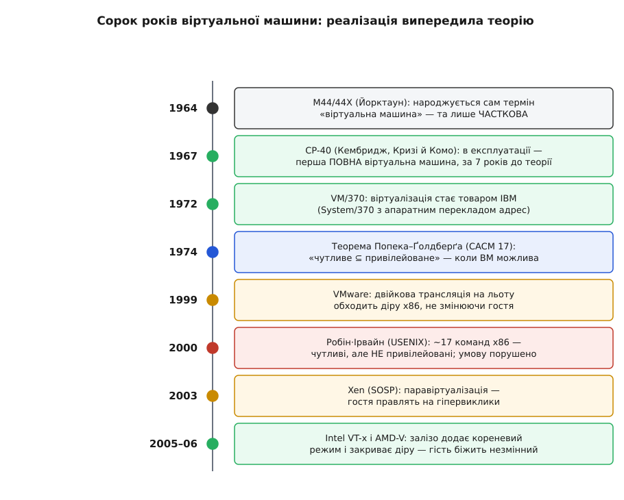
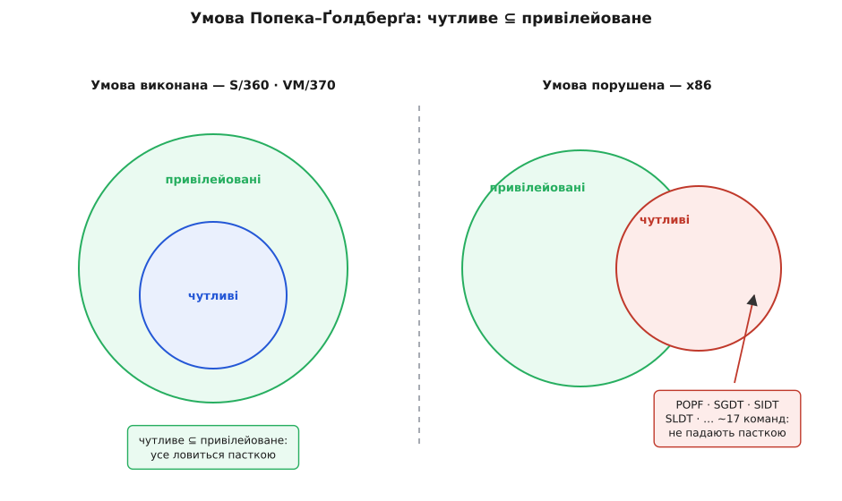

# 📜 Народження віртуальної машини

Найдивніше в цій історії — її порядок. Спершу інженери збудували машину, яка чесно вдавала багато машин, і вона роками працювала в експлуатації. І лише за сім років по тому двоє вчених вивели на папері точну умову, за якої таке взагалі можливе. Практика випередила теорію. А коли згодом на сцену вийшов x86, він порушив саме ту умову, якої люди IBM трималися наосліп, ще не знаючи, що вона має ім'я.

Розплетімо цей ланцюг по ланці: чому першу віртуальну машину зробили в Кембриджі, чому теорія спізнилася, як x86 усе поламав і чому кремній зрештою визнав давній борг.



*Сорок років одним поглядом. Зверніть увагу на порядок середніх двох ланок: робоча реалізація (1967) стоїть вище за теорію (1974), що її пояснила.*

## Кембридж, який лишився без роботи

1964 рік, будинок 545 на Technology Square у Кембриджі, штат Массачусетс. На одному поверсі — проєкт MAC Массачусетського технологічного інституту, серце тодішнього розподілу часу. На іншому — щойно відкритий Науковий центр IBM (Cambridge Scientific Center, CSC), заснований у лютому того року Нормом Расмуссеном (Norm Rasmussen).

Центр народився з поразки. IBM боролася за контракт на машину для проєкту MAC і запропонувала модифіковану System/360 з апаратним перекладом адрес — так званий «ящик Блаау» (за іменем архітектора Джеррита Блаау, Gerrit Blaauw). MIT відмовив і вибрав пропозицію General Electric; вибір зробили в травні 1964-го. Для IBM це був ляпас: її флагманську архітектуру відкинули там, де народжувалося майбутнє. Команду CSC, яка мала обслуговувати цей контракт, раптом лишили майже без діла — і саме ця вимушена свобода дала простір для зухвалого задуму.

Щоб зрозуміти задум, треба знати, чим тоді жила ця будівля. [Розподіл часу](book:programming/time-sharing-history) — коли одна дорога машина по черзі, крихітними шматочками секунди, обслуговує багатьох людей, і кожному здається, ніби він сам за пультом.

> 🔧 **Навіщо це.** Розподіл часу — той ґрунт, з якого проросла віртуалізація: спершу навчилися ділити процесорний час, а тоді захотіли віддати кожному не шматочок часу, а цілу машину. Зразком тоді була система CTSS у MIT.

Один із програмістів CTSS, які працювали під керівництвом Фернандо Корбато (Fernando Corbató), перейшов у CSC — Роберт Кризі (Robert Creasy). За переказом, рішення будувати нову систему він ухвалив в автобусі MTA дорогою з Арлінгтона до Кембриджа, в останній тиждень 1964 року; тоді ж вони з Лесом Комо (Les Comeau) за кілька днів накидали архітектуру.

Задум був сміливий до нахабства. Замість ділити *одну* операційну систему між користувачами (як CTSS), дати кожному користувачеві *цілу власну* System/360 — повний комп'ютер, зі своєю пам'яттю, своїми пристроями, своєю ОС усередині. Систему назвали CP-40 (Control Program), і з січня 1967 року вона працювала в експлуатації, тримаючи чотирнадцять віртуальних машин одночасно.

Механізм був той самий, який згодом назвуть «спіймай і зімітуй». Кожного гостя виконували в «проблемному стані» (problem state) — тобто в [режимі користувача, зниженому в правах](book:programming/protection-rings).

> 🔧 **Навіщо це.** Різниця між режимом користувача й режимом супервізора — не деталь, а вісь усієї конструкції: саме зниження гостя в правах змушує його небезпечні команди спотикатися об пастку, замість тихо захопити реальну машину.

Будь-яка привілейована команда гостя — ввід-вивід, керування пам'яттю — не виконувалася тихо, а кидала виключення вниз, до керівної програми, яка виконувала цю дію над *віртуальним* станом саме цього гостя, не чіпаючи реального заліза. Гість був певен, що команда спрацювала. Насправді її підмінили. Так само оброблялися й звернення до відсутніх сторінок пам'яті: замість передати помилку гостю, керівна програма мовчки підвантажувала сторінку.

Зверніть увагу на дату: січень 1967-го. Жодної теорії віртуалізації ще не існує — є лише машина, що працює.

**А хто ж придумав саме слово «віртуальна машина»?** Радше за все, не команда CP-40. Термін, схоже, народився трохи раніше й в іншому місці — на експериментальній машині M44/44X у дослідному центрі IBM у Йорктауні (Дейв Сейр, Dave Sayre, і Роб Нельсон, Rob Nelson). Вона стояла на модифікованому IBM 7044 і симулювала кілька «44X» — «більш-менш ідеальних машин, близьких до M44». Але M44/44X давала лише *часткову* віртуалізацію: вона не відтворювала повну копію заліза для кожного користувача. Сам Кризі згодом підсумував це дошкульно: та система була віртуальною машиною приблизно настільки ж, як CTSS, — тобто достатньо близько, щоб довести, що «достатньо близько» не рахується.

Тут варто чітко розрізнити виміри першості, бо їх легко злити в один. *Ідея* й сама *назва* — правдоподібно з M44/44X. Перша ж *повна, робоча* віртуальна машина, яка чесно вдавала цілий комп'ютер, — це CP-40 (усталений факт). Одне — задумати й назвати, інше — збудувати те, що працює.

## Товар на ім'я VM/370

CP-40 була дослідом. Її переписали під CP-67 — для System/360 Model 67, єдиної в лінії System/360, що мала апаратний динамічний переклад адрес (DAT). Цю модель анонсували ще в серпні 1965-го, і вона стала першою серійною машиною IBM з механізмом, який ми сьогодні звемо блоком керування пам'яттю.

> Динамічний переклад адрес — це апаратура, що на льоту перетворює адресу, якою оперує програма, на справжню адресу в пам'яті, дозволяючи кожній програмі мати власний суцільний адресний простір. Це фундамент, без якого віртуальна пам'ять і віртуальні машини не тримаються. Докладніше — у темі [Віртуальна пам'ять](book:programming/virtual-memory).

Справжнім товаром віртуалізація стала 1972 року, коли IBM випустила VM/370 для нової лінії System/370 — тоді ж, коли вся ця лінія нарешті отримала апаратний переклад адрес. Те, що починалося як досвід команди, яку лишили без роботи, перетворилося на промисловий продукт, і родина VM жила в IBM десятиліттями. Мейнфрейм навчився роздавати себе гостям — задовго до того, як ця ідея стала продавати хмару.

## Теорія наздоганяє практику

Тим часом визрівала теорія — і, що характерно, вона наздоганяла вже наявну практику, а не вела її. Роберт Ґолдберґ (Robert P. Goldberg) у докторській дисертації в Гарварді (1972) — «Architectural Principles for Virtual Computer Systems» — упорядкував саме поле: зокрема запровадив поділ гіпервізорів на два роди (той, що сидить прямо на залізі, і той, що працює поверх звичайної ОС), яким користуються й досі.

А 1974 року Ґолдберґ разом із Джеральдом Попеком (Gerald J. Popek) з Каліфорнійського університету в Лос-Анджелесі опублікували працю, що стала класикою, — «Formal Requirements for Virtualizable Third Generation Architectures» (Communications of the ACM, том 17, число 7, липень 1974, с. 412–421). Вони зробили те, чого доти ніхто: сформулювали *точну умову*, за якої «спіймай і зімітуй» можливий.

Поділімо всі команди процесора на роди:

```
Роди команд (Попек–Ґолдберґ, 1974):
  привілейовані  — падають пасткою, якщо виконати їх поза
                   режимом супервізора
  чутливі        — керують ресурсами машини (control-sensitive)
                   АБО їхній результат залежить від конфігурації
                   ресурсів (behavior-sensitive)
  безневинні     — усі інші

Умова віртуалізовності:   чутливі ⊆ привілейовані
```

Читається просто: машину можна віртуалізувати за пасткою тоді й лише тоді, коли *кожна* чутлива команда є водночас привілейованою. Тобто все, що торкається важливого стану машини або підглядає за ним, гарантовано впаде пасткою до гіпервізора — і жодна така команда не проскочить нишком. Якщо умова виконана, гіпервізор ловить геть усе, що варто ловити.



*Уся теорема — в одній картинці. Ліворуч чутливе вкладене у привілейоване, тож усе ловиться. Праворуч частина чутливого стирчить назовні: ці команди нічого не запускають, тому не падають пасткою.*

І ось чому CP-40 узагалі працювала: System/360 цю умову *задовольняла*. Її чутливі команди були привілейованими, тож проста схема «зниж гостя в правах — лови пастки» вкривала все. Інженери спиралися на цю властивість архітектури інтуїтивно, за сім років до того, як їй дали ім'я. Порядок відкриттів був такий:

```
CP-40 в експлуатації   — січень 1967   (працює)
Попек–Ґолдберґ, CACM   — липень 1974   (пояснює, коли працює)
розрив                 — 7 років
```

> 🔧 **Навіщо це.** Ця умова — не музейний експонат. Уся сучасна хмара тримається на тому, що чутливі команди гарантовано ловляться: якщо хоч одна пройде повз гіпервізор, гість зазирне за межу своєї машини або зіпсує сусідову. Тому питання «чи задовольняє архітектура умову Попека–Ґолдберґа» досі вирішує, чи можна на цьому залізі здавати машини в оренду.

## Діра, яку врешті назвали

Довго ця умова була академічною тонкістю. Мейнфрейми її слухалися; згодом і мінікомп'ютери здебільшого теж. А тоді світ заповнив x86 — архітектура, яку проєктували геть не для віртуалізації, і яка умови не слухалася.

2000 року Джон Робін (John Robin) і Синтія Ірвайн (Cynthia Irvine) ретельно перебрали набір команд процесора Pentium і доповіли результат на 9-му симпозіумі з безпеки USENIX. Вони знайшли близько сімнадцяти команд (за детальнішими підрахунками — до вісімнадцяти), які були *чутливі, але не привілейовані*. Тобто вони чіпали або розкривали важливий стан машини — і при цьому спокійно виконувалися в режимі користувача, не падаючи жодною пасткою. Точнісінько те, чого умова Попека–Ґолдберґа забороняє.

Класичний винуватець — `POPF`. Вона відновлює регістр прапорців зі стека, і серед прапорців є той, що дозволяє чи забороняє переривання. Виконана в режимі супервізора, вона його змінює; виконана в режимі користувача, вона мала б упасти пасткою — а натомість *тихо ігнорує* саме цю частину. Для звичайної програми це нешкідливо. Для гостьового ядра, яке щиро вважає, що керує перериваннями, це катастрофа: команда «нічого не зробила», а гіпервізор навіть не дізнався, що гість чогось хотів.

Інший рід витоку — команди на кшталт `SGDT`, `SIDT`, `SLDT`. Вони дозволяють із режиму користувача *прочитати* адреси системних таблиць процесора. Гість, який гадає, що володіє машиною одноосібно, зчитує ці адреси — і бачить не свої вигадані значення, а справжній стан заліза, крізь стіну своєї віртуальної машини. Ілюзія тріснула, і знову без жодної пастки.

Присуд однозначний і давно усталений: умову порушено, чисте «спіймай і зімітуй» на x86 неможливе. Найпоширеніша архітектура планети виявилася найгіршою для того, чого від неї зараз хотіли найбільше.

## Два обходи

Раз архітектуру не змінити, залишалося перехитрити. Знайшлося два винахідливі шляхи, і обидва обходили пастку зовсім по-різному.

Перший вигадала VMware — компанія, заснована 1998 року навколо стенфордського дослідження. Її співзасновник Мендел Розенблюм (Mendel Rosenblum) перед тим вів проєкт Disco, де звичайні операційні системи запускали поверх незвичного багатопроцесорного заліза; звідти й виросла інженерна кухня. Перший продукт, VMware Workstation, вийшов у травні 1999-го. Ідея — **двійкова трансляція**: гіпервізор не дає гостьовому ядру виконуватися напряму, а на льоту переглядає його потік команд і переписує небезпечні інструкції на безпечні виклики в себе. Ті самі `POPF` і `SGDT`, які тихо збрехали б залізу, ловляться ще до виконання — не пасткою, а переписуванням коду. Гість лишається незмінним, але його машинний код фактично перекомпільовують під час роботи.

Другий шлях обрала команда Кембриджської комп'ютерної лабораторії — тільки цього разу Кембриджа *англійського*, не массачусетського (приємний збіг: віртуальну машину народили в одному Кембриджі, а через тридцять шість років оживили в іншому). На симпозіумі SOSP 2003 року Пол Бархем (Paul Barham), Іан Пратт (Ian Pratt), Кейр Фрейзер (Keir Fraser) та їхні колеги представили Xen і працю з влучною назвою «Xen and the Art of Virtualization». Їхній підхід — **паравіртуалізація**: якщо гостя все одно доводиться якось приборкувати, то чому б не *свідомо переписати* його ядро так, щоб замість небезпечних привілейованих команд воно ввічливо кликало гіпервізор напряму — через **гіпервиклики** (hypercalls)? Виходить швидко й чисто, бо ніякого жонглювання чужим кодом не треба; ціна — гостьову ОС мусиш заздалегідь пристосувати.

Обидва підходи працювали, обидва були розумні, і обидва були складні — один жонглював трансляцією коду, другий вимагав правити гостя. Обидва існували лише тому, що залізо відмовлялося виконувати свою частину.

## Залізо визнає борг

Природний хід — полагодити саме залізо. І в середині 2000-х обидва великі виробники процесорів так і зробили, майже одночасно й майже однаково.

Intel випустила VT-x (під час розробки — «Vanderpool»): 14 листопада 2005 року дві моделі Pentium 4, 662 і 672, стали першими процесорами з цією підтримкою. AMD відповіла своєю технологією (кодове ім'я «Pacifica», спершу оприлюднена як AMD Secure Virtual Machine): 23 травня 2006 року її отримали процесори Athlon 64.

Замість латати старі режими вони додали *новий вимір* привілею — окремий кореневий режим для гіпервізора під усіма звичними кільцями гостя. Тепер гість може виконувати навіть свій повний привілейований код на рідній швидкості, а залізо тримає список подій, які варто перехопити, і саме одним махом переносить керування гіпервізору, коли така подія стається. Ті сімнадцять непокірних команд x86 більше не проблема: якщо треба, кожну з них можна змусити вийти до гіпервізора апаратно.

І ось де історія замикається в кільце. Попек із Ґолдберґом 1974 року назвали умову: чутливе має бути підмножиною привілейованого. x86 цю умову зламав — сімнадцятьма командами, що чіпали важливе, не падаючи пасткою. А VT-x і AMD-V, по суті, *відновили* умову — не переробкою набору команд, а новим рівнем, з якого гіпервізор ловить будь-що, зокрема й ті непокірні сімнадцять. Теорія назвала правило; архітектура його порушила; кремній заплатив борг. Робоча машина, теорія, діра й латка — усі чотири ланки нарешті стали на свої місця, хоч і в дивному, зворотному порядку.
