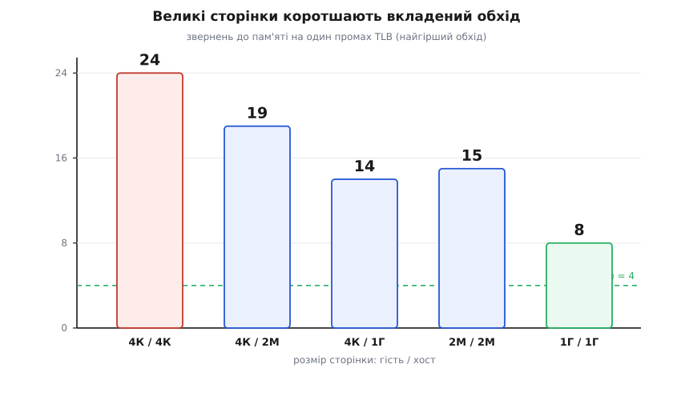

# 🧮 Двовимірний обхід сторінок: звідки береться 24

Гість просить одне число з пам'яті — прочитати вміст за своєю віртуальною адресою. Перш ніж це число повернеться, апаратний блок керування пам'яттю може сходити в реальну RAM **двадцять чотири** рази. Не двадцять чотири такти — двадцять чотири окремі походи по пам'ять, кожен зі своєю латентністю, і лише двадцять п'ятий приносить те, чого гість насправді хотів. На голому металі те саме читання коштувало б щонайбільше чотири службові звернення. Звідки береться шестикратний наріст, чому кожен запис гостьової таблиці *сам* тягне за собою повний обхід, і чому це врешті не катастрофа, а зрідка помітна ціна — виводиться тут від першопричини.

## Скільки коштує один поверх таблиць

Домовмося про базу. Переклад віртуальної адреси у фізичну робить радіксне дерево — [таблиця сторінок](topic:programming/virtual-memory), розбита на кілька рівнів. Що треба пам'ятати: адреса ділиться на кілька однакових індексів плюс зсув, і кожен індекс адресує один рівень таблиць. На x86-64 канонічна 48-бітна адреса розкладається так:

```
48-бітна адреса = 9 + 9 + 9 + 9 + 12
                  │   │   │   │   └ зсув у сторінці (4 КіБ)
                  └───┴───┴───┴ чотири 9-бітні індекси → 4 рівні таблиць
```

Кожен 9-бітний індекс вибирає один із 512 записів у своєму рівні (PML4 → PDPT → PD → PT). Щоб перекласти адресу, апаратура читає по одному запису на рівні: чотири рівні — чотири звернення до пам'яті, і п'яте вже приносить самі дані. Отже **вартість обходу дорівнює кількості рівнів**. Це наш опорний масштаб: на голому металі — рівно 4.

Тримаймо в голові *чому* саме звернення до пам'яті, а не такти: кожен наступний рівень лежить за адресою, яку ми дізналися лише з попереднього. Це ланцюг вказівників — не можна прочитати другий рівень, поки не дістав його адресу з першого. Латентність не ховається за паралелізм, бо кроки залежні.

## Чому «фізична адреса гостя» — це ще не адреса

Тепер посадимо цей механізм у віртуальну машину — і виявиться, що одна тиха підміна ламає всю простоту. Гостьова ОС будує *свої* таблиці сторінок і чесно заповнює їхні записи тим, що вважає фізичними адресами. Але «гостьова фізична адреса» (GPA) — вигадка: справжньої RAM гість ніколи не бачив. Коли апаратура читає гостьовий запис і дістає з нього GPA бази наступної таблиці, вона тримає в руках число, яке для контролера пам'яті **беззмістовне**. Піти за ним напряму не можна.

Ось корінь усього. Кожен вказівник, що ми виймаємо з гостьової таблиці, — це GPA, і перш ніж за ним піти, його треба перекласти в справжню фізичну адресу (HPA) через *хостові* таблиці, які тримає гіпервізор (Intel звe їх EPT, AMD — NPT). А переклад GPA → HPA — це не одне звернення, а такий самий обхід радіксного дерева: ще чотири рівні, ще чотири походи по пам'ять.

> 🔧 **Навіщо це.** Уся вартість вкладеного перекладу випливає з однієї несиметрії: гість вільно порядкує *верхнім* деревом (пише свої таблиці як завгодно), але жоден вказівник у ньому не веде в реальну пам'ять напряму — кожен спершу проходить крізь *нижнє* дерево гіпервізора. Гість платить за свою свободу тим, що кожен його крок дублюється хостовим обходом. Саме тому «просто додати другий рівень таблиць» коштує не вдвічі, а вшестеро.

## Обхід стає двовимірним — покрокова лічба

Порахуймо чесно, крок за кроком, обхід при повному промаху, коли в кеші перекладу немає нічого. Гість має чотири рівні, хост — чотири. Позначмо гостьові рівні gL4…gL1, хостові — hL4…hL1. Стартуємо з регістра gCR3, у якому лежить GPA бази гостьової таблиці gL4.

```
крок             що робимо                            звернень
──────────────────────────────────────────────────────────────
переклад gCR3    GPA бази gL4 → HPA  (хостовий обхід)      4
читання gL4      узяти запис → GPA бази gL3-таблиці        1
переклад         GPA бази gL3 → HPA                        4
читання gL3      узяти запис → GPA бази gL2-таблиці        1
переклад         GPA бази gL2 → HPA                        4
читання gL2      узяти запис → GPA бази gL1-таблиці        1
переклад         GPA бази gL1 → HPA                        4
читання gL1      узяти запис → GPA сторінки даних          1
переклад         GPA сторінки даних → HPA                  4
──────────────────────────────────────────────────────────────
разом обходу                                              24
читання самих даних за готовою HPA                         1
```

Придивімося до візерунка, бо він і є відповідь. Хостових обходів — **п'ять**, по чотири звернення кожен: ми перекладаємо п'ять різних GPA — базу gCR3 і чотири вказівники, які по черзі виймаємо з гостьових записів. Це 5 × 4 = 20. Між ними — **чотири** читання самих гостьових записів, щоб просунути гостьовий обхід на рівень нижче. Разом 20 + 4 = 24. Двадцять п'яте — уже не обхід, а саме дане.


*Двовимірний обхід як сітка. Кожна колонка — один гостьовий вказівник, який хост перекладає своїм чотирирівневим обходом (чотири сині клітини), а внизу колонки апаратура читає те, на що вказівник указав: гостьовий запис (жовті) або, в останній колонці, самі дані (зелена). Уся сітка — 5 × 5 = 25 звернень; двадцять чотири з них — обхід, і лише праве нижнє — дані.*

Тепер видно й загальну формулу. Нехай у гостя `g` рівнів, у хоста `h`. Гостьових вказівників для перекладу рівно `g+1` (база плюс `g` виймутих записів), кожен коштує `h` хостових звернень; плюс `g` читань самих гостьових записів:

```
звернень = (g+1)·h + g
         = (g+1)·(h+1) − 1        ← та сама величина, згорнута
```

Підставмо чотири й чотири:

```
(4+1)·(4+1) − 1 = 5·5 − 1 = 24
```

Ту саму формулу в літературі часто пишуть як `g·h + g + h` — це тотожність, бо `(g+1)(h+1) − 1 = gh + g + h`. Хоч як розкрий дужки, для `4×4` виходить 24. Красі тут стільки ж, скільки болю: наріст **множиться**, а не додається. Один вимір мав ціну `g`, другий вимір домножив її майже на `h+1`.

## Як воно росте

Опорні числа варто тримати поруч, бо вони показують, куди дме вітер архітектури:

```
конфігурація                     звернень обходу
────────────────────────────────────────────────
голий метал, 4 рівні                     4
вкладено, 4 × 4 рівні                   24     (у 6 разів більше)
вкладено, 5 × 5 рівнів (LA57)           35     (у 7 разів більше)
```

П'ятирівневе сторінкування (Intel LA57) додає гостю й хосту по рівню — і за формулою `(5+1)(5+1) − 1 = 35`. Тобто кожен новий поверх адресного простору, вигідний для великих машин, робить найгірший вкладений промах ще дорожчим, і саме тому боротьба за пам'ять у віртуалізації ніколи не закінчується. Але «найгірший промах» — ключове слово. Двадцять чотири звернення трапляються не на кожен доступ, а лише коли перекладу немає під рукою. А під рукою його тримає кеш.

## Рятує TLB: рідкісний обхід замість постійного

Уся ця арифметика стосується *промаху*. Апаратура не бігає деревом на кожне звернення гостя — вона кешує вже **готовий** переклад GVA → HPA у [буфері перекладу TLB](topic:programming/tlb): невеличкій асоціативній таблиці, яку процесор питає паралельно з доступом до кешу, тож влучання нічого не додає до затримки. Дорогий двовимірний обхід лишається лише на *промах* — і то раз, після чого результат осідає в TLB на тисячі наступних доступів у ту саму сторінку.

Складімо це в модель. Нехай влучання TLB коштує майже нуль (сховане в конвеєрі), одне звернення до RAM — умовно `c` тактів, а частка промахів — `p`. Тоді середня ціна перекладу:

```
C̄ = (1−p)·C_влуч + p·C_обхід
      C_влуч  ≈ 1 такт
      C_обхід = 24 · c            (найгірший, «холодний» обхід)
```

**Умова.** Візьмімо `c ≈ 100` тактів на звернення в пам'ять і частку промахів `p = 0.001` (одна тисячна — типово для коду з доброю локальністю). Порахуймо середню ціну одного перекладу.

```
C_обхід = 24 · 100      = 2400 тактів
C̄       = 0.999·1 + 0.001·2400
        = 0.999 + 2.4   ≈ 3.4 такту
```

Ось де ховається амортизація. Подія на 2400 тактів, що трапляється раз на тисячу доступів, розмазується в середні ~3.4 такту на переклад. TLB перетворює катастрофу на дрібницю — але лише поки промахи рідкісні. Підніміть `p` удесятеро, до 1%, і той самий обхід дає вже `C̄ ≈ 1 + 24 = 25` тактів: у сім разів дорожче за середнє. Тому головна битва — не за те, щоб обхід був коротший (хоч і за це теж), а щоб промахів було *менше*: величину `2400` множить саме `p`.

Ту саму думку зручно тримати як маленьку функцію — вона рахує і довжину обходу, і його амортизовану ціну:

```c
// Скільки звернень до пам'яті коштує один промах TLB при вкладеному
// обході: g рівнів у гостя, h — у хоста.
static inline int nested_walk_accesses(int g, int h) {
    return (g + 1) * (h + 1) - 1;          // = g*h + g + h
}

// Середня ціна перекладу з урахуванням TLB.
// p — частка промахів, c_dram — такти на одне звернення в RAM.
double avg_translate_cycles(int g, int h, double p, double c_dram) {
    double c_hit  = 1.0;                              // влучання ≈ безкоштовне
    double c_miss = nested_walk_accesses(g, h) * c_dram;
    return (1.0 - p) * c_hit + p * c_miss;
}
```

Є ще й друга лінія оборони, тонша за TLB. Верхні рівні обох дерев — gL4, hL4 і сусіди — змінюються рідко й до них раз у раз звертаються, тож вони майже завжди сидять у звичайному кеші даних або в окремому **кеші обходу** (page-walk cache), який зберігає проміжні вузли двовимірного дерева. Через це реальний промах рідко коштує всі 24 походи по DRAM: більшість із двадцяти чотирьох звернень влучає в кеш, а до самої пам'яті доходить лише кілька останніх. Отже `2400` — це стеля найгіршого випадку, а не типова ціна; практичний промах зазвичай у рази дешевший.

## Великі сторінки: коротший обхід і рідший промах

Є важіль, що б'є одразу по обох множниках — і по `24`, і по `p`. Це **великі сторінки**. Велика сторінка мапиться на *верхньому* рівні дерева, тож нижні рівні просто зникають: сторінка 2 МіБ прибирає останній рівень (обхід стає трирівневим), сторінка 1 ГіБ — два останні (дворівневим). А оскільки в нас два незалежні дерева, важіль діє окремо на гостя й на хоста: навіть якщо гість лишився на 4 КіБ, гіпервізор може підстелити його пам'ять двомегабайтними сторінками й скоротити свій вимір.

Підставмо у `(g+1)(h+1) − 1` вкорочені висоти:

```
гість / хост              g  h    звернень обходу
──────────────────────────────────────────────────
4 КіБ / 4 КіБ             4  4          24
4 КіБ / 2 МіБ            4  3          19      (лише хост уклав великі)
4 КіБ / 1 ГіБ            4  2          14
2 МіБ / 2 МіБ            3  3          15
1 ГіБ / 1 ГіБ            2  2           8
```



*Що більша сторінка — то нижче дерево з обох боків, і то коротший найгірший обхід: від 24 звернень на дрібних сторінках до 8 на гігабайтних. Пунктир — вартість на голому металі (4); повністю дожати вкладений обхід до неї не можна, але великі сторінки помітно наближають.*

І це лише половина виграшу. Один запис TLB для сторінки 2 МіБ покриває у 512 разів більше пам'яті, ніж запис для 4 КіБ, тож той самий TLB «дотягується» набагато далі — і частка промахів `p` падає на порядок. Виходить подвійний удар: рідший вхід у дорогий обхід *і* дешевший сам обхід, коли він таки стався. Через це пам'ятомісткі гості — бази даних, аналітика, наукові розрахунки — на великих сторінках ідуть майже як на голому металі, і вибір розміру сторінки в налаштуваннях хмарної машини напряму задає, скільки цих багатокрокових обходів з'їсть ваш застосунок.

## Чому 2D-обхід у залізі кращий за старий шлях

Лишається питання, від якого залежить сенс усієї вправи: якщо вкладений обхід коштує аж 24 звернення, може, старий спосіб був не гірший? Не був — і формула переходу показує чому. До вкладених таблиць гіпервізор вів **тіньові таблиці**: тримав окрему «справжню» копію гостьового дерева й мусив перехоплювати кожну правку гостя. А перехоплення — це **VM exit**: залізо зберігає весь стан гостя, віддає керування гіпервізору, той латає тінь, і керування вертається. Один такий перехід коштує тисячі тактів. Частку процесора, з'їдену переходами, легко оцінити:

```
частка на виходи = (виходів/с · тактів_на_вихід) / частота
```

Уявімо гостя, що активно править свої таблиці — стартує процеси, мапить файли — і дає 50 000 таких правок за секунду, кожна виходом по ≈2000 тактів, на 3 ГГц:

```
такти на виходи = 50000 · 2000     = 1·10⁸ тактів/с
частка          = 1·10⁸ / 3·10⁹    ≈ 0.033 = 3.3 %
```

Три відсотки машини — самі лише виходи на обслуговування тіньових таблиць, ще до корисної роботи, і кожен вихід синхронний, тобто гість на ньому стоїть. Вкладені таблиці прибирають цей клас виходів цілком: гість тепер править своє верхнє дерево **вільно, без жодної пастки** — бо його вказівники все одно нічого не важать, поки не пройдуть крізь незмінне нижнє дерево гіпервізора. Ціною за цю свободу став довший обхід при промаху. Але обхід іде цілком у залізі, без єдиного виходу, і TLB амортизує його до кількох тактів, тоді як тіньовий вихід — це тисячі тактів синхронного простою *на кожну правку*.

Ось точний обмін, який зробило залізо: **часті дорогі виходи** проміняли на **рідкісні дешеві обходи**. Двадцять чотири звернення виглядають страшно поряд із чотирма, та коли їх ділить на тисячу TLB-влучань і майже всі вони влучають у кеш, вони обходяться дешевше, ніж один-єдиний VM exit, якого більше не треба робити. Саме ця арифметика — а не гарне слово «апаратна» — і зробила віртуалізацію пам'яті майже безкоштовною.
