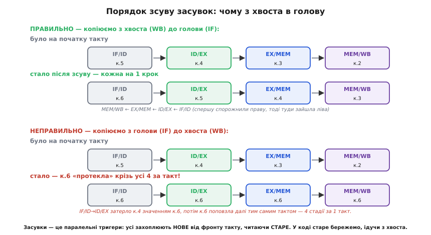
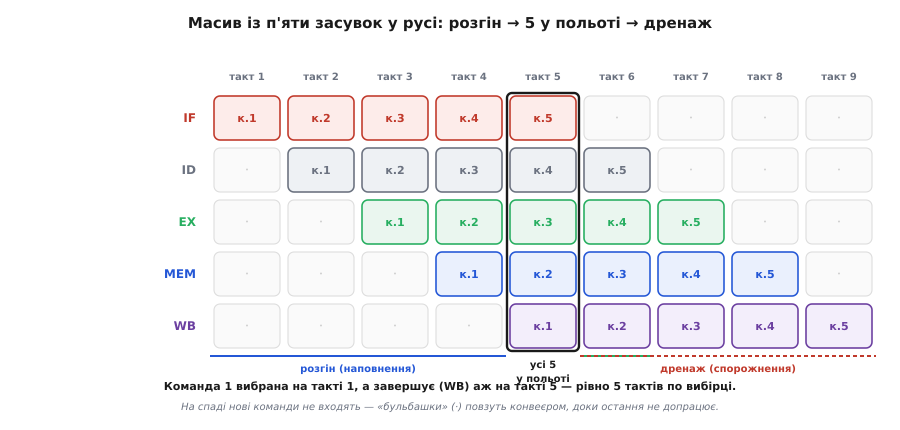

# ⚙️ Конвеєр із засувок у C: один такт, п'ять команд у польоті

Стадії й засувки легко намалювати стрілками. Але поки не побачиш, як засувки **зсуваються в коді**, у голові лишається тонка невизначеність: добре, полиці передають стан далі — а що саме на них лежить, у якому порядку їх чіпати, чому команда фінішує рівно за п'ять тактів, а не швидше? Найнадійніший спосіб прибрати цю невизначеність — зробити конвеєр **річчю, яку можна запустити**: масив засувок, одна функція такту, і на екрані видно, як п'ять команд одночасно повзуть п'ятьма стадіями. Коли діаграма перетвориться на `struct` і цикл `for`, остання магія зникне.

## Задача: конвеєр, який можна потримати за такт

Діаграма конвеєра переконлива, та вона статична. Дивишся на діагональ із п'яти команд, киваєш — і все одно не відчуваєш **механіку**: що фізично відбувається в мить фронту такту, коли всі п'ять стадій одночасно віддають результат уперед і всі п'ять одночасно беруть новий. Це «одночасно» і є серцем усього, і саме воно найгірше вкладається в голову зі статичної картинки, бо картинка показує **де** команди, а не **як** вони туди потрапляють за один клац.

Тож мета скромна й тому досяжна: змоделювати п'ятистадійний конвеєр приблизно в сотні рядків C — так, щоб **один такт був однією функцією**, а стан машини після кожного такту можна було роздрукувати рядком. Ніяких класів, ніяких алокацій — прості типи й статичні масиви, рівно як воно й буває в прошивці мікроконтролера. Ми хочемо побачити на власні очі три речі, які словами лише проголошуються: як конвеєр **наповнюється** на розгоні; як у сталому режимі в ньому живуть **п'ять команд одночасно**; і чому перша команда завершується **аж на п'ятому такті** після того, як її вибрали.

Це моделювання самої **механіки перекриття** — не швидкодії. Ми не міряємо, у скільки разів конвеєр швидший (це окрема тема [про конвеєр](topic:programming/pipeline) з її розрахунком прискорення); ми дивимося, **як саме** стадії передають роботу одна одній, не плутаючи команди між собою.

## Ідея: масив засувок і зсув їх усіх за один такт

Уся хитрість — помітити, що **засувка між стадіями** прямо лягає на структуру C. Засувка несе не абстрактну «команду», а конкретний набір полів: що це за операція, які номери регістрів, куди писати, проміжний результат АЛП, дані з пам'яті. Це і є поля `struct`. Стадій п'ять, а меж між ними — чотири, тож і засувок **чотири** (IF/ID, ID/EX, EX/MEM, MEM/WB); хоч команд у польоті аж п'ять, розділяють їх саме ці чотири полиці на межах. Тримати їх зручно **масивом однакових структур** — тоді зсув усього конвеєра стане простим циклом.

> 🔧 **Навіщо це.** Той самий прийом — «стан кожної стадії окремою структурою, крок за фронтом такту» — ти напишеш власноруч, коли робитимеш будь-який апаратний конвеєр у прошивці: ланцюжок обробки семплів з АЦП, потоковий фільтр, послідовний автомат периферії. Скрізь та сама пастка з порядком оновлення, яку ми зараз розберемо на процесорі. Навчишся тут — не наступиш на неї там.

Тепер головне — **як влаштувати один такт**. За фронтом такту фізичне залізо робить дві речі водночас: кожна стадія бере те, що лежить на її **вхідній** засувці (стан **попереднього** такту), і кладе свій результат на **вихідну** засувку. Ключове слово — «попереднього»: усі стадії читають **старий** стан і разом записують **новий**. У залізі це виходить само, бо тригери всі клацають від одного фронту, захоплюючи те, що було на входах **до** фронту.

У коді ж присвоєння виконуються **по черзі**, не всі разом. І тут чигає головна пастка проєкту: якщо оновлювати засувки від голови (вибірка) до хвоста (запис), то команда, яку ти щойно поклав у першу засувку, **тим самим тактом** буде прочитана другою стадією, посунута в другу засувку, звідти прочитана третьою — і за один такт «протече» крізь усі п'ять стадій. Конвеєр зламається: замість п'яти команд у польоті матимеш одну, що телепортується від вибірки до запису за єдиний такт.


*Чому засувки копіюють **із хвоста в голову**. Угорі: спершу спорожняємо праву засувку (MEM/WB бере з EX/MEM), тоді наступну ліворуч, і аж наприкінці вибірка кладе нову команду в IF/ID — кожна команда посувається рівно на один крок, як і має бути. Унизу: якщо почати з голови (IF/ID→ID/EX першим), то щойно записана к.6 одразу читається наступною стадією й повзе далі **тим самим тактом**, затираючи все на шляху, — чотири стадії за один такт. Засувки — це паралельні тригери: усі захоплюють нове від фронту, читаючи старе. У послідовному коді «старе» ми бережемо, ідучи від хвоста конвеєра до голови.*

Рішення просте, щойно бачиш причину: **оновлювати засувки у зворотному порядку — від запису до вибірки**. Стадія запису першою забирає те, що лежить на останній засувці (і звільняє її). Тоді стадія пам'яті кладе свій результат туди, звідки щойно забрали. І так назад до вибірки. Кожна стадія читає засувку **перед** тим, як її перезапише сусід зліва, — тобто читає старий стан, як і залізо. Порядок «з хвоста в голову» — це і є те, чим послідовний код імітує одночасність тригерів.

## Робочий C: чотири засувки й функція такту

Зберемо модель, яку можна скомпілювати й покроково прогнати. Почнемо з того, **що лежить на засувці**.

### Крок 1. Засувка як структура

Одна засувка тримає все, що наступним стадіям треба знати про команду в польоті. Прапорець `valid` відрізняє справжню команду від **порожнього слота** — «бульбашки», що займає стадію на такт, нічого не роблячи.

```c
#include <stdint.h>
#include <stdbool.h>
#include <stdio.h>

enum { OP_NOP, OP_LOAD, OP_ADD, OP_STORE, OP_HALT };

// Одна засувка (pipeline register): усе, що команда несе між стадіями.
typedef struct {
    bool     valid;    // true — справжня команда; false — порожній слот (бульбашка)
    uint8_t  op;       // яка операція (OP_*)
    uint8_t  rd;       // регістр призначення
    uint8_t  rs1, rs2; // регістри-джерела
    uint16_t addr;     // адреса для LOAD/STORE
    int32_t  a, b;     // операнди, прочитані з регістрів (для АЛП / значення STORE)
    int32_t  alu;      // результат АЛП
    int32_t  memdata;  // число, привезене з пам'яті (для LOAD)
} Latch;
```

Тепер — п'ять стадій і чотири засувки між ними. Тримаємо засувки **масивом**, і одразу заведемо зручні імена-індекси, щоб код читався як діаграма:

```c
// Чотири засувки на межах п'яти стадій IF-ID-EX-MEM-WB.
enum { IF_ID, ID_EX, EX_MEM, MEM_WB, NLATCH };

typedef struct {
    Latch    L[NLATCH];   // засувки на межах стадій
    uint16_t pc;          // лічильник команд
    int32_t  reg[8];      // регістровий файл
    int32_t  dmem[256];   // пам'ять даних
    bool     fetch_halted;// вибірка спинена (зустріли HALT)
} CPU;
```

### Крок 2. Пам'ять команд

Команду подамо не сирими байтами, а вже розібраним записом — так модель лишається короткою, а фокус тримається на конвеєрі, не на декодуванні опкодів (розбір бітів у сигнали — окрема історія [пристрою керування](topic:programming/control-unit)). Пам'ять команд — просто масив таких записів, а `pc` індексує в нього.

```c
typedef struct { uint8_t op, rd, rs1, rs2; uint16_t addr; } Instr;

// Проста програма: п'ять справжніх команд, тоді HALT.
//   0: LOAD  r1,[0x20]      r1 <- пам'ять[0x20]
//   1: LOAD  r2,[0x21]      r2 <- пам'ять[0x21]
//   2: ADD   r3,r5,r6       r3 <- r5 + r6
//   3: STORE [0x22],r7      пам'ять[0x22] <- r7
//   4: ADD   r4,r5,r5       r4 <- r5 + r5
//   5: HALT
static const Instr PROG[] = {
    { OP_LOAD,  1, 0, 0, 0x20 },
    { OP_LOAD,  2, 0, 0, 0x21 },
    { OP_ADD,   3, 5, 6, 0    },
    { OP_STORE, 0, 7, 0, 0x22 },
    { OP_ADD,   4, 5, 5, 0    },
    { OP_HALT,  0, 0, 0, 0    },
};
#define PROG_LEN ((uint16_t)(sizeof(PROG)/sizeof(PROG[0])))
```

Команди навмисно **незалежні** одна від одної: `ADD` беруть регістри `r5,r6,r7`, які виставлені наперед, а не результати сусідів. Так перший прогін буде чистий, без плутанини даних, — а що станеться із **залежними** командами, розберемо окремо в пастках, бо це виводить прямо на затори конвеєра.

### Крок 3. Один такт — функція, що зсуває засувки з хвоста в голову

Ось серце проєкту. Функція `tick` виконує роботу **всіх п'яти стадій за один такт** і оновлює засувки — обов'язково від хвоста (WB) до голови (IF), щоб кожна стадія читала стан попереднього такту.

```c
void tick(CPU *c)
{
    // ── СТАДІЯ 5: ЗАПИС (write-back) ─ споживає MEM_WB ──
    Latch w = c->L[MEM_WB];
    if (w.valid) {
        if (w.op == OP_LOAD)  c->reg[w.rd] = w.memdata; // дані з пам'яті → регістр
        else if (w.op == OP_ADD) c->reg[w.rd] = w.alu;  // сума з АЛП → регістр
        // STORE і HALT у регістр нічого не пишуть
    }

    // ── СТАДІЯ 4: ПАМ'ЯТЬ ─ EX_MEM → нова MEM_WB ──
    Latch m = c->L[EX_MEM];
    Latch nmw = (Latch){0};
    if (m.valid) {
        nmw.valid = true; nmw.op = m.op; nmw.rd = m.rd; nmw.alu = m.alu;
        if (m.op == OP_LOAD)  nmw.memdata = c->dmem[m.addr]; // читаємо пам'ять
        else if (m.op == OP_STORE) c->dmem[m.addr] = m.b;    // пишемо пам'ять
    }

    // ── СТАДІЯ 3: ВИКОНАННЯ (АЛП) ─ ID_EX → нова EX_MEM ──
    Latch e = c->L[ID_EX];
    Latch nem = (Latch){0};
    if (e.valid) {
        nem.valid = true; nem.op = e.op; nem.rd = e.rd; nem.b = e.b; nem.addr = e.addr;
        if (e.op == OP_ADD) nem.alu = e.a + e.b;  // власне арифметика
        // для LOAD/STORE адреса вже готова (пряма) — АЛП лише пропускає її далі
    }

    // ── СТАДІЯ 2: ДЕКОДУВАННЯ + читання регістрів ─ IF_ID → нова ID_EX ──
    Latch d = c->L[IF_ID];
    Latch nie = (Latch){0};
    if (d.valid) {
        nie.valid = true; nie.op = d.op; nie.rd = d.rd; nie.addr = d.addr;
        nie.a = c->reg[d.rs1];                    // перший операнд
        nie.b = (d.op == OP_ADD) ? c->reg[d.rs2]  // другий операнд для ADD
                                 : c->reg[d.rs1]; // або значення для STORE
    }

    // ── СТАДІЯ 1: ВИБІРКА ─ пам'ять команд → нова IF_ID ──
    Latch nif = (Latch){0};
    if (!c->fetch_halted && c->pc < PROG_LEN) {
        Instr ins = PROG[c->pc];
        if (ins.op == OP_HALT) {
            c->fetch_halted = true;               // HALT спиняє вибірку; конвеєр дренажить
        } else {
            nif.valid = true; nif.op = ins.op; nif.rd = ins.rd;
            nif.rs1 = ins.rs1; nif.rs2 = ins.rs2; nif.addr = ins.addr;
            c->pc++;                              // PC на наступну команду
        }
    }

    // ── ФРОНТ ТАКТУ: усі засувки клацають РАЗОМ ──
    // Ми вже прочитали кожну засувку у своїй стадії вище (з хвоста в голову),
    // тож тепер безпечно записати всі нові значення.
    c->L[MEM_WB] = nmw;
    c->L[EX_MEM] = nem;
    c->L[ID_EX]  = nie;
    c->L[IF_ID]  = nif;
}
```

Придивися до двох речей. По-перше, **кожна стадія — дослівний переклад свого квадратика з діаграми**: запис кладе результат у регістр, пам'ять читає або пише `dmem`, виконання рахує в `a + b`, декодування дістає операнди з регістрів, вибірка тягне команду з `PROG` і зсуває `pc`. По-друге — і це головний урок — **ми читаємо кожну засувку `c->L[...]` у локальну копію (`w`, `m`, `e`, `d`) на початку її стадії, а записуємо всі нові засувки одним блоком у кінці**. Саме ці локальні копії й імітують те, що тригери читають старий стан: скопіювавши `EX_MEM` у `m` до того, як стадія виконання перезапише `EX_MEM`, ми гарантуємо, що пам'ять працює зі станом **попереднього** такту. Порядок стадій у функції — від запису до вибірки — не випадковий: він і є той самий «з хвоста в голову».

### Крок 4. Розгін, політ і дренаж — головний цикл

Лишилося завести машину й крутити такти, поки в конвеєрі є хоч одна жива команда. «Порожньо» — коли вибірка вже спинилася **і** всі чотири засувки невалідні: остання команда допрацювала.

```c
static bool pipeline_busy(const CPU *c)
{
    for (int i = 0; i < NLATCH; i++) if (c->L[i].valid) return true;
    return !c->fetch_halted && c->pc < PROG_LEN;   // ще є що вибирати?
}

int main(void)
{
    CPU c = (CPU){0};
    c.dmem[0x20] = 10; c.dmem[0x21] = 32;        // дані для LOAD
    c.reg[5] = 5; c.reg[6] = 6; c.reg[7] = 99;   // операнди для ADD/STORE

    for (int t = 1; pipeline_busy(&c) && t < 100; t++) {
        tick(&c);
        printf("такт %d:  IF/ID valid=%d  ID/EX valid=%d  EX/MEM valid=%d  MEM/WB valid=%d\n",
               t, c.L[IF_ID].valid, c.L[ID_EX].valid, c.L[EX_MEM].valid, c.L[MEM_WB].valid);
    }
    printf("r1=%d r2=%d r3=%d r4=%d  пам'ять[0x22]=%d\n",
           c.reg[1], c.reg[2], c.reg[3], c.reg[4], c.dmem[0x22]);
    return 0;
}
```

Проженемо в голові — і побачимо ту саму діагональ, що на діаграмі, лише тепер вона народжується з коду.


*Стан конвеєра такт за тактом. **Розгін** (такти 1–4): команди входять по одній, стадії наповнюються згори вниз. **Такт 5**: усі п'ять стадій зайняті — п'ять команд у польоті водночас (к.1 у WB, к.2 у MEM, к.3 у EX, к.4 у ID, к.5 щойно вибрана). Команда 1, вибрана на такті 1, саме завершує запис на такті 5 — **рівно п'ять тактів** по вибірці, і цього конвеєр не скорочує. **Дренаж** (такти 6–9): вибірка спинилася на HALT, нові команди не входять, і «бульбашки» (·) повзуть конвеєром, доки остання команда не допрацює на такті 9.*

Стан прапорців `valid`, який роздрукує програма, читається так:

```
такт 1:  IF/ID=1  ID/EX=0  EX/MEM=0  MEM/WB=0     ← вибрано к.1
такт 2:  IF/ID=1  ID/EX=1  EX/MEM=0  MEM/WB=0     ← розгін
такт 3:  IF/ID=1  ID/EX=1  EX/MEM=1  MEM/WB=0
такт 4:  IF/ID=1  ID/EX=1  EX/MEM=1  MEM/WB=1
такт 5:  IF/ID=1  ID/EX=1  EX/MEM=1  MEM/WB=1     ← усі 5 стадій зайняті; к.1 завершує запис
такт 6:  IF/ID=0  ID/EX=1  EX/MEM=1  MEM/WB=1     ← HALT спинив вибірку, дренаж пішов
такт 7:  IF/ID=0  ID/EX=0  EX/MEM=1  MEM/WB=1
такт 8:  IF/ID=0  ID/EX=0  EX/MEM=0  MEM/WB=1
такт 9:  IF/ID=0  ID/EX=0  EX/MEM=0  MEM/WB=0     ← остання команда допрацювала
r1=10 r2=32 r3=11 r4=10  пам'ять[0x22]=99
```

Ось три обіцяні речі, тепер уже не на словах. **Розгін**: перші чотири такти конвеєр наповнюється, засувки вмикаються одна за одною згори вниз. **Політ**: на такті 5 усі чотири засувки валідні водночас — а це означає п'ять команд у п'яти стадіях **одночасно**. **Затримка проти пропускної здатності**: перша команда вибрана на такті 1, а її результат ліг у регістр аж на такті 5 — п'ять тактів життя однієї команди, конвеєр цього не міняє; зате після розгону з машини сходить нова команда щотакту. І кінцева арифметика сходиться: п'ять справжніх команд минули за дев'ять тактів (5 + 4 на розгін-дренаж), тобто **N команд коштують N + 4 такти** — накладні на наповнення й спорожнення тим менші відносно роботи, чим довший потік.

## Складність і пастки на мікроконтролері

Час однієї `tick` — сталий: п'ять шматків коду без циклів усередині, кожен робить кілька дій. Отже, симуляція лінійна за числом тактів — **O(тактів)**, а тактів для програми з `N` команд рівно `N + 4`. Це робить модель ідеальною навчальною машиною. Але саме на дрібницях, які модель оголює, гине реальний конвеєрний код — і те саме кусає в прошивці, коли пишеш власний апаратний конвеєр.

- **Порядок зсуву засувок — головна пастка, і вона мовчазна.** Якщо оновити засувки від голови до хвоста (спершу `IF_ID`, наприкінці `MEM_WB`), код скомпілюється й запуститься — але даватиме казна-що: команда протече крізь кілька стадій за один такт, і в польоті замість п'яти команд буде плутанина. Ця біда не кидає винятку, не падає — просто числа неправильні, і шукати причину доведеться довго. Правило залізне: **читай кожну засувку в локальну копію на початку її стадії, а нові засувки записуй усі разом у кінці**, ідучи від хвоста конвеєра до голови. Це і є спосіб послідовним кодом відтворити одночасність тригерів [D-типу](topic:electronics/d-flip-flop), що всі клацають від одного фронту.

- **Порожні стадії мусять іти в ногу — не «стискай» бульбашку.** Спокуса: якщо `ADD` не ходить у пам'ять, чому б стадії пам'яті не пропустити її й не посунути наступну команду одразу на два кроки? Не можна. Порожній слот — це теж крок конвеєра: бульбашка займає стадію на такт, нічого не роблячи, і посувається рівно на одну засувку, як і справжня команда. Прибери її — і команди позаду наздоженуть передніх, порядок завершення зіб'ється, дві команди спробують писати в регістровий файл одночасно. У нашому коді це виходить само, бо порожню засувку (`valid=false`) ми зсуваємо тим самим блоком, що й повну; свідомо «оптимізувати» її викидання — значить зламати конвеєр. Рівно та сама дисципліна регулярності, що й у [RISC](root:embedded/risc-cisc): однакові прості кроки, ніякої хитрої економії, що плутає порядок.

- **Залежність між командами — і модель одразу бреше, якщо ти цього не врахував.** Наша програма навмисне без залежностей. Постав натомість реальну залежність — і подивись, що станеться:

  ```c
  // 0: LOAD r1,[0x20]     r1 <- 10
  // 1: ADD  r3,r1,r1      r3 <- r1 + r1   ← читає r1 ПЕРШ НІЖ LOAD його записав!
  ```

  `LOAD` вибрано на такті 1, а записує `r1` він аж на такті 5. `ADD` вибрано на такті 2, а операнди з регістрів він читає у своїй стадії декодування на такті 3 — коли `r1` ще старий (нуль). Наш простий конвеєр слухняно візьме нуль, порахує `0 + 0` і покладе в `r3` дурницю. Це не помилка коду — це **чесна поведінка голого конвеєра**: він **не** вміє сам помічати, що потрібний йому регістр ще їде десь попереду. Ситуацію звуть **затором за даними** (англ. *data hazard*), і справжні процесори лікують її або форвардингом — [пробросом результату](topic:programming/forwarding-bypassing) з пізньої стадії прямо на вхід АЛП, минаючи регістровий файл, — або зупинкою конвеєра на такт-два. Наш симулятор — саме той стенд, на якому цю ману видно голими очима: додай форвардинг у стадію декодування (перед читанням регістра глянь, чи не летить його свіже значення в `EX_MEM` чи `MEM_WB`) — і `r3` знову стане правильним.

- **Стрибок теж ламає наповнений конвеєр — і це видно тут-таки.** Наша вибірка тупо бере `PROG[pc]` і робить `pc++`. Але щойно в програмі трапиться стрибок, він змінить `pc` лише у **своїй** стадії — а до того моменту конвеєр уже вибрав кілька команд, що йдуть **після** стрибка за адресою, і вони сидять у ранніх засувках. Ці «не ті» команди доведеться викинути (позначити `valid=false`), інакше вони виконаються дарма. Скільки їх — стільки, скільки стадій між вибіркою й тим місцем, де стрибок вирішується; це і є **штраф за стрибок**, який росте з глибиною конвеєра. Наш стенд — найкоротший шлях відчути, чому в гарячих циклах прошивки рівний потік команд виграє в рваного й чому глибокі конвеєри так тримаються за [передбачення переходів](topic:programming/branch-prediction).

- **Ширина полів засувки — не дрібниця для реального заліза.** У моделі ми взяли щедрі `int32_t`, аби не думати. Та коли моделюєш конкретну машину, поля засувки мусять мати **точну** ширину сигналів: 8-бітний результат АЛП переповнюється за модулем 256, адреса має рівно стільки бітів, скільки в шині. Візьмеш ширший тип — і твій симулятор «рахуватиме» точніше за оригінал, розійшовшись із залізом саме там, де справжня арифметика [переповнюється](topic:programming/overflow-wraparound). Засувка має бути дзеркалом дротів, не зручнішою за них.

Отже, увесь конвеєр звівся до масиву з чотирьох однакових структур і однієї функції, що зсуває їх з хвоста в голову. Кожна стадія — прямий переклад свого квадратика: вибірка тягне команду, декодування читає регістри, виконання рахує, пам'ять ходить у `dmem`, запис кладе назад у регістр. Запусти — і побачиш, як стадії наповнюються за чотири такти, як на п'ятому в польоті одночасно живуть п'ять команд, і як перша з них завершується рівно за п'ять тактів після вибірки. А варто прибрати одну обережність — переставити порядок зсуву, стиснути бульбашку, забути про залежність — і модель одразу показує ту саму біду, з якою бореться справжній кремній. У цьому й уся цінність стенда: конвеєр перестає бути картинкою й стає механізмом, який крутиться у тебе в руках.
