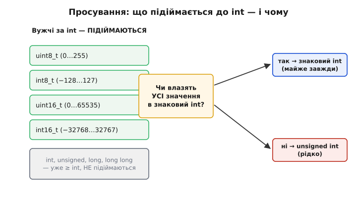
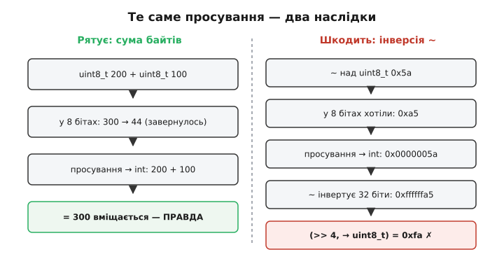

# Просування цілих типів у C/C++

Напишіть на C найпростіше: `uint8_t a = 200, b = 100; ... a + b`. Скільки бітів бере машина, щоб додати ці два байти? Здавалося б, вісім — обидва ж `uint8_t`. Насправді **жодного разу вісім**. Перш ніж додати, компілятор мовчки розширює обидва операнди до `int` — типово 32 біти, — і додавання відбувається у 32-бітному світі. Результат `300` спокійно вміщається (у 8 бітах він би «перевалив» у 44), тип виразу `a + b` — уже `int`, а не `uint8_t`. Ви написали дію над байтами, а машина зробила дію над 32-бітними числами.

Це не примха окремого компілятора — це **правило самої мови**, зване просуванням цілих (англ. *integer promotion*, від *promote* — підвищити в ранзі). C і C++ гарантують: **у будь-якому арифметичному чи логічному виразі жоден цілий тип, вужчий за `int`, не бере участі як є — його спершу підвищують до `int`.** Правило тихе: воно не дає ні попередження за замовчуванням, ні видимого коду. І саме через цю тишу воно стоїть за цілим класом «неможливих» багів — від'ємний результат там, де все беззнакове; невизначена поведінка при множенні двох додатних чисел; той самий байт, що поводиться по-різному. Розберімо від кореня: **чому** мова так робить, **як саме** відбувається підвищення, і **де** воно кусає.

### Чому мова взагалі підвищує типи

Корінь — в апаратурі. Арифметико-логічний пристрій (АЛП) реального процесора не має окремих суматорів «на 8 бітів» і «на 16 бітів». Він має регістри й тракт даних певної **природної ширини машини** — 32 біти на Cortex-M, 64 на настільному ядрі. Додати два числа він уміє тільки в цій ширині. Байт із пам'яті спершу **завантажують** у 32-бітний регістр, і вже там над ним працюють; окремої «8-бітної операції додавання» у наборі інструкцій здебільшого просто немає.

> 🔧 **Навіщо це.** Розуміння, що арифметики «на 8 бітів» апаратно не існує, одразу знімає подив від решти статті. Коли на 32-бітному ядрі ви бачите, що `uint8_t + uint8_t` дало `int`, — це не C «мудрує», це C чесно віддзеркалює те, що робить залізо: підняв байт у широкий регістр і порахував там. Уся дивна поведінка нижче — прямий наслідок цього одного факту.

Раз машина однаково рахує в широких регістрах, розробники C зафіксували це в мові — і не лишили на відкуп компілятору, а **прописали в стандарті**, щоб код поводився передбачувано скрізь. Так народилося правило: перед арифметикою вузький тип завжди підіймають до `int`. Це прибрало купу неоднозначностей («а в якій же ширині рахувати `char + char`?») ціною однієї нової тонкощі, яку тепер мусить знати кожен, хто пише на C.

Є ще й зручність для самої мови. `int` за задумом — «природне ціле» платформи, тип, у якому арифметика найдешевша. Звівши всі вузькі типи до `int` перед обчисленням, мова дістає єдину точку, де визначено правила переповнення, зсувів, порівнянь, — не треба окремо описувати поведінку для `char`, окремо для `short`. Один тип-спільний-знаменник, і все.

### Що саме підвищується — і до чого

Правило б'є по типах, чий **ранг** нижчий за `int`. Практично це та сама вузька частина сімейства цілих:

```
char, signed char, unsigned char   → підвищуються
short, unsigned short              → підвищуються
bool                               → підвищується (до 0/1)
бітові поля вужчі за int           → підвищуються
────────────────────────────────────────────────
int, unsigned int і ширші          → НЕ підвищуються (уже ≥ int)
```

`int`, `unsigned`, `long`, `long long` і все ширше під просування **не підпадають** — вони вже не вужчі за `int`. Для них працює інший, окремий механізм — [узгодження типів двох операндів](topic:programming/integer-types-c) (коли, скажімо, знаковий і беззнаковий тієї самої ширини зустрічаються у виразі). Просування — це попередній, нижчий крок: воно чіпає лише «дрібні» типи й підіймає їх до `int` **ще до** того, як зустрінуться два операнди.

Тепер ключова тонкість — **до якого саме** типу підіймають. Стандарт формулює це так: якщо `int` здатний представити **всі** значення вихідного типу, вузький тип стає `int`; якщо ні — стає `unsigned int`. І майже завжди спрацьовує перша гілка. Дивіться чому:

```
uint8_t  (0…255)        → всі 256 значень влазять в int → стає int (знаковий!)
int8_t   (−128…127)     → влазять → стає int
uint16_t (0…65535)      → влазять в 32-бітний int → стає int (знаковий!)
int16_t  (−32768…32767) → влазять → стає int
```

Ось де прихована пастка. **`uint8_t` і `uint16_t` — беззнакові — після підвищення стають знаковим `int`.** Бо всі їхні значення поміщаються в діапазон знакового `int`, тож перша гілка правила віддає саме `int`, а не `unsigned int`. Ваш беззнаковий байт на час обчислення **втрачає беззнаковість** і стає звичайним знаковим цілим. Друга гілка (`→ unsigned int`) вмикається лише для беззнакових типів **тієї ж ширини, що `int`**: наприклад, `unsigned` 16-бітний тип на платформі, де `int` теж 16-бітний, — там не всі його значення влазять у знаковий `int`, тож він стає `unsigned int`. На звичайному 32-бітному ядрі з `uint8_t`/`uint16_t` такого не буває — вони стають знаковими.


*Просування б'є лише по типах, вужчих за `int`. Кожен із них перевіряють одним питанням: чи влазять **усі** його значення в знаковий `int`? Для `uint8_t`, `int8_t`, `uint16_t`, `int16_t` на 32-бітній машині — влазять, тож усі стають **знаковим** `int` (навіть беззнакові — це джерело сюрпризів). `unsigned int` як мета трапляється лише коли беззнаковий тип **тієї ж ширини**, що `int`, і його верхня половина не влазить у знаковий діапазон. Типи `int` і ширші підвищення не проходять — над ними працює окреме узгодження двох операндів.*

> 🔧 **Навіщо це.** Запам'ятайте одну річ: **на звичайному 32-бітному ядрі будь-який `uint8_t` чи `uint16_t` усередині виразу — це знаковий `int`.** Не «маленьке беззнакове», а повноцінне знакове 32-бітне число. Щойно ви це прийняли, три пастки нижче стають очевидними, а не магічними. І навпаки: доки ви думаєте про `uint8_t + uint8_t` як про «дію над байтами», ці баги здаватимуться порушенням законів фізики.

### Пастка перша: `~` над беззнаковим байтом

Найчастіший спосіб наступити на просування — інверсія бітів `~` над вузьким беззнаковим типом. Класичний випадок: узяти байт регістра, інвертувати й зсунути. Ось він у справжньому C — і відповідь не та, на яку очікуєш.

**`uint8_t port = 0x5a; (~port) >> 4` — що в результаті?**

```c
#include <stdint.h>
#include <stdio.h>

int main(void) {
    uint8_t port = 0x5a;              // 0101 1010
    uint8_t result = (~port) >> 4;    // намір: інвертувати 8 бітів і зсунути

    printf("0x%02x\n", result);       // очікуємо 0x0a — а буде 0xfa
    return 0;
}
```

Розкладімо покроково, тримаючи в голові головне: `port` підіймається до **знакового** 32-бітного `int` ще до `~`.

```
port                = 0x5a          (uint8_t)
port → int          = 0x0000005a    (підвищення: беззнаковий байт → знаковий int)
~port               = 0xffffffa5    (інверсія ВСІХ 32 бітів, не восьми!)
(~port) >> 4        = 0x0ffffffa    (зсув знакового; тут старший біт 0, тож просто зсув)
→ uint8_t result    = 0xfa          (лишаються тільки молодші 8 бітів)
```

Намір був: інвертувати `0101 1010` у `1010 0101` = `0xa5`, зсунути на 4 → `0x0a`. Але `~` спрацював не над вісьмома бітами, а над **тридцятьма двома**: `port` спершу став `0x0000005a`, інверсія дала `0xffffffa5` — двадцять чотири зайві одиниці зверху. Ці одиниці нікуди не діваються: зсув тягне їх униз, і коли результат обрізають до `uint8_t`, лишається `0xfa` замість `0x0a`. Дія над байтом тихо перетворилася на дію над 32-бітним числом, і зайві біти зіпсували результат.

Ліки прості й точні: **зверніть результат `~` назад до `uint8_t` перед зсувом**, тоді зайві верхні біти відсічуться до зсуву:

```c
uint8_t result = (uint8_t)(~port) >> 4;   // (uint8_t)0xffffffa5 = 0xa5, далі >> 4 = 0x0a
```

Тут `(uint8_t)(~port)` дає `0xa5` — рівно ті вісім бітів, які ви й уявляли, — і аж потім зсув, тож виходить очікуване `0x0a`. Правило на все життя: **над вузькими типами будь-яка порозрядна операція (`~`, `>>`, іноді `<<`) рахується в ширині `int`; хочете результат у ширині типу — явно приведіть його назад.**

### Пастка друга: множення двох додатних дає невизначену поведінку

Ця найпідступніша, бо ламає інтуїцію «беззнакове переповнення безпечне». І справді: [беззнакова арифметика при переповненні визначена](topic:programming/overflow-wraparound) — рахує за модулем 2ᴺ, нічого не «ламається». Але просування вміє **вивести операнди з беззнакового світу** — і тоді захист зникає.

**`uint16_t a = 0xffff; a * a` — що це за значення?**

```c
#include <stdint.h>

uint16_t bad_square(uint16_t a) {
    return a * a;          // виглядає беззнаково — а насправді НЕ беззнаково
}
```

Розгорнімо тип виразу `a * a`. Обидва `a` — `uint16_t`, отже вужчі за `int`; за правилом кожен підіймається до **знакового** `int`. Множення тепер відбувається над двома `int`:

```
a                = 0xffff        = 65535        (uint16_t)
a → int          = 65535                        (підвищення до ЗНАКОВОГО int)
a * a  (як int)  = 65535 × 65535 = 4294836225
максимум int32   =               2147483647     (0x7fffffff)
4294836225 > 2147483647          → переповнення ЗНАКОВОГО int
```

Добуток `4294836225` не влазить у знаковий 32-бітний `int` (стеля — трохи більш ніж 2.1 млрд). А переповнення **знакового** `int` — це [невизначена поведінка](topic:programming/overflow-wraparound): стандарт не обіцяє нічого, компілятор має право видати будь-що й навіть викинути код навколо як «неможливий». І це попри те, що ви писали множення **беззнакових** чисел, обидва додатні! Просування підняло їх у знаковий `int`, і множення переповнило саме його — так додатне × додатне народжує невизначеність.

Виправлення — **утримати обчислення в беззнаковому світі щонайменше завширшки `int`**. Найчистіше: явно привести хоча б один операнд до `unsigned` (або одразу до `uint32_t`), тоді все обчислення піде беззнаковим і переповнення стане визначеним:

```c
uint32_t good_square(uint16_t a) {
    return (uint32_t)a * a;      // тепер множення беззнакове й вміщає результат
}
```

`(uint32_t)a * a` тягне другий операнд теж у `uint32_t` (за узгодженням типів), множення йде беззнаковим і в 32 бітах вміщає `4294836225` без переповнення. Якщо ж вам справді потрібен результат назад у 16 бітах із «завертанням» — приведення до `uint32_t` усе одно обов'язкове, щоб проміжок не був знаковим `int`; обрізання до `uint16_t` уже визначене. Головне: **не покладайтеся на «беззнаковість» вузького типу в множенні — просування може підняти його в знаковий `int` і зняти всі гарантії.**

### Пастка третя: `char` в арифметиці змінює тип

Третій випадок тонший, бо тут просування само по собі коректне — небезпека в тому, що воно **міняє тип виразу**, а з ним і поведінку сусідніх операцій. `char` — окремий тип, чия [знаковість не визначена стандартом](topic:programming/integer-types-c): знаковий на x86, беззнаковий на багатьох ARM. Просування слухняно застосовує до нього те саме правило — і на різних платформах отримує різні числа.

**`char c = 0x80; c` у виразі — додатне чи від'ємне?**

```c
#include <stdio.h>

int main(void) {
    char c = 0x80;          // біт-візерунок 1000 0000
    int widened = c + 0;    // + 0 змушує просування; тип виразу — int

    printf("%d\n", widened);   // на x86: -128 ; на ARM: 128 — РІЗНІ відповіді
    return 0;
}
```

Байт той самий — `1000 0000`. Але на x86, де `char` знаковий, старший біт читається як знак: просування робить [знакове розширення](topic:programming/sign-extension) й дає `int` = −128. На ARM, де `char` беззнаковий, той самий байт розширюється нулями й дає +128. Один код, один байт, дві відповіді — бо просування підхопило платформозалежну знаковість `char` і рознесло її по всьому подальшому обчисленню. Це особливо кусає, коли `char` уживають як **мале число** (байт із буфера, значення давача): порівняння, зсуви, індексація раптом залежать від платформи.

Тому правило те саме, що й для типів узагалі: **`char` — тільки для тексту**; тримаєте в 8 бітах число — беріть однозначний `uint8_t`/`int8_t`. Тоді просування дасть передбачуваний результат скрізь: `uint8_t` розшириться нулями завжди, `int8_t` — за знаком завжди, без «залежить від компілятора».

### Коли просування корисне, а коли шкодить

Було б несправедливо змальовувати просування лише лихом. Здебільшого воно **рятує**, а не шкодить. Приклад: `uint8_t x = 200, y = 100; int s = x + y;`. Без просування додавання йшло б у 8 бітах і дало б `44` (300 за модулем 256) — тихе [переповнення](topic:programming/overflow-wraparound). Але просування підняло обидва в `int`, сума `300` вмістилася вільно, і ви отримали правильне число. Те саме з проміжними обчисленнями: `(a + b) / 2` для великих байтів не переповнить проміжок, бо він рахується в `int`, а не у 8 бітах. Просування дає вам «запас ширини» дарма — і в цьому його добро.


*Те саме правило — два обличчя. **Ліворуч (рятує):** `uint8_t 200 + uint8_t 100`. У 8 бітах сума завернулася б у 44; просування рахує в `int`, результат 300 вміщається, і ви отримуєте правду безкоштовно. **Праворуч (шкодить):** `~` над `uint8_t`. Ви думали про 8 бітів, а `~` інвертував 32; зайві верхні одиниці псують зсув. Різниця в одному: додавання **звужує** результат назад природно, а порозрядні операції очікують точну ширину — і зайві біти зверху міняють відповідь.*

Межа проста. Просування **допомагає** там, де важлива лише **числова** величина результату — суми, різниці, середні: ширший проміжок захищає від переповнення, а звуження назад безболісне. Просування **шкодить** там, де важлива точна **бітова** ширина — інверсія, зсуви, маски, а також будь-яка знакова арифметика над беззнаковим вузьким типом, де підняття в знаковий `int` знімає беззнакові гарантії. Практична дисципліна з цього одна: **у порозрядних і множинних виразах над вузькими типами свідомо керуйте шириною** — приводьте результат назад до `uintN_t` після `~`/зсуву, тягніть множення в явний `uint32_t`, а `char` не пускайте в арифметику зовсім. У чисто числових виразах просування можна спокійно лишити працювати на себе.

> 🔧 **Навіщо це.** У прошивці ви щодня маніпулюєте бітами регістрів у `uint8_t`/`uint16_t` — і саме там просування розставляє міни. Три звички знімають майже все. Перша: після `~` чи зсуву над вузьким беззнаковим типом **приводьте результат назад** — `(uint8_t)(~x)`, `(uint16_t)(v >> n)`. Друга: множення вузьких беззнакових, що може «вистрелити» за 2 млрд, **робіть через явний `uint32_t`** — `(uint32_t)a * b`. Третя: `char` тримайте для тексту, числа — у `uint8_t`/`int8_t`. І ввімкніть `-Wall -Wextra` (зокрема `-Wconversion`, `-Wsign-conversion`): компілятор покаже частину звужень, хоч і не всі. Ці приведення — не косметика: вони єдине, що стоїть між вашим наміром «8 бітів» і мовчазним 32-бітним світом, у якому C насправді рахує.

---

Отже, **C і C++ ніколи не рахують у типах, вужчих за `int`**: перед будь-якою арифметичною чи порозрядною дією вузький тип (`char`, `short`, `bool`, `int8_t`, `uint8_t`, `int16_t`, `uint16_t`) **мовчки підіймається до `int`** — просування цілих (*integer promotion*). Корінь — апаратний: АЛП рахує в природній ширині машини (32/64 біти), окремих «8-бітних» операцій немає, і мова це віддзеркалила, зафіксувавши в стандарті. Правило вибору мети коротке: якщо всі значення вузького типу влазять у знаковий `int` — стає `int` (майже завжди), інакше — `unsigned int`; тому на 32-бітному ядрі **беззнакові `uint8_t`/`uint16_t` усередині виразу стають ЗНАКОВИМ `int`** — і саме це джерело сюрпризів. Три класичні пастки: `~` над `uint8_t` інвертує 32 біти, а не 8 (`(~0x5a) >> 4` дає `0xfa`, не `0x0a` — ліки: `(uint8_t)(~port) >> 4`); множення двох `uint16_t` виводить їх у знаковий `int` і при великих значеннях дає **невизначену поведінку** попри беззнаковість і додатність (`0xffff * 0xffff` переповнює знаковий int — ліки: `(uint32_t)a * a`); `char` у виразі підхоплює платформозалежну знаковість і дає різні числа на x86 та ARM (ліки: числа тримати в `uint8_t`/`int8_t`). Водночас у чисто **числових** виразах просування рятує — сума `uint8_t 200 + 100` дає правильні `300`, а не завернуті `44`. Дисципліна одна: у **порозрядних і множинних** виразах над вузькими типами свідомо керуйте шириною (приведення назад до `uintN_t`, множення через `uint32_t`), а в числових — лишіть просування працювати на себе.
