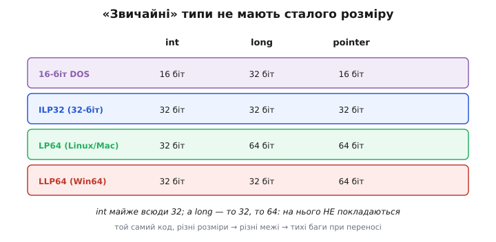
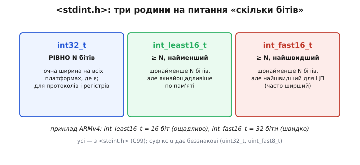
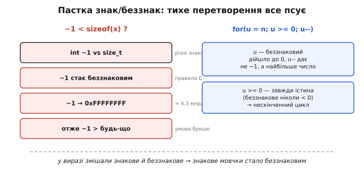

# Цілі типи в C/C++ (int, unsigned, stdint)

Коли ви пишете `int x;`, ви даєте машині дві накази одразу, хоч на вигляд це один. Перший: **скільки** місця відвести під число — скільки бітів, а отже, які числа туди влізуть. Другий: **як** тлумачити ці біти — чи може число бути від'ємним, чи лише додатним. Цілий тип у C/C++ — це рівно ця пара виборів: **ширина** й **знаковість**. Усе інше — назви (`int`, `long`, `uint8_t`), правила перетворень, підступні баги — виростає з цих двох рішень. І варто зрозуміти їх від кореня, бо в C немає «розумної» обгортки, що прикриє помилку: обрали тип — дістали рівно його межі, його поведінку й, коли схибили, його тихий збій.

Розберімо спершу, з чого взагалі складається вибір, — а тоді чому «звичайні» типи ненадійні, як їх заміняє фіксована ширина, і де ховаються класичні пастки, на яких спотикається кожен.

### Дві осі вибору: ширина й знаковість

Уся сім'я цілих типів лягає на дві незалежні осі. По одній — **ширина**: скільки бітів під число. По другій — **знаковість**: чи тлумачимо старший біт як знак.


*Цілий тип задають два вибори. **Ширина** (стовпці: 8/16/32/64 біти) визначає, **скільки значень** влазить: N бітів [дають рівно 2ᴺ комбінацій](book:math/why-binary), тож 8-бітний тип тримає 256 чисел, 32-бітний — понад чотири мільярди. **Знаковість** (рядки) визначає, **як розкласти** ці комбінації: беззнаковий (unsigned) віддає всі під додатні (0…2ᴺ−1), знаковий (signed) — половину під від'ємні. Той самий біт-візерунок `11111111` — це 255 як `uint8_t` і −1 як `int8_t`; різниця лише в тлумаченні старшого біта.*

Ключова думка: ширина й знаковість **не пов'язані** між собою. Можна мати 8-бітне число знакове (`int8_t`, −128…127) і беззнакове (`uint8_t`, 0…255); так само на 32 бітах. Ширина каже, **скільки** різних значень поміститься; знаковість каже, **де** серед них проходить нуль. Беззнаковий тип зсуває весь діапазон у додатний бік: замість −128…127 маємо 0…255 — стільки ж значень (256), але без від'ємних, зате вдвічі вища додатна стеля.

Чому взагалі буває беззнаковий тип? Бо часто величина **фізично не може** бути від'ємною: розмір масиву, індекс, лічильник подій, довжина буфера, значення регістра давача. Віддавати половину діапазону під від'ємні, яких не буде, — марнотратство: беззнаковий тип тієї ж ширини дає вдвічі більшу стелю задарма. А головне — беззнакова арифметика в C/C++ має **визначену** поведінку при переповненні (арифметика за модулем 2ᴺ), тоді як знакове переповнення — [невизначена поведінка](book:programming/overflow-wraparound), на яку не можна покладатися. Тому лічильники, кільцеві індекси, різницю часу традиційно тримають у беззнакових.

Як саме від'ємні числа кодуються тим самим старшим бітом — окрема глибока тема: практично всі сучасні машини (і, з C23 та C++20, сам стандарт) використовують [доповняльний код](book:math/twos-complement-algebra), де `11111111` — це −1, а не «мінус нуль». Тут досить знати наслідок: **вибір знаковості не міняє біти, лише їх читання**.

> 🔧 **Навіщо це.** Перш ніж оголосити змінну, поставте собі два питання по черзі. Перше — «яке **найбільше** значення сюди колись потрапить?»: це задає ширину (влізе в 255 — беріть 8 біт; у мільйони — 32). Друге — «чи буває тут **від'ємне**?»: ні — беріть беззнаковий тип (вдвічі вища стеля, визначений wrap), так — знаковий. Помилка в першому питанні дає [переповнення](book:programming/overflow-wraparound); помилка в другому — цілий клас пасток змішування, які розберемо нижче. Обидва вибори роблять на етапі оголошення, і виправити їх потім коштує дорого.

### Пастка «звичайних» типів: розмір не сталий

Тепер найнеприємніша правда про класичні типи C — `char`, `short`, `int`, `long`, `long long`. Скільки в них бітів? **Стандарт не каже точно.** Він фіксує лише **мінімуми** й порядок «не вужчий за»:

```
char       ≥ 8 біт
short      ≥ 16 біт
int        ≥ 16 біт
long       ≥ 32 біти
long long  ≥ 64 біти
```

Тобто `int` — це «щонайменше 16 бітів», а не «32 біти». Конкретна ширина залежить від **моделі даних** платформи, і вона реально різна:


*Той самий тип — різна ширина на різних платформах. У 16-бітному DOS `int` був 16 бітів. У сучасних 32-бітних системах (ILP32) і `int`, і `long` — 32. На 64-бітних Unix (Linux, macOS — модель **LP64**) `int` лишився 32, а `long` став **64**. А на 64-бітному Windows (**LLP64**) `long` залишили **32** — заради сумісності зі старим кодом, — і 64 біти дає лише `long long`. Висновок: `int` майже всюди 32, а `long` — «то 32, то 64», тож той самий код на різних платформах отримує **різні межі**.*

Чому такий безлад? Історія. `int` мав бути «природним розміром машини» — на 16-бітних процесорах 16 бітів, тоді на 32-бітних 32. Але коли прийшла 64-бітність, розширювати `int` до 64 не стали: 32 бітів вистачає майже завжди, а ширший `int` подвоїв би пам'ять під кожне число й **зламав би** гори коду, що мовчки припускав `sizeof(int) == 4`. Тому `int` «застиг» на 32. А `long` розсварив платформи: Unix зробив його 64-бітним (щоб хоч один тип відповідав ширині машини й покажчика), а Windows лишив 32-бітним — теж заради сумісності з десятиліттями коду, що припускав `long == 32 біти`. Так і живемо: `long` переносний рівно доти, доки ви не перенесли код між Windows і Linux.

Наслідок для практики жорсткий: **не можна закладати конкретну ширину в «звичайний» тип**. Код `long timestamp = ...` на Linux дасть 64-бітне поле, а на Windows — 32-бітне, і те саме число, що вміщалося, раптом переповниться. Побачити це важко: компілюється всюди, а ламається лише на «іншій» платформі. Саме тому для будь-якого числа, чия ширина **важлива** (протокол, регістр, поле у флеші, лічильник із відомою межею), «звичайні» типи не годяться.

### Розв'язок: фіксована ширина зі stdint.h

Аби покласти край цій непевності, C99 приніс заголовок `<stdint.h>` (у C++ — `<cstdint>`) з типами **точної ширини**. Їхня назва прямо каже, скільки бітів:

```c
#include <stdint.h>

uint8_t   flags;      // рівно 8 бітів, беззнаковий:  0…255
int16_t   temp_c10;   // рівно 16 бітів, знаковий:   −32768…32767
uint32_t  ticks;      // рівно 32 біти, беззнаковий:  0…~4.3 млрд
int64_t   nanos;      // рівно 64 біти, знаковий
```

Схема імен проста й варта запам'ятовування: `[u]int<N>_t`. Префікс `u` — беззнаковий (`u` від *unsigned*), його брак — знаковий; число `<N>` — точна кількість бітів; суфікс `_t` (від *type*) — домовленість C про імена типів. Тож `uint8_t` читається як «unsigned integer, 8 bits, type», а `int32_t` — «signed integer, 32 bits». На **будь-якій** платформі, де цей тип існує, він має **рівно** ту ширину. Це і є те, чого бракувало «звичайним» типам: тверда, переносна обіцянка.

Але точна ширина — не завжди те, чого хочеться. Іноді вам байдуже до точного числа бітів, важливо лише «щонайменше стільки». Для цього `<stdint.h>` дає ще **дві** родини:


*`<stdint.h>` дає три відповіді на питання «скільки бітів». **Точна** (`int32_t`) — рівно N бітів на всіх платформах; для протоколів, файлів, регістрів, де розмір **мусить** збігатися. **Найменша** (`int_least16_t`) — щонайменше N бітів, але **якнайощадливіша** по пам'яті; коли важить лише «влізе N бітів», а зайвого місця шкода. **Найшвидша** (`int_fast16_t`) — щонайменше N бітів, але **найшвидша** для цього процесора, навіть якщо ширша. Приклад: на старому ARM (ARMv4) без 16-бітних інструкцій пам'яті `int_least16_t` — це 16 бітів (ощадливо), а `int_fast16_t` — 32 (бо 32-бітні операції там швидші).*

Різниця тонка, але важлива саме на мікроконтролерах. Точна ширина (`int32_t`) може взагалі не існувати на екзотичному процесорі, де байт не 8 бітів, — а `int_least8_t` існує **завжди**, бо це «найменший тип, не вужчий за 8 бітів», який знайдеться хоч якийсь. Найшвидший тип (`int_fast8_t`) рятує, коли ви крутите змінну в гарячому циклі: на 32-бітному ядрі 8-бітна змінна часто **повільніша** за 32-бітну (процесор мусить її «звужувати» після кожної операції), тож `int_fast8_t` дасть вам 32-бітне поле, що працює швидше, але вмістить будь-яке 8-бітне значення. На практиці більшість вбудованого коду живе на точній ширині (`uint8_t`, `uint32_t`) — вона наочна й передбачувана; least/fast беруть свідомо, коли є конкретна причина.

> 🔧 **Навіщо це.** У прошивці правило майже безвиняткове: **забудьте про `int`/`long`, беріть `<stdint.h>`**. Регістр периферії 32-бітний — оголошуйте `uint32_t`, і код читатиметься однаково на ESP32, STM32, AVR. Поле в структурі, що йде у флеш чи по мережі, — тільки точна ширина, інакше на іншому компіляторі структура «поповзе». `size_t` беріть для розмірів і лічильників пам'яті (див. нижче). Виняток лишається один: коли ширина справді байдужа й потрібне «просто ціле для індексу в короткому циклі» — тоді звичайний `int` доречний і навіть швидкий. Але тільки-но розмір **щось означає** — фіксована ширина без винятків.

### Знаковість, що кусає: тихе перетворення

Найпідступніші баги цілих типів народжуються не з ширини, а зі **знаковості** — точніше, з того, що стається, коли в одному виразі зустрічаються знаковий і беззнаковий типи. А зустрічаються вони постійно, бо `sizeof`, довжини, розміри контейнерів у C/C++ — **беззнакові** (тип `size_t`).

Правило C тут коротке й безжальне: якщо в бінарній операції один операнд беззнаковий, а другий знаковий тієї ж (або меншої) ширини, **знаковий мовчки перетворюється на беззнаковий**. Не беззнаковий на знаковий — навпаки. І от чому це небезпечно:


*Коли у виразі змішано знакове й беззнакове, знакове **мовчки стає беззнаковим** — і ламає логіку двома класичними способами. **Ліворуч:** порівняння `−1 < sizeof(x)`. Здавалося б, істина. Але `−1` (знакове) перетворюється на беззнакове й стає `0xFFFFFFFF` ≈ 4.3 млрд — найбільшим можливим числом, тож `−1` виявляється **більшим** за будь-який розмір, і умова хибна. **Праворуч:** зворотний цикл `for (u = n; u >= 0; u--)` з беззнаковим `u`. Коли `u` дійде до 0, наступний `u--` дасть **не** −1, а найбільше беззнакове число; а умова `u >= 0` для беззнакового **завжди** істинна — і цикл ніколи не завершиться.*

Обидві пастки поєднує те, що компілятор **не попереджає** голосно (хіба ввімкнеш `-Wsign-compare` чи `-Wall`) — код збирається, а поводиться безглуздо. Гляньмо на них у справжньому C, щоб побачити механізм на очах.

**Порівняння знакового `−1` із беззнаковим `sizeof` — що надрукується?**

```c
#include <stdint.h>
#include <stdio.h>

int main(void) {
    int idx = -1;                 // знакове: помилковий/«ще не знайдено» індекс
    char buf[10];

    // намір: «якщо idx у межах масиву» — але sizeof беззнаковий!
    if (idx < sizeof(buf)) {      // idx стає беззнаковим → 0xFFFFFFFF
        printf("idx у межах\n");  // НЕ надрукується: 4294967295 < 10 хибне
    } else {
        printf("idx поза межами\n");  // саме ця гілка — хоч намір був інший
    }
    return 0;
}
```

Намір програміста: −1 явно менше за розмір буфера, отже «в межах». Реальність: `sizeof(buf)` має тип `size_t` (беззнаковий), тож `idx` перетворюється на беззнаковий і стає ≈ 4.3 мільярда — більше за 10. Умова хибна, виконується не та гілка. Найгірше — коли така перевірка стереже доступ до масиву: намір «відсікти від'ємний індекс» тихо перетворюється на «пропустити його як велетенський», і ви дістаєте вихід за межі. Правильно — порівнювати однорідне: або тримати індекс знаковим і порівнювати з `(int)sizeof(buf)`, або від початку тримати межу в тому самому знаковому світі.

**Зворотний цикл на беззнаковому лічильнику — коли він завершиться?**

```c
#include <stdint.h>
#include <stdio.h>

int main(void) {
    // намір: пройти індекси 4,3,2,1,0 і спинитись
    for (uint8_t i = 4; i >= 0; i--) {   // i беззнаковий → i >= 0 ЗАВЖДИ істина
        printf("%u ", i);                // 4 3 2 1 0 255 254 253 ... без кінця
    }
    return 0;
}
```

Задум — відлічити від 4 до 0. Але `i` беззнаковий, тож умова `i >= 0` **тавтологічна**: беззнакове число ніколи не буває меншим за нуль. Дійшовши до 0, `i--` не дає −1 (беззнаковий тип цього не вміє) — він «перевалює» у 255, і цикл котиться далі назавжди. Це той самий [wrap-around](book:programming/overflow-wraparound), лише тут він перетворює звичайний цикл на нескінченний. Ліки прості: або лічильник **знаковий** (`int i`, і тоді `i >= 0` має сенс), або умову переписати без «≥ 0» — наприклад, рахувати вгору, а індекс брати як `n-1-i`.

> 🔧 **Навіщо це.** Змішування знак/беззнак — головне джерело «неможливих» багів у C/C++, і воно тим підступніше, що компілятор мовчить. Три захисні звички. Перша: **не порівнюйте знакове з беззнаковим** — приводьте обидві сторони до одного світу свідомо, а не покладайтеся на тихе правило C. Друга: **зворотні цикли не пишіть на беззнаковому лічильнику з умовою `>= 0`** — вона завжди істинна; або беріть знаковий лічильник, або рахуйте вгору. Третя: ввімкніть `-Wall -Wextra` (зокрема `-Wsign-compare`) — компілятор укаже більшість таких місць ще до запуску. Пам'ятайте головне: у змішаному виразі перемагає **беззнаковий**, і ваше −1 тихо стає мільярдами.

### Окремий випадок: char — не зовсім число

Один тип стоїть осторонь і вартий окремого слова, бо ламає інтуїцію — `char`. Здавалося б, це «знаковий 8-бітний тип». Насправді в C існує **три** різні типи: `signed char`, `unsigned char` і просто `char` — і третій **не** тотожний жодному з перших двох. Це окремий тип, чия знаковість **не визначена стандартом**: кожна платформа обирає сама.

І обирають по-різному: на x86 та у Windows/Linux `char` зазвичай **знаковий** (−128…127), а на ARM і PowerPC — **беззнаковий** (0…255). Тобто типовий мікроконтролер на ARM Cortex-M бачить `char` беззнаковим, а ваш ПК — знаковим. Наслідок кусає там, де `char` вживають як **мале число**, а не як літеру:

**Той самий `char = 200` на ARM і на x86 — що дасть порівняння?**

```c
#include <stdio.h>

int main(void) {
    char c = 200;          // на x86: знаковий → −56;  на ARM: беззнаковий → 200
    if (c > 100) {
        printf("більше 100\n");   // ТІЛЬКИ на ARM (200 > 100)
    } else {
        printf("менше 100\n");    // на x86: −56 < 100 — інша відповідь!
    }
    return 0;
}
```

Той самий код, той самий байт `200` — і **різна** відповідь на різних машинах, бо знаковість `char` різна. Тому правило тверде: **`char` — лише для тексту** (літери, рядки). Тільки-но ви тримаєте в 8 бітах **число** (байт даних, значення давача, елемент двійкового буфера), беріть однозначний `uint8_t` або `int8_t` з `<stdint.h>` — вони мають визначену знаковість скрізь. `char` лишіть символам, де його знаковість не важить, бо ви й так не робите над літерами арифметики.

### Практичний підсумок вибору

Зведімо все у просте дерево рішень, яким можна користуватися щодня. Обираючи цілий тип, ідіть по питаннях згори вниз:

```
1. Це текст/літери?        → char  (рядки, символи)
2. Розмір/індекс пам'яті?  → size_t  (беззнаковий, під ширину машини)
3. Ширина щось означає?    → точний  uintN_t / intN_t  (протокол, регістр, флеш)
   (буває від'ємне? ні → u; так → без u)
4. Ширина байдужа, треба швидко? → int_fastN_t  (гарячий цикл)
5. Просто ціле, межі відомі й дрібні? → int  (короткий локальний лічильник)
```

Головна лінія проста: у вбудованому коді за замовчуванням — **фіксована ширина зі `<stdint.h>`**, і свідомо питайте про знаковість. `size_t` — для всього, що стосується **розмірів і адресації пам'яті** (він беззнаковий і завширшки з покажчик, тож вміщає найбільший можливий об'єкт). А `int` лишіть тим випадкам, де ширина справді неважлива й число завідомо мале, — там він доречний і швидкий. Ця дисципліна коштує кількох зайвих символів у назві типу, зате знімає цілий клас переносних багів іще до першого запуску.

> 🔧 **Навіщо це.** Гарний вибір цілого типу — це безкоштовна страховка, яку ви купуєте один раз при оголошенні змінної. Точна ширина рятує від «на іншій платформі поповзло»; правильна знаковість — від тихих перетворень і нескінченних циклів; `size_t` для розмірів — від змішування з від'ємними. У прошивці, де немає ні винятків, ні складних типів, ні захисної сітки, саме тип змінної — ваша перша й головна лінія оборони від чисел, що не влізли або перевернули знак. Витратьте на це рішення десять секунд свідомості — і зекономите години пошуку багу, який виліз лише на замовниковій платі.

---

Отже, **цілий тип у C/C++ — це два незалежні вибори**: **ширина** (скільки бітів → [скільки значень 2ᴺ](book:math/why-binary) влазить) і **знаковість** (чи буває від'ємне; той самий біт-візерунок читається як 255 або як −1 через [доповняльний код](book:math/twos-complement-algebra)). «Звичайні» типи (`int`, `long`) мають лише **мінімальні** гарантії ширини (`int` ≥ 16, `long` ≥ 32), а справжній розмір гуляє між моделями даних (Windows LLP64 тримає `long` 32-бітним, Unix LP64 — 64-бітним), тож на них **не можна покладатися**, коли ширина важлива. Розв'язок — `<stdint.h>`: **точні** типи (`uint8_t`, `int32_t`) дають рівно N бітів скрізь; **найменші** (`int_least16_t`) ощадять пам'ять; **найшвидші** (`int_fast16_t`) виграють швидкість. Головна пастка — **знаковість**: у змішаному виразі знакове **мовчки стає беззнаковим**, тому `−1 < sizeof(x)` хибне, а `for(u; u >= 0; u--)` на беззнаковому — нескінченний. Окремо стоїть `char`: його знаковість **не визначена** (знаковий на x86, беззнаковий на ARM), тож для чисел беріть `uint8_t`/`int8_t`, а `char` лишіть тексту. Правило прошивки: **фіксована ширина зі `<stdint.h>` за замовчуванням**, `size_t` для розмірів, і свідоме питання про знак — це страховка, куплена один раз при оголошенні.
