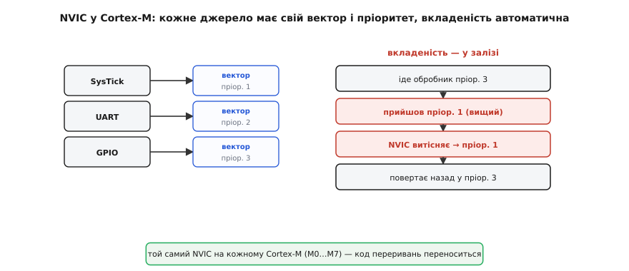
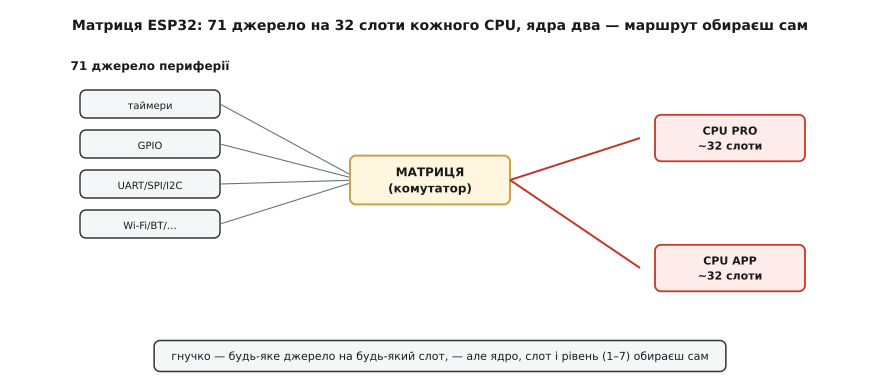

# 🔌 Контролери переривань у залізі: NVIC у Cortex-M проти матриці ESP32

> [Контролер переривань](book:programming/interrupt-vector) — це теж «деталь», тільки на кристалі: апаратний блок, що збирає запити від периферії й вирішує, кого пустити до процесора. Світ поділив цю задачу на дві школи; познайоммося з обома.

## Що це за блок

Контролер переривань — апаратний регулювальник, що збирає запити від десятків джерел (таймери, GPIO, порти, радіо) і вирішує, **кого** й **коли** пустити до процесора. Опис — дрібниця, а конструктивно дві великі школи розв'язали її **по-різному**: ARM зі своїм **NVIC** і Espressif зі своєю **матрицею переривань**. Порівняти їх повчально: те саме завдання має не один «правильний» вигляд, і за кожним вибором стоїть інженерний компроміс.

Щоб порівняння було чесним, варто тримати в голові три питання, на які мусить відповісти **будь-який** контролер. Перше: як від номера джерела дійти до коду його обробника — швидко й однозначно? Друге: що робити, коли посеред одного обробника прийшов терміновіший запит — відкласти чи перебити? Третє: скільки джерел узагалі можна підключити й чи всі вони рівноправні? NVIC і матриця відповідають на ці питання різними засобами — і саме в різниці відповідей видно характер кожної архітектури.

## NVIC: вбудований стандарт ARM Cortex-M

У всіх процесорах ARM **Cortex-M** контролер той самий — **NVIC** (англ. *Nested Vectored Interrupt Controller*, «вкладений вектороований контролер переривань»), і це його головна риса. Три слова в назві — три його сили:

- **Vectored (вектороований):** кожне джерело має **свій** вектор — номер, за яким у таблиці лежить пряма адреса його обробника. Прийшло переривання — стрибок одразу куди слід, без розбирання «а хто це був».
- **Nested (вкладений):** пріоритети **апаратні**, і вкладеність **автоматична**: якщо посеред обробника прийде запит **вищого** пріоритету, NVIC сам **витіснить** поточний і пустить терміновіший, а потім поверне керування назад.
- І все це **однакове** на кожному Cortex-M (M0, M3, M4, M7…) — тож код переривань легко **переноситься** між чипами.

*NVIC вбудований у ядро Cortex-M: кожне джерело має свій вектор і пріоритет, а вкладеність (витіснення нижчого вищим) відбувається автоматично, у залізі. Той самий контролер — на кожному Cortex-M, тож код переноситься.*

Варто уточнити, як саме NVIC рахує пріоритети, бо тут легко спіткнутися: **менше число — вищий пріоритет**. Запит з пріоритетом 0 терміновіший за запит з пріоритетом 2, і саме він витіснить чужий обробник. Скільки взагалі рівнів — залежить від виробника чипа: ARM задає **мінімум** 2 біти пріоритету для ядер M0/M0+ (отже, 4 рівні) і 3 біти для M3/M4/M7 (8 рівнів), а конкретний виробник може реалізувати й більше. Самих джерел NVIC підтримує до кількох сотень — з запасом на найбагатшу периферію.

Окрема перевага, про яку легко забути, — **автоматичне збереження частини контексту**. Заходячи в переривання, Cortex-M сам кладе на стек найважливіші регістри за угодою про виклики, а виходячи — знімає їх. Через це обробник на Cortex-M можна писати звичайною C-функцією, без жодного асемблерного «прологу» від вас, і навіть вкладеність обробників не потребує ручного коду. Виходить охайна, передбачувана, мало-затримкова машина, вбудована прямо в ядро.

## Матриця переривань ESP32

ESP32 (ядра Xtensa, а в новіших моделях — RISC-V) пішов іншим шляхом — **матрицею переривань**. Джерел у нього **дуже багато**: на весь чип припадає **71** периферійне джерело переривань. А «слотів» переривань у самого ЦП небагато — **32 на ядро**. Матриця — це гнучкий **комутатор**: вона вміє розвести майже будь-яке джерело (67 із 71) на **будь-який** вільний слот. Ба більше, ядер **два** (PRO і APP), і кожне має свою логіку, тож ви можете спрямувати переривання зв'язку на одне ядро, а свої — на інше.

*Матриця ESP32 розводить десятки джерел периферії на небагато слотів CPU (32 на ядро), причому ядер два (PRO і APP). Гнучко — майже будь-яке джерело на будь-який слот, — але вручну: ядро, слот і рівень обираєш сам.*

Платою за гнучкість є більше **ручної** роботи й менш елегантні пріоритети. Рівнів небагато — **1–7**, причому вони не рівноцінні: частина зарезервована під системні потреби, рівень 7 — немаскований (NMI), а найвищі рівні вимагають обробників на **асемблері**, бо звичайний C-пролог туди не вписується. Збереження контексту теж лягає переважно на системний код, а не на саме ядро, як у NVIC. Це потужно й гнучко, але не так «само собою».

Звідки взагалі така конструкція? Вона прямо випливає з того, що ESP32 — чип зі зв'язком: Wi-Fi і Bluetooth, плюс багата периферія, дають набагато більше джерел переривань, ніж є апаратних входів у ядра Xtensa. Замість того щоб роздути ядро до 71 окремого входу, інженери поставили перед ним комутатор — і дали програмісту свободу самому вирішувати, що куди веде. Гнучкість тут не розкіш, а спосіб умістити багату периферію в скромне за входами ядро.

## Що це означає для вас

На щастя, у щоденному коді цю різницю майже не видно: `attachInterrupt` в Arduino (і системні функції в ESP-IDF) ховають і вектор NVIC, і маршрут крізь матрицю. Знати про дві школи варто радше для **розуміння**: чому на Cortex-M вкладеність і пріоритети «просто працюють», а на ESP32 ви іноді обираєте ядро й рівень руками; і чому код переривань з одного сімейства не переноситься на інше без правок. Те саме завдання — два різні залізні характери.

Видно різницю й у тому, що ви **пишете руками**, коли спускаєтеся нижче за `attachInterrupt`. На Cortex-M через CMSIS це пара викликів: задати джерелу пріоритет і дозволити його — а далі ядро саме потурбується і про вектор, і про вкладеність, і про збереження регістрів. На ESP32 в ESP-IDF ви натомість **просите систему виділити** переривання: вказуєте джерело й бажаний рівень, а функція виділення сама знаходить вільний слот, прокладає маршрут через матрицю та чіпляє ваш обробник; рівень і прив'язку до ядра ви тримаєте в голові свідомо. Те саме наміри — «це переривання термінове, обробляй його так» — але виражені різними засобами: декларативним пріоритетом у NVIC і явним виділенням ресурсу в матриці.

Практичний наслідок один. Беручись за новий чип, не переносьте наосліп звички з попереднього: на Cortex-M можна сміливо покладатися на апаратну вкладеність і єдину для всіх ядер схему, а на ESP32 — варто свідомо подумати, **на якому ядрі** й **з яким рівнем** має жити кожне переривання, особливо коли поряд працює зв'язок. Розуміння залізної основи й перетворює `attachInterrupt` із чорної скриньки на свідоме рішення.

## Підсумок

NVIC — **стандарт**: вектороований, апаратно-пріоритетний, із автоматичною вкладеністю й автозбереженням контексту, однаковий на всіх Cortex-M. Матриця ESP32 — **гнучкий комутатор**: 71 джерело на 32 слоти ядра, два ядра, але більше ручного й простіші пріоритети (1–7, рівень 7 — NMI). Обидва роблять одне — сортують лавину запитів, — та кожен по-своєму, і в цьому «по-своєму» видно інженерний смак двох різних архітектур.
