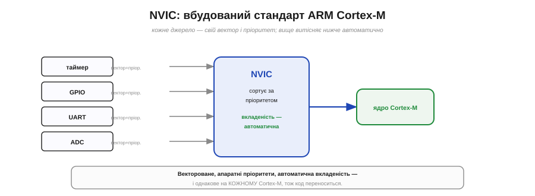
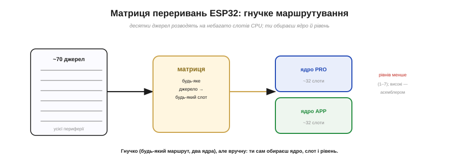

# 🔌 Контролери переривань у залізі: NVIC у Cortex-M проти матриці ESP32

> [Контролер переривань](book:programming/interrupt-vector) — це теж «деталь», тільки на кристалі: апаратний блок, що збирає запити від периферії й вирішує, кого пустити до процесора. Світ поділив цю задачу на дві школи; познайоммося з обома.

## Що це за блок

Контролер переривань — апаратний регулювальник, що збирає запити від десятків джерел (таймери, GPIO, порти, радіо) і вирішує, **кого** й **коли** пустити до процесора. Дрібниця в описі — а конструктивно дві великі школи розв'язали її **по-різному**: ARM зі своїм **NVIC** і Espressif зі своєю **матрицею переривань**. Порівняти їх повчально: бачиш, що те саме завдання має не один «правильний» вигляд.

## NVIC: вбудований стандарт ARM Cortex-M

У всіх процесорах ARM **Cortex-M** контролер той самий — **NVIC** (*Nested Vectored Interrupt Controller*, «вкладений вектореований контролер переривань»), і це його головна риса. Три слова в назві — три його сили:

- **Vectored (вектореований):** кожне джерело має **свій** вектор — пряму адресу свого обробника. Прийшло переривання — стрибок одразу куди слід, без розбирання «а хто це був».
- **Nested (вкладений):** пріоритети **апаратні**, і вкладеність **автоматична**: якщо посеред обробника прийде запит **вищого** пріоритету, NVIC сам **витіснить** поточний і пустить терміновіший, а потім поверне керування назад.
- І все це **однакове** на кожному Cortex-M (M0, M3, M4, M7…) — тож код переривань легко **переноситься** між чипами.

*Рис. NVIC вбудований у ядро Cortex-M: кожне джерело має свій вектор і пріоритет, а вкладеність (витіснення нижчого вищим) відбувається автоматично, у залізі. Той самий контролер — на кожному Cortex-M, тож код переноситься.*

Виходить охайна, передбачувана, мало-затримкова машина, вбудована прямо в ядро.

## Матриця переривань ESP32

ESP32 (ядра Xtensa, а в новіших моделях — RISC-V) пішов іншим шляхом — **матрицею переривань**. Джерел у нього **дуже багато** (десятки одиниць периферії), а «слотів» переривань у самого ЦП небагато (близько 32 на ядро). Матриця — це гнучкий **комутатор**: вона вміє розвести **будь-яке** джерело на **будь-який** вільний слот. Ба більше, ядер **два** (PRO і APP), і кожне має свою логіку, тож ви можете спрямувати переривання зв'язку на одне ядро, а свої — на інше.

*Рис. Матриця ESP32 розводить десятки джерел периферії на небагато слотів CPU (близько 32 на ядро), причому ядер два (PRO і APP). Гнучко — будь-яке джерело на будь-який слот, — але вручну: ядро, слот і рівень обираєш сам.*

Платою за гнучкість є більше **ручної** роботи й менш елегантні пріоритети: рівнів небагато (1–7), частина з них особлива, а найвищі вимагають обробників на **асемблері**. Це потужно, але не так «само собою», як у NVIC.

## Що це означає для вас

На щастя, у щоденному коді цю різницю майже не видно: `attachInterrupt` в Arduino (і системні функції в ESP-IDF) ховають і вектор NVIC, і маршрут крізь матрицю. Знати про дві школи варто радше для **розуміння**: чому на Cortex-M вкладеність і пріоритети «просто працюють», а на ESP32 ви іноді обираєте ядро й рівень руками; і чому код переривань з одного сімейства не переноситься на інше без правок. Те саме завдання — два різні залізні характери.

## Підсумок

NVIC — **стандарт**: вектореований, апаратно-пріоритетний, із автоматичною вкладеністю, однаковий на всіх Cortex-M. Матриця ESP32 — **гнучкий комутатор**: багато джерел на небагато слотів, два ядра, але більше ручного й простіші пріоритети. Обидва роблять одне — сортують лавину запитів, — та кожен по-своєму, і в цьому «по-своєму» видно інженерний смак двох різних архітектур.
