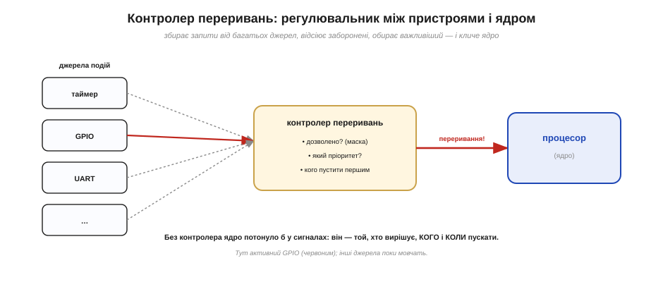
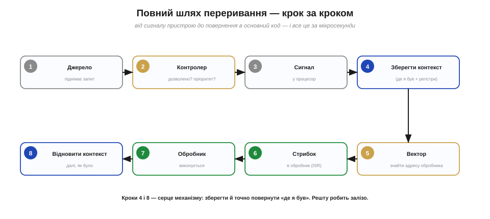
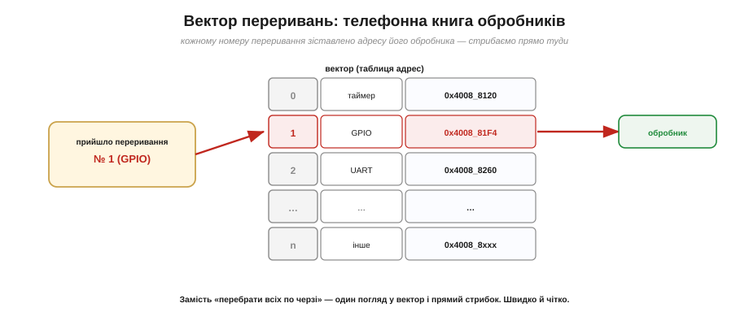
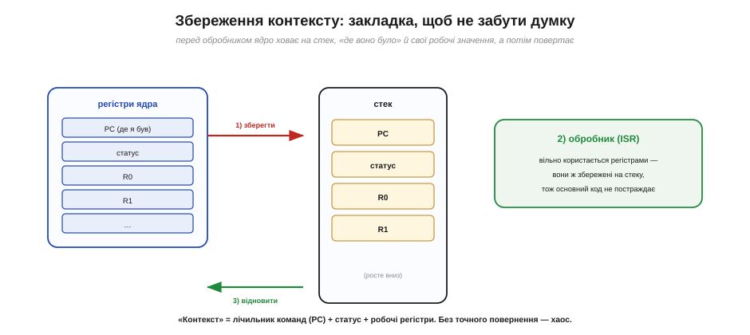
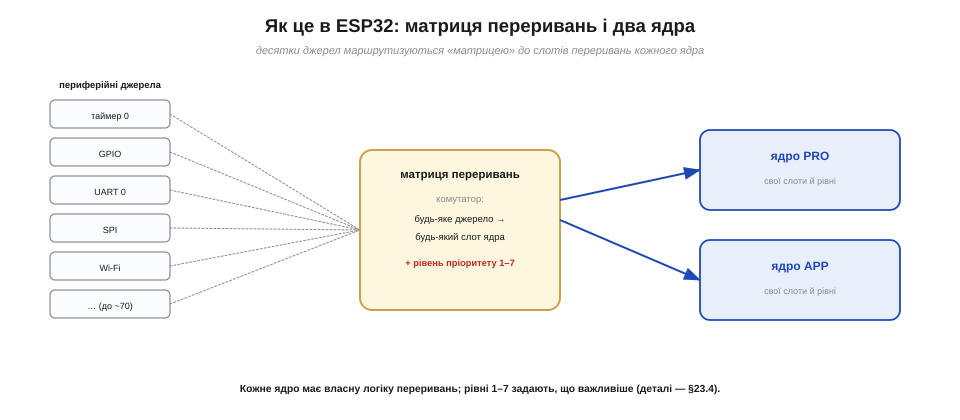

# Як це працює: контролер переривань і вектор (збереження контексту)

Сама ідея [переривання](book:programming/interrupts) проста: подія миттєво кличе процесор, той виконує обробник і вертається. А ось **як** це влаштовано всередині? За простою картинкою «дзвоник смикнув процесор» стоять три цілком конкретні механізми: **контролер переривань**, що збирає й сортує запити; **вектор**, що вказує, куди стрибати; і **збереження контексту**, що дозволяє повернутися. Розберімо їх по черзі — і «магія» обернеться зрозумілою інженерією.

### Контролер переривань: регулювальник запитів

Джерел переривань у мікроконтролері **багато** — таймери, ніжки GPIO, послідовні порти, радіо, — а процесор один, і одночасно він може обробляти лише одне переривання. Хтось мусить стояти між юрбою джерел і ядром та керувати рухом. Цей «регулювальник» і називають **контролером переривань**. Він збирає запити від усіх джерел і для кожного вирішує три речі: чи це переривання взагалі **дозволене** (не замасковане), який у нього **пріоритет** і, якщо претендентів кілька, **кого пустити першим**.


*Рис. Контролер — регулювальник між пристроями та ядром. Він приймає запити від багатьох джерел, відкидає замасковані, зважує пріоритети й лише тоді перебиває процесор. Без нього ядро потонуло б у сигналах; контролер — той, хто вирішує, **кого** і **коли** пускати.*

Завдяки контролеру процесор не мусить сам стежити за десятками джерел — він узагалі нічого не робить, поки контролер його не покличе. А коли кличе — уже з готовою відповіддю на питання «хто саме» й «наскільки терміново». Маскування й [пріоритети](book:programming/interrupt-priorities), що ними керує контролер, мають довгу історію — від ранніх машин, де інженери вперше навчили процесор відкладати менш важливі запити заради важливіших.

Варто розуміти, що складність контролера залежить від чипа. На простих 8-бітних МК (як Arduino Uno) джерел небагато, і кожному наперед відведено свій фіксований рядок у векторі — жодного «вибору» майже нема. А на потужному ESP32 джерел десятки, тож і контролер складніший: він уміє маскувати, розставляти пріоритети й навіть перекидати джерела між ядрами. Це загальна закономірність: що багатша периферія, то розумніший потрібен регулювальник переривань.

А що, коли два запити приходять **одночасно**? Саме для цього контролер і зважує **пріоритети**: він пускає першим важливіший, а менш важливий чекає своєї черги. Якщо ж переривання прийшло, поки ядро ще обробляє попереднє, контролер тримає його «на гачку» — запит не зникає — і подасть, щойно процесор звільниться; а може й **перебити** поточний обробник, якщо новий має вищий рівень. Ця гра [пріоритетів і вкладеності](book:programming/interrupt-priorities) — окрема велика тема; тут досить знати, що контролер ніколи не «губить» запитів і завжди обслуговує важливіше першим.

### Повний шлях переривання — крок за кроком

Складімо тепер усю послідовність, від сигналу пристрою до повернення в основний код. Вона завжди та сама.


*Рис. Вісім кроків переривання: (1) джерело піднімає запит; (2) контролер перевіряє дозвіл і пріоритет; (3) сигналить процесору; (4) той дочікує поточну інструкцію й **зберігає контекст**; (5) шукає адресу обробника у **векторі**; (6) стрибає в обробник; (7) обробник виконується; (8) контекст **відновлюється**, і код іде далі. Усе це — за мікросекунди.*

Зверніть увагу на два кроки, виділені кольором, — **4** і **8**. Саме збереження контексту перед обробником і його відновлення після — серце всього механізму; без них процесор не зміг би повернутися й продовжити перервану думку. Решту — дочекатися інструкції, стрибнути, повернутися — залізо робить само, без жодного рядка коду від нас. А от те, що між кроками 5 і 6 (вектор) і що саме ховається в кроках 4/8 (контекст), варто розглянути ближче.

### Вектор: телефонна книга обробників

Коли прийшло переривання, процесорові треба миттю дізнатися, **куди стрибати** — за адресою обробника саме цього джерела. Перебирати всіх по черзі («це таймер? ні. це UART? ні…») було б повільно. Тому адреси обробників складають наперед у спеціальну таблицю — **вектор переривань** (interrupt vector). Це по суті телефонна книга: номер переривання → адреса його обробника. Прийшло переривання №1 — процесор зазирає в рядок 1 вектора, бере звідти адресу й стрибає прямо туди.


*Рис. Вектор — таблиця адрес: кожному номеру переривання зіставлено, де лежить його обробник. Прийшло переривання №1 (GPIO) — один погляд у вектор, і процесор стрибає прямо за потрібною адресою, без жодного перебору «а хто це був». Швидко й однозначно.*

Саме цю ідею — вектор — подарував світові проєкт IBM Stretch наприкінці 1950-х. Відтоді вона незмінна: будь-який сучасний процесор, від ESP32 до настільного, знаходить обробник через таблицю векторів. Це класичний приклад того, як архітектурна знахідка живе десятиліттями.

Чесності заради додамо тонкість. На ESP32 (ядра Xtensa) вектор влаштований трохи інакше, ніж «один рядок на кожне джерело»: окрему адресу-вектор має кожен **рівень пріоритету** (1–7), а вже **всередині** рівня системний код з'ясовує, котре саме джерело спрацювало. Та з висоти нашої задачі ідея та сама: є таблиця, що веде від переривання до його обробника, і процесор користається нею замість сліпого перебору. Деталі цього диспетчингу бере на себе середовище, тож у звичайному коді ви їх не бачите.

### Збереження контексту: закладка, щоб не загубити думку

Тепер найтонше — кроки 4 і 8. Перш ніж кинутися виконувати обробник, процесор мусить **запам'ятати все, що йому знадобиться, щоб повернутися**. Цей набір даних і називають **контекстом**. До нього входять: **лічильник команд** (PC — адреса, де саме перервали основний код), **регістр статусу** (прапорці стану) і ті **робочі регістри**, які обробник може зачепити. Усе це ховається на **стек** — спеціальну ділянку пам'яті, що працює за принципом «останнім поклав — першим узяв».


*Рис. Перед обробником ядро **складає** на стек свій контекст — лічильник команд, статус і робочі регістри (крок 1). Обробник тим часом вільно користається регістрами (крок 2), бо їхні попередні значення в безпеці. Після обробника ядро **знімає** контекст зі стека (крок 3) і повертається точно туди, де було, з тими ж значеннями. Стек — це закладка.*

Чому це так важливо? Бо обробник — теж програма, і він теж користається регістрами процесора. Якби він просто почав їх затирати, не зберігши, то, повернувшись, основний код знайшов би свої дані **зіпсованими** — наче ви, відволікшись на дзвінок, забули, на якому рядку книжки спинилися, та ще й хтось переставив ваші речі. Стек і є тією закладкою: він точно зберігає «де я був і що в мене було», тож після обробника все відновлюється **бездоганно**. На ESP32 цю роботу виконують залізо й системний код — ви пишете лише сам обробник, а про збереження-відновлення не дбаєте.

Цікаво, що зберігання контексту ділять між собою **залізо** й **системний код**. Частину найважливіших регістрів (як-от лічильник команд) ховає сам процесор апаратно, щойно входить у переривання; решту робочих регістрів, які може зачепити ваша C-функція, зберігає згенерований компілятором «пролог» обробника — за наперед обумовленими правилами (їх звуть ABI, угодою про виклики). Через це **вхід** у переривання й **вихід** із нього не безкоштовні: на них іде помітний шматочок часу ще до першого корисного рядка вашого коду. Саме тому переривання вигідне для рідкісних подій і марнотратне для дуже частих.

> 🔧 **Навіщо це.** Збереження контексту коштує часу — це кілька тактів на «скласти» й «зняти» регістри, та сама затримка входу й джитер, що супроводжують будь-яке [переривання](book:programming/interrupts). Звідси два практичні висновки. По-перше, переривання не безкоштовне: дуже часті переривання самим лише збереженням-відновленням контексту здатні з'їсти відчутну частку процесора. По-друге, що більше регістрів зачіпає обробник, то більше їх доведеться зберігати, — ще одна причина тримати [обробник](book:programming/isr) **коротким**.

### Як це влаштовано в ESP32: матриця переривань і два ядра

У ESP32 ця схема має свої особливості. По-перше, ядер **два** (PRO і APP), і кожне має власну логіку переривань зі своїми **рівнями пріоритету 1–7**. По-друге, периферійних джерел дуже багато (близько сімдесяти), а «слотів» переривань у ядра небагато, тож між ними стоїть гнучкий комутатор — **матриця переривань** (interrupt matrix). Вона дозволяє маршрутизувати **будь-яке** джерело до будь-якого вільного слота потрібного ядра.


*Рис. У ESP32 десятки периферійних джерел проходять крізь **матрицю переривань** — комутатор, що скеровує будь-яке з них до слота потрібного ядра (PRO чи APP) із потрібним рівнем пріоритету (1–7). Кожне ядро має власну логіку переривань. Гнучкість матриці й дозволяє вільно «розкладати» переривання по ядрах.*

Завдяки матриці ви можете, наприклад, тримати переривання від зв'язку на одному ядрі, а свої — на іншому, щоб вони не заважали одне одному. У повсякденному коді на Arduino ці тонкощі найчастіше сховані за `attachInterrupt`, та знати про них корисно: коли проєкт виросте, саме розкладання переривань по ядрах і [рівнях пріоритету](book:programming/interrupt-priorities) стане важелем продуктивності.

На щастя, у щоденній практиці матрицю переривань напряму не чіпають. У Arduino за вас усе робить `attachInterrupt`, а в ESP-IDF — окрема системна функція, що сама знаходить вільний слот, прокладає маршрут через матрицю й чіпляє ваш обробник. Ручне керування матрицею знадобиться хіба що в дуже тонких випадках — коли важить, на якому ядрі й з яким рівнем працює конкретне переривання. Але знати, що цей шар існує, корисно: він пояснює, чому на ESP32 переривань може бути так багато й чому їх можна гнучко розкладати.

> 🔌 **Два різні залізні підходи.** Матриця ESP32 — лише одна зі шкіл. У світі ARM Cortex-M панує інший контролер — **NVIC**, вектороване й з апаратною вкладеністю. Порівняння двох філософій — у вставці [Контролери переривань у залізі](comp-int-controllers.md).

### Під капотом attachInterrupt: усі ніжки крізь одну лійку

Лишилася ще одна важлива для нас деталь: як проста `attachInterrupt(pin, …)` лягає на цю машинерію. Тут ховається несподіванка. У ESP32 **усі ніжки GPIO ділять одне-єдине** переривання (на ядро) — окремого переривання на кожну ніжку немає. Тому коли спрацьовує будь-яка ніжка, викликається один спільний обробник GPIO, а він уже з'ясовує, **хто саме** це був, читаючи [регістр стану](book:programming/gpio-registers) `GPIO_STATUS` (де біт відповідає ніжці), і кличе вашу функцію для тієї ніжки.


*Рис. Усі GPIO ділять одне переривання. Коли спрацював GPIO4, біт у `GPIO_STATUS` це позначає; спільний обробник ядра Arduino читає статус, за бітом знаходить, чию функцію кликати, і викликає ваш `onPress()`. Ось чому спільний обробник має бути **швидким** — затримка в ньому б'є по **всіх** ніжках.*

Спрощено цей спільний обробник робить ось що:

**Що робить спільний GPIO-обробник (спрощено).**

```
void gpio_isr() {
  uint32_t status = GPIO.status;      // хто спрацював? (біти-ніжки)
  for (кожен піднятий біт n у status)
      handlers[n]();                  // викликати ВАШ обробник для ніжки n
  GPIO.status_w1tc = status;          // скинути прапорці (атомарно, §4.4.7)
}
```

Зверніть увагу на останній рядок: прапорці спрацювання скидають через регістр `W1TC` — той самий [атомарний прийом роботи з регістрами](book:programming/gpio-registers), що знімає лише потрібні біти, не зачепивши решти. А ще ясно, чому обробник так наполегливо просять робити **коротким**: він **спільний** для всіх ніжок, і якщо ваша функція в ньому зависне, вона затримає реакцію на **всі** інші переривання GPIO.

Звідси й сумнозвісне правило «**жодного `Serial.print` в обробнику**». Друк у послідовний порт повільний (мілісекунди) і сам спирається на переривання; запхати його у спільний GPIO-обробник означає підвісити на ці мілісекунди реакцію всіх ніжок, а часом і зачепити систему загалом. Те саме стосується `delay`, складних обчислень, роботи з мережею чи файлами. Спільна «лійка» перетворює будь-яку повільну дію в обробнику на гальмо для всього заразом — тому в ISR пускають лише найнеобхідніше.

> 🔧 **Навіщо це.** Ця «лійка» пояснює дві речі, що дивують новачків. По-перше, чому обробник має бути блискавичним: він не лише ваш — він спільний, і повільність у ньому гальмує всіх. По-друге, чому всередині переривання так багато регістрової механіки (статус, маски, W1TC): `attachInterrupt` ховає її, та коли треба максимальна швидкість, досвідчені пишуть власний обробник прямо [на регістрах](book:programming/gpio-registers).

Отже, за простим «дзвоником» стоять три механізми: **контролер** збирає й сортує запити; **вектор** (телефонна книга обробників) показує, куди стрибати; а **збереження контексту** на стек — це закладка, що дозволяє повернутися точно туди, де перервали, з тими самими робочими значеннями. У ESP32 до цього додаються матриця переривань, два ядра з рівнями 1–7 і спільна «лійка» GPIO, що дає змогу `attachInterrupt` працювати по-простому. І вся ця машинерія підпирає одне просте правило: обробник **мусить бути коротким** — бо кожен зайвий такт у ньому множиться на затримку входу-виходу й б'є по всіх інших перериваннях. Як саме виглядає правильний короткий [обробник переривання (ISR)](book:programming/isr) — що в ньому можна робити, а чого категорично не варто — це окрема предметна розмова.
