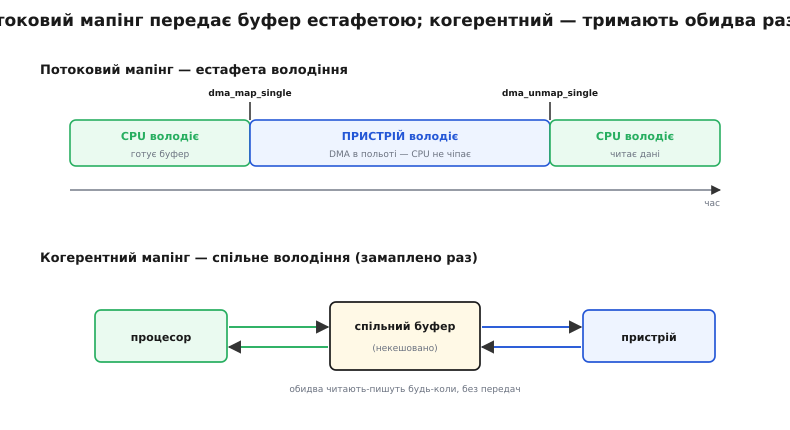

# ⚙️ Драйвер і DMA-мапінг: IOMMU під капотом dma_map_single

Драйвер тримає буфер у пам'яті ядра, а [пристрій](book:programming/dma-controller) мусить сам туди писати чи звідти читати через DMA. Доки на його шляху стоїть IOMMU, пристрій уже не адресує пам'ять фізичними адресами — він оперує IOVA, і торкнутися він може лише тих IOVA, які драйвер свідомо завів у його домен. Тому перед будь-якою передачею драйвер має попросити ядро: «заведи переклад для цього буфера й скажи адресу, якою пристрій має користуватися». А після передачі — попросити той переклад зняти.

Ця пара прохань і є **DMA-мапінг** — сімейство викликів `dma_map_single`, `dma_alloc_coherent` та їхніх родичів. Виглядають вони невинно, наче звичайні функції, але під ними ховається справжня робота: виділити IOVA, вписати запис у таблицю сторінок IOMMU, а на зворотному боці — ще й знеправити IOTLB. Помилився в дисципліні цих викликів — і дістанеш або тихе псування чужих даних, або повільний витік, що врешті заклинить пристрій. Розберемо, що саме відбувається під капотом, скільки це коштує на потоці пакетів і як не вистрелити собі в ногу. Код тут — ядро Linux, предметно системний і близький до заліза, тож мовою C.

## Ідея: одна пам'ять — дві адреси й одна естафета

Драйвер ніколи не редагує таблиці IOMMU руками. Ними володіє ядро, і драйвер лише просить. У підсумку той самий буфер живе під **двома адресами**: адресою процесора (`cpu_buf` — звичайний вказівник ядра, яким пише й читає CPU) і адресою пристрою (`dma_addr_t` — а це і є IOVA). `dma_map_single` заводить у домені пристрою запис `IOVA → фізична адреса` й повертає IOVA; `dma_unmap_single` цей запис прибирає й знеправляє IOTLB. У регістр пристрою потрапляє **саме IOVA**, ніколи не `cpu_buf`. Уся суть — тримати ці дві адреси нарізно й не переплутати їх місцями.

І одразу — друга ідея, на якій спотикаються найчастіше: **володіння**. Потоковий мапінг — це не просто адреса, це естафетна паличка. Від миті `dma_map_single` до миті `dma_unmap_single` буфер належить **пристрою**, і процесор його чіпати не має права. Причина — рівно в тому, що робиться під капотом.

## Що робить dma_map_single під капотом

Виклик `dma_map_single(dev, cpu_buf, size, dir)` розгортається в кілька кроків, і кожен щось коштує:

- **Знайти фізичні сторінки буфера.** `cpu_buf` — віртуальна адреса ядра; ядро дістає з неї фізичні сторінки, на яких буфер насправді лежить (їх може бути кілька, і не поспіль).
- **Виділити діапазон IOVA.** У кожного домену — свій розподільник IOVA. Швидкий шлях — **безблокувальний кеш на кожне ядро** (per-CPU rcache: невеликі «магазини» вільних IOVA, звідки береш без жодного замка); промах кеша тягне за собою повільніший шлях — червоно-чорне дерево вільних діапазонів під спільним замком. Для мережі чи диска, де мапінгів мільйони за секунду, саме цей кеш і рятує від затору на замку.
- **Вписати запис у таблицю сторінок IOMMU.** Тепер `IOVA → фізична адреса` в домені цього пристрою, з правами за напрямом: для `DMA_TO_DEVICE` сторінка лише на читання (пристрій має читати), для `DMA_FROM_DEVICE` — на запис.
- **За потреби — обслужити кеш процесора** (про це нижче, у потоковому мапінгу).
- **Повернути `dma_addr_t`** — це база виділеного IOVA плюс зсув буфера в сторінці.

Зняття `dma_unmap_single(dev, dma_addr, size, dir)` іде у зворотному порядку, і тут — найдорожчий крок усієї пари:

- **Викреслити запис** із таблиці сторінок домену.
- **Знеправити IOTLB** для цієї IOVA. IOMMU кешує недавні переклади, тож викреслити рядок із таблиці замало — треба ще прогнати застарілий переклад із [IOTLB](book:programming/tlb). А це не запис у пам'ять: ядро видає IOMMU команду знеправлення й **чекає її завершення** — прохід через ту саму шину, порядку сотень наносекунд і більше. Саме це знеправлення робить пару «замапити / зняти» відчутно дорожчою за звичайний запис у регістр.
- **Повернути IOVA** розподільнику (назад у per-CPU кеш, а як переповнився — у дерево).
- **Обслужити кеш процесора** для `DMA_FROM_DEVICE` (знову ж — нижче).


*Пара «замапити / зняти» — це не один запис у пам'ять, а виділення IOVA, запис у таблицю й, найдорожче, синхронне знеправлення IOTLB на знятті. Тому драйвери мапують кільцеві буфери раз наперед і на кожен пакет платять лише за дешеву синхронізацію кеша, а не за весь цикл.*

## Два різновиди мапінгу: потоковий і когерентний

DMA-мапінг буває двох ґатунків, і плутати їх не можна, бо вони по-різному ставляться і до кеша, і до володіння.

**Когерентний (англ. coherent — «узгоджений») мапінг** — `dma_alloc_coherent`. Він одразу **виділяє пам'ять і мапує її**, а тримається замапленою весь час, поки жива структура. І процесор, і пристрій читають-пишуть цю пам'ять **будь-коли**, бачачи однаковий її стан без жодних додаткових дій. Плата за це на архітектурах із некогерентним DMA — така пам'ять роздається **некешованою** (чи write-combining), тож доступ CPU до неї повільніший. Тому когерентний мапінг беруть під те, що обидва боки смикають **постійно й потроху**: кільця дескрипторів, лічильники, тіні дзвінкових (англ. doorbell) регістрів. Синхронізувати кеш вручну там довелося б на кожному кроці — простіше зробити пам'ять некешованою раз і назавжди.

**Потоковий (англ. streaming — «поточний») мапінг** — `dma_map_single`, `dma_map_page`, `dma_map_sg`. Він мапує **вже наявний** буфер під **одну передачу в одному напрямі**, а потім знімається. Пам'ять лишається звичайною, кешованою — тому доступ CPU до неї швидкий, — а узгодження з пристроєм відбувається **разово** на межах мапінгу. Ось звідки і естафета володіння, і потреба чіпати кеш.

Уся річ у кеші процесора. Коли ти мапуєш буфер `DMA_TO_DEVICE` (пам'ять → пристрій, наприклад відправлення), твої останні записи можуть ще сидіти в кеші й не дійти до самої пам'яті — тож на мапінгу кеш **виштовхують** (flush), щоб пристрій прочитав свіже. Коли мапуєш `DMA_FROM_DEVICE` (пристрій → пам'ять, приймання), пристрій запише RAM повз кеш процесора — тож на знятті кеш для цих рядків **знецінюють** (invalidate), інакше CPU прочитає застарілу копію з кеша замість того, що приніс пристрій. На когерентних машинах (типовий x86) залізо тримає [кеш узгодженим](book:programming/cache-coherence) само, і ці дії — пусті; на ARM та інших некогерентних — ні, і пропуск їх дає те саме тихе, плавуче псування даних. Напрям (`DMA_TO_DEVICE` / `DMA_FROM_DEVICE` / `DMA_BIDIRECTIONAL`) — це і є підказка ядру, в який бік чистити кеш і які права ставити в IOMMU.


*Потоковий мапінг передає буфер, як естафету: поки нею володіє пристрій (між map і unmap), процесор доступу не має. Когерентний — спільне володіння без передач: обидва бачать той самий стан будь-коли, ціною некешованого доступу.*

> 🔧 **Навіщо це.** Правило просте: те, що обидва боки смикають постійно (кільце дескрипторів, метадані) — `dma_alloc_coherent`; масовий разовий вантаж (пакет, блок диска) — потоковий `dma_map_single`. Сплутаєш — або задавиш швидкодію (гнатимеш кілобайти пакета через некешовану пам'ять), або впіймаєш псування (чіпатимеш потоковий буфер, поки ним володіє пристрій).

## Робочий код

Складімо це докупи на прикладі мережевої карти. Спершу — **когерентне** кільце дескрипторів, яке і ядро, і карта чіпають безперервно:

```c
#include <linux/dma-mapping.h>

struct rx_desc { __le64 addr; __le32 len; __le32 status; };  /* формат заліза */

/* Кільце дескрипторів — обидва боки смикають його весь час → когерентний мапінг. */
ring->desc = dma_alloc_coherent(dev, RING_N * sizeof(struct rx_desc),
                                &ring->desc_dma, GFP_KERNEL);
if (!ring->desc)
    return -ENOMEM;
/* ring->desc     — адреса для ЯДРА (ним ядро пише дескриптори)
   ring->desc_dma — IOVA, яку віддаємо карті в регістр бази кільця        */
iowrite32(lower_32_bits(ring->desc_dma), regs + REG_RXRING_BASE_LO);
iowrite32(upper_32_bits(ring->desc_dma), regs + REG_RXRING_BASE_HI);
```

Тепер **потокове** відправлення одного пакета — одна передача, один напрям, `DMA_TO_DEVICE`:

```c
/* skb з готовим пакетом на відправлення. */
dma_addr_t da = dma_map_single(dev, skb->data, skb->len, DMA_TO_DEVICE);
if (dma_mapping_error(dev, da))          /* IOVA скінчились чи мапінг не вдався */
    return -ENOMEM;

desc->addr = cpu_to_le64(da);            /* карті — IOVA, а НЕ skb->data! */
desc->len  = cpu_to_le32(skb->len);
dma_wmb();                               /* дескриптор видимий ДО дзвінка */
desc->status = cpu_to_le32(DESC_OWN_NIC);
iowrite32(tx_tail, regs + REG_TX_TAIL);  /* дзвінок: «є що слати» */

/* ... карта відіслала пакет і підняла переривання «готово» ... */
dma_unmap_single(dev, da, skb->len, DMA_TO_DEVICE);
dev_kfree_skb(skb);
```

`dma_wmb()` між записом дескриптора й дзвінком — не забаганка: без цього [бар'єра](book:programming/memory-barrier-instructions) запис дзвінкового регістра міг би дійти до карти раніше за запис дескриптора, і карта прочитала б порожній рядок. Порядок «спершу дескриптор, тоді дзвінок» тут обов'язковий.

Якщо буфер розкиданий по кількох фізичних шматках, замість `dma_map_single` беруть **[scatter-gather](book:algorithms/scatter-gather)**:

```c
int n = dma_map_sg(dev, sglist, nents, DMA_TO_DEVICE);
if (n == 0)
    return -ENOMEM;

struct scatterlist *sg;
int i;
for_each_sg(sglist, sg, n, i) {
    desc[i].addr = cpu_to_le64(sg_dma_address(sg));   /* IOVA шматка */
    desc[i].len  = cpu_to_le32(sg_dma_len(sg));
}
/* ... передача ... */
dma_unmap_sg(dev, sglist, nents, DMA_TO_DEVICE);
```

Тонкість, яку легко проґавити: з IOMMU `dma_map_sg` часто повертає `n` **менше** за `nents`. IOMMU здатен розкидані фізичні шматки замапити на **суцільний** діапазон IOVA — і тоді кілька вхідних сегментів схлопуються в один вихідний. Тому цикл ходить по `n` (повернене), а не по `nents` (подане), і `sg_dma_address`/`sg_dma_len` треба брати саме з опрацьованого списку, а не з фізичних довжин.

## Ціна на потоці пакетів — і чому мапують наперед

Тепер найцікавіше — вартість. Пара «замапити / зняти» коштує не як запис у регістр, а як виділення IOVA плюс запис у таблицю плюс **синхронне знеправлення IOTLB**. Прикиньмо, чи можна дозволити собі таку пару на кожен пакет. Візьмімо 10-гігабітну карту:

```
10 GbE, кадри 1518 Б  →  ≈ 812 000 пакетів/с   (≈ 1.23 мкс на пакет)
10 GbE, кадри   64 Б  →  ≈ 14 880 000 пакетів/с (≈ 67 нс на пакет)
```

Бюджет на дрібний пакет — **67 наносекунд**. А одне лише синхронне знеправлення IOTLB — уже порядку сотень наносекунд, тобто в кілька разів **більше за весь бюджет пакета**. Мапувати й знімати на кожен пакет означало б і близько не дійти до лінійної швидкості; на дрібних кадрах карта простоювала б, чекаючи IOMMU. Отже пара map/unmap на гарячому шляху — не варіант.

Розв'язок — **мапувати наперед і перевикористовувати**. Драйвер замапляє буфери кільця **раз при старті** й тримає їх замапленими весь час роботи, а на кожен пакет платить лише за дешевий `dma_sync` — саме те обслуговування кеша, без виділення IOVA, без запису в таблицю, без знеправлення IOTLB:

```c
/* Старт: замапити КОЖЕН буфер кільця РАЗ і тримати замапленим. */
for (i = 0; i < RING_N; i++) {
    buf[i] = kmalloc(BUF_SZ, GFP_KERNEL);
    dma[i] = dma_map_single(dev, buf[i], BUF_SZ, DMA_FROM_DEVICE);
    if (dma_mapping_error(dev, dma[i]))
        goto unwind;
    desc[i].addr = cpu_to_le64(dma[i]);   /* IOVA у дескриптор кільця */
}

/* Гарячий шлях: на кожен прийнятий пакет — БЕЗ map/unmap, лише sync. */
static void rx_one(int i)
{
    dma_sync_single_for_cpu(dev, dma[i], BUF_SZ, DMA_FROM_DEVICE); /* забрати собі */
    process_packet(buf[i], le32_to_cpu(desc[i].len));
    dma_sync_single_for_device(dev, dma[i], BUF_SZ, DMA_FROM_DEVICE); /* вернути карті */
    desc[i].status = cpu_to_le32(DESC_OWN_NIC);
}

/* Зупинка: зняти кожен буфер — тепер уже раз. */
for (i = 0; i < RING_N; i++)
    dma_unmap_single(dev, dma[i], BUF_SZ, DMA_FROM_DEVICE);
```

Пара `dma_sync_single_for_cpu` / `dma_sync_single_for_device` — це та сама естафета володіння, тільки **без зняття мапінгу**: `for_cpu` позичає буфер процесору назад (знецінює кеш, щоб CPU побачив дані карти), `for_device` повертає його карті (виштовхує кеш, щоб карта побачила зміни). IOVA лишається живою, IOTLB не чіпається. Саме так працює й `page_pool` у сучасних драйверах — тримає DMA-мапінги в кеші й переганяє сторінки по колу, а не мапує їх щоразу. Дорогий цикл map/unmap амортизується на тисячі пакетів у майже нуль.

Є й другий важіль — з боку самого IOMMU. У **суворому** режимі кожне зняття синхронно знеправляє IOTLB одразу. У **лінивому** (`iommu.strict=0`, черга знеправлень) команди знеправлення **збираються в чергу** й проганяються пачкою — коли черга заповнюється або спливає таймер порядку десятка мілісекунд, — а IOVA до того притримуються. Це наближає швидкодію до машини **без IOMMU** взагалі, але має ціну: щойно звільнена IOVA якийсь час іще лишається придатною для перекладу, тож вузьке вікно на атаку крізь застарілий запис розширюється. Класичний компроміс «швидше проти безпечніше», який вибирають політикою завантаження.

## Режим тотожності: коли переклад узагалі вимикають

Буває, що навіть дешевого мапінгу наперед забагато — потрібна геть нативна швидкодія для довіреного пристрою. Тоді домену пристрою дають не звичайну таблицю, а **тотожний мап** (англ. identity map): IOVA дорівнює фізичній адресі один-в-один. Це режим наскрізного пропуску (англ. passthrough — «наскрізний»), `iommu=pt`. У ньому `dma_map_single` **повертає просто фізичну адресу** — без виділення IOVA, без запису в таблицю, без IOTLB. DMA біжить, наче IOMMU й немає.

Плата очевидна з самого означення: пристрій, чий домен тотожно накрив усю RAM, знову бачить **усю пам'ять машини** — захисту з нього немає. Тож `iommu=pt` беруть для довіреного заліза заради максимальної пропускної здатності, свідомо міняючи ізоляцію на швидкість, а сторонні пристрої (Thunderbolt, гостьові в наскрізній передачі) лишають у справжніх, перекладних доменах.

## Складність і пастки

Дисципліна DMA-мапінгу невелика, але кожне порушення карається тихо — без падіння, з псуванням десь віддалік. Ось чотири класичні.

**Забуте зняття.** Не викликав `dma_unmap_single` — і дістаєш одразу дві біди. Перша: IOVA не повертається розподільнику, простір IOVA поступово вичерпується (надто вузький 32-бітний діапазон), і врешті `dma_map_single` починає віддавати помилку — пристрій нидіє. Друга, гірша: у таблиці й IOTLB лишається живий переклад на пам'ять, яку ядро вже звільнило й віддало комусь іншому. Пристрій за старим записом пише **в чужі дані** — тихе псування, а на додачу ще й діра в безпеці. Це як витік пам'яті, лише отруйніший.

**CPU-адреса замість dev_addr.** Найпоширеніша плутанина — вписати пристрою `cpu_buf` замість повернутого `da`. Пристрій виставить це число як IOVA; у справжньому домені така IOVA не замаплена — і IOMMU дасть переривання-помилку (ще пощастило, ти це побачиш). А в режимі тотожності те саме число піде як фізична адреса кудись навмання — тихий запис у випадкове місце. Уся дисципліна «дві адреси» саме проти цього: у регістр — тільки `da`.

**Доступ до буфера, поки ним володіє пристрій.** Між `dma_map_single` і `dma_unmap_single` потоковий буфер належить пристрою. Прочитав його процесором на некогерентній машині — дістав застаріле з кеша; записав — або затер те, що пристрій уже приніс, або твій запис затре пристрій. Треба позичити буфер назад через `dma_sync_single_for_cpu` і повернути через `dma_sync_single_for_device`. Найпідступніше тут те, що на когерентному x86 код «працює» (залізо приховує гріх), а на ARM починає плавуче псувати дані — і баг вилазить аж на іншому залізі.

**Неперевірений dma_mapping_error.** `dma_map_single` може не вдатися — скінчились IOVA, вичерпався перевалочний буфер (англ. bounce buffer) під 32-бітний пристрій. Повернене значення тоді — не адреса, і використати його як адресу означає націлити DMA в нікуди. Тому після кожного мапінгу — `dma_mapping_error`, і жодного дескриптора до перевірки.

**Коротко.** DMA-мапінг наводить міст між двома адресами одного буфера: `cpu_buf` для процесора й `dma_addr_t` (IOVA) для пристрою. `dma_map_single` під капотом виділяє IOVA (швидкий per-CPU кеш → дерево), пише запис у таблицю домену й повертає IOVA; `dma_unmap_single` викреслює запис, **синхронно знеправляє IOTLB** (найдорожчий крок) і повертає IOVA. Мапінг буває **когерентний** (`dma_alloc_coherent` — спільне володіння, некешовано, під кільця й метадані) і **потоковий** (`dma_map_single` — естафета володіння, кешовано, під разовий вантаж), а напрям `DMA_TO/FROM_DEVICE` каже, в який бік чистити кеш. Пара map/unmap надто дорога на потоці пакетів, тож буфери кільця мапують **наперед** і на кожен пакет платять лише дешевим `dma_sync`; лінивий режим IOMMU й тотожний `iommu=pt` вимінюють ізоляцію на ще більшу швидкість. Пастки тихі: забуте зняття (витік IOVA + застарілий IOTLB), CPU-адреса замість IOVA, доступ до буфера в чужому володінні, неперевірена помилка мапінгу.
