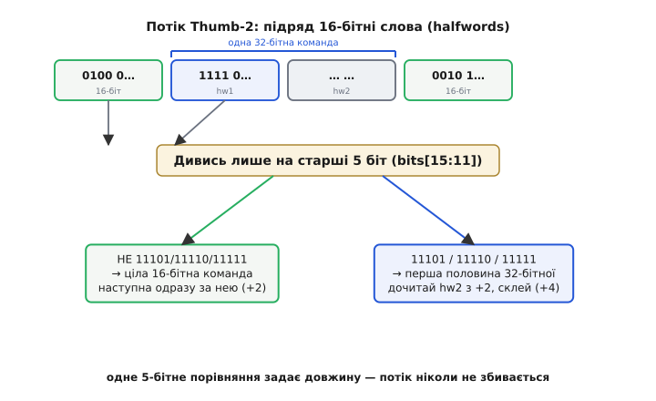

# 📜 Як народився Thumb: коли пам'ять коштувала дорожче за красу

Наприкінці 1980-х ARM була дивовижно чистою архітектурою. Кожна команда — рівно 32 біти, три операнди, умова виконання в кожній, ортогональний регістровий файл. Інженери з Кембриджа зробили щось елегантне: набір команд, який декодується майже задарма і лягає в кремній купкою простих дротів. І от саме ця елегантність за кілька років ледь не вбила ARM у найдешевшому й найважливішому сегменті — у кишенькових пристроях, де важив не такт процесора, а кожен байт пам'яті й кожна доріжка на платі.

Історія Thumb — це історія про те, як гарну ідею довелося свідомо зіпсувати заради брутальної реальності: у дешевому пристрої 1994 року пам'ять була вужча за процесор, повільніша за процесор і дорожча за процесор. І перемогла не архітектура, що виконує команди найшвидше, а та, що вміщає програму в найменше байтів.

## Задача, від якої нікуди було дітися: щільність коду

Щоб зрозуміти Thumb, треба відчути одну незручну арифметику тих років. Класична 32-бітна ARM-команда займає 4 байти. Проста програма на кілька тисяч команд — це десятки кілобайтів машинного коду. У 1994 році, коли ARM7 йшов у мобільні телефони й кишенькові органайзери, це була болюча цифра з двох причин одразу.

Перша причина — гроші. Флеш-пам'ять (або ROM) коштувала помітних грошей за кілобайт, і в масовому виробі на мільйони штук зайві 30% розміру прошивки — це прямі втрати на кожному проданому пристрої. Дешевий пристрій просто не міг дозволити собі багато пам'яті, а отже, програма мусила бути малою.

Друга причина — тонша й підступніша: **ширина шини пам'яті**. Щоб зекономити на корпусі мікросхеми, на кількості виводів і на доріжках плати, дешеві системи ставили не 32-бітну, а **16-бітну шину до пам'яті**. І тут елегантність ARM оберталася на кару. Ось у чому суть:

```
32-бітна команда через 16-бітну шину:
  такт 1: читаємо молодші 16 біт команди
  такт 2: читаємо старші 16 біт команди
  → одна команда = ДВА звертання до пам'яті
```

Процесор, здатний виконати команду за один такт, простоював, чекаючи, поки вузька шина півсловами витягне йому 32-бітну команду. Ефективна швидкість падала вдвічі — не через процесор, а через дорогу від пам'яті до нього. Виходив прикрий парадокс: швидке ядро, задушене вузькою й повільною пам'яттю, за яку заплатили саме тому, що хотіли зробити пристрій дешевим.

> 🔧 **Навіщо це.** Цей самий компроміс живий і сьогодні в будь-якому мікроконтролері. Флеш повільніший за ядро; що щільніший код, то менше звертань до флешу, то менше тактів простою і то менше споживання. Розуміння «щільність коду = швидкість + гроші + батарея» пояснює, чому виробники MCU досі хваляться байтами прошивки, а не лише мегагерцами.

Постала задача, яку не обійти доброю компіляцією: потрібен спосіб записувати ті самі програми **вдвічі щільніше** — так, щоб через 16-бітну шину команда витягалася за один такт, а прошивка займала майже вдвічі менше флешу. Причому бажано не викидати саме ядро ARM, у яке вже вклали роки праці.

## Ідея Thumb: не нова архітектура, а стиснений запис старої

Рішення, яке народилося в ARM на початку 1990-х, було по-інженерному хитрим. Замість проєктувати новий процесор вони придумали **другий спосіб записувати команди для того самого процесора**. Назвали його **Thumb** (англ. *thumb* — великий палець; натяк на «кишеньковий», зменшений варіант, як «Tom Thumb» — хлопчик-мізинчик в англійських казках).

Суть Thumb-1 така: узяти найчастіші, найкорисніші команди ARM і перекодувати їх у **16 біт** замість 32. Не всі команди — лише підмножину, і з обмеженнями. Але цих обмежених 16-бітних команд вистачало, щоб писати звичайні програми, і кожна тепер займала вдвічі менше місця й тяглася через 16-бітну шину за один такт.

Найкрасивіше — як це зробили всередині. Процесор не вчився виконувати Thumb. Замість цього перед декодером поставили крихітний блок-**розгортач**: він на льоту брав 16-бітну Thumb-команду й перетворював її на еквівалентну повну 32-бітну ARM-команду, яку далі виконувало те саме, незмінне ARM-ядро.

```
16-бітна Thumb-команда  →  [розгортач]  →  32-бітна ARM-команда  →  ядро ARM
      (у пам'яті,                            (усередині, ніхто                (те саме,
       щільно)                                її не бачить)                    що й було)
```

Це геніальний обхід: щільність запису в пам'яті ми отримали задарма, а складне ядро лишилося тим самим і не подорожчало. Плата за фокус захована в самому стисненні — і про неї далі.

Уперше Thumb з'явився в процесорі **ARM7TDMI** — і сама назва це підказує. Літери «TDMI» розшифровують як **T**humb, **D**ebug (апаратне налагодження через JTAG), **M**ultiplier (швидкий помножувач) та **I**CE (вбудований емулятор). Тобто «T» на першому місці — це і є Thumb; підтримку стисненого набору вписали прямо в ім'я ядра, настільки вона була важлива для ринку. Архітектурно це позначили як **ARMv4T** — базова ARMv4 плюс «T» = розширення Thumb.

За датами варто бути точним, бо джерела трохи розходяться. **ARM Ltd.** заснували в **листопаді 1990 року** як спільне підприємство Acorn Computers, Apple і VLSI Technology (перша назва — Advanced RISC Machines). Ядро ARM7TDMI з підтримкою Thumb з'явилося приблизно у **1994 році**; частина офіційних матеріалів ARM датує сам набір команд Thumb **1995 роком**. Обидві цифри трапляються в документах — це усталений факт із невеликим різнобоєм у тому, що саме рахувати «появою»: готове ядро (1994) чи офіційний реліз набору (1995).

Ефект був негайний і потужний саме там, де боліло. Texas Instruments ліцензувала ARM7TDMI й поставила його в **Nokia 6110** — перший GSM-телефон на ARM (1997–1998 роки), звідки виросла ціла лінійка культових Nokia (3210, 3310). Мобільна індустрія 1990-х масово поставала на ARM7TDMI саме тому, що Thumb вкладав прошивку телефона в дешеву вузьку пам'ять. Це усталений, добре задокументований епізод: без Thumb ARM навряд чи виграв би ранній мобільний ринок.

## Чому Thumb-1 був щільним, але тісним

Тепер — про заховану плату. Стиснути 32 біти в 16 не можна безкоштовно: половину бітів ти фізично викидаєш, і щось мусить пропасти. Розберімо, що саме, бо звідси випливе вся потреба в наступному кроці.

Бюджет команди впав із 32 біт до 16. Усе, що жило в тих 32 бітах, тепер треба втиснути вдвічі щільніше або відрізати. Відрізали, за суворою логікою «лишаємо лише те, що використовується найчастіше»:

**Регістри.** У повному ARM під номер регістра йшло 4 біти — 2⁴ = 16 регістрів, і будь-яка команда бачила всі шістнадцять. У Thumb-1 на регістр здебільшого лишалося **3 біти** — 2³ = 8. Тому більшість Thumb-команд працювали лише з вісьмома «нижніми» регістрами (r0–r7); до старших (r8–r15) діставалися хіба кількома спеціальними командами. Логіка тієї самої тісноти бюджету, що керує будь-яким кодуванням: скільки біт віддав під поле, стільки в ньому й межа.

**Умовне виконання.** Класична риса ARM — кожна команда несла 4-бітну умову: «виконай, лише якщо був нуль», «лише якщо було менше» тощо. Це давало гарний код без розгалужень, але коштувало 4 біти в **кожній** команді. У 16-бітному бюджеті така розкіш неприпустима — умову з команд прибрали. У Thumb-1 галуження робили звичайним способом: порівняння, потім умовний перехід.

**Розмір констант.** Число, вкладене прямо в команду (immediate), у 16 бітах мусило вміститися в жалюгідні кілька біт. Велику константу тепер годі покласти однією командою — доводилося складати кількома або тягти з пам'яті.

**Гнучкість операндів.** Славнозвісний «безкоштовний зсув» ARM (коли команда могла заодно зсунути один з операндів) у Thumb-1 майже зник — на нього просто не лишалося бітів.

Сума цих жертв дала цікавий результат. Виміряно, що **Thumb-код займає близько 65% розміру еквівалентного ARM-коду** — тобто економія по місцю приблизно третина, а через вузьку 16-бітну шину швидкодія навіть зростала (менше звертань до пам'яті на команду). Це усталена цифра з матеріалів ARM тих років.

Але була й зворотна сторона. Оскільки одна Thumb-команда робить менше за одну ARM-команду, деякі дії тепер вимагали **двох Thumb-команд там, де вистачало однієї ARM**. На широкій 32-бітній пам'яті, де ARM-команда й так тяглася за один такт, Thumb міг виявитися навіть повільнішим — бо команд ставало більше. Отримали чіткий компроміс епохи Thumb-1:

```
      вузька 16-біт пам'ять        широка 32-біт пам'ять
Thumb   щільно + ШВИДШЕ             щільно, але команд БІЛЬШЕ → часом повільніше
ARM     кожна команда = 2 такти    кожна команда = 1 такт, повна потужність
```

Звідси й незручність у реальному житті: код доводилося ділити на «Thumb-частини» (де важлива щільність) і «ARM-частини» (де важлива швидкодія), а процесор — перемикати між двома режимами спеціальною командою переходу. Кожне перемикання — зайвий клопіт для компілятора і програміста, зайві переходи, роздвоєна свідомість тулчейна. Тіснота Thumb-1 була платою за щільність, і ця плата дратувала.

## Хитрість, що все розв'язала: як один потік розрізняє 16 і 32 біти

Проблему Thumb-1 можна сформулювати гостро: **або щільно (Thumb, але тісно), або потужно (ARM, але роздуто), і треба весь час перемикатися**. А хотілося — і те, й те в одному потоці команд, без режимів: часту дрібну команду записувати 16-ма бітами, а рідку складну (велика константа, доступ до всіх регістрів) — повними 32-ма, і щоб вони спокійно стояли поряд.

Але тут з'являється фундаментальна перешкода кодування. Якщо в одному потоці змішати 16- і 32-бітні команди, декодер стикається з питанням життя і смерті: **дійшовши до чергового 16-бітного слова (halfword), як зрозуміти — це вже ціла коротка команда чи лише перша половина довгої?** Помилишся — і далі поїде повне сміття: почнеш читати другу половину довгої команди як окрему команду і втратиш синхронізацію з потоком назавжди.

Розв'язок, який лежить в основі **Thumb-2**, елегантний до краси. Домовилися: **старші п'ять біт першого halfword-у самі кажуть, довга це команда чи коротка**. Правило таке — якщо старші 5 біт (bits[15:11]) дорівнюють одному з трьох шаблонів:

```
11101
11110     →  це ПЕРША половина 32-бітної команди:
11111        читай ще один halfword і склей у 32 біти

будь-що інше  →  це ЦІЛА 16-бітна команда, наступна команда — одразу за нею
```

Чому саме ці три шаблони? Тому що в чистому Thumb-1 жодна справжня команда не починалася зі старших біт `11101`, `11110` чи `11111` — ці кодові простори лишалися вільними (частину з них у Thumb-1 займали лише довгі парні переходи BL). ARM свідомо зарезервувала їх під «префікс довгої команди». Декодер тепер працює так: беру 16 біт, дивлюся на п'ять старших. Не з тих трьох шаблонів — виконую як цілу коротку команду, іду на +2 байти. З тих трьох — знаю, що це початок довгої, дочитую другий halfword з адреси +2, склеюю обидві половини в 32 біти й іду на +4 байти.


*Один потік Thumb-2. Дійшовши до 16-бітного слова, декодер читає лише його старші 5 біт. Три зарезервовані шаблони (11101, 11110, 11111) означають «це перша половина 32-бітної команди — дочитай ще одне слово й склей у 32 біти»; будь-який інший шаблон означає цілу 16-бітну команду, і наступна починається одразу за нею. Одне п'ятибітне порівняння визначає довжину — і потік ніколи не збивається.*

Це і є серцевина Thumb-2: **самоописовий потік**, де довжину кожної команди можна визначити, дивлячись лише на кілька старших біт її початку. Не треба, як у x86, повністю розбирати команду, щоб дізнатися, де вона закінчується, — префікс видно одразу. Так Thumb-2 узяв щільність змінної довжини (часте — коротко, рідке — довго), заплативши за неї лише крихітним п'ятибітним порівнянням на початку кожної команди, а не важким послідовним аналізом.

> 🔧 **Навіщо це.** Коли дизасемблер показує вам код Cortex-M, він виконує саме це правило: дивиться на старші 5 біт кожного слова й вирішує, крокнути на 2 чи на 4 байти. Тому, до речі, не можна почати дизасемблювати Thumb-2 із середини команди — треба потрапити рівно на її початок, інакше «поїде» вирівнювання. Розуміння префіксного правила пояснює, чому дизасемблери інколи «плутаються» на межі коду й даних.

## Що дало змішування: щільність без роздвоєння

З цією хитрістю Thumb-2 став тим, чим Thumb-1 бути не міг, — **повноцінним самодостатнім набором команд**, а не урізаним режимом. Тепер в одному потоці:

- часта проста команда (додати два нижні регістри, короткий перехід) — це 16 біт, як у Thumb-1: щільно;
- рідша складна команда (велика константа, доступ до всіх 16 регістрів, хитра операція) — це 32 біти: потужно, як у повному ARM;
- і жодних перемикань режиму: компілятор просто кладе поряд короткі й довгі команди, а декодер розрізняє їх префіксом.

Пропорції показові: у типовому Thumb-2-коді **близько 90% команд — 16-бітні** (несуть щоденну роботу), і лише **близько 10% — 32-бітні** (там, де 16 біт замало). Саме тому Thumb-2 дає щільність, близьку до Thumb-1, і при цьому потужність та швидкодію, близькі до повного ARM: рідкісні складні команди більше не розсипаються на пари коротких, а компактно займають свої 32 біти.

Так зникла головна мука Thumb-1 — потреба ділити програму на ARM- і Thumb-ділянки й перемикатися між ними. Один набір покрив усе. Компроміс «щільність проти простоти декодування», який у чистих архітектурах тягне в різні боки, Thumb-2 розв'язав напрочуд вдало: майже щільність змінної довжини за майже сталу простоту розбору. Це рідкісний випадок, коли інженерний компроміс не «щось за щось», а справді близько до найкращого з обох світів — ціною лише того самого п'ятибітного префікса.

Про появу теж треба сказати точно. Технологію **Thumb-2 анонсували 2003 року**, і першим ядром, що її несло, було **ARM1156T2F-S** (архітектура **ARMv6T2** — ARMv6 плюс Thumb-2). Це усталена дата з документації ARM. Спершу Thumb-2 задумувався як розширення для «великих» ARM-ядер, але справжню славу здобув геть в іншому місці.

## Чому Thumb-2 став єдиною мовою Cortex-M

Тут історія робить поворот, який визначив вигляд усієї сучасної вбудованої техніки. Коли ARM у середині 2000-х проєктувала нове сімейство мікроконтролерних ядер — **Cortex-M**, — постало питання: який набір команд їм дати? І відповідь виявилася радикальною: **лише Thumb-2, і жодного класичного 32-бітного ARM узагалі**.

Це був сміливий розрив із минулим. Ранні ARM-ядра вміли обидва набори й перемикалися між ними; Cortex-M викинув режим ARM повністю. Причина пряма й випливає з усього сказаного: для мікроконтролера немає нічого важливішого за щільність коду (флеш дорогий і малий) та простоту й дешевизну ядра (кожен зайвий транзистор — це гроші й споживання). Thumb-2 давав і те, й те; класичний ARM додав би роздутий код і зайву складність декодера задарма. Тож його просто прибрали — і цим спростили саме ядро: один декодер замість двох, жодного перемикання режимів, жодного стану «я зараз у ARM чи в Thumb».

Розкладка за архітектурами вийшла така (усталені факти з документації ARM):

```
Cortex-M0 / M0+ / M1   →  ARMv6-M    (підмножина Thumb-2: майже все 16-біт, дрібка 32-біт)
Cortex-M3              →  ARMv7-M     (повний Thumb-2)
Cortex-M4 / M7        →  ARMv7E-M    (Thumb-2 + DSP-розширення, у M4/M7 ще й FPU)
```

Найменші ядра (Cortex-M0/M0+) беруть лише **підмножину** Thumb-2 за профілем **ARMv6-M** — там переважають 16-бітні команди, а 32-бітних лишили самий мінімум (кілька довгих переходів і системних). Це тримає декодер зовсім крихітним — саме те, що треба для найдешевшого й найощаднішого мікроконтролера. Старші ядра (Cortex-M3 і вище, профіль **ARMv7-M**) несуть повний Thumb-2 з усім багатством 32-бітних команд, а Cortex-M4/M7 (**ARMv7E-M**) додають ще й DSP-команди для обробки сигналів. Але фундамент один: **усе сімейство Cortex-M говорить лише мовою Thumb-2**.

Тому будь-яка прошивка, яку ви пишете для STM32, nRF, RP2040 чи будь-якого іншого Cortex-M, у машинному коді — це потік Thumb-2: суміш 16- і 32-бітних команд, де декодер розрізняє їх тими самими п'ятьма старшими бітами. Ідея, народжена 1994 року, щоб урятувати ARM у дешевих телефонах із вузькою пам'яттю, через десятиліття стала єдиною рідною мовою мільярдів мікроконтролерів.

## Мораль: перемогла не найшвидша команда, а найщільніша

У цій історії є урок ширший за ARM. Чиста 32-бітна ARM-архітектура була об'єктивно елегантнішою: ортогональна, проста для декодера, красива. Але у світі, де пам'ять вужча, повільніша й дорожча за процесор, виграла не вона, а свідомо «зіпсований» стиснений запис — бо він вкладав програму в менше байтів.

Причинний ланцюг тут прямий і повчальний. Дешевий пристрій → вузька й дорога пам'ять → щільність коду важливіша за красу команди → 16-бітне кодування Thumb-1 → його тіснота дратує → змішаний потік Thumb-2 із префіксним правилом довжини → ідеальний для мікроконтролера баланс → Thumb-2 як єдиний набір Cortex-M. Кожна ланка тягне наступну, і на початку стоїть не «яка команда найпотужніша», а «яка програма займе менше пам'яті».

Це та сама глибинна правда, що керує всяким кодуванням команд: [форма, у яку пакують команду в біти, диктує архітектуру не менше, ніж самі команди](topic:math/why-binary). Thumb довів це найяскравіше — цілу лінію процесорів побудували навколо єдиної мети зробити запис команд щільнішим, і саме ця мета, а не сира швидкодія ядра, визначила, хто заволодіє вбудованим світом.

Розширення знака малих полів, [розкладка immediate по півсловах](topic:programming/isa-encoding/math-immediate-split.md), різниця сталого й змінного кодування — усе це в Thumb-2 сплелося в один живий приклад того, як бюджет бітів формує реальне залізо, на якому крутиться сьогодні майже вся кишенькова електроніка.
