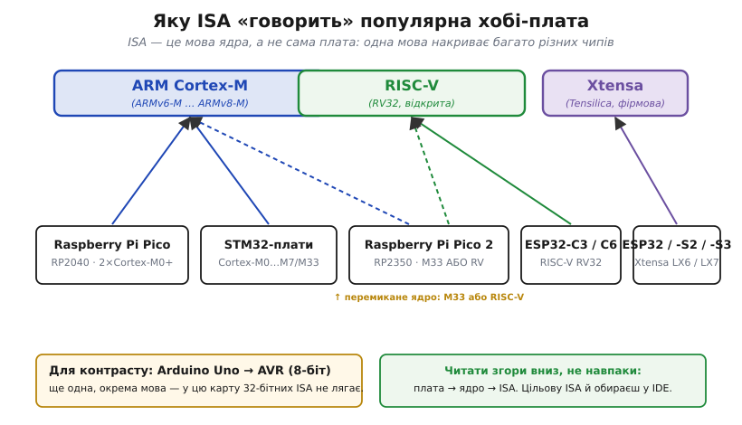
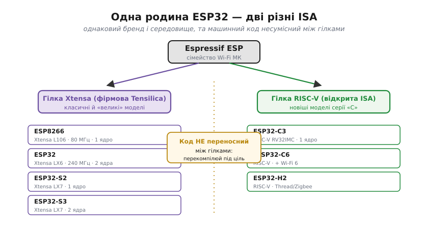
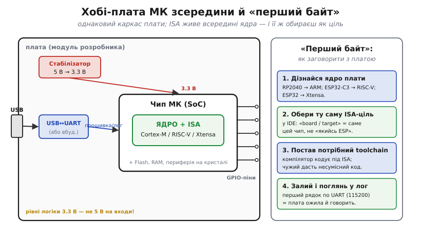

# 🔌 Які ISA живуть у хобі-платах: Xtensa і RISC-V в ESP32, ARM Cortex-M у Pico і STM32

> [ISA — це мова процесора](topic:programming/isa): кожне сімейство ядер має власну, і код доводиться компілювати під конкретну ціль. Ця вставка приземлює абстракцію на ті самі плати, які реально лежать на столі в радіоаматора: **яку саме мову** говорить кожна з них. Розберемо три ISA, що накривають майже весь хобі-світ 32-бітних мікроконтролерів, — **ARM Cortex-M**, **RISC-V** і **Xtensa**, — і навчимося визначати потрібну ще до першого рядка коду.

## Клас пристрою: плата-носій мікроконтролера

Йдеться не про окремий чип, а про цілий **клас** виробів — **плату розробника** (*development board*): готовий модуль, де мікроконтролер уже оточено всім, що потрібно, аби з ним заговорити. Знайомі представники класу — **Raspberry Pi Pico**, плати на **STM32** і вся родина **ESP32**. Зовні вони схожі як близнюки: гребінка GPIO по краях, роз'єм USB з торця, кілька світлодіодів. А от усередині, на головному кристалі, може битися серце геть різної породи — і саме порода ядра задає ISA, тобто мову, якою з платою доведеться розмовляти. Цей клас цінний саме як **жива колекція ISA**: там, де «різні мови процесорів» лишаються переліком назв, кожна тут отримує конкретну плату-носія. Почнімо з головного питання: скільки взагалі цих мов і яка плата якою говорить.

## Карта: яка плата якою мовою говорить

Розмаїття плат лякає, але за ISA вони збираються лише в **три головні родини** — і одного погляду на карту досить, щоб надалі впізнавати будь-яку нову плату за її ядром.


*Згори — три ISA, знизу — плати; стрілка веде плату до її мови. **ARM Cortex-M** накриває найбільше: і **Raspberry Pi Pico** (чип RP2040, два ядра Cortex-M0+), і незліченні плати на **STM32** (ядра Cortex-M0…M7/M33). **RISC-V** — це нові ESP32 серії «C» (**ESP32-C3/C6**). **Xtensa** — класичні **ESP32** і моделі **S** (LX6/LX7). Окремий випадок — **Raspberry Pi Pico 2** (чип RP2350): у ньому ядро **перемикане** між ARM Cortex-M33 і RISC-V. Для контрасту внизу — **Arduino Uno** на **AVR**: ще одна, окрема мова, що в цю карту 32-бітних ISA не лягає.*

Найважливіше тут — **напрям читання**: від плати до ISA, а не навпаки. Назва плати ще не каже мову прямо; її задає **ядро** всередині чипа, і вже воно належить тій чи іншій ISA. Звідси й дві симетричні правди про [ISA](topic:programming/isa): **одна ISA накриває багато різних чипів** (під «ARM Cortex-M» — і Pico, і сотні STM32, і тисячі чужих плат, усі рідня за мовою), і водночас **одна родина може говорити різними ISA** (ESP32 ділиться на гілку Xtensa й гілку RISC-V, а Pico 2 вміщає обидві в одному чипі). Найяскравіше цей поділ видно на родині ESP32 — до неї й придивімося ближче.

### ESP32: один бренд, дві різні мови

Серед хобі-плат ESP32 — чи не найпопулярніша, і саме на ній абстракція «різні ISA» вражає найдужче: під **одним брендом** живуть **дві несумісні мови**.


*Родина ESP від Espressif розпадається на дві гілки за ISA. **Гілка Xtensa** (фірмова ISA від Tensilica) — це історично перші й «великі» моделі: **ESP8266** (ядро Xtensa L106), класичний **ESP32** (Xtensa LX6, два ядра, до 240 МГц), **ESP32-S2/S3** (Xtensa LX7). **Гілка RISC-V** (відкрита ISA) — новіша серія «C»: **ESP32-C3/C6** (а також **H2** для Thread/Zigbee), усі на RISC-V RV32. Машинний код **не переносний між гілками**: програму під ESP32 не залити в ESP32-C3 без перекомпіляції — це, по суті, різні процесори в одному модельному ряду.*

Те, що дві плати з однієї полиці магазину й майже з однаковою назвою («ESP32» і «ESP32-C3») говорять **різними мовами**, — пряме підтвердження того, що [ISA](topic:programming/isa) визначає не бренд і не корпус, а **ядро**. Espressif повела нові чипи на **відкриту** RISC-V (чому це сталося — окрема [історія RISC-V](topic:programming/isa/hist-riscv.md)), але стара гілка Xtensa нікуди не зникла й досі панує в найпоширеніших платах. Практичний підсумок простий: побачивши «ESP32», завжди уточнюйте **повну** назву моделі, бо від літери після неї залежить сама ISA. А щоб дізнатися ядро будь-якої плати, корисно зазирнути їй усередину — на спільний для всього класу каркас.

## Блок-схема плати й розпіновка

Попри різні ISA, **каркас** плати-носія в усього класу той самий — і знаючи його, ви легко знайдете на будь-якій платі те ядро, що задає мову.


*Ліворуч — типова плата зсередини. **Стабілізатор** (*regulator*) опускає 5 В з USB до робочих **3.3 В** ([рівні логіки](topic:electronics/logic-families)). **Міст USB↔UART** перетворює USB на простий послідовний потік, яким зручно прошивати чип і читати від нього лог (на багатьох ESP32 і на Pico він уже всередині чипа). У центрі — **чип МК** (*SoC*, system-on-chip): на одному кристалі **ядро з його ISA** (Cortex-M / RISC-V / Xtensa), а поряд Flash, RAM і периферія. Назовні, на гребінку, виходять **GPIO-піни**. Праворуч — порядок «першого байта».*

Зі схеми легко побачити, **де саме** ховається ISA: вона цілком замкнена в ядрі того чипа в центрі. Решта плати — живлення, міст USB↔UART, гребінка GPIO — від мови процесора **не залежить** узагалі: однаковий стабілізатор і однаковий роз'єм стоять і коло ARM-ядра, і коло RISC-V. Тому-то плати на різних ISA зовні й не відрізниш — мова захована всередині кремнію. Розпіновку (*pinout*) самих GPIO тут навмисно не розписуємо числами: на кожній платі вона своя, живе в її документації й на мову процесора ніяк не впливає. Лишилося справді **заговорити** з платою.

### «Перший байт»: як змусити плату відповісти

Найменша осмислена дія з новою платою — залити крихітну програму й побачити, як вона **відповідає** першим рядком у лог. І ключ до всього — обрати правильну **мову (ISA)** ще до компіляції; решта кроків від ядра вже не залежать. Порядок такий:

```
1. Дізнайся ядро плати   → RP2040 = ARM; ESP32-C3 = RISC-V; ESP32 = Xtensa
2. Обери ISA-ціль в IDE  → «board / target» = саме цей чип (не «якийсь ESP»)
3. Постав toolchain      → компілятор кодує під цю ISA; чужий дасть несумісний код
4. Залий і читай лог     → перший рядок по UART (115200 бод) = плата ожила
```

Перевірка тривіальна: якщо в терміналі побіг осмислений текст (а не мовчанка чи «кракозябри»), мову обрано правильно й плата заговорила. Якщо ж нічого — найперше підозрюйте **не той target**: компілятор видав код чужої ISA, і ядро його просто не розуміє. Це і є «перший байт»: момент, коли гребінка ніжок перетворюється на живий процесор, що відповідає вам своєю мовою.

Зверніть увагу, що крок 2 — це і є те саме «[компілювати під ціль](topic:programming/isa)», тільки тепер цілком конкретно: «ціль» у середовищі розробки — це і є **вибір ISA**. Тут абстрактний контракт мови процесора остаточно змикається з кнопкою в IDE.

## Типові граблі

Більшість бід на стику з платою — не від складності ISA, а від плутанини з мовами й рівнями. Зберемо найчастіші, спираючись на все сказане вище.

- **Залити прошивку не під ту ISA.** Найпідступніше з ESP32: код, зібраний під Xtensa-ESP32, не побіжить на RISC-V-ESP32-C3, хоч обидва «ESP32». Перед компіляцією звіряйте **повну** назву моделі.
- **Сплутати модель усередині родини.** «ESP32» — не одна плата, а гілка; обирайте в IDE саме свій чип (S2, S3, C3, C6…), а не загальний «ESP32».
- **Подати 5 В на вхід 3.3-вольтової плати.** ARM-, RISC-V- і Xtensa-плати майже всі живлять логіку **3.3 В**; 5 В на GPIO може спалити вхід (механізм — у [логічних рівнях родин](topic:electronics/logic-families)). Для стику з 5-вольтовою логікою потрібен [зсувач рівня](topic:electronics/level-shifter).
- **Чекати на лог не на тій швидкості.** Якщо в терміналі «кракозябри», а не текст, — найчастіше розбіжна швидкість UART (типово 115200 бод) або не та плата-ціль.
- **Гадати, що однакова назва = однакова мова.** Бренд і корпус нічого не кажуть про ISA; її задає лише ядро. Завжди дивіться, **яке ядро** в чипі.

## Варіації класу: чим відрізняються три мови

Наостанок — як не плутати самі три мови. **ARM Cortex-M** — найпоширеніша в мікроконтролерах **фірмова** (ліцензована) ISA: на ній і Pico (Cortex-M0+), і майже всі STM32 (від M0 до M7 і M33); вивчивши асемблер однієї Cortex-M-плати, ви розумієте їх усі. **RISC-V** — молода **відкрита** ISA, яку може реалізувати будь-хто без ліцензії; саме тому на неї перейшли нові ESP32-C, а в Pico 2 вона стоїть пліч-о-пліч із ARM. **Xtensa** від Tensilica — **фірмова** ISA класичної лінійки ESP (8266, ESP32, S2/S3).

Звідси й проста стратегія знайомства з новою платою: спершу впізнайте **ядро** (а отже, ISA), потім доберіть під нього **toolchain і target**, і лише тоді пишіть код. А чим ці мови різняться **за духом** (прості однакові команди проти багатшого набору) — це вже інша вісь поділу, [RISC проти CISC](root:embedded/risc-cisc). Для практики ж досить карти вище: за зовнішньою однаковістю хобі-плат ховаються лише три головні мови, і знати, **якою** говорить ваша, — половина успіху.

---

## 📜 Як ESP, Pico і STM32 опинилися на своїх мовах: коротка історія трьох ISA

> Те, що хобі-світ зійшовся саме на **ARM Cortex-M**, **Xtensa** й **RISC-V**, — не випадковість, а наслідок кількох конкретних рішень, ринкових поворотів і колективної праці багатьох команд. Розповідь — про те, **чому** кожна з цих мов опинилася там, де опинилася, а не довідник «хто перший». Глибша [історія самої RISC-V](topic:programming/isa/hist-riscv.md) — в окремій вставці.

## ARM: ліцензована мова, що заповнила мікроконтролери

Чому **ARM Cortex-M** стоїть і в Pico, і майже в усіх STM32 — а отже, у переважній більшості хобі-плат? Відповідь у незвичній бізнес-моделі компанії **Arm** (історично *Acorn RISC Machines*, згодом *Advanced RISC Machines*). Arm сама не випускає чипів: вона **ліцензує** свою ISA та готові ядра іншим виробникам, а ті вже вбудовують їх у власний кремній. У 2004 році Arm випустила **Cortex-M** — лінійку ядер, навмисно заточену під дешеві, економні мікроконтролери. Десятки виробників (зокрема **STMicroelectronics** із її серією **STM32**) ліцензували ці ядра — і так одна ISA розійшлася тисячами різних чипів від різних компаній.

Тут і криється пояснення тієї **симетрії**, чому одна мова накриває стільки різних плат. Це **прямий наслідок** ліцензійної моделі: кожен ліцензіат робить **свій** чип зі своєю периферією, але мова ядра в усіх **та сама** Cortex-M. Тому код, написаний під одну Cortex-M-плату, з невеликими правками їде на іншу — саме та переносність у межах [ISA](topic:programming/isa), яку обіцяє її «контракт». Коли **Raspberry Pi** робила свій перший мікроконтролерний чип **RP2040** (плата Pico, 2021), вона теж не винаходила мову з нуля, а ліцензувала готові ядра Cortex-M0+ — найекономніший варіант лінійки. Так Pico від першого дня заговорив тією самою мовою, що й тисячі плат до нього.

## Xtensa в ESP: чому Espressif почала з фірмової мови

А чому тоді найпопулярніший Wi-Fi-мікроконтролер — **ESP** від шанхайської **Espressif** — пішов не на ARM, а на **Xtensa**? Тут історія інша. **Xtensa** — це ISA від компанії **Tensilica** (заснована 1997 року), що продавала не просто ядро, а **конфігурований** процесор: замовник міг додати під свою задачу власні інструкції. Для Espressif, що робила дешевий чип із вбудованим радіо, таке настроюване ядро виявилося зручним вибором, і перший хіт компанії — **ESP8266** (2014) — вийшов на ядрі Xtensa **L106**. Наступний, набагато потужніший **ESP32** (2016), лишився в тій самій родині — два ядра Xtensa **LX6**, — а за ним і моделі **S2/S3** на **LX7**. Так уся класична лінійка ESP історично «розмовляє» Xtensa.

Варто чесно відзначити, що **Xtensa — не власна розробка Espressif**: це ліцензована в Tensilica мова (а саму Tensilica згодом, 2013 року, придбала **Cadence**). Espressif тут — не творець ISA, а той, хто вдало **застосував** чужу мову у вкрай вдалому й дешевому чипі з радіо. Це типовий для електроніки розподіл ролей: одні створюють [ISA](topic:programming/isa) (Tensilica), інші будують на ній масовий продукт (Espressif). Саме тому, до речі, екосистема ESP довго була прив'язана до специфічного, не зовсім стандартного інструментарію Xtensa — і ця незручність стане однією з причин пізнішого повороту.

## RISC-V: чому Espressif і Raspberry Pi додали відкриту мову

Найсвіжіший поворот — поява **RISC-V** у нових ESP та в Pico 2. Чому обидва виробники, уже маючи робочі ISA, потяглися до ще однієї? Бо RISC-V — **відкрита** ISA, яку можна реалізувати **без ліцензійних відрахувань**, на відміну від ARM і Xtensa (її витоки — Берклі, близько 2010 року; детально — в [історії RISC-V](topic:programming/isa/hist-riscv.md)). Для виробника це означає свободу й економію: можна будувати власні ядра, нікому не платячи за мову. Espressif першою серед хобі-брендів зробила гучний крок — повела нову серію **ESP32-C** (з **ESP32-C3**, 2020–2021) на RISC-V замість Xtensa. Так у межах однієї родини ESP виник той самий **розкол на дві мови**.

Невдовзі приєдналася й **Raspberry Pi**: її чип **RP2350** (плата **Pico 2**, 2024) уперше отримав **подвійну** натуру — на кристалі і ядра ARM Cortex-M33, і відкриті RISC-V-ядра **Hazard3**, між якими можна перемикатися. Тут варто назвати конкретний внесок: ядро Hazard3 спроєктував інженер **Люк Рен** (*Luke Wren*) — це показовий приклад того, як **відкритість** ISA дозволяє вбудувати в комерційний чип ядро, розроблене фактично однією людиною й оприлюднене відкрито. Поставити поряд дві мови в одному чипі Raspberry Pi змогла саме тому, що одну з них (RISC-V) **не треба ліцензувати**. (Точні мотиви, чому Raspberry Pi пішла на подвійне ядро саме тоді, лежать у площині стратегії компанії й тут **(перевірити)**.)

Звідси й висновок усієї історії, який варто тримати в голові, дивлячись на карту хобі-плат: розкладка ISA по платах — це **відбиток бізнес-моделей**, а не лише техніки. **ARM Cortex-M** панує в мікроконтролерах, бо Arm зручно **ліцензує** ядра сотням виробників (звідси Pico і STM32 однією мовою). **Xtensa** сидить у класичних ESP, бо колись Espressif обрала цю **конфігуровану** ліцензовану мову для свого радіочипа. А **RISC-V** проростає в нових ESP і в Pico 2, бо вона **відкрита** й вільна від відрахувань. Читаючи, якою мовою говорить плата, ви насправді читаєте коротку історію того, **хто, коли і на яких умовах** дав цій платі її ядро.
