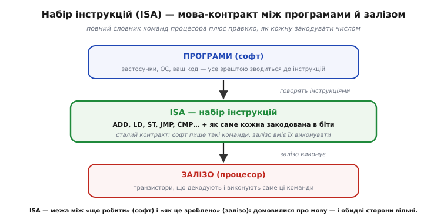
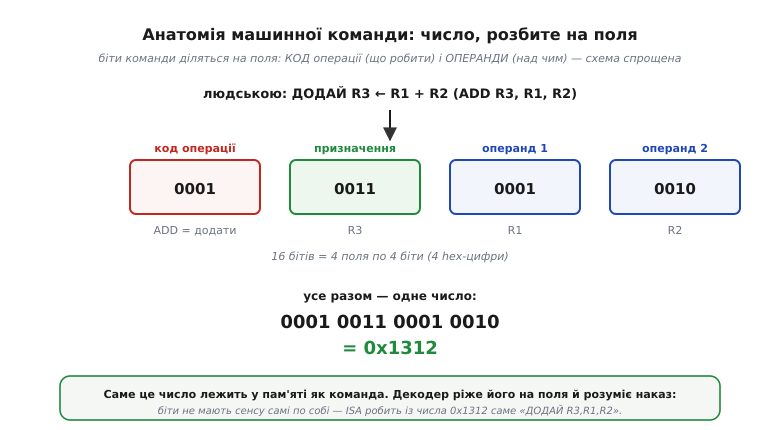
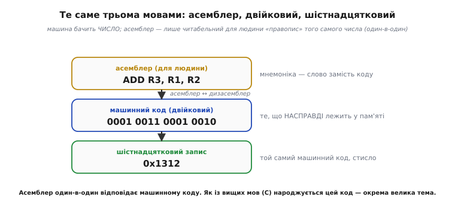
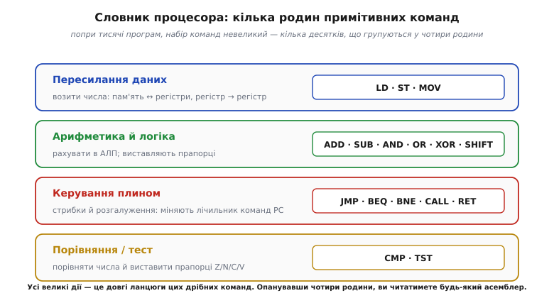
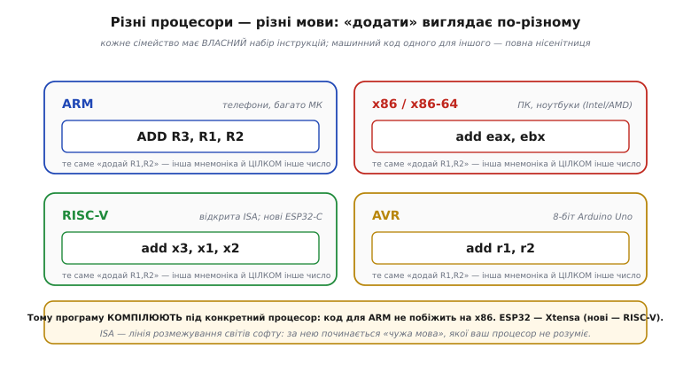
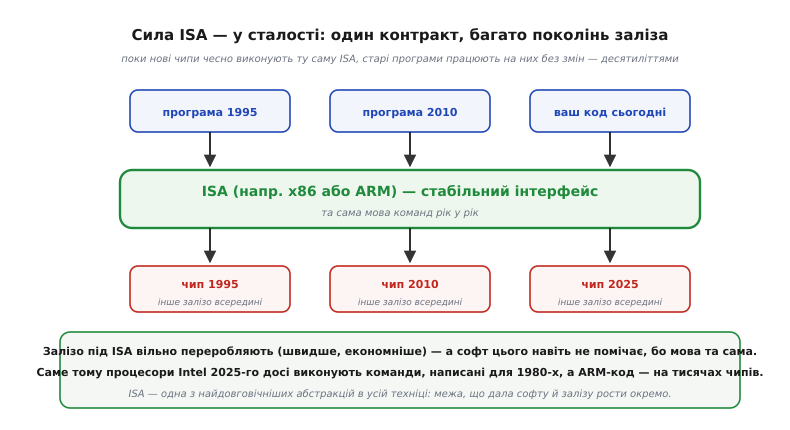

# Набір інструкцій (ISA)

Коли [декодер читає команду](topic:programming/fetch-decode-execute) «за домовленістю», цю домовленість можна назвати на ім'я: **набір інструкцій**, або **ISA** (англ. *Instruction Set Architecture* — «архітектура набору команд»). Це — повний **словник** команд, які процесор уміє виконувати, разом із точним правилом, **як** кожна команда записана числом. Інакше кажучи, ISA — це **мова** процесора: усе, що йому можна наказати, і як ці накази закодувати в біти. Тут сходяться дві ідеї — [кодування чисел бітами](topic:math/why-binary) і [виконання команд процесором](topic:programming/what-is-processor): команда — це теж число, а ISA — домовленість, що робить із числа наказ. Стаття — про цю мову: як команда влаштована всередині, чим машинний код різниться від асемблера, які бувають родини команд, чому кожен процесор говорить **своєю** мовою — і чому ця мова виявляється однією з найдовговічніших речей у всій техніці.

### ISA — контракт між софтом і залізом

Найкорисніше думати про ISA як про **контракт** — узгоджену межу між двома світами.


*Згори — **програми** (ваш код, операційна система, застосунки); зрештою все це зводиться до інструкцій. Знизу — **залізо**: транзистори, що декодують і виконують команди. Між ними — **ISA**: повний набір команд (ADD, LD, ST, JMP, CMP…) і правило їхнього кодування. Софт «говорить» цими командами, залізо вміє їх виконувати. Домовившись про мову, обидві сторони стають вільні: програміст не мусить знати, як саме збудований процесор, а інженер — які програми на ньому крутитимуться.*

Це і є головна цінність ISA — вона **розділяє** два світи. Програмісту достатньо знати **мову** (які команди є й що вони роблять), а не внутрішню будову кремнію. Інженеру-схемотехніку достатньо чесно **виконувати** цю мову, а не знати, які програми писатимуть. ISA — це немов спільна мова між замовником і виконавцем: домовилися про слова — і далі кожен робить своє. Саме ця домовленість дає обом сторонам величезну свободу.

### Команда — це число, розбите на поля

Зазирнімо всередину однієї команди. Команда — це число; подивімося, **як** у цьому числі закодовано наказ.


*Команда «ДОДАЙ R3 ← R1 + R2» закодована числом, біти якого поділені на **поля**. Перше поле — **код операції** (англ. *opcode*, від *operation code*): 0001 означає «додати». Решта полів — **операнди**: куди покласти результат (R3), що додавати (R1 і R2). Тут — спрощена 16-бітна схема: чотири поля по 4 біти. Усі разом дають одне число: 0001 0011 0001 0010 = **0x1312**. Саме воно лежить у пам'яті як команда, і саме його декодер ріже на поля.*

Ось де остаточно змикається головна думка про двійкове кодування: [біти не мають вродженого сенсу — сенс їм надає домовленість](topic:math/why-binary). Число 0x1312 саме по собі — просто число. Та за домовленістю **ISA** його старші біти читаються як «яка операція», молодші — як «над якими регістрами», і число стає наказом «ДОДАЙ R3,R1,R2». [Декодування](topic:programming/fetch-decode-execute) — це і є застосування цієї домовленості: розрізати число на поля й увімкнути відповідні дроти. (16-бітна команда — це рівно чотири [hex-цифри](topic:programming/bits-bytes-endianness), і кожна тут — окреме поле, що робить 0x1312 таким зручним для читання. Реальні ISA кодують складніше, та принцип той самий: команда — число з полів.)

Це «розрізання на поля» — не метафора, а буквально кілька зсувів і масок. **Декодуймо 0x1312 за нашою 4×4-бітною домовленістю** так, як це робив би декодер — звичайним C:

:::tabs
```cpp
uint16_t instr = 0x1312;                 // команда, прочитана з пам'яті
uint8_t op  = (instr >> 12) & 0xF;       // старші 4 біти — код операції
uint8_t rd  = (instr >>  8) & 0xF;       // куди покласти результат
uint8_t rs1 = (instr >>  4) & 0xF;       // перший доданок
uint8_t rs2 = (instr >>  0) & 0xF;       // другий доданок
// op=0x1 (ADD), rd=3, rs1=1, rs2=2  →  «ДОДАЙ R3 ← R1 + R2»
```
```python
instr = 0x1312                    # команда, прочитана з пам'яті
op  = (instr >> 12) & 0xF         # старші 4 біти — код операції
rd  = (instr >>  8) & 0xF         # куди покласти результат
rs1 = (instr >>  4) & 0xF         # перший доданок
rs2 = (instr >>  0) & 0xF         # другий доданок
# op=0x1 (ADD), rd=3, rs1=1, rs2=2  →  «ДОДАЙ R3 ← R1 + R2»
```
:::

Зсув підводить потрібне поле до молодшого краю, маска `& 0xF` лишає від нього самі чотири біти — і число розпадається на `op=1, rd=3, rs1=1, rs2=2`. Це і є вся суть декодування: домовленість ISA, записана зсувами й масками. Реальний декодер робить те саме в кремнії й для складніших форматів, але ідея незмінна — поля живуть на фіксованих позиціях числа.

### Асемблер: читабельний правопис машинного коду

Писати програми числами на кшталт 0x1312 — пекло. Тому ту саму команду записують **словами**.


*Одна команда у трьох виглядах. **Асемблер** — `ADD R3, R1, R2` — людська мнемоніка (слово замість коду). **Машинний код** — `0001 0011 0001 0010` — те, що насправді лежить у пам'яті. **Шістнадцятковий** — `0x1312` — той самий машинний код, лише стисло. Програма-**асемблер** перекладає мнемоніки в числа, а **дизасемблер** — назад. Машина бачить тільки число; асемблер — це читабельний для людини «правопис» того самого числа, один-в-один.*

Варто наголосити: **асемблер** (*assembly language*) не є якоюсь окремою мовою «над» машинним кодом — це **той самий** машинний код, лише записаний словами замість чисел, рядок-у-рядок. `ADD R3,R1,R2` і `0x1312` — це одне й те саме, у різному вбранні. Саме тому асемблер — найнижча мова, якою ще пише людина: нижче вже самі числа. (А як із зрозумілих людині **вищих** мов, як-от C, народжується цей машинний код, — це окрема велика історія [компіляції](topic:programming/compilation). Головне просте: що б ви не написали, зрештою воно стає числами-командами ISA.)

### Словник процесора: родини команд

Скільки ж усього команд у мові процесора? На диво **небагато** — кілька десятків, що групуються в кілька родин.


*Майже всі команди будь-якого процесора падають у чотири родини. **Пересилання даних** (LD, ST, MOV) — возити числа між пам'яттю й регістрами. **Арифметика й логіка** (ADD, SUB, AND, OR, XOR, зсуви) — рахувати в [АЛП](topic:programming/processor-parts). **Керування плином** (JMP, BEQ, BNE, CALL, RET) — стрибки й розгалуження, що міняють PC. **Порівняння/тест** (CMP, TST) — виставити [прапорці Z/N/C/V](topic:programming/overflow-wraparound). Попри тисячі програм, сам словник крихітний.*

Це пряме підтвердження ключової думки: [процесор знає **мало** примітивів](topic:programming/what-is-processor), а вся складність — у тому, як їх скласти в довгі ланцюги. Опанувавши ці чотири родини, ви, по суті, розумієте асемблер **будь-якого** процесора — бо хоч мнемоніки й кодування різняться, набір **ідей** усюди той самий: перенеси, порахуй, порівняй, стрибни. Це невеличкий, осяжний людиною словник — і з нього збудовано геть усе програмне забезпечення на світі.

### Різні процесори — різні мови

А тепер важлива практична правда: ISA **не одна**. Кожне сімейство процесорів має **власний** набір інструкцій.


*Та сама дія «додати два числа» різними мовами: **ARM** — `ADD R3,R1,R2`; **x86** — `add eax,ebx`; **RISC-V** — `add x3,x1,x2`; **AVR** (Arduino Uno) — `add r1,r2`. Різняться не лише мнемоніки — **цілком** різне кодування числами: машинний код для ARM на x86 — суцільна нісенітниця. Тому програму **компілюють** під конкретний процесор. ESP32 побудований на ядрах Xtensa (а новіші моделі серії C — на RISC-V).*

Ось чому ви не можете взяти готову програму з ПК (x86) і просто залити її в мікроконтролер (ARM чи Xtensa) — це **різні мови**, і число-команда однієї для іншої безглузда. Програму треба [**скомпілювати**](topic:programming/compilation) саме під ту ISA, на якій вона працюватиме (звідси й вибір «плати-цілі» в середовищі розробки). ISA — це лінія розмежування світів софту: за нею починається чужа мова, якої ваш процесор просто не розуміє. Чим саме мови різняться по **духу** — прості й однакові команди (англ. *RISC*, *Reduced Instruction Set Computer* — «комп'ютер зі скороченим набором команд») проти складних і різнокаліберних (*CISC*, *Complex Instruction Set Computer* — «зі складним набором») — це окрема тема, [RISC проти CISC](root:embedded/risc-cisc).

### Сила ISA — у сталості

Наостанок — найглибша властивість ISA, заради якої її варто оцінити. ISA — це не просто мова, а **довговічний контракт**, що дає софту й залізу розвиватися **окремо**.


*ISA посередині — стабільний інтерфейс. Згори — програми різних років; знизу — чипи різних поколінь. Поки кожен новий чип чесно виконує **ту саму** ISA, старі програми працюють на ньому **без змін**. Залізо під ISA можна як завгодно переробляти — швидше, економніше, з мільярдами нових транзисторів, — а софт цього навіть не помічає, бо мова команд та сама. Тому процесори Intel 2025 року досі виконують команди, написані в 1980-х, а той самий ARM-код працює на тисячах різних чипів.*

Це — одна з найпотужніших абстракцій в усій техніці. **Контракт** ISA розв'язує руки обом сторонам: інженери щороку переробляють кремній (швидше, менше енергії, нові хитрощі — кеші, конвеєри), не ламаючи **жодної** наявної програми; а програмісти пишуть код, не знаючи й не переймаючись, на якому саме чипі він колись побіжить. Без сталої ISA кожне нове залізо вимагало б переписувати весь софт — як за часів ENIAC, що його доводилося фізично перекомутовувати дротами під кожну нову задачу. ISA — це межа, що дала програмному й апаратному світам **рости незалежно** десятиліттями. У цьому її справжня велич — не в конкретних командах, а в **стабільності** домовленості.

> 🔧 **Навіщо це.** ISA — поняття, що прямо стосується вашої щоденної роботи, навіть якщо ви ніколи не писатимете асемблером. Перше: коли ви обираєте «плату» чи «ціль» у середовищі розробки, ви насправді обираєте **ISA**, під яку компілювати; код для ESP32 (Xtensa) не побіжить на Arduino Uno (AVR) — це різні мови. Друге: розуміння, що команда — це **число з полів** (opcode + операнди), знадобиться, коли ви заглядатимете в дизасембльований код чи налагоджуватимете на низькому рівні — ви бачитимете саме ці поля. Третє: **асемблер = машинний код словами**; коли компілятор покаже вам асемблерний вивід, знайте, що це буквально те, що виконає процесор, один-в-один. Четверте, найважливіше концептуально: **ISA — стабільний контракт**, тому ваш код переживе залізо; і навпаки — той самий код треба перекомпілювати під іншу ISA. Тримайте в голові цю межу між «мовою» (ISA) і «залізом, що її виконує» — вона пояснює і чому програми переносні в межах однієї ISA, і чому не переносні між різними.

---

Коротко про головне: **набір інструкцій (ISA)** — це мова процесора, повний словник команд, які він уміє, плюс правило, **як** кожна закодована числом. Команда — це число, поділене на **поля**: **код операції** (opcode — що робити) і **операнди** (над чим); [декодер](topic:programming/fetch-decode-execute) ріже число на ці поля. Це пряме втілення ідеї, що [сенс бітам надає домовленість](topic:math/why-binary): ISA робить із числа (0x1312) наказ (ДОДАЙ R3,R1,R2). **Асемблер** — той самий машинний код, записаний читабельними мнемоніками (один-в-один), найнижча людська мова. Команди групуються в кілька **родин**: пересилання даних, арифметика/логіка, керування плином, порівняння — словник невеликий, попри безмежжя програм. Кожне сімейство процесорів має **власну** ISA (ARM, x86, RISC-V, AVR, Xtensa ESP32), тож код **компілюють** під ціль. А найцінніше — ISA є **сталим контрактом**: поки нові чипи виконують ту саму ISA, старий софт працює без змін, і залізо та софт ростуть незалежно.

---
